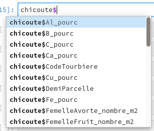

--- 
site: bookdown::bookdown_site
output: bookdown::gitbook 
---

# Organisation des données et opérations sur des tableaux {#chapitre-tableaux}

***

\ **Objectifs spécifiques**:

À la fin de ce chapitre, vous

- comprendrez les règles guidant la création et la gestion des tableaux,
- saurez importer et exporter des données et
- saurez effectuer des opérations en cascade avec le module tidyverse, dont
- des filtres sur les lignes,
- des sélections de colonnes,
- des sommaires statistiques et
- des jointures entre tableaux.

***

Les données sont utilisées à chaque étape dans les flux de travail en sciences. Elles alimentent l'analyse et la modélisation. Les résultats qui en découlent sont aussi des données qui peuvent alimenter les travaux subséquents. Une bonne organisation des données facilitera le flux de travail.

> **Dicton**. Proportions de temps voué au calcul scientifique : 80 % de nettoyage de données mal organisées, 20 % de calcul.

Qu'est-ce qu'une donnée ? De manière abstraite, il s'agit d'une valeur associée à une variable. Une variable peut être une dimension, une date, une couleur, le résultat d'un test statistique, à laquelle on attribue la valeur quantitative ou qualitative d'un chiffre, d'une chaîne de caractère, d'un symbole conventionné, etc. Par exemple, lorsque vous commandez un café *latte* végane, *au latte* est la valeur que vous attribuez à la variable *type de café*, et *végane* est la valeur de la variable *type de lait*.

L'exemple est peut-être horrible. J'ai besoin d'un café...


Ce chapitre traite de l'importation, l'utilisation et l'exportation de données structurées, en R, sous forme de vecteurs, matrices, tableaux et ensemble de tableaux (bases de données).

Bien qu'il soit toujours préférable d'organiser les structures qui accueilleront les données d'une expérience avant-même de procéder à la collecte de données, l'analyste doit s'attendre à réorganiser ses données en cours de route. Or, des données bien organisées au départ faciliteront aussi leur réorganisation.

Ce chapitre débute avec quelques définitions : les données, les matrices, les tableaux et les bases de données, ainsi que leur signification en R. Puis nous verrons comment organiser un tableau selon quelques règles simples, mais importantes pour éviter les erreurs et les opérations fastidieuses pour reconstruire un tableau mal conçu. Ensuite, nous traiterons des formats de tableau courant, pour enfin passer à l'utilisation de [**`dplyr`**](https://dplyr.tidyverse.org/), le module du *tidyverse* pour effectuer des opérations sur les tableaux.

## Les collections de données

Dans le chapitre \@ref(chapitre-intro-a-R), nous avons survolé différents types d'objets : réels, entiers, chaînes de caractères et booléens. Les données peuvent appartenir à d'autres types : dates, catégories ordinales (ordonnées : faible, moyen, élevé) et nominales (non ordonnées : espèces, cultivars, couleurs, unité pédologique, etc.). Comme mentionné en début de chapitre, une donnée est une valeur associée à une variable. Les données peuvent être organisées en collections.

Nous avons aussi vu au chapitre \@ref(chapitre-intro-a-R) que la manière privilégiée d'organiser des données était sous forme de **tableaux**. De manière générale, un tableau de données est une organisation de données en deux dimensions, comportant des *lignes* et des *colonnes*. Il est préférable de respecter la convention selon laquelle **les lignes sont des observations et les colonnes sont des variables**. Ainsi, un tableau est une liste de vecteurs de même longueur, chaque vecteur représentant une variable. Chaque variable est libre de prendre le type de données approprié. La position d'une donnée dans le vecteur correspond à une observation. Lorsque les vecteurs sont posés les uns à côté des autres, la position dans le vecteur devient une ligne qui définit les valeurs des variables d’une observation.

Imaginez que vous consignez des données météorologiques comme les précipitations totales ou la température moyenne pour chaque jour, pendant une semaine sur les sites A, B et C. Chaque site possède ses propres caractéristiques, comme la position en longitude-latitude. Il est redondant de répéter la position du site pour chaque jour de la semaine. Vous préférerez créer deux tableaux : un pour décrire vos observations, et un autre pour décrire les sites. De cette manière, vous créez une collection de tableaux interreliés : une **base de données**. Nous couvrirons cette notion un peu plus loin. R peut soutirer des données des bases de données grâce au module DBI, qui n'est pas couvert à ce stade de développement du cours.

Dans R, les données structurées en tableaux, ainsi que les opérations sur les tableaux, peuvent être gérés grâce aux modules **`readr`**, **`dplyr`** et **`tidyr`**, tous des modules faisant partie du méta-module **`tidyverse`**, qui est un genre de Microsoft Office sur R : plusieurs modules fonctionnant en interopérabilité. Mais avant de se lancer dans l'utilisation de ces modules, voyons quelques règles à suivre pour bien structurer ses données en format *tidy*, un jargon du *tidyverse* qui signifie *proprement organisé*.

## Organiser un tableau de données

Afin de repérer chaque cellule d'un tableau, on attribue à chaque ligne et à chaque colonne un identifiant *unique*, que l'on nomme *indice* pour les lignes et *entête* pour les colonnes.

> **Règle no 1.** Une variable par colonne, une observation par ligne, une valeur par cellule.

Les unités expérimentales sont décrits par une ou plusieurs variables par des chiffres ou des lettres. Chaque variable devrait être présente en une seule colonne, et chaque ligne devrait correspondre à une unité expérimentale où ces variables ont été mesurées. La règle parait simple, mais elle est rarement respectée. Prenez par exemple le tableau suivant.

```{r tab-exwide, echo = FALSE}
library("tidyverse")
extab_wide <- tibble(
  Site = c("Sainte-Souris", "Sainte-Fourmi", "Saint-Ours"),
  `Traitement A` = c(4.1, 5.8, 2.9),
  `Traitement B` = c(8.2, 5.9, 3.4),
  `Traitement C` = c(6.8, NA, 4.6)
)
knitr::kable(
  extab_wide,
  caption = "Rendements obtenus sur les sites expérimentaux selon les traitements.", booktabs = TRUE
)
```

Qu'est-ce qui cloche avec ce tableau? Chaque ligne est une observation, mais contient plusieurs observations d'une même variable, le rendement, qui devient étalé sur plusieurs colonnes. *À bien y penser*, le type de traitement est une variable et le rendement en est une autre:

```{r tab-exlong, echo = FALSE}
extab_long <- extab_wide %>%
  pivot_longer(cols = -Site, names_to = "Traitement", values_to = "Rendement")
knitr::kable(
  extab_long,
  caption = "Rendements obtenus sur les sites expérimentaux selon les traitements.", booktabs = TRUE
)
```

Plus précisément, l'expression *à bien y penser* suggère une réflexion sur la signification des données. Certaines variables peuvent parfois être intégrées dans une même colonne, parfois pas. Par exemple, les concentrations en cuivre, zinc et plomb dans un sol contaminé peuvent être placés dans la même colonne "Concentration" ou déclinées en plusieurs colonnes Cu, Zn et Pb. La première version trouvera son utilité pour des créer des graphiques (chapitre 3), alors que la deuxième favorise le traitement statistique (chapitre 5). Il est possible de passer d'un format à l'autre grâce à la fonction `pivot_longer()` et `pivot_wider()` du module tidyr.

> **Règle no 2.** Un tableau par unité observationnelle: ne pas répéter les informations.

Reprenons la même expérience. Supposons que vous mesurez la précipitation à l'échelle du site.

```{r tab-exlong-prec, echo = FALSE}
extab_long_prec <- extab_long %>%
  mutate(`Précipitations` = c(813, 813, 813, 642, 642, 642, 1028, 1028, 1028))
knitr::kable(
  extab_long_prec,
  caption = "Rendements et précipitations obtenus sur les sites expérimentaux selon les traitements.", booktabs = TRUE
)
```

Segmenter l'information en deux tableaux serait préférable.

```{r tab-prec, echo = FALSE}
extab_wide <- tibble(
  Site = c("Sainte-Souris", "Sainte-Fourmi", "Saint-Ours"),
  `Précipitations` = c(813, 642, 1028)
)
knitr::kable(
  extab_wide,
  caption = "Précipitations sur les sites expérimentaux.", booktabs = TRUE
)
```

Les tableaux \@ref(tab:tab-exlong) et \@ref(tab:tab-prec), ensemble, forment une base de données (collection organisée de tableaux). Les opérations de fusion entre les tableaux peuvent être effectuées grâce aux fonctions de jointure (`left_join()`, par exemple) du module **`tidyr`**. Une jointure de \@ref(tab:tab-prec) vers \@ref(tab:tab-exlong) donnera le tableau \@ref(tab:tab-exlong-prec).

> **Règle no 3.** Ne pas bousiller les données.

Par exemple.

- *Ajouter des commentaires dans des cellules*. Si une cellule mérite d'être commentée, il est préférable de placer les commentaires soit dans un fichier décrivant le tableau de données, soit dans une colonne de commentaire juxtaposée à la colonne de la variable à commenter. Par exemple, si vous n'avez pas mesure le pH pour une observation, n'écrivez pas "échantillon contaminé" dans la cellule, mais annoter dans un fichier d'explication que l'échantillon no X a été contaminé. Si les commentaires sont systématiques, il peut être pratique de les inscrire dans une colonne `commentaire_pH`.
- *Inscription non systématique*. Il arrive souvent que des catégories d'une variable ou que des valeurs manquantes soient annotées différemment. Il arrive même que le séparateur décimal soit non systématique, parfois noté par un point, parfois par une virgule. Par exemple, une fois importés dans votre session, les catégories `St-Ours` et `Saint-Ours` seront traitées comme deux catégories distinctes. De même, les cellules correspondant à des valeurs manquantes ne devraient pas être inscrite parfois avec une cellule vide, parfois avec un point, parfois avec un tiret ou avec la mention `NA`. Le plus simple est de laisser systématiquement ces cellules vides.
- *Inclure des notes dans un tableau*. La règle "une colonne, une variable" n'est pas respectée si on ajoute des notes un peu n'importe où sous ou à côté du tableau.
- *Ajouter des sommaires*. Si vous ajoutez une ligne sous un tableau comprenant la moyenne de chaque colonne, qu'est-ce qui arrivera lorsque vous importerez votre tableau dans votre session de travail? La ligne sera considérée comme une observation supplémentaire.
- *Inclure une hiérarchie dans les entêtes*. Afin de consigner des données de texture du sol, comprenant la proportion de sable, de limon et d'argile, vous organisez votre entête en plusieurs lignes. Une ligne pour la catégorie de donnée, *Texture*, fusionnée sur trois colonnes, puis trois colonnes intitulées *Sable*, *Limon* et *Argile*. Votre tableau est joli, mais il ne pourra pas être importé conformément dans un votre session de calcul : on recherche *une entête unique par colonne*. Votre tableau de données devrait plutôt porter les entêtes *Texture sable*, *Texture limon* et *Texture argile*. Un conseil : réserver le travail esthétique à la toute fin d'un flux de travail.

## Formats de tableau

Plusieurs outils sont à votre disposition pour créer des tableaux. Je vous présente ici les plus communs.

### *xls* ou *xlsx*

Microsoft Excel est un logiciel de type *tableur*, ou chiffrier électronique. L'ancien format *xls* a été remplacé par le format *xlsx* avec l'arrivée de Microsoft Office 2010. Il s'agit d'un format propriétaire, dont l'alternative libre la plus connue est le format *ods*, popularisé par la suite bureautique LibreOffice. Les formats *xls*, *xlsx* ou *ods* sont davantage utilisés comme outils de calcul que d'entreposage de données. Ils contiennent des formules, des graphiques, du formatage de cellule, etc. *Je ne les recommande pas pour stocker des données*.

### *csv*

Le format *csv*, pour *comma separated values*, est un fichier texte, que vous pouvez ouvrir avec n'importe quel éditeur de texte brut (Bloc note, [VSCode](https://code.visualstudio.com/), [Atom](https://atom.io), [Notepad++](https://notepad-plus-plus.org), etc.). Chaque colonne doit être délimitée par un caractère cohérent (conventionnellement une virgule, mais en français un point-virgule ou une tabulation pour éviter la confusion avec le séparateur décimal) et chaque ligne du tableau est un retour de ligne. Il est possible d'ouvrir et d'éditer les fichiers csv dans un éditeur texte, mais il est plus pratique de les ouvrir avec des tableurs (LibreOffice Calc, Microsoft Excel, Google Sheets, etc.).

**Encodage des fichiers texte**. Puisque le format *csv* est un fichier texte, un souci particulier doit être porté sur la manière dont le texte est encodé. Les caractères accentués pourrait être importé incorrectement si vous importez votre tableau en spécifiant le mauvais encodage. Pour les fichiers en langues occidentales, l'encodage UTF-8 devrait être utilisé. Toutefois, par défaut, Excel utilise un encodage de Microsoft. Si le *csv* a été généré par Excel, il est préférable de l'ouvrir avec votre éditeur texte et de l'enregistrer dans l'encodage UTF-8.

### *json*

Comme le format *csv*, le format *json* indique un fichier en texte clair. En permettant des structures de tableaux emboîtés et en ne demandant pas que chaque colonne ait la même longueur, le format *json* permet plus de souplesse que le format *csv*, mais il est plus compliqué à consulté et prend davantage d’espace sur le disque que le *csv*. Il est utilisé davantage pour le partage de données des applications web, mais en ce qui concerne la matière du cours, ce format est surtout utilisé pour les données géoréférencées. L'encodage est géré de la même manière qu'un fichier *csv*.

### SQLite

SQLite est une application pour les bases de données relationnelles de type SQL qui n'a pas besoin de serveur pour fonctionner. Les bases de données SQLite sont encodés dans des fichiers portant l'extension *db*, qui peuvent être facilement partagés.

### Suggestion

En *csv* pour les petits tableaux, en *sqlite* pour les bases de données plus complexes. Ce cours se concentre toutefois sur les données de type *csv*.

## Entreposer ses données

La manière la plus sécurisée pour entreposer ses données est de les confiner dans une base de données sécurisée sur un serveur sécurisé dans un environnement sécurisé et d'encrypter les communications. C'est aussi... la manière la moins accessible. Des espaces de stockage nuagiques, comme Dropbox ou d'autres [options similaires](https://alternativeto.net/software/dropbox/), peuvent être pratiques pour les backups et le partage des données avec une équipe de travail (qui risque en retour de bousiller vos données). Le suivi de version est possible chez certains fournisseurs d'espace de stockage. Mais pour un suivi de version plus rigoureux, les espaces de développement (comme GitHub et GitLab) sont plus appropriés (couverts au chapitre \@ref(chapitre-git)). Dans tous les cas, il est important de garder (1) des copies anciennes pour y revenir en cas d'erreurs et (2) un petit fichier décrivant les changements effectués sur les données.

## Manipuler des données en mode tidyverse

Le méta-module **`tidyverse`** regroupe une collection de précieux modules pour l'analyse de données en R. Il permet d'importer des données dans votre session de travail avec **`readr`**, de les explorer avec le module de visualisation **`ggplot2`**, de les transformer avec **`tidyr`** et **`dplyr`** et de les exporter avec **`readr`**. Les tableaux de classe `data.frame`, comme ceux de la plus moderne classe `tibble`, peuvent être manipulés à travers le flux de travail pour l'analyse et la modélisation. Comme c'était le cas pour le chapitre sur la visualisation, ce chapitre est loin de couvrir les nombreuses fonctionnalités qui sont offertes dans le *tidyverse*.

### Importer vos données dans votre session de travail

Supposons que vous avec bien organisé vos données en mode *tidy*. Pour les importer dans votre session et commencer à les inspecter, vous lancerez une des commandes du module **`readr`**, décrites dans la documentation dédiée.

- ` read_csv()` si le séparateur de colonne est une virgule
- ` read_csv2()` si le séparateur de colonne est un point-virgule et que le séparateur décimal est une virgule
- ` read_tsv()` si le séparateur de colonne est une tabulation
- ` read_table()` si le séparateur de colonne est un espace blanc
- ` read_delim()` si le séparateur de colonne est un autre caractère (comme le point-virgule) que vous spécifierez dans l'argument `delim = ";"`

Les principaux arguments sont les suivants.

- `file`: le chemin vers le fichier. Ce chemin peut aussi bien être une adresse locale (data/...) qu'une adresse internet (https://...).
- `delim`: le symbole délimitant les colonnes dans le cas de `read_delim`.
- `col_names`: si TRUE, la première ligne est l'entête du tableau, sinon FALSE. Si vous spécifiez un vecteur numérique, ce sont les numéros des lignes utilisées pour le nom de l'entête. Si vous utilisez un vecteur de caractères, ce sont les noms des colonnes que vous désirez donner à votre tableau.
- `na`: le symbole spécifiant une valeur manquante. L'argument `na=''` signifie que les cellules vides sont des données manquantes. Si les valeurs manquantes ne sont pas uniformes, vous pouvez les indiquer dans un vecteur, par exemple `na = c("", "NA", "NaN", ".", "-")`.
- `local`: cet argument prend une fonction `local()` qui peut inclure des arguments de format de temps, mais aussi d'encodage ([voir documentation](https://readr.tidyverse.org/reference/locale.html))

D'autres arguments peuvent être spécifiés au besoin, et les répéter ici dupliquerait l'information de la documentation de [la fonction `read_csv` de readr](https://readr.tidyverse.org/reference/read_delim.html).

Je déconseille d'importer des données en format xls ou xlsx. Si toutefois cela vous convient, je vous réfère au module [readxl](https://readxl.tidyverse.org/).

L'[aide-mémoire de readr](https://github.com/rstudio/cheatsheets/raw/master/data-import.pdf) (figure \@ref(fig:tab-readr-cheatsheet)) est à afficher près de soi.

```{r tab-readr-cheatsheet, out.width="100%", fig.align="center", fig.cap="Aide-mémoire de readr, Source: https://github.com/rstudio/cheatsheets/raw/master/data-import.pdf", echo = FALSE}
knitr::include_graphics("images/04_data-import-cs.png")
```

Nous allons charger des données de culture de la chicouté (*Rubus chamaemorus*), un petit fruit nordique, tiré de Parent et al. (2013). Ouvrons d'abord le fichier pour vérifier les séparateurs de colonne et de décimale (figure \@ref(fig:tab-csv)).

```{r tab-csv, out.width="100%", fig.align="center", fig.cap="Aperçu brut d'un fichier csv.", echo = FALSE}
knitr::include_graphics("images/04_chicoute-csv-atom.png")
```

Le séparateur de colonne est un point-virgule et le décimal est une virgule.

Avec [Atom](https://atom.io/), mon éditeur texte préféré (il y en a d'[autres](https://alternativeto.net/software/atom/)), je vais dans Edit > Select Encoding et j'obtiens bien le UTF-8 (figure \@ref(fig:tab-csv-enc)).

```{r tab-csv-enc, out.width="100%", fig.align="center", fig.cap="Changer l'encodage d'un fichier csv.", echo = FALSE}
knitr::include_graphics("images/04_chicoute-csv-encoding.png")
```

Nous allons donc utiliser `read_csv2()` avec ses arguments par défaut.

```{r tab-read-csv}
library("tidyverse")
chicoute <- read_csv2("data/chicoute.csv")
```

Quelques commandes utiles inspecter le tableau:

- `head()` présente l'entête du tableau, soit ses 6 premières lignes
- `str()` et `glimpse()` présentent les variables du tableau et leur type - `glimpse()`est la fonction tidyverse et `str()` est la fonction classique (je préfère `str()`)
- `summary()` présente des statistiques de base du tableau
- `names()` ou `colnames()` sort les noms des colonnes sous forme d'un vecteur
- `dim()` donne les dimensions du tableau, `ncol()` son nombre de colonnes et `nrow()` son nombre de lignes
- `skim` est une fonction du module skimr montrant un portrait graphique et numérique du tableau

**Extra 1**. Plusieurs modules ne se trouvent pas dans les dépôts CRAN, mais sont disponibles sur GitHub. Pour les installer, installez d'abord le module devtools disponible sur CRAN. Vous pourrez alors installer les packages de GitHub comme on le fait avec le package skimr.

**Extra 2**. Lorsque je désire utiliser une fonction, mais sans charger le module dans la session, j'utilise la notation `module::fonction`. Comme dans ce cas, pour skimr.

```{r tab-skimr}
skimr::skim(chicoute)
```

**Exercice**. Inspectez le tableau.

### Comment sélectionner et filtrer des données ?

On utilise le terme *sélectionner* lorsque l'on désire choisir une ou plusieurs lignes et colonnes d'un tableau (la plupart du temps des colonnes). L'action de *filtrer* signifie de sélectionner des lignes selon certains critères.

#### Sélectionner

Voici 4 manières de sélectionner une colonne en R.

- Une méthode rapide mais peu expressive consiste à indiquer les valeurs numériques de l'indice de la colonne entre des crochets. Il s'agit d'appeler le tableau suivit de crochets. L'intérieur des crochets comprend deux éléments séparés par une virgule. Le premier élément sert à filtrer selon l'indice, le deuxième sert à sélectionner selon l'indice. Ainsi:
  - `chicoute[, 1]`: sélectionner la première colonne
  - `chicoute[, 1:10]`: sélectionner les 10 premières colonnes
  - `chicoute[, c(2, 4, 5)]`: sélectionner les colonnes 2, 4 et 5
  - `chicoute[c(10, 13, 20), c(2, 4, 5)]`: sélectionner les colonnes 2, 4 et 5 et les lignes 10, 13 et 20.
- Une autre méthode rapide, mais plus expressive, consiste à appeler le tableau, suivi du symbole `$`, puis le nom de la colonne, e.g. `chicoute$Site`.
- Ou bien d'inscrire le nom de la colonne, ou du vecteur des colonnes, entre des crochets suivant le nom du tableau, c'est-à-dire `chicoute[c("Site", "Latitude_m", "Longitude_m")]`.
- Enfin, dans une séquence d'opérations en mode pipeline (chaque opération est mise à la suite de la précédente en plaçant le *pipe* `%>%` entre chacune), il peut être préférable de sélectionner des colonnes avec la fonction `select()`, i.e.

```
chicoute %>%
  select(Site, Latitude_m, Longitude_m)
```

> **Truc**. La plupart des IDE, comme RStudio, peuvent vous proposer des colonnes dans une liste. Après avoir entrer le `$`, taper sur la touche de tabulation: vous pourrez sélectionner la colonne dans une liste défilante (figure \@ref(fig:tab-auto-complete)).

```{r tab-auto-complete, fig.align="center", fig.cap="Autocomplétion dans RStudio.", echo = FALSE}

```

La fonction `select()` permet aussi de travailler en exclusion. Ainsi pour enlever des colonnes, on placera un `-` (signe de soustraction) devant le nom de la colonne.

⚠️ **Attention**. Plusieurs modules utilisent la fonction `select` (et `filter`, plus bas). Lorsque vous lancez `select` et que vous obtenez un message d'erreur comme 

```
Error in select(., ends_with("pourc")) : 
  argument inutilisé (ends_with("pourc"))
```

il se pourrait bien que R utilise la fonction `select` d'un autre module. Pour spécifier que vous désirez la fonction `select` du module **`dplyr`**, spécifiez `dplyr::select`.

D'autre arguments de `select()` permettent une sélection rapide. Par exemple, pour obtenir les colonnes contenant des pourcentages:

```{r tab-pipe-select}
chicoute %>%
  select(ends_with("pourc")) %>%
  head(3)
```

#### Filtrer

Comme c'est le cas de la sélection, on pourra filtrer un tableau de plusieurs manières. J'ai déjà présenté comment filtrer selon les indices des lignes. Les autres manières reposent néanmoins sur une opération logique `==`, `<`, `>` ou `%in%` (le %in% signifie *se trouve parmi* et peut être suivi d'un vecteur de valeur que l'on désire accepter).

Les conditions booléennes peuvent être combinées avec les opérateurs *et*,  `&`, et *ou*, `|`. Pour rappel,

| Opération | Résultat |
| --------- | -------- |
| Vrai **et** Vrai | Vrai |
| Vrai **et** Faux | Faux |
| Faux **et** Faux | Faux |
| Vrai **ou** Vrai | Vrai |
| Vrai **ou** Faux | Vrai |
| Faux **ou** Faux | Faux |

- La méthode classique consiste à appliquer une opération logique entre les crochets, par exemple `chicoute[chicoute$CodeTourbiere == "BEAU", ]`
- La méthode *tidyverse*, plus pratique en mode pipeline, passe par la fonction `filter()`, i.e.

```
chicoute %>%
  filter(CodeTourbiere == "BEAU")
```

Combiner le tout.

```{r tab-pipe-filter}
chicoute %>%
  filter(Ca_pourc < 0.4 & CodeTourbiere %in% c("BEAU", "MB", "WTP")) %>%
  select(contains("pourc"))
```

### Le format long et le format large

Dans le tableau `chicoute`, chaque élément possède sa propre colonne. Si l'on voulait mettre en graphique les boxplot des facettes de concentrations d'azote, de phosphore et de potassium dans les différentes tourbières, il faudrait obtenir une seule colonne de concentrations.

Pour ce faire, nous utiliserons la fonction `pivot_longer()`. L'argument obligatoire (excluant le tableau, qui est implicite dans la chaîne d'opérations), est `cols`, le nom des colonnes à allonger. Pour obtenir des noms de colonnes allongées personnalisées, on spécifie le nom des variables consistant aux anciens noms de colonnes avec `names_to` et celui de la nouvelle colonne contenant les valeurs dans `values_to`. La suite consiste à décrire les colonnes à inclure ou à exclure. Dans le cas qui suit, j'exclue CodeTourbiere de la refonte j'utilise `sample_n()` pour présenter un échantillon du résultat. Notez la ligne comprenant la fonction `mutate`, que l'on verra plus loin. Cette fonction ajoute une colonne au tableau. Dans ce cas-ci, j'ajoute une colonne constituée d'une séquence de nombres allant de 1 au nombre de lignes du tableau (il y en a 90). Cet identifiant unique pour chaque ligne permettra de reconstituer par la suite le tableau initial.

```{r tab-longer}
chicoute_long <- chicoute %>%
  select(CodeTourbiere, N_pourc, P_pourc, K_pourc) %>%
  mutate(ID = 1:nrow(.)) %>% # mutate ajoute une colonne au tableau
  pivot_longer(cols = contains("pourc"), names_to = "nutrient", values_to = "concentration")
chicoute_long %>% sample_n(10)
```

L'opération inverse est `pivot_wider()`, avec laquelle nous sélectionnons une colonne spécifiant les nouvelles colonnes à construire (`names_from`) ainsi que les valeurs à placer dans ces colonnes (`values_from`).

```{r tab-wider}
chicoute_large <- chicoute_long %>%
  pivot_wider(names_from = nutrient, values_from = concentration)
chicoute_large %>% sample_n(10)
```

### Combiner des tableaux

Nous avons introduit plus haut la notion de base de données. Nous voudrions peut-être utiliser le code des tourbières pour inclure leur nom, le type d'essai mené à ces tourbières, etc. Importons d'abord le tableau des noms liés aux codes.

```{r tab-read-tourbieres}
tourbieres <- read_csv2("data/chicoute_tourbieres.csv")
tourbieres
```

Notre information est organisée en deux tableaux, liés par la colonne `CodeTourbiere`. Comment fusionner l'information pour qu'elle puisse être utilisée dans son ensemble?  La fonction `left_join` effectue cette opération typique avec les bases de données.

```{r tab-left-join}
chicoute_merge <- left_join(x = chicoute, y = tourbieres, by = "CodeTourbiere")
# ou bien chicoute %>% left_join(y = tourbieres, by = "CodeTourbiere")
chicoute_merge %>% sample_n(4)
```

D'autres types de jointures sont possibles, et décrites en détails dans la [documentation](https://dplyr.tidyverse.org/reference/join.html).

[Garrick Aden-Buie](https://www.garrickadenbuie.com/) a préparé de [jolies animations](https://gist.github.com/gadenbuie/077bcd2700ac1241c65c324581a9f619) pour décrire les différents types de jointures.

`left_join(x, y)` colle y à x seulement ce qui dans y correspond à ce que l'on trouve dans x.


`right_join(x, y)` colle y à x seulement ce qui dans x correspond à ce que l'on trouve dans y.

 

`inner_join(x, y)` colle x et y en excluant les lignes où au moins une variable de joint est absente dans x et y.

 

`full_join(x, y)`garde toutes les lignes et les colonnes de x et y.

 

### Opérations sur les tableaux

Les tableaux peuvent être segmentés en éléments sur lesquels on calculera ce qui nous chante.

On pourrait vouloir obtenir :

- la somme avec la function `sum()`
- la moyenne avec la function `mean()` ou la médiane avec la fonction `median()`
- l'écart-type avec la function `sd()`
- les maximum et minimum avec les fonctions `min()` et `max()`
- un décompte d’occurrence avec la fonction `n()` ou `count()`

Par exemple,

```{r tab-mean-col}
mean(chicoute$Rendement_g_5m2, na.rm = TRUE)
```

**En mode classique**, pour effectuer des opérations sur des tableaux, on utilisera la fonction `apply()`. Cette fonction prend, comme arguments, le tableau, l'axe (opération par ligne = 1, opération par colonne = 2), puis la fonction à appliquer.

```{r tab-op-apply-col}
apply(chicoute %>% select(contains("pourc")), 2, mean)
```

Les opérations peuvent aussi être effectuées par ligne, par exemple une somme (je garde seulement les 10 premiers résultats).

```{r tab-op-apply-row}
apply(chicoute %>% select(contains("pourc")), 1, sum)[1:10]
```

La fonction à appliquer peut être personnalisée, par exemple:

```{r tab-aop-apply-custom}
apply(
  chicoute %>% select(contains("pourc")), 2,
  function(x) (prod(x))^(1 / length(x))
)
```

Vous reconnaissez cette fonction? C'était la moyenne géométrique (la fonction `prod()` étant le produit d'un vecteur).

**En mode tidyverse**, on aura besoin principalement des fonction suivantes:

* `group_by()` pour effectuer des opérations par groupe, l’opération `group_by()` sépare le tableau en plusieurs petits tableaux, en attendant de les recombiner. C'est un peu l'équivalent des facettes avec le module de visualisation ggplot2, que nous explorons au chapitre \@ref(chapitre-visualisation).
* `summarise()` pour réduire plusieurs valeurs en une seule, il applique un calcul sur le tableau ou s'il y a lieu sur chaque petit tableau segmenté. Il en existe quelques variantes.
+ `summarise_all()` applique la fonction à toutes les colonnes
+ `summarise_at()` applique la fonction aux colonnes spécifiées
+ `summarise_if()` applique la fonction aux colonnes qui ressortent comme `TRUE` selon une opération booléenne
* `mutate()` pour ajouter une nouvelle colonne
+ Si l'on désire ajouter une colonne à un tableau, par exemple le sommaire calculé avec `summarise()`. À l'inverse, la fonction `transmute()` retournera seulement le résultat, sans le tableau à partir duquel il a été calculé. De même que `summarise()`, `mutate()` et `transmute()` possèdent leurs équivalents `_all()`, `_at()` et `_if()`.
* `arrange()` pour réordonner le tableau
+ On a déjà couvert `arrange()` dans le chapitre 3. Rappelons que cette fonction n'est pas une opération sur un tableau, mais plutôt un changement d'affichage en changeant l'ordre d'apparition des données.

Ces opérations sont décrites dans l'aide-mémoire [*Data Transformation Cheat Sheet*](https://github.com/rstudio/cheatsheets/raw/master/data-transformation.pdf) (figure \@ref(fig:tab-trans-cs))).

```{r tab-trans-cs, fig.align="center", fig.cap="Aide-mémoire pour la transformation des données, https://github.com/rstudio/cheatsheets/raw/master/data-transformation.pdf", echo = FALSE}
knitr::include_graphics("images/04_data-transformation-cs.png")
```

Pour effectuer des statistiques par colonne, on utilisera `summarise` pour des statistiques effectuées sur une seule colonne. `summarise` peut prendre le nombre désiré de statistiques dont la sortie est un scalaire.

```{r tab-summarise}
chicoute %>%
  summarise(
    moyenne = mean(TotalFloral_nombre_m2, na.rm = TRUE),
    ecart_type = sd(TotalFloral_nombre_m2, na.rm = TRUE)
  )
```

Si l'on désire un sommaire sur toutes les variables sélectionnées, on utilisera `summarise_all()`. Pour spécifier que l'on désire la moyenne et l'écart-type on inscrit les noms des fonctions dans `list()`.

```{r tab-summ-list}
chicoute %>%
  select(contains("pourc")) %>%
  summarise_all(list(mean, sd))
```

On utilisera `group_by()` pour segmenter le tableau, et ainsi obtenir des statistiques pour chaque groupe.

```{r tab-summ-groupby}
chicoute %>%
  group_by(CodeTourbiere) %>%
  summarise(
    moyenne = mean(TotalFloral_nombre_m2, na.rm = TRUE),
    ecart_type = sd(TotalFloral_nombre_m2, na.rm = TRUE)
  )
```

Dans le cas de `summarise_all`, les résultats s'affichent de la même manière.

```{r tab-summall-groupby}
chicoute %>%
  group_by(CodeTourbiere) %>%
  select(N_pourc, P_pourc, K_pourc) %>%
  summarise_all(list(mean, sd))
```

Pour obtenir des statistiques à chaque ligne, mieux vaut utiliser `apply()`, tel que vu précédemment. Le point, `.`, représente le tableau dans une fonction qui n'a pas été conçu pour fonctionner de facto avec **`dplyr`**.

```{r tab-pipe-apply}
chicoute %>%
  select(contains("pourc")) %>%
  apply(., 1, sum)
```

Prenons ce tableau des espèces menacées issu de l'Union internationale pour la conservation de la nature [distribuées par l'OCDE](https://stats.oecd.org/Index.aspx?DataSetCode=WILD_LIFE).

```{r tab-read-species, warning=FALSE}
library("tidyverse")
especes_menacees <- read_csv("data/WILD_LIFE_14012020030114795.csv")
```

Nous exécutons le pipeline suivant.

```{r tab-spec-top10}
especes_menacees %>%
  dplyr::filter(IUCN == "CRITICAL", SPEC == "VASCULAR_PLANT") %>%
  dplyr::select(Country, Value) %>%
  dplyr::group_by(Country) %>%
  dplyr::summarise(n_critical_plants = sum(Value)) %>%
  dplyr::arrange(desc(n_critical_plants)) %>%
  dplyr::top_n(10)
```

Ce pipeline consiste à:

```
prendre le tableau especes_menacees, puis
  filtrer pour n'obtenir que les espèces critiques dans la catégorie des plantes vascularies, puis
  sélectionner les colonnes des pays et des valeurs (nombre d'espèces), puis
  segmenter le tableaux en plusieurs tableaux selon le pays, puis
  appliquer la fonction sum pour chacun de ces petits tableaux (puis de recombiner ces sommaires), puis
  trier les pays en nombre décroissant de décompte d'espèces, puis
  afficher le top 10
```

### Exemple (difficile)

Pour revenir à notre tableau `chicoute`, imaginez que vous aviez une station météo (station_A) située aux coordonnées (490640, 5702453) et que vous désiriez calculer la distance entre l'observation et la station. Prenez du temps pour réfléchir à la manière dont vous procéderez... 

On pourra créer une fonction qui mesure la distance entre un point x, y et les coordonnées de la station A...

```{r tab-stations-f}
dist_station_A <- function(x, y) {
  return(sqrt((x - 490640)^2 + (y - 5702453)^2))
}
```

... puis ajouter une colonne avec mutate grâce à une fonction prenant les arguments x et y spécifiés.

```{r tab-stations-mutate}
chicoute %>%
  mutate(dist = dist_station_A(x = Longitude_m, y = Latitude_m)) %>%
  select(ID, CodeTourbiere, Longitude_m, Latitude_m, dist) %>%
  top_n(10)
```

Nous pourrions procéder de la même manière pour fusionner des données climatiques. Le tableau `chicoute` ne possède pas d'indicateurs climatiques, mais il est possible de les soutirer de stations météo placées près des sites. Ces données ne sont pas disponibles pour le tableau de la chicouté, alors j'utiliserai des données fictives pour l'exemple.

Voici ce qui pourrait être fait.

1. Créer un tableau des stations météo ainsi que des indices météorologiques associés à ces stations.
2. Lier chaque site à une station (à la main où selon la plus petite distance entre le site et la station).
3. Fusionner les indices climatiques aux sites, puis les sites aux mesures de rendement.

Ces opérations demandent habituellement du tâtonnement. Il serait surprenant que même une personne expérimentée soit en mesure de compiler ces opérations sans obtenir de message d'erreur, et retravailler jusqu'à obtenir le résultat souhaité. L'objectif de cette section est de vous présenté un flux de travail que vous pourriez être amenés à effectuer et de fournir quelques éléments nouveaux pour mener à bien une opération. Il peut être frustrant de ne pas saisir toutes les opérations: passez à travers cette section sans jugement. Si vous devez vous frotter à problème semblable, vous saurez que vous trouverez dans ce manuel une recette intéressante.

```{r tab-mes-stations}
mes_stations <- data.frame(
  Station = c("A", "B", "C"),
  Longitude_m = c(490640, 484870, 485929),
  Latitude_m = c(5702453, 5701870, 5696421),
  t_moy_C = c(13.8, 18.2, 16.30),
  prec_tot_mm = c(687, 714, 732)
)
mes_stations
```

La fonction suivante calcule la distance entre des coordonnées x et y et chaque station d'un tableau de stations, puis retourne le nom de la station dont la distance est la moindre.

```{r tab-stations-dist-f}
dist_station <- function(x, y, stations_df) {
  # stations est le tableau des stations à trois colonnes
  # 1iere: nom de la station
  # 2ieme: longitude
  # 3ieme: latitude
  distance <- c()
  for (i in 1:nrow(stations_df)) {
    distance[i] <- sqrt((x - stations_df[i, 2])^2 + (y - stations_df[i, 3])^2)
  }
  nom_station <- as.character(stations_df$Station[which.min(distance)])
  return(nom_station)
}
```

Testons la fonction avec des coordonnées.

```{r tab-stations-calc-dist}
dist_station(x = 459875, y = 5701988, stations_df = mes_stations)
```

Nous appliquons cette fonction à toutes les lignes du tableau, puis en retournons un échantillon.

```{r tab-stations-rowwise}
chicoute %>%
  rowwise() %>%
  mutate(Station = dist_station(x = Longitude_m, y = Latitude_m, stations_df = mes_stations)) %>%
  select(ID, CodeTourbiere, Longitude_m, Latitude_m, Station) %>%
  sample_n(10)
```

Cela semble fonctionner. On peut y ajouter un `left_join()` pour joindre les données météo au tableau principal.

```{r tab-stations-leftjoin}
chicoute_weather <- chicoute %>%
  rowwise() %>%
  mutate(Station = dist_station(x = Longitude_m, y = Latitude_m, stations_df = mes_stations)) %>%
  left_join(y = mes_stations, by = "Station")
chicoute_weather %>% sample_n(10)
```

### Exporter un tableau

Simplement avec `write_csv()`.

```{r tab-export}
write_csv(chicoute_weather, "data/chicoute_weather.csv")
```

### Aller plus loin dans le tidyverse

Le livre [R for Data Science](http://r4ds.had.co.nz), de Hadley Wickham et Garrett Grolemund (couverture à la figure \@ref(fig:tab-wickham-book)), est un incontournable.

```{r tab-wickham-book, out.width="30%", fig.align="center", fig.cap="Couverture du libre de Hadley Wickham et Garrett Grolemund, Source: https://r4ds.had.co.nz", echo = FALSE}
knitr::include_graphics("images/04_wickhamcover.png")
```

## Références

Parent L.E., Parent, S.É., Herbert-Gentile, V., Naess, K. et  Lapointe, L. 2013. Mineral Balance Plasticity of Cloudberry (Rubus chamaemorus) in Quebec-Labrador Bogs. American Journal of Plant Sciences, 4, 1508-1520. DOI: 10.4236/ajps.2013.47183


```{r, include=FALSE}
rm(list = ls())
```
