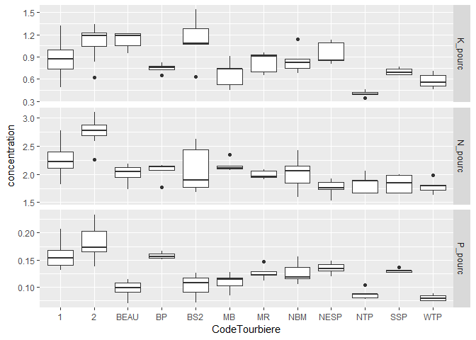

Organisation des données et opérations sur des tableaux
================
Serge-Étienne Parent
2018-11-28

Les données sont utilisées à chaque étape dans les flux de travail en
sciences. Elles alimentent l’analyse et la modélisation. Les résultats
qui en découlent sont aussi des données qui peuvent alimenter les
travaux subséquents. Une bonne organisation des données facilitera le
flux de travail.

> **Dicton**. Proportions de temps voué aux calcul scientifique: 80% de
> nettoyage de données mal organisées, 20% de calcul.

Qu’est-ce qu’une donnée? De manière abstraite, il s’agit d’une valeur
associée à une variable. Une variable peut être une dimension, une date,
une couleur, le résultat d’un test statistique, à laquelle on attribue
la valeur quantitative ou qualitative d’un chiffre, d’une chaîne de
charactère, d’un symbole conventionné, etc. Par exemple, lorsque vous
commandez un café *latte* végane, *au latte* est la valeur que vous
attribuez à la variable *type de café*, et *végane* est la valeur de la
variable *type de lait*.

L’exemple est peut être horrible. J’ai besoin d’un café…


Ce chapitre traite de l’importation, l’utilisation et l’exportation de
données structurées, en R, sous forme de vecteurs, matrices, tableaux et
ensemble de tableaux (bases de données).

Bien qu’il soit toujours préférable d’organiser les structures qui
accueilleront les données d’une expérience avant-même de procéder à la
collecte de données, l’analyste doit s’attendre à réorganiser ses
données en cours de route. Or, des données bien organisées au départ
faciliteront aussi leur réoganisation.

Ce chapitre débute avec quelques définitions: les données, les matrices,
les tableaux et les bases de données, ainsi que leur signification en R.
Puis nous verrons comment organiser un tableau selon quelques règles
simples, mais importantes pour éviter les erreurs et les opérations
fastidieuses pour reconstruire un tableau mal conçu. Ensuite, nous
traiterons des formats de tableau courrant, pour enfin passer à
l’utilisation de [`dplyr`](http://pandas.pydata.org), le module
tidyverse pour effectuer des opérations sur les tableaux.

# Les collections de données

Dans le chapitre 2, nous avons survoler différents types d’objets:
réels, entiers, chaînes de caractères et booléens. Les données peuvent
appartenir à d’autres types: dates, catégories ordinales (ordonnées:
faible, moyen, élevé) et nominales (non ordonnées: espèces, cultivars,
couleurs, unité pédodlogique, etc.). Comme mentionné en début de
chapitre, une donnée est une valeur associée à une variable. Les données
peuvent être organisées en collections.

Nous avons vu au chapitre 2 que la manière privilégiée d’organiser des
données était sous forme de **tableau**. De manière générale, un tableau
de données est une organisation de données en deux dimensions,
comportant des *lignes* et des *colonnes*. Il est préférable de
respecter la convention selon laquelle **les lignes sont des
observations et les colonnes sont des variables**. Ainsi, un tableau est
une collection de vecteurs de même longueur, chaque vecteur représentant
une variable. Chaque variable est libre de prendre le type de données
approprié. La position d’une donnée dans le vecteur correspond à une
observation.

Imaginez que vous consignez des données de différents sites (A, B et C),
et que chaque site possède ses propres caractéristiques. Il est
redondant de décrire le site pour chaque observation. Vous préférerez
créer deux tableaux: un pour décrire vos observations, et un autre pour
décrire les sites. De cette manière, vous créez une collection de
tableaux intereliés: une **base de données**. R peut soutirer des
données des bases de données grâce au module DBI, qui n’est pas couvert
à ce stade de développement du cours.

Dans R, les données structurées en tableaux, ainsi que les opérations
sur les tableaux, peuvent être gérés grâce aux modules readr, dplyr et
tidyr. Mais avant de se lancer dans l’utilisation de ces modules, voyons
quelques règles à suivre pour bien structurer ses données en format
*tidy*, un du jargon tidyverse qui signifie *proprement organisé*.

# Organiser un tableau de données

Afin de reprérer chaque cellule d’un tableau, on attribue à chaque
lignes et à chaque colonne colonnes un identifiant *unique*, que l’on
nomme *indice* pour les lignes et *entête* pour les colonnes.

> **Règle no 1.** Une variable par colonne, une observation par ligne,
> une valeur par cellule.

Les unités expérimentales sont décrits par une ou plusieurs variables
par des chiffres ou des lettres. Chaque variable devrait être présente
en une seule colonne, et chaque ligne devrait correspondre à une unité
expérimentale où ces variables ont été mesurées. La règle parait simple,
mais elle est rarement respectée. Prenez par exemple le tableau suivant.

| Site                | Traitement A | Traitement B | Traitement C |
| ------------------- | ------------ | ------------ | ------------ |
| Sainte-Zéphirine    | 4.1          | 8.2          | 6.8          |
| Sainte-Aurélie      | 5.8          | 5.9          | NA           |
| Saint-Serge-Étienne | 2.9          | 3.4          | 4.6          |

*Tableau 1. Rendements obtenus sur les sites expérimentaux selon les
traitements.*

Qu’est-ce qui cloche avec ce tableau? Chaque ligne est une observation,
mais contient plussieurs observations d’une même variable, le rendement,
qui devient étalé sur plusieurs colonnes. *À bien y penser*, le type de
traitement est une variable et le rendement en est une autre:

| Site                | Traitement | Rendement |
| ------------------- | ---------- | --------- |
| Sainte-Zéphirine    | A          | 4.1       |
| Sainte-Zéphirine    | B          | 8.2       |
| Sainte-Zéphirine    | C          | 6.8       |
| Sainte-Aurélie      | A          | 5.8       |
| Sainte-Aurélie      | B          | 5.9       |
| Sainte-Aurélie      | C          | NA        |
| Saint-Serge-Étienne | A          | 2.9       |
| Saint-Serge-Étienne | B          | 3.4       |
| Saint-Serge-Étienne | C          | 4.6       |

*Tableau 2. Rendements obtenus sur les sites expérimentaux selon les
traitements.*

Plus précisément, l’expression *à bien y penser* suggère une réflexion
sur la signification des données. Certaines variables peuvent parfois
être intégrées dans une même colonne, parfois pas. Par exemple, les
concentrations en cuivre, zinc et plomb dans un sol contaminé peuvent
être placés dans la même colonne “Concentration” ou déclinées en
plusieurs colonnes Cu, Zn et Pb. La première version trouvera son
utilité pour des créer des graphiques (chapitre 3), alors que la
deuxième favorise le traitement statistique (chapitre 5). Il est
possible de passer d’un format à l’autre grâce à la fonction `gather()`
et `spread()` du module tidyr.

> **Règle no 2.** Un tableau par unité observationnelle: ne pas répéter
> les informations.

Rerpenons la même expérience. Supposons que vous mesurez la
précipitation à l’échelle du site.

| Site                | Traitement | Rendement | Précipitations |
| ------------------- | ---------- | --------- | -------------- |
| Sainte-Zéphirine    | A          | 4.1       | 813            |
| Sainte-Zéphirine    | B          | 8.2       | 813            |
| Sainte-Zéphirine    | C          | 6.8       | 813            |
| Sainte-Aurélie      | A          | 5.8       | 642            |
| Sainte-Aurélie      | B          | 5.9       | 642            |
| Sainte-Aurélie      | C          | NA        | 642            |
| Saint-Serge-Étienne | A          | 2.9       | 1028           |
| Saint-Serge-Étienne | B          | 3.4       | 1028           |
| Saint-Serge-Étienne | C          | 4.6       | 1028           |

*Tableau 3. Rendements obtenus sur les sites expérimentaux selon les
traitements.*

Segmenter l’information en deux tableaux serait préférable.

| Site                | Précipitations |
| ------------------- | -------------- |
| Sainte-Zéphirine    | 813            |
| Sainte-Aurélie      | 642            |
| Saint-Serge-Étienne | 1028           |

*Tableau 4. Précipitations sur les sites expérimentaux.*

Les tableaux 2 et 4, ensemble, forment une base de données (collection
organisée de tableaux). Les opérations de fusion entre les tableaux
peuvent être effectuées grâce aux fonctions de jointure (`left_join()`,
par exemple) du module tidyr.

> **Règle no 3.** Ne pas bousiller les données.

Par exemple.

  - *Ajouter des commentaires dans des cellules*. Si une cellule mérite
    d’être commentée, il est préférable de placer les commentaires soit
    dans un fichier décrivant le tableau de données, soit dans une
    colonne de commentaire justaposée à la colonne de la variable à
    commenter. Par exemple, si vous n’avez pas mesure le pH pour une
    observation, n’écrivez pas “échantillon contaminé” dans la cellule,
    mais annoter dans un fichier d’explication que l’échantillon no X a
    été contaminé. Si les commentaires sont systématique, il peut être
    pratique de les inscrire dans une colonne `commentaire_pH`.
  - *Inscrition non systématiques*. Il arrive souvent que des catégories
    d’une variable ou que des valeurs manquantes soient annotées
    différemment. Il arrive même que le séparateur décimal soit non
    systématique, parfois noté par un point, parfois par une virgule.
    Par exemple, une fois importés dans votre session, les catégories
    `St-Ours` et `Saint-Ours` seront traitées comme deux catégories
    distinctes. De même, les cellules correspondant à des valeurs
    manquantes ne devraient pas être inscrite parfois avec une cellule
    vide, parfois avec un point, parfois avec un tiret ou avec la
    mention `NA`. Le plus simple est de laisser systématiquement ces
    cellules vides.
  - *Inclure des notes dans un tableau*. La règle “une colonne, une
    variable” n’est pas respectée si on ajoute des notes un peu
    n’importe où sous ou à côté du tableau.
  - *Ajouter des sommaires*. Si vous ajoutez une ligne sous un tableau
    comprenant la moyenne de chaque colonne, qu’est-ce qui arrivera
    lorsque vous importerez votre tableau dans votre session de travail?
    La ligne sera considérée comme une observation supplémentaire.
  - *Inclure une hiérarchie dans le entêtes*. Afin de consigner des
    données de texture du sol, comprenant la proprotion de sable, de
    limon et d’argile, vous organisez votre entête en plusieurs lignes.
    Une ligne pour la catégorie de donnée, *Texture*, fusionnée sur
    trois colonnes, puis trois colonnes intitullées *Sable*, *Limon* et
    *Argile*. Votre tableau est joli, mais il ne pourra pas être importé
    conformément dans un votre session de calcul: on recherche *une
    entête unique par colonne*. Votre tableau de données devrait plutôt
    porter les entêtes *Texture sable*, *Texture limon* et *Texture
    argile*. Un conseil: réserver le travail esthétique à la toute fin
    d’un flux de travail.

# Formats de tableau

Plusieurs outils sont à votre disposition pour créer des tableaux. Je
vous présente ici les plus communs.

## *xls* ou *xlsx*

Microsoft Excel est un logiciel de type *tableur*, ou chiffrier
électronique. L’ancien format *xls* a été remplacé par le format *xlsx*
avec l’arrivée de Microsoft Office 2010. Il s’agit d’un format
propriétaire, dont l’alternative libre la plus connue est le format
*ods*, popularisé par la suite bureautique LibreOffice. Les formats
*xls*, *xlsx* ou *ods* sont davantage utilisés comme outils de calcul
que d’entreposage de données. Ils contiennent des formules, des
graphiques, du formattage de cellule, etc. *Je ne les recommande pas
pour stocker des données*.

## *csv*

Le format *csv*, pour *comma separated values*, est un fichier texte,
que vous pouvez ouvrir avec n’importe quel éditeur de texte brut (Bloc
note, [Atom](https://atom.io),
[Notepad++](https://notepad-plus-plus.org), etc.). Chaque colonne doit
être délimitée par un caractère cohérent (conventionnellement une
virgule, mais en français un point-virgule ou une tabulation pour éviter
la confusion avec le séparateur décimal) et chaque ligne du tableau est
un retour de ligne. Il est possible d’ouvrir et d’éditer les fichiers
csv dans un éditeur texte, mais il est plus pratique de les ouvrir avec
des tableurs (LibreOffice Calc, Microsoft Excel, Google Sheets, etc.).

**Encodage des fichiers texte**. Puisque le format *csv* est un fichier
texte, un souci particulier doit être porté sur la manière dont le texte
est encodé. Les caractères accentués pourrait être importer
incorrectement si vous importez votre tableau en spécifiant le mauvais
encodage. Pour les fichiers en langues occidentales, l’encodage UTF-8
devrait être utilisé. Toutefois, par défaut, Excel utilise un encodage
de Microsoft. Si le *csv* a été généré par Excel, il est préférable de
l’ouvrir avec votre éditeur texte et de l’enregistrer dans l’encodage
UTF-8.

## *json*

Comme le format *csv*, le format *json* indique un fichier en texte
clair. Il est utilisé davantage pour le partage de données des
applications web. En analyse et modélisation, ce format est surtout
utilisé pour les données géoréférencées. L’encodage est géré de la même
manière qu’un fichier *csv*.

## SQLite

SQLite est une application pour les bases de données relationnelles de
type SQL qui n’a pas besoin de serveur pour fonctionner. Les bases de
donnnées SQLite sont encodés dans des fichiers portant l’extension *db*,
qui peuvent être facilement partagés.

## Suggestion

En *csv* pour les petits tableaux, en *sqlite* pour les bases de données
plus complexes. Ce cours se concentre toutefois sur les données de type
*csv*.

# Entreposer ses données

La manière la plus sécure pour entreposer ses données est de les
confiner dans une base de données sécurisée sur un serveur sécurisé dans
un environnement sécurisé et d’encrypter les communications. C’est aussi
la manière la moins accessible. Des espaces de stockage nuagiques, comme
Dropbox ou d’autres [options
similaires](https://alternativeto.net/software/dropbox/) (je suggère
[SpiderOak](https://spideroak.com/one/), qui est sécurisé), peuvent être
pratiques pour les backups et le partage des données avec une équipe de
travail (qui risque en retour de bousiller vos données). Le suivi de
version est possible chez certains fournisseurs d’espace de stockage.
Mais pour un suivi de version plus rigoureux, les espaces de
développement (comme GitHub et GitLab) sont plus appropriés. Dans tous
les cas, il est important de garder (1) des copies anciennes pour y
revenir en cas d’erreurs et (2) un petit fichier décrivant les
changements effectués sur les données.

# Manipuler des données en mode tidyverse

Le méta-module tidyverse regroupe une collection de précieux modules
pour l’analyse de données en R. Il permet d’importer des données dans
votre session de travail avec readr, de les explorer avec ggplot2, de
les transformer avec tidyr et dplyr et de les exporter aevc readr. Les
tableaux de classe *data.frame*, comme ceux de la plus moderne classe
*tibble*, peuvent être manipulés à travers le flux de travail pour
l’analyse et la modélisation (chapitres suivants). Comme c’était le
cas pour le chapitre sur la visualisation, ce chapitre est loin de
couvrir les nombreuses fonctionnalités qui sont offertes dans le
tidyverse.

## Importer vos données dans voter session de travail

Supposons que vous avec bien organisé vos données en mode *tidy*. Pour
les importer dans votre session et commencer à les inspecter, vous
lancerez une des commandes du module readr, décrites dans la
documentation dédiée.

  - `read_csv()` si le séparateur de colonne est une virgule
  - `read_csv2()` si le séparateur de colonne est un point-virgule et
    que le séparateur décimal est une virgule
  - `read_tsv()` si le séparateur de colonne est une tabulation
  - `read_table()` si le séparateur de colonne est un espace blanc
  - `read_delim()` si le séparateur de colonne est un autre caractère
    (comme le point-virgule) que vous spécifierez dans l’argument `delim
    = ";"`

Les principaux arguments sont les suivants.

  - `file`: le chemin vers le fichier. Ce chemin peut aussi bien être
    une adresse locale (data/…) qu’une adresse internet (<https://>…).
  - `delim`: le symbole délimitant les colonnes dans le cas de
    `read_delim`.
  - `col_names`: si TRUE, la première ligne est l’entête du tableau,
    sinon FALSE. Si vous spécifiez un vecteur numérique, ce sont les
    numéros des lignes utilisées pour le nom de l’entête. Si vous
    utilisez un vecteur de charactères, ce sont les noms des colonnes
    que vous désirez donner à votre tableau.
  - `na`: le symbole spécifiant une valeur manquante. L’argument `na=''`
    signifie que les cellules vides sont des données manquantes. Si les
    valeurs manquantes ne sont pas uniformes, vous pouvez les indiquer
    dans un vecteur, par exemple `na = c("", "NA", "NaN", ".", "-")`.
  - `local`: cet argument prend une fonction `local()` qui peut inclure
    des arguments de format de temps, mais aussi d’encodage ([voir
    documentation](https://readr.tidyverse.org/reference/locale.html))

D’autres arguments peuvent être spécifiés au besoin, et les répéter ici
dupliquerait l’information de la documentation de [la fonction
`read_csv` de
readr](https://readr.tidyverse.org/reference/read_delim.html).

Je déconseille d’importer des données en format xls ou xlsx. Si
toutefois cela vous convient, je vous réfère au module
[readxl](https://readxl.tidyverse.org/).

L’[aide-mémoire de
readr](https://github.com/rstudio/cheatsheets/raw/master/data-import.pdf)
est à afficher près de
soi.

[](https://github.com/rstudio/cheatsheets/raw/master/data-import.pdf)
Aide-mémoire de readr, source:
<https://www.rstudio.com/resources/cheatsheets/>

Nous allons charger des données de culture de la chicouté (*Rubus
chamaemorus*), un petit fruit nordique, tiré de Parent et al. (2013).
Ouvrons d’abord le fichier pour vérifier les séparateurs de colonne et
de décimale.


Le séparateur de colonne est un point-virgule et le décimal est une
virgule.

Avec [Atom](https://atom.io/), mon éditeur texte préféré, je vais dans
Edit \> Select Encoding et j’obtiens bien le UTF-8.


Nous allons donc utiliser `read_csv2()` avec ses arguments par
    défaut.

``` r
library("tidyverse")
```

    ## -- Attaching packages --------------------------------------------------------- tidyverse 1.2.1 --

    ## v ggplot2 3.1.0     v purrr   0.2.5
    ## v tibble  1.4.2     v dplyr   0.7.8
    ## v tidyr   0.8.2     v stringr 1.3.1
    ## v readr   1.2.1     v forcats 0.3.0

    ## -- Conflicts ------------------------------------------------------------ tidyverse_conflicts() --
    ## x dplyr::filter() masks stats::filter()
    ## x dplyr::lag()    masks stats::lag()

``` r
chicoute <- read_csv2('data/chicoute.csv')
```

    ## Using ',' as decimal and '.' as grouping mark. Use read_delim() for more control.

    ## Parsed with column specification:
    ## cols(
    ##   .default = col_double(),
    ##   CodeTourbiere = col_character(),
    ##   Ordre = col_character(),
    ##   Traitement = col_character(),
    ##   DemiParcelle = col_character(),
    ##   SousTraitement = col_character()
    ## )

    ## See spec(...) for full column specifications.

Quelques commandes utiles inspecter le tableau:

  - `head()` présente l’entête du tableau, soit ses 6 premières lignes
  - `str()` et `glimpse()` présentent les variables du tableau et leur
    type - `glimpse()`est la fonction tidyverse et `str()` est la
    fonction classique (je préfère `str()`)
  - `summary()` présente des statistiques de base du tableau
  - `names()` ou `colnames()` sort les noms des colonnes sous forme d’un
    vecteur
  - `dim()` donne les dimensions du tableau, `ncol()` son nombre de
    colonnes et `nrow()` son nombre de lignes
  - `skim` est une fonction du module skimr montrant un portrait
    graphique et numérique du tableau

**Extra 1**. Plusieurs modules ne se trouvent pas dans les dépôt CRAN,
mais sont disponibles sur GitHub. Pour les installer, installez d’abord
le module devtools disponible sur CRAN. Vous pourrez alors installer les
packages de GitHub comme on le fait avec le package skimr.

**Extra 2**. Lorsque je désire utiliser une fonction, mais sans charger
le module dans la session, j’utilise la notation `module::fonction`.
Comme dans ce cas, pour skimr.

``` r
# devtools::install_github("ropenscilabs/skimr")
skimr::skim(chicoute)
```

    ## Skim summary statistics
    ##  n obs: 90 
    ##  n variables: 31 
    ## 
    ## -- Variable type:character -----------------------------------------------------------------------
    ##        variable missing complete  n min max empty n_unique
    ##   CodeTourbiere       0       90 90   1   4     0       12
    ##    DemiParcelle      50       40 90   4   5     0        2
    ##           Ordre       0       90 90   1   2     0       20
    ##  SousTraitement      50       40 90   1   7     0        3
    ##      Traitement      50       40 90   6  11     0        2
    ## 
    ## -- Variable type:numeric -------------------------------------------------------------------------
    ##                  variable missing complete  n          mean         sd
    ##                  Al_pourc       0       90 90       0.0027     0.0013 
    ##                   B_pourc       0       90 90       0.0031     0.00067
    ##                   C_pourc       0       90 90      50.28       1.61   
    ##                  Ca_pourc       0       90 90       0.39       0.1    
    ##                  Cu_pourc       0       90 90       0.00041    0.00064
    ##                  Fe_pourc       0       90 90       0.015      0.0059 
    ##   FemelleAvorte_nombre_m2       4       86 90       8.49      14.52   
    ##    FemelleFruit_nombre_m2      18       72 90      19.97      23.79   
    ##                        ID       0       90 90      45.5       26.12   
    ##                   K_pourc       0       90 90       0.89       0.27   
    ##                Latitude_m       0       90 90 5701839.86    1915.5    
    ##               Longitude_m       0       90 90  485295.54    6452.33   
    ##                  Mg_pourc       0       90 90       0.5        0.085  
    ##                  Mn_pourc       0       90 90       0.033      0.025  
    ##                   N_pourc       0       90 90       2.2        0.4    
    ##                   P_pourc       0       90 90       0.14       0.037  
    ##           Rendement_g_5m2      50       40 90      13.33      21.56   
    ##                   S_pourc       0       90 90       0.13       0.039  
    ##                      Site       0       90 90       6.33       5.49   
    ##    SterileFleur_nombre_m2       4       86 90       0.26       0.71   
    ##    TotalFemelle_nombre_m2       4       86 90      27.53      29.83   
    ##     TotalFloral_nombre_m2       4       86 90      52.08      40.41   
    ##       TotalMale_nombre_m2       4       86 90      24.4       26.87   
    ##      TotalRamet_nombre_m2       0       90 90     251.26     156.06   
    ##  TotalVegetatif_nombre_m2       4       86 90     199.02     139.13   
    ##                  Zn_pourc       0       90 90       0.0067     0.0021 
    ##             p0           p25           p50           p75         p100
    ##    9e-04             0.0019        0.0024        0.0033        0.0093
    ##        0.0018        0.0026        0.0032        0.0035        0.0042
    ##       46.72         49.14         50.45         51.58         53.83  
    ##        0.19          0.32          0.37          0.44          0.88  
    ##        3.7e-05       3.7e-05       0.00021       0.00046       0.0042
    ##        0.0091        0.011         0.014         0.017         0.052 
    ##        0             1.27          3.07         10.14         76.8   
    ##        0.4           7.64         11.46         22.83        157.88  
    ##        1            23.25         45.5          67.75         90     
    ##        0.35          0.69          0.86          1.13          1.54  
    ##  5695688       5701868.5     5702129       5702537       5706394     
    ##   459873        485927        486500        486544.75     491955     
    ##        0.36          0.45          0.48          0.52          0.86  
    ##        0.0023        0.012         0.028         0.05          0.1   
    ##        1.53          1.89          2.12          2.58          3.1   
    ##        0.071         0.12          0.14          0.16          0.23  
    ##        0             0             0.95         15.63         72.44  
    ##        0.07          0.11          0.13          0.14          0.28  
    ##        1             2             4             9            20     
    ##        0             0             0             0             3.82  
    ##        2.55         10.34         17.19         31.96        187.17  
    ##        4.8          22.92         43            69.52        198.62  
    ##        0             3.3          15.28         36.51        104.41  
    ##       40.74        122.7         212.92        347.8         651.9   
    ##       22.92         86.26        161.25        263.78        580.6   
    ##        0.0033        0.0055        0.0063        0.0072        0.016 
    ##      hist
    ##  <U+2586><U+2587><U+2585><U+2582><U+2581><U+2581><U+2581><U+2581>
    ##  <U+2583><U+2582><U+2585><U+2583><U+2583><U+2587><U+2581><U+2585>
    ##  <U+2582><U+2583><U+2586><U+2583><U+2585><U+2587><U+2582><U+2581>
    ##  <U+2582><U+2587><U+2587><U+2583><U+2582><U+2581><U+2581><U+2581>
    ##  <U+2587><U+2581><U+2581><U+2581><U+2581><U+2581><U+2581><U+2581>
    ##  <U+2587><U+2585><U+2582><U+2581><U+2581><U+2581><U+2581><U+2581>
    ##  <U+2587><U+2582><U+2581><U+2581><U+2581><U+2581><U+2581><U+2581>
    ##  <U+2587><U+2582><U+2581><U+2581><U+2581><U+2581><U+2581><U+2581>
    ##  <U+2587><U+2587><U+2587><U+2587><U+2587><U+2587><U+2587><U+2587>
    ##  <U+2583><U+2582><U+2587><U+2586><U+2583><U+2586><U+2582><U+2581>
    ##  <U+2581><U+2581><U+2581><U+2582><U+2587><U+2586><U+2581><U+2581>
    ##  <U+2581><U+2581><U+2581><U+2581><U+2581><U+2581><U+2587><U+2581>
    ##  <U+2583><U+2587><U+2586><U+2582><U+2581><U+2581><U+2581><U+2581>
    ##  <U+2587><U+2583><U+2583><U+2583><U+2582><U+2581><U+2581><U+2581>
    ##  <U+2583><U+2586><U+2587><U+2586><U+2582><U+2585><U+2583><U+2582>
    ##  <U+2586><U+2582><U+2587><U+2587><U+2587><U+2583><U+2582><U+2581>
    ##  <U+2587><U+2581><U+2581><U+2581><U+2581><U+2581><U+2581><U+2581>
    ##  <U+2582><U+2586><U+2587><U+2582><U+2581><U+2581><U+2581><U+2581>
    ##  <U+2587><U+2585><U+2581><U+2581><U+2581><U+2581><U+2581><U+2581>
    ##  <U+2587><U+2581><U+2581><U+2581><U+2581><U+2581><U+2581><U+2581>
    ##  <U+2587><U+2582><U+2581><U+2581><U+2581><U+2581><U+2581><U+2581>
    ##  <U+2587><U+2587><U+2583><U+2582><U+2581><U+2581><U+2581><U+2581>
    ##  <U+2587><U+2583><U+2582><U+2582><U+2581><U+2581><U+2581><U+2581>
    ##  <U+2587><U+2583><U+2587><U+2582><U+2582><U+2582><U+2582><U+2581>
    ##  <U+2587><U+2587><U+2586><U+2583><U+2582><U+2582><U+2582><U+2581>
    ##  <U+2582><U+2587><U+2585><U+2581><U+2581><U+2581><U+2581><U+2581>

**Exercice**. Inspectez le tableau.

## Comment sélectionner et filtrer des données?

On utiliser le terme *sélectionner* lorsque l’on désire choisir une ou
plusieurs lignes et colonnes d’un tableau (la plupart du temps des
colonnes). L’action de *filtrer* signifie de sélectionner des lignes
selon certains critères.

### Sélectionner

Voici trois manières de sélectionner une colonne en R.

  - Une méthode rapide mais peu expressive consiste à indiquer les
    valeurs numériques de l’indice de la colonne entre des crochets. Il
    s’agit d’appeler le tableau suivit de crochets. L’intérieur des
    crochets comprend deux éléments séparés par une virgule. Le premier
    élément sert à filter selon l’indice, le deuxième sert à
    sélectionner selon l’indice. Ainsi:

  - `chicoute[, 1]`: sélectionner la première colonne

  - `chicoute[, 1:10]`: sélectionner les 10 premières colonnes

  - `chicoute[, c(2, 4, 5)]`: sélectionner les colonnes 2, 4 et 5

  - `chicoute[c(10, 13, 20), c(2, 4, 5)]`: sélectionner les colonnes 2,
    4 et 5 et les lignes 10, 13 et 20.

  - Une autre méthode rapide, mais plus expressive, consiste à appeler
    le tableau, suivi du symbole `$`, puis le nom de la colonne.

> **Truc**. La plupart des IDE, comme RStudio, peuvent vous proposer des
> colonnes dans une liste. Après avoir entrer le `$`, taper sur la
> touche de tabulation: vous pourrez sélectionner la colonne dans une
> liste défilante.


  - Une autre option est d’inscrire le nom de la colonne, ou du vecteur
    des colonnes, entre des crochets suivant le nom du tableau,
    c’est-à-dire `chicoute[c("Site", "Latitude_m", "Longitude_m")]`.

  - Enfin, dans une séquence d’opérations en mode pipeline (chaque
    opération est mise à la suite de la précédente en plaçant le *pipe*
    `%>%` entre chacune), il peut être préférable de sélectionner des
    colonnes avec la fonction `select()`, i.e.

<!-- end list -->

    chicoute %>%
    select(Site, Latitude_m, Longitude_m)

La fonction `select()` permet aussi de travailler en exclusion. Ainsi
pour enlever des colonnes, on placera un `-` (signe de soustraction)
devant le nom de la colonne.

D’autre arguments de `select()` permettent une sélection rapide. Par
exemple, pour obtenir les colonnes contenant des pourcentages:

``` r
chicoute %>%
  select(ends_with("pourc")) %>%
  head(3)
```

    ## # A tibble: 3 x 13
    ##   C_pourc N_pourc P_pourc K_pourc Ca_pourc Mg_pourc S_pourc B_pourc
    ##     <dbl>   <dbl>   <dbl>   <dbl>    <dbl>    <dbl>   <dbl>   <dbl>
    ## 1    51.5    1.72  0.108     1.21    0.435    0.470  0.0976 0.00258
    ## 2    51.3    2.18  0.0985    1.22    0.337    0.439  0.0996 0.00258
    ## 3    50.6    2.12  0.0708    1.05    0.373    0.420  0.104  0.00258
    ## # ... with 5 more variables: Cu_pourc <dbl>, Zn_pourc <dbl>,
    ## #   Mn_pourc <dbl>, Fe_pourc <dbl>, Al_pourc <dbl>

### Filtrer

Comme c’est le cas de la sélection, on pourra filtrer un tableau de
plusieurs manières. J’ai déjà présenté comment filtrer selon les indices
des lignes. Les autres manières reposent néanmoins sur une opération
logique `==`, `<`, `>` ou `%in%` (le %in% signifie *se trouve parmi* et
peut être suivi d’un vecteur de valeur que l’on désire accepter).

Les conditions booléennes peuvent être combinées avec les opérateurs
*et*, `&`, et *ou*, `|`. Pour rappel,

| Opération        | Résultat |
| ---------------- | -------- |
| Vrai **et** Vrai | Vrai     |
| Vrai **et** Faux | Faux     |
| Faux **et** Faux | Faux     |
| Vrai **ou** Vrai | Vrai     |
| Vrai **ou** Faux | Vrai     |
| Faux **ou** Faux | Faux     |

  - La méthode classique consiste à appliquer une opération logique
    entre les crochets, par exemple `chicoute[chicoute$CodeTourbiere ==
    "BEAU", ]`
  - La méthode tidyverse, plus pratique en mode pipeline, passe par la
    fonction `filter()`, i.e.

<!-- end list -->

    chicoute %>%
    filter(CodeTourbiere == "BEAU")

Combiner le tout.

``` r
chicoute %>%
  filter(Ca_pourc < 0.4 & CodeTourbiere %in% c("BEAU", "MB", "WTP")) %>%
  select(contains("pourc"))
```

    ## # A tibble: 4 x 13
    ##   C_pourc N_pourc P_pourc K_pourc Ca_pourc Mg_pourc S_pourc B_pourc
    ##     <dbl>   <dbl>   <dbl>   <dbl>    <dbl>    <dbl>   <dbl>   <dbl>
    ## 1    51.3    2.18  0.0985   1.22     0.337    0.439  0.0996 0.00258
    ## 2    50.6    2.12  0.0708   1.05     0.373    0.420  0.104  0.00258
    ## 3    53.8    2.04  0.115    0.947    0.333    0.472  0.106  0.00258
    ## 4    52.6    2.11  0.0847   0.913    0.328    0.376  0.111  0.00296
    ## # ... with 5 more variables: Cu_pourc <dbl>, Zn_pourc <dbl>,
    ## #   Mn_pourc <dbl>, Fe_pourc <dbl>, Al_pourc <dbl>

## Le format long et le format large

Dans le tableau `chicoute`, chaque élément possède sa propre colonne. Si
l’on voulait mettre en graphique les boxplot des facettes de
concentrations d’azote, de phosphore et de potassium dans les
différentes tourbières, il faudrait obtenir une seule colonne de
concentrations.

Pour ce faire, nous utiliserons la fonction `gather()`. Le premier
argument est le nom de la colonne des variables, le deuxième est le nom
de la nouvelle colonne des valeurs. La suite consiste à décrire les
colonnes à inclure ou à exclulre. Dans le cas qui suit, j’exclue
CodeTourbiere de la refonte j’utilise `sample_n()` pour présenter un
échantillon du résultat.

``` r
chicoute_long <- chicoute %>%
  select(CodeTourbiere, N_pourc, P_pourc, K_pourc) %>%
  gather(key = element, value = concentration, -CodeTourbiere)
chicoute_long %>% sample_n(10)
```

    ## # A tibble: 10 x 3
    ##    CodeTourbiere element concentration
    ##    <chr>         <chr>           <dbl>
    ##  1 NESP          P_pourc         0.131
    ##  2 2             N_pourc         2.70 
    ##  3 1             K_pourc         0.667
    ##  4 2             N_pourc         2.70 
    ##  5 NTP           K_pourc         0.456
    ##  6 BP            P_pourc         0.153
    ##  7 BS2           N_pourc         2.62 
    ##  8 BS2           N_pourc         1.78 
    ##  9 MB            K_pourc         0.738
    ## 10 1             K_pourc         0.833

L’opération inverse est `spread()`. Pour que cette opération fonctionne,
`spread()` a besoin d’une colonne ayant un identifiant unique.

``` r
chicoute_long$ID <- 1:nrow(chicoute_long)
```

Nous pouvons enlever cet identifiant une fois l’opération effectuée.

``` r
chicoute_large <- chicoute_long %>%
  spread(key=element, value=concentration, fill=0) %>%
  select(-ID)
chicoute_large %>% sample_n(10)
```

    ## # A tibble: 10 x 4
    ##    CodeTourbiere K_pourc N_pourc P_pourc
    ##    <chr>           <dbl>   <dbl>   <dbl>
    ##  1 SSP             0.734    0     0     
    ##  2 2               1.18     0     0     
    ##  3 BS2             0        2.62  0     
    ##  4 NESP            0.849    0     0     
    ##  5 2               0        2.80  0     
    ##  6 MR              0        1.90  0     
    ##  7 WTP             0        0     0.0848
    ##  8 2               0        0     0.181 
    ##  9 NTP             0.345    0     0     
    ## 10 NBM             0.745    0     0

Sans créer de nouveau tableau, il est possible de créer le graphique
dans un seu pipeline.

``` r
chicoute %>%
  select(CodeTourbiere, N_pourc, P_pourc, K_pourc) %>%
  gather(key = element, value = concentration, -CodeTourbiere) %>%
  ggplot(mapping = aes(x = CodeTourbiere, y = concentration)) +
  facet_grid(element ~ ., scales = 'free') +
  geom_boxplot()
```

<!-- -->

## Combiner des tableaux

Nous avons introduit plus haut la notion de base de données. Nous
voudrions peut-être utiliser le code des tourbières pour inclure leur
nom, le type d’essai mené à ces tourbières, etc. Importons d’abord le
tableau des noms liés aux
    codes.

``` r
tourbieres <- read_csv2("data/chicoute_tourbieres.csv")
```

    ## Using ',' as decimal and '.' as grouping mark. Use read_delim() for more control.

    ## Parsed with column specification:
    ## cols(
    ##   Tourbiere = col_character(),
    ##   CodeTourbiere = col_character(),
    ##   Type = col_character(),
    ##   TypeCulture = col_character()
    ## )

``` r
tourbieres
```

    ## # A tibble: 11 x 4
    ##    Tourbiere               CodeTourbiere Type        TypeCulture
    ##    <chr>                   <chr>         <chr>       <chr>      
    ##  1 Beaulieu                BEAU          calibration naturel    
    ##  2 Brador Path             BP            calibration naturel    
    ##  3 Lichen (BS2E)           2             validation  cultive sec
    ##  4 Mannys Brook            MB            calibration naturel    
    ##  5 Middle Bay Road         MR            calibration naturel    
    ##  6 North Est of Smelt Pond NESP          calibration naturel    
    ##  7 North of Blue Moon      NBM           calibration naturel    
    ##  8 South of Smelt Pond     SSP           calibration naturel    
    ##  9 Sphaigne (BS2F)         BS2           validation  cultive sec
    ## 10 Sphaigne (BS2F)         1             calibration naturel    
    ## 11 West of Trout Pond      WTP           calibration naturel

Notre information est organisée en deux tableaux, liés par la colonne
`CodeTourbiere`. Comment fusionner l’information pour qu’elle puisse
être utilisée dans son ensemble? La fonction `left_join` effectue cette
opération typique avec les bases de
données.

``` r
chicoute_merge <- left_join(x = chicoute, y = tourbieres, by = "CodeTourbiere")
# ou bien chicoute %>% left_join(y = tourbieres, by = "CodeTourbiere")
chicoute_merge %>% sample_n(4)
```

    ## # A tibble: 4 x 34
    ##      ID CodeTourbiere Ordre  Site Traitement DemiParcelle SousTraitement
    ##   <dbl> <chr>         <chr> <dbl> <chr>      <chr>        <chr>         
    ## 1     8 BP            H         3 <NA>       <NA>         <NA>          
    ## 2    59 SSP           F         4 <NA>       <NA>         <NA>          
    ## 3    70 1             2         3 fertilisa~ left         Control       
    ## 4    89 WTP           E         4 <NA>       <NA>         <NA>          
    ## # ... with 27 more variables: Latitude_m <dbl>, Longitude_m <dbl>,
    ## #   Rendement_g_5m2 <dbl>, TotalRamet_nombre_m2 <dbl>,
    ## #   TotalVegetatif_nombre_m2 <dbl>, TotalFloral_nombre_m2 <dbl>,
    ## #   TotalMale_nombre_m2 <dbl>, TotalFemelle_nombre_m2 <dbl>,
    ## #   FemelleFruit_nombre_m2 <dbl>, FemelleAvorte_nombre_m2 <dbl>,
    ## #   SterileFleur_nombre_m2 <dbl>, C_pourc <dbl>, N_pourc <dbl>,
    ## #   P_pourc <dbl>, K_pourc <dbl>, Ca_pourc <dbl>, Mg_pourc <dbl>,
    ## #   S_pourc <dbl>, B_pourc <dbl>, Cu_pourc <dbl>, Zn_pourc <dbl>,
    ## #   Mn_pourc <dbl>, Fe_pourc <dbl>, Al_pourc <dbl>, Tourbiere <chr>,
    ## #   Type <chr>, TypeCulture <chr>

D’autres types de jointures sont possibles, et décrites en détails dans
la [documentation](https://dplyr.tidyverse.org/reference/join.html).

[Garrick Aden-Buie](https://www.garrickadenbuie.com/) a préparé de
[jolies
animations](https://gist.github.com/gadenbuie/077bcd2700ac1241c65c324581a9f619)
pour décrire les différents types de jointures.

`left_join(x, y)` colle y à x seulement ce qui dans y correspond à ce
que l’on trouve dans x.


`right_join(x, y)` colle y à x seulement ce qui dans x correspond à ce
que l’on trouve dans y.


`inner_join(x, y)` colle x et y en excluant les lignes où au moins une
variable de joint est absente dans x et y.


`full_join(x, y)`garde toutes les lignes et les colonnes de x et y.


## Opérations sur les tableaux

Les tableaux peuvent être segmentés en éléments sur lesquels on
calculera ce qui nous chante.

On pourrait vouloir obtenir:

  - la somme avec la function `sum()`
  - la moyenne avec la function `mean()` ou la médiane avec la fonction
    `median()`
  - l’écart-type avec la function `sd()`
  - les maximum et minimum avec les fonctions `min()` et `max()`
  - un décompte d’occurence avec la fonction `n()` ou `count()`

Par exemple,

``` r
mean(chicoute$Rendement_g_5m2, na.rm = TRUE)
```

    ## [1] 13.32851

**En mode classique**, pour effectuer des opérations sur des tableaux,
on utilisera la fonction `apply()`. Cette fonction prend, comme
arguments, le tableau, l’axe (opération par ligne = 1, opération par
colonne = 2), puis la fonction à appliquer.

``` r
apply(chicoute %>% select(contains("pourc")), 2, mean)
```

    ##      C_pourc      N_pourc      P_pourc      K_pourc     Ca_pourc 
    ## 5.027911e+01 2.199411e+00 1.388959e-01 8.887000e-01 3.884391e-01 
    ##     Mg_pourc      S_pourc      B_pourc     Cu_pourc     Zn_pourc 
    ## 4.980142e-01 1.347177e-01 3.090922e-03 4.089891e-04 6.662155e-03 
    ##     Mn_pourc     Fe_pourc     Al_pourc 
    ## 3.345239e-02 1.514885e-02 2.694979e-03

Les opération peuvent aussi être effectuées par ligne, par exemple une
somme (je garde seulement les 10 premiers
    résultats).

``` r
apply(chicoute %>% select(contains("pourc")), 1, sum)[1:10]
```

    ##  [1] 55.64299 55.76767 54.78856 55.84453 57.89671 55.53603 55.62526
    ##  [8] 55.10991 55.06295 55.16774

La fonction à appliquer peut être personnalisée, par exemple:

``` r
apply(chicoute %>% select(contains("pourc")), 2,
      function(x) (prod(x))^(1/length(x)))
```

    ##      C_pourc      N_pourc      P_pourc      K_pourc     Ca_pourc 
    ## 50.253429104  2.165246915  0.133754530  0.846193827  0.376192724 
    ##     Mg_pourc      S_pourc      B_pourc     Cu_pourc     Zn_pourc 
    ##  0.491763884  0.129900753  0.003014675  0.000000000  0.006408775 
    ##     Mn_pourc     Fe_pourc     Al_pourc 
    ##  0.024140327  0.014351745  0.002450982

Vous reconnaissez cette fonction? C’était la moyenne géométrique (la
fonction `prod()` étant le produit d’un vecteur).

**En mode tidyverse**, on aura besoin principalement des fonction
suivantes:

  - `group_by()` pour effectuer des opérations par groupe, l’oprération
    `group_by()` sépare le tableau en plusieurs petits tableaux, en
    attendant de les recombiner. C’est un peu l’équivalent des facettes
    en ggplot2…
  - `summarise()` pour réduire plusieurs valeurs en une seule, il
    applique un calcul sur le tableau ou s’il y a lieu sur chaque petit
    tableau segmenté. Il en existe quelques variantes.
      - `summarise_all()` applique la fonction à toutes les colonnes
      - `summarise_at()` applique la fonction aux colonnes spécifiées
      - `summarise_if()` applique la fonction aux colonnes qui resortent
        comme `TRUE` selon une opération booléenne
  - `mutate()` pour ajotuer une nouvelle colonne
      - Si l’on désire ajouter une colonne à un tableau, par exemple le
        sommaire calculé avec `summarise()`. À l’inverse, la fonction
        `transmute()` retournera seulement le résultat, sans le tableau
        à partir duquel il a été calculé. De même que `summarise()`,
        `mutate()` et `transmute()` possèdent leurs équivalents
        `_all()`, `_at()` et `_if()`.
  - `arrange()` pour réordonner le tableau
      - On a déjà couvert `arrange()` dans le chapitre 3. Rappelons que
        cette fonction n’est pas une opération sur un tableau, mais
        plutôt un changement d’affichage en changeant l’ordre
        d’apparition des données.

Ces opérations sont décrites dans l’aide-mémoire [*Data Transformation
Cheat
Sheet*](https://github.com/rstudio/cheatsheets/raw/master/data-transformation.pdf).

[](https://github.com/rstudio/cheatsheets/raw/master/data-transformation.pdf)

Aide-mémoire de dplyr, source:
<https://www.rstudio.com/resources/cheatsheets/>

Pour effectuer des statistiques par colonne, on utilisera
`summarise_all()` étant donnée que l’on désire un sommaire sur toutes
les variables sélectionnées. Pour spécifier que l’on désire la moyenne
et l’écart-type on inscrit les noms des fonctions dans `funs()`.

``` r
chicoute %>%
  select(contains("pourc")) %>%
  summarise_all(funs(mean, sd))
```

    ## # A tibble: 1 x 26
    ##   C_pourc_mean N_pourc_mean P_pourc_mean K_pourc_mean Ca_pourc_mean
    ##          <dbl>        <dbl>        <dbl>        <dbl>         <dbl>
    ## 1         50.3         2.20        0.139        0.889         0.388
    ## # ... with 21 more variables: Mg_pourc_mean <dbl>, S_pourc_mean <dbl>,
    ## #   B_pourc_mean <dbl>, Cu_pourc_mean <dbl>, Zn_pourc_mean <dbl>,
    ## #   Mn_pourc_mean <dbl>, Fe_pourc_mean <dbl>, Al_pourc_mean <dbl>,
    ## #   C_pourc_sd <dbl>, N_pourc_sd <dbl>, P_pourc_sd <dbl>,
    ## #   K_pourc_sd <dbl>, Ca_pourc_sd <dbl>, Mg_pourc_sd <dbl>,
    ## #   S_pourc_sd <dbl>, B_pourc_sd <dbl>, Cu_pourc_sd <dbl>,
    ## #   Zn_pourc_sd <dbl>, Mn_pourc_sd <dbl>, Fe_pourc_sd <dbl>,
    ## #   Al_pourc_sd <dbl>

On utilisera `group_by()` pour segmenter le tableau, et ainsi obtenir
des statistiques pour chaque groupe.

``` r
chicoute %>%
  group_by(CodeTourbiere) %>%
  select(contains("pourc")) %>%
  summarise_all(funs(mean, sd))
```

    ## Adding missing grouping variables: `CodeTourbiere`

    ## # A tibble: 12 x 27
    ##    CodeTourbiere C_pourc_mean N_pourc_mean P_pourc_mean K_pourc_mean
    ##    <chr>                <dbl>        <dbl>        <dbl>        <dbl>
    ##  1 1                     50.7         2.26       0.156         0.880
    ##  2 2                     49.2         2.76       0.181         1.12 
    ##  3 BEAU                  51.7         2.00       0.0967        1.12 
    ##  4 BP                    51.2         2.05       0.158         0.747
    ##  5 BS2                   52.5         2.08       0.103         1.12 
    ##  6 MB                    51.5         2.15       0.109         0.675
    ##  7 MR                    50.6         1.99       0.127         0.830
    ##  8 NBM                   51.6         2.01       0.127         0.854
    ##  9 NESP                  48.3         1.76       0.135         0.945
    ## 10 NTP                   51.3         1.83       0.0873        0.402
    ## 11 SSP                   48.7         1.83       0.130         0.700
    ## 12 WTP                   47.8         1.79       0.0811        0.578
    ## # ... with 22 more variables: Ca_pourc_mean <dbl>, Mg_pourc_mean <dbl>,
    ## #   S_pourc_mean <dbl>, B_pourc_mean <dbl>, Cu_pourc_mean <dbl>,
    ## #   Zn_pourc_mean <dbl>, Mn_pourc_mean <dbl>, Fe_pourc_mean <dbl>,
    ## #   Al_pourc_mean <dbl>, C_pourc_sd <dbl>, N_pourc_sd <dbl>,
    ## #   P_pourc_sd <dbl>, K_pourc_sd <dbl>, Ca_pourc_sd <dbl>,
    ## #   Mg_pourc_sd <dbl>, S_pourc_sd <dbl>, B_pourc_sd <dbl>,
    ## #   Cu_pourc_sd <dbl>, Zn_pourc_sd <dbl>, Mn_pourc_sd <dbl>,
    ## #   Fe_pourc_sd <dbl>, Al_pourc_sd <dbl>

Pour obtenir des statistiques à chaque ligne, mieux vaut utiliser
`apply()`, tel que vu précédemment. Le point, `.`, représente le tableau
dans la fonction.

``` r
chicoute %>%
  select(contains("pourc")) %>%
  apply(., 1, sum)
```

    ##  [1] 55.64299 55.76767 54.78856 55.84453 57.89671 55.53603 55.62526
    ##  [8] 55.10991 55.06295 55.16774 56.41123 55.47917 55.43537 55.79175
    ## [15] 55.44561 54.85448 54.34262 55.03075 54.40533 51.89319 54.70172
    ## [22] 54.62176 54.30250 53.86976 53.44731 53.86244 52.43280 54.34978
    ## [29] 53.96756 51.46672 55.44267 54.70350 55.30711 56.16200 56.64710
    ## [36] 55.95499 54.76370 54.32775 54.95419 53.37094 53.07855 53.04541
    ## [43] 52.09520 52.40456 51.92376 53.33248 56.56405 56.35004 56.27185
    ## [50] 55.56986 53.81654 55.39638 55.51961 54.88098 54.74774 51.08921
    ## [57] 51.31462 53.46819 53.15640 52.82020 57.78038 57.94636 56.65558
    ## [64] 56.28845 55.54463 56.51751 55.36497 56.00594 55.64247 56.56967
    ## [71] 56.81674 55.87070 55.72308 56.14116 56.42611 55.35650 54.90469
    ## [78] 54.03674 53.42991 53.99334 53.09085 53.23222 53.28212 53.63192
    ## [85] 53.48102 52.31131 51.72026 51.10534 51.49055 51.59297

Revenons à notre tableau des especes meancées.

``` r
especes_menacees <- read_csv('data/WILD_LIFE_16082018051732754.csv')
```

    ## Parsed with column specification:
    ## cols(
    ##   IUCN = col_character(),
    ##   `IUCN Category` = col_character(),
    ##   SPEC = col_character(),
    ##   Species = col_character(),
    ##   COU = col_character(),
    ##   Country = col_character(),
    ##   `Unit Code` = col_character(),
    ##   Unit = col_character(),
    ##   `PowerCode Code` = col_double(),
    ##   PowerCode = col_character(),
    ##   `Reference Period Code` = col_logical(),
    ##   `Reference Period` = col_logical(),
    ##   Value = col_double(),
    ##   `Flag Codes` = col_logical(),
    ##   Flags = col_logical()
    ## )

Nous avions exécuté le pipeline suivant.

``` r
especes_menacees %>%
  filter(IUCN == 'CRITICAL') %>%
  select(Country, Value) %>%
  group_by(Country)  %>%
  summarise(n_critical_species = sum(Value)) %>%
  arrange(desc(n_critical_species)) %>%
  top_n(10)
```

    ## Selecting by n_critical_species

    ## # A tibble: 10 x 2
    ##    Country         n_critical_species
    ##    <chr>                        <dbl>
    ##  1 Czech Republic                2159
    ##  2 United States                 1409
    ##  3 Germany                        915
    ##  4 Japan                          628
    ##  5 Austria                        618
    ##  6 Slovak Republic                602
    ##  7 Canada                         522
    ##  8 Poland                         485
    ##  9 Switzerland                    483
    ## 10 Brazil                         453

Ce pipeline consistait à:

    prendre le tableau especes_menacees, puis
      filtrer pour n'obtenir que les espèces critiques, puis
      sélectionner les colonnes des pays et des valeurs (nombre d'espèces), puis
      segmenter le tableaux en plusieurs tableaux selon le pays, puis
      appliquer la fonction sum pour chacun de ces petits tableaux (puis de recombiner ces sommaires), puis
      trier les pays en nombre décroissant de décompte d'espèces, puis
      afficher le top 10

## Exemple (difficile)

Pour revenir à notre tableau `chicoute`, imaginez que vous aviez une
station météo (station\_A) située aux coordonnées (490640, 5702453) et
que vous désiriez calculer la distance entre l’observation et la
station. Prenez du temps pour réfléchir à la manière dont vous
procéderez…

On pourra créer une fonction qui mesure la distance entre un point x, y
et les coordonnées de la station A…

``` r
dist_station_A <- function (x, y) {
  return(sqrt((x - 490640)^2 + (y - 5702453)^2))
}
```

… puis ajouter une colonne avec mutate grâce à une fonction prenant les
arguments x et y spécifiés.

``` r
chicoute %>%
  mutate(dist = dist_station_A(x = Longitude_m, y= Latitude_m)) %>%
  select(ID, CodeTourbiere, Longitude_m, Latitude_m, dist) %>%
  top_n(10)
```

    ## Selecting by dist

    ## # A tibble: 10 x 5
    ##       ID CodeTourbiere Longitude_m Latitude_m   dist
    ##    <dbl> <chr>               <dbl>      <dbl>  <dbl>
    ##  1     7 BP                 484054    5706307  7631.
    ##  2    36 MR                 459875    5701988 30769.
    ##  3    37 MR                 459873    5701987 30771.
    ##  4    38 MR                 459880    5701971 30764.
    ##  5    39 MR                 459894    5701966 30750.
    ##  6    40 MR                 459915    5701994 30728.
    ##  7    46 NBM                485975    5695688  8218.
    ##  8    48 NBM                485912    5696607  7519.
    ##  9    49 NBM                485903    5696611  7521.
    ## 10    50 NBM                485884    5696612  7532.

Nous pourrions procéder de la même manière pour fusionner des données
climatiques. Le tableau `chicoute` ne possède pas d’indicateurs
climatiques, mais il est possible de les soutirer de stations météos
placées près des site. Ces données ne sont pas disponibles pour le
tableau de la chicouté, alors j’utiliserai des données fictives pour
l’exemple.

Voici ce qui pourrait être fait.

1.  Créer un tableau des stations météo ainsi que des indices météo
    associés à ces stations.
2.  Lier chaque site à une station (à la main où selon la plus petite
    distance entre le site et la station).
3.  Fusionner les inices climatiques aux sites, puis les sites aux
    mesures de rendement.

Ces opérations demandent habituellement du tâtonnement. Il serait
surprenant que même une personne expérimentée soit en mesure de compiler
ces opérations sans obtenir de message d’erreur, et retravailler jusqu’à
obtenir le résultat souhaité. L’objectif de cette section est de vous
présenté un flux de travail que vous pourriez être amenés à effectuer
et de fournir quelques éléments nouveau pour mener à bien une opération.
Il peut être frustant de ne pas saisir toutes les opérations: passez à
travers cette section sans jugement. Si vous devez vous frotter à
problème semblable, vous saurez que vous trouverez dans ce manuel une
recette intéressante.

``` r
stations <- data.frame(Station = c('A', 'B', 'C'),
                       Longitude_m = c(490640, 484870, 485929),
                       Latitude_m = c(5702453, 5701870, 5696421), 
                       t_moy_C = c(13.8, 18.2, 16.30),
                       prec_tot_mm = c(687, 714, 732))
stations
```

    ##   Station Longitude_m Latitude_m t_moy_C prec_tot_mm
    ## 1       A      490640    5702453    13.8         687
    ## 2       B      484870    5701870    18.2         714
    ## 3       C      485929    5696421    16.3         732

La fonction suivante calcule la distance entre des coordonnées x et y et
chaque station d’un tableau de stations, puis retourne le nom de la
station dont la distance est la moindre.

``` r
dist_station <- function (x, y, stations_df) {
    # stations est le tableau des stations à trois colonnes
    # 1iere: nom de la station
    # 2ieme: longitude
    # 3ieme: latitude
    distance <- c()
    for (i in 1:nrow(stations)) {
        distance[i] <- sqrt((x - stations[i, 2])^2 + (y - stations[i, 3])^2)
    }
    nom_station <- as.character(stations$Station[which.min(distance)])
    return(nom_station)
}
```

Testons la fonction avec des coordonnées.

``` r
dist_station(x = 459875, y = 5701988, stations_df = stations)
```

    ## [1] "B"

Nous appliquons cette fonction à toutes les lignes du tableau, puis en
retournons un échantillon.

``` r
chicoute %>%
    rowwise() %>%
    mutate(Station = dist_station(x = Longitude_m, y = Latitude_m, stations_df = stations)) %>%
    select(ID, CodeTourbiere, Longitude_m, Latitude_m, Station) %>%
    sample_n(10)
```

    ## # A tibble: 10 x 5
    ##       ID CodeTourbiere Longitude_m Latitude_m Station
    ##    <dbl> <chr>               <dbl>      <dbl> <chr>  
    ##  1    42 NESP               484870    5701876 B      
    ##  2    16 2                  486498    5702643 B      
    ##  3    70 1                  486488    5702120 B      
    ##  4    52 NTP                487572    5704093 A      
    ##  5    13 2                  486538    5702562 B      
    ##  6    15 2                  486498    5702643 B      
    ##  7    38 MR                 459880    5701971 B      
    ##  8    19 2                  486517    5702537 B      
    ##  9    54 NTP                487553    5704096 B      
    ## 10    53 NTP                487562    5704093 A

Cela semble fonctionner. On peut y ajouter un `left_join()` pour joindre
les données météo au tableau principal.

``` r
chicoute_weather <- chicoute %>%
    rowwise() %>%
    mutate(Station = dist_station(x = Longitude_m, y = Latitude_m, stations_df = stations)) %>%
    left_join(y = stations, by = "Station")
```

    ## Warning: Column `Station` joining character vector and factor, coercing
    ## into character vector

``` r
chicoute_weather %>% sample_n(10)
```

    ## # A tibble: 10 x 36
    ##       ID CodeTourbiere Ordre  Site Traitement DemiParcelle SousTraitement
    ##    <dbl> <chr>         <chr> <dbl> <chr>      <chr>        <chr>         
    ##  1    11 2             6        11 fertilisa~ left         Control       
    ##  2    12 2             6        11 fertilisa~ right        Cu            
    ##  3    52 NTP           B         2 <NA>       <NA>         <NA>          
    ##  4    16 2             7        13 fertilisa~ right        B             
    ##  5     8 BP            H         3 <NA>       <NA>         <NA>          
    ##  6    74 1             3         5 fertilisa~ left         Cu            
    ##  7    22 2             8        16 temoin     right        Cu            
    ##  8    86 WTP           E         1 <NA>       <NA>         <NA>          
    ##  9    83 1             5         9 fertilisa~ right        Control       
    ## 10    31 MB            C         1 <NA>       <NA>         <NA>          
    ## # ... with 29 more variables: Latitude_m.x <dbl>, Longitude_m.x <dbl>,
    ## #   Rendement_g_5m2 <dbl>, TotalRamet_nombre_m2 <dbl>,
    ## #   TotalVegetatif_nombre_m2 <dbl>, TotalFloral_nombre_m2 <dbl>,
    ## #   TotalMale_nombre_m2 <dbl>, TotalFemelle_nombre_m2 <dbl>,
    ## #   FemelleFruit_nombre_m2 <dbl>, FemelleAvorte_nombre_m2 <dbl>,
    ## #   SterileFleur_nombre_m2 <dbl>, C_pourc <dbl>, N_pourc <dbl>,
    ## #   P_pourc <dbl>, K_pourc <dbl>, Ca_pourc <dbl>, Mg_pourc <dbl>,
    ## #   S_pourc <dbl>, B_pourc <dbl>, Cu_pourc <dbl>, Zn_pourc <dbl>,
    ## #   Mn_pourc <dbl>, Fe_pourc <dbl>, Al_pourc <dbl>, Station <chr>,
    ## #   Longitude_m.y <dbl>, Latitude_m.y <dbl>, t_moy_C <dbl>,
    ## #   prec_tot_mm <dbl>

## Exporter un tableau

Simplement avec `write_csv()`.

``` r
write_csv(chicoute_weather, "data/chicoute_weather.csv")
```

## Aller plus loin dans le tidyverse

Le livre [R for Data Science](http://r4ds.had.co.nz), de Garrett
Grolemund et Hadley Wickham, est un
incontournable.

[](http://r4ds.had.co.nz)

# Références

Parent L.E., Parent, S.É., Herbert-Gentile, V., Naess, K. et Lapointe,
L. 2013. Mineral Balance Plasticity of Cloudberry (Rubus chamaemorus) in
Quebec-Labrador Bogs. American Journal of Plant Sciences, 4, 1508-1520.
DOI: 10.4236/ajps.2013.47183
