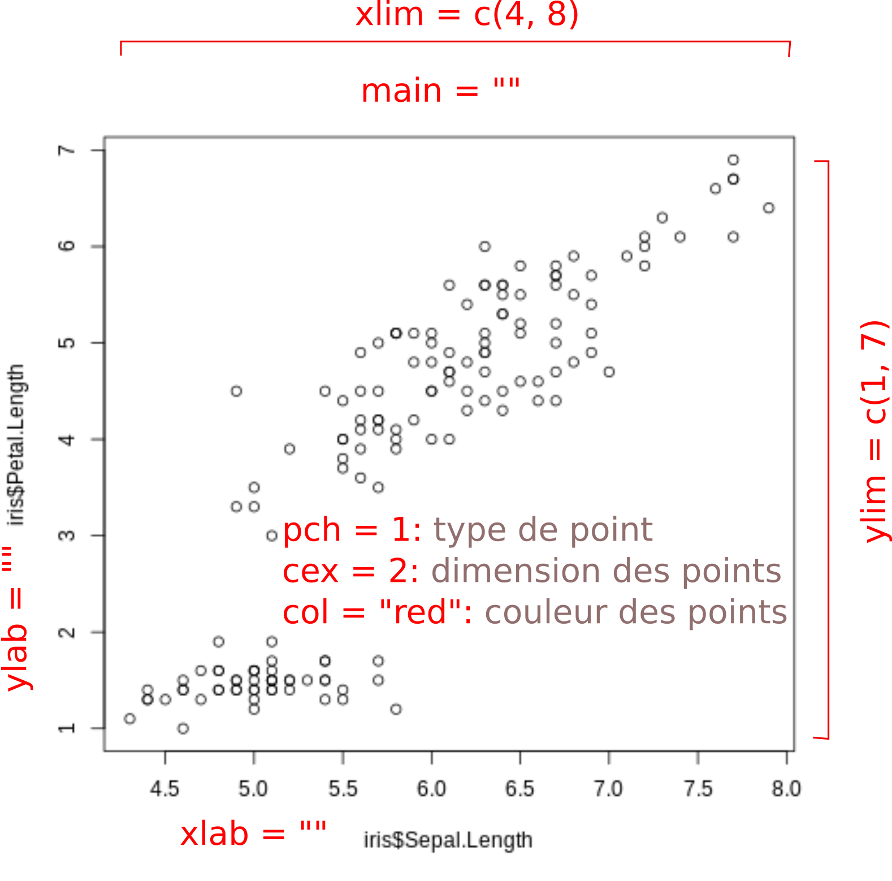

--- 
site: bookdown::bookdown_site
output: bookdown::gitbook 
---

# Visualisation {#chapitre-visualisation}

 ***
️\ **Objectifs spécifiques**:

À la fin de ce chapitre, vous

- comprendrez l'importance de l'exploration des données
- comprendrez les guides généraux pour créer un graphique approprié
- comprendrez la différence entre les modes impératifs et déclaratifs pour la création de graphique
- serez en mesure de créer des nuages de points, lignes, histogrammes, diagrammes en barres et boxplots en R
- saurez exporter un graphique en vue d'une publication

 ***

Reconnaissez-vous cette image (figure \@ref(fig:vis-hockey-stick))?

```{r vis-hockey-stick, out.width="100%", fig.align="center", fig.cap="Le bâton de hocket de Mann et al. (2001) Source: [GIEC, Bilan 2001 des changements climatiques : Les éléments scientifiques](https://www.ipcc.ch/pdf/climate-changes-2001/scientific-basis/scientific-spm-ts-fr.pdf))", echo = FALSE}
knitr::include_graphics("images/03_mann-hockey-stick-2001.png")
```

Elle a été conçue par Michael E. Mann, Raymond S. Bradley et Malcolm K. Hughes. Le graphique montre l'évolution des températures en °C normalisées selon la température moyenne entre 1961 et 1990 sur l'axe des Y en fonction du temps, sur l'axe des X. On le connait aujourd'hui comme le *bâton de hockey*, et on reconnait son rôle clé pour sensibiliser la civilisation entière face au réchauffement global.

Créer des graphiques est une tâche courante dans un flux de travail en science. Un graphique bien conçu est dense en information. La visualisation des données permet d'explorer des tableaux jusqu'à créer des éléments visuels voués à la publication, dont l'information serait autrement difficile, voire impossible à transmettre adéquatement.

## Pourquoi explorer graphiquement?

La plupart des graphiques que vous générerez ne seront pas destinés à être publiés. Ils viseront probablement d'abord à explorer des données. Cela vous permettra de mettre en évidence de nouvelles perspectives.

Prenons par exemple deux variables, $X$ et $Y$. Vous calculez leur moyenne, écart-type et la corrélation entre les deux variables (nous verrons les statistiques en plus de détails dans un prochain chapitre).

```{r vis-import-datasaurus, message=FALSE}
library("tidyverse")
datasaurus <- read_tsv("data/DatasaurusDozen.tsv")

cor_datasaurus <- datasaurus %>%
  group_by(dataset) %>%
  summarise(cor = cor(x = x, y = y, method = "pearson"))

datasaurus %>%
  group_by(dataset) %>%
  summarise_all(list(mean = mean, sd = sd)) %>%
  left_join(cor_datasaurus, by = "dataset")
```

Les moyennes, écarts-types et corrélations sont à peu près les mêmes pour tous les groupes. Peut-on conclure que tous les groupes sont semblables? Pas encore.

Pour démontrer que ces statistiques ne vous apprendront pas grand chose sur la structure des données, [Matejka et Fitzmaurice (2017)](https://www.autodeskresearch.com/publications/samestats) ont généré 12 jeux de données $X$ et $Y$, ayant chacun pratiquement les mêmes statistiques. Mais avec des structures bien différentes (figure \@ref(fig:vis-datasaurus-gif))!

```{r vis-datasaurus-gif, out.width="100%", fig.align="center", fig.cap="Animation montrant la progression du jeu de données *Datasaurus* pour toutes les formes visées. Source: [Same Stats, Different Graphs: Generating Datasets with Varied Appearance and Identical Statistics through Simulated Annealing](https://www.autodeskresearch.com/publications/samestats)", echo = FALSE}
knitr::include_graphics("images/04_DinoSequentialSmaller.gif")
```

## Publier un graphique

Vous voilà sensibilisé à l'importance d'explorer les données graphiquement. Mais ce qui ultimement émanera d'un projet sera le rapport que vous déposerez, l'article scientifique que vous ferez publier ou le billet de blogue que vous partagerez su les réseaux sociaux. Les graphiques inclus dans vos publications méritent une attention particulière pour que votre audience puisse comprendre les découvertes et perspectives offertes par vos travaux. Pour ce faire, un graphique doit répondre honnêtement à la question posée tout en étant attrayant.

### Cinq qualités d'un bon graphique

Alberto Cairo, chercheur spécialisé en visualisation de données, a fait paraître en 2016 le livre [*The Truthful art*](http://www.thefunctionalart.com/p/the-truthful-art-book.html), note cinq qualités d'une visualisation bien conçue (les citations de cette section proviennent de ma traduction de Alberto Cairo, *The Truthful Art* (2016), p. 45.).

> 1- **Elle est véritable**, puisqu'elle est basée sur une recherche exhaustive et honnête.

Cela vaut autant pour les graphiques que pour l'analyse de données. Il s'agit froidement de **présenter les données selon l'interprétation la plus exacte**. Les pièges à éviter sont le *picorage de cerises* et la *surinterprétation des données*. Le *picorage*, c'est lorsqu'on réduit les perspectives afin de soutenir un argumentaire. Par exemple, retirer des données d'une région ou d'une décennie qui rendraient factice une conclusion fixée *a priori*. Ceci vaut autant pour les graphiques que pour les statistiques (nous parlerons du p-hacking au prochain chapitre). La *surinterprétation*, c'est lorsque l'on saute rapidement aux conclusions: par exemple, que l'on génère des corrélations, voire même des relations de causalités à partir de ce qui n'est que du bruit de fond. À ce titre, lors [d'une conférence](https://youtu.be/uw1Tag08dK4), Heather Krause insiste sur l'importance de faire en sorte que les représentations graphiques répondent correctement aux questions posées dans une étude (figure \@ref(fig:vis-conference-2018)).

```{r vis-conference-2018, out.width="100%", fig.align="center", fig.cap="The F word: Protect your work from four hidden fallacies when working with data, une [conférence de Heather Krause, 2018](https://youtu.be/uw1Tag08dK4)", echo = FALSE}
knitr::include_graphics("images/03_Heather-Krause_youtube_.png")
```

> 2- **Elle est fonctionnelle**, puisqu'elle constitue une représentation précise des données, et qu'elle est construite de manière à laisser les observateurs.trices prendre des initiatives conséquentes.

"La seule chose qui est pire qu'un diagramme en pointe de tarte, c'est d'en présenter plusieurs" (Edward Tufte, designer, cité par Alberto Cairo, 2016, p. 50). Choisir le bon graphique pour représenter vos données est beaucoup moins une question de bon goût qu'**une question de démarche rationnelle sur l'objectif visé par la présentation d'un graphique**. Je présenterai des lignes guides pour sélectionner le type de graphique qui présentera vos données de manière fonctionnelle en fonction de l'objectif d'un graphique (d'ailleurs, avez-vous vraiment besoin d'un graphique?).

> 3- **Elle est attrayante** et intrigante, et même esthétiquement plaisante pour l'audience visée - les scientifiques d'abord, mais aussi le public en général.

En sciences naturelles, la pensée rationnelle, la capacité à organiser la connaissance et créer de nouvelles avenues sont des qualités qui sont privilégiées au talent artistique. **Que vous ayez où non des aptitudes en art visuel, présentez de l'information, pas des décorations**. Excel vous permet d'ajouter une perspective 3D à un diagramme en barres. La profondeur contient-elle de l'information? Non. Cette décoration ne fait qu'ajouter de la confusion. Minimalisez, fournissez le plus d'information possible avec le moins d'éléments graphiques possibles. C'est ce que vous proposent les guides graphiques que j'introduirai plus loin.

> 4- **Elle est pertinente**, puisqu'elle révèle des évidences scientifiques autrement difficilement accessibles.

Il s'agit de susciter un *eurêka*, dans le sens qu'**elle génère une idée, et parfois une initiative, en un coup d’œil**. Le graphique en bâton de hockey est un exemple où l'on a spontanément une idée de la situation. Cette situation peut être la présence d'un phénomène comme l'augmentation de la température globale, mais aussi l'absence de phénomènes pourtant attendus.

> 5- **Elle est instructive**, parce que si l'on saisit et accepte les évidences scientifiques qu'elle décrit, cela changera notre perception pour le mieux.

En présentant cette qualité, Alberto Cairo voulait insister ses lecteurs.trices à choisir des sujets de discussion visuelle de manière à participer à un monde meilleur. En ce qui nous concerne, il s'agit de bien **sélectionner l'information que l'on désire transmettre**. Imaginez que vous avez travaillé quelques jours pour créer un graphique, sont vous êtes fier, mais vous (ou un collègue hiérarchiquement favorisé) vous rendez compte que le graphique soutient peu ou pas le propos ou l'objectif de votre thèse/mémoire/rapport/article. Si c'est bien le cas, vous feriez mieux de laisser tomber votre oeuvre et considérer votre démarche comme une occasion d'apprentissage.

Alberto Cairo résume son livre *The Truthful Art* dans [une entrevue avec le National Geographic](http://news.nationalgeographic.com/2015/10/151016-data-points-alberto-cairo-interview/).

## Choisir le type de graphique le plus approprié

De nombreuses manières de présenter les données sont courrament utilisées, comme les nuages de point, les lignes, les histogrammes, les diagrammes en barre et en pointe de tarte. Les principaux types de graphique seront couverts dans ce chapitre. D'autres types spécialisés seront couverts dans les chapitres appropriés (graphiques davantage orientés vers les statistiques, les biplots, les dendrogrammes, les diagrammes ternaires, les cartes, etc.).

La visualisation de données est aujourd’hui devenue un métier pour plusieurs personnes ayant des affinités pour la science, les arts et la communication, dont certaines partagent leur expertise sur le web. À ce titre, le site [*from data to viz*](https://www.data-to-viz.com/) est à conserver dans vos marques-page. Il comprend des arbres décisionnels qui vous guident vers les options appropriées pour présenter vos données, puis fournissent des exemples pour produire ces visualisations en R. Également, je suggère le [site internet de Ann K. Emery](https://annkemery.com/essentials/), qui présente des lignes guide pour présenter le graphique adéquat selon les données en main. De nombreuses recettes sont également proposées sur [r-graph-gallery.com](https://www.r-graph-gallery.com/). En ce qui a trait aux couleurs, le choix n'est pas anodin. Si vous avez le souci des détails sur les éléments esthétiques de vos graphiques, je recommande la lecture de ce billet de blog de [Lisa Charlotte Rost](https://blog.datawrapper.de/colors/).

Retenez néanmois que *La couleur est une information*. Les couleurs devraient être sélectionnées d'abord pour être lisibles par les personnes ne percevant pas les couleurs (figure \@ref(fig:vis-colorbrewer)), selon le support (apte à être photocopié, lisible à l'écran, lisible sur des documents imprimés en noir et blanc) et selon le type de données.

- Données continues ou catégorielles ordinales: gradient (transition graduelle d'une couleur à l'autre), séquence (transition saccadée selon des groupes de données continues) ou divergentes (transition saccadée d'une couleur à l'autre vers des couleurs divergentes, par exemple orange vers blanc vers bleu).
- Données catégorielles nominales: couleurs éloignées d'une catégorie à une autre (plus il y a de catégories, plus les couleurs sont susceptibles de se ressembler).

```{r vis-colorbrewer, out.width="30%", fig.align="center", fig.cap="Capture d'écran de [colorbrewer2.org](http://colorbrewer2.org), qui propose des palettes de couleurs pour créer des cartes, mais l'information est pertinente pour tout type de graphique.", echo = FALSE}
knitr::include_graphics("images/03_colorbrewer2.png")
```

Le [Financial Times](https://ft.com/vocabulary) offre également ce guide visuel (figure \@ref(fig:vis-guide-ft)).

```{r vis-guide-ft, out.width="100%", fig.align="center", fig.cap="Guide de sélection de grapjhique du [Financial Times](https://ft.com/vocabulary)", echo = FALSE}
knitr::include_graphics("images/03_poster.png")
```

Cairo (2016) propose de procéder avec ces étapes:

1. Réfléchissez au message que vous désirez transmettre: comparer les catégories $A$ et $B$, visualiser une transition ou un changement de $A$ vers $B$, présenter une relation entre $A$ et $B$ ou la distribution de $A$ et $B$ sur une carte.
1. Essayez différentes représentations: si le message que vous désirez transmettre a plusieurs volets, il se pourrait que vous ayez besoin de plus d'un graphique.
1. Mettez de l'ordre dans vos données. C'était le sujet du chapitre \@ref(chapitre-tableaux).
1. Testez le résultat. "Hé, qu'est-ce que tu comprends de cela?" Si la personne hausse les épaules, il va falloir réévaluer votre stratégie.

## Choisir son outil de visualisation

Les modules et logiciels de visualisation sont basés sur des approches que l'on pourrait placer sur un spectre allant de l'impératif au déclaratif.

### Approche impérative

Selon cette approche, vous indiquez comment placer l'information dans un espace graphique. Vous indiquer les symboles, les couleurs, les types de ligne, etc. Peu de choses sont automatisées, ce qui laisse une grande flexibilité, mais demande de vouer beaucoup d'énergie à la manière de coder pour obtenir le graphique désiré. Le module graphique de Excel, ainsi que le module graphique de base de `R`, utilisent des approches impératives.

### Approche déclarative

Les stratégies d'automatisation graphique se sont grandement améliorées au cours des dernières années. Plutôt que de vouer vos énergies à créer un graphique, il est maintenant possible de spécifier ce que l'on veut présenter.

> La visualisation déclarative vous permet de penser aux données et à leurs relations, plutôt que des détails accessoires.
>
> [*Jake Vanderplas, Declarative Statistical Visualization in Python with Altair*](https://www.youtube.com/watch?v=FytuB8nFHPQ) (ma traduction)

L'approche déclarative passe souvent par une *grammaire graphique*, c'est-à-dire un langage qui explique ce que l'on veut présenter - en mode impératif, on spécifie plutôt comment on veut présenter les données. Le module **`ggplot2`** est le module déclaratif par excellence en R.

## Visualisation en R

En R, votre trousse d'outils de visualisation mériterait de comprendre les modules suivants.

- **`base`**. Le module de base de R contient des fonctions graphique très polyvalentes. Les axes sont générées automatiquement, on peut y ajouter des titres et des légendes, on peut créer plusieurs graphiques sur une même figure, on peut y ajouter différentes géométries (points, lignes et polygones), avec différents types de points ou de trait, et différentes couleurs, etc. Les modules spécialisés viennent souvent avec leurs graphiques spécialisés, construit à partir du module de base. En tant que module graphique impératif, on peut tout faire ou presque (pas d’interactivité), mais l'écriture du code est peut expressive.
- **`ggplot2`**. C'est le module graphique par excellence en R (et j'ose dire: en calcul scientifique). **`ggplot2`** se base sur une grammaire graphique. À partir d'un tableau de données, une colonne peut définir l'axe des x, une autre l'axe des y, une autre la couleur couleur des points ou leur dimension. Une autre colonne définissant des catégories peut segmenter la visualisation en plusieurs graphiques alignés horizontalement ou verticalement. Des extensions de **`ggplot2`** permettent de générer des cartes (ggmap), des diagrammes ternaires (ggtern), des animations (gganimate), etc.
- **`plotly`**. plotly est un module graphique particulièrement utile pour générer des graphiques interactifs. plotly offre une fonction toute simple pour rendre interactif un graphique **`ggplot2`**.

Nous survolerons rapidement le module de base, irons plus en profondeur avec **`ggplot2`**, puis je présenterai brièvement les graphiques interactifs avec plotly.

## Module de base pour les graphiques

Nous allons d'abord survoler le module de base, en mode impératif. La fonction de base pour les graphiques en R est `plot()`. Pour nous exercer avec cette fonction, chargeons d'abord le tableau de données d'exercice [`iris`](https://en.wikipedia.org/wiki/Iris_flower_data_set), publié en 1936 par le célèbre biostatisticien Ronald Fisher.

```{r vis-load-iris}
data("iris")
head(iris)
```

Le tableau `iris` contient 5 colonnes, les 4 premières décrivant les longueurs et largeurs des pétales et sépales de différentes espèces d'iris dont le nom apparaît à la 5ième colonne. La manière la plus rapide d’extraire une colonne d'un tableau est d'appeler le tableau, suivit du `$`, puis du nom de la colonne, par exemple `iris$Species`. Pour générer un graphique avec la fonction `plot()`:

```{r vis-plot-iris}
plot(iris$Sepal.Length, iris$Petal.Length)
```

Par défaut, le premier argument est le vecteur définissant l'axe des x et le deuxième est celui définissant l'axe des y. Vous rencontrerez souvent de telles utilisations d'arguments implicites, mais je préfère être explicite en définissant bien les arguments: `plot(x = iris$Sepal.Length, y = iris$Petal.Length)`. Le graphique précédent peut être amplement personnalisé en utilisant différents arguments (figure \@ref(fig:vis-plot-iris-elements)).

```{r vis-plot-iris-elements, fig.align="center", fig.cap="Éléments personnalisables d'un graphique de base,", echo = FALSE}

```

**Exercice**. Utilisez ces arguments dans la cellule de code de la figure `plot(iris$Sepal.Length, iris$Petal.Length)`.

Remarquez que la fonction a décidé toute seule de créer un nuage de point. La fonction plot() est conçue pour créer le graphique approprié selon le type des données spécifiées: lignes, boxplot, etc. Si l'on spécifiait les espèces comme argument `x`:

```{r vis-plot-iris-xyscatter}
plot(x = iris$Species, y = iris$Petal.Length)

# ou bien
# iris %>%
#   select(Species, Petal.Length) %>%
#   plot()
```

De même, la fonction `plot()` appliquée à un tableau de données générera une représentation bivariée.

```{r vis-plot-bivariate}
plot(iris)
```

Il est possible d'encoder des attributs grâce à des vecteurs de facteurs (catégories).

```{r vis-plot-bivariate-col}
plot(iris, col = iris$Species)
```

L'argument `type = ""` permet de personnaliser l'apparence:

- `type = "p"`: points
- `type = "l"`: ligne
- `type = "o"` et `type = "b"`: ligne et points
- `type = "n"`: ne rien afficher

Créons un jeu de données.

```{r vis-plot-tybe-b}
time <- seq(from = 0, to = 100, by = 10)
height <- abs(time * 0.1 + rnorm(length(time), 0, 2)) # abs pourvaleur absolue (changement de signe si négatif)
plot(x = time, y = height, type = "b", lty = 2, lwd = 1)
```

Le type de ligne est spécifié par l'argument `lty` (qui peut prendre un chiffre ou une châine de caractères, i.e. `1` est équivalent de `"solid"`, `2` de `"dashed"`, `3` de `"dotted"`, etc.) et la largeur du trait (valeur numérique), par l'argument `lwd`.

La fonction `hist()` permet quant à elle de créer des histogrammes. Parmi ses arguments, `breaks` est particulièrement utile, car il permet d'ajuster la segmentation des incréments.

```{r vis-plot-hist}
hist(iris$Petal.Length, breaks = 60)
```

**Exercice**. Ajustez le titre de l'axe des x, ainsi que les limites de l'axe des x. Êtes-vous en mesure de colorer l'intérieur des barres en bleu?

La fonction `plot()` peut être suivie de plusieurs autres couches comme des lignes (`lines()` ou `abline()`), des points (`points()`), du texte (`text()`), des polygones (`polygon()`, des légendes (`legend()`)), etc. On peut aussi personnaliser les couleurs, les types de points, les types de lignes, etc. L'exemple suivant ajoute une ligne au graphique. Ne prêtez pas trop attention aux fonctions `predict()` et `lm()` pour l'instant: nous les verrons au chapitre \@ref(chapitre-biostats).

```{r vis-plot-pred}
plot(x = time, y = height)
lines(x = time, y = predict(lm(height ~ time)))
```

Pour exporter un graphique, vous pouvez passer par le menu Export de RStudio. Mais pour des graphiques destinés à être publiés, je vous suggère d'exporter vos graphiques avec une haute résolution à la suite de la commande `png()` (ou `jpg()` ou `svg()`).

```{r vis-save-svg}
svg(filename = "images/mon-graphique.svg", width = 3000, height = 2000)
# png(filename = 'images/mon-graphique.png', width = 3000, height=2000, res=300)
plot(
  x = iris$Petal.Length,
  y = iris$Sepal.Length,
  col = iris$Species,
  cex = 3, # dimension des points
  pch = 16
) # type de points
dev.off()
```

Le format svg crée une version vectorielle du graphique, c'est-à-dire que l'image exportée est un fichier contenant les formes, non pas les pixels. Cela vous permet d'éditer votre graphique dans un logiciel de dessin vectoriel (comme [Inkscape](https://inkscape.org/)).

Dans le bloc de code précédent, j'ai mis en commentaire (`# ...`) le format d'image *png*, utile pour les images de type graphique, avec des changements de couleurs drastiques. J'y ai spécifié une haute résolution, à 300 pixels par pouce. Pour les photos, vous préférerez le format *jpg*. Des éditeurs demanderont peut-être des formats vectoriels comme *pdf* ou *eps*. Si vous ne trouvez pas de moyen de modifier un aspect du graphique dans le code (bouger des étiquettes ou des légendes, ajouter des éléments graphiques), vous pouvez exporter votre graphique en format svg et éditer votre graphique dans [Inkscape](https://inkscape.org/).

Le module de base de R comprend une panoplie d'autres particularités que je ne couvrirai pas ici, en faveur du module **`ggplot2`**.

## La grammaire graphique **`ggplot2`**

Le module **`esquisse`** est une extension de RStudio permettant de générer du code pour le module graphique **`ggplot2`**. La vidéo suivant, où j'utilise **`esquisse`**, montre ce en quoi consiste une grammaire graphique.

<video width="480" height="320" controls="controls">
<source src="images/03_esquisse.mp4" type="video/mp4">
</video>

Chaque colonne est un élément graphique et peut être encodé pour former la position en x, en y, la taille des points, leur couleur, ou même le panneau (facet). Mais quelle forme prendra le bidule positionner? Des points, lignes, boxplots, barres? C'est ce que défini une grammaire graphique. Brièvement, une grammaire graphique permet de schématiser des données avec des marqueurs (points, lignes, etc.) sur des attributs visuels (couleurs, dimension, forme). Cette approche permet de dégager 5 composantes.

1. **Les données**. Votre tableau est bien sûr un argument nécessaire pour générer le graphique.
1. **Les marqueurs**. Un terme abstrait pour désigner les points, les lignes, les polygones, les barres, les flèches, etc. En **`ggplot2`**, ce sont des *géométries*, par exemple `geom_point()` pour définir une géométrie de points.
1. **Les attributs encodés**. La position, la dimension, la couleur ou la forme que prendront les géométries. En **`ggplot2`**, on les nomme les *aesthetics*.
1. **Les attributs globaux**. Les attributs sont globaux lorsqu'ils sont constant (ils ne dépendent pas d'une variable). Les valeurs par défaut conviennent généralement, mais certains attributs peuvent être spécifiés: par exemple la forme ou la couleur des points, le type de ligne, etc.
1. **Les thèmes**. Le thème du graphique permet de personnalisé la manière dont le graphique est rendu. Il existe des thèmes prédéfinis, que vous pouvez ajuster, mais il est possible de créer vos propres thèmes (nous ne couvrirons pas cela dans ce cours).

```{r vis-allisonhorst-ggplot-art, out.width="100%", fig.align="center", fig.cap="Créer une oeuvre d'art avec **`ggplot2`**, dessin de [@allison_horst](https://twitter.com/allison_horst).", echo = FALSE}
knitr::include_graphics("images/03_ggplot2_masterpiece.png")
```

Le flux de travail pour créer un graphique à partir d'une grammaire ressemble donc à ceci:

```
Avec mon tableau,
Créer un marqueur (
encoder(position X = colonne A,
position Y = colonne B,
couleur = colonne C),
forme globale = 1)
Avec un thème noir et blanc
```

Le module **`tidyverse`** installera des modules utilisés de manière récurrente dans ce cours, comme **`ggplot2`**, **`dplyr`**, **`tidyr`** et **`readr`**. Je recommande de le charger au début de vos sessions de travail.

```{r vs-load-tidyverse, message=FALSE}
library("tidyverse")
```

L'approche *tidyverse* est une grammaire des données. Le module **`ggplot2`**, qui en fait partie, est une *grammaire graphique* (d'où le *gg* de *ggplot*).

## Mon premier ggplot

Pour notre premier exercice, je vais charger un tableau depuis le fichier de données [`abalone.data`](https://github.com/ajschumacher/gadsdc1/blob/master/dataset_research/clara_abalone.md). Pour plus de détails sur les tableaux de données, consultez le chapitre \@ref(chapitre-tableaux). Le fichier de données porte sur un escargot de mer et comprend le sexe (M: mâle, F: femelle et I: enfant), des poids et dimensions des individus observés, et le nombre d'anneaux comptés dans la coquille.

```{r vis-load-data}
abalone <- read_csv("data/abalone.csv")
```

Inspectons l'entête du tableau avec la fonction `head()`.

```{r vis-head-data}
head(abalone)
```

Suivant la grammaire graphique **`ggplot2`**, on pourra créer ce graphique de points comprenant les attributs suivants suivants.

1. `data = abalone`, le fichier de données.
1. `mapping = aes(...)`, spécifié comme attribut de la fonction `ggplot()`, cet encodage (ou `aes`thetic) reste l'encodage par défaut pour tous les marqueurs du graphique. Toutefois, l'encodage `mapping = aes()` peut aussi être spécifié dans la fonction du marqueur (par exemple `geom_point()`). Dans l'encodage global du graphique, on place en x la longueur de la coquille (`x = LongestShell`) et on place en y le poids de la coquille (`y = ShellWeight`).
1. Pour ajouter une fonction à `ggplot`, comme une nouvelle couche de marqueur ou des éléments de thème, on utilise le `+`. Généralement, on change aussi de ligne.
1. Le marqueur ajouté est un point, `geom_point()`, dans lequel on spécifie un encodage de couleur sur la variable Type (`colour = Type`) et un encodage de dimension du point sur la variable rings (`size = Rings`). L'attribut `alpha = 0.5` se situe hors du mapping et de la fonction `aes()`: c'est un attribut identique pour tous les points.

```{r vis-ggplot-abalone-scatter1}
ggplot(data = abalone, mapping = aes(x = LongestShell, y = ShellWeight)) +
  geom_point(mapping = aes(colour = Type, size = Rings), alpha = 0.5)
```

Il existe plusieurs types de marqueurs:

- `geom_point()` pour les points
- `geom_line()` pour les lignes
- `geom_bar()` pour les diagrammes en barre en décompte, `geom_col` en terme de grandeur  et `geom_histogram` pour les histogrammes
- `geom_boxplot()` pour les boxplots
- `geom_errorbar()`, `geom_pointrange()` ou `geom_crossbar()` pour les marges d'erreur
- `geom_map()` pour les cartes
- etc.

Il existe plusieurs attributs d'encodage:

- la position `x`, `y` et `z` (`z` pertinent notamment pour le marqueur `geom_tile()`)
- la taille `size`
- la forme des points `shape`
- la couleur, qui peut être discrète ou continue :
  - `colour`, pour la couleur des contours
  - `fill`, pour la couleur de remplissage
- le type de ligne `linetype`
- la transparence `alpha`
- et d'autres types spécialisés que vous retrouverez dans la documentation des marqueurs

Les types de marqueurs et leurs encodages sont décrits dans la [documentation de **`ggplot2`**](https://ggplot2.tidyverse.org/), qui fournit des  feuilles aide-mémoire qu'il est commode d'imprimer et d'afficher près de soi (figure \@ref(fig:vis-ggplot-cs)).

```{r vis-ggplot-cs, out.width="100%", fig.align="center", fig.cap="Aide-mémoire de **`ggplot2`**, source: https://www.rstudio.com/resources/cheatsheets/", echo = FALSE}
knitr::include_graphics("images/03_data-visualization-2.1.png")
```

#### Les facettes

Dans **`ggplot2`**, les `facet`ttes sont un type spécial d'encodage utilisés pour définir des grilles de graphique. Elles prennent deux formes:

- Le collage, `facet_wrap()`. Une variable catégorielle est utilisée pour segmenter les graphiques en plusieurs graphiques, qui sont placés l'un à la suite de l'autre dans un arrangement spécifié par un nombre de colonne ou un nombre de ligne.
- La grille, `facet_grid()`. Une ou deux variables segmentent les graphiques selon les colonnes et les lignes.

Les facettes peuvent être spécifiées n'importe où dans la chaîne de commande de **`ggplot2`**, mais conventionnellement, on les place tout de suite après la fonction `ggplot()`.

```{r vis-ggplot-abalone-scatter-facet-wrap}
ggplot(data = abalone, mapping = aes(x = LongestShell, y = ShellWeight)) +
  facet_wrap(~Type, ncol = 2) +
  geom_point(mapping = aes(colour = Type, size = Rings), alpha = 0.5)
```

La fonction `cut()` permet de discrétiser des variables continues en catégories ordonnées - les fonctions peuvent être utilisées à l'intérieur de la fonction ggplot.

```{r vis-ggplot-abalone-scatter-facet-grid}
ggplot(data = abalone, mapping = aes(x = LongestShell, y = ShellWeight)) +
  facet_grid(Type ~ cut(Rings, breaks = seq(0, 30, 5))) +
  geom_point(mapping = aes(colour = Type), alpha = 0.5)
```

Par défaut, les axes des facettes, ainsi que leurs dimensions, sont les mêmes. Une telle représentation permet de comparer les facets sur une même échelle. Les axes peuvent être définis selon les données avec l'argument `scales`, tandis que l'espace des facettes peut être conditionné selon l'argument `space` - pour plus de détails, [voir la fiche de documentation](https://ggplot2.tidyverse.org/reference/facet_grid.html).

**Exercice**. Personnalisez le graphique avec les données `abalone` en remplaçant les variables et en réorganisant les facettes.

### Plusieurs sources de données

Il peut arriver que les données pour générer un graphique proviennent de plusieurs tableaux. Lorsqu'on ne spécifie pas la source du tableau dans un marqueur, la valeur par défaut est le tableau spécifier dans l'amorce `ggplot()`. Il est néanmoins possible de définir une source personnalisée pour chaque marqueur en spécifiant `data = ...` comme argument du marqueur.

```{r vis-ggplot-abalone-mult-source}
abalone_siteA <- data.frame(
  LongestShell = c(0.3, 0.8, 0.7),
  ShellWeight = c(0.05, 0.81, 0.77)
)

ggplot(data = abalone, mapping = aes(x = LongestShell, y = ShellWeight)) +
  geom_point(mapping = aes(colour = Type, size = Rings), alpha = 0.5) +
  geom_point(data = abalone_siteA, size = 8, shape = 4)
```

### Exporter avec style

Le fond gris est une marque distinctive de **`ggplot2`**. Il n'est toutefois pas apprécié de tout le monde. D'autres thèmes dits *complets* peuvent être utilisés ([liste des thèmes complets](https://ggplot2.tidyverse.org/reference/ggtheme.html)). Les thèmes complets sont appelés avant la fonction `theme()`, qui permet d'effectuer des ajustements précis dont la liste exhaustive se trouve [dans la documentation de **`ggplot2`**](https://ggplot2.tidyverse.org/reference/theme.html).

Vous pouvez aussi personnaliser le titre des axes (`xlab()` et `ylab()`) ou du graphique (`ggtitle()`), ou bien tout spécifier dans une même fonction ou bien tout en même temps dans `labs(x = "...", y = "...", title = "...")`. Il est possible d'utiliser des exposants dans le titre des axes avec la fonction `expression()`, par exemple `labs(x = expression("Dose (kg ha"^"-1"~")"))` pour intituler l'axe des x avec $Dose~(kg~ha^{-1})$. Aussi convient parfois de spécifier les limites (`xlim()` et `ylim()`, ou `expand_limits(x = c(0, 1), y = c(0, 1))`).

Pour exporter un ggplot, on pourra utiliser les commandes de R `png()`, `svg()` ou `pdf()`, ou les outils de RStudio. Toutefois, **`ggplot2`** offre la fonction `ggsave()`, que l'on place en remorque du graphique, en spécifiant les dimensions (`width` et `height`) ainsi que la résolution (`dpi`). La résolution d'un graphique destiné à la publication est typiquement de plus de 300 dpi.

```{r vis-ggplot-abalone-custom}
ggplot(data = abalone, mapping = aes(x = LongestShell, y = ShellWeight)) +
  geom_point(mapping = aes(colour = Type, size = Rings), alpha = 0.5) +
  #xlab("Length (mm)") +
  #ylab("Shell weight (g)") +
  #ggtitle("Abalone") + # préférablement dans une même ligne
  labs(x = "Length (mm)", y = "Shell weight (g)", title = "Abalone") +
  xlim(c(0, 1)) +
  theme_classic() +
  theme(
    axis.title = element_text(size = 20),
    axis.text = element_text(size = 20),
    axis.text.y = element_text(size = 20, angle = 90, hjust = 0.5),
    legend.box = "horizontal"
  )
ggsave("images/abalone.png", width = 8, height = 8, dpi = 300)
```

Nous allons maintenant couvrir différents types de graphiques, accessibles selon différents marqueurs:

- les nuages de points
- les diagrammes en ligne
- les boxplots
- les histogrammes
- les diagrammes en barres

### Nuages de points

L'exemple précédent est un nuage de points, que nous avons généré avec le marqueur `geom_point()`, qui a déjà été passablement introduit. L'exploration de ces données a permis de détecter une croissance exponentielle du poids de la coquille en fonction de sa longueur. Il est clair que les abalones juvéniles (Type I) sont plus petits et moins lourds, mais nous devrons probablement procéder à des tests statistiques pour vérifier s'il y a des différences entre mâles et femelles.

Le graphique étant très chargé, nous avons utilisé des stratégies pour l'alléger en utilisant de la transparence et des facettes. Le marqueur `geom_jitter()` peut permettre de mieux apprécier la dispersion des points en ajoutant une dispersion randomisée en x ou en y.

```{r vis-ggplot-abalone-scatter-jitter}
ggplot(data = abalone, mapping = aes(x = LongestShell, y = ShellWeight)) +
  geom_jitter(mapping = aes(colour = Type, size = Rings), alpha = 0.5, width = 0.05, height = 0.1)
```

Dans ce cas-ci, ça ne change pas beaucoup, mais retenons-le pour la suite.

### Diagrammes en lignes

Les lignes sont utilisées pour exprimer des liens entre une suite d'information. Dans la plupart des cas, il s'agit d'une suite d'information dans le temps que l'on appelle les séries temporelles. En l’occurrence, les lignes devraient être évitées si la séquence entre les variables n'est pas évidente. Nous allons utiliser un tableau de données de R portant sur la croissance des orangers.

```{r vis-load-orange}
data("Orange")
head(Orange)
```

La première colonne spécifie le numéro de l'arbre mesuré, la deuxième son âge et la troisième sa circonférence. Le marqueur `geom_line()` permet de tracer la tendance de la circonférence selon l'âge. En encodant la couleur de la ligne à l'arbre, nous pourrons tracer une ligne pour chacun d'entre eux.

```{r vis-ggplot-orange-line}
ggplot(data = Orange, mapping = aes(x = age, y = circumference)) +
  geom_line(aes(colour = Tree))
```

La légende ne montre pas les numéros d'arbre en ordre croissance. En effet, la légende (tout comme les facettes) classe les catégories prioritairement selon l'ordre des catégories si elles sont ordinales, ou par ordre alphabétique si les catégories sont nominales. Inspectons la colonne `Tree` en inspectant le tableau avec la commande `str()` - la commande `glimpse()` du tidyverse donne un sommaire moins complet que `str()`.

```{r vis-ggplot-str-orange}
str(Orange)
```

En effet, la colonne `Tree` est un facteur ordinal dont les niveaux sont dans le même ordre que celui la légende.

### Les histogrammes

Nous avons vu les histogrammes dans la brève section sur les fonctions graphiques de base dans R: il s'agit de segmenter l'axe des x en incréments, puis de présenter sur l'axe de y le nombre de données que l'on retrouve dans cet incrément. Le marqueur à utiliser est `geom_histogram()`.

Revenons à nos escargots. Comment présenteriez-vous la longueur de la coquille selon la variable `Type`? Selon des couleurs ou des facettes? La couleur, dans le cas des histogrammes, est celle du pourtour des barres. Pour colorer l'intérieur des barres, l'argument à utiliser est `fill`.

```{r vis-ggplot-abalone-histogram}
ggplot(data = abalone, mapping = aes(x = LongestShell)) +
  geom_histogram(mapping = aes(fill = Type), colour = "black")
```

On n'y voit pas grand chose. Essayons plutôt les facettes.

```{r vis-ggplot-abalone-histogram-facet1}
ggplot(data = abalone, mapping = aes(x = LongestShell)) +
  facet_grid(Type ~ .) +
  geom_histogram()
```

Les facettes permettent maintenant de bien distinguer la distribution des longueur des juvéniles. L'argument `bins`, tout comme l'argument `breaks` du module graphique de base, permet de spécifier le nombre d'incréments, ce qui peut être très utile en exploration de données.

```{r vis-ggplot-abalone-histogram-facet2}
ggplot(data = abalone, mapping = aes(x = LongestShell)) +
  facet_grid(Type ~ .) +
  geom_histogram(bins = 60, colour = "white")
```

Le nombre d'incréments est un paramètre qu'il ne faut pas sous-estimer. À preuve, ce tweet de [@NicholasStrayer](https://twitter.com/NicholasStrayer):

<blockquote class="twitter-tweet" data-lang="fr"><p lang="en" dir="ltr">Histograms are fantastic, but make sure your bin-width/number is chosen well. This is the _exact_ same data, plotted with different bin-widths. Notice that the pattern doesn&#39;t necessarily get clearer as bin num increases. <a href="https://twitter.com/hashtag/dataviz?src=hash&amp;ref_src=twsrc%5Etfw">#dataviz</a> <a href="https://t.co/3MhSFwTVPH">pic.twitter.com/3MhSFwTVPH</a></p>&mdash; Nick Strayer (@NicholasStrayer) <a href="https://twitter.com/NicholasStrayer/status/1026893778404225024?ref_src=twsrc%5Etfw">7 août 2018</a></blockquote>
<script async src="https://platform.twitter.com/widgets.js" charset="utf-8"></script>

### Boxplots

Les boxplots sont une autre manière de visualiser des distributions. L'astuce est de créer une boîte qui s'étant du premier quartile (valeur où l'on retrouve 25% de données dont la valeur est inférieure) au troisième quartile  (valeur où l'on retrouve 75% de données dont la valeur est inférieure). Une barre à l'intérieur de cette boîte est placée à la médiane (qui est en fait le second quartile). De part et d'autre de la boîte, on retrouve des lignes spécifiant l'étendue hors quartile. Cette étendue peut être déterminée de plusieurs manières, mais dans le cas de **`ggplot2`**, il s'agit de 1.5 fois l'étendue de la boîte (l'*écart interquartile*). Au-delà de ces lignes, on retrouve les points représentant les valeurs extrêmes. Le marqueur à utiliser est `geom_boxplot()`. L'encodage x est la variable catégorielle et l'encodage y est la variable continue.

```{r vis-ggplot-abalone-boxplot}
ggplot(data = abalone, mapping = aes(x = Type, y = LongestShell)) +
  geom_boxplot()
```

**Exercice**. On suggère parfois de présenter les mesures sur les boxplots. Utiliser `geom_jitter()` avec un bruit horizontal.

### Les diagrammes en barre

Les diagrammes en barre représente une variable continue associée à une catégorie. Les barres sont généralement horizontales et ordonnées. Nous y reviendrons à la fin de ce chapitre, mais retenez pour l'instant que dans tous les cas, les diagrammes en barre doivent inclure le zéro pour éviter les mauvaises interprétations.

Pour les diagrammes en barre, nous allons utiliser les données de l'union internationale pour la conservation de la nature [distribuées par l'OCDE](https://stats.oecd.org/Index.aspx?DataSetCode=WILD_LIFE).

```{r vis-load-iucn}
# Certaines  colonnes de caractère sont considérées comme booléennes
# mieux vaut définir leur type pour s'assurer que le bon type
# soit attribué
especes_menacees <- read_csv("data/WILD_LIFE_14012020030114795.csv",
  col_types = list(
    "c", "c", "c", "c",
    "c", "c", "c", "c",
    "d", "c", "c", "c",
    "d", "c", "c"
  )
)
head(especes_menacees)
```

L'exercice consiste à créer un diagramme en barres horizontales du nombre de plantes vasculaires menacées de manière critique pour les 10 pays qui en contiennent le plus. Je vais effectuer quelques opérations sur ce tableau afin d'en arriver avec un tableau que nous pourrons convenablement mettre en graphique: n'y portez pas trop attention pour l'instant: ces opérations sont un avant-goût du prochain chapitre.

Nous allons filtrer le tableau pour obtenir le nombre de plantes vascularies critiquement menacées, sélectionner seulement le pays et le nombre d'espèces, les grouper par pays, additionner toutes les espèces pour chaque pays, les placer en ordre descendant et enfin sélectionner les 10 premiers. Comme vous le voyez, la création de graphique est liée de près avec la manipulation des tableaux!

```{r vis-iucn-arrange}
especes_crit <- especes_menacees %>%
  filter(IUCN == "CRITICAL", SPEC == "VASCULAR_PLANT") %>%
  dplyr::select(Country, Value) %>%
  group_by(Country) %>%
  summarise(n_critical_species = sum(Value)) %>%
  arrange(desc(n_critical_species)) %>%
  head(10)
especes_crit
```

Le premier type de diagramme en barre que nous allons couvrir est obtenu par le marqueur `geom_col()`.

```{r vis-ggplot-iucn-bar1}
ggplot(data = especes_crit, mapping = aes(x = Country, y = n_critical_species)) +
  geom_col()
```

Ce graphique est perfectible. Les barres sont verticales et non ordonnées. Souvenons-nous que **`ggplot2`** ordonne par ordre alphabétique si aucun autre ordre est spécifié. Nous pouvons changer l'ordre en changeant l'ordre des niveaux de la variable `Country` selon le nombre d'espèces grâce à la fonction `fct_reorder`.

```{r vis-iucn-order}
especes_crit <- especes_crit %>%
  mutate(Country = fct_reorder(Country, n_critical_species))
```

Pour faire pivoter le graphique, nous ajoutons `coord_flip()` à la séquence.

```{r vis-ggplot-iucn-bar2}
ggplot(data = especes_crit, mapping = aes(x = Country, y = n_critical_species)) +
  geom_col() +
  coord_flip()
```

Une autre méthode, `geom_bar()`, est un raccourcis permettant de compter le nombre d’occurrence d'une variable unique. Par exemple, dans le tableau abalone, le nombre de fois que chaque niveau de la variable Type

```{r vis-ggplot-iucn-bar3}
ggplot(data = abalone, mapping = aes(x = Type)) +
  geom_bar() +
  coord_flip()
```

Personnellement, j'aime bien passer par un diagramme en lignes avec le marqueur `geom_segment()`. Cela me donne la flexibilité pour définir un largeur de trait et éventuellement d'ajouter un point au bout pour en faire un [diagramme en suçon](https://www.r-graph-gallery.com/lollipop-plot/). Tenez, j'en profite aussi pour y ajouter du texte (décalé horizontalement) et étendre les limtes pour m'assurer que les chiffres apparaissent bien.

```{r vis-ggplot-iucn-bar4}
ggplot(data = especes_crit, mapping = aes(x = Country, y = n_critical_species)) +
  geom_segment(mapping = aes(xend = Country, yend = 0), lwd = 2) +
  geom_point(size = 5, colour = "black") +
  geom_text(aes(label = n_critical_species), hjust = -0.5) + # si ce ne sont pas des valeurs entières, arrondir avec signif()
  expand_limits(y = c(0, 1300)) +
  coord_flip() +
  theme_bw()
```

Les diagrammes en barre peuvent être placés en relation avec d'autres. Reprenons notre manipulation de données précédente, mais en incluant tous les pays, pour les trois niveaux d'alerte, pour les poissons.

```{r vis-ggplot-iucn-bar5}
especes_pays_iucn <- especes_menacees %>%
  filter(IUCN %in% c("ENDANGERED", "VULNERABLE", "CRITICAL"), SPEC == "FISH_TOT") %>%
  dplyr::select(IUCN, Country, Value) %>%
  group_by(Country, IUCN) %>%
  summarise(n_species = sum(Value)) %>%
  group_by(Country) %>%
  mutate(n_tot = sum(n_species)) %>%
  ungroup() %>% # pour pouvoir modifier Country, non modifiable tant qu'elle est une variable de regroupement (voir group_by)
  mutate(Country = fct_reorder(Country, n_tot))
head(especes_pays_iucn)
```

Pour placer les barres les unes à côté des autres, nous spécifions `position = "dodge"`.

```{r vis-ggplot-iucn-bar6}
ggplot(data = especes_pays_iucn, mapping = aes(x = Country, y = n_species)) +
  geom_col(aes(fill = IUCN), position = "dodge") +
  coord_flip()
```

Il est parfois plus pratique d'utiliser les facettes.

```{r vis-ggplot-iucn-bar6-facet}
ggplot(data = especes_pays_iucn, mapping = aes(x = Country, y = n_species)) +
  facet_grid(IUCN ~ .) +
  geom_col() +
  coord_flip()
```

Pour perfectionner encore ce graphique, on pourrait [réordonner les facettes individuellement](https://trinkerrstuff.wordpress.com/2016/12/23/ordering-categories-within-ggplot2-facets/), mais ne nous égarons par trop.

### Exporter un graphique

Plus besoin d'utiliser la fonction `png()` en mode **`ggplot2`**. Utilisons plutôt `ggsave()`.

```{r vis-ggplot-iucn-ggsave}
ggplot(data = especes_pays_iucn, mapping = aes(x = Country, y = n_species)) +
  facet_grid(IUCN ~ .) +
  geom_col(aes(fill = IUCN)) +
  coord_flip() +
  ggsave("images/especes_pays_iucn.png", width = 6, height = 8, dpi = 300)
```

## Les graphiques comme outil d'exploration des données

```{r vis-allisonhorst-ggplot-expl, out.width="100%", fig.align="center", fig.cap="Explorer les données avec **`ggplot2`**, dessin de [@allison_horst](https://twitter.com/allison_horst).", echo = FALSE}
knitr::include_graphics("images/03_ggplot2_exploratory.png")
```

La plupart des graphiques que vous créerez ne seront pas destinés à être publiés, mais serviront d'outil d'exploration des données. Le jeu de données datasaurus, présenté en [début de chapitre](#Pourquoi-explorer-grapiquement%3F), permet de saisir l'importance des outils graphiques pour bien comprendre les données.

```{r vis-load-datasaurus}
datasaurus <- read_tsv("data/DatasaurusDozen.tsv")
head(datasaurus)
```

Projetons d'abord les coordonnées x et y sur un graphique. J'utilise FacetGrid ici, sachant que ce sera utile pour l'exploration.

```{r vis-ggplot-datasaurus-scatter}
ggplot(data = datasaurus, mapping = aes(x = x, y = y)) +
  geom_point()
```

Ce graphique pourrait ressembler à une distribution binormale, ou *un coup de 12 dans une porte de grange*. Mais on aperçoit des données alignées, parfois de manière rectiligne, parfois en forme d'ellipse. Le tableau `datasaurus` a une colonne d'information supplémentaire. Utilisons-la comme catégorie pour générer des couleurs différente.

```{r vis-ggplot-datasaurus-scatter-col}
ggplot(data = datasaurus, mapping = aes(x = x, y = y)) +
  geom_point(mapping = aes(colour = dataset))
```

Ce n'est pas vraiment plus clair. Il y a toutefois des formes qui se dégage, comme des ellipse et des lignes. Et si je regarde bien, j'y vois une étoile. La catégorisation pourrait-elle être mieux utilisée si on segmentait par facettes au lieu de des couleurs?

```{r vis-ggplot-datasaurus-scatter-facet}
ggplot(data = datasaurus, mapping = aes(x = x, y = y)) +
  facet_wrap(~dataset, nrow = 2) +
  geom_point(size = 0.5) +
  coord_equal()
```

Voilà! Fait intéressant, ni les statistiques, ni les algorithmes de regroupement ne nous auraient été utiles pour différencier les groupes!

### Des graphiques interactifs!

Les graphiques sont traditionnellement des images statiques. Toutefois, les graphiques n'étant pas dépendants de supports papiers peuvent être utilisés de manière différente, en ajoutant une couche d’interaction. Conçue à Montréal, plotly est un module graphique interactif en soi. Il peut être utilisé grâce à son outil web, tout comme il peut être interfacé avec R, Python, javascript, etc. Mais ce qui retient notre attention ici est son interface avec **`ggplot2`**.

Les graphiques **`ggplot2`** peuvent être enregistrés en tant qu'objets. Il peuvent conséquemment être manipulés par des fonctions. La fonction ggplotly permet de rendre votre ggplot interactif.

```{r vis-plotly}
library("plotly")
especes_crit_bar <- ggplot(data = especes_crit, mapping = aes(x = Country, y = n_critical_species)) +
  geom_segment(mapping = aes(xend = Country, yend = 0), lwd = 2) +
  geom_point(size = 6) +
  coord_flip()
ggplotly(especes_crit_bar)
```

Vous pouvez publier votre graphique plotly en ligne pour le partager ou l'inclure dans une publication web. Il vous faudra créer un compte plotly, puis générer une clé d'utilisation dans Settings > API Keys > Generate key. Pour des raisons de sécurité, la clé du bloc ci-dessous ne fonctionnera pas. J'ai désactivé le bloc de code, mais le résultat se trouve en suivant le lien généré par plotly: https://plot.ly/~essicolo/152/.

```
Sys.setenv("plotly_username"="essicolo")
Sys.setenv("plotly_api_key"="iavd1ycE2iiqOp9YD45I")

chart_link <- api_create(x = ggplotly(especes_crit_bar), 
                         filename = "public-graph",
                         sharing = "public",
                         fileopt = "overwrite")
chart_link
```

### Des extensions de **`ggplot2`**

**`ggplot2`** est un module graphique élégant et polyvalent. Il a pourtant bien des limitations. Justement, le module est conçu pour être implémenté avec des extensions. Vous en trouverez plusieurs sur [ggplot2-exts.org](http://www.ggplot2-exts.org/gallery/), mais en trouverez de nombreuses autres en cherchant avec le terme **`ggplot2`** sur [github.com](https://github.com/search?q=ggplot2), probablement la plate-forme (voire un réseau social) de développement de logiciels la plus utilisée dans le monde. En voici quelques unes.

- [**`ggthemr`**](https://github.com/cttobin/ggthemr): spécifier un thème graphique une seule fois dans votre session, et tout le reste suit.
- [**`cowplot`**](https://github.com/wilkelab/cowplot) et [**`patchwork`**](https://patchwork.data-imaginist.com/index.html) permettent de créer des graphiques prêts pour la publication, par exemple en créant des grilles de plusieurs ggplots, en les numérotant, etc.
- Si les thèmes de base ne vous conviennent pas, vous en trouverez d'autres en installant [**`ggthemes`**](https://github.com/jrnold/ggthemes).
- [**`ggmap`**](https://github.com/dkahle/ggmap) et [**`ggspatial`**](https://github.com/paleolimbot/ggspatial) sont deux extensions pour créer des cartes. Un chapitre sur les données spatiales est en développement.
- [**`ggtern`**](http://www.ggtern.com/) permet de créer des diagrammes ternaires, qui sont utiles pour la visualisation de proportions incluant trois composantes. Ce sujet est couvert au chapitre 6, en développement.

### Aller plus loin avec **`ggplot2`**

- [Claus O. Wilke](@ClausWilke) est professeur en biologie intégrative à l'Université du Texas à Austin. Son livre [Fundamentals of Data Visualization](https://serialmentor.com/dataviz/) est un guide théorique et pratique pour la visualisation de données avec **`ggplot2`**.
- Le site [data-to-viz.com](https://www.data-to-viz.com/) vous accompagne dans le choix du graphique à créer selon vos données.
- Le site [r-graph-gallery.com](https://www.r-graph-gallery.com/) offre des recettes pour créer des graphiques avec **`ggplot2`**.

## Extra: Règles particulières

> Les mauvais graphiques peuvent survenir à cause de l'ignorance, bien sûr, mais souvent ils existent pour la même raison que la boeuferie [*bullhist*] verbale ou écrite. Parfois, les gens ne se soucient pas de la façon dont ils présentent les données aussi longtemps que ça appuie leurs arguments et, parfois, ils ne se soucient pas que ça porte à confusion tant qu'ils ont l'air impressionnant. $-$ Carl Bergstorm et Jevin West, [Calling Bullshit Read-Along Week 6: Data Visualization](https://graphpaperdiaries.com/2017/04/09/calling-bs-read-along-week-6-data-visualization/)

Une représentation visuelle est un outil tranchant qui peut autant présenter un état véritable des données qu'une perspective trompeuse. Bien souvent, une ou plusieurs des 5 qualités ne sont pas respectées. Les occasions d'erreur ne manquent pas - j'en ferai mention dans la section *Choisir le bon type de graphique*. Pour l'instant, notons quelques règles particulières.

### Ne tronquez pas inutilement l'axe des $y$

Tronquer l'axe vertical peut amener à porter de fausses conclusions. 

<center>

Effets sur la perception d'utiliser différentes références. Source: Yau (2015), [Real Chart Rules to Follow](https://flowingdata.com/2015/08/11/real-chart-rules-to-follow/).
</center>

La règle semble simple: les diagrammes en barre (utilisés pour représenter une grandeur) devraient toujours présenter le 0 et les diagrammes en ligne (utilisés pour présenter des tendances) ne requiert pas nécessairement le zéro ((Bergstrom et West, Calling bullshit: Misleading axes on graphs)[http://callingbullshit.org/tools/tools_misleading_axes.html]). Mais le zéro n'est pas toujours lié à une quantité particulière, par exemple, la température ou un log-ratio. De plus, avec un diagramme en ligne on pourra toujours magnifier des tendances en zoomant sur une variation somme toute mineure. On arrive donc moins à une règle qu'une qualité d'un bon graphique, en particulier la qualité no 1 de Cairo: offrir une représentation honnête des données. Par exemple, Nathan Yau, auteur du blogue Flowing Data, [propose](https://flowingdata.com/2015/08/31/bar-chart-baselines-start-at-zero/) de présenter des résultats de manière relative à la mesure initiale. C'est d'ailleurs ce qui a été fait pour générer le graphique de Michael Mann et al., ci-dessus, où le zéro correspond à la moyenne des températures enregistrées entre 1961 et 1990.

Il peut être tentant de tronquer l'axe des $y$ lorsque l'on désire superposer deux axes verticaux. Souvent, l'utilisation de plusieurs axes verticaux amène une perception de causalité dans des situations de [fausses corrélations](http://www.tylervigen.com/spurious-correlations). On ne devrait pas utiliser plusieurs axes verticaux.

### Utilisez un encrage proportionnel

Cette règle a été proposée par Edward Tufte dans [Visual Display of Quantitative Information](https://ariane25.bibl.ulaval.ca/ariane/wicket/detail?c=ariane&m=S&rq.ct=PE&rq.fa=false&rq.r.esc=false&rq.r.l[0].c=TI&rq.r.l[0].ex=false&rq.r.l[0].op=AND&rq.r.l[0].v=Visual+Display+of+Quantitative+Information&rq.r.la=*&rq.r.loc=*&rq.r.pft=false&rq.r.ta=*&rq.r.td=*&rq.rows=2&rq.st=1). Une des raisons pour lesquelles on évite de tronquer l'axe des $y$ en particulier pour les diagrammes en barre est que l'aire représentant une mesure (la quantité d'"encre" nécessaire pour la dessiner) devrait être proportionnelle à sa magnitude. Les diagrammes en barre sont particulièrement sensibles à cette règle, étant donnée que la largeur des barres peuvent amplifier l'aire occupée. Deux solutions dans ce cas: (1) utiliser des barres minces ou (2) préférer des "diagrammes de points" (*dot charts*, à ne pas confondre aux nuages de points).

L'encrage a beau être proportionnel, la difficulté que les humains éprouvent à comparer la dimension des cercles, et *a fortiori* la dimension de parties de cercle, donne peu d'avantage à utiliser des diagrammes en pointe de tarte, souvent utilisés pour illustrer des proportions. Nathan Yau [suggère](https://flowingdata.com/2015/08/11/real-chart-rules-to-follow/) de les utiliser avec suspicions et d'explorer d'[autres options](https://flowingdata.com/2009/11/25/9-ways-to-visualize-proportions-a-guide/).


Pour comparer deux proportions, une avenue intéressante est le diagramme en pente, suggéré notamment par [Ann K. Emery](http://annkemery.com/avoiding-diagonal-text/#).


Par extension, le diagramme en pente devient un diagramme en ligne lorsque plusieurs types de proportions sont comparées, ou lorsque des proportions évoluent selon des données continuent.

De la même manière, les [diagrammes en bulles](https://datavizcatalogue.com/methods/bubble_chart.html) ne devraient pas être représentatifs de la quantité, mais plutôt de contextualiser des données. Justement, le graphique tiré des données de *Gap minder* présenté plus haut est une contextualisation: l'aire d'un cercle ne permet pas de saisir la population d'un pays, mais de comparer grossièrement la population d'un pays par rapport aux autres.

### Publiez vos données

Vous avez peut-être déjà feuilleté un article et voulu avoir accès aux données incluses dans un graphique. Il existe des outils pour digitaliser des graphiques pour en extraire les données. Mais le processus est fastidieux, long, souvent peu précis. De plus en plus, les chercheurs sont encouragés à publier leurs données et leurs calculs. Matplotlib et Seaborn sont des outils graphiques classiques qui devraient être accompagnés des données et calculs ayant servi à les générer. Mais ce n'est pas idéal non plus. En revanche, les outils graphiques modernes comme Plotly et Altair peuvent être exportés en code javascipt, qui contient toutes les informations sur les données et la manière de les représenter graphiquement. Ce chapitre a pour objectif de vous familiariser avec les outils de base les plus communément utilisés en calcul scientifique avec Python, mais je vous encourage à explorer la nouvelle génération d'outils graphiques. Nous verrons ça au chapitre \@ref(chapitre-git).

### Visitez www.junkcharts.typepad.com de temps à autre 

Le statisticien et blogueur Kaiser Fung s'affaire quotidiennement à proposer des améliorations à de mauvais graphiques sur son blogue [Junk Charts](www.junkcharts.typepad.com).


```{r vis-rm-all, include=FALSE}
rm(list = ls())
```
