Biostatistiques
================
Serge-Étienne Parent
2018-11-27

Aux chapitres précédents, nous avons vu comment visualiser, organiser et
manipuler des tableaux de données. La statistique est une collection de
disciplines liées à la collecte, l’oragnisation, l’analyse,
l’interprétation et la présentation de données. Les biostatistiques
est l’application de ces disciplines à la biosphère.

Dans [*Principles and procedures of statistics: A biometrical
approach*](https://www.amazon.com/Principles-Procedures-Statistics-Biometrical-Approach/dp/0070610282),
Steel, Torie et Dickey (1997) définissent les statistiques ainsi:

> Les statistiques forment la science, pure et appliquée, de la
> création, du développement, et de l’application de techniques par
> lesquelles l’incertitude de l’induction inférentielle peut être
> évaluée. (ma traduction)

Alors que l’inférence consiste à généraliser des observations sur des
échantillons à l’ensemble d’une population, l’induction est un type de
raisonnement qui permet de généraliser des observations en théories. Les
statistiques permettent d’évaluer l’incertitude découlant du processus
qui permet d’abord de passer de l’échantillon à la population représenté
par cet échantillon, puis de passer de cette représentation d’une
population en lois générales la concernant.

La définition de Whitlock et Schuluter (2015), dans [The Analysis of
Biological Data](http://whitlockschluter.zoology.ubc.ca/), est plus
simple, insistant sur l’inférence:

> La statistique est l’étude des méthodes pour décrire et mesures des
> aspects de la nature à partir d’échantillons. (ma traduction)

Les statistiques consistent à *faire du sens* (anglicisme assumé) avec
des observations: collecter des échantillons, transformer les données,
effectuer des tests, analyser les résultats, les interpréter et les
visualiser. Bien que ces tâches soient complexes, en particulier en ce
qui a trait aux tests statistiques, la plupart des opérations
statistiques peuvent être effectuées sans l’assistance de
statisticien.ne.s… à condition de comprendre suffisamment les concepts
utilisés. Ce chapitre à lui seul est trop court pour permettre
d’intégrer toutes les connaissances nécessaires à une utilisation
raisonnée des statistiques, mais fourni les bases pour aller plus loin.
Notez que les erreurs d’interprétation statistiques sont courantes et la
consultation de spécialistes n’est souvent pas un luxe.

Dans ce chapitre, nous verrons comment répondre correctement à une
question valide et adéquate avec l’aide d’outils de calcul scientifique.
Nous couvrirons les notions de bases des distributions et des variables
aléatoires qui nous permettront d’effectuer des tests statistiques
commun avec R. Nous couvrirons aussi les erreurs communément commises en
recherche académique et les moyens simples de les éviter.

Ce chapitre est une introduction aux statistiques avec R, et ne
rempalcera pas un bon cours de stats.

En plus des modules de base de R nous utiliserons

  - les modules de la `tidyverse`,
  - le module de donées agricoles `agridat`, ainsi que
  - le module `nlme` spécialisé pour la modélisation mixte.

Avant de survoler les applications statistiques avec R, je vais d’abord
et rapidement présenter quelques notions importantes en statistiques:
populations et échantillons, variables, probabilités et distributions.
Nous allons effectuer des tests d’hypothèse univariés (notamment les
tests de *t* et les analyses de variance) et détailler la notion de
p-value. Mais avant tout, je vais m’attarder plus longuement aux modèles
linéaires généralisés, incluant en particulier des effets fixes et
aléatoires (modèles mixtes), qui fournissent une trousse d’analyse
polyvalente en analyse multivariée. Je terminerai avec les perspectives
multivariés que sont les matrices de covariance et de corrélation.

# Populations et échantillons

Le principe d’inférence consiste à généraliser des conclusions à
l’échelle d’une population à partir d’échantillons issus de cette
population. Alors qu’une **population** contient tous les éléments
étudiés, un **échantillon** d’une population est une observation
unique. Une expérience bien conçue fera en sorte que les échantillons
sont représentatifs de la population qui, la plupart du temps, ne peut
être observée entièrement pour des raisons pratiques.

Les principes d’expérimentation servant de base à la conception d’une
bonne méthodologie sont présentés dans le cours [*Dispositifs
expérimentaux
(BVG-7002)*](https://www.ulaval.ca/les-etudes/cours/repertoire/detailsCours/bvg-7002-dispositifs-experimentaux.html).
Également, je recommande le livre *Princpes d’expérimentation:
planification des expériences et analyse de leurs résultats* de Pierre
Dagnelie (2012), [disponible en ligne en format
PDF](http://www.dagnelie.be/docpdf/ex2012.pdf). Un bon aperçu des
dispositifs expérimentaux est aussi présenté dans [*Introductory
Statistics with R*](https://www.springer.com/us/book/9780387790534), de
Peter Dalgaard (2008).

Une population est échantillonnée pour induire des **paramètres**: un
rendement typique dans des conditions météorologiques, édaphiques et
managériales données, la masse typique des faucons pélerins, mâles et
femelles, le microbiome typique d’un sol agricole ou forestier, etc. Une
**statistique** est une estimation d’un paramètre calculée à partir des
données, par exemple une moyenne et un écart-type.

Par exemple, la moyenne (\(\mu\)) et l’écart-type (\(\sigma\)) d’une
population sont estimés par les moyennes (\(\bar{x}\)) et écarts-types
(\(s\)) calculés sur les données issues de l’échantillonnage.

Chaque paramètre est liée à une perspective que l’on désire conaître
chez une population. Ces angles d’observations sont les **variables**.

# Les variables

Nous avons abordé au chapitre 4 la notion de *variable* par
l’intermédiaire d’une donnée. Une variable est l’observation d’une
caractéristique décrivant un échantillon et qui est susceptible de
varier d’un échantillon à un autre. Si les observations varient en effet
d’un échantillon à un autre, on parlera de variable aléatoire. Même le
hasard est régit par certaines loi: ce qui est aléatoire dans une
variable peut être décrit par des **lois de probabilité**, que nous
verrons plus bas.

Mais restons aux variables pour l’instant. Par convention, on peut
attribuer aux variables un symbole mathématique. Par exemple, on peut
donner à la masse volumique d’un sol (qui est le résultat d’une
méthodologie précise) le sympole \(\rho\). Lorsque l’on attribue une
valeur à \(\rho\), on parle d’une donnée. Chaque donnée d’une
observation a un indice qui lui est propre, que l’on désigne souvent par
\(i\), que l’on place en indice \(\rho_i\). Pour la première donnée, on
a \(i=1\), donc \(\rho_1\). Pour un nombre \(n\) d’échantillons, on aura
\(\rho_1\), \(\rho_2\), \(\rho_3\), …, \(\rho_n\), formant le vecteur
\(\rho = \left[\rho_1, \rho_2, \rho_3, ..., \rho_n \right]\).

En R, une variable est associée à un vecteur ou une colonne d’un
tableau.

``` r
rho <- c(1.34, 1.52, 1.26, 1.43, 1.39) # matrice 1D
data <- data.frame(rho = rho) # tableau
data
```

    ##    rho
    ## 1 1.34
    ## 2 1.52
    ## 3 1.26
    ## 4 1.43
    ## 5 1.39

Il existe plusieurs types de variables, qui se regroupe en deux grandes
catégories: les **variables quantitatives** et les **variables
qualitatives**.

## Variables quantitatives

Ces variables peuvent être continuent dans un espace échantillonal réel
ou discrètes dans un espace échantillonnal ne considérant que des
valeurs fixes. Notons que la notion de nombre réel est toujours une
approximation en sciences expérimentales comme en calcul numérique,
étant donnée que l’on est limité par la précision des appareils comme
par le nombre d’octets à utiliser. Bien que les valeurs fixes des
disctributions discrètes ne soient pas toujours des valeurs entières,
c’est bien souvent le cas en biostatistiques comme en démocgraphie, où
les décomptes d’individus sont souvents présents (et où la notion de
fraction d’individus n’est pas acceptée).

## Variables qualitatives

On exprime parfois qu’une variable qualitative est une variable
impossible à mesurer numériquement: une couleur, l’appartenance à espèce
ou à une série de sol. Pourtant, dans bien des cas, les variables
qualitatives peut être encodées en variables quantitatives. Par exemple,
on peut accoler des pourcentages de sable, limon et argile à un loam
sableux, qui autrement est décrit par la classe texturale d’un sol. Pour
une couleur, on peut lui associer des pourcentages de rouge, vert et
bleu, ainsi qu’un ton. En ce qui a trait aux variables ordonnées, il est
possible de supposer un étalement. Par exemple, une variable d’intensité
faible-moyenne-forte peut être transformée linéairement en valeurs
quantitatives -1, 0 et 1. Attention toutefois, l’étalement peut parfois
être quadratique ou logarithmique. Les séries de sol peuvent être
encodées par la proportion de gleyfication ([Parent et
al., 2017](https://www.frontiersin.org/articles/10.3389/fenvs.2017.00081/full#B4)).
Quant aux catégories difficilement transformables en quantités, on
pourra passer par l’**encodage catégoriel**, souvent appelé
*dummyfication*, qui nous verrons plus loin.

# Les probabilités

> « Nous sommes si éloignés de connaître tous les agens de la nature, et
> leurs divers modes d’action ; qu’il ne serait pas philosophique de
> nier les phénomènes, uniquement parce qu’ils sont inexplicables dans
> l’état actuel de nos connaissances. Seulement, nous devons les
> examiner avec une attention d’autant plus scrupuleuse, qu’il paraît
> plus difficile de les admettre ; et c’est ici que le calcul des
> probabilités devient indispensable, pour déterminer jusqu’à quel point
> il faut multiplier les observations ou les expériences, afin d’obtenir
> en faveur des agens qu’elles indiquent, une probabilité supérieure aux
> raisons que l’on peut avoir d’ailleurs, de ne pas les admettre. » —
> Pierre-Simon de Laplace

Une probabilité est la vraissemblance qu’un événements se réalise chez
un échantillon. Les probabilités forment le cadre des systèmes
stochastiques, c’est-à-dire des systèmes trop complexes pour en
connaître exactement les aboutissants, auxquels ont attribue une part
de hasard. Ces systèmes sont prédominants dans les processus vivants.

On peut dégager deux perspectives sur les probabilités: l’une passe par
une interprétations fréquentistes, l’autre bayésiennes. L’interprétation
**fréquentiste** représente la fréquence des occurences après un nombre
infini d’événements. Par exemple, si vous jouez à pile ou face un grand
nombre de fois, le nombre de pile sera égal à la moitié du nombre de
lancés. Il s’agit de l’interprétation communément utilisée.

L’interprétation **bayésienne** vise à quantifier l’incertitude des
phénomènes. Dans cette perspective, plus l’information s’accumule, plus
l’incertitude diminue. Cette approche gagne en notoriété notamment parce
qu’elle permet de décrire des phénomènes qui, intrinsèquement, ne
peuvent être répétés infiniments (absence d’asymptote), comme celles qui
sont bien définis dans le temps ou sur des populations limités.

L’approche fréquentielle teste si les données concordent avec un modèle
du réel, tandis que l’approche bayésienne évalue la probabilité que le
modèle soit réel. Une erreur courrante consiste à aborder des
statistiques fréquentielles comme des statistiques bayésiennes. Par
exemple, si l’on désire évaluer la probabilité de l’existance de vie sur
Mars, on devra passer par le bayésien, car avec les stats
fréquentielles, l’on devra plutôt conclure si les données sont conforme
ou non avec l’hypothèse de la vie sur Mars (exemple tirée du blogue
[Dynamic
Ecology](https://dynamicecology.wordpress.com/2011/10/11/frequentist-vs-bayesian-statistics-resources-to-help-you-choose/)).

Des rivalités factices s’installent enter les tenants des différentes
approches, dont chacune, en réalité, répond à des questions différentes
dont il convient réfléchir sur les limitations. Bien que les
statistiques bayésiennes soient de plus en plus utilisées, nous ne
couvrirons dans ce chapitre que l’approche fréquentielle. L’approche
bayésienne est néamoins traitée dans le document compplémentaire
statistiques\_bayes.ipynb (section en développement).

# Les distributions

Une variable aléatoire peut prendre des valeurs selon des modèles de
distribution des probabilités. Une distribution est une fonction
mathématique décrivant la probabilité d’observer une série
d’évennements. Ces événemements peuvent être des valeurs continues,
des nombres entiers, des catégories, des valeurs booléennes (Vrai/Faux),
etc. Dépendamment du type de valeur et des observations obtenues, on
peut associer des variables à différentes lois de probabilité. Toujours,
l’aire sous la courbe d’une distribution de probabilité est égale à 1.

En statistiques inférentielle, les distributions sont les modèles,
comprenant certains paramètres comme la moyenne et la variance pour les
distributions normales, à partir desquelles les données sont générées.

Il existe deux grandes familles de distribution: **discrètes** et
**continues**. Les distributions discrètes sont contraintes à des
valeurs prédéfinies (finies ou infinies), alors que les distributions
continues prennent nécessairement un nombre infinie de valeur, dont la
probabilité ne peut pas être évaluée ponctuellement, mais sur un
intervalle.

L’**espérance** mathématique est une fonction de tendance centrale,
souvent décrite par un paramètre. Il s’agit de la moyenne d’une
population pour une distribution normale. La **variance**, quant à elle,
décrit la variabilité d’une population, i.e. son étalement autour de
l’espérance. Pour une distribution normale, la variance d’une
population est aussi appelée variance, souvent présentée par
l’écart-type.

## Distribution binomiale

En tant que scénario à deux issues possibles, des tirages à pile ou face
suivent une loi binomiale, comme toute variable booléenne prenant une
valeur vraie ou fausse. En biostatistiques, les cas communs sont la
présence/absence d’une espèce, d’une maladie, d’un trait
phylogénétique, ainsi que les catégories encodées. Lorsque l’opération
ne comprend qu’un seul échantillon (i.e. un seul tirage à pile ou face),
il s’agit d’un cas particulier d’une loi binomiale que l’on nomme une
loi de *Bernouilli*.

Pour 25 tirages à pile ou face indépendants (i.e. dont l’ordre des
tirages ne compte pas), on peut dessiner une courbe de distribution dont
la somme des probabilités est de 1. La fonction `dbinom` est une
fonctions de distribution de probabilités. Les fonctions de distribution
de probabilités discrètes sont appelées des fonctions de
    masse.

``` r
library("tidyverse")
```

    ## Warning: package 'tidyverse' was built under R version 3.5.1

    ## -- Attaching packages ---------------------------------- tidyverse 1.2.1 --

    ## v ggplot2 3.1.0     v purrr   0.2.5
    ## v tibble  1.4.2     v dplyr   0.7.8
    ## v tidyr   0.8.2     v stringr 1.3.1
    ## v readr   1.2.1     v forcats 0.3.0

    ## Warning: package 'tidyr' was built under R version 3.4.4

    ## Warning: package 'readr' was built under R version 3.4.4

    ## Warning: package 'dplyr' was built under R version 3.4.4

    ## -- Conflicts ------------------------------------- tidyverse_conflicts() --
    ## x dplyr::filter() masks stats::filter()
    ## x dplyr::lag()    masks stats::lag()

``` r
x <- 0:25
y <- dbinom(x = x, size = 25, prob = 0.5)
print(paste('La somme des probabilités est de', sum(y)))
```

    ## [1] "La somme des probabilités est de 1"

``` r
ggplot(data = data.frame(x, y), mapping = aes(x, y)) +
  geom_segment(aes(x = x, xend = x, y = 0, yend = y), color = "grey50") +
  geom_point()
```

<!-- -->

## Distribution de Poisson

La loi de Poisson (avec un P majuscule, introduite par le mathématicien
français Siméon Denis Poisson et non pas l’animal) décrit des
distributions discrètes de probabilité d’un nombre d’événements se
produisant dans l’espace ou dans le temps. Les distributions de Poisson
décrive ce qui tient du décompte. Il peut s’agir du nombre de
grenouilles traversant une rue quotidiennement, du nombre de plants
d’asclépiades se trouvant sur une terre cultivée, ou du nombre
d’événements de précipitation au mois de juin, etc. La distribution
de Poisson n’a qu’un seul paramètre, \(\lambda\), qui décrit tant la
moyenne des décomptes.

Par exemple, en un mois de 30 jours, et une moyenne de 8 événements de
précipitation pour ce mois, on obtient la distribution suivante.

``` r
x <- 1:30
y <- dpois(x, lambda = 8)
print(paste('La somme des probabilités est de', sum(y)))
```

    ## [1] "La somme des probabilités est de 0.999664536835124"

``` r
ggplot(data = data.frame(x, y), mapping = aes(x, y)) +
  geom_segment(aes(x = x, xend = x, y = 0, yend = y), color = "grey50") +
  geom_point()
```

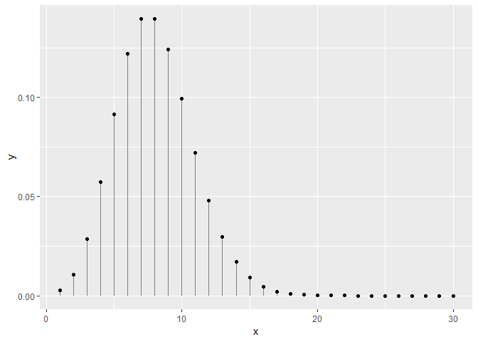<!-- -->

## Distribution uniforme

La distribution la plus simple est probablement la distribution
uniforme. Si la variable est discrète, chaque catégorie est associé à
une probabilité égale. Si la variable est continue, la probabilité est
directement proportionnelle à la largeur de l’intervalle. On utilise
rarement la distribution uniforme en biostatistiques, sinon pour décrire
des *a priori* vagues pour l’analyse bayésienne (ce sujet est traité
dans le document 5.1\_bayes.ipynb). Nous utilisons la fonction `dunif`.
À la différence des distributions discrètes, les fonctions de
distribution de probabilités continues sont appelées des fonctions de
densité d’une loi de probabilité (*probability density function*).

``` r
increment <- 0.01
x <- seq(-4, 4, by = increment)
y1 <- dunif(x, min = -3, max = 3)
y2 <- dunif(x, min = -2, max = 2)
y3 <- dunif(x, min = -1, max = 1)

print(paste('La somme des probabilités est de', sum(y3 * increment)))
```

    ## [1] "La somme des probabilités est de 1.005"

``` r
gg_unif <- data.frame(x, y1, y2, y3) %>% gather(variable, value, -x)

ggplot(data = gg_unif, mapping = aes(x = x, y = value)) +
  geom_line(aes(colour = variable))
```

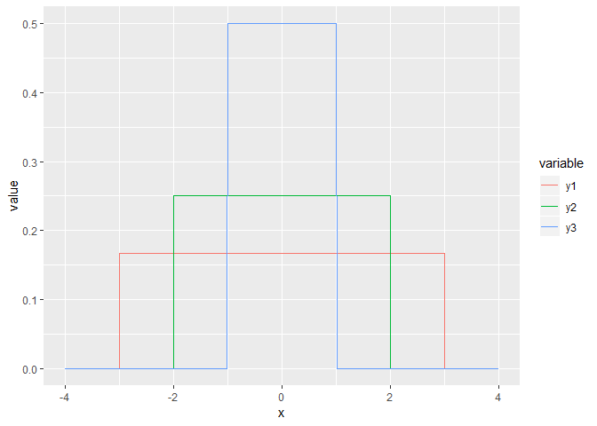<!-- -->

## Distribution normale

La plus répendue de ces lois est probablement la loi normale, parfois
nommée loi gaussienne et plus rarement loi laplacienne. Il s’agit de la
distribution classique en forme de cloche.

La loi normale est décrite par une moyenne, qui désigne la tendance
centrale, et une variance, qui désigne l’étalement des probabilités
autours de la moyenne. La racine carrée de la variance est l’écart-type.

Les distributions de mesures exclusivement positives (comme le poids ou
la taille) sont parfois avantageusement approximées par une loi
**log-normale**, qui est une loi normale sur le logarithme des valeurs:
la moyenne d’une loi log-normale est la moyenne géométrique.

``` r
increment <- 0.01
x <- seq(-10, 10, by = increment)
y1 <- dnorm(x, mean = 0, sd = 1)
y2 <- dnorm(x, mean = 0, sd = 2)
y3 <- dnorm(x, mean = 0, sd = 3)

print(paste('La somme des probabilités est de', sum(y3 * increment)))
```

    ## [1] "La somme des probabilités est de 0.999147010743368"

``` r
gg_norm <- data.frame(x, y1, y2, y3) %>% gather(variable, value, -x)

ggplot(data = gg_norm, mapping = aes(x = x, y = value)) +
  geom_line(aes(colour = variable))
```

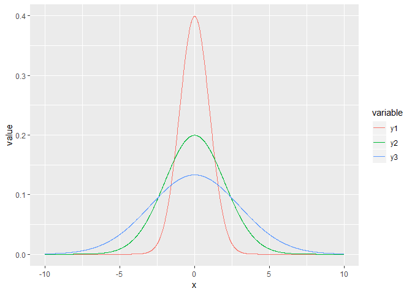<!-- -->

Quelle est la probabilité d’obtenir le nombre 0 chez une observation
continue distribuée normalement dont la moyenne est 0 et l’écart-type
est de 1? Réponse: 0. La loi normale étant une distribution continue,
les probabilités non-nulles ne peuvent être calculés que sur des
intervalles. Par exemple, la probabilité de retrouver une valeur dans
l’intervalle entre -1 et 2 est calculée en soustraiyant la probabilité
cumulée à -1 de la probabilité cumulée à 2.

``` r
increment <- 0.01
x <- seq(-5, 5, by = increment)
y <- dnorm(x, mean = 0, sd = 1)

prob_between <- c(-1, 2)

gg_norm <- data.frame(x, y)
gg_auc <- gg_norm %>%
  filter(x > prob_between[1], x < prob_between[2]) %>%
  rbind(c(prob_between[2], 0)) %>%
  rbind(c(prob_between[1], 0))

ggplot(data.frame(x, y), aes(x, y)) +
  geom_polygon(data = gg_auc, fill = '#71ad50') + # #71ad50 est un code de couleur format hexadécimal
  geom_line()
```

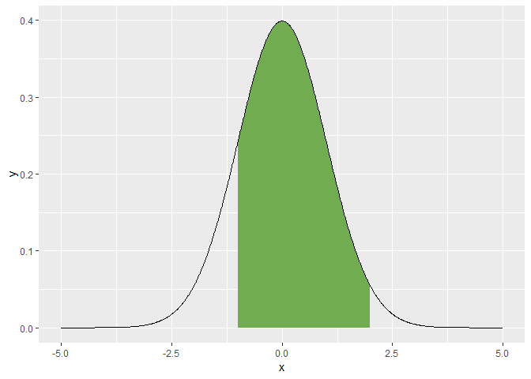<!-- -->

``` r
prob_norm_between <- pnorm(q = prob_between[2], mean = 0, sd = 1) - pnorm(q = prob_between[1], mean = 0, sd = 1)
print(paste("La probabilité d'obtenir un nombre entre", 
            prob_between[1], "et", 
            prob_between[2], "est d'environ", 
            round(prob_norm_between, 2) * 100, "%"))
```

    ## [1] "La probabilité d'obtenir un nombre entre -1 et 2 est d'environ 82 %"

La courbe normale peut être utile pour évaluer la distribution d’une
population. Par exemple, on peut calculer les limites de région sur la
courbe normale qui contient 95% des valeurs possibles en tranchant 2.5%
de part et d’autre de la moyenne. Il s’agit ainsi de l’intervalle de
confiance sur la déviation de la distribution.

``` r
increment <- 0.01
x <- seq(-5, 5, by = increment)
y <- dnorm(x, mean = 0, sd = 1)

alpha <- 0.05
prob_between <- c(qnorm(p = alpha/2, mean = 0, sd = 1),
                  qnorm(p = 1 - alpha/2, mean = 0, sd = 1))

gg_norm <- data.frame(x, y)
gg_auc <- gg_norm %>%
  filter(x > prob_between[1], x < prob_between[2]) %>%
  rbind(c(prob_between[2], 0)) %>%
  rbind(c(prob_between[1], 0))

ggplot(data = data.frame(x, y), mapping = aes(x, y)) +
  geom_polygon(data = gg_auc, fill = '#71ad50') + # #71ad50 est un code de couleur format hexadécimal
  geom_line() +
  geom_text(data = data.frame(x = prob_between,
                              y = c(0, 0),
                              labels = round(prob_between, 2)),
            mapping = aes(label = labels))
```

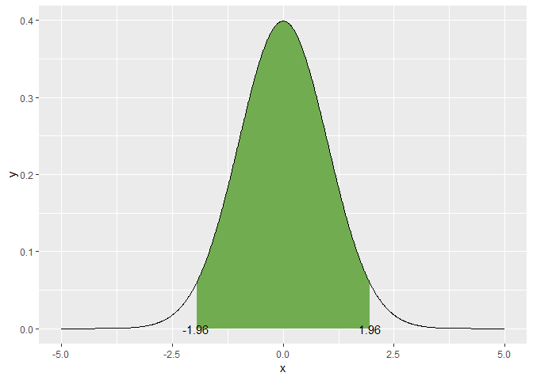<!-- -->

On pourrait aussi être intéressé à l’intervalle de confiance sur la
moyenne. En effet, la moyenne suit aussi une distribution normale, dont
la tendance centrale est la moyenne de la distribution, et dont
l’écart-type est noté *erreur standard*. On calcule cette erreur en
divisant la variance par le nombre d’observation, ou en divisant
l’écart-type par la racine carrée du nombre d’observations. Ainsi,
pour 10 échantillons:

``` r
increment <- 0.01
x <- seq(-5, 5, by = increment)
y <- dnorm(x, mean = 0, sd = 1)

alpha <- 0.05
prob_between <- c(qnorm(p = alpha/2, mean = 0, sd = 1) / sqrt(10),
                  qnorm(p = 1 - alpha/2, mean = 0, sd = 1) / sqrt(10))

gg_norm <- data.frame(x, y)
gg_auc <- gg_norm %>%
  filter(x > prob_between[1], x < prob_between[2]) %>%
  rbind(c(prob_between[2], 0)) %>%
  rbind(c(prob_between[1], 0))

ggplot(data = data.frame(x, y), mapping = aes(x, y)) +
  geom_polygon(data = gg_auc, fill = '#71ad50') + # #71ad50 est un code de couleur format hexadécimal
  geom_line() +
  geom_text(data = data.frame(x = prob_between,
                              y = c(0, 0),
                              labels = round(prob_between, 2)),
            mapping = aes(label = labels))
```

<!-- -->

# Statistiques descriptives

On a vu comment générer des statistiques sommaires en R avec la fonction
`summary()`. Reprenons les données d’iris.

``` r
data("iris")
summary(iris)
```

    ##   Sepal.Length    Sepal.Width     Petal.Length    Petal.Width   
    ##  Min.   :4.300   Min.   :2.000   Min.   :1.000   Min.   :0.100  
    ##  1st Qu.:5.100   1st Qu.:2.800   1st Qu.:1.600   1st Qu.:0.300  
    ##  Median :5.800   Median :3.000   Median :4.350   Median :1.300  
    ##  Mean   :5.843   Mean   :3.057   Mean   :3.758   Mean   :1.199  
    ##  3rd Qu.:6.400   3rd Qu.:3.300   3rd Qu.:5.100   3rd Qu.:1.800  
    ##  Max.   :7.900   Max.   :4.400   Max.   :6.900   Max.   :2.500  
    ##        Species  
    ##  setosa    :50  
    ##  versicolor:50  
    ##  virginica :50  
    ##                 
    ##                 
    ## 

Pour précisément effectuer une moyenne et un écart-type sur un vecteur,
passons par les fonctions `mean()` et `sd()`.

``` r
mean(iris$Sepal.Length)
```

    ## [1] 5.843333

``` r
sd(iris$Sepal.Length)
```

    ## [1] 0.8280661

Pour effectuer un sommaire de tableau piloté par une fonction, nous
passons par la gamme de fonctions `summarise()`, de dplyr. Dans ce cas,
avec `group_by()`, nous fragmentons le tableau par espèce pour effectuer
un sommaire sur toutes les variables.

``` r
iris %>%
  group_by(Species) %>%
  summarise_all(mean)
```

    ## # A tibble: 3 x 5
    ##   Species    Sepal.Length Sepal.Width Petal.Length Petal.Width
    ##   <fct>             <dbl>       <dbl>        <dbl>       <dbl>
    ## 1 setosa             5.01        3.43         1.46       0.246
    ## 2 versicolor         5.94        2.77         4.26       1.33 
    ## 3 virginica          6.59        2.97         5.55       2.03

Vous pourriez être intéressé par les quartiles à 25, 50 et 75%. Mais la
fonction `summarise()` n’autorise que les fonctions dont la sortie est
d’un seul objet, alors faisons sorte que l’objet soit une liste -
lorsque l’on imbrique une fonction `funs`, le tableau à insérer dans la
fonction est indiqué par un `.`.

``` r
iris %>%
  group_by(Species) %>%
  summarise_all(funs(list(quantile(.))))
```

    ## # A tibble: 3 x 5
    ##   Species    Sepal.Length Sepal.Width Petal.Length Petal.Width
    ##   <fct>      <list>       <list>      <list>       <list>     
    ## 1 setosa     <dbl [5]>    <dbl [5]>   <dbl [5]>    <dbl [5]>  
    ## 2 versicolor <dbl [5]>    <dbl [5]>   <dbl [5]>    <dbl [5]>  
    ## 3 virginica  <dbl [5]>    <dbl [5]>   <dbl [5]>    <dbl [5]>

En mode programmation classique de R, on pourra générer les quartiles à
la pièce.

``` r
quantile(iris$Sepal.Length[iris$Species == 'setosa'])
```

    ##   0%  25%  50%  75% 100% 
    ##  4.3  4.8  5.0  5.2  5.8

``` r
quantile(iris$Sepal.Length[iris$Species == 'versicolor'])
```

    ##   0%  25%  50%  75% 100% 
    ##  4.9  5.6  5.9  6.3  7.0

``` r
quantile(iris$Sepal.Length[iris$Species == 'virginica'])
```

    ##    0%   25%   50%   75%  100% 
    ## 4.900 6.225 6.500 6.900 7.900

La fonction `table()` permettra d’obtenir des décomptes par catégorie,
ici par plages de longueurs de sépales. Pour obtenir les proportions du
nombre total, il s’agit d’encapsuler le tableau croisé dans la fonction
`prop.table()`.

``` r
tableau_croise <- table(iris$Species, 
                        cut(iris$Sepal.Length, breaks = quantile(iris$Sepal.Length)))
tableau_croise
```

    ##             
    ##              (4.3,5.1] (5.1,5.8] (5.8,6.4] (6.4,7.9]
    ##   setosa            35        14         0         0
    ##   versicolor         4        20        17         9
    ##   virginica          1         5        18        26

``` r
prop.table(tableau_croise)
```

    ##             
    ##                (4.3,5.1]   (5.1,5.8]   (5.8,6.4]   (6.4,7.9]
    ##   setosa     0.234899329 0.093959732 0.000000000 0.000000000
    ##   versicolor 0.026845638 0.134228188 0.114093960 0.060402685
    ##   virginica  0.006711409 0.033557047 0.120805369 0.174496644

# Tests d’hypothèses à un et deux échantillons

Un test d’hypothèse permet de décider si une hypothèse est confirmée ou
rejetée à un seuil de probabilité prédéterminé.

Cette section est inspirée du chapitre 5 de
[Dalgaard, 2008](https://www.springer.com/us/book/9780387790534).

-----

### Information: l’hypothèse nulle

Les tests d’hypothèse évalue des *effets* statistiques (qui ne sont pas
nécessairement des effets de causalité). L’effet à évaluer peut être
celui d’un traitement, d’indicateurs météorologiques
(e.g. précipitations totales, degré-jour, etc.), de techniques de
gestion des paysages, etc. Une recherche est menée pour évaluer
l’hypothèse que l’on retrouve des différences entre des unités
expérimentales. Par convention, l’**hypothèse nulle** (écrite \(H_0\))
est l’hypothèse qu’il n’y ait pas d’effet (c’est l’hypothèse de l’avocat
du diable 😈) à l’échelle de la population (et non pas à l’échelle de
l’échantillon). À l’inverse, l’**hypothèse alternative** (écrite
\(H_1\)) est l’hypothèse qu’il y ait un effet à l’échelle de la
population.

-----

À titre d’exercice en stats, on débute souvent par en testant si deux
vecteurs de valeurs continues proviennent de populations à moyennes
différentes ou si un vecteur de valeurs a été généré à partir d’une
population ayant une moyenne donner. Dans cette section, nous
utiliserons la fonction `t.test()` pour les tests de t et la fonction
`wilcox.test()` pour les tests de Wilcoxon (aussi appelé de
Mann-Whitney).

## Test de t à un seul échantillon

Nous devons assumer, pour ce test, que l’échantillon est recueillit
d’une population dont la distribution est normale,
\(\mathcal{N} \sim \left( \mu, \sigma^2 \right)\), et que chaque
échantillon est indépendant l’un de l’autre. L’hypothèse nulle est
souvent celle de l’avocat du diable, c’est-à-dire: ici, que
\(\mu = \bar{x}\). L’erreur standard sur la moyenne (ESM) de
l’échantillon, \(\bar{x}\) est calculée comme suit.

\[ESM = \frac{s}{\sqrt{n}}\]

où \(s\) est l’écart-type de l’échantillon et \(n\) est le nombre
d’échantillons.

Pour tester l’intervalle de confiance de l’échantillon, on mutliplie
l’ESM par l’aire sous la courbe de densité couvrant une certaine
proportion de part et d’autre de l’échantillon. Pour un niveau de
confiance de 95%, on retranche 2.5% de part et d’autre.

``` r
set.seed(33746)
x <- rnorm(20, 16, 4)

level <-  0.95
alpha <- 1-level

x_bar <- mean(x)
s <- sd(x)
n <- length(x)

error <- qnorm(1 - alpha/2) * s / sqrt(n)
error
```

    ## [1] 1.483253

L’interval de confiance est l’erreur de par et d’autre de la moyenne.

``` r
c(x_bar - error, x_bar + error)
```

    ## [1] 14.35630 17.32281

Si la moyenne de la population est de 16, un nombre qui se situe dans
l’intervalle de confiance on accepte l’hypothèse nulle au seuil 0.05.
Si le nombre d’échantillon est réduit (généralement \< 30), on passera
plutôt par une distribution de t, avec \(n-1\) degrés de liberté.

``` r
error <- qt(1 - alpha/2, n-1) * s / sqrt(n)
c(x_bar - error, x_bar + error)
```

    ## [1] 14.25561 17.42351

Plus simplement, on pourra utiliser la fonction `t.test()` en spécifiant
la moyenne de la population. Nous avons généré 20 données avec une
moyenne de 16 et un écart-type de 4. Nous savons donc que la vraie
moyenne de l’échantillon est de 16. Mais disons que nous testons
l’hypothèse que ces données sont tirées d’une population dont la
moyenne est 18 (et implicitement que sont écart-type est de 4).

``` r
t.test(x, mu = 18)
```

    ## 
    ##  One Sample t-test
    ## 
    ## data:  x
    ## t = -2.8548, df = 19, p-value = 0.01014
    ## alternative hypothesis: true mean is not equal to 18
    ## 95 percent confidence interval:
    ##  14.25561 17.42351
    ## sample estimates:
    ## mean of x 
    ##  15.83956

La fonction retourne la valeur de t (*t-value*), le nombre de degrés de
liberté (\(n-1 = 19\)), une description de l’hypothèse alternative
(`alternative hypothesis: true mean is not equal to 18`), ainsi que
l’intervalle de confiance au niveau de 95%. Le test contient aussi la
*p-value*. Bien que la *p-value* soit largement utilisée en science

-----

### Information: la *p-value*

La *p-value*, ou valeur-p ou p-valeur, est utilisée pour trancher si,
oui ou non, un résultat est **significatif** (en langage scientifique,
le mot significatif ne devrait être utilisé *que* lorsque l’on réfère à
un test d’hypothèse statistique). Vous retrouverez des *p-value* partout
en stats. Les *p-values* indiquent la confiance que l’hypothèse nulle
soit vraie, selon les données et le modèle statistique utilisées.

> La p-value est la probabilité que les données aient été générées pour
> obtenir un effet équivalent ou plus prononcé si l’hypothèse nulle est
> vraie.

Une *p-value* élevée indique que le modèle appliqué à vos données
concordent avec la conclusion que l’hypothèse nulle est vraie, et
inversement si la *p-value* est faible. Le seuil arbitraire utilisée en
écologie et en agriculture, comme dans plusieurs domaines, est 0.05.

Les six principes de l’[American Statistical
Association](https://phys.org/news/2016-03-american-statistical-association-statement-significance.html)
guident l’interprétation des *p-values*. \[ma traduction\]

0.  Les *p-values* indique l’ampleur de l’incompatibiilté des données
    avec le modèle statistique
1.  Les *p-values* nemesurent pas la probabilité que l’hypothèse étudiée
    soit vraie, ni la probabilité que les données ont été générées
    uniquement par la chance.
2.  Les conclusions scientifiques et décisions d’affaire ou politiques
    ne devraient pas être basées sur si une *p-value* atteint un seuil
    spécifique.
3.  Une inférence appropriée demande un rapport complet et transparent.
4.  Une *p-value*, ou une signification statistique, ne mesure pas
    l’ampleur d’un effet ou l’importance d’un résultat.
5.  En tant que tel, une *p-value* n’offre pas une bonne mesure des
    évidences d’un modèle ou d’une hypothèse.

Cet encadré est inspiré d’un [billet de blogue de Jim
Frost](https://blog.minitab.com/blog/adventures-in-statistics-2/how-to-correctly-interpret-p-values)
et d’un [rapport de l’American Statistical
Association](https://phys.org/news/2016-03-american-statistical-association-statement-significance.html).

-----

Dans le cas précédent, la *p-value* était de 0.01014. Pour aider notre
interprétation, prenons l’hypothèse alternative: `true mean is not equal
to 18`. L’hypothèse nulle était bien que *la vraie moyenne est égale à
18*. Insérons la *p-value* dans la définition: la probabilité que les
données aient été générées pour obtenir un effet équivalent ou plus
prononcé si l’hypothèse nulle est vraie est de 0.01014. Il est donc très
peu probable que les données soient tirées d’un échantillon dont la
moyenne est de 18. Au seuil de significativité de 0.05, on rejette
l’hypothèse nulle et l’on conclu qu’à ce seuil de confiance,
l’échantillon ne provient pas d’une population ayant une moyenne de
18.

-----

## Attention: mauvaises interprétations des *p-values*

> “La p-value n’a jamais été conçue comme substitut au raisonnement
> scientifique” [Ron Wasserstein, directeur de l’American Statistical
> Association](https://phys.org/news/2016-03-american-statistical-association-statement-significance.html)
> \[ma traduction\].

**Un résultat montrant une p-value plus élevée que 0.05 est-il
pertinent?**

Lors d’une conférence, Dr Evil ne présentent que les résultats
significatifs de ses essais au seuil de 0.05. Certains essais ne sont
pas significatifs, mais bon, ceux-ci ne sont pas importants… En écartant
ces résultats, Dr Evil commet 3 erreurs:

1.  La *p-value* n’est pas un bon indicateur de l’importance d’un test
    statistique. L’importance d’une variable dans un modèle devrait être
    évaluée par la valeur de son coefficient. Son incertitude devrait
    être évaluée par sa variance. Une manière d’évaluer plus intuitive
    la variance est l’écart-type ou l’intervalle de confiance. À un
    certain seuil d’intervalle de confiance, la p-value traduira la
    probabilité qu’un coefficient soit réellement nul ait pu générer des
    données démontrant un coefficient égal ou supérieur.
2.  Il est tout aussi important de savoir que le traitement fonctionne
    que de savoir qu’il ne fonctionne pas. Les résultats démontrant des
    effets sont malheureusement davantage soumis aux journaux et
    davantage publiés que ceux ne démontrant pas d’effets ([Decullier et
    al., 2005](https://doi.org/10.1136/bmj.38488.385995.8F)).
3.  Le seuil de 0.05 est arbitraire.

-----

-----

### Attention au *p-hacking*

Le *p-hacking* (ou *data dredging*) consiste à manipuler les données et
les modèles pour faire en sorte d’obtenir des *p-values* favorables à
l’hypothèse testée et, éventuellement, aux conclusions recherchées.
**À éviter dans tous les cas. Toujours. Toujours. Toujours.**

Vidéo suggérée (en anglais).

[](https://youtu.be/0Rnq1NpHdmw)

-----

## Test de Wilcoxon à un seul échantillon

Le test de t suppose que la distribution des données est normale… ce qui
est rarement le cas, surtout lorsque les échantillons sont peu nombreux.
Le test de Wilcoxon ne demande aucune supposition sur la distribution:
c’est un test non-paramétrique basé sur le tri des valeurs.

``` r
wilcox.test(x, mu = 18)
```

    ## 
    ##  Wilcoxon signed rank test
    ## 
    ## data:  x
    ## V = 39, p-value = 0.01208
    ## alternative hypothesis: true location is not equal to 18

Le `V` est la somme des rangs positifs. Dans ce cas, la *p-value* est
semblable à celle du test de t, et les mêmes conclusions s’appliquent.

## Tests de t à deux échantillons

Les tests à un échantillon servent plutôt à s’exercer: rarement en
aura-t-on besoin en recherche, où plus souvent, on voudra comparer les
moyennes de deux unités expérimentales. L’expérience comprend donc deux
séries de données continues, \(x_1\) et \(x_2\), issus de lois de
distribution normale \(\mathcal{N} \left( \mu_1, \sigma_1^2 \right)\) et
\(\mathcal{N} \left( \mu_2, \sigma_2^2 \right)\), et nous testons
l’hypothèse nulle que \(\mu_1 = \mu_2\). La statistique t est calculée
comme suit.

\[t = \frac{\bar{x_1} - \bar{x_2}}{ESDM}\]

L’ESDM est l’erreur standard de la différence des moyennes:

\[ESDM = \sqrt{ESM_1^2 + ESM_2^2}\]

Si vous supposez que les variances sont identiques, l’erreur standard
(s) est calculée pour les échantillons des deux groupes, puis insérée
dans le calcul des ESM. La statistique t sera alors évaluée à
\(n_1 + n_2 - 2\) degrés de lberté. Si vous supposez que la variance est
différente (*procédure de Welch*), vous calculez les ESM avec les
erreurs standards respectives, et la statistique t devient une
approximation de la distribution de t avec un nombre de degrés de
liberté calculé à partir des erreurs standards et du nombre
d’échantillon dans les groupes: cette procédure est considérée comme
plus prudente
([Dalgaard, 2008](https://www.springer.com/us/book/9780387790534), page
101).

Prenons les données d’iris pour l’exemple en excluant l’iris setosa
étant donnée que les tests de t se restreignent à deux groupes. Nous
allons tester la longueur des pétales.

``` r
iris_pl <- iris %>% 
    filter(Species != "setosa") %>%
    select(Species, Petal.Length)
sample_n(iris_pl, 5)
```

    ##       Species Petal.Length
    ## 98  virginica          5.2
    ## 55  virginica          5.8
    ## 92  virginica          5.1
    ## 13 versicolor          4.0
    ## 46 versicolor          4.2

Dans la prochaine cellule, nous introduisons l’*interface-formule* de R,
où l’on retrouve typiquement le `~`, entre les variables de sortie à
gauche et les variables d’entrée à droite. Dans notre cas, la variable
de sortie est la variable testée, `Petal.Length`, qui varie en fonction
du groupe `Species`, qui est la variable d’entrée (variable explicative)
- nous verrons les types de variables plus en détails dans la section
[Les modèles statistiques](#Les-mod%C3%A8les-statistiques), plus bas.

``` r
t.test(formula = Petal.Length ~ Species,
       data = iris_pl, var.equal = FALSE)
```

    ## 
    ##  Welch Two Sample t-test
    ## 
    ## data:  Petal.Length by Species
    ## t = -12.604, df = 95.57, p-value < 2.2e-16
    ## alternative hypothesis: true difference in means is not equal to 0
    ## 95 percent confidence interval:
    ##  -1.49549 -1.08851
    ## sample estimates:
    ## mean in group versicolor  mean in group virginica 
    ##                    4.260                    5.552

Nous obtenons une sortie similaire aux précédentes. L’intervalle de
confiance à 95% exclu le zéro, ce qui est cohérent avec la p-value très
faible, qui nous indique le rejet de l’hypothèse nulle au seuil 0.05.
Les groupes ont donc des moyennes de longueurs de pétale
significativement différentes.

-----

### Enregistrer les résultats d’un test

Il est possible d’enregistrer un test dans un objet.

``` r
tt_pl <- t.test(formula = Petal.Length ~ Species,
                data = iris_pl, var.equal = FALSE)
summary(tt_pl)
```

    ##             Length Class  Mode     
    ## statistic   1      -none- numeric  
    ## parameter   1      -none- numeric  
    ## p.value     1      -none- numeric  
    ## conf.int    2      -none- numeric  
    ## estimate    2      -none- numeric  
    ## null.value  1      -none- numeric  
    ## alternative 1      -none- character
    ## method      1      -none- character
    ## data.name   1      -none- character

``` r
str(tt_pl)
```

    ## List of 9
    ##  $ statistic  : Named num -12.6
    ##   ..- attr(*, "names")= chr "t"
    ##  $ parameter  : Named num 95.6
    ##   ..- attr(*, "names")= chr "df"
    ##  $ p.value    : num 4.9e-22
    ##  $ conf.int   : atomic [1:2] -1.5 -1.09
    ##   ..- attr(*, "conf.level")= num 0.95
    ##  $ estimate   : Named num [1:2] 4.26 5.55
    ##   ..- attr(*, "names")= chr [1:2] "mean in group versicolor" "mean in group virginica"
    ##  $ null.value : Named num 0
    ##   ..- attr(*, "names")= chr "difference in means"
    ##  $ alternative: chr "two.sided"
    ##  $ method     : chr "Welch Two Sample t-test"
    ##  $ data.name  : chr "Petal.Length by Species"
    ##  - attr(*, "class")= chr "htest"

-----

## Comparaison des variances

Pour comparer les variances, on a recours au test de F (F pour Fisher).

``` r
var.test(formula = Petal.Length ~ Species,
         data = iris_pl)
```

    ## 
    ##  F test to compare two variances
    ## 
    ## data:  Petal.Length by Species
    ## F = 0.72497, num df = 49, denom df = 49, p-value = 0.2637
    ## alternative hypothesis: true ratio of variances is not equal to 1
    ## 95 percent confidence interval:
    ##  0.411402 1.277530
    ## sample estimates:
    ## ratio of variances 
    ##          0.7249678

Il semble que l’on pourrait relancer le test de t sans la procédure
Welch, avec `var.equal = TRUE`.

## Tests de Wilcoxon à deux échantillons

Cela ressemble au test de t\!

``` r
wilcox.test(formula = Petal.Length ~ Species,
       data = iris_pl, var.equal = TRUE)
```

    ## 
    ##  Wilcoxon rank sum test with continuity correction
    ## 
    ## data:  Petal.Length by Species
    ## W = 44.5, p-value < 2.2e-16
    ## alternative hypothesis: true location shift is not equal to 0

## Les tests pairés

Les tests pairés sont utilisés lorsque deux échantillons proviennent
d’une même unité expérimentale: il s’agit en fait de tests sur la
différences entre deux observations.

``` r
set.seed(2555)

n <- 20
avant <- rnorm(n, 16, 4)
apres <- rnorm(n, 18, 3)
```

Il est important de spécifier que le test est pairé, la valeur par
défaut de `paired` étant `FALSE`.

``` r
t.test(avant, apres, paired = TRUE)
```

    ## 
    ##  Paired t-test
    ## 
    ## data:  avant and apres
    ## t = -1.5168, df = 19, p-value = 0.1458
    ## alternative hypothesis: true difference in means is not equal to 0
    ## 95 percent confidence interval:
    ##  -4.5804586  0.7311427
    ## sample estimates:
    ## mean of the differences 
    ##               -1.924658

L’hypothèse nulle qu’il n’y ait pas de différence entre l’avant et
l’après traitement est acceptée au seuil 0.05.

**Exercice**. Effectuer un test de Wilcoxon pairé.

# L’analyse de variance

L’analyse de variance consiste à comparer des moyennes de plusieurs
groupe distribués normalement et de même variance. Cetteb section sera
élaborée prochainement plus en profondeur. Considérons-la pour le
moment comme une régression sur une variable catégorielle.

``` r
pl_aov <- aov(Petal.Length ~ Species, iris)
summary(pl_aov)
```

    ##              Df Sum Sq Mean Sq F value Pr(>F)    
    ## Species       2  437.1  218.55    1180 <2e-16 ***
    ## Residuals   147   27.2    0.19                   
    ## ---
    ## Signif. codes:  0 '***' 0.001 '**' 0.01 '*' 0.05 '.' 0.1 ' ' 1

La prochaine section, justement, est vouée aux modèles statistiques
explicatifs, qui incluent la régression.

# Les modèles statistiques

La modélisation statistique consiste à lier de manière explicite des
variables de sortie \(y\) (ou variables-réponse ou variables
dépendantes) à des variables explicatives \(x\) (ou variables
prédictives / indépendantes / covariables). Les variables-réponse sont
modélsées par une fonction des variables explicatives ou prédictives.

Pourquoi garder les termes *explicatives* et *prédictives*? Parce que
les modèles statistiques (basés sur des données et non pas sur des
mécanismes) sont de deux ordres. D’abord, les modèles **prédictifs**
sont conçus pour prédire de manière fiable une ou plusieurs
variables-réponse à partir des informations contenues dans les
variables qui sont, dans ce cas, prédictives. Ces modèles sont couverts
dans le chapitre 11 de ce manuel (en développement). Lorsque l’on désire
tester des hypothèses pour évaluer quelles variables expliquent la
réponse, on parlera de modélisation (et de variables) **explicatives**.
En inférence statistique, on évaluera les *corrélations* entre les
variables explicatives et les variables-réponse. Un lien de corrélation
n’est pas un lien de causalité. L’inférence causale peut en revanche
être évaluée par des [*modèles d’équations
structurelles*](https://www.amazon.com/Cause-Correlation-Biology-Structural-Equations/dp/1107442591),
sujet qui fera éventuellement partie de ce cours.

Cette section couvre la modélisation explicative. Les variables qui
contribuent à créer les modèles peuvent être de différentes natures et
distribuées selon différentes lois de probabilité. Alors que les modèles
linéaires simples (*lm*) impliquent une variable-réponse distribuée de
manière continue, les modèles linéaires généralisés peuvent aussi
expliquer des variables de sorties discrètes.

Dans les deux cas, on distinguera les variables fixes et les variables
aléatoires. Les **variables fixes** sont des les variables testées lors
de l’expérience: dose du traitement, espèce/cultivar, météo, etc. Les
**variables aléatoires** sont les sources de variation qui génèrent du
bruit dans le modèle: les unités expérimentales ou le temps lors de
mesures répétées. Les modèles incluant des effets fixes seulement sont
des modèles à effets fixes. Généralement, les modèles incluant des
variables aléatoires incluent aussi des variables fixes: on parlera
alors de modèles mixtes. Nous couvrirons ces deux types de modèle.

## Modèles à effets fixes

Les tests de t et de Wilcoxon, explorés précédemment, sont des modèles
statistiques à une seule variable. Nous avons vu dans
l’*interface-formule* qu’une variable-réponse peut être liée à une
variable explicative avec le tilde `~`. En particulier, le test de t est
régression linéaire univariée (à une seule variable explicative) dont la
variable explicative comprend deux catégories. De même, l’anova est une
régression linéaire univariée dont la variable explicative comprend
plusieurs catégories. Or l’interface-formule peut être utilisé dans
plusieurs circonstance, notamment pour ajouter plusieurs variables de
différents types: on parlera de régression multivariée.

La plupart des modèles statistiques peuvent être approximés comme une
combinaison linéaire de variables: ce sont des modèles linéaires. Les
modèles non-linéaires impliquent des stratégies computationnelles
complexes qui rendent leur utilisation plus difficile à manoeuvrer.

Un modèle linéaire univarié prendra la forme
\(y = \beta_0 + \beta_1 x + \epsilon\), où \(\beta_0\) est l’intercept
et \(\beta_1\) est la pente et \(\epsilon\) est l’erreur.

Vous verrez parfois la notation \(\hat{y} = \beta_0 + \beta_1 x\). La
notation avec le chapeau \(\hat{y}\) exprime qu’il s’agit des valeurs
générées par le modèle. En fait, \(y = \hat{y} - \epsilon\).

### Modèle linéaire univarié avec variable continue

Prenons les données
[`lasrosas.corn`](https://rdrr.io/cran/agridat/man/lasrosas.corn.html)
incluses dans le module `agridat`, où l’on retrouve le rendement d’une
production de maïs à dose d’azote variable, en Argentine.

``` r
library("agridat")
```

    ## Warning: package 'agridat' was built under R version 3.4.4

``` r
data("lasrosas.corn")
sample_n(lasrosas.corn, 10)
```

    ##      year       lat      long  yield nitro topo     bv rep nf
    ## 2172 2001 -33.05109 -63.84451  94.15  50.6    E 173.54  R1 N2
    ## 3066 2001 -33.04908 -63.84830  90.19  99.8    W  91.74  R3 N4
    ## 949  1999 -33.05165 -63.84257  73.60   0.0   LO 173.23  R2 N0
    ## 1909 2001 -33.05175 -63.84320 108.95  75.4   LO 163.38  R1 N3
    ## 2173 2001 -33.05111 -63.84444 101.67  50.6    E 174.00  R1 N2
    ## 2770 2001 -33.05139 -63.84244  98.74  50.6   LO 167.86  R2 N2
    ## 1737 1999 -33.05121 -63.84224  81.70  29.0   LO 166.59  R3 N1
    ## 2261 2001 -33.05088 -63.84491  50.59  39.0    E 179.56  R1 N1
    ## 1501 1999 -33.05103 -63.84404  61.44   0.0    E 166.84  R3 N0
    ## 2149 2001 -33.05052 -63.84613  46.06  50.6   HT 178.54  R1 N2

Ces données comprennent plusieurs variables. Prenons le rendement
(`yield`) comme variable de sortie et, pour le moment, ne retenons que
la dose d’azote (`nitro`) comme variable explicative: il s’agit d’une
régression univariée. Les deux variables sont continuent. Explorons
d’abord le nuage de points de l’une et l’autre.

``` r
ggplot(data = lasrosas.corn, mapping = aes(x = nitro, y = yield)) +
    geom_point()
```

<!-- -->

L’hypothèse nulle est que la dose d’azote n’affecte pas le rendement,
c’est à dire que le coefficient de pente et nul. Une autre hypothèse
est que l’intercept est nul: donc qu’à dose de 0, rendement de 0. Un
modèle linéaire à variable de sortie continue est créé avec la fonction
`lm()`, pour *linear model*.

``` r
modlin_1 <- lm(yield ~ nitro, data = lasrosas.corn)
summary(modlin_1)
```

    ## 
    ## Call:
    ## lm(formula = yield ~ nitro, data = lasrosas.corn)
    ## 
    ## Residuals:
    ##     Min      1Q  Median      3Q     Max 
    ## -53.183 -15.341  -3.079  13.725  45.897 
    ## 
    ## Coefficients:
    ##              Estimate Std. Error t value Pr(>|t|)    
    ## (Intercept) 65.843213   0.608573 108.193  < 2e-16 ***
    ## nitro        0.061717   0.007868   7.845 5.75e-15 ***
    ## ---
    ## Signif. codes:  0 '***' 0.001 '**' 0.01 '*' 0.05 '.' 0.1 ' ' 1
    ## 
    ## Residual standard error: 19.66 on 3441 degrees of freedom
    ## Multiple R-squared:  0.01757,    Adjusted R-squared:  0.01728 
    ## F-statistic: 61.54 on 1 and 3441 DF,  p-value: 5.754e-15

Le diagnostic du modèle comprend plusieurs informations. D’abord la
formule utilisée, affichée pour la tracabilité. Viens ensuite un aperçu
de la distribution des résidus. La médiane devrait s’approcher de la
moyenne des résidus (qui est toujours de 0). Bien que le -3.079 peut
sembler important, il faut prendre en considération de l’échelle de y,
et ce -3.079 est exprimé en terme de rendement, ici en quintaux
(i.e. 100 kg) par hectare. La distribution des résidus mérite d’être
davantage investiguée. Nous verrons cela un peu plus tard.

Les coefficients apparaissent ensuite. Les estimés sont les valeurs des
effets. R fournit aussi l’erreur standard associée, la valeur de t ainsi
que la p-value (la probabilité d’obtenir cet effet ou un effet plus
extrême si en réalité il y avait absence d’effet). L’intercept est bien
sûr plus élevé que 0 (à dose nulle, on obtient 65.8 quintaux par hectare
en moyenne). La pente de la variable `nitro` est de \~0.06: pour chaque
augmentation d’un kg/ha de dose, on a obtenu \~0.06 quintaux/ha de plus
de maïs. Donc pour 100 kg/ha de N, on a obtenu un rendement moyen de 6
quintaux de plus que l’intercept. Soulignons que l’ampleur du
coefficient est très important pour guider la fertilisation: ne
rapporter que la p-value, ou ne rapporter que le fait qu’elle est
inférieure à 0.05 (ce qui arrive souvent dans la littérature), serait
très insuffisant pour l’interprétation des statistiques. La p-value nous
indique néanmoins qu’il serait très improbable qu’une telle pente ait
été générée alors que celle-ci est nulle en réalité. Les étoiles à
côté des p-values indiquent l’ampleur selon l’échelle `Signif. codes`
indiquée en-dessous du tableau des coefficients.

Sous ce tableau, R offre d’autres statistiques. En outre, les R² et R²
ajustés indiquent si la régression passe effectivement par les points.
Le R² prend un maximum de 1 lorsque la droite passe exactement sur les
points.

Enfin, le test de F génère une p-value indiquant la probabilité que les
coefficients de pente ait été générés si les vrais coefficients étaient
nuls. Dans le cas d’une régression univariée, cela répète l’information
sur l’unique coefficient.

On pourra également obtenir les intervalles de confiance avec la
fonction `confint()`.

``` r
confint(modlin_1, level = 0.95)
```

    ##                   2.5 %      97.5 %
    ## (Intercept) 64.65001137 67.03641474
    ## nitro        0.04629164  0.07714271

Ou soutirer l’information de différentes manières, comme avec la
fonction `coefficients()`.

``` r
coefficients(modlin_1)
```

    ## (Intercept)       nitro 
    ## 65.84321305  0.06171718

Également, on pourra exécuter le modèle sur les données qui ont servi à
le générer:

``` r
predict(modlin_1)[1:5]
```

    ##        1        2        3        4        5 
    ## 73.95902 73.95902 73.95902 73.95902 73.95902

Ou sur des données externes.

``` r
nouvelles_donnees <- data.frame(nitro = seq(from = 0, to = 100, by = 5))
predict(modlin_1, newdata = nouvelles_donnees)[1:5]
```

    ##        1        2        3        4        5 
    ## 65.84321 66.15180 66.46038 66.76897 67.07756

### Analyse des résidus

Les résidus sont les erreurs du modèle. C’est le vecteur \(\epsilon\),
qui est un délage entre les données et le modèle. Le R² est un
indicateur de l’ampleur du décalage, mais une régression linéaire
explicative en bonne et due forme devrait être acompagnée d’une analyse
des résidus. On peut les calculés par \(\epsilon = y - \hat{y}\), mais
aussi bien utiliser la fonction `residuals()`.

``` r
res_df <- data.frame(nitro = lasrosas.corn$nitro,
                     residus_lm = residuals(modlin_1), 
                     residus_calcul = lasrosas.corn$yield - predict(modlin_1))
sample_n(res_df, 10)
```

    ##      nitro  residus_lm residus_calcul
    ## 124   66.0 -18.5165468    -18.5165468
    ## 691   66.0  -7.5965468     -7.5965468
    ## 459   53.0  -2.6342234     -2.6342234
    ## 2783  39.0  26.5998170     26.5998170
    ## 2519  99.8 -20.7825873    -20.7825873
    ## 954    0.0  -0.1132131     -0.1132131
    ## 2039   0.0 -16.9032131    -16.9032131
    ## 651  131.5   2.6109781      2.6109781
    ## 2856  39.0  36.5598170     36.5598170
    ## 128   66.0 -20.2665468    -20.2665468

Dans une bonne régression linéaire, on ne retrouvera pas de structure
identifiable dans les résidus, c’est-à-dire que les résidus sont bien
distribués de part et d’autre du modèle de régression.

``` r
ggplot(res_df, aes(x = nitro, y = residus_lm)) +
  geom_point() +
  labs(x = "Dose N", y = "Residus") +
  geom_hline(yintercept = 0, col = "red", size = 1)
```

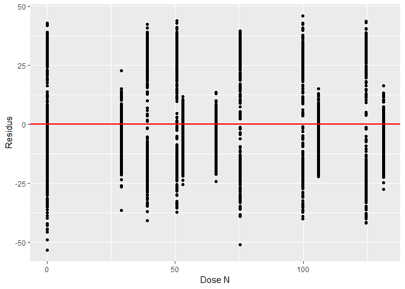<!-- -->

Bien que le jugement soit subjectif, on peut dire confiamment qu’il n’y
a pas structure particulière. En revanche, on pourrait générer un \(y\)
qui varie de manière quadratique avec \(x\), un modèle linéaire montrera
une structure évidente.

``` r
set.seed(36164)
x <- 0:100
y <- 10 + x*1 + x^2 * 0.05 + rnorm(length(x), 0, 50)
modlin_2 <- lm(y ~ x)
ggplot(data.frame(x, residus = residuals(modlin_2)),
       aes(x = x, y = residus)) +
  geom_point() +
  labs(x = "x", y = "Residus") +
  geom_hline(yintercept = 0, col = "red", size = 1)
```

<!-- -->

De même, les résidus ne devraient pas croître avec \(x\).

``` r
set.seed(3984)
x <- 0:100
y <-  10 + x + x * rnorm(length(x), 0, 2)
modlin_3 <- lm(y ~ x)
ggplot(data.frame(x, residus = residuals(modlin_3)),
       aes(x = x, y = residus)) +
  geom_point() +
  labs(x = "x", y = "Residus") +
  geom_hline(yintercept = 0, col = "red", size = 1)
```

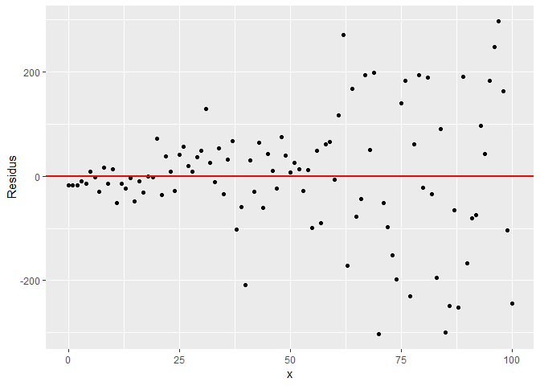<!-- -->

On pourra aussi inspecter les résidus avec un graphique de leur
distribution. Reprenons notre modèle de rendement du maïs.

``` r
ggplot(res_df, aes(x = residus_lm)) +
  geom_histogram(binwidth = 2, color = "white") +
  labs(x = "Residual")
```

<!-- -->

L’histogramme devrait présenter une distribution normale. Les tests de
nomalité comme le test de Shapiro-Wilk peuvent aider, mais ils sont
généralement très sévères.

``` r
shapiro.test(res_df$residus_lm)
```

    ## 
    ##  Shapiro-Wilk normality test
    ## 
    ## data:  res_df$residus_lm
    ## W = 0.94868, p-value < 2.2e-16

L’hypothèse nulle que la distribution est normale est rejetée au seuil
0.05. Dans notre cas, il est évident que la sévérité du test n’est pas
en cause, car les résidus semble générer trois ensembles. Ceci indique
que les variables explicatives sont insuffisantes pour expliquer la
variabilité de la variable-réponse.

### Régression multiple

Comme c’est le cas pour bien des phénomènes en écologie, le rendement
d’une culture n’est certainement pas expliqué seulement par la dose
d’azote.

Lorsque l’on combine plusieurs variables explicatives, on crée un modèle
de régression multivariée, ou une régression multiple. Bien que les
tendances puissent semblées non-linéaires, l’ajout de variables et le
calcul des coefficients associés reste un problème d’algèbre linéaire.

On pourra en effet généraliser les modèles linéaires, univariés et
multivariés, de la manière suivante.

\[ y = X \beta + \epsilon \]

où:

\(X\) est la matrice du modèle à \(n\) observations et \(p\) variables.

\[ X = \left( \begin{matrix} 
1 & x_{11} & \cdots & x_{1p}  \\ 
1 & x_{21} & \cdots & x_{2p}  \\ 
\vdots & \vdots & \ddots & \vdots  \\ 
1 & x_{n1} & \cdots & x_{np}
\end{matrix} \right) \]

\(\beta\) est la matrice des \(p\) coefficients, \(\beta_0\) étant
l’intercept qui multiplie la première colonne de la matrice \(X\).

\[ \beta = \left( \begin{matrix} 
\beta_0  \\ 
\beta_1  \\ 
\vdots \\ 
\beta_p 
\end{matrix} \right) \]

\(\epsilon\) est l’erreur de chaque observation.

\[ \epsilon = \left( \begin{matrix} 
\epsilon_0  \\ 
\epsilon_1  \\ 
\vdots \\ 
\epsilon_n
\end{matrix} \right) \]

### Modèles linéaires univariés avec variable catégorielle **nominale**

Une variable catégorielle nominale (non ordonnée) utilisée à elle seule
dans un modèle comme variable explicative, est un cas particulier de
régression multiple. En effet, l’**encodage catégoriel** (ou
*dummyfication*) transforme une variable catégorielle nominale en une
matrice de modèle comprenant une colonne désignant l’intercept (une
série de 1) désignant la catégorie de référence, ainsi que des colonnes
pour chacune des autres catégories désignant l’appartenance (1) ou la
non appartenance (0) de la catégorie désignée par la colonne.

#### L’encodage catégoriel

Une variable à \(C\) catégories pourra être déclinée en \(C\) variables
dont chaque colonne désigne par un 1 l’appartenance au groupe de la
colonne et par un 0 la non-appartenance. Pour l’exemple, créons un
vecteur désignant le cultivar de pomme de
terre.

``` r
data <- data.frame(cultivar = c('Superior', 'Superior', 'Superior', 'Russet', 'Kenebec', 'Russet'))
model.matrix(~cultivar, data)
```

    ##   (Intercept) cultivarRusset cultivarSuperior
    ## 1           1              0                1
    ## 2           1              0                1
    ## 3           1              0                1
    ## 4           1              1                0
    ## 5           1              0                0
    ## 6           1              1                0
    ## attr(,"assign")
    ## [1] 0 1 1
    ## attr(,"contrasts")
    ## attr(,"contrasts")$cultivar
    ## [1] "contr.treatment"

Nous avons trois catégories, encodées en trois colonnes. La première
colonne est un intercept et les deux autres décrivent l’absence (0) ou
la présence (1) des cultivars Russet et Superior. Le cultivar Kenebec
est absent du tableau. En effet, en partant du principe que
l’appartenance à une catégorie est mutuellement exclusive,
c’est-à-dire qu’un échantillon ne peut être assigné qu’à une seule
catégorie, on peut déduire une catégorie à partir de l’information sur
toutes les autres. Par exemple, si `cultivar_Russet` et
`cultivar_Superior` sont toutes deux égales à \(0\), on concluera que
`cultivar_Kenebec` est nécessairement égal à \(1\). Et si l’un d’entre
`cultivar_Russet` et `cultivar_Superior` est égal à \(1\),
`cultivar_Kenebec` est nécessairement égal à \(0\). L’information
contenue dans un nombre \(C\) de catégorie peut être encodée dans un
nombre \(C-1\) de colonnes. C’est pourquoi, dans une analyse
statistique, on désignera une catégorie comme une référence, que l’on
détecte lorsque toutes les autres catégories sont encodées avec des
\(0\): cette référence sera incluse dans l’intercept. La catégorie de
référence par défaut en R est celle la première catégorie dans l’ordre
aphabétique. On pourra modifier cette référence avec la fonction
`relevel()`.

``` r
data$cultivar <- relevel(data$cultivar, ref = "Superior")
model.matrix(~cultivar, data)
```

    ##   (Intercept) cultivarKenebec cultivarRusset
    ## 1           1               0              0
    ## 2           1               0              0
    ## 3           1               0              0
    ## 4           1               0              1
    ## 5           1               1              0
    ## 6           1               0              1
    ## attr(,"assign")
    ## [1] 0 1 1
    ## attr(,"contrasts")
    ## attr(,"contrasts")$cultivar
    ## [1] "contr.treatment"

Pour certains modèles, vous devrez vous assurer vous-même de l’encodage
catégoriel. Pour d’autre, en particulier avec l’*interface par formule*
de R, ce sera fait automatiquement.

#### Exemple d’application

Prenons la topographie du terrain, qui peut prendre plusieurs niveaux.

``` r
levels(lasrosas.corn$topo)
```

    ## [1] "E"  "HT" "LO" "W"

Explorons le rendement selon la topographie.

``` r
ggplot(lasrosas.corn, aes(x = topo, y = yield)) +
    geom_boxplot()
```

<!-- -->

Les différences sont évidentes, et la modélisation devrait montrer des
effets significatifs.

L’encodage catégoriel peut être visualisé en générant la matrice de
modèle avec la fonction `model.matrix()` et l’interface-formule - sans
la variable-réponse.

``` r
model.matrix(~ topo, data = lasrosas.corn) %>% 
    tbl_df() %>% # tbl_df pour transformer la matrice en tableau
    sample_n(10) 
```

    ## # A tibble: 10 x 4
    ##    `(Intercept)` topoHT topoLO topoW
    ##            <dbl>  <dbl>  <dbl> <dbl>
    ##  1             1      0      1     0
    ##  2             1      0      0     1
    ##  3             1      0      0     0
    ##  4             1      0      0     1
    ##  5             1      0      0     1
    ##  6             1      0      0     1
    ##  7             1      0      0     0
    ##  8             1      0      0     0
    ##  9             1      1      0     0
    ## 10             1      0      0     1

Dans le cas d’un modèle avec une variable catégorielle nominale seule,
l’intercept représente la catégorie de référence, ici `E`. Les autres
colonnes spécifient l’appartenance (1) ou la non-appartenance (0) de la
catégorie pour chaque observation.

Cette matrice de modèle utilisée pour la régression donnera un
intercept, qui indiquera l’effet de la catégorie de référence, puis les
différences entre les catégories subséquentes et la catégorie de
référence.

``` r
modlin_4 <- lm(yield ~ topo, data = lasrosas.corn)
summary(modlin_4)
```

    ## 
    ## Call:
    ## lm(formula = yield ~ topo, data = lasrosas.corn)
    ## 
    ## Residuals:
    ##     Min      1Q  Median      3Q     Max 
    ## -47.371 -11.933  -1.593  11.080  44.119 
    ## 
    ## Coefficients:
    ##             Estimate Std. Error t value Pr(>|t|)    
    ## (Intercept)  78.6653     0.5399 145.707   <2e-16 ***
    ## topoHT      -30.0526     0.7500 -40.069   <2e-16 ***
    ## topoLO        6.2832     0.7293   8.615   <2e-16 ***
    ## topoW       -11.8841     0.7039 -16.883   <2e-16 ***
    ## ---
    ## Signif. codes:  0 '***' 0.001 '**' 0.01 '*' 0.05 '.' 0.1 ' ' 1
    ## 
    ## Residual standard error: 14.59 on 3439 degrees of freedom
    ## Multiple R-squared:  0.4596, Adjusted R-squared:  0.4591 
    ## F-statistic:   975 on 3 and 3439 DF,  p-value: < 2.2e-16

Le modèle linéaire est équivalent à l’anova, mais les résultats de `lm`
sont plus élaborés.

``` r
summary(aov(yield ~ topo, data = lasrosas.corn))
```

    ##               Df Sum Sq Mean Sq F value Pr(>F)    
    ## topo           3 622351  207450     975 <2e-16 ***
    ## Residuals   3439 731746     213                   
    ## ---
    ## Signif. codes:  0 '***' 0.001 '**' 0.01 '*' 0.05 '.' 0.1 ' ' 1

L’analyse de résidus peut être effectuée de la même manière.

### Modèles linéaires univariés avec variable catégorielle **ordinale**

Bien que j’introduise la régression sur variable catégorielle ordinale à
la suite de la section sur les variables nominales, nous revenons dans
ce cas à une rérgession simple, univariée. Voyons un cas à 5 niveaux.

``` r
statut <- c("Totalement en désaccort", 
            "En désaccord",
            "Ni en accord, ni en désaccord",
            "En accord",
            "Totalement en accord")
statut_o <- factor(statut, levels = statut, ordered=TRUE)
model.matrix(~statut_o) # ou bien, sans passer par model.matrix, contr.poly(5) où 5 est le nombre de niveaux
```

    ##   (Intercept) statut_o.L statut_o.Q    statut_o.C statut_o^4
    ## 1           1 -0.6324555  0.5345225 -3.162278e-01  0.1195229
    ## 2           1 -0.3162278 -0.2672612  6.324555e-01 -0.4780914
    ## 3           1  0.0000000 -0.5345225 -4.095972e-16  0.7171372
    ## 4           1  0.3162278 -0.2672612 -6.324555e-01 -0.4780914
    ## 5           1  0.6324555  0.5345225  3.162278e-01  0.1195229
    ## attr(,"assign")
    ## [1] 0 1 1 1 1
    ## attr(,"contrasts")
    ## attr(,"contrasts")$statut_o
    ## [1] "contr.poly"

La matrice de modèle a 5 colonnes, soit le nombre de niveaux: un
intercept, puis 4 autres désignant différentes valeurs que peuvent
prendre les niveaux. Ces niveaux croient-ils linéairement? De manière
quadratique, cubique ou plus loin dans des distributions polynomiales?

``` r
modmat_tidy <- data.frame(statut, model.matrix(~statut_o)[, -1]) %>%
    gather(variable, valeur, -statut)
modmat_tidy$statut <- factor(modmat_tidy$statut, 
                             levels = statut, 
                             ordered=TRUE)
ggplot(data = modmat_tidy, mapping = aes(x = statut, y = valeur)) +
    facet_wrap(. ~ variable) +
    geom_point() +
    theme(axis.text.x = element_text(angle = 45, hjust = 1))
```

<!-- -->

Règle générale, pour les variables ordinales, on préférera une
distribution linéaire, et c’est l’option par défaut de la fonction
`lm()`. L’utilisation d’une autre distribution peut être effectuée à la
mitaine en utilisant dans le modèle la colonne désirée de la sortie de
la fonction `model.matrix()`.

### Régression multiple à plusieurs variables

Reprenons le tableau de données du rendement de maïs.

``` r
head(lasrosas.corn)
```

    ##   year       lat      long yield nitro topo     bv rep nf
    ## 1 1999 -33.05113 -63.84886 72.14 131.5    W 162.60  R1 N5
    ## 2 1999 -33.05115 -63.84879 73.79 131.5    W 170.49  R1 N5
    ## 3 1999 -33.05116 -63.84872 77.25 131.5    W 168.39  R1 N5
    ## 4 1999 -33.05117 -63.84865 76.35 131.5    W 176.68  R1 N5
    ## 5 1999 -33.05118 -63.84858 75.55 131.5    W 171.46  R1 N5
    ## 6 1999 -33.05120 -63.84851 70.24 131.5    W 170.56  R1 N5

Pour ajouter des variables au modèle dans l’interface-formule, on
additionne les noms de colonne. La variable `lat` désigne la latitude,
la variable `long` désigne la latitude et la variable `bv` (*brightness
value*) désigne la teneur en matière organique du sol (plus `bv` est
élevée, plus faible est la teneur en matière organique).

``` r
modlin_5 <- lm(yield ~ lat + long + nitro + topo + bv,
               data = lasrosas.corn)
summary(modlin_5)
```

    ## 
    ## Call:
    ## lm(formula = yield ~ lat + long + nitro + topo + bv, data = lasrosas.corn)
    ## 
    ## Residuals:
    ##     Min      1Q  Median      3Q     Max 
    ## -48.405 -11.071  -1.251  10.592  40.078 
    ## 
    ## Coefficients:
    ##               Estimate Std. Error t value Pr(>|t|)    
    ## (Intercept)  1.946e+05  3.309e+04   5.882 4.45e-09 ***
    ## lat          5.541e+03  4.555e+02  12.163  < 2e-16 ***
    ## long         1.776e+02  4.491e+02   0.395    0.693    
    ## nitro        6.867e-02  5.451e-03  12.597  < 2e-16 ***
    ## topoHT      -2.665e+01  1.087e+00 -24.520  < 2e-16 ***
    ## topoLO       5.565e+00  1.035e+00   5.378 8.03e-08 ***
    ## topoW       -1.465e+01  1.655e+00  -8.849  < 2e-16 ***
    ## bv          -5.089e-01  3.069e-02 -16.578  < 2e-16 ***
    ## ---
    ## Signif. codes:  0 '***' 0.001 '**' 0.01 '*' 0.05 '.' 0.1 ' ' 1
    ## 
    ## Residual standard error: 13.47 on 3435 degrees of freedom
    ## Multiple R-squared:  0.5397, Adjusted R-squared:  0.5387 
    ## F-statistic: 575.3 on 7 and 3435 DF,  p-value: < 2.2e-16

L’ampleur des coefficients est relatif à l’échelle de la variable. En
effet, un coefficient de 5541 sur la variable `lat` n’est pas comparable
au coefficient de la variable `bv`, de -0.5089, étant donné que les
variables ne sont pas exprimées avec la même échelle. Pour les comparer
sur une même base, on peut centrer (soustraire la moyenne) et rédurie
(diviser par
l’écart-type).

``` r
scale_vec <- function(x) as.vector(scale(x)) # la fonction scale génère une matrice: nous désirons un vecteur

lasrosas.corn_sc <- lasrosas.corn %>%
    mutate_at(c("lat", "long", "nitro", "bv"), 
                 scale_vec)

modlin_5_sc <- lm(yield ~ lat + long + nitro + topo + bv,
               data = lasrosas.corn_sc)
summary(modlin_5_sc)
```

    ## 
    ## Call:
    ## lm(formula = yield ~ lat + long + nitro + topo + bv, data = lasrosas.corn_sc)
    ## 
    ## Residuals:
    ##     Min      1Q  Median      3Q     Max 
    ## -48.405 -11.071  -1.251  10.592  40.078 
    ## 
    ## Coefficients:
    ##             Estimate Std. Error t value Pr(>|t|)    
    ## (Intercept)  78.9114     0.6666 118.376  < 2e-16 ***
    ## lat           3.9201     0.3223  12.163  < 2e-16 ***
    ## long          0.3479     0.8796   0.395    0.693    
    ## nitro         2.9252     0.2322  12.597  < 2e-16 ***
    ## topoHT      -26.6487     1.0868 -24.520  < 2e-16 ***
    ## topoLO        5.5647     1.0347   5.378 8.03e-08 ***
    ## topoW       -14.6487     1.6555  -8.849  < 2e-16 ***
    ## bv           -4.9253     0.2971 -16.578  < 2e-16 ***
    ## ---
    ## Signif. codes:  0 '***' 0.001 '**' 0.01 '*' 0.05 '.' 0.1 ' ' 1
    ## 
    ## Residual standard error: 13.47 on 3435 degrees of freedom
    ## Multiple R-squared:  0.5397, Adjusted R-squared:  0.5387 
    ## F-statistic: 575.3 on 7 and 3435 DF,  p-value: < 2.2e-16

Typiquement, les variables catégorielles, qui ne sont pas mises à
l’échelle, donneront des coefficients plus élevées, et devrons être
évaluées entre elles et non comparativement aux variables mises à
l’échelle. Une manière conviviale de représenter des coefficients
consiste à créer un tableau (fonction `tibble()`) incluant les
coefficients ainsi que leurs intervalles de confiance, puis à les porter
graphiquement.

``` r
intervals <- tibble(Estimate = coefficients(modlin_5_sc)[-1], # [-1] enlever l'intercept
                    LL = confint(modlin_5_sc)[-1, 1], # [-1, ] enlever la première ligne, celle de l'intercept
                    UL = confint(modlin_5_sc)[-1, 2],
                    variable = names(coefficients(modlin_5_sc)[-1])) 
intervals
```

    ## # A tibble: 7 x 4
    ##   Estimate     LL     UL variable
    ##      <dbl>  <dbl>  <dbl> <chr>   
    ## 1    3.92    3.29   4.55 lat     
    ## 2    0.348  -1.38   2.07 long    
    ## 3    2.93    2.47   3.38 nitro   
    ## 4  -26.6   -28.8  -24.5  topoHT  
    ## 5    5.56    3.54   7.59 topoLO  
    ## 6  -14.6   -17.9  -11.4  topoW   
    ## 7   -4.93   -5.51  -4.34 bv

``` r
ggplot(data = intervals, mapping = aes(x = Estimate, y = variable)) +
    geom_vline(xintercept = 0, lty = 2) +
    geom_segment(mapping = aes(x = LL, xend = UL, 
                               y = variable, yend = variable)) +
    geom_point() +
    labs(x = "Coefficient standardisé", y = "")
```

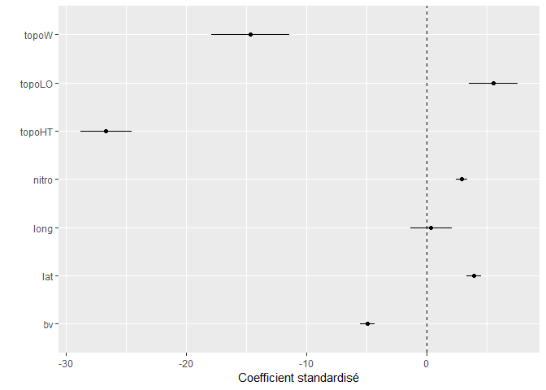<!-- -->

On y voit qu’à l’exception de la variable `long`, tous les coefficients
sont différents de 0. Le coefficient `bv` est négatif, indicant que plus
la valeur de `bv` est élevé (donc plus le sol est pauvre en matière
organique), plus le rendement est faible. Plus la latitude est élevée
(plus on se dirige vers le Nord de l’Argentine), plus le rendement est
élevé. La dose d’azote a aussi un effet statistique positif sur le
rendement.

Quant aux catégories topographiques, elles sont toutes différentes de la
catégorie `E`, ne croisant pas le zéro. De plus, les intervalles de
confiance ne se chevauchant pas, on peut conclure en une différence
significative d’une à l’autre. Bien sûr, tout cela au seuil de confiance
de 0.05.

On pourra retrouver des cas où l’effet combiné de plusieurs variables
diffère de l’effet des deux variables prises séparément. Par exemple, on
pourrait évaluer l’effet de l’azote et celui de la topographie dans un
même modèle, puis y ajouter une intéraction entre l’azote et la
topographie, qui définira des effets supplémentaires de l’azote selon
chaque catégorie topographique. C’est ce que l’on appelle une
intéraction.

Dans l’interface-formule, l’intéraction entre l’azote et la topographie
est notée `nitro:topo`. Pour ajouter cette intéraction, la formule
deviendra `yield ~ nitro + topo + nitro:topo`. Une approche équivalente
est d’utiliser le raccourci `yield ~ nitro*topo`.

``` r
modlin_5_sc <- lm(yield ~ nitro*topo,
               data = lasrosas.corn_sc)
summary(modlin_5_sc)
```

    ## 
    ## Call:
    ## lm(formula = yield ~ nitro * topo, data = lasrosas.corn_sc)
    ## 
    ## Residuals:
    ##     Min      1Q  Median      3Q     Max 
    ## -47.984 -11.985  -1.388  10.339  40.636 
    ## 
    ## Coefficients:
    ##              Estimate Std. Error t value Pr(>|t|)    
    ## (Intercept)   78.6999     0.5322 147.870  < 2e-16 ***
    ## nitro          1.8131     0.5351   3.388 0.000711 ***
    ## topoHT       -30.0052     0.7394 -40.578  < 2e-16 ***
    ## topoLO         6.2026     0.7190   8.627  < 2e-16 ***
    ## topoW        -11.9628     0.6939 -17.240  < 2e-16 ***
    ## nitro:topoHT   1.2553     0.7461   1.682 0.092565 .  
    ## nitro:topoLO   0.5695     0.7186   0.792 0.428141    
    ## nitro:topoW    0.7702     0.6944   1.109 0.267460    
    ## ---
    ## Signif. codes:  0 '***' 0.001 '**' 0.01 '*' 0.05 '.' 0.1 ' ' 1
    ## 
    ## Residual standard error: 14.38 on 3435 degrees of freedom
    ## Multiple R-squared:  0.4756, Adjusted R-squared:  0.4746 
    ## F-statistic: 445.1 on 7 and 3435 DF,  p-value: < 2.2e-16

Les résultats montre des effets de l’azote et des catégories
topographiques, mais il y a davantage d’incertitude sur les
intéractions, indiquant que l’effet statistique de l’azote est
sensiblement le même indépendamment des niveaux topographiques.

-----

### Attention à ne pas surcharger le modèle

Il est possible d’ajouter des intéractions doubles, triples, quadruples,
etc. Mais plus il y a d’intéractions, plus votre modèle comprendra de
variables et vos tests d’hypothèse perdront en puissance statistique.

-----

### Les modèles linéaires généralisés

Dans un modèle linéaire ordinaire, un changement constant dans les
variables explicatives résulte en un changement constant de la
variable-réponse. Cette supposition ne serait pas adéquate si la
variable-réponse était un décompte, si elle est booléenne ou si, de
manière générale, la variable-réponse ne suivait pas une distribution
continue. Ou, de manière plus spécifique, il n’y a pas moyen de
retrouver une distribution normale des résidus? On pourra bien sûr
transformer les variables (sujet du chapitre 6, en développement). Mais
il pourrait s’avérer impossible, ou tout simplement non souhaitable de
transformer les variables. Le modèle linéaire généralisé (MLG, ou
*generalized linear model* - GLM) est une généralisation du modèle
linéaire ordinaire chez qui la variable-réponse peut être caractérisé
par une distribution de Poisson, de Bernouilli, etc.

Prenons d’abord cas d’un décompte de vers fil-de-fer (`worms`) retrouvés
dans des parcelles sous différents traitements (`trt`). Les décomptes
sont typiquement distribué selon une loi de
    Poisson.

``` r
cochran.wireworms %>% ggplot(aes(x = worms)) + geom_histogram()
```

    ## `stat_bin()` using `bins = 30`. Pick better value with `binwidth`.

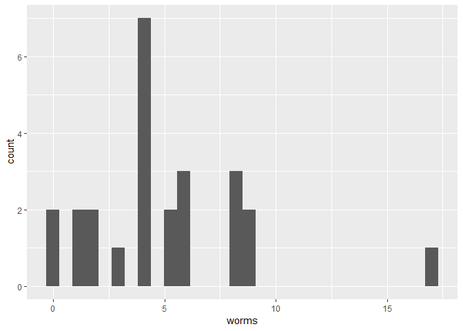<!-- -->

Explorons les décomptes selon les traitements.

``` r
cochran.wireworms %>% ggplot(aes(x = trt, y = worms)) + geom_boxplot()
```

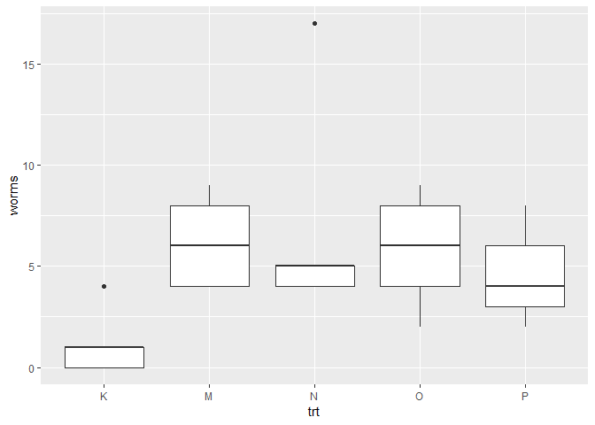<!-- -->

Les traitements semble à première vue avoir un effet comparativement au
contrôle. Lançons un MLG avec la fonction `glm()`, et spécifions que la
sortie est une distribution de Poisson.

``` r
modglm_1 <- glm(worms ~ trt, cochran.wireworms, family = "poisson")
summary(modglm_1)
```

    ## 
    ## Call:
    ## glm(formula = worms ~ trt, family = "poisson", data = cochran.wireworms)
    ## 
    ## Deviance Residuals: 
    ##     Min       1Q   Median       3Q      Max  
    ## -1.8279  -0.9455  -0.2862   0.6916   3.1888  
    ## 
    ## Coefficients:
    ##             Estimate Std. Error z value Pr(>|z|)    
    ## (Intercept)   0.1823     0.4082   0.447 0.655160    
    ## trtM          1.6422     0.4460   3.682 0.000231 ***
    ## trtN          1.7636     0.4418   3.991 6.57e-05 ***
    ## trtO          1.5755     0.4485   3.513 0.000443 ***
    ## trtP          1.3437     0.4584   2.931 0.003375 ** 
    ## ---
    ## Signif. codes:  0 '***' 0.001 '**' 0.01 '*' 0.05 '.' 0.1 ' ' 1
    ## 
    ## (Dispersion parameter for poisson family taken to be 1)
    ## 
    ##     Null deviance: 64.555  on 24  degrees of freedom
    ## Residual deviance: 38.026  on 20  degrees of freedom
    ## AIC: 125.64
    ## 
    ## Number of Fisher Scoring iterations: 5

Il est très probable (p-value de \~0.66) qu’un intercept de 0.18 ayant
une erreur standard de 0.4082 ait été généré depuis une population dont
l’intercept est nul: autrement dit, le contrôle n’a probablement pas eu
d’effet. Quant aux autres traitements, leurs effets sont tous
significatifs au seuil 0.05, mais peuvent-ils être considérés comme
équivalents?

``` r
intervals <- tibble(Estimate = coefficients(modglm_1), # [-1] enlever l'intercept
                    LL = confint(modglm_1)[, 1], # [-1, ] enlever la première ligne, celle de l'intercept
                    UL = confint(modglm_1)[, 2],
                    variable = names(coefficients(modglm_1))) 
```

    ## Waiting for profiling to be done...
    ## Waiting for profiling to be done...

``` r
intervals
```

    ## # A tibble: 5 x 4
    ##   Estimate     LL    UL variable   
    ##      <dbl>  <dbl> <dbl> <chr>      
    ## 1    0.182 -0.740 0.888 (Intercept)
    ## 2    1.64   0.840 2.62  trtM       
    ## 3    1.76   0.972 2.74  trtN       
    ## 4    1.58   0.766 2.56  trtO       
    ## 5    1.34   0.509 2.34  trtP

``` r
ggplot(data = intervals, mapping = aes(x = Estimate, y = variable)) +
    geom_vline(xintercept = 0, lty = 2) +
    geom_segment(mapping = aes(x = LL, xend = UL, 
                               y = variable, yend = variable)) +
    geom_point() +
    labs(x = "Coefficient", y = "")
```

<!-- -->

Les intervales de confiance se superposant, on ne peut pas conclure
qu’un traitement est lié à une réduction plus importante de vers qu’un
autre, au seuil 0.05.

Maintenant, à défaut de trouver un tableau de données plus approprié,
prenons le tableau `mtcars`, qui rassemble des données sur des modèles
de voitures. La colonne `vs`, pour v-shaped, inscrit 0 si les pistons
sont droit et 1 s’ils sont placés en V dans le moteur. Peut-on expliquer
la forme des pistons selon le poids du véhicule
    (`wt`)?

``` r
mtcars %>% sample_n(6)
```

    ##                    mpg cyl  disp  hp drat    wt  qsec vs am gear carb
    ## Merc 450SLC       15.2   8 275.8 180 3.07 3.780 18.00  0  0    3    3
    ## Mazda RX4         21.0   6 160.0 110 3.90 2.620 16.46  0  1    4    4
    ## Honda Civic       30.4   4  75.7  52 4.93 1.615 18.52  1  1    4    2
    ## Chrysler Imperial 14.7   8 440.0 230 3.23 5.345 17.42  0  0    3    4
    ## Mazda RX4 Wag     21.0   6 160.0 110 3.90 2.875 17.02  0  1    4    4
    ## AMC Javelin       15.2   8 304.0 150 3.15 3.435 17.30  0  0    3    2

``` r
mtcars %>% 
    ggplot(aes(x = wt, y = vs)) + geom_point()
```

<!-- -->

Il semble y avoir une tendance: les véhicules plus lourds ont plutôt des
pistons droits (`vs = 0`). Vérifions cela.

``` r
modglm_2 <- glm(vs ~ wt, data = mtcars, family = binomial)
summary(modglm_2)
```

    ## 
    ## Call:
    ## glm(formula = vs ~ wt, family = binomial, data = mtcars)
    ## 
    ## Deviance Residuals: 
    ##     Min       1Q   Median       3Q      Max  
    ## -1.9003  -0.7641  -0.1559   0.7223   1.5736  
    ## 
    ## Coefficients:
    ##             Estimate Std. Error z value Pr(>|z|)   
    ## (Intercept)   5.7147     2.3014   2.483  0.01302 * 
    ## wt           -1.9105     0.7279  -2.625  0.00867 **
    ## ---
    ## Signif. codes:  0 '***' 0.001 '**' 0.01 '*' 0.05 '.' 0.1 ' ' 1
    ## 
    ## (Dispersion parameter for binomial family taken to be 1)
    ## 
    ##     Null deviance: 43.860  on 31  degrees of freedom
    ## Residual deviance: 31.367  on 30  degrees of freedom
    ## AIC: 35.367
    ## 
    ## Number of Fisher Scoring iterations: 5

**Exercice**. Analyser les résultats.

### Les modèles non-linéaires

La hauteur d’un arbre en fonction du temps n’est typiquement pas
linéaire. Elle tend à croître de plus en plus lentement jusqu’à un
plateau. De même, le rendement d’une culture traité avec des doses
croissantes de fertilisants tend à atteindre un maximum, puis à se
stabiliser.

Ces phénomènes ne peuvent pas être approximés par des modèles linéaires.
Examinons les données du tableau `engelstad.nitro`.

``` r
engelstad.nitro %>% sample_n(10)
```

    ##          loc year nitro yield
    ## 38 Knoxville 1963    67  73.2
    ## 40 Knoxville 1963   201  91.2
    ## 21   Jackson 1965   134  60.5
    ## 35 Knoxville 1962   268  78.4
    ## 22   Jackson 1965   201  70.2
    ## 12   Jackson 1963   335  87.0
    ## 24   Jackson 1965   335  73.0
    ## 20   Jackson 1965    67  47.6
    ## 15   Jackson 1964   134  55.2
    ## 48 Knoxville 1964   335  84.5

``` r
engelstad.nitro %>%
    ggplot(aes(x = nitro, y = yield)) +
        facet_grid(year ~ loc) +
        geom_line() +
        geom_point()
```

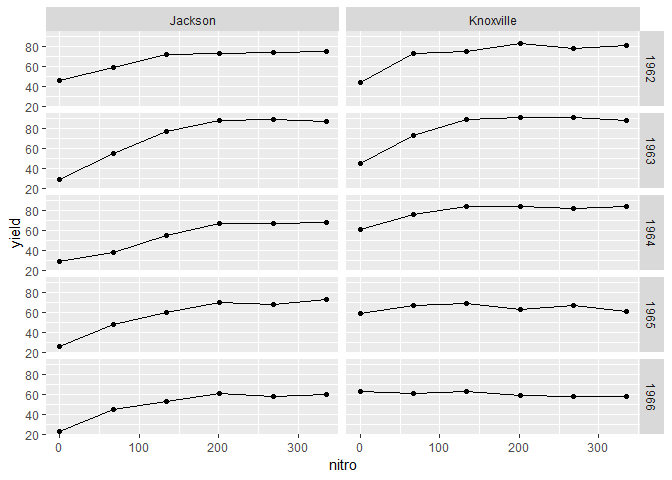<!-- -->

Le modèle de Mitscherlich pourrait être utilisé.

\[ y = A \left( 1 - e^{-R \left( E + x \right)} \right) \]

où \(y\) est le rendement, \(x\) est la dose, \(A\) est l’asymptote vers
laquelle la courbe converge à dose croissante, \(E\) est l’équivalent de
dose fourni par l’environnement et \(R\) est le taux de réponse.

Explorons la fonction.

``` r
mitscherlich_f <- function(x, A, E, R) {
    A * (1 - exp(-R*(E + x)))
}

x <- seq(0, 350, by = 5)
y <- mitscherlich_f(x, A = 75, E = 30, R = 0.02)

ggplot(tibble(x, y), aes(x, y)) +
    geom_point(data = engelstad.nitro, aes(x = nitro, y = yield)) +
    geom_line() + ylim(c(0, 100))
```

<!-- -->

**Exercice**. Changez les paramètres pour visualiser comment la courbe
réagit.

Nous pouvons décrire le modèle grâce à l’interface formule dans la
fonction `nls()`. Notez que les modèles non-linéaires demandent des
stratégies de calcul différentes de celles des modèles linéaires. En
tout temps, nous devons identifier des valeurs de départ raisonnables
pour les paramètres dans l’argument `start`. Vous réussirez rarement à
obtenir une convergence du premier coup avec vos paramètres de départ.
Le défi est d’en trouver qui permettront au modèle de converger.
Parfois, le modèle ne convergera jamais. D’autres fois, il convergera
vers des solutions différentes selon les variables de départ choisies.
\<

``` r
#modnl_1 <- nls(yield ~ A * (1 - exp(-R*(E + nitro))),
#                data = engelstad.nitro,
#                start = list(A = 50, E = 10, R = 0.2))
```

Le modèle ne coverge pas. Essayons les valeurs prises plus haut, lors de
la création du graphique, qui semblent bien s’ajuster.

``` r
modnl_1 <-  nls(yield ~ A * (1 - exp(-R*(E + nitro))),
                data = engelstad.nitro,
                start = list(A = 75, E = 30, R = 0.02))
```

Bingo\! Voyons maintenant le sommaire.

``` r
summary(modnl_1)
```

    ## 
    ## Formula: yield ~ A * (1 - exp(-R * (E + nitro)))
    ## 
    ## Parameters:
    ##    Estimate Std. Error t value Pr(>|t|)    
    ## A 75.023427   3.331860  22.517   <2e-16 ***
    ## E 66.164110  27.251591   2.428   0.0184 *  
    ## R  0.012565   0.004881   2.574   0.0127 *  
    ## ---
    ## Signif. codes:  0 '***' 0.001 '**' 0.01 '*' 0.05 '.' 0.1 ' ' 1
    ## 
    ## Residual standard error: 12.34 on 57 degrees of freedom
    ## 
    ## Number of iterations to convergence: 5 
    ## Achieved convergence tolerance: 8.067e-06

Les paramètres sont significativement différents de zéro au seuil 0.05,
et donnent la courbe suivante.

``` r
x <- seq(0, 350, by = 5)
y <- mitscherlich_f(x,
                    A = coefficients(modnl_1)[1],
                    E = coefficients(modnl_1)[2],
                    R = coefficients(modnl_1)[3])

ggplot(tibble(x, y), aes(x, y)) +
    geom_point(data = engelstad.nitro, aes(x = nitro, y = yield)) +
    geom_line() + ylim(c(0, 100))
```

<!-- -->

Et les résidus…

``` r
tibble(res = residuals(modnl_1)) %>%
    ggplot(aes(x = res)) + geom_histogram(bins = 20)
```

<!-- -->

``` r
tibble(nitro = engelstad.nitro$nitro, res = residuals(modnl_1)) %>%
    ggplot(aes(x = nitro, y = res)) + 
        geom_point() +
        geom_hline(yintercept = 0, colour = "red")
```

<!-- -->

Les résidus ne sont pas distribués normalement, mais semble bien
partagés de part et d’autre de la courbe.

## Modèles à effets mixtes

Lorsque l’on combine des variables fixes (testées lors de l’expérience)
et des variables aléatoire (variation des unités expérimentales), on
obtient un modèle mixte. Les modèles mixtes peuvent être univariés,
multivariés, linéaires ordinaires ou généralisés ou non linéaires.

À la différence d’un effet fixe, un effet aléatoire sera toujours
distribué normalement avec une moyenne de 0 et une certaine variance.
Dans un modèle linéaire où l’effet aléatoire est un décalage
d’intercept, cet effet s’additionne aux effets fixes:

\[ y = X \beta + Z b + \epsilon \]

où:

\(Z\) est la matrice du modèle à \(n\) observations et \(p\) variables
aléatoires. Les variables aléatoires sont souvent des variables
nominales qui subissent un encodage catégoriel.

\[ Z = \left( \begin{matrix} 
z_{11} & \cdots & z_{1p}  \\ 
z_{21} & \cdots & z_{2p}  \\ 
\vdots & \ddots & \vdots  \\ 
z_{n1} & \cdots & z_{np}
\end{matrix} \right) \]

\(b\) est la matrice des \(p\) coefficients aléatoires.

\[ b = \left( \begin{matrix} 
b_0  \\ 
b_1  \\ 
\vdots \\ 
b_p 
\end{matrix} \right) \]

Le tableau `lasrosas.corn`, utilisé précédemment, contenait trois
répétitions effectués au cours de deux années, 1999 et 2001. Étant
donné que la répétition R1 de 1999 n’a rien à voir avec la répétition R1
de 2001, on dit qu’elle est **emboîtée** dans l’année.

Le module `nlme` nous aidera à monter notre modèle mixte.

``` r
library("nlme")
```

    ## 
    ## Attaching package: 'nlme'

    ## The following object is masked from 'package:dplyr':
    ## 
    ##     collapse

``` r
mmodlin_1 <- lme(fixed = yield ~ lat + long + nitro + topo + bv,
                 random = ~ 1|year/rep,
                 data = lasrosas.corn)
```

À ce stade vous devriez commencer à être familier avec l’interface
formule et vous deviez saisir l’argument `fixed`, qui désigne l’effet
fixe. L’effet aléatoire, `random`, suit un tilde `~`. À gauche de la
barre verticale `|`, on place les variables désignant les effets
aléatoire sur la pente. Nous n’avons pas couvert cet aspect, alors nous
le laissons à `1`. À droite, on retrouve un structure d’emboîtement
désignant l’effet aléatoire: le premier niveau est l’année, dans
laquelle est emboîtée la répétition.

``` r
summary(mmodlin_1)
```

    ## Linear mixed-effects model fit by REML
    ##  Data: lasrosas.corn 
    ##        AIC      BIC    logLik
    ##   26535.37 26602.93 -13256.69
    ## 
    ## Random effects:
    ##  Formula: ~1 | year
    ##         (Intercept)
    ## StdDev:    20.35425
    ## 
    ##  Formula: ~1 | rep %in% year
    ##         (Intercept) Residual
    ## StdDev:    11.17447 11.35617
    ## 
    ## Fixed effects: yield ~ lat + long + nitro + topo + bv 
    ##                  Value Std.Error   DF    t-value p-value
    ## (Intercept) -1379436.9  55894.55 3430 -24.679273   0.000
    ## lat           -25453.0   1016.53 3430 -25.039084   0.000
    ## long           -8432.3    466.05 3430 -18.092988   0.000
    ## nitro              0.0      0.00 3430   1.739757   0.082
    ## topoHT           -27.7      0.92 3430 -30.122438   0.000
    ## topoLO             6.8      0.88 3430   7.804733   0.000
    ## topoW            -16.7      1.40 3430 -11.944793   0.000
    ## bv                -0.5      0.03 3430 -19.242424   0.000
    ##  Correlation: 
    ##        (Intr) lat    long   nitro  topoHT topoLO topoW 
    ## lat     0.897                                          
    ## long    0.866  0.555                                   
    ## nitro   0.366  0.391  0.247                            
    ## topoHT  0.300 -0.017  0.582  0.024                     
    ## topoLO -0.334 -0.006 -0.621 -0.038 -0.358              
    ## topoW   0.403 -0.004  0.762  0.027  0.802 -0.545       
    ## bv     -0.121 -0.012 -0.214 -0.023 -0.467  0.346 -0.266
    ## 
    ## Standardized Within-Group Residuals:
    ##         Min          Q1         Med          Q3         Max 
    ## -4.32360269 -0.66781575 -0.07450856  0.61587533  3.96434001 
    ## 
    ## Number of Observations: 3443
    ## Number of Groups: 
    ##          year rep %in% year 
    ##             2             6

La sortie est semblable à celle de la fonction `lm()`.

### Modèles mixtes non-linéaires

Le modèle non linéaire créé plus haut liait le rendement à la dose
d’azote. Toutefois, les unités expérimentales (le site `loc` et
l’année `year`) n’étaient pas pris en considération. Nous allons
maintenant les considérer.

Nous devons décider la structure de l’effet aléatoire, et sur quelles
variables il doit être appliqué - la décision appartient à l’analyste.
Il me semble plus convenable de supposer que le site et l’année
affectera le rendement maximum plutôt que l’environnement et le taux:
les effets aléatoires seront donc affectés à la variable `A`. Les effets
aléatoires n’ont pas de structure d’emboîtement. L’effet de l’année sur
A sera celui d’une pente et l’effet de site sera celui de l’intercept.
La fonction que nous utiliserons est `nlme()`.

``` r
mm <- nlme(yield ~ A * (1 - exp(-R*(E + nitro))),
           data = engelstad.nitro, 
           start = c(A = 75, E = 30, R = 0.02), 
           fixed = list(A ~ 1, E ~ 1, R ~ 1), 
           random = A ~ year | loc)
summary(mm)
```

    ## Nonlinear mixed-effects model fit by maximum likelihood
    ##   Model: yield ~ A * (1 - exp(-R * (E + nitro))) 
    ##  Data: engelstad.nitro 
    ##        AIC     BIC    logLik
    ##   477.2286 491.889 -231.6143
    ## 
    ## Random effects:
    ##  Formula: A ~ year | loc
    ##  Structure: General positive-definite, Log-Cholesky parametrization
    ##               StdDev       Corr  
    ## A.(Intercept)  2.611534836 A.(In)
    ## A.year         0.003066832 -0.556
    ## Residual      11.152757999       
    ## 
    ## Fixed effects: list(A ~ 1, E ~ 1, R ~ 1) 
    ##                  Value Std.Error DF   t-value p-value
    ## A.(Intercept) 74.58222  4.722715 56 15.792234  0.0000
    ## E             65.56721 25.533993 56  2.567840  0.0129
    ## R              0.01308  0.004808 56  2.720215  0.0087
    ##  Correlation: 
    ##   A.(In) E     
    ## E  0.379       
    ## R -0.483 -0.934
    ## 
    ## Standardized Within-Group Residuals:
    ##         Min          Q1         Med          Q3         Max 
    ## -1.83373132 -0.89293033  0.07418165  0.68353577  1.82434347 
    ## 
    ## Number of Observations: 60
    ## Number of Groups: 2

Les modèles mixtes non linéaires peuvent devenir très complexes lorsque
les paramètres, par exemple A, E et R, sont eux-même affectés
linéairement par des variables (par exemple `A ~ topo`). Pour aller
plus loin, consultez [Parent et
al. (2017)](https://doi.org/10.3389/fenvs.2017.00081) ainsi que les
[calculs associés à
l’article](https://github.com/essicolo/site-specific-multilevel-modeling-of-potato-response-to-nitrogen-fertilization).
Ou écrivez-moi un courriel pour en discuter\!

**Note**. L’interprétation de p-values sur les modèles mixtes est
controversée. À ce sujet, ??? Bates a écrit une longue lettre à la
communauté de développement du module `lme4`, une alternative à `nlme`,
qui remet en cause l’utilisation des p-values,
[ici](https://stat.ethz.ch/pipermail/r-help/2006-May/094765.html). De
plus en plus, pour les modèles mixtes, on se tourne vers les
statistiques bayésiennes, couvertes dans l’annexe de cette section
(`statitiques_bayes.ipynb`, en développement). À cet effet, le module
[`brms`](https://github.com/paul-buerkner/brms) automatise bien des
aspects de la modélisation mixte bayésienne.

## Aller plus loin

### Statistiques générales:

  - [The analysis of biological
    data](https://ariane25.bibl.ulaval.ca/ariane/wicket/detail?c=ariane&m=S&rq.ct=PE&rq.fa=false&rq.r.esc=false&rq.r.l%5B0%5D.c=TI&rq.r.l%5B0%5D.ex=false&rq.r.l%5B0%5D.op=AND&rq.r.l%5B0%5D.v=the+analysis+of+biological+data&rq.r.la=*&rq.r.loc=*&rq.r.pft=true&rq.r.ta=*&rq.r.td=*&rq.rows=5&rq.st=1)

### Statistiques avec R

  - Disponibles en version électronique à la bibliothèque de
    l’Université Laval:
      - Introduction aux statistiques avec R: [Introductory statistics
        with
        R](https://ariane25.bibl.ulaval.ca/ariane/wicket/detail?c=ariane&m=S&rq.ct=PE&rq.fa=false&rq.r.esc=false&rq.r.l%5B0%5D.c=TI&rq.r.l%5B0%5D.ex=false&rq.r.l%5B0%5D.op=AND&rq.r.l%5B0%5D.v=Introductory+statistics+with+R&rq.r.la=*&rq.r.loc=*&rq.r.pft=true&rq.r.ta=*&rq.r.td=*&rq.rows=1&rq.st=0)
      - Approfondir les statistiques avec R: [The R Book, Second
        edition](https://ariane25.bibl.ulaval.ca/ariane/wicket/detail?c=ariane&m=S&rq.ct=PE&rq.fa=false&rq.r.esc=false&rq.r.l%5B0%5D.c=TI&rq.r.l%5B0%5D.ex=false&rq.r.l%5B0%5D.op=AND&rq.r.l%5B0%5D.v=the+r+book&rq.r.la=*&rq.r.loc=*&rq.r.pft=true&rq.r.ta=*&rq.r.td=*&rq.rows=15&rq.st=2)
      - Approfondir les modèles à effets mixtes acec R: [Mixed Effects
        Models and Extensions in Ecology with
        R](https://ariane25.bibl.ulaval.ca/ariane/wicket/detail?c=ariane&m=S&rq.ct=PE&rq.fa=false&rq.r.esc=false&rq.r.l%5B0%5D.c=TI&rq.r.l%5B0%5D.ex=false&rq.r.l%5B0%5D.op=AND&rq.r.l%5B0%5D.v=Mixed+Effects+Models+and+Extensions+in+Ecology+with+R&rq.r.la=*&rq.r.loc=*&rq.r.pft=false&rq.r.ta=*&rq.r.td=*&rq.rows=2&rq.st=1)
  - [ModernDive](https://moderndive.com/index.html), un livre en ligne
    offrant une approche moderne avec le package `moderndive`.
