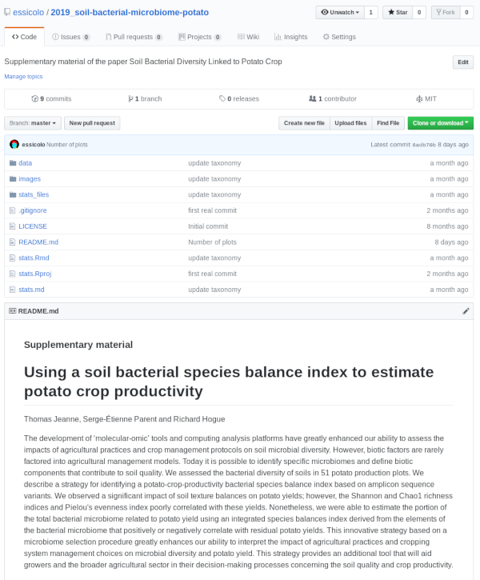
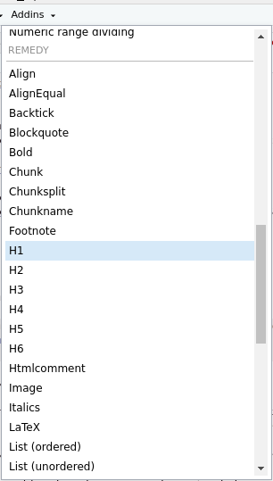
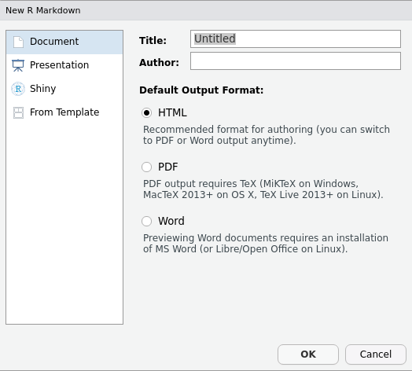
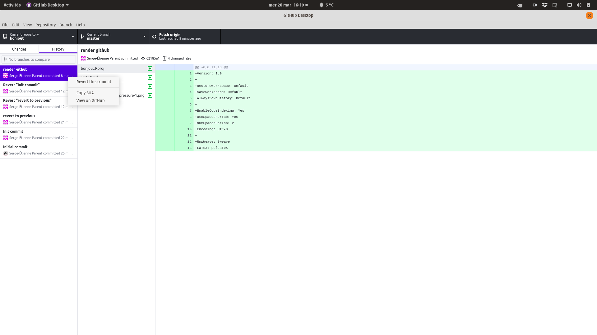
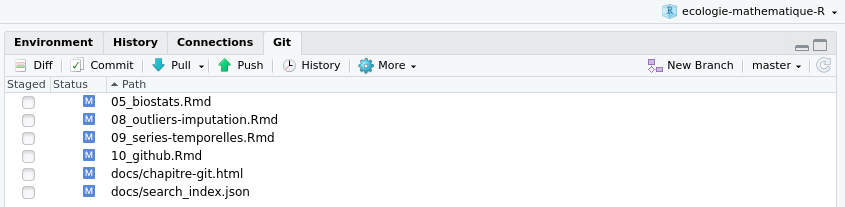

--- 
site: bookdown::bookdown_site
output: bookdown::gitbook 
---

# Science ouverte et reproductibilité {#chapitre-git}

***
️\ **Objectifs spécifiques**:

À la fin de ce chapitre, vous

- saurez exprimer l'importance et les enjeux de la science ouverte
- saurez arranger vos données (format csv) et votre code (format notebook) afin de rendre vos recherches reproductibles
- saurez comment créer un dépôt sur GitHub, puis administrer son développement

***

```{r git-set-seed, echo=FALSE}
set.seed(645654)
```

La science ouverte favorise la diffusion des connaissances à travers plusieurs aspects.

- **Méthodologie ouverte**. Ce n'est pas pour rien que les revues scientifiques demandent de la minutie dans la description de la méthodologie: c'est pour s'assurer de bien comprendre la signification des données collectées et faire en sorte que vos données puissent être échantillonnées de la même manière dans une potentielle expérience subséquente. À ce titre, la revue *Nature* a créé le site de publication de protocoles expérimentaux [Protocol exchange](https://www.nature.com/protocolexchange/), "où la communauté scientifique met en commun son savoir-faire expérimental pour accélérer la recherche" (ma traduction).
- **Données ouvertes**. En rendant nos données publiques, on permet à la postérité de les utiliser pour améliorer les connaissances, découvrir des structures qui nous avaient échappées, etc. Dans certains cas, l'ouverture des données peut être contrainte par des enjeux légaux (données privées) ou éthiques (données pouvant être utilisées à mauvais escient). Dans la plupart des cas, les avantages surpassent largement les risques encourus par la publication des données, et les informations personnelles peuvent être retirées. Des journaux comme Plos [exigent](https://blogs.plos.org/everyone/2014/02/24/plos-new-data-policy-public-access-data-2/) que les données minimales à la reproduction de l'expérience soient fournies en tant que matériel supplémentaire.
- **Code source ouvert**. Les logiciels *open source*, comme R, sont gratuits pour la plupart. Cela permet à quiconque de les utiliser, pourvu que l'on possède le support matériel (un ordinateur) et une connection internet. De la même manière, le code R qui vous a permis de générer des résultats à partir de vos données peut être rendu public sous toutes sortes de licenses *open source* peu restrictive (GPL, BSD, MIT, etc.). Avec les données et le code, vos travaux pourront être reproduits.
- **Révision ouverte**. La révision est un travail essentiel en science. Traditionnellement, les publications scientifiques sont révisés de manière anonyme, le but étant d'éviter les conflits. Récemment, des revues comme [Frontiers](https://www.frontiersin.org/about/review-system) ont déployé des modes de révision ouverts, permettant (1) des échanges plus constructifs entre auteurs et réviseurs et (2) de remercier ouvertement la contribution des réviseurs à l'article final.
- **Accès ouvert**. Les éditeurs scientifiques sont [largement critiqués](https://www.nature.com/articles/d41586-019-00492-4) pour demander des frais usuraires aux bibliothèques et pour la consultation à la pièce, ainsi que des frais de publication démesurés. En réaction à cela, le site [Sci-Hub](https://fr.wikipedia.org/wiki/Sci-Hub) débloque gratuitement des millions d'articles scientifiques. Aussi, des journaux sérieux comme Plos et Frontiers publient *de facto* les articles sur leur site internet, de sorte qu'ils peuvent être librement téléchargés.

Le manque d'ouverture dans la science a mené plusieurs scientifiques à parler d'une crise de la reproductibilité ([Baker, 2016](https://www.nature.com/news/1-500-scientists-lift-the-lid-on-reproducibility-1.19970)). Dans ce chapitre, nous verrons quelques astuces pour que R devienne un outil favorisant la science ouverte. À la fin de ce chapitre, vous devriez être en mesure de déployer votre code sur une archive en ligne, comme ceci.

```{r github-exemple, fig.align="center", fig.cap="Exemple d'un dossier de code et de données ouvertes, ([Jeanne et al. 2019]())", echo = FALSE}

```

## Un code reproductible

```{r repre-code-bes, out.width='50%', fig.align="center", fig.cap="A Guide to Reproducible Code in Ecology and Evolution, [BES 2017](https://www.britishecologicalsociety.org/wp-content/uploads/2017/12/guide-to-reproducible-code.pdf)", echo = FALSE}

```

La *British ecological society* offre des lignes guide pour créer un flux de travail reproductible ([BES, 2017](https://www.britishecologicalsociety.org/wp-content/uploads/2017/12/guide-to-reproducible-code.pdf)). En outre, les principes suivants doivent être respectés (ma traduction, avec ajouts).

- Commencez votre analyse à partir d'une copie des données brutes. Les données doivent être fournies dans un format ouvert (csv, json, sqlite, etc.). Évitez de démarrer une analyse par un chiffrier électronique ou un logiciel propriétaire (qui n'est pas *open source*). En ce sens, démarrer avec Excel (`xls` ou `xlsx`) est à éviter, tout comme les sont les données encodées pour SPSS ou SAS.
- Toute opération sur les données, que ce soit du nettoyage, des fusions, des transformations, etc. devrait être effectuée avec du code, non pas manuellement. S'il s'agit d'une erreur de frappe dans un tableau, on peut déroger à la règle. Mais s'il s'agit par exemple d'élimier des outliers, ne supprimez pas des entrées de vos données brutes. De même, n'effectuez pas de transformation de vos données brutes à l'extérieur du code. En somme, vos calculs devraient être en mesure d'être lancés d'un seul coup, sans opérations manuelles intermédiaires.
- Séparez vos opérations en unités logiques thématiques. Par exemple, vous pourriez séparer votre code en parties: (i) charger, fusionner et nettoyer les données, (ii) analyser les données, (iii) créer des fichiers comme des tableaux et des figures.
- Éliminez la duplication du code en créant des fonctions personnalisées. Assurez-vous de commenter vos fonctions en détails, expliquez ce qui est attendu comme entrées et comme sorties, ce qu'elles font et pourquoi.
- Documentez votre code et vos données à même les feuilles de calcul ou dans un fichier de documentation séparé.
- Tout fichier intermédiaire devrait être séparé de vos données brutes.

### Structure d'un projet

Un projet de calcul devrait être contenu en un seul dossier. Si vous n'avez que quelques projets, il est assez facile de garder l'info en mémoire. Toutefois, en particulier en milieu d'entreprise, il se pourrait fort bien que vous ayez à mener plusieurs projets de front. Certaines entreprises créent des numéros de projet: vous aurez avantage à nommer vos dossiers avec ces numéros, incluant une brève description. Pour ma part, j'ordonne mes projets chronologiquement par année, avec un descriptif.

```
📁 2019_abeille-canneberge
```

Notez que je n'utilise ni espace, ni caractère spécial dans le nom du fichier, pour éviter les erreurs potentielles avec des logiciels capricieux.

À l'intérieur du dossier racine du projet, j'inclus l'information générale: données source (souvent des fichiers Excel), manuscrit (mémoire, thèse, article, etc.) documentation particulière (pour les articles, j'utilise Zotero, un gestionnaire de référence), photos et, évidemment, mon dossier de code (par exemple `rstats`).

```

📁 2019_abeille-canneberge
|-📁 documentation
|-📁 manuscrit
|-📁 photos
|-📁 rstats
|-📁 source

```

Si vous rédigez votre manuscrit à même votre code (en Latex, [Lyx](https://www.lyx.org/), markdown ou R markdown que nous verrons cela plus loin), vous pouvez très bien l'inclure dans votre fichier de calcul.

À l'intérieur du fichier de calcul, vous aurez votre projet RStudio et vos feuilles de calcul séquencées. J'utilise `01-`, et non pas `1-` pour éviter que le `10-` suive le `1-` dans le classement en ordre alpha-numérique au cas où j'aurais plus de 10 feuilles de calcul. J'inclus un fichier `README.md` (extension md pour markdown), qui contient les informations générales de mes calculs. Les données brutes (`csv`) sont placées dans un dossier `data`, mes graphiques sont exportés dans un dossier `image`, mes tableaux sont exportés dans un dossier `tables` et mes fonctions externes sont exportées dans un dossier `lib`.

```

📁 rstats
|-📁 data
|-📁 images
|-📁 lib
|-📁 tables
📄 bees.Rproj
📄 01_clean-data.R
📄 02_data-mining.R
📄 03_data-analysis.R
📄 04_data-modeling.R
📄 README.md

```

Je décris les noms de fichiers dans la langue de communication utile pour le rendu final du projet, souvent en anglais lors de publications académiques. J'évite les noms de fichier qui ne sont pas informatifs, par exemple `01.R` ou `Rplot1.png`, ainsi que les majuscules, les caractères spéciaux et les espaces comme dans `Deuxième essai.R` (le `README.md` est une exception).

Pour partager un dossier de projet sur R, on n'a qu'à le compresser (*zip*), puis l'envoyer. Pour que le code fonctionne sur un autre ordinateur, les liens vers les fichiers de données à importer ou les graphiques exportés doivent être relatifs au fichier R ouvert dans votre projet, non pas le chemin complet sur votre ordinateur.

```{r rel-link-allison-horst, out.width="100%", fig.align="center", fig.cap="Retrouvez votre chemin, dessin de [Allison Horst](https://github.com/allisonhorst/stats-illustrations)", echo = FALSE}
knitr::include_graphics("https://raw.githubusercontent.com/allisonhorst/stats-illustrations/master/rstats-artwork/here.png")
```

Tout comme la BSE, l'organisme sans but lucratif [rOpenSci](https://ropensci.org) offre [un guide sur la reproductibilité](http://ropensci.github.io/reproducibility-guide/).

### Le format [R markdown](https://rmarkdown.rstudio.com/)

Un code reproductible est un code bien décrit. La structure de projet présentée précédemment propose de segmenter le code en plusieurs fichiers R. Cette manière de procéder est optionnelle. Si le fichier de calcul n'est pas trop encombrant, on pourra n'en utiliser qu'un seul, par exemple `stats.R`. À l'intérieur même des feuilles de calcul R, vous devrez commenter votre code pour en expliquer les étapes, par exemple:

```
#############
## Titre 1 ##
#############

# Titre 2
## Titre 3
data <- read_csv("data/abeilles.csv") # commentaire particulier

```

RStudio a développé une approche plus conviviale avec son format **R markdown**. Le langage [*markdown*](https://daringfireball.net/projects/markdown/basics) permet de formater un texte avec un minimum de décorations, et R markdown permet d'intégrer du texte et des codes. Ces notes de cours sont par ailleurs entièrement écrites en R markdown.

```{r git-allison-horst-rmarkdown, out.width="100%", fig.align="center", fig.cap="La magie de *R markdown*, dessin de [Allison Horst](https://github.com/allisonhorst/stats-illustrations)", echo = FALSE}
knitr::include_graphics("images/10_rmarkdown_wizards.png")
```

#### Le langage markdown

Un fichier portant l'extension `.md` ou `.markdown` est un fichier texte clair (que vous pouvez ouvrir et éditer dans n'importe votre éditeur texte préféré), tout comme un fichier `.R`. Il existe néanmoins de nombreux éditeurs de texte spécialisés en édition markdown - mon préféré est [Typora](https://typora.io). Les décorations principales en markdown sont les suivantes (les citations utilisées ci-après sont tirées du roman Dune, de Frank Herbert).

**Italique**. Pour emphaser en italique, balisez le texte avec des astérisques. Par exemple, "`Pourrais-je porter parmi vous le nom de *Paul-Muad'dib*?`" devient "Pourrais-je porter parmi vous le nom de *Paul-Muad'dib*?"

**Gras**. Pour emphaser en gras, balisez le texte avec des doubles astérisques. Par exemple, "`L'espérance **ternit** l'observation.`" devient "L'espérance **ternit** l'observation".

**Largeur fixe**. Pour un texte à largeur fixe (signifiant du code), balisez le texte avec des accents graves. Par exemple, "``Quel nom donnez-vous à la petite `souris`, celle qui saute ?``" devient "Quel nom donnez-vous à la petite `souris`, celle qui saute?"

**Listes**. Pour effectuer une liste numérotée, utilisez le chiffre `1.` Par exemple,

```

1. Paul
1. Leto
1. Alia

```

devient

1. Paul
1. Jessica
1. Alia

De même, pour une liste à puces, changez le `1.` par le `- ` ou le `* `.

**Entêtes**. Les titres sont précédés par des `#`. Un `# ` pour un titre 1, deux `## ` pour un titre 2, etc. Par exemple,

```

# Imperium
## Landsraad
### Maison des Atréides
### Maison des Harkonnen
## CHOAM
# Guilde des navigateurs

```

Insérera les titres appropriés (que je n'insère pas pour ne pas bousiller la structure de ce texte).

**Liens**. Pour insérer des liens, le texte est entre crochet directement suivi du lien entre parenthèses. Par exemple, "`Longue vie aux [combattants](https://youtu.be/Cv87NJ2xX0k?t=59)`" devient "Longue vie aux [combattants](https://youtu.be/Cv87NJ2xX0k?t=59)".

**Équations**. Les équations suivent la syntaxe Latex entre deux `$$` pour les équations sur une ligne et entre des doubles `$$$$` pour les équations sur un paragraphe. Par exemple, `$c = \sqrt{a^2 + b^2}$` devient $c = \sqrt{a^2 + b^2}$.

**Images**. Pour insérer une image, ``.

Une liste exhaustive des balises markdown est disponible sous forme d'[aide-mémoire](https://github.com/adam-p/markdown-here/wiki/Markdown-Cheatsheet). L'extension de RStudio **`remedy`**, installable tout comme un module, fera apparaître une section REMEDY dans le menu Addins, où vous trouverez toutes sortes d'options de formatage automatique (figure \@ref(fig:git-remedy)).

```{r git-remedy, out.width="40%", fig.align="center", fig.cap="Menu des extensions de RStudio, avec l'extension **`remedy`**", echo = FALSE}

```

#### R markdown

Dans RStudio, ouvrez un R markdown par `File > New file > R Markdown`. Si le module **`rmarkdown`** n'est pas installé, RStudio vous demandera de l'installer. Une fenêtre apparaîtra.

```{r r-md-new-file, out.width="60%", fig.align="center", fig.cap="Nouveau fichier R markdown", echo = FALSE}

```

Les options d'exportation pourront être modifiées par la suite.

Un fichier d'exemple sera créé, et vous pourrez le modifier. Les parties de texte sont écrits en markdown, et le code R est enchâssé entre les balises ```` ```{r} ```` et ```` ``` ````. Je nommerai ces parties de code des *cellules* de code.

Des options de code l'intérieur peuvent être utilisées à l'intérieur des accolades `{r}`. Par exemple

- `{r, filtre-outliers}` donne le nom `filtre-outliers` au bloc de code, qui permet nommément de nommer les images créer dans le bloc de code.
- `{r, eval = FALSE}` permet d'activer (`TRUE`, valeur par défaut) ou de désactiver (`FALSE`) le calcul de la cellule.
- `{r, echo = FALSE}` permet de n'afficher que la sortie de la cellule de code en n'affichant pas le code, par exemple un graphique ou le sommaire d'une régression.
- `{r, results = FALSE}` permet de n'afficher que le code, mais pas la sortie.
- `{r, warning = FALSE, message = FALSE, error = FALSE}` n'affichera pas les avertissements, les messages automatiques et les messages d'erreur.
- `{r, fig.width = 10, fig.height = 5, fig.align = "center"}` affichera les graphiques dans les dimensions voulues, alignée au centre (`"center"`), à gauche (`"left"`) ou à droite (`"right"`).

Notez que vous pouvez exécuter rapidement du code sur une ligne avec la formulation ``` `r ` ```, par exemple ```la moyenne des nombres `\r a<-round(runif(4, 0, 10)); a` est de `\r mean(a)` ```, en enlevant les `\` devant les `r` (ajoutées artificiellement pour éviter que le code soit calculé) sera la moyenne des nombres `r a<-round(runif(4, 0, 10)); a` est de `r mean(a)`

Une fois que vous serez satisfait de votre document, cliquer sur `Knit`  et le fichier de sortie sera généré. Le guide qui permet de générer le fichier de sortie est tout en haut du fichier. Nous l'appelons le YAML (acronyme récursif de *YAML Ain't Markup Language*). Prenez le YAML suivant.

```
---
title: "Dune"
author: "Frank Herbert"
date: "1965-08-01"
output: github_document
---
```

Le titre, l'auteur et la date sont spécifiées. Pour indiquer la date courante, on peut simplement la générer avec R en remplaçant `"1965-08-01"` par `r format(Sys.Date())`. La spécification `output` indique le type de document à générer, par exemple `html_document` pour une page web, `pdf_document` pour un pdf, ou `word_document` pour un docx. Dans ce cas-ci, j'indique `github_document` pour créer un fichier markdown comprenant nommément des liens relatifs vers les images des graphiques générés. Pourquoi un `github_document`? C'est le sujet de la prochaine sous-section. Mais avant cela, je vous réfère à un autre aide-mémoire.

```{r r-md-cs, out.width="100%", fig.align="center", fig.cap="[Aide-mémoire pour R Markdown, Source: RStudio](https://github.com/rstudio/cheatsheets/raw/master/rmarkdown-2.0.pdf)", echo = FALSE}
knitr::include_graphics("https://www.rstudio.com/wp-content/uploads/2018/08/rmarkdown-2.0-600x464.png")
```

## Introduction à GitHub

Le system de suivi de version **`git`** (*open source*) a été créé par Linus Torvalds, aussi connu pour avoir créé Linux. **`git`** prend une photo de votre répertoire de projet à chaque fois que vous *commettez* un changement. Vous pourrez revenir sans problème sur d'anciennes versions si quelque chose tourne mal, et vous pourrez publier le résultat final sur un service d'hébergement utilisant **`git`**.

Il existe plusieurs services pour rendre **`git`** utilisable en ligne, mais GitHub est définitivement le plus utilisé d'entre tous. La plateforme [GitHub](https://github.com/) est presque devenue un réseau social de développement. GitHub, maintenant la propriété de Microsoft, n'est en soi pas *open source*. Si comme moi vous avez un penchant pour l'*open source*, je vous redirige vers la plateforme [GitLab](https://about.gitlab.com/), qui fonctionne à peu près de la même manière que GitHub, mais dans sa version gratuite GitLab vous octroie autant de répertoires privés que vous désirez. Seul hic, alors que la plateforme GitHub sera fort probablement toujours vivante dans plusieurs années, on en est moins sûr pour GitLab. C'est pourquoi, en règle générale, j'utilise [GitHub](https://github.com/essicolo) à des fins professionnelles mais [GitLab](gitlab.com/essicolo) à des fins personnelles.

Pour suivre cette partie du cours, je vous invite à [créer un compte sur GitHub](https://github.com/join?source=header-home) ou [GitLab](https://gitlab.com/users/sign_in?redirect_to_referer=yes&nav_source=navbar), à votre choix. Créez un nouveau dépôt (*New repository*).

```{r github-new-repo, out.width="100%", fig.align="center", fig.cap="Nouveau dépôt avec GitHub", echo = FALSE}
knitr::include_graphics("images/10_github-new-repo.gif")
```

```{r gitlab-new-repo, out.width="100%", fig.align="center", fig.cap="Nouveau dépôt avec GitLab", echo = FALSE}
knitr::include_graphics("images/10_gitlab-new-repo.gif")
```

Pour utiliser **`git`**, vous pourrez toujours travailler en ligne de commande, mais je vous suggère d'utiliser [GitHub Desktop](https://desktop.github.com/) (qui fonctionne aussi sur GitLab) - évidemment, d'[autres logiciels similaires existent](https://git-scm.com/downloads/guis). Github Desktop vous permettra d'abord de *cloner* un répertoire en ligne. Le clonage vous permet de créer une copie locale (sur votre ordinateur) du répertoire.

```{r github-clone-repo, out.width="100%", fig.align="center", fig.cap="Cloner dépôt avec GitHub", echo = FALSE}
knitr::include_graphics("images/10_github-clone-repo.gif")
```

```{r gitlab-clone-repo, out.width="100%", fig.align="center", fig.cap="Cloner dépôt avec GitLab", echo = FALSE}
knitr::include_graphics("images/10_gitlab-clone-repo.gif")
```

Une fois que le dépôt est cloné, il est sur votre ordinateur. Lorsque vous effectuez un changement, vous devez commettre (*commit*), puis envoyer (*push*) vos changements vers le dépôt en ligne. Pour que votre document markdown soit lisible par GitHub et GitLab, il doit être exporté sous forme de `github_document`. Un fichier `.md` sera créé, et inclura les détails de votre feuille de calculs, images y compris!

```{r github-push-repo, out.width="100%", fig.align="center", fig.cap="Commettre et déployer un dépôt avec GitHub", echo = FALSE}
knitr::include_graphics("images/10_github-push.gif")
```

L'interface de GitHub Desktop vous permet de revenir en arrière en éliminant des *commits* précédents.

```{r github-revert, out.width="100%", fig.align="center", fig.cap="Revenir en arrière avec GitHub desktop", echo = FALSE}

```

Vous pourrez ajouter des collaborateurs à votre dépôt, pour que plusieurs personnes travaillent de front sur un même dépôt. Il est aussi possible de créer une branche d'un dépôt, fusionner la branche de développement avec la branche principale, commenter les codes, suggérer des changements, etc., mais cela sort du cadre d'un cours sur la reproductibilité.

Enfin, pour renvoyer un article vers votre matériel supplémentaire, insérez le lien dans la section méthodologie. Il peut s'agit du lien complet, ou bien d'un lien raccourci avec [git.io](https://git.io/). Par exemple,

> The data and the R code used to compute the results are both available as supplementary material at https://git.io/fhHEj.

Notez que RStudio offre une interface pour utiliser **`git`** via un onglet afiché en haut à droite dans l'affichage par défaut. Ne l'ayant jamais utilisé, et je ne me sens pas à l'aise d'en suggérer l'utilisation, mais libre à vous d'explorer cet outil et de vous l'approprier!

```{r rstudio-git, out.width="100%", fig.align="center", fig.cap="L'outil *Git* de RStudio", echo = FALSE}

```

## Introduction à Pakrat 📦🐀

Alors que les modules sont continuellement mis à jour, on doit s'assurer que l'on sache exactement quelle version a été utilisée si l'on désire être stricte sur la reproductibilité. Lorsque je révise un article, je demande à ce que le nom des modules utilisés et leur numéro de version soient explicitement cités et référencés. Par exemple, dans un article sur l'analyse de compositions foliaires de laitues inoculées par une bactérie, j'écrivais:

> Computations were performed in the R statistical language version 3.4.1 (R Development Core Team, 2017). The main packages used in the data analysis workflow were the vegan package version 2.4-3 (Oksanen et al., 2017) for ordination, the compositions package version 1.40-1 (van den Boogaart and Tolosana-Delgado, 2013) for ilr transformations, the nlme version 3.1-131 (Pinheiro et al., 2017) package to compute the random experimental effect, the mvoutlier package version 2.0.8 (Filzmoser and Gschwandtner, 2017) for multivariate outlier detection, and the ggplot2 package version 2.2.1 (Wickham and Chang, 2017) for data visualization. The data and computations are publicly available at https://github.com/essicolo/Nicolas-et-al_Infected-lettuce-ionomics. [Nicolas et al., 2019](https://www.frontiersin.org/articles/10.3389/fpls.2019.00351)

De cette manière, une personne (que ce soit vos collègues, quiconque voudra auditer ou évaluer votre code ou vous-même dans le futur) pourra reproduire le code publié sur GitHub en installant les versions de R et des modules cités. Mais cela est fastidieux. C'est pourquoi l'équipe de RStudio (oui, encore ceux-là) ont développé le module [**`packrat`**](https://rstudio.github.io/packrat/), qui permet d'installer les modules à même voter dossier de projet (le dossier contenant le fichier `.Rproj`).

Pour l'utiliser à tout moment en cours de projet,

```{r rstudio-packrat, out.width="100%", fig.align="center", fig.cap="L'outil *Packrat* de RStudio", echo = FALSE}
knitr::include_graphics("images/10_packrat-rstudio.png")
```

Le `.gitignore` contient tous les documents et les types de documents qui sont ignorés par **`git`**. L'option par défaut est d'ignorer le dossier `lib`, qui contient les modules installés, mais de garder le dossier `src`, qui contient la source des modules non installés (qui devront être installés par les autres personnes utilisant votre projet). Mieux vaut garder les options par défaut. Initialiser *Packrat* revient à scanner vos documents de projet pour trouver les modules utilisés et créer un paquet contenant tout cela à même votre projet, dans un dossier `packrat`.

```

📁 rstats
|-📁 data
|-📁 images
|-📁 lib
|-📁 packrat
|-📁 tables
📄 sentier-d-or.Rproj
📄 stats.Rmd
📄 README.md

```

Ce dossier contiendra tout ce qu'il faut pour utiliser les modules du projet d'une personne que l'on nommera Leto. Lorsqu'une autre personne, appellons-la Ghanima, utilisera le projet de Leto, RStudio vérifiera si le module **`packrat`** est bien installé, et l'installera s'il ne l'est pas (Leto et Ghanima sont deux personnage de la série de science-fiction Dune). Pour utiliser les modules du projet et non pas les modules de son ordinateur, Ghanima lancera la fonction `packrat::restore()`. Si Leto décide de mettre à jour ses modules en cours de projet, il lancera la fonction `packrat::snapshot()` pour que ces nouveaux modules soit intégrés à son projet. Lorsque Leto commettra (*commit*) ses changements dans git et les publiera (*push*) sur GitHub, puis lorsque Ghanima mettra à jour (*fetch*) son dépôt local git lié au dépôt GitHub, elle devra à nouveau lancer `packrat::restore()` pour que les modules soient bel et bien ceux utilisés par Leto.

## Pour terminer, le **reprex**

Lorsque j'ai découvert un bogue dans le module **`weathercan`**, [j'ai ouvert une *issue* sur GitHub](https://github.com/ropensci/weathercan/issues/70) en indiquant le message d'erreur obtenu, en espérant que l'origine du bogue puisse être facilement déduit. Un développeur de **`weathercan`** m'a demandé un **reprex**. J'ai été déçu lorsque j'ai compris que le **reprex** n'était pas une espèce de dinosaure, mais plutôt un exemple reproductible (***re**producible **ex**ample*).

> 📗 **Reprex**: Un exemple reproductible.

J'ai essayé d'isoler le problème pour reproduire l'erreur avec le minimum de code possible. À partir d'un code de plus de 7000 lignes (les présentes notes de cours), j'en suis arrivé à ceci:

```{r git-reprex, eval = FALSE}
stations <- data.frame(A = 1)

library("weathercan")
mont_bellevue <- weather_dl(
  station_ids = c(5397, 48371),
  start = "2019-02-01",
  end = "2019-02-07",
  interval = "hour",
  verbose = TRUE
)
```

, qui me retournait l'erreur

```
Getting station: 5397
Formatting station data: 5397
Error in strptime(xx, f, tz = tz) : valeur 'tz' incorrecte
```

Le bogue: la fonction `weather_dl()` utilisait à l'interne un objet nommé `stations`, qui entrait en conflit avec un objet `stations` s'il était défini hors de la fonction.

Synthétiser une question n'est pas facile (créer cet exemple reprductible m'a pris près de 2 heures). Mais répondre à une question non synthétisée, c'est encore plus difficile. C'est pourquoi on (moi y compris) vous demandera systématiquement un *reprex* lorsque vous poserez une question liée à une erreur systématique, le plus souvent en programmation.

> Un exemple reproductible permet à quelqu'un de recréer l'erreur que vous avez obtenue simplement en copiant-collant votre code. - [Hadley Wickham](https://gist.github.com/hadley/270442)

Selon [Hadley Wickham](https://gist.github.com/hadley/270442) (gourou de R), un *reprex* devrait comprendre quatre éléments (je joue à l'hérétique en me permettant d'adapter le document du gourou):

1. Les modules devraient être chargés en début de code.
1. Puis vous chargez des données, qui peuvent être des données d'exemple ou des données incluses à même le code R (comme des données générées au hasard).
1. Assurez-vous que voter code est un exemple minimal (retirer le superflu) et qu'il soit facilement lisible.
1. Incluez la sortie de la fonction `sessionInfo()`, qui indique la plateforme matérielle et logicielle sur laquelle vous avez généré l'erreur. Ceci est important en particulier s'il s'agit d'un bogue.

Lorsque vous pensez avoir généré votre *reprex*, redémarrez R (`Session > Restart R` dans RStudio), puis lancez votre code pour vous assurer que l'erreur puisse être générée dans un nouvel environnement tout propre.

```{r git-rm, include=FALSE}
rm(list = ls())
```
