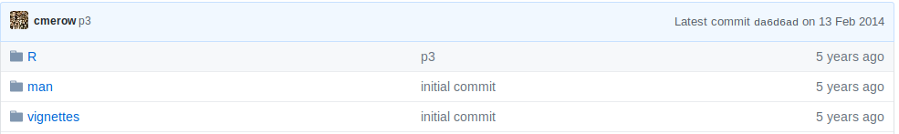
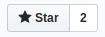
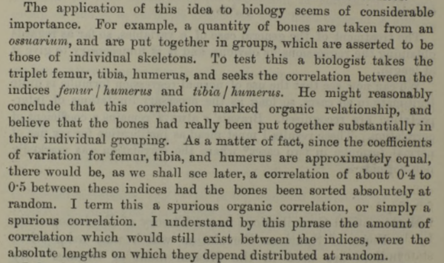
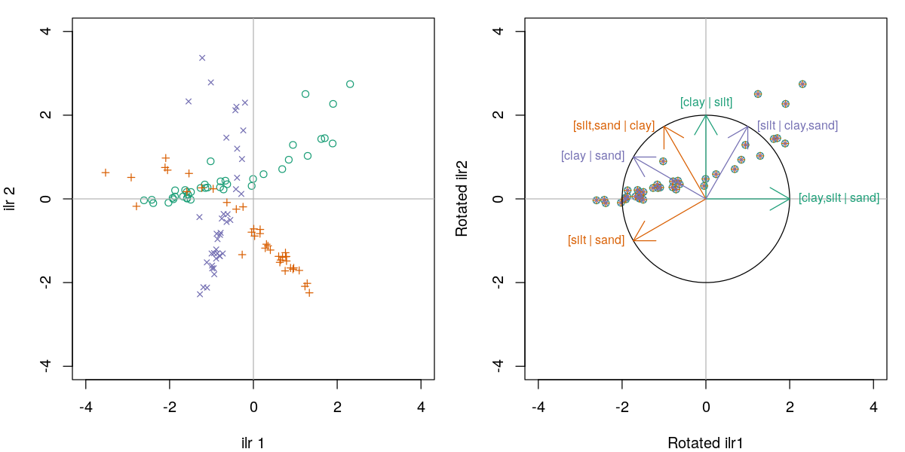

--- 
site: bookdown::bookdown_site
output: bookdown::gitbook
---

# Explorer R {#chapitre-explorer}

L'apprentissage de R peut être étourdissant. Cette section est une petite pause fourre-tout qui vous introduira aux nombreuses possibilités de R.

***
️\ **Objectifs spécifiques**:

À la fin de ce chapitre, vous

- serez en mesure d'identifier les sources d'information principales sur le développement de R et de ses modules
- comprendrez l'importance du prétraitement des données, en particulier dans le cadre de l'analyse de données compositionnelles, et saurez effectuer un prétraitement adéquat
- saurez comment acquérir des données météo d'Environnement Canada avec le module [weathercan](http://ropensci.github.io/weathercan/)
- saurez identifier les modules d'analyse de sols ([soiltexture](https://github.com/julienmoeys/soiltexture) et [aqp](http://ncss-tech.github.io/aqp/docs/))
- saurez comment débuter un projet de méta-analyse et de déploiement d'un logiciel sur R

***

Pour certains, le langage R est un labyrinthe. Pour d'autres, c'est une myriade de portes ouvertes. Si vous lisez ce manuel, vous vous êtes peut-être engagé dans un labyrinthe dans l'objectif d'y trouver la clé qui dévérouillera une porte bien précise qui mène à un trésor, un objet magique... ou un diplôme. Peut-être aussi prendrez-vous le goût d'errer dans ce labyrinthe, explorant ses débouchés, pour y dénicher au hasard des petits outils et des débouchés.

```{r expl-zelda, out.width="50%", fig.align="center", fig.cap="Séquence du jeu vidéo *The legend of Zelda*, source inconnue.", echo = FALSE}
knitr::include_graphics("images/06_zelda.gif")
```

Cette section est un amalgame de plusieurs outils de R pertinents en analyse écologique.

## R sur le web

Dans un environnement de travail en évolution rapide et constante, il est difficile de considérer que ses compétences sont abouties. Rester informé sur le développement de R vous permettra de dénicher de résoudre des problèmes persistants de manière plus efficace ou par de nouvelles avenues, et vous offrira même l'occasion de dénicher des problèmes dont vous ne soupçonniez pas l'existance.  Plusieurs sources d'information vous permettront de vous tenir à jour sur le développement de R, de ses environnement de travail (RStudio, Jupyter, Atom, etc.) et des nouveaux modules qui s'y greffent. Plus largement, vous gagnerez à vous informer sur les dernières tendances en calcul scientifique sur d'autres plate-forme que R (Python, Javascript, Julia, etc.). Évidemment, nos tâches quotidiennes ne nous permettent pas de tout suivre. Même si vous pouviez n'attrapper qu'1% du défilement, ce sera déjà 1% de plus que rien du tout.

> Évidemment, rester au courant aide parce que vous en apprenez davantage sur les outils et leurs applications. Mais ça aide aussi parce que ça vous permet de connaître des gens et des organisations! Il est très utile de savoir qui travaille sur quoi et où se déroulent les développements sur un sujet donné, car si vous cherchez consciemment quelque chose plus tard, ça vous aidera à trouver votre chemin plus facilement. - Maëlle Salmon, [Keeping up to date with R news](https://masalmon.eu/2019/01/25/uptodate/) (ma traduction)

Je vous propose une liste de ressources. Ne vous y tenez surtout pas: discartez ce qui ne vous convient pas, et partez à l'aventure!

```{r expl-hobbit, out.width="70%", fig.align="center", fig.cap="Tiré du film *The Hobbit: An Unexpected Journey*, de Peter Jackson (2012).", echo = FALSE}

```

### GitHub

Nous avons vu chapitre \@ref(chapitre-git) l'importance d'utilser des outils d'archivage et de suivi de version, comme *git*, dans le déploiement de la *science ouverte*. En effet, [GitHub](https://www.github.com) est une plate-forme *git* sur Internet, acquise par Microsoft, qui est devenue un réseau social de développement informatique. [De nombreux modules de R y sont développés](https://github.com/topics/r). Au chapitre \@ref(chapitre-git), vous avez appris à y ouvrir un compte et à y archiver du contenu. Vous pourrez alors **suivre** (dans le même sens que sur d'autres réseaux sociaux) le développement de projets et suivre les travaux des personnes qui vous semblent d'intérêt.

### Twitter

Le *hashtag* `#rstats` rassemble sur [Twitter](https://twitter.com/hashtag/rstats?src=hash) ce qui se tweete sur le sujet. On y retrouve les comptes de [R-bloggers](https://twitter.com/Rbloggers), [RStudio](https://twitter.com/rstudio) et [rOpenSci](https://twitter.com/rOpenSci). Certaines communautés y sont aussi actives, comme [R4DS online learning community](https://twitter.com/R4DScommunity), qui partage des nouvelles sur R, et [R-Ladies Global](https://twitter.com/RLadiesGlobal), qui vise à amener davantage de diversité à la communauté de R. Des comptes thématiques comme [Daily R Cheatsheets](https://twitter.com/daily_r_sheets), [R for the Rest of Us](https://twitter.com/rfortherest) et [One R Package a Day](https://twitter.com/RLangPackage) permettent de découvrir quotidiennement de nouvelles possibilités. Enfin, plusieurs personnes contribuent positivement à la communauté R. [Hadley Wickham](https://twitter.com/hadleywickham) brille parmi les étoiles de R. Les comptes de [Mara Averick](https://twitter.com/dataandme), [Claus Wilke](https://twitter.com/ClausWilke) et [David Robinson](https://twitter.com/drob) sont aussi intéressants. Enfin, [Thomas Lin Pedersen](https://twitter.com/thomasp85), qui travaille en visualisation chez RStudio, crée des oeuvres d'art génératif avec R et **`ggplot2`**.

```{r expl-thomas-lin-pedersen, out.width="70%", fig.align="center", fig.cap="genesis338, une oeuvre de [Thomas Lin Pedersen](https://www.data-imaginist.com/art) créée avec **`ggplot2`**.", echo = FALSE}
knitr::include_graphics("https://www.data-imaginist.com/art/005_genesis/genesis338.png")
```

### Nouvelles

Le site d'aggrégation [R-bloggers](https://www.r-bloggers.com/), mis à jour quotidiennement, republie des articles en anglais tirés d'un peu partout sur la toile. On y trouve principalement des tutoriels et des annonces de nouveaux développement. Deux fois par mois, l'organisation [rOpenSci](https://news.ropensci.org/) offre un portrait de l'univ-R (#dadjoke), ce que [R Weekely](https://rweekly.org/) offre de manière hebdomadaire (l'information sera probablement redondante). Le tidyverse a quant à lui son propre [blogue](https://www.tidyverse.org/articles/).

### Des questions?

Bien que davantage voués à la résolution de problème qu' à l'exploration de nouvelles opportunités, [Stackoverflow](https://stackoverflow.com/questions/tagged/r) et [Cross Validated](https://stats.stackexchange.com/questions/tagged/r) sont des plate-forme prisées. De plus, la liste de courriels [r-sig-ecology](https://www.mail-archive.com/r-sig-ecology@r-project.org/info.html) permet des échanges entre professionnels et novices en analyse de données écologiques avec R.

### Participer

R est un logiciel basé sur une communauté de développement, d'utilisation et de vulgarisation. Des personnes offrent généreusement du temps de support. Si vous vous sentez à l'aise, offrez aussi le vôtre!

### Mise en garde

Les modules de R sont développés par quiconque le veut bien: leur qualité n'est pas nécessairement auditée. Souvent, ils ne sont vérifiés que par une vigilance communautaire: dans ce cas, vous êtes les cobailles. Ce qui n'est pas nécessairement une mauvaise chose, mais cela nécessite de prendre ses précautions. Dans sa conférence [How to be a resilient R user](https://maelle.github.io/fluctuat_nec_mergitur), [Maëlle Salmon](https://twitter.com/ma_salmon) propose quelques guides pour juger de la qualité d'un module.

**1. Le module est-il activement développé?**

Bien!


Attention!



**2. Le module est-il bien testé?**

Vérifiez si le module a fait l'objet d'une publication scientifique, s'il a été utilisé avec succès dans la littérature ou dans des documents crédibles.

**3. Le module est-il bien documenté?**

Un site internet dédié est-il utilisé pour documenter l'utilisation du module? Les fichiers d'aide sont-ils complets, et sont-ils de bonne qualité?

**4. Le module est-il largement utilisé?**

Un module peu populaire n'est pas nécessessairement de mauvaise qualité: peut-être est-il seulement destiné à des applications de niche. S'il n'est pas un indicateur à lui seul de la solidité ou la validité d'un module, une masse critique indique que le module a passé sous la surveillance de plusieurs utilisateurs. Dans GitHub, ceci peut être évalué par le nombre d'étoiles attribué au module (équivalent à un J'aime).

 

**5. Le module est-il développé par une personne ou une organisation crédible?**

On peut affirmer sans trop se compromettre que l'équipe de RStudio développe des modules de confiance. Tout comme il faudrait se méfier d'un module développé par une personne anonyme.

Le module [packagemetrics](https://github.com/ropenscilabs/packagemetrics) permet d'évaluer ces critères.

```{r expl-package_list_metrics, eval = FALSE}
# devtools::install_github("ropenscilabs/packagemetrics")
library("packagemetrics")
pm <- package_list_metrics(c("dplyr", "ggplot2", "vegan", "greta"))
metrics_table(pm)
```

### Prendre tout ça en note

Un logiciel de prise de notes (il en existe plein, mais je vous suggère d'opter pour les options encryptées) pourrait vous être utile pour retrouver l'information soutirée de vos flux d'information. Mais certaines personnes consignent simplement leurs informations dans un carnet ou un document de traitement de texte.

## R en chaire et en os

L'Université Laval (institution auprès de laquelle ce manuel est développé) est hôte à tous les 2 ans de la conférence [R à Québec](http://raquebec.ulaval.ca). La prochaine conférence aura lieu en 2021.

## Quelques outils en écologie mathématique avec R

### Prétraitement des données

Il arrive souvent ques les données brutes ne soient pas exprimées de manière appropriée ou optimale pour l'analyse statistique ou la modélisation. Vous devrez alors effectuer un prétraitement sur ces données. Lors du chapitre \@ref(chapitre-biostats), nous avons abordé la mise à l'échelle, où des variables numériques étaient transformées pour avoir une moyenne de zéro et un écart-type de 1. Cette opération permettait d'apprécier les coefficients et leur incertitude sur une même échelle. L'encodage catégorielle a quant à lui permi d'utiliser des méthodes quantitatives sur des données qualitatives. Dans les deux cas, nous n'avons pas utilisé le terme, mais il s'agissait d'un **prétraitement**, c'est-à-dire une transformation des données préalable à l'analyse ou la modélisation.

Un prétraitement peut consister simplement en une transformation logarithmique ou exponentielle. Nous verrons les transformations les plus communes comme la standardisation, la mise à l'échelle sur une étendue et la normalisation. Puis nous verrons comment ces opérations de prétraitement sont offertes dans le module [**`recipes`**](https://tidymodels.github.io/recipes/).

**`recipes`** n'est pas en mesure d'effectuer toutes les transformations imaginables. Pour des opérations plus spécialisées, si vos données forment une partie d'un tout (exprimées en pourcentages ou fractions), vous devriez probablement utiliser un prétraitement grâce aux outils de l'**analyse compositionnelle**. Avant de les aborder, nous allons traiter des transformations de base.

#### Standardisation

La standardisation consiste à centrer vos données à une moyenne de 0 et à les échelonner à une variance de 1, c'est-à-dire

$$x_{standard} = \frac{x - \bar{x}}{\sigma}$$

où $\bar{x}$ est la moyenne du vecteur $x$ et où $\sigma$ est son écart-type.

Ce prétraitement des données peut s'avérér utile lorsque la modélisation tient compte de l'échelle de vos mesures (par exemple, les paramètres de régression vus au chapitre \@ref(chapitre-biostats) ou les distances que nous verrons au chapitre \@ref(chapitre-ordination)). En effet, les pentes d'une régression linéaire multiple ne pourront être comparées entre elles que si elles sont une même échelle. Par exemple, on veut modéliser la consommation en miles au gallon (`mpg`) de voitures en fonction de leur puissance (`hp`), le temps en secondes pour parcourir un quart de mile (`qsec`) et le nombre de cylindre.

```{r expl-scale1}
data("mtcars")
modl <- lm(mpg ~ hp + qsec + cyl, mtcars)
summary(modl)
```

Les pentes signifient que la distance parcourue par gallon d'essence diminue de 0.03552 miles au gallon pour chaque HP, de 0.89242 par seconde au quart de mile et de 2.2696 par cyclindre additionnel. L'interprétation est conviviale à cette échelle. Mais lequel de ces effets est le plus important? L `t value` indique que ce seraient les cylindres. Mais pour juger l'importance en terme de pente, il vaudrait mieux standardiser.

```{r expl-scale2}
library("tidyverse")
standardise <- function(x) (x-mean(x))/sd(x)
mtcars_sc <- mtcars %>%
  mutate_if(is.numeric, standardise) # ou bien scale(mtcars, center = TRUE, scale = TRUE)
modl_sc <- lm(mpg ~ hp + qsec + cyl, mtcars_sc)
summary(modl_sc)
```

Les valeurs des pentes ne peuvent plus être interprétées directement, mais peuvent maintenant être comparées entre elles. Dans ce cas, le nombre de cilyndres a en effet une importance plus grande que la puissance et le temps pour parcourir un 1/4 de mile.

Les algorithmes basés sur des distances auront, de même, avantage à être standardisés.

#### À l'échelle de la plage

Si vous désirez préserver le zéro dans le cas de données positives ou plus généralement vous voulez que vos données prétraitées soient positives, vous pouvez les transformer à l'échelle de la plage, c'est-à-dire les forcer à s'étaler de 0 à 1:

$$ x_{range01} = \frac{x - x_{min}}{x_{max} - x_{min}}  $$

Cette transformation est sensible aux valeurs aberrantes, et une fois le vecteur transformé les valeurs aberrantes seront toutefois plus difficiles à détecter.

```{r expl-scale-range}
range_01 <- function(x) (x-min(x))/(max(x) - min(x))
mtcars %>%
  mutate_if(is.numeric, range_01) %>% # en fait, toutes les colonnes sont numériques, alors mutate_all aurait pu être utilisé au lieu de mutate_if
  sample_n(4)
```

#### Normaliser

Le terme *normaliser* est associer à des opérations différentes dans la littérature. Nous prendrons la nomenclature de [scikit-learn](https://scikit-learn.org/stable/modules/preprocessing.html#normalization), pour qui la normalisation consiste à faire en sorte que la longueur du vecteur (sa norme, d'où *normaliser*) soit unitaire. Cette opération est le plus souvent utilisée par observation (ligne), non pas par variable (colonne). Il existe plusieurs manières de mesures la distance d'un vecteur, mais la plus commune est la distance euclidienne. La seule fois que j'ai eu à utiliser ce prétraitement était en analyse spectrale ([Chemometrics with R, Ron Wehrens, 2011, chapitre 3.5](https://www.springer.com/us/book/9783642178405#otherversion=9783642178412)). En R,

```{r expl-scale-norm}
library("pls")
data("gasoline")
spectro <- gasoline$NIR %>% unclass() %>% as_tibble()

normalise <- function(x) x/sqrt(sum(x^2))
spectro_norm <- spectro %>% 
  rowwise() %>% # différentes approches possibles pour les opérations sur les lignes
  normalise()
spectro_norm[1:4, 1:4]
```

#### Le module **`recipes`**

Nous avons vu comment standardiser avec notre propre fonction. Certaines personnes préfèrent utiliser la fonction `scale()`. Mais une nouvelle approche est en train de s'installer, avec le module **`recipes`**, un module de l'ombrelle **`tidymodels`**, un méta module en développement visant à faire de R un outil de modélisation plus convivial.

**`recipes`** fonctionne en mode *tidyverse*, c'est-à-dire en suites d'opérations. [De nombreuses fonctions](https://tidymodels.github.io/recipes/reference/index.html) sont offertes, dont des fonctions d'imputation, que nous verrons au chapitre \@ref(chapitre-outliers). Nous couvrirons ici la standardisation et la mise à l'échelle, juste pour l'apéro 🍳.

Le module ne s'appelle pas *recette* pour rien. Il fonctionne en trois étapes: 

1. Monter la liste des ingrédients: spécifier ce qu'il faut faire
1. Mélanger les ingrédients: transformer tout ce qu'il faut faire en une procédure
1. Cuire les ingrédients: appliquer la procédure à un tableau.

Voici une petite application sur le tableau `lasrosas.corn`.

```{r expl-load-recipes}
library("tidymodels")
data(lasrosas.corn, package = "agridat")
lasrosas.corn %>% 
  head()
```

Disons que pour mon modèle statistique, ma variable de sortie est le rendement (`yield`), que je désire lier à la dose d'azote (`nitro`), à un indicateur de la teneur en matière organique du sol (`bv`) et à la topographie (`topo`).

Mais pour rendre le modèle prédictif (et non pas seulement descriptif), je dois l'évaluer sur des données qui n'ont pas servies à lisser le modèle (nous verrons en plus de détails ça au chapitre \@ref(chapitre-ml)). Je vais donc séparer mon tableau au hasard en un tableau d'entraînement comprenant 70% des observations et un autre pour tester le modèle comprenant le 30% restant.

```{r expl-split}
train_test_split <- lasrosas.corn %>% 
  select(yield, nitro, bv, topo) %>% 
  initial_split(prop = 0.7)
train_df <- training(train_test_split)
test_df <- testing(train_test_split)
```

Voici ma recette. Je l'expliquerai tout de suite après.

```{r expl-recette}
recette <- recipe(yield ~ ., data = train_df) %>% 
  step_zv(all_numeric()) %>% 
  step_normalize(all_numeric(), -all_outcomes()) %>% 
  step_downsample(topo) %>%
  step_dummy(topo) %>% 
  prep()
```

La recette peut se baser sur l'interface formule - souvenez-vous que le `.` signifie "toutes les autres variables du tableau". Elle se base toujours sur le jeu d'entraînement. La prochaine étape (souvenez-vous que `%>%` signifie "puis" ou "ensuite") consiste à retirer les variables dont la variance est non-nulle, ce qui est pratique pour éviter que la standardisation divise par $0$. Cette étape est appliquée à toutes les variables numériques `all_numeric()`. Ensuite, je standardise avec la fonction `step_normalize()` - il y a beaucoup de confusion entre la notion de standardisation et de normalisation dans les fonctions comme dans la littérature. Dans cette fonction, je spécifie que la standardisation n'est applicable que sur les entrées numériques du modèle (`all_numeric(), -all_outcomes()`). L'étape `step_downsample()` retire des obsservations pour faire en sorte que les catégories d'une variable apparaissent toutes en même nombre. Bien que l'interface-formule de R s'en occupe automatiquement, je spécifie ensuite que je désire que la variable `topo` subisse un enodage catégoriel. Puis je mélange mes ingrédients avec la fonction `prep()`. J'obtiens un objet de type recette.

```{r expl-show-recipe}
recette
```

La recette étant bien mélangée, on peut en extraire le jus avec la fonction `bake()`, qui permet de générer le tableau transformé.

```{r expl-bake-test}
test_proc <- bake(recette, test_df)
test_proc %>% sample_n(5)
```

La fonction `bake()` peut aussi être appliquée au données d'entraînement, mais certaines étapes de recette doivent passer par des opérations particulières, comme `step_downsample()` Il est donc préférable, pour les données d'entrâinement, d'en extraire le jus avec la fonction `juice()`.

```{r expl-bake-train}
train_proc <- bake(recette, train_df)
train_proc %>% sample_n(5)
```

Le tableau `train_proc` peut être envoyé dans un modèle de votre choix! Par exemple,

```{r expl-lm-baked-train}
lm(yield ~ ., train_proc) %>% 
  summary()
```

#### Analyse compositionnelle en R

En 1898, le statisticien Karl Pearson nota que des corrélations étaient induites lorsque l'on effectuait des ratios par rapport à une variable commune.


Source [Karl Pearson, 1897. Mathematical contributions to the theory of evolution.—on a form of spurious correlation which may arise when indices are used in the measurement of organs. Proceedings of the royal society of London](https://royalsocietypublishing.org/doi/pdf/10.1098/rspl.1896.0076)

Faisons l'exercice! Nous générons au hasard 1000 données (comme le proposait Pearson) pour trois dimensions: le fémur, le tibia et l'humérus. Ces dimensions ne sont pas générées par des distributions corrélées.

```{r expl-coda-bones}
set.seed(3570536)
n <- 1000
bones <- tibble(femur = rnorm(n, 10, 3),
                tibia = rnorm(n, 8, 2),
                humerus = rnorm(n, 6, 2))
plot(bones)
cor(bones)
```

Pourtant, si j'utilise des ratios allométriques avec l'humérus comme base,

```{r expl-bones-allo}
bones_r <- bones %>% 
  transmute(fh = femur/humerus,
            th = tibia/humerus)
plot(bones_r)
text(30, 20, paste("corrélation =", round(cor(bones_r$fh, bones_r$th), 2)), col = "blue")
```

Nous avons induit ce que Pearson appelait une fausse corrélation (*spurious correlation*). En 1960, [Chayes](https://doi.org/10.1029/JZ065i012p04185) proposa que de telles fausses corrélations sont induites non seulement sur des ratios de valeurs absolues, mais aussi sur des ratios d'une somme totale. Par exemple, dans une composition simple de deux types d'utilisation du territoire, si une proportion augmente, l'autre doit nécessairement diminuer.


```{r expl-bones-corr}
n <- 100
tibble(A = runif(n, 0, 1)) %>% 
  mutate(B = 1 - A) %>% 
  ggplot(aes(x=A, y=B)) +
  geom_point()
```

Les variables exprimées relativement à une somme totale sont dites *compositionnelles*. Elles possèdent les caractéristiques suivantes.

1. **Redondance d'information**. Un système de deux proportions ne contient qu'une seule variable du fait que l'on puisse déduire l'une en soutrayant l'autre de la somme totale. Un vecteur compositionnel contient de l'information redondante. Pourtant, effectuer des statistiques sur l'une plutôt que sur l'autre donnera des résultats différents.
2. **Dépendance d'échelle**. Les statistiques devraient être indépendantes de la somme totale utilisée. Pourtant, elles différeront sur l'on utilise par exemple, une proportion des mâles d'une part et des femelles d'autre part, ou la proportion de la somme des deux, de même que les résultats d'un test sanguin différera si l'on utilise une base sèche ou une base humide.
3. **Distribution théorique des données**. Étant donnée que les proportions sont confinées entre 0 et 1 (ou 100%, ou une somme totale quelconque), la distribution normale (qui s'étend de -∞ à +∞) n'est souvent pas appropriée. On pourra utiliser la distribution de Dirichlet ou la distribution logitique-normale, mais d'autres approches sont souvent plus pratiques.

Pour illustrer l'effet de la distribution, voyons un diagramme ternaire incluant le sable, le limon et l'argile. En utilisant des écart-types univariés, nous obtenons l'ellipse en rouge, qui non seulement représente peu l'étalement des données, mais elle dépasse les bornes du triangle, admettant ainsi des proportions négatives. En bleu, la distribution logistique normale (issue des méthodes présentées plus loin dans cette section) convient davantage.


Les conséquences d'effectuer des statistiques linéaires sur des données compositionnelles brutes peuvent être majeures. En outre, [Pawlowksy-Glahn et Egozcue (2006)](http://dx.doi.org/10.1144/GSL.SP.2006.264.01.01), s'appuyant en outre sur Rock (1988), note les problèmes suivants (exprimés en mes mots).

1. les régressions, les regroupements et les analyses en composantes principales peuvent avoir peu ou pas de signification
2. les propriétés des distributions peuvent être générées par l'opération de fermeture de la composition (s'assurer que le total des proportions donne 100%)
3. les résultats d'analyses discriminantes linéaires sont propices à être illusoires
4. tous les coefficients de corrélation seront affectés à des degrés inconnus
5. les résultats des tests d'hypothèses seront intrinsèquement faussés

Pour contourner ces problèmes, il faut d'abord aborder les données compositionnelles pour ce qu'elles sont: des données intrinsèquement multivariées. Elles sont un nuage de point, et non pas une collection de variables individuelles. Ceci qui n'empêche pas d'effectuer des analyses consciencieusement sous des angles particuliers. 

En R, on pourra aisément rapporter une composition en somme unitaire grâce à la fonction `apply`. Mais auparavant, chargeons le module `compositions` (n'oubliez pas de l'installer au préalable) pour accéder à des données fictives de proportions de sable, limon et argile dans des sédiments.

```{r expl-coda-arcticlake, message=FALSE, warning=FALSE}
library("compositions")
data("ArcticLake")
ArcticLake <- ArcticLake %>% as_tibble()
head(ArcticLake)
```

```{r expl-coda-acomp1}
comp <- ArcticLake %>%
  select(-depth) %>%
  apply(., 1, function(x) x/sum(x)) %>% 
  t()
comp[1:5, ]
```

On pourra aussi utiliser la fonction `acomp` (pour Aitchison-composition) pour fermer la composition à une somme de 1.

```{r expl-coda-acomp2}
comp <- ArcticLake %>%
  select(-depth) %>%
  acomp(.)
comp[1:5, ]
```

Cette stratégie a pour avantage d'attribuer à la variable `comp` la classe `acomp`, qui automatise les opérations dans l'espace compositionnel (que l'on nomme aussi le *simplex*). La représentation ternaire est souvent utilisée pour présenter des compositions. Toutefois, il est difficile d'interpréter les compositions de plus de trois parties. La classe `acomp` automatise aussi la représentation teranaire.

```{r expl-coda-tern}
plot(comp)
```

Afin de transposer cet espace clôt en un espace ouvert, on pourra diviser chaque proportion par une proportion de référence choisie parmi n'importe quelle proportion. Du coup, on retire une dimension redondante! Dans ce ratio, on choisit d'utiliser la proportion de référence au dénominateur, ce qui est arbitraire. En utilisant le log du ratio, l'inverse du ratio ne sera qu'un changement de signe, ce qui est pratique en statistiques linéaries. Cette solution, proposée par Aitchison (1986), s'applique non seulement sur les compositions à deux composantes, mais sur toute composition. Il s'agit alors d'utiliser une composition de référence pour effecteur les ratios. Pour une composition de $A$, $B$, $C$, $D$ et $E$:

$$alr_A = log \left( \frac{A}{E} \right), alr_B = log \left( \frac{B}{E} \right), alr_C = log \left( \frac{C}{E} \right), alr_D = log \left( \frac{D}{E} \right)$$

Dans R, la colonne de référence est par défaut la **dernière colonne de la matrice des compositions**.

```{r expl-alr}
add_lr <- alr(comp)
```

Cette dernière stratégie se nomme les **log-ratios aditifs** ($alr$ pour *additive log-ratio*). Bien que valide pour effectuer des tests statistiques, cette stratégie a le désavantage de dépendre de la décision arbitraire de la composante à utiliser au numérateur. Deuxième restriction des *alr*: les axes de l'espace des *alr* n'étant pas orthogonaux, ils ne peuvent pas être utilisés pour effectuer des statistiques basées sur les distances (que nous couvrirons au chapitre \@ref(chapitre-ordination)).

L'autre stratégie proposée par Aitchison était d'effectuer un log-ratio entre chaque composante et la moyenne géométrique de toutes les composantes. Cette transformation se nomme le **log-ratio centré** ($clr$, pour *centered log-ratio*)

$$clr_i = log \left( \frac{x_i}{g \left( x \right)} \right)$$

En R,

```{r expl-clr}
cen_lr <- clr(comp)
```

Avec des CLRs, les distances sont valides. Mais... nous restons avec le problème de la redondance d'information. En fait, la somme de chacunes des lignes d'une matrice de clr est de 0. Pas très pratique lorsque l'on effectue des statistiques incluant une inversion de la matrice de covariance (distance de Mahalanobis, géostatistiques, etc.)

```
cen_lr %>% 
  cov() %>% 
  solve()
 Error in solve.default(.) : le système est numériquement singulier : conditionnement de la réciproque = 4.44407e-17
```

Enfin, une autre méthode de transformation développée par Egoscue et al. (2003), les log-ratios isométriques (ou *isometric log-ratios, ilr*) projette les compositions comprenant D composantes dans un espace restreint de D-1 dimensions orthonormées. Ces dimensions doivent doivent être préalablement établie dans un dendrogramme de bifurcation, où chaque composante ou groupe de composante est successivement divisé en deux embranchement. La manière d'arranger ces balances importe peu, mais on aura avantage à créer des balances interprétables.

Le diagramme de balances peut être encodé dans une partition binaire séquentielle (ou *sequential bianry partition, sbp*). Une *sbp* est une matrice de contraste ou chaque ligne représente une partition entre deux variables ou groupes de variables. Une composante étiquettée `+1` correspondra au groupe du numérateur, une composante étiquettée `-1` au dénominateur et une composante étiquettée `0` sera exclue de la partition ([Parent et al., 2013](http://dx.doi.org/10.3389/fpls.2013.00039)). J'ai reformulé la fonction CoDaDendrogram pour que l'on puisse ajouter des informations intéressantes sur les balants horizontaux. Cette fonction est disponible sur github.

```{r expl-sbp}
source("https://raw.githubusercontent.com/essicolo/AgFun/master/codadend2.R")

sbp <- matrix(c(1, 1,-1,
                1,-1, 0),
              byrow = TRUE,
              ncol = 3)

CoDaDendrogram2(comp, V = gsi.buildilrBase(t(sbp)), ylim = c(0, 1),
                equal.height = TRUE)

```

Si la SBP est plus imposante, il pourrait être plus aisé de monter dans un chiffrier, puis de l'importer dans R via un fichier csv.

Le calcul des ILRs est effectué comme suit.

$$ilr_j = \sqrt{\frac{n_j^+ n_j^-}{n_j^+ + n_j^-}} log \left( \frac{g \left( c_j^+ \right)}{g \left( c_j^+ \right)} \right)$$

ou, à la ligne $j$ de la SBP, $n_j^+$ et $n_j^-$ sont respectivement le nombre de composantes au numérateur et au dénominateur, $g \left( c_j^+ \right)$ est la moyenne géométrique des composantes au numérateur et $g \left( c_j^- \right)$ est la moyenne géométrique des composantes au dénominateur.

Les balances sont conventionnellement notées `[A,B | C,D]`, ou les composantes `A` et `B` au dénominateur sont balancées avec les composantes `C` and `D` au numérateur. Une balance positive signifie que la moyenne géométrique des concentrations au numérateur est supérieur à celle au dénominateur, et inversement, alors qu'une balance nulle signifie que les moyennes géométriques sont égales (équilibre). Ainsi, en modélisation linéaire, un coefficient positif sur `[A,B | C,D]` signifie que l'augmentation de l'importance de `C` et `D` comparativement à `A` et `B` est associé à une augmentation de la variable réponse du modèle.

En R,

```{r expl-ilr}
iso_lr <- ilr(comp, V = gsi.buildilrBase(t(sbp)))
```

Notez la forme `gsi.buildilrBase(t(sbp))` est une opération pour obtenir la matrice d'orthonormalité à partir de la SBP.

Les ILRs sont des balances multivariées sur lesquelles on pourra effectuer des statistiques linéaries. Bien que l'interprétation des résultats comme collection d'interprétations sur des balances univariées pourra être affectée par la structure de la SBP, ni les statistiques linéaires multivariées, ni la distance entre les points ne seront affectés. En effet, chaque variante de la SBP est une rotation (d'un facteur de 60°) par rapport à l'origine:

```{r expl-rotation}
source("lib/ilr-rotation-sbp.R")
```



Pour les transformations inverses, vous pourrez utiliser les fonctions `alrInv`, `clrInv` et `ilrInv`. Dans tous les cas, si vous tenez à garder la trace de vos données dans leur format original, vous aurez avantage à ajouter à votre vecteur compositionnel la valeur de remplissage, constitué d'un amalgame des composantes non mesurées. Par exemple,

```{r expl-npk}
pourc <- c(N = 0.03, P = 0.001, K = 0.01)
acomp(pourc) # vous perdez la trace des proportions originales
```

```{r expl-npk-acomp}
pourc <- c(N = 0.03, P = 0.001, K = 0.01)
Fv <- 1 - sum(pourc)
comp <- acomp(c(pourc, Fv = Fv))
comp
```

```{r expl-npk-ilr}
iso_lr <- ilr(comp) # avec une sbp par défaut
ilrInv(iso_lr)
```

Si vos données font partie d'un tout, je vous recommande chaudement d'utiliser des méthodes compositionnelles autant pour l'analyse que la modélisation. Pour en savoir davantage, le livre *Compositional data analysis with R*, de van den Boogart et Tolosana-Delgado, est disponible en format électronique à la bibliothèque de l'Université Laval.

Pour aller plus loin, j'ai écri un billet à ce sujet (auquel à ce jour il manque toujours un cas d'étude): [We should use balances and machine learning to diagnose ionomes](https://www.authorea.com/users/23640/articles/281937-we-should-use-balances-and-machine-learning-to-diagnose-ionomes).

### Acquérir des données météo

Une tâche commune en écologie est de lier des observations à la météo... qui sont rarement collectés lors d'expériences. [Environnement Canada](https://meteo.gc.ca/) possède sont réseau de stations. Les données sont disponibles sur internet en libre accès. Vous pouvez chercher des stations, effectuer des requêtes et télécharger des fichiers csv. Pour un petit tableau, la tâche est plutôt triviale. Mais ça devient rapidement laborieux à mesure que l'on doit rechercher de nombreuses données.

Le module [weathercan](http://ropensci.github.io/weathercan/), développé par Steffi LaZerte, permet d'effectuer des requêtes rapidement à partir des coordonnées de votre site expérimental. Par exemple, si je cherche une station météo sfournissant des données horaires situé à moins de 20 km du sommet du Mont-Bellevue, à Sherbrooke, aux coordonnées [latitude 45.35, longitude -71.90],

```{r expl-weathercan-stations}
library("weathercan")
station_site <- stations_search(coords = c(45.35, -71.90), dist = 20, interval = "hour")
station_site
```

Je prends en note l'identifiant de la station désirée (ou des stations, disons 5397 et 48371), puis je lance une requête pour obtenir la météo horaire entre les dates désirées.

```{r expl-weathercan-data}
mont_bellevue <- weather_dl(station_ids = c(5397, 48371),
                            start = "2019-02-01",
                            end = "2019-02-07",
                            interval = "hour",
                            verbose = TRUE, tz_disp = "Etc/GMT+5")
mont_bellevue %>% head(5)
```

Et voilà.

```{r expl-weathercan-plot}
mont_bellevue %>% 
  ggplot(aes(x = time, y = temp)) +
  geom_line(aes(colour = station_name))
```

### Pédométrie avec R

*Cette section a été écrite par [Michael Leblanc](https://www.researchgate.net/profile/Michael_Leblanc7).* Je n'y ai appliqué que quelques retouches esthétiques.

Plusieurs fonctionnalités ont été développées sur R afin d'aider les *pédométriciens* à visualiser, explorer et traiter les données numériques en science des sols. Voici quelques exemples.

#### Texture du sol

La texture du sol est définie par sa composition granulométrique, habituellement représentée par trois fractions (sable, limon, argile), laquelle peut être généralisée en classe texturale. La définition des classes texturales diffère d'un système ou d'un pays à l'autre comme en témoigne l'article [Perdus dans le triangle des textures (Richer de Forges et al. 2008)](http://www.afes.fr/wp-content/uploads/2017/10/EGS_15_2_richerdeforges.pdf). La définition des fractions granulométriques peut également différer selon le domaine d'étude (ingénierie, pédologie) ou le pays. Par exemple, le diamètre du limon est de 0,002 mm à 0,05 mm dans le système canadien, américain et français alors qu'il est de 0,002 mm à 0,02 mm dans le système australien et de 0,002 mm à 0,063 mm dans le système allemand. Il est donc important de vérifier la méthodologie et le système de classification utilisés pour interpréter les données de texture du sol. Le module `soilTexture` propose des fonctions permettant d'aborder ces multiples définitions.

```{r expl-sol-soiltexture}
library("soiltexture")
```

##### Les triangles texturaux

Avec la fonction `TT.plot`, vous pouvez présenter vos données granulométriques dans un triangle textural tel que défini par les différents systèmes nationaux. Auparavant, créons un objet comprenant des textures aléatoires.

```{r expl-sol-data}
set.seed(848341) # random.org
rand_text <- TT.dataset(n=100, seed.val=29)
head(rand_text)
```

Avec le module soiltexture, les tableaux de texture doivent inclure les intitullés exactes CLAY, SILT et SAND (notez les majuscules). Les points des textures générées peuvent être portés dans des diagrammes ternaires texturaux de différents systèmes de classification, par exemple le système canadioen et le système USDA.

```{r expl-sol-tern, fig.width = 16, fig.height = 8}
par(mfrow=c(1, 2))

TT.plot(class.sys = "CA.FR.TT", 
        tri.data = rand_text,
        col = "blue")
TT.plot(class.sys = "USDA.TT", 
        tri.data = rand_text,
        col = "blue")

```

Les paramètres de la figure (titres, polices, style de la grille, etc.) peuvent être personnalisés avec les [arguments TT.plot](https://www.rdocumentation.org/packages/soiltexture/versions/1.5.1/topics/TT.plot).

##### Les classes texturales

La fonction `TT.points.in.classes` est utile pour désigner la classe texturale à partir des données granulométriques, en spécifiant bien le système de classification désiré.

```{r expl-sol-classes}
TT.points.in.classes(
  tri.data = rand_text[1:10, ], # 
  class.sys = "CA.FR.TT",
  PiC.type = "t"
)
```

Plusieurs autres fonctions sont proposées par `soiltexture` afin de visualiser, classifier et transformer les données de texture du sol : [Functions in soiltexture](https://www.rdocumentation.org/packages/soiltexture/versions/1.5.1). Julien Moeys (2018) propose également le tutoriel [*The soil texture wizard: a tutorial*](https://cran.r-project.org/web/packages/soiltexture/vignettes/soiltexture_vignette.pdf).

#### Profils de sols

Le profil de sols est une entité décrite par une séquence de couches ou d'horizons avec différentes caractéristiques morphologiques. Le module AQP, pour [*Algorithms for Quantitative Pedology*](http://ncss-tech.github.io/AQP/), propose des fonctions de visualisation, d'agrégation et de classification permettant d'aborder la complexité inhérente aux informations pédologiques.

##### La visualisation de profils

Vous devez d'abord structurer vos données dans un tableau (`data.frame`) incluant minimalement ces trois colonnes :

1. Identifiant unique du profil (groupes d'horizons) (`id`)
2. Limites supérieures de l'horizon (`top`)
3. Limites inférieures de l'horizon (`down`)

Vos données morphologiques, physico-chimiques, etc., sont incluses dans les autres colonnes. Chargeons un fichier pédologique à titre d'exemple.

```{r expl-sol-pedometrie}
profils <- read_csv("data/06_pedometric-profile.csv")
head(profils)
```

La fonction `munsell2rgb` permet de convertir le code de couleur *Munsell* en format *RGB*.

```{r expl-sol-aqp}
library("aqp")
profils$soil_color <- with(profils, munsell2rgb(hue, value, chroma))
```

Préalablement à la visualisation, le tableau est transformé en objet `SoilProfileCollection` par la fonction `depths`. Pour ce faire, le tableau doit être un pur `data.frame`, non pas un `tibble`.

```{r expl-sol-profils}
profils <- profils %>% as.data.frame()
depths(profils) <- id ~ top + bottom
```

La fonction `plot` détectera le type d'objet et appellera la fonction de visualisation en conséquence.

```{r expl-sol-profils-plot, fig.width = 12, fig.height = 4}
par(mfrow = c(1, 3))
plot(profils, name="horizon")
title('Couleur des horizons', cex.main=1)
plot(profils, name="horizon", color='C.CNS.pc', col.label='C total (%)')
plot(profils, name="horizon", color='pH.CaCl2', col.label='pH CaCl2')
```

De multiples figures thématiques peuvent être générées afin de représenter les particuliarités des profils. Pour aller plus loin, consultez les guides [*Introduction to SoilProfileCollection Objects*](http://ncss-tech.github.io/AQP/aqp/aqp-intro.html) et [*Generating Sketches from SPC Objects*](http://ncss-tech.github.io/AQP/aqp/SPC-plotting-ideas.html).

##### Les plans verticaux (depth functions)

Les plans verticaux sont des diagrammes qui permettent d'interpréter les données en fonction de la profondeur. La fonction `slab` permet le calcul de statistiques descriptives par intervalles de profondeur réguliers, lesquelles permettent de visualiser la variabilité verticale des propriétés des sols.

```{r expl-sol-slab}
agg <- slab(profils, fm = ~ C.CNS.pc + pH.CaCl2)
```

La visualisation est générée par le module graphique ggplot2

```{r expl-sol-agg-ggplot}
agg %>%
  ggplot(mapping = aes(x = -top, y = p.q50)) +
  facet_grid(. ~ variable, scale = "free") +
  geom_ribbon(aes(ymin =  p.q25, ymax = p.q75), fill = "grey75", alpha = 0.5) +
  geom_path() +
  labs(x = "Profondeur (cm)",
       y = "Médiane bordée des 25e and 75e percentiles") +
  coord_flip()
```

##### Le regroupement de profils

Le calcul des distances de dissimilarité entre les profils avec `profile_compare` permet la construction de dendrogramme et le regroupement des profils. Notez que nous survolerons au chapitre \@ref(chapitre-ordination) les concepts de dissimilarité et de partitionnement.

```{r expl-sol-cluster}
library("cluster")
library("mvtnorm")
library("sharpshootR") # remotes::install_github("ncss-tech/sharpshootR")
d <- profile_compare(profils, vars=c('C.CNS.pc', 'pH.CaCl2'), k=0, max_d=40)
d_diana <- diana(d)
plotProfileDendrogram(profils, name="horizon", d_diana,
                      scaling.factor = 0.3, y.offset = 5,
                      color='pH.CaCl2',  col.label='pH CaCl2')
```

##### Diagramme de relations entre les horizons

Il est possible de visualiser les transitions d'horizon les plus probables dans un groupe de profils de sols.

```{r expl-sol-relations, fig.width = 10, fig.height = 5}
tp <- hzTransitionProbabilities(profils, name="horizon")
par(mar = c(0, 0, 0, 0), mfcol = c(1, 2))
plot(profils, name="horizon")
plotSoilRelationGraph(tp, graph.mode = "directed", edge.arrow.size = 0.5, edge.scaling.factor = 2, vertex.label.cex = 0.75, 
                      vertex.label.family = "sans")
```

Consultez [AQP project](http://ncss-tech.github.io/AQP/) pour des présentations, des tutoriels et des exemples de figures qui montrent les nombreuses possibilités du package `AQP`.

### Méta-analyses en R

Je conseille les livres [*Introduction to Meta-Analysis*](https://www.wiley.com/en-us/Introduction+to+Meta+Analysis-p-9780470057247), [*Meta-analysis with R*](https://www.springer.com/us/book/9783319214153) et [*Handbook of Meta-analysis in Ecology and Evolution*](https://press.princeton.edu/titles/10045.html) pour les méta-analyses sur des écosystèmes. Le module metafor est un ioncournable pour effectuer des métaanalyses en R. On ne passe pas tout à fait à côté si l'on utilise le module meta, lui-même basé en partie sur metafor. Le module meta a touttefois l'avantage d'être simple d'utilisation. Par exemple, pour une méta-analyse d'une réponse continue,

```{r expl-meta-load}
library("meta")
meta_data <- read_csv("https://portal.uni-freiburg.de/imbi/_SUPPRESS_ACCESSRULE/lehre/lehrbuecher/meta-analysis-with-r/dataset02.csv")
meta_analyse <- metacont(n.e = Ne, mean.e = Me, sd.e = Se, n.c = Nc, mean.c = Mc, sd.c = Sc, data = meta_data, sm = "SMD")
meta_analyse
```

Et pour effectuer un *forest plot*,

```{r expl-meta-plot}
forest(meta_analyse)
```

### Créer des applications avec R

RStudio vous permet de déployer vos résultats sous forme d'applications web grâce à son module [shiny](https://www.rstudio.com/products/shiny/). Pour ce faire, le seul préalable est de savoir programmer en R. En agençant une interface avec des *inputs* (listes de sélection, des boîtes de dialogue, des sélecteurs, des boutons, etc.) avec des modèles que vous développez, vous pourrez créer des interfaces intéractives.

Pour créer une application shiny, vous devez créer une partie pour l'interface (`ui`) et une autre pour le calcul (`server`). Je n'irai pas dans les détails, étant donnée qu'il s'agit d'un sujet à part entière. Pour aller plus loin, visitez le site du projet [shiny](https://www.rstudio.com/products/shiny/).

```
library("shiny")

ui <- basicPage(
  sliderInput("A", "Asymptote:", min = 0, max = 100, value = 50),
  sliderInput("E", "Environnement:", min = -10, max = 100, value = 20),
  sliderInput("R", "Taux:", min = 0, max = 0.1, value = 0.035),
  sliderInput("prix_dose", "Prix dose:", min = 0, max = 5, value = 1),
  sliderInput("prix_vente", "Prix vente:", min = 0, max = 200, value = 100),
  sliderInput("dose", "Dose:", min = 0, max = 300, value = c(0, 200)),
  plotOutput("distPlot")
)

server <- function(input, output) {
  mitsch_f <- reactive({
    input$A * (1 - exp(-input$R * (seq(input$dose[1], input$dose[2], length = 100) + input$E)))
  })
  
  mitsch_opt <- reactive({
    (log((input$A * input$R * input$prix_vente) / input$prix_dose - input$E * input$R) / input$R )
  })
  
  
  output$distPlot <- renderPlot({
    plot(seq(input$dose[1], input$dose[2], length = 100), mitsch_f(), type = "l", ylim = c(0, 100))
    abline(v = mitsch_opt() )
    text(mitsch_opt(), 2, paste("Dose optimale:", round(mitsch_opt(), 0)))
  })
}

shinyApp(ui, server)
```

Une fois l'application créée, il est possible de la déployer sur le site shninyapps.io. D'abord créer une application shiny dans RStudio: File > New File > Shiny Web App. Écrivez votre code dans le fichier app.R (dans ce cas, ce peut être un copier-coller), puis cliquez sur Run App en haut à droite de la fenêtre d'édition du code. Lorsque l'application fonctionne, vous pourrez la publier via RStudio en cliquant sur le bouton Publish dans la fenêtre Viewer (vous devez au préalable avoir un comte sur shinyapp.io).

Une application sera publique et sera ouverte. https://essicolo.shinyapps.io/Mitscherlich/

Pour déployer en mode privé, vous devrez débourser pour un forfait ou installer votre propre serveur.

### Travailler en Python

Le chapitre \@ref(chapitre-biostats-bayes) a présenté un module pour les statistiques bayésiennes nécessitant un environnement Python. Il s'agissait de faire fonctionner un module en R qui, à l'interne, effectue ses calculs en Python. Rien ne vous empêche d'effectuer des calculs directement en Python à même l'interface de RStudio.

Il vous faudra d'abord installer Python et les modules de calcul que vous désirez. Il existe plusieurs distributions de Python. Parmi elles, Anaconda est probablement la plus intuitive à installer. Choisissez d'abord [Anaconda](https://www.anaconda.com/download) (~500 Mo) ou [Miniconda](https://conda.io/miniconda.html) pour une installation minimale (~60 Mo) - si vous installez Miniconda, vous devrez aussi installer les modules nécessaires pour le calcul. Installez aussi le module [**`reticulate`**](https://rstudio.github.io/reticulate/) de R, de sortte que vous puissiez communiquer avec Python. Anaconda fonctionne avec des environnements de calcul. Chaque environnement possède sa propre version de Python et ses propres modules: cela vous permet d'isoler vos environnements et de contrôler la version des modules. Vous pouvez connecter R à l'environnement de base créé lors de l'installation d'Anaconda, ou bien en créer un autre. Pour en créer un nouveau, incluant une liste de modules de calcul,

```
library("reticulate")
conda_create(envname = "monprojet", packages = c("python", "numpy", "scipy", "matplotlib", "pandas", "scikit-learn"))
```

Connectez-vous à votre environnement Python, par exemple j'utilise l'environnement par défaut `anaconda3`.

```#{r expl-connecter-python}
library("reticulate")
conda_list()
use_condaenv("anaconda3", required = TRUE)
```

Supposons que vous travailliez en R markdown. Pour lancer un bloc de code en Python, indiquez `python` au lieu de `r` dans l'entête. Il faudra que les modules **`numpy`**, **`pandas`** et **`matplotlib`** soient installé dans votre environnement Python 

```{python expl-py-matplotlib}
import numpy as np
import pandas as pd
import matplotlib.pyplot as plt
a = np.linspace(0, 30, 101)
b = np.sin(a)
# plt.plot(a, b)
# plt.title("Un graphique en Matplotlib dans RStudio")
```

Pour récupérer une variable Python en R, précédez la variable de `py$`.

```{r expl-importer-var-py}
plot(py$a, py$b, type = "l", main = "Un graphique en R avec \n des variables définies en Python")
```

Idem, pour récupérer un objet R en Python, `r data("iris")`.

```{python expl-importer-var-r}
r.iris.head(6)
```

Vous aurez ainsi accès aux fonctionnalités de Python et R dans un même flux de travail. Python n'est pas si diférent de R, mais il vous faudra déployer des efforts pour approvoiser le serpent. Pour débuter en Python, je suggère [*Python Data Science Handbook*](https://jakevdp.github.io/PythonDataScienceHandbook/), de [Jake VanderPlas](https://twitter.com/jakevdp). Pour en savoir plus sur le travail en R et en Python dans RSutdio, référez-vous à la [documentation du module **`reticulate`**](https://rstudio.github.io/reticulate/).

```{r, expl-rm-all, include=FALSE}
rm(list = ls())
```