Les séries temporelles
================
Serge-Étienne Parent
2019-06-07

# Les séries temporelles

-----

️ **Objectifs spécifiques**:

À la fin de ce chapitre, vous

  - saurez comment importer et manipuler des données temporelles
    (utiliser le format de date, filtrer, effectuer des sommaires,
    agréger des données, etc.)
  - effectuer une régression sur une série temporelle

-----

Les séries temporelles (ou chronologiques) sont des données associées à
des indices temporels de tout ordre de grandeur: seconde, minute, heure,
jour, mois, année, etc. En analyse de série temporelle, le temps est une
variable explicative (ou dépendante) incontournable. L’émergence de
cycles est une particularité des séries temporelles. Ceux-ci peuvent
être analysés en vue d’en déterminer la tendance. Les séries
temporelles peuvent également être modélisés en vue d’effectuer des
prévisions.


Source: Scène de Back to the future, Robert Zemeckis et and Bob Gale,
1985

Nous allons couvrir les concepts de base en analyse et modélisation de
séries temporelles. Mais avant cela, voyons comment les données
temporelles sont manipulées en R.

Cette section est basée sur le livre *Forecasting: Principles and
Practice*, de Rob J. Hyndman et George Athanasopoulos, qui peut être
entièrement [consulté gratuitement en ligne](https://otexts.com/fpp2/),
ainsi que le cours associé sur la plateforme d’apprentissage
[DataCamp](https://campus.datacamp.com/courses/forecasting-using-r).


## Opérations sur les données temporelles

Le débit de la [rivière
Chaudière](https://fr.wikipedia.org/wiki/Rivi%C3%A8re_Chaudi%C3%A8re),
dont l’exutoire se situe près de Québec, sur la rive Sud du fleuve
Saint-Laurent, est mesuré depuis 1915.

``` r
library("tidyverse")
```

    ## Registered S3 methods overwritten by 'ggplot2':
    ##   method         from 
    ##   [.quosures     rlang
    ##   c.quosures     rlang
    ##   print.quosures rlang

    ## -- Attaching packages ----------------------------------------------------------------------------- tidyverse 1.2.1 --

    ## v ggplot2 3.1.1     v purrr   0.3.2
    ## v tibble  2.1.2     v dplyr   0.8.1
    ## v tidyr   0.8.3     v stringr 1.4.0
    ## v readr   1.3.1     v forcats 0.4.0

    ## -- Conflicts -------------------------------------------------------------------------------- tidyverse_conflicts() --
    ## x dplyr::filter() masks stats::filter()
    ## x dplyr::lag()    masks stats::lag()

``` r
hydro <- read_csv("data/023402_Q.csv")
```

    ## Parsed with column specification:
    ## cols(
    ##   Station = col_double(),
    ##   Date = col_date(format = ""),
    ##   Débit = col_double(),
    ##   Remarque = col_character()
    ## )

La fonction `read_csv()` détecte automatiquement que la colonne `Date`
est une date.

``` r
glimpse(hydro)
```

    ## Observations: 34,700
    ## Variables: 4
    ## $ Station  <dbl> 23402, 23402, 23402, 23402, 23402, 23402, 23402, 2340...
    ## $ Date     <date> 1915-02-27, 1915-02-28, 1915-03-01, 1915-03-02, 1915...
    ## $ Débit    <dbl> 538, 377, 269, 345, 269, 334, 269, 269, 269, 269, 269...
    ## $ Remarque <chr> "MC", "MC", "MC", "MC", "MC", "MC", "MC", "MC", "MC",...

Le débit de la rivière Chaudière peut être exploré graphiquement.

``` r
hydro %>%
  ggplot(aes(x = Date, y = `Débit`)) +
  geom_line()
```

<!-- -->

On observe des données sont manquantes de la fin des années 1920 à la
fin des années 1930. Autrement, il est difficile de visualiser la
structure du débit en fonction du temps, notamment si le débit suit des
cycles réguliers. On pourra isoler les données depuis 2014.

``` r
hydro %>%
  filter(Date >= as.Date("2014-01-01")) %>%
  ggplot(aes(x = Date, y = `Débit`)) +
  geom_line()
```

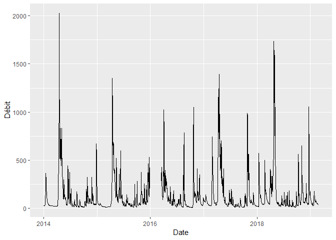<!-- -->

R comprend la fonction `as.Date()`, où l’argument `format` décrit la
manière avec laquelle la date est exprimée.

``` r
as.Date(x = "1999/03/29", format = "%Y/%m/%d")
```

    ## [1] "1999-03-29"

L’argument `x` peut aussi bien être une chaîne de caractères qu’un
vecteur où l’on retrouve plusieurs chaînes de caractères exprimant un
format de date commun. La fonction `as.Date()` permet ainsi de
transformer des caractères en date si `read_csv()` ne le détecte pas
automatiquement. Ce format peut prendre la forme désirée, dont les
paramètres sont listés sur la [page d’aide de la fonction
`strptime()`](https://rdrr.io/r/base/strptime.html). Toutefois, le plus
petit incrément de temps accepté par `as.Date()` est le jour:
`as.Date()` exclut les heures, minutes et secondes. Le module
[**`lubridate`**](https://lubridate.tidyverse.org/), issu du
*tidyverse*, permet quant à lui de manipuler avec plus de grâce les
formats de date standards, incluant les dates et les heures:
**`lubridate`** sera préféré dans ce chapitre.

    ## 
    ## Attaching package: 'lubridate'

    ## The following object is masked from 'package:base':
    ## 
    ##     date

    ## [1] "2011-02-19 09:14:00 UTC"

Plusieurs autres formats standards sont présentés sur un [aide-ménoire
de
**`lubridate`**](https://rawgit.com/rstudio/cheatsheets/master/lubridate.pdf).
Si vos données comprennent des formats de date non standard, vous
pourrez utiliser la fonction `as.POSIXlt()`, mais il pourrait être
préférable de standardiser les dates *a
priori*.


Le module **`lubridate`** rend possible l’extraction de la date
(`date()`), l’année (`year()`), le mois (`month()`), le jour de la
semaine (`wday()`), le jour julien (`yday()`), etc. pour plus d’options,
voir \[l’aide-mémoire de
**`lubridate`**\])(<https://rawgit.com/rstudio/cheatsheets/master/lubridate.pdf>).

``` r
date_1 <- ymd_hms("2019-03-14 09:14:00")
date_1 %>% date()
```

    ## [1] "2019-03-14"

``` r
date_1 %>% month()
```

    ## [1] 3

``` r
date_1 %>% yday()
```

    ## [1] 73

``` r
date_1 %>% wday()
```

    ## [1] 5

``` r
date_1 %>% seconds()
```

    ## [1] "1552554840S"

Ces extractions peuvent être utilisées dans des suites d’opération
(*pipelines*). Par exemple, si nous désirons obtenir le débit mensuel
moyen de la rivière Chaudière depuis 1990, nous pouvons créer une
nouvelle colonne `Year` et une autre `Month` avec la fonction
`mutate()`, effectuer un filtre sur l’année, regrouper par mois pour
obtenir le sommaire en terme de moyenne, puis lancer le graphique.

``` r
hydro_month <- hydro %>%
  mutate(Year = Date %>% year(),
         Month = Date %>% month()) %>%
  filter(Year >= 1990) %>%
  group_by(Month) %>%
  dplyr::summarise(MeanFlow = mean(`Débit`, na.rm = TRUE))

hydro_month %>%
  ggplot(aes(x=Month, y=MeanFlow)) +
  geom_line() +
  scale_x_continuous(breaks = 1:12) +
  expand_limits(y = 0)
```

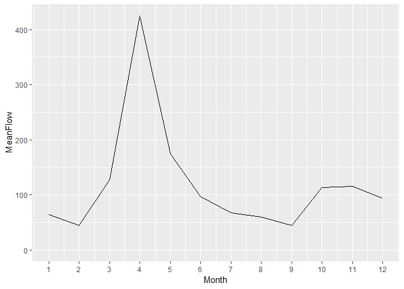<!-- -->

On pourra aussi agréger par moyenne mensuelle en gardant l’année
respective en créant une nouvelle colonne de date `YearMonth` qui
permettra le regroupement avec `group_by()`, puis créer plusieurs
facettes.

``` r
hydro %>%
  mutate(Year = Date %>% year(),
         Month = Date %>% month(),
         YearMonth = ymd(paste0(Year, "-", Month, "-01"))) %>%
  filter(Year >= 2010 & Year < 2018) %>%
  group_by(Year, YearMonth) %>%
  dplyr::summarise(`Débit` = mean(`Débit`, na.rm = TRUE)) %>%
  ggplot(aes(x=YearMonth, y=`Débit`)) +
  facet_wrap(~Year, scales = "free_x", ncol = 4) +
  geom_line() +
  expand_limits(y = 0)
```

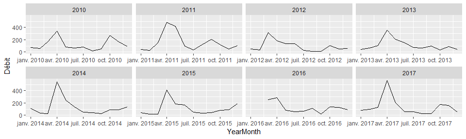<!-- -->

Il est possible d’effectuer des opérations mathématiques sur des données
temporelles. Par exemple, ajouter 10 jours à chaque date.

``` r
hydro %>%
  head(5) %>%
  mutate(DateOffset = Date + days(10))
```

    ## # A tibble: 5 x 5
    ##   Station Date       Débit Remarque DateOffset
    ##     <dbl> <date>     <dbl> <chr>    <date>    
    ## 1   23402 1915-02-27   538 MC       1915-03-09
    ## 2   23402 1915-02-28   377 MC       1915-03-10
    ## 3   23402 1915-03-01   269 MC       1915-03-11
    ## 4   23402 1915-03-02   345 MC       1915-03-12
    ## 5   23402 1915-03-03   269 MC       1915-03-13

Pour effectuer des opérations sur des incréments inférieurs aux jours,
il faut s’assurer que le type des données temporelles soit bien
`POSIXct`, et non pas `Date`.

``` r
hydro %>% pull(Date) %>% class()
```

    ## [1] "Date"

``` r
hydro <- hydro %>%
  mutate(Date = as_datetime(Date))
hydro %>% pull(Date) %>% class()
```

    ## [1] "POSIXct" "POSIXt"

``` r
hydro %>%
  head(5) %>%
  mutate(DateOffset = Date + seconds(10))
```

    ## # A tibble: 5 x 5
    ##   Station Date                Débit Remarque DateOffset         
    ##     <dbl> <dttm>              <dbl> <chr>    <dttm>             
    ## 1   23402 1915-02-27 00:00:00   538 MC       1915-02-27 00:00:10
    ## 2   23402 1915-02-28 00:00:00   377 MC       1915-02-28 00:00:10
    ## 3   23402 1915-03-01 00:00:00   269 MC       1915-03-01 00:00:10
    ## 4   23402 1915-03-02 00:00:00   345 MC       1915-03-02 00:00:10
    ## 5   23402 1915-03-03 00:00:00   269 MC       1915-03-03 00:00:10

## Analyse de séries temporelles

Tout comme c’est le cas de nombreux sujet couverts lors de ce cours,
l’analyse et modélisation de séries temporelles est un domaine d’étude
en soi. Nous allons nous restreindre ici aux séries temporelles
consignées à fréquence régulière. Les exemples d’analyses et
modélisation de séries temporelles sont typiquement des données
économiques, bien que les principes qui les guident sont les mêmes
qu’en d’autres domaines. Cette section est vouée à l’analyse, alors
que la prochaine est vouée à la modélisation.

Par exemple, voici une série temporelle économique typique, qui exprime
les dépenses mensuelles en restauration en Australie.

``` r
library("forecast")
```

    ## Registered S3 method overwritten by 'xts':
    ##   method     from
    ##   as.zoo.xts zoo

    ## Registered S3 method overwritten by 'quantmod':
    ##   method            from
    ##   as.zoo.data.frame zoo

    ## Registered S3 methods overwritten by 'forecast':
    ##   method             from    
    ##   fitted.fracdiff    fracdiff
    ##   residuals.fracdiff fracdiff

``` r
library("fpp2")
```

    ## Loading required package: fma

    ## Loading required package: expsmooth

``` r
data("auscafe")
autoplot(auscafe)
```

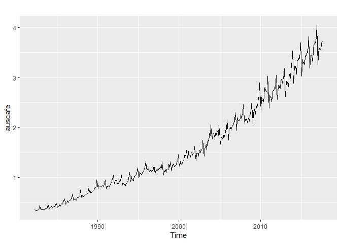<!-- -->

On y détecte une tendance générale, probablement propulsée par la
croissance de la démographie et des revenus, ainsi que des tendances
cycliques. On verra plus loin comment prédire des occurrences futures,
ainsi que l’incertitude de ces prédictions, à partir des données
consignées.

Jusqu’à présent, nous avons travaillé avec des tableaux de données
incluant une colonne en format date. Nous allons maintenant travailler
avec des séries temporelles telles que représentées en R.

### Créer et visualiser des séries temporelles

L’information consignée dans une série temporelle inclut nécessairement
un indice temporel associé à au moins une variable. En R, cette
information est consignée dans un objet de type `ts`, pour *time
series*. Prenons une mesure quelconque prise à chaque trimestre de
l’année 2018.

``` r
set.seed(96683)
date <- ymd(c("2018-01-01", "2018-04-01", "2018-07-01", "2018-10-01"))
mesure <- runif(length(date), 1, 10)
mesure_ts <- ts(mesure, start = date[1], frequency = 4)
mesure_ts
```

    ##           Qtr1     Qtr2     Qtr3     Qtr4
    ## 17532 7.175836 3.646285 6.631606 8.648371

L’argument `start` est la date de la première observation et `frequency`
est le nombre d’observations par unité temporelle, ici l’année.

J’ai auparavant recueilli des données météo avec **`weathercan`**
(dispobibles seulement depuis 1998) et fusionné avec le tableau `hydro`.
Pour accélérer la procédure, j’ai enregistré les données dans un fichier
RData. De facto, ne gardons que les données disponibles entre 1998 et
2008, ainsi que les colonnes désignant la date, le débit, les
précipitations totales et la température.

    ## Observations: 3,653
    ## Variables: 4
    ## $ Date         <date> 1998-01-01, 1998-01-02, 1998-01-03, 1998-01-04, ...
    ## $ Débit        <dbl> 15.70, 16.00, 17.40, 19.30, 23.20, 29.00, 58.85, ...
    ## $ total_precip <dbl> 1.6, 2.8, 2.2, 0.0, 5.8, 11.8, 2.4, 19.2, 11.6, 2...
    ## $ mean_temp    <dbl> -21.1, -8.9, 1.9, -3.2, -8.7, -8.0, -7.4, -6.3, -...

Pour créer une série temporelle de type `ts`, j’enlève la date, je
démarre au premier événement de 1998, et chaque incrément a une
fréquence de 1/365.25 unités depuis 1998 (il y a en moyenne 365.25
jours par an).

``` r
hydrometeo_ts <- ts(hydrometeo %>% select(-Date),
                    start = c(hydrometeo$Date[1] %>% year(), 1),
                    frequency = 365.25)
```

Le module **`ggplot2`** comprend la fonction `autoplot()`, pratique pour
visualiser les séries temporelles.

``` r
autoplot(hydrometeo_ts, facets = TRUE) +
  scale_x_continuous(breaks = 1998:2008)
```

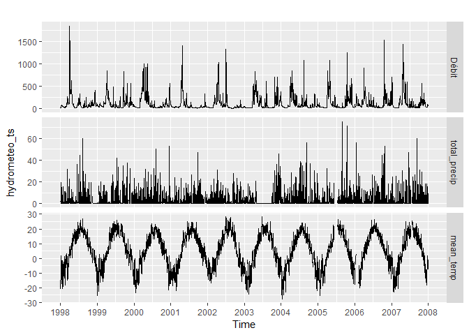<!-- -->

Il est possible de filtrer des séries temporelles en mode tidyverse.
Toutefois, il est plus simple d’utiliser la fonction de base
`windows()`. Disons, les 10 premiers jours de l’an 2000.

    ## Time Series:
    ## Start = 2000.00136892539 
    ## End = 2000.02600958248 
    ## Frequency = 365.25 
    ##          Débit total_precip mean_temp
    ## 2000.001 42.40          9.4      -5.6
    ## 2000.004 40.70          0.0      -5.5
    ## 2000.007 43.60         23.5      -0.9
    ## 2000.010 49.04          0.0      -8.8
    ## 2000.012 58.90          0.0     -12.9
    ## 2000.015 49.10          1.2      -4.6
    ## 2000.018 44.40          3.8     -10.5
    ## 2000.021 40.60          6.8      -4.9
    ## 2000.023 38.10          7.0      -2.3
    ## 2000.026 36.50         12.9      -0.3

Voyons l’évolution des débits mensuelles.

``` r
hydrometeo_monthly <- hydrometeo %>%
  mutate(Year = Date %>% year(),
         Month = Date %>% month(),
         YearMonth = ymd(paste0(Year, "-", Month, "-01"))) %>%
  group_by(Year, YearMonth) %>%
  dplyr::summarise(`Débit` = mean(`Débit`, na.rm = TRUE),
                   total_precip = sum(total_precip, na.rm = TRUE), # somme
                   mean_temp = mean(mean_temp, na.rm = TRUE)) # moyenne
hydrometeo_monthly_ts <- ts(hydrometeo_monthly %>% ungroup() %>% select(`Débit`, total_precip, mean_temp), start = c(1998, 1), frequency = 12)
```

Contraignons la période grâce à `window()`, puis visualisons les
tendances cycliques avec `forecast::ggseasonplot()` et
`forecast::ggsubseriesplot()`. Notez que j’utilise la fonction
`cowplot::plot_grid()` pour arranger différents graphiques ggplot2 en
une grille.

``` r
library("cowplot")
```

    ## 
    ## Attaching package: 'cowplot'

    ## The following object is masked from 'package:ggplot2':
    ## 
    ##     ggsave

``` r
theme_set(theme_grey()) # cowplot change le theme
ggA <- ggseasonplot(window(hydrometeo_monthly_ts[, 1], 1998, 2004-1/365.25)) + ggtitle("")
ggB <- ggseasonplot(window(hydrometeo_monthly_ts[, 1], 1998, 2004-1/365.25), polar = TRUE) + ggtitle("")
ggC <- ggsubseriesplot(window(hydrometeo_monthly_ts[, 1], 1998, 2004-1/365.25), polar = TRUE) + ggtitle("") + labs(y="Flow")
plot_grid(ggA, ggB, ggC, ncol = 3, labels = c("A", "B", "C"))
```

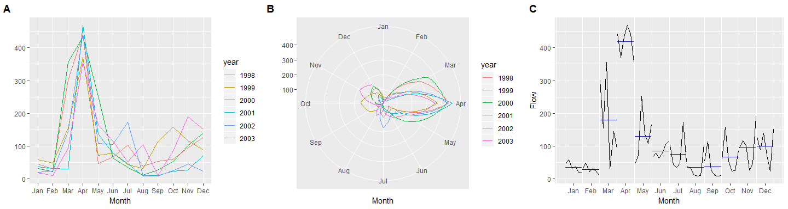<!-- -->

### Structures dans les séries temporelles

Les séries temporelles sont susceptibles d’être caractérisées par des
structures communément observées.

  - La **tendance** est une structure décrivant la hausse ou la baisse à
    *long terme* d’une variable numérique.
  - La **fluctuation saisonnière** est une structure périodique, qui
    oscille autour de la tendance générale de manière régulière selon le
    calendrier.
  - La **fluctuation cyclique** est aussi une structure périodique, mais
    irrégulière (par exemple, les oscillations peuvent durer parfois 2
    ans, parfois 3). Les fluctuations cycliques sont souvent de plus
    longue fréquence que les fluctuations saisonnières, et leur
    irrégularité rend les prédictions plus difficiles.

**Note**. Une tendance détectée sur une période de temps trop courte
peut s’avérer être une fluctuation.

La figure @ref(fig:trend) montre différentes structures. La figure
@ref(fig:trend)A montre une tendance croissante des dépenses mensuelles
en restauration en Australie, ainsi que des fluctuations saisonnières.
La figure @ref(fig:trend)B montre des fluctuations saisonnières des
températures quotidiennes moyennes à l’Université Laval, sans présenter
de tendance claire. La figure @ref(fig:trend)C montre des fluctuations
cycliques du nombre de lynx trappés par année au Canada de 1821 à 1934,
sans non plus présenter de tendance claire. Les cycles sont conséquents
des mécanismes de dynamique des populations (plus de proie entraîne plus
de prédateur, plus de prédateur entraîne moins de proie, moins de proie
entraîne moins de prédateur, moins de prédateur entraîne plus de proie,
etc.), que nous couvrirons au chapitre @ref(chapitre-ode).

``` r
data("lynx")
plot_grid(autoplot(auscafe),
          autoplot(hydrometeo_ts[, 3]) + labs(y="Mean temperature"),
          autoplot(lynx),
          ncol = 3,
          labels = c("A", "B", "C"))
```


Il est possible que l’on retrouve une hiérarchie dans les fluctuations,
c’est-à-dire que de grandes fluctuations (saisonnières ou cycliques)
peuvent contenir des fluctuations sur des incréments de temps plus
petits.

### L’autocorrélation

Lorsque les données présentes des fluctuations (saisonnières ou
cycliques), le graphique d’autocorrélation montrera un sommet aux étapes
des cycles ou des saisons. Le graphique d’autocorrélation de données
aléatoires (aussi appelées *bruit blanc*) montera des sommets sans
signification.

Un graphique de retardement (*lag plot*) met successivement en relation
\(y_t\) avec \(y_{t-p}\). Un graphique d’autocorrélation est la
corrélation entre \(y_t\), \(y_{t-1}\), \(y_{t-2}\), etc. Une graphique
de retardement donne un aperçu de la dépendance d’une variable selon ses
valeurs passées. Les graphiques de retardement de données ayant une
forte tendance présenteront des points près de la diagonale, tandis que
ceux montrant des données fluctuantes de type sinusoïdal présenteront
des points disposés de manière circulaire. Des données aléatoires, quant
à elles, ne présenteront pas de structure de retardement facilement
identifiable.

``` r
set.seed(64301)
bruit_blanc <- ts(runif(114, 0, 6000), start = c(1821, 1), frequency = 1)

plot_grid(autoplot(lynx) + ggtitle("Lynx: Série temporelle"),
          ggAcf(lynx) + ggtitle("Lynx: Autocorrélation"),
          gglagplot(lynx) + ggtitle("Lynx: Lag plot"),
          autoplot(bruit_blanc) + ggtitle("Bruit blanc: Série temporelle"),
          ggAcf(bruit_blanc) + ggtitle("Bruit blanc: Autocorrélation"),
          gglagplot(bruit_blanc) + ggtitle("Bruit blanc: Lag plot"),
          ncol = 3)
```

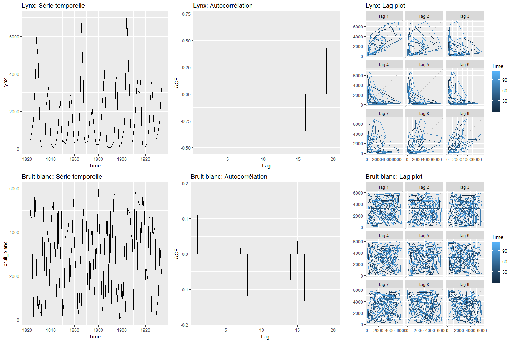<!-- -->

**Exercice**. Créez, puis interprétez des graphiques `autoplot()`,
`ggAcf()` et `gglagplot()` pour les données `auscafe`.

**Exercice**. Trouvez le graphique d’autocorrélation et le graphique de
retardement correspondant à chaque série
temporelle.


Réponse, voir `source("lib/09_exercice-hydrometeo.R")`: - `Débit`: A-B-C
- `total_precip`: B-A-A - `mean_temp`: C-C-B

### Signification statistique d’une série temporelle

J’ai précédemment introduit la notion de bruit blanc, qui est un signal
ne contenant pas de structure, comme le grésillement d’une radio mal
syntonisée. Nous avons vu au chapitre @ref(chapitre-biostats) que les
tests d’hypothèse en statistiques fréquentielles visent entre autre à
détecter la probabilité que les données soient générées par une
distribution dont la tendance centrale est nulle. De même, pour les
séries temporelles, il est possible de calculer la probabilité qu’un
signal soit un bruit blanc. Deux outils peuvent nous aider à effectuer
ce test: l’un visuel, l’autre sous forme de calcul.

Le graphique d’autocorrélation est à même d’inclure des seuils pour
lesquels la corrélation est significative (lignes pointillées
bleues).

``` r
ggAcf(lynx, ci = 0.95) + ggtitle("Lynx: Autocorrélation")
```

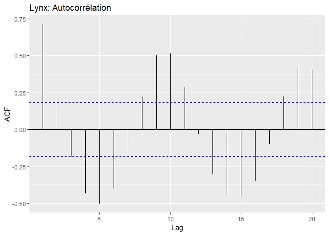<!-- -->

L’analyse des seuils de signification de l’autocorrélation indique sur
la possibilité de conduire la série temporelle vers un processus de
modélisation prédictive. Dans l’exemple ci-dessus, on remarque qu’il
existe des corrélations significatives pour un décalage de 4 à 6
données, mais que les données situées près les unes des autres
pourraient être plus difficiles à modéliser.

Le test de Ljung-Box permet quant à lui de tester si la série temporelle
entière peut être différenciée d’un bruit blanc.

``` r
Box.test(lynx, lag = 20, type = "Ljung-Box")
```

    ## 
    ##  Box-Ljung test
    ## 
    ## data:  lynx
    ## X-squared = 365.54, df = 20, p-value < 2.2e-16

La probabilité que la série soit un bruit blanc est presque nulle.

Notons que les tests statistiques sont aussi valides sur les dérivées
des séries temporelles. En outre, une dérivée première de la série
temporelle sur les dépenses devient une série temporelle de la variation
des dépenses en
restauration.

``` r
plot_grid(autoplot(diff(auscafe)) + ggtitle("Restauration: Série temporelle"),
          ggAcf(diff(auscafe)) + ggtitle("Restauration: Autocorrélation"),
          gglagplot(diff(auscafe)) + ggtitle("Restauration: Lag plot"),
          ncol = 3)
```

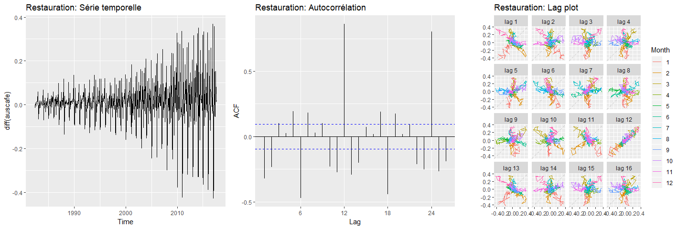<!-- -->

``` r
Box.test(diff(auscafe), lag = 16, type = "Ljung-Box")
```

    ## 
    ##  Box-Ljung test
    ## 
    ## data:  diff(auscafe)
    ## X-squared = 647.11, df = 16, p-value < 2.2e-16

Jusqu’à présent, nous nous sommes contentés d’observer des séries
temporelles. Lançons-nous maintenant dans un domaine plus excitant.


Source: Scène de Back to the future, Robert Zemeckis et and Bob Gale,
1985

## Modélisation de séries temporelles

L’objectif général de la modélisation de série temporelle est la
prévision (*forecast*). La majorité des modèles se base sur des
simulations de futurs possibles, desquels on pourra déduire une tendance
centrale (*point forecast*) ainsi que des intervalles prévisionnels. Il
est important d’insister sur le fait que la tendance centrale ne
signifie pas que les données futures suivront cette tendance, mais que,
selon les données et le modèle, la moitié des données devrait se
retrouver sous la ligne, et l’autre moitié au-dessus. De plus, la région
de confiance définie par les intervalles prévisionnels signifient que
par exemple 95% des points devraient se situer dans cette région.

Une manière d’évaluer la performance d’une prévision est de prévoir des
données auparavant observées à partir des données qui les précèdent. Ces
valeurs sont dites *lissées*. Tout comme c’est le cas en régression
statistique, il est possible de déduire les résidus du modèle. Pour les
régressions couvertes au chapitre @ref(chapitre-biostats), nous
vérifions la validité du modèle en vérifiant si les résidus étaient
distribuées normalement. Pour une série temporelle, on tend plutôt à
vérifier si les résidus forment un bruit blanc, c’est-à-dire qu’ils ne
sont pas corrélés. De plus, pour éviter d’être biaisées, leur moyenne
doit être de 0. De manière complémentaire pour la validité des
intervalles prévisionnels, mais non essentielle à la validité du modèle,
les résidus devraient être distribués normalement et leur variance
devrait être constante ([Hyndman et
Athanasopoulos, 2018](https://otexts.com/fpp2/)).

Il est possible qu’un modèle remplisse toutes ces conditions, mais que
sa prévision soit médiocre. Comme nous le verrons également au chapitre
@ref(chapitre-ml), une prédiction ou une prévision issue d’un modèle ne
peut pas être évaluée sur des données qui ont servies à lisser le
modèle. **Pour vérifier une prévision temporelle, il faut séparer les
données en deux séries: une série d’entraînement et une série de test**
(figure
@ref(fig:train-test)).


La séparation dans le temps entre la série d’entraînement et la série de
test se fait à votre convenance, selon la disponibilité des données.
Vous aurez toutefois avantage à conserver davantage de données en
entraînement (typiquement, 70%), et à tout le moins, séparer au moins
une fluctuation saisonnière ou cyclique. La série d’entraînement servira
à lisser le modèle pour en découvrir les possibles structures. La série
de test servira à évaluer sa performance sur des données obtenues, mais
inconnues du modèle pour vérifier les structures découvertes par le
modèle. L’erreur prévisionnelle est la différence entre une donnée
observée en test et sa prévision (l’équivalent des résidus, mais
appliqués sur des données indépendantes du modèle). La performance
d’une prévision peut être évaluée de différentes manières, mais
l’erreur moyenne absolue échelonnée (*mean absolute scaled error*,
MASE) est conseillée puisqu’elle ne dépend pas de la métrique de la
quantité produite: plus la MASE se rapproche de zéro, meilleure est la
prévision.

Plusieurs méthodes de prévision sont possibles. Nous en couvrirons 3
dans ce chapitre: la méthode naïve, la méthode SES et la méthode ARIMA.
Nous allons couvrir les différents aspects de la modélisation des séries
temporelles à travers l’utilisation de ces méthodes.

### Méthode naïve

La méthode naïve définit la valeur suivante selon la valeur précédente
(fonction `forecast::naive()`), ou la valeur de la saison précédente
(fonction `forecast::snaive()`). Ces fonctions du module **`forecast`**
incluent un composante aléatoire pour simuler des occurrences futures
selon des marches aléatoires (*random walks*), où chaque valeur suivante
est simulée aléatoirement, considérant la valeur précédente.

Nous tenterons de prévoir les débits de la rivière Chaudière. Ceux-ci
étant caractérisé par des fluctuations saisonnières, mieux vaut
utiliser `snaive()`. Mais auparavant, séparons la série en série
d’entraînement et série de test.

``` r
flow_ts <- hydrometeo_monthly_ts[, 1]
flow_ts_train <- window(flow_ts, start = 1998, end = 2005.999)
flow_ts_test <- window(flow_ts, start = 2006)
```

Lançons la modélisation sur les données d’entraînement.

``` r
hm_naive <- snaive(flow_ts_train, h = 24)
autoplot(hm_naive) +
  autolayer(fitted(hm_naive)) +
  autolayer(flow_ts_test, color = rgb(0, 0, 0, 0.6)) +
  labs(x = "Année", y = "Débit")
```

    ## Warning: Removed 12 rows containing missing values (geom_path).

<!-- -->

Le graphique précédent montre que la prévision naïve (en rose) prend
bien la valeur observée au cycle précédent (en noir). Les données de
test sont en gris transparent. Notons que la présence de débit négatifs
pourrait être évitée en utilisant une transformation logarithmique du
débit préalablement à la modélisation.

Voyons maintenant l’analyse des résidus avec la fonction
`forecast::checkresiduals()`.

``` r
checkresiduals(hm_naive)
```

<!-- -->

    ## 
    ##  Ljung-Box test
    ## 
    ## data:  Residuals from Seasonal naive method
    ## Q* = 34.903, df = 19, p-value = 0.01435
    ## 
    ## Model df: 0.   Total lags used: 19

La `p-value` étant de 0.01546, il est peu probable que les résidus
forment un bruit blanc. Les résidus contiennent de l’autocorrélation, ce
qui devrait être évité. Ceci est toutefois dû à un seul point allant
au-delà du seuil de 0.05, que l’on peut observer sur le graphique
d’autocorrélation. Le graphique de la distribution des résidus montre
des valeurs aberrantes, ainsi qu’une distribution plutôt pointue, qui
donnerait un test de Kurtosis probablement élevé.

``` r
shapiro.test(residuals(hm_naive)) # non-normal si p-value < seuil (0.05)
```

    ## 
    ##  Shapiro-Wilk normality test
    ## 
    ## data:  residuals(hm_naive)
    ## W = 0.93698, p-value = 0.0004733

``` r
library("e1071")
kurtosis(residuals(hm_naive), na.rm = TRUE) # le résultat d'un test de kurtosis sur une distribution normale devrait être de 0.
```

    ## [1] 2.909277

Pas de panique, les prédictions peuvent néanmoins être valides:
seulement, les intervalles prévisionnels pourraient être trop vagues ou
trop restreintes: à prendre avec des pincettes.

L’évaluation du modèle peut être effectuée avec la fonction
`forecast::accuracy()`, qui détecte automatiquement la série
d’entraînement et la série de test si on lui fournit la série entière
(ici l’objet
    `flow_ts`).

``` r
accuracy(hm_naive, flow_ts)
```

    ##                      ME     RMSE      MAE        MPE     MAPE     MASE
    ## Training set  0.5952819 80.24256 54.53431 -57.045415 95.60936 1.000000
    ## Test set     -1.0165543 75.18877 57.10499  -2.645333 59.10844 1.047139
    ##                       ACF1 Theil's U
    ## Training set  0.1669526053        NA
    ## Test set     -0.0006850245 0.3877041

La méthode naïve est rarement utilisée en pratique autrement que comme
standard par rapport auquel la performance d’autres modèles est évaluée.

### Méthode SES

Alors que la méthode naïve donne une crédibilité complète à la valeur
précédente (ou au cycle précédent), la méthode SES (*simple exponential
smoothing*) donne aux valeurs précédentes des poids exponentiellement
décroissants selon leur ancienneté. La prévision par SES sera une
moyenne pondérée des dernières observations, en donnant plus de poids
sur les observations plus rapprochées.

Mathématiquement, la méthode SES est décrite
ainsi.

\[\hat{y}_{t + h|t} = \alpha y_t + \alpha\left( 1-\alpha \right) y_{t-1} + \alpha\left( 1-\alpha \right)^2 y_{t-2} + ...\]

où \(\hat{y}_{t + h|t}\) est la prévision de \(y\) au temps \(t + h|t\),
qui est le décalage de \(h\) à partir de la dernière mesure au temps
\(t\). Le paramètre \(\alpha\) prend une valeur de 0 à 1, et décrit la
distribution des poids. Une valeur de \(\alpha\) élevé donnera davantage
de poids aux événements récents. La somme de tous poids \(\alpha\) tend
vers 1 lorsque les pas de temps précédents tendent vers
l’\(\infty\).

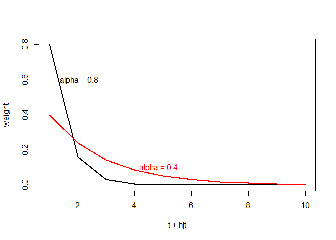<!-- -->

Une autre manière d’exprimer l’équation est de la segmenter en deux: une
pour la prévision en fonction du niveau (*level*, le modèle), une autre
pour décrire comment le niveau change au fil du
temps.

| Description | Équation                                                     |
| ----------- | ------------------------------------------------------------ |
| Prévision   | \(\hat{y}_{t + h|t} = l_t\)                                  |
| Niveau      | \(l_t = \alpha y_t + \alpha\left( 1-\alpha \right) l_{t-1}\) |

Exprimée ainsi, la prévision n’exprimera aucune tendance ni fluctuation.
Il s’agira d’une projection jusqu’à l’infini de la moyenne des
observations précédentes pondérée par leur décalage.

#### SES de base

Prenons les [données de la
NASA](https://data.giss.nasa.gov/gistemp/graphs/graph_data/Global_Mean_Estimates_based_on_Land_and_Ocean_Data/graph.txt)
sur l’indice de température terre-océan, qui décrit un décalage par
rapport à la moyenne des températures globales observées entre de 1951 à
1980. La méthode SES est appelée par la fonction `forecast::ses()`, de
la même manière qu’on l’a fait précédemment avec la méthode
naïve.

``` r
loti_ts <- read_csv("data/09_nasa.csv") %>% pull(LOTI) %>% ts(., start = 1880, frequency = 1)
#loti_ts <- window(loti_ts, start = 1950)
loti_ts_tr <- window(loti_ts, end = 2004)
loti_ses <- ses(loti_ts_tr, h = 20, alpha = 0.5)
autoplot(loti_ses) + autolayer(fitted(loti_ses))
```

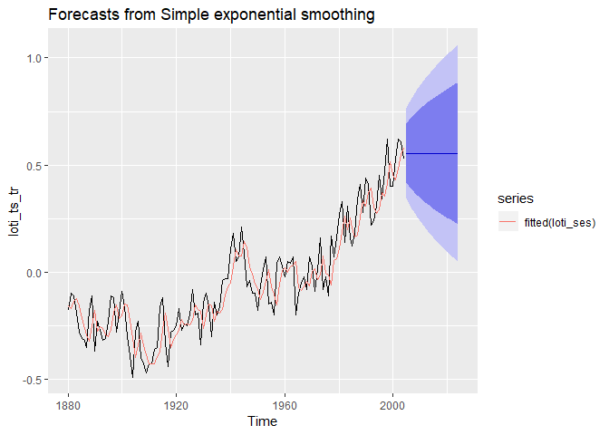<!-- -->

> **Note**. Les prévisions climatiques sont effectuées par des modèles
> bien plus complexes que ce que nous voyons ici. Les prévisions du GIEC
> agrègent des tendances localisées et incluent une batterie de
> covariables, dont la plus évidente est la concentration en CO2 dans
> l’atmosphère. Il s’agit seulement d’un exemple d’application.

#### SES avec tendance

La prévision a peu d’intérêt, étant donnée qu’elle n’inclut pas de
tendance. Or, nous pouvons en ajouter une à l’équation. Ainsi exprimée,
la tendance changera aussi au fil du
temps.

| Description | Équation                                                                             |
| ----------- | ------------------------------------------------------------------------------------ |
| Prévision   | \(\hat{y}_{t + h|t} = l_t + \left( \phi + \phi^2 + ... + \phi^h \right) \times b_t\) |
| Niveau      | $l\_t = y\_t + ( 1-) ( l\_{t-1} + b\_{t-1} ) $                                       |
| Tendance    | \(b_t = \beta^* \left( l_t - l_{t-1} \right) + (1-\beta^*) \phi b_{t-1}\)            |

Le paramètre \(\beta^*\) décrit la vitesse à laquelle la tendance peut
changer, de 0 où la pente ne change pas à 1 où la pente change
rapidement. Le paramètre \(\phi\) adouci la pente en s’éloignant de la
dernière mesure. Un tendant vers 0 générera un fort adoucissement, alors
qu’un tendant vers 1 ne générera pas d’adoucissement. Il peut être
difficile de déterminer les paramètres de lissage \(\alpha\),
\(\beta^*\) et \(\phi\), ainsi que les paramètres d’état \(l_0\) et
\(b_0\). La fonction de `forecast::holt()` permet de les estimer
automatiquement.

``` r
loti_holt_dF <- holt(loti_ts_tr, damped = FALSE, h = 100)
loti_holt_dT <- holt(loti_ts_tr, damped = TRUE, h = 100)
plot_grid(autoplot(loti_holt_dF), autoplot(loti_holt_dT))
```

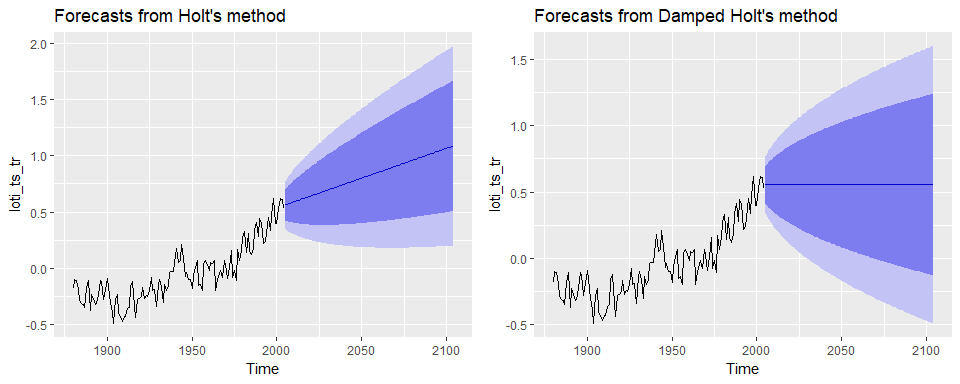<!-- -->

``` r
loti_holt_dF$model$par
```

    ##         alpha          beta             l             b 
    ##  0.4052862918  0.0001000051 -0.2170967540  0.0052550677

``` r
loti_holt_dT$model$par
```

    ##         alpha          beta           phi             l             b 
    ##  0.4843654438  0.0001000061  0.8286096396 -0.1096315698 -0.0332523695

Dans ce cas, l’optimisation de \(\phi\) lui donne une valeur de 0.8, une
valeur suffisamment faible pour que l’adoucissement soit fort. Vous
obtiendrez une valeur de \(\phi\) plus élevée en ne considérant que les
données obtenues depuis 1950 (en décommentant `loti_ts <-
window(loti_ts, start = 1950)`, plus haut).

#### SES avec fluctuation saisonnière

D’autres paramètres peuvent être ajoutés pour de tenir compte des
fluctuations saisonnières (les fluctuations cycliques sont plus
difficiles à modéliser) de manière additive ou multiplicative. Voici la
modification apportée pour la modélisation additive, en laissant tomber
l’adoucissement.

| Description | Équation                                                                     |
| ----------- | ---------------------------------------------------------------------------- |
| Prévision   | \(\hat{y}_{t + h|t} = l_t + h \times b_t + s_{t-m+h_m^+}\)                   |
| Niveau      | $l\_t = (y\_t - s\_{t-m} ) + ( 1-) ( l\_{t-1} + b\_{t-1} ) $                 |
| Tendance    | \(b_t = \beta^* \left( l_t - l_{t-1} \right) + (1-\beta^*) b_{t-1}\)         |
| Saison      | \(s_t = \gamma \left( y_t - l_{t-1} - b_{t-1} \right) + (1-\gamma) s_{t-m}\) |

où \(m\) est la périodicité des fluctuations saisonnière, par exemple 4
pour quatre saisons annuelles et \(\gamma\) est un paramètre de la
portion saisonnière, qui, tout comme un effet aléatoire en
biostatistiques, fluctue autour de zéro. La variante multiplicative
multiplie la prévision par un facteur plutôt que d’imposer un décalage.
La mathématique n’est pas présentée ici pour plus de simplicité
(consulter [Hyndman et Athanasopoulos (2018),
chapitre 7.3](https://otexts.com/fpp2/holt-winters.html) pour plus de
détails). Dans le cas multiplicatif, l’effet saisonnier fluctue autour
de 1. Si l’amplitude de la fluctuation s’accroît au fil de la série
temporelle, la méthode multiplicative donnera probablement de meilleurs
résultats.

La fonction que nous utiliserons pour les SES-saisonniers est
`forecast::hw()`. Les données de la NASA ne sont pas saisonnières
(`frequency(loti_ts)` donne
1).

``` r
flow_hw <- hw(flow_ts_train, damped = TRUE, h = 12*3, seasonal = "additive")
autoplot(flow_hw) + autolayer(fitted(flow_hw))
```

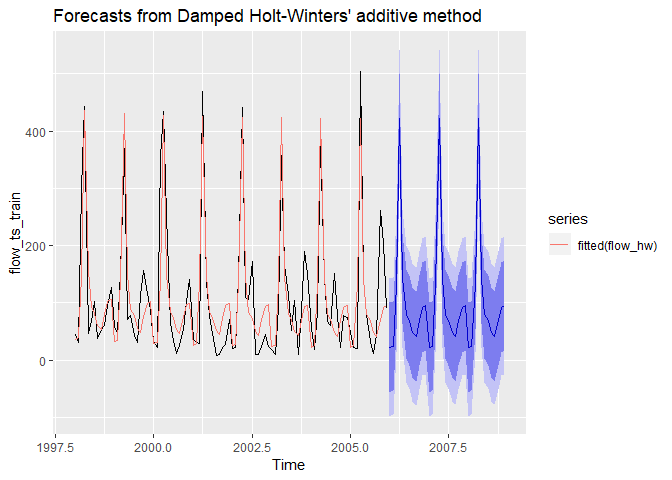<!-- -->

#### Automatiser la prévision avec les SES

L’erreur du modèle peut aussi être calculée de sorte qu’elle soit
constante ou augmente selon le niveau (ou décalage). Nous avons donc
plusieurs types de modèles de la famille SES.

  - Tendance: \[sans tendance, tendance additive, tendance adoucie\]
  - Saison: \[sans saison, saison additive, saison multiplicative\]
  - Erreur: \[erreur additive, erreur multiplicative\]

Lequel choisir? Encore une fois, on peut laisser R optimiser notre choix
avec un modèle ETS (*error, tend and seasonnal*). L’optimisation est
lancée avec la fonction `forecast::ets()`.

``` r
flow_model <- ets(flow_ts_train)
flow_model
```

    ## ETS(M,N,M) 
    ## 
    ## Call:
    ##  ets(y = flow_ts_train) 
    ## 
    ##   Smoothing parameters:
    ##     alpha = 0.0104 
    ##     gamma = 1e-04 
    ## 
    ##   Initial states:
    ##     l = 127.508 
    ##     s = 0.6511 0.9399 0.7981 0.4272 0.6253 0.8872
    ##            0.6594 1.2741 3.7317 1.5211 0.1878 0.2971
    ## 
    ##   sigma:  0.6065
    ## 
    ##      AIC     AICc      BIC 
    ## 1222.469 1228.469 1260.935

Le modèle retenu est un `ETS(M,N,M)`, définissant dans l’ordre le type
d’erreur, de tendance et de saison selon `A` pour additif, `M` pour
multiplicatif et `N` pour l’absence. Nous avons une erreur de type `M`
(multiplicative), une tendance de type `N` (sans tendance) et une saison
de type `M` (multiplicative). L’absence de valeur pour `phi` indique que
l’adoucissement n’est probablement pas nécessaire.

Nous pouvons visualiser l’évolution des différentes
composantes.

``` r
autoplot(flow_model)
```

<!-- -->

Dans un modèle sans tendance, avec saisonnalité multiplicative, les
données *levels* sont multipliées par les données *season* pour obtenir
la prévision. Malgré l’absence de tendance dans le modèle, il semble que
le débit a diminué de 2000 à 2003 entre deux états stables de 1998 à
2000 et de 2003 à 2006.

La fonction `forecast::ets()` génère un modèle, mais pas de prédiction.
Pour obtenir une prédiction, nous devons utiliser la fonction
`forecast::forecast()`, que j’utiliserai ici en mode *tidyverse*.

``` r
flow_ets <- flow_ts_train %>% ets()
flow_fc <- flow_ets %>% forecast()
flow_fc %>% autoplot()
```

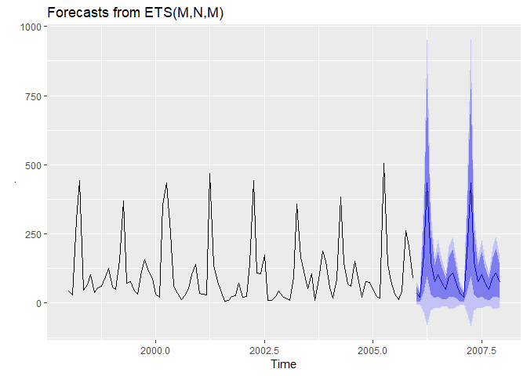<!-- -->

L’analyse d’exactitude et celle des résidus sont toutes aussi
pertinentes. La première est effectuée sur la prévision, et la seconde
sur le
    modèle.

``` r
accuracy(flow_fc, flow_ts)
```

    ##                      ME     RMSE      MAE       MPE      MAPE      MASE
    ## Training set -13.346098 59.33195 44.55719 -90.26010 110.68741 0.8170487
    ## Test set       3.768712 69.95479 55.55668 -24.65164  62.94846 1.0187472
    ##                   ACF1 Theil's U
    ## Training set 0.1612394        NA
    ## Test set     0.2452020 0.6990499

``` r
checkresiduals(flow_ets)
```

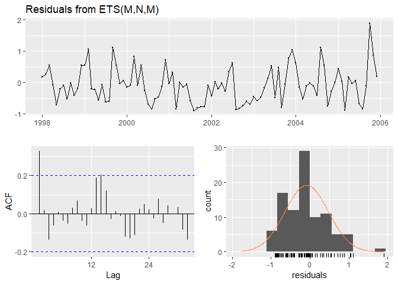<!-- -->

    ## 
    ##  Ljung-Box test
    ## 
    ## data:  Residuals from ETS(M,N,M)
    ## Q* = 27.068, df = 5, p-value = 5.533e-05
    ## 
    ## Model df: 14.   Total lags used: 19

Il est peu probable que les résidus aient été générés par un bruit
blanc, indiquant qu’il existe une structure dans les données qui n’a pas
été capturée par le modèle.

**Exercice**. Modéliser la série temporelle `lynx` avec
`forecast::ets()`. Que se passe-t-il?

#### Prétraitement des données

J’ai spécifié plus haut que les données de débit pourraient
avantageusement être transformées avec un logarithme pour éviter les
prédictions de débits négatifs. D’autres types de transformation
peuvent être utilisées, comme la racine carrée ou cubique, l’opposée de
l’inverse (\(-1/x\)) ou les transformations compositionnelles (chapitre
@ref(chapitre-explorer)). La transformation Box-Cox est aussi largement
utilisée pour sa polyvalence.

\[
w =
\begin{cases}
ln(y_t) &\text{if } \lambda = 0 \\
\frac{y_t - 1}{\lambda} &\text{if } \lambda \neq 0
\end{cases}
\]

\(\lambda = 1\): pas de transformation \(\lambda = 1/2\): ressemble à
\(\sqrt{y_t}\) \(\lambda = 1/3\): ressemble à \(\sqrt[3]{y_t}\)
\(\lambda = 0\): log naturel \(\lambda = -1\): ressemble à \(1/y_t\)

La fonction `forecast::BoxCox.lambda()` estime la valeur optimale de
\(\lambda\).

``` r
BoxCox.lambda(flow_ts_train)
```

    ## [1] 0.784101

Cette valeur peut être imputée à l’argument `lambda` de la fonction
`forecast::ets()`. Dans notre cas, nous désirions plutôt une
transformation logarithmique. Conséquemment, nous utilisons `lambda
= 0`.

``` r
flow_ts_train %>%
  ets(lambda = 0) %>%
  forecast() %>%
  autoplot()
```

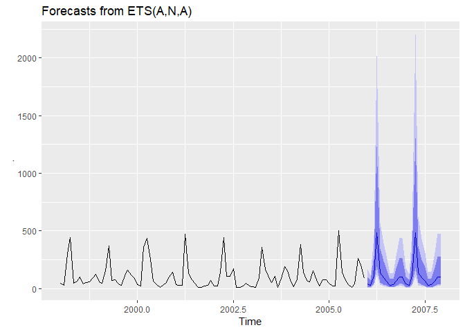<!-- -->

Les erreurs ne franchissent pas le 0, mais sont vraisemblablement
surestimées lors des sommets. Notez que R s’occupe de la transformation
retour.

La **différenciation** est aussi une forme de prétraitement. La
différenciation (fonction `base::diff()`) consiste en la soustraction
de la valeur précédente à la valeur suivante. La valeur précédente peut
être décalée à la valeur de la période de l’unité temporelle
précédente, par exemple le mois de mars de l’année précédente. Un
objectif de la différenciation est de rendre la série temporelle
stationnaire en termes de tendance et de fluctuation saisonnière, de
sorte que la série différenciée se comporte comme un bruit blanc.

``` r
plot_grid(flow_ts_train %>% autoplot() + ggtitle("Débit"),
          loti_ts_tr %>% autoplot() + ggtitle("LOTI"),
          flow_ts_train %>% diff(., lag = 12) %>% autoplot() + ggtitle("Débit avec différenciation saisonnière"),
          loti_ts_tr %>% diff(., lag = 1) %>% autoplot() + ggtitle("LOTI avec différenciation d'ordre 1"))
```

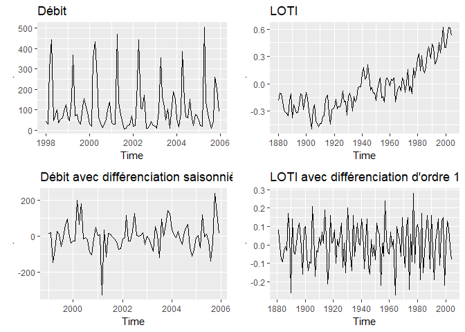<!-- -->

### La méthode ARIMA

Un modèle ARIMA, l’acronyme de l’anglais *auto-regressive integrated
moving average*, est une combinaison de trois parties: AR-I-MA.
L’**autorégression** consiste en une régression linéaire dont la
variable réponse \(y_t\) est la variable à l’instant \(t\) et les
variables explicatives sont les variables aux instants précédents. Pour
un nombre \(p\) de périodes précédentes, nous obtenons une régression
linéaire
typique.

\[y_t = c + \phi_1 y_{t-1} + \phi_2 y_{t-2} + ... + \phi_p y_{t-p} + \epsilon_t\]
où \(\epsilon_t\) est l’erreur sur la prédiction.

La partie concernant la **moyenne mobile** est une régression non pas
sur les observations, mais sur les erreurs. Considérant les \(q\)
erreurs précédentes, nous
obtenons

\[y_t = c + \theta_1 \epsilon_{t-1} + \theta_2 \epsilon_{t-2} + ... + \theta_q \epsilon_{t-q} + \epsilon_t\]

La somme de l’autorégression et de la moyenne mobile donne un modèle
ARMA. Le I de ARIMA, mis pour *integrated*, est le contraire de la
différenciation, que j’ai présenté à la fin de la section sur les SES.
Puisque la série temporelle doit être stationnaire pour effectuer
l’ARMA, nous devons différencier la série un nom \(d\) de fois avant
de procéder à l’autorégression et au calcul de la moyenne mobile.

Nous obtenons ainsi une ARIMA d’ordres \(p\), \(d\) et \(q\), notée
\(ARIMA(p,d,q)\). Nous devons aussi statuer si \(c\) (l’intercept ou le
*drift*) doit être ou non considéré come nul. Ces ordres peuvent être
spécifiés dans la fonction telle que `forecast::Arima(order =
c(0, 1, 1), include.constant = TRUE)`. Toutefois, il est possible de les
optimiser grâce à la fonction `forecast::auto.arima()`. Tout comme les
sorties de `forecast::ets()`, `forecast::auto.arima()` fourni le modèle,
mais pas les prédictions: la fonction `forecast::forecast()` doit être
lancée pour obteir la prédiction.

``` r
loti_arima <- loti_ts_tr %>% auto.arima()
loti_arima %>% forecast(h = 30) %>% autoplot()
```

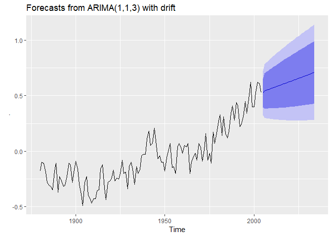<!-- -->

``` r
summary(loti_arima)
```

    ## Series: . 
    ## ARIMA(1,1,3) with drift 
    ## 
    ## Coefficients:
    ##           ar1     ma1      ma2      ma3   drift
    ##       -0.9405  0.6260  -0.6019  -0.3716  0.0060
    ## s.e.   0.0522  0.0976   0.0847   0.0846  0.0031
    ## 
    ## sigma^2 estimated as 0.01036:  log likelihood=109.53
    ## AIC=-207.06   AICc=-206.35   BIC=-190.14
    ## 
    ## Training set error measures:
    ##                         ME       RMSE       MAE      MPE     MAPE
    ## Training set -0.0007946749 0.09932376 0.0824145 22.62973 65.41129
    ##                   MASE       ACF1
    ## Training set 0.8925238 -0.0221428

Le sommaire du modèle spécifie une \(ARIMA(1,1,3)\) en utilisant
l’intercept \(c\) (*with drift*).

Lorsque l’on compte prédire des séries saisonnières, nous devons ajouter
un nouveau jeu d’ordres \((P,D,Q)m\), où \(P\), \(D\) et \(Q\) sont
équivalents à leurs minuscules, mais portent sur des décalages
saisonniers et non pas des décalages d’unités de temps. L’ordre \(m\)
est le nombre de périodes à considérer par unité temporelle, par exemple
12 mois par an. Bonne nouvelle: `forecast::auto.arima()` automatise le
tout. Nous pouvons utiliser `lambda = 0` pour effectuer une
transformation logarithmique.

``` r
flow_arima <- flow_ts_train %>% auto.arima(lambda = 0)
flow_arima %>% forecast(h = 36) %>% autoplot()
```

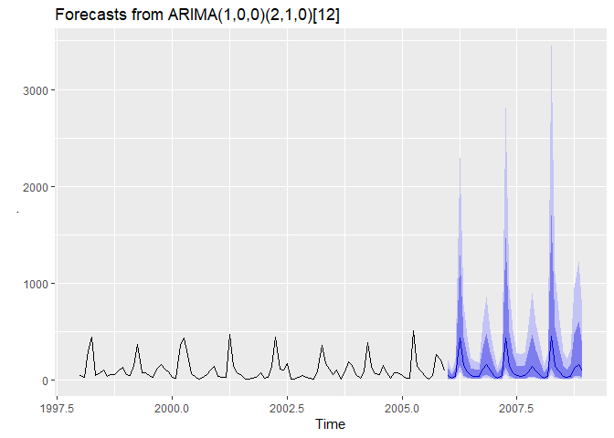<!-- -->

``` r
summary(flow_arima)
```

    ## Series: . 
    ## ARIMA(1,0,0)(2,1,0)[12] 
    ## Box Cox transformation: lambda= 0 
    ## 
    ## Coefficients:
    ##          ar1     sar1     sar2
    ##       0.3029  -0.4913  -0.2687
    ## s.e.  0.1074   0.1196   0.1186
    ## 
    ## sigma^2 estimated as 0.6561:  log likelihood=-101.88
    ## AIC=211.77   AICc=212.27   BIC=221.49
    ## 
    ## Training set error measures:
    ##                    ME     RMSE      MAE       MPE     MAPE      MASE
    ## Training set 9.038871 71.47444 40.46425 -34.75027 64.84495 0.7419962
    ##                   ACF1
    ## Training set -0.182341

Le sommaire du modèle, `ARIMA(1,0,0)(2,1,0)[12]` sous le format
\(ARIMA(p,d,q)(P,D,Q)m\), retourne automatiquement une période de 12
mois avec une différenciation saisonnière mais sans différenciation
ordinaire, excluant la moyenne mobile dans les deux cas.

**Exercice**. Il est toujours pertinent d’effectuer l’analyse des
résidus…

### Les modèles dynamiques

J’ai noté précédemment que l’évolution du climat tient compte d’une
série de covariables explicatives. De même, le débit dans la rivière
Chaudière n’est pas un effet de la saison, mais de son environnement
(climat, changements dans la morphologie du paysage, utilisation de
l’eau, etc.). La prévision du débit aura avantage à considérer ces
covariables. L’ARIMA peut accueillir des covariables en modélisant le
terme d’erreur, \(\epsilon_t\) en fonction de séries temporelles
conjointes.

Le débit mensuel de la rivière Chaudière peut être modélisé en fonction
de la température moyenne mensuelle et des précipitations totales
mensuelles en ajoutant l’argument `xreg` à la fonction
`forecast::auto.arima()`. L’argument consiste en la matrice temporelle
des variables explicatives. Notez que `forecast::auto.arima()` ne
fonctionne pas (encore?) avec l’interface-formule de R, mais que l’on
peut se débrouiller en transformant en série temporelle la sortie de la
fonction `base::model.matrix()`, qui elle peut accueillir une formule.

``` r
hm_tr <- window(hydrometeo_monthly_ts, end = c(2004, 12))
hm_te <- window(hydrometeo_monthly_ts, start = c(2005, 1))
flow_darima <- auto.arima(y = hm_tr[, "Débit"],
                          xreg = hm_tr[, c("total_precip", "mean_temp")],
                          lambda = 0)
summary(flow_darima)
```

    ## Series: hm_tr[, "Débit"] 
    ## Regression with ARIMA(1,0,0)(0,1,1)[12] errors 
    ## Box Cox transformation: lambda= 0 
    ## 
    ## Coefficients:
    ##          ar1     sma1  total_precip  mean_temp
    ##       0.3213  -0.6236        0.0028    -0.0215
    ## s.e.  0.1148   0.1828        0.0017     0.0451
    ## 
    ## sigma^2 estimated as 0.5392:  log likelihood=-80.87
    ## AIC=171.74   AICc=172.65   BIC=183.12
    ## 
    ## Training set error measures:
    ##                    ME     RMSE      MAE       MPE    MAPE      MASE
    ## Training set 3.046006 64.76333 37.60995 -31.06861 57.3032 0.7149168
    ##                    ACF1
    ## Training set -0.3068227

> **Note**. Pour obtenir des résultats plus précis, mais dont les
> résultats seront plus longs à venir, spécifiez l’argument `stepwise =
> FALSE` dans la fonction `forecast::auto.arima()`.

Les coefficients sur les covariables sont interprétables *dans l’échelle
de la prévision transformée*. Ainsi, 1 mm de précipitation par mois
augmentera le logarithme naturel du débit augmente de 0.0028. De même, 1
°C de température moyenne diminuera le logarithme naturel du débit
augmente de 0.0215: notez que l’erreur standard sur ce coefficient étant
très élevée, le coefficient n’est à première vue pas différent de 0. La
température moyenne aurait avantage à être remplacée par un meilleur
indicateur incluant les périodes d’accumulation de neige et de leur
fonte. Pas mal doc?


Source: Scène de Back to the future, Robert Zemeckis et and Bob Gale,
1985

La prévision d’un modèle dynamique demandera les séries temporelles des
covariables, qui peuvent elles-mêmes être modélisées ou être issues de
simulations. Dans notre cas, nous pouvons utiliser la série de test.

``` r
flow_darima %>%
  forecast(xreg = hm_te[, c("total_precip", "mean_temp")]) %>%
  autoplot()
```

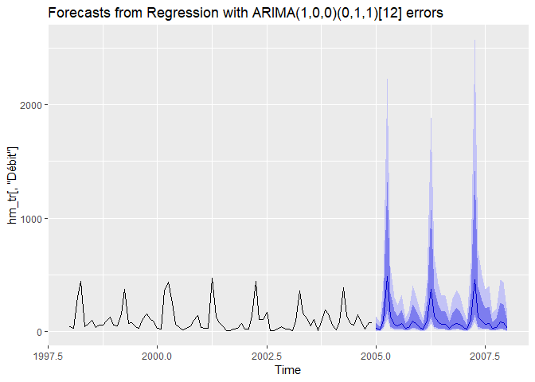<!-- -->

``` r
checkresiduals(flow_darima)
```

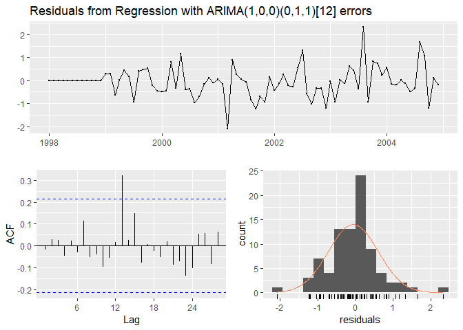<!-- -->

    ## 
    ##  Ljung-Box test
    ## 
    ## data:  Residuals from Regression with ARIMA(1,0,0)(0,1,1)[12] errors
    ## Q* = 16.853, df = 13, p-value = 0.2061
    ## 
    ## Model df: 4.   Total lags used: 17

### Les modèles TBATS

Les modèles TBATS ([Hyndman et
Athanasopoulos, 2018](https://otexts.com/fpp2/complexseasonality.html))
combinent tout ce que l’on a vu jusqu’à présent, *à l’exception notable
des covariables*, dans une interface automatisée. L’automatisation a
l’avantage d’une utilisation rapide, mais donne parfois des
prédictions erronées.

``` r
lynx_tbats <- lynx %>% tbats()
lynx_tbats_f <- lynx_tbats %>% forecast()
lynx_tbats_f %>% autoplot()
```

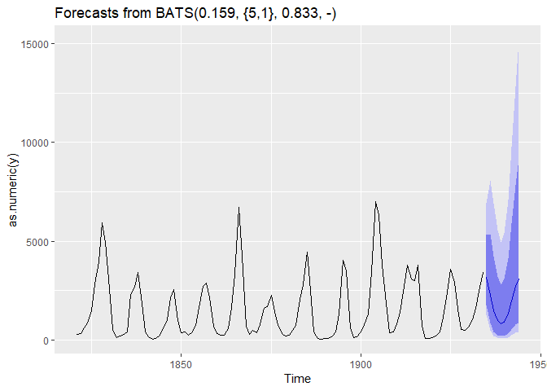<!-- -->

``` r
summary(lynx_tbats_f)
```

    ## 
    ## Forecast method: BATS(0.159, {5,1}, 0.833, -)
    ## 
    ## Model Information:
    ## BATS(0.159, {5,1}, 0.833, -)
    ## 
    ## Call: tbats(y = .)
    ## 
    ## Parameters
    ##   Lambda: 0.159431
    ##   Alpha: 0.4096962
    ##   Beta: 0.06308072
    ##   Damping Parameter: 0.833291
    ##   AR coefficients: 1.166918 -0.79967 0.178396 -0.165326 -0.174982
    ##   MA coefficients: -0.391172
    ## 
    ## Seed States:
    ##            [,1]
    ## [1,] 15.0399753
    ## [2,]  0.4123534
    ## [3,]  0.0000000
    ## [4,]  0.0000000
    ## [5,]  0.0000000
    ## [6,]  0.0000000
    ## [7,]  0.0000000
    ## [8,]  0.0000000
    ## attr(,"lambda")
    ## [1] 0.1594313
    ## 
    ## Sigma: 1.542751
    ## AIC: 1956.137
    ## 
    ## Error measures:
    ##                    ME    RMSE      MAE       MPE     MAPE      MASE
    ## Training set 52.88873 827.169 496.3222 -21.21278 50.42654 0.5973607
    ##                     ACF1
    ## Training set -0.04569254
    ## 
    ## Forecasts:
    ##      Point Forecast     Lo 80    Hi 80      Lo 95     Hi 95
    ## 1935      3144.2286 1772.9365 5314.924 1279.84707  6900.473
    ## 1936      2272.7187  842.6749 5351.691  464.08249  8064.647
    ## 1937      1466.3925  410.3827 4224.271  185.16011  6932.120
    ## 1938       981.1883  227.2540 3210.040   88.86649  5547.989
    ## 1939       807.6476  170.9933 2800.598   62.30711  4954.037
    ## 1940       902.9068  196.5571 3075.407   73.22121  5401.634
    ## 1941      1286.8205  307.5223 4124.040  123.20099  7068.774
    ## 1942      1964.6976  520.9678 5872.628  225.83614  9784.659
    ## 1943      2722.5747  765.2794 7819.328  346.39977 12815.672
    ## 1944      3100.2748  837.7743 9148.331  368.32463 15162.079

Le sommaire du modèle le type de modèle sélectionné ainsi que ses
paramètres. Le titre du graphique en donne aussi un aperçu:
`BATS(0.159, {5,1}, 0.833, -)`:

  - Le coefficient lambda utilisé est 0.159.
  - Le {5, 1} signifie que p = 5 et et q = 1.
  - L’adoucissement est de 0.833
  - Aucune période n’est incluse

L’approche TBATS performe bien pour les données à fluctuations
cycliques. Toutefois, les intervalles prévisionnels son souvent trop
larges et l’optimisation peut être longue.

## Pour terminer…

Nous avons vu comment manipuler des séries temporelles avec **`dplyr`**
et le format de base `ts`. Le nouveau format de série temporelle du
module [**`tsibble`**](https://tsibble.tidyverts.org/) permet des
manipulations dans un flux de travail plus conforme au *tidyverse*. De
même, la nouvelle mouture du module **`forecast`** nommée
[**`fable`**](https://fable.tidyverts.org/), réécrite vers l’approche
*tidyverse*, offrira des fonctions permettant notamment une
hiérarchisation dans les fluctuations saisonnières, par exemple des
cycles journaliers enchâssés dans des cycles hebdomadaires, enchâssés
dans des cycles trimestriels. Le module
[**`prophet`**](https://facebook.github.io/prophet/), distribué par
Facebook en mode open source, gagne en popularité. Bien qu’il soit
réputé pour offrir des prévisions fiables, ses bases mathématiques me
semblent insuffisamment documentées. Fait intéressant: **`prophet`** est
en mesure d’effectuer des prévisions en mode dynamique. Quoi qu’il en
soit, j’ai favorisé des modules plus matures et mieux documentés, qui
pourront vous servir de tremplin vers les nouveaux modules.

Maintenant, le futur vous appartient.


