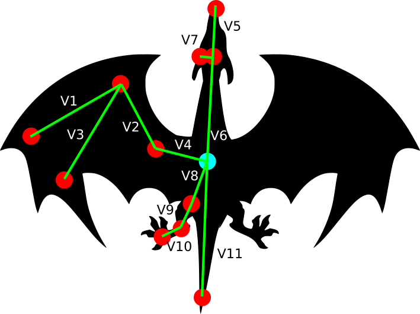

--- 
site: bookdown::bookdown_site
output: bookdown::gitbook
---

# Introduction à l'autoapprentissage {#chapitre-ml}

***
️\ **Objectifs spécifiques**:

À la fin de ce chapitre, vous

- saurez établir un plan de modélisation par autoapprentissage
- saurez définir le sous-apprentissage et le surapprentissage
- serez en mesure d'effectuer un autoapprentissage avec les techniques des *k*-proches voisins, les arbres de décision, les forêts aléatoires, les réseaux neuronnaux et les processus gaussiens

***

Plusieurs cas d'espèces en sciences et génies peuvent être approchés en liant un variable avec une ou plusieurs autres à l'aide de régressions linéaires, polynomiales, sinusoïdales, exponentielle, sigmoïdales, [etc](https://dl.sciencesocieties.org/publications/aj/pdfs/107/2/786). Encore faut-il s'assurer que ces formes préétablies représentent le phénomène de manière fiable.

Lorsque la forme de la réponse est difficile à envisager, en particulier dans des cas non-linéaires ou impliquant plusieurs variables, on pourra faire appel à des modèles dont la structure n'est pas contrôlée par une équation rigide gouvernée par des paramètres (comme la pente ou l'intercept).

L'**autoapprentissage**, apprentissage automatique, ou *machine learning*, vise à détecter des structures complexes émergeant d'ensembles de données à l'aide des mathématiques et de processus automatisés afin de prédire l'émergence de futures occurrences. Comme ensemble de techniques empiriques, l'autoapprentissage est un cas particulier de l'**intelligence artificielle**, qui elle inclut aussi les mécanismes déterministes et des ensembles d'opérations logiques. Par exemple, les premiers ordinateurs à compétitionner aux échecs se basaient sur des règles de logique (si la reine noire est positionnée en c3 et qu'un le fou blanc est en position f6 et que ... alors bouge la tour en g5 - j'écris n'importe quoi). Un jeu simple d'intelligence artificielle consiste à lancer une marche aléatoire, par exemple bouger à chaque pas d'une distance au hasard en x et y, puis de recalculer le pas s'il arrive dans une boîte définie (figure \@ref(fig:random-walk)). Dans les deux cas, il s'agit d'intelligence artificielle, mais pas d'autoapprentissage. 

```{r ml-random-walk, out.width='100%', fig.align="center", fig.cap="Petite tortue, n'entre pas dans la boîte!", echo = FALSE}
set.seed(68538)
n_step <- 100
y <- x <- vector(length = n_step)
y[1] <- x[1] <- 0

box <- c(xg = 0, xd = 4, yb = 0, yh = 2)

for (i in 2:n_step) {
  x[i] <- x[i-1] + runif(1, -1, 1)
  y[i] <- y[i-1] + runif(1, -1, 1)
  while (x[i] > box[1] & x[i] < box[2] & y[i] > box[3] & y[i] < box[4]) {
    x[i] <- x[i-1] + runif(1, -1, 1)
    y[i] <- y[i-1] + runif(1, -1, 1)
  }
}

plot(x, y, type = 'l', col = rgb(0, 0, 1, 0.5), asp = 1)
for (i in 1:(n_step-1)) {
  arrows(x0 = x[i], y0 = y[i],
         x1 = x[i+1], y1 = y[i+1], 
         col = rgb(i/n_step, 0, 1-i/n_step),
         length = 0.08)
}
polygon(x = c(box[1], box[2], box[2], box[1]),
        y = c(box[3], box[3], box[4], box[4]),
        col = rgb(1, 0, 0, 0.25))
points(x, y,  pch = "🐢")

```

L'autoapprentissage passera davantage par la simulation de nombreuses parties et dégagera la structure optimale pour l'emporter considérant les positions des pièces sur l'échiquier.

## Lexique

L'autoapprentissage possède son jargon particulier. Puisque certains termes peuvent porter à confusion, voici quelques définitions de termes que j'utiliserai dans ce chapitre.

- **Réponse**. La variable que l'on cherche à obtenir. Il peut s'agir d'une variable continue comme d'une variable catégorielle. On la nomme aussi la *cible*.
- **Prédicteur**. Une variable utilisée pour prédire une réponse. Les prédicteurs sont des variables continues. Les prédicteurs de type catégoriel doivent préalablement être dummifiés (voir chapitre 5). On nomme les prédicteurs les *entrées*.
- **Apprentissage supervisé** et **non-supervisé**. Si vous avez suivi le cours jusqu'ici, vous avez déjà utilisé des outils entrant dans la grande famille de l'apprentissage automatique. La régression linéaire, par exemple, vise à minimiser l'erreur sur la réponse en optimisant les coefficients de pente et l'intercept. Un apprentissage supervisé a une cible, comme c'est le cas de la régression linéaire. En revanche, un apprentissage non supervisé n'en a pas: on laisse l'algorithme le soin de détecter des structures intéressantes. Nous avons déjà utilisé cette approche. Pensez-y un peu... l'analyse en composante principale ou en coordonnées principales, ainsi que le partitionnement hiérarchique ou non, couverts au chapitre \@ref(chapitre-ordination), sont des exemples d'apprentissage non supervisé. En revanche, l'analyse de redondance a une réponse. L'analyse discriminante aussi, bien que sa réponse soit catégorielle. L'apprentissage non supervisé ayant déjà été couvert (sans le nommer) au chapitre \@ref(chapitre-ordination), ce chapitre ne s'intéresse qu'à l'apprentissage supervisé.
- **Régression** et **Classification**. Alors que la régression est un type d'apprentissage automatique pour les réponses continues, la classification vise à prédire une réponse catégorielle. Il existe des algorithmes uniquement application à la régression, uniquement applicables à la classification, et plusieurs autres adaptable aux deux situations.
- **Données d'entraînement** et **données de test**. Lorsque l'on génère un modèle, on désire qu'il sache comment réagir à ses prédicteurs. Cela se fait avec des données d'entraînement, sur lesquelles on **calibre** et **valide** le modèle. Les données de test servent à vérifier si le modèle est en mesure de prédire des réponses sur lesquelles il n'a pas été entraîné.
- **Fonction de perte**. Une fonction qui mesure l'erreur d'un modèle.

## Démarche

La première tâche est d'explorer les données, ce que nous avons couvert au chapitres \@ref(chapitre-tableaux) et \@ref(chapitre-visualisation).

### Prétraitement

Pour la plupart des techniques d'autoapprentissage, le choix de l'échelle de mesure est déterminant sur la modélisation subséquente. Par exemple, un algorithme basé sur la distance comme les *k* plus proches voisins ne mesurera pas les mêmes distances entre deux observations si l'on change l'unité de mesure d'une variable du mètre au kilomètre. Il est donc important d'effectuer, ou d'envisager la possibilité d'effectuer un prétraitement sur les données. Je vous réfère au chapitre \@ref(chapitre-explorer) pour plus de détails sur le prétraitement.

### Entraînement et test

Vous connaissez peut-être l'expression sportive "avoir l'avantage du terrain". Il s'agit d'un principe prétendant que les athlètes performent mieux en terrain connu. Idem pour les modèles phénoménologiques. Il est possible qu'un modèle fonctionne très bien sur les données avec lesquelles il a été entraîné, mais très mal sur des données externes. De mauvaises prédictions effectuées à partir d'un modèle qui semblait bien se comporter peut mener à des décisions qui, pourtant prises de manière confiante, se révèlent fallacieuses au point d'aboutir à de graves conséquences. C'est pourquoi, **en mode prédictif, on doit évaluer la précision et l'exactitude d'un modèle sur des données qui n'ont pas été utilisés dans son entraînement**.

En pratique, il convient de séparer un tableau de données en deux: un tableau d’entraînement et un tableau de test. Il n'existe pas de standards sur la proportion à utiliser dans l'un et l'autre. Cela dépend de la prudence de l'analyse et de l'ampleur de son tableau de données. Dans certains cas, nous préférerons couper le tableau à 50%. Dand d'autres, nous préférerons réserver le deux-tiers des données pour l'entraînement, ou 70%, 75%. Rarement, toutefois, réservera-t-on moins plus de 50% et moins de 20% à la phase de test.

Si les données sont peu équilibrées (par exemple, on retrouve peu de données de l'espèce $A$, que l'on retrouve peu de données à un pH inférieur à 5 ou que l'on a peu de données croisées de l'espèce $A$ à pH inférieur à 5), il y a un danger qu'une trop grande part, voire toute les données, se retrouvent dans le tableau d'entraînement (certaines situations ne seront ainsi pas testées) ou dans le tableau de test (certaines situations ne seront pas couvertes par le modèle). L'analyste doit s'assurer de séparer le tableau au hasard, mais de manière consciencieuse.

### Sousapprentissage et surapprentissage

Une difficulté en modélisation phénoménologique est de discerner ce qui tient de la structure de ce qui tient du bruit. Lorsque l'on considère une structure comme du bruit, on est dans un cas de sousapprentissage. Lorsque, au contraire, on interprète du bruit comme une structure, on est en cas de surapprentissage. Les graphiques de la figure \@ref(fig:mesapprentissage) présentent ces deux cas, avec au centre un cas d'apprentissage conforme.

```{r, ml-mesapprentissage, fig.align="center", fig.cap="Cas de figure de mésapprentissage. À gauche, sous-apprentissage. Au centre, apprentissage valide. À droite, surapprentissage.", echo = FALSE}
set.seed(35473)
n <- 50
x <- seq(0, 20, length = n) 
y <- 500 + 0.4 * (x-10)^3 + rnorm(n, mean=10, sd=80) # le bruit est généré par rnorm()

par(mfrow = c(1, 3))
plot(x, y, main = "Sousapprentissage", col = "#46c19a", pch=16)
lines(x, predict(lm(y~x)), col = "#b94a73")

plot(x, y, main = "Apprentissage conforme", col = "#46c19a", pch=16)
lines(x, 
      predict(lm(y~x + I(x^2) + I(x^3))),
      col = "#b94a73")

plot(x, y, main = "Surapprentissage", col = "#46c19a", pch=16)
lines(x, 
      predict(lm(y~x + I(x^2) + I(x^3) + I(x^4) + 
                   I(x^5) + I(x^6) + I(x^7) + I(x^8) +
                   I(x^9) + I(x^10) + I(x^11) + I(x^12) +
                   I(x^13) + I(x^14) + I(x^15) + I(x^16))),
      col = "#b94a73")

```

Il est néanmoins difficile d'inspecter un modèle comprenant plusieurs entrées. On détectera le mésapprentissage lorsque la précision d'un modèle est lourdement altérée en phase de test. Une manière de limiter le *mésapprentissage* est d'avoir recours à la validation croisée.

### Validation croisée

Souvent confondue avec le fait de séparer le tableau en phases d'entraînement et de test, la validation croisée est un principe incluant plusieurs algorithmes qui consistent à entraîner le modèle sur un échantillonnage aléatoire des données d'entraînement. La technique la plus utilisée est le *k-fold*, où l'on sépare aléatoirement le tableau d'entraînement en un nombre *k* de tableaux. À chaque étape de la validation croisée, on calibre le modèle sur tous les tableaux sauf un, puis on valide le modèle sur le tableau exclu. La performance du modèle en entraînement est jugée sur les validations.

### Choix de l'algorithme d'apprentissage

Face aux [centaines d’algorithmes d'apprentissages qui vous sont offertes](https://topepo.github.io/caret/available-models.html), choisir l'algorithme (ou les algorithmes) adéquats pour votre problème n'est pas une tâche facile. Ce choix sera motivé par les tenants et aboutissants des algorithmes, votre expérience, l'expérience de la littérature, l'expérience de vos collègues, etc. À moins d'être particulièrement surdoué.e, il vous sera pratiquement impossible de maîtriser la mathématique de chacun d'eux. Une approche raisonnable est de tester plusieurs modèles, de retenir les modèles qui semblent les plus pertinents, et d'approfondir si ce n'est déjà fait la mathématique des options retenues. Ajoutons qu'il existe des algorithmes génétiques, qui ne sont pas couverts ici, qui permettent de sélectionner des modèles d'autoapprentissages optimaux. Un de ces algorithmes est offert par le module Python [`tpot`](https://epistasislab.github.io/tpot/).

### Déploiement

Nous ne couvrirons pas la phase de déploiement d'un modèle. Notons seulement qu'il est possible, en R, d'exporter un modèle dans un fichier `.Rdata`, qui pourra être chargé dans un autre environnement R. Cet environnement peut être une feuille de calcul comme une interface visuelle montée, par exemple, avec [Shiny](https://shiny.rstudio.com/) (chapitre \@ref(chapitre-explorer)).

----

En résumé,

1. Explorer les données
1. Sélectionner des algorithmes
1. Effectuer un prétraitement
1. Créer un ensemble d'entraînement et un ensemble de test
1. Lisser les données sur les données d'entraînement avec validation croisée
1. Tester le modèle
1. Déployer le modèle

## L'autoapprentissage en R

Plusieurs options sont disponibles.

1. Les modules que l'on retrouve en R pour l'autoapprentissage sont nombreux, et parfois spécialisés. Il est possible de les utiliser individuellement.
1. Chacun de ces modules fonctionne à sa façon. Le module **`caret`** de R a été conçu pour donner accès à des centaines de fonctions d'autoapprentissage via une interface commune. **`caret`** est très efficace, mais prend de l'âge. Une refonte complète, nommée [**`parsnip`**](https://tidymodels.github.io/parsnip/) (panais en français) est en cours sous l'ombrelle du méta-module de modélisation [**`tidymodels`**](https://github.com/tidymodels/tidymodels), mais n'est à ce jour pas encore aboutie.
1. Le module **`mlr`** occupe sensiblement le même créneau que **`caret`**, mais utilise plutôt une approche par objets connectés. Au moment d'écrire ces lignes, **`mlr`** est peu documenté, donc *a priori* plus complexe à prendre en main.
1. En Python, le module **`scikit-learn`** offre un interface unique pour l'utilisation de nombreuses techniques d'autoapprentissage. Il est possible d'appeler des fonctions de Python à partir de R grâce au module **`reticulate`**.

Dans ce chapitre, nous verrons comment fonctionnent certains algorithmes sélectionnés, puis nous les appliquerons avec le module respectif qui m'a semblé le plus approprié. Nous utiliserons **`caret`** ainsi que quelques outils de **`tidymodels`**, dont les recettes pour le prétraitement (module **`recipes`**).

```{r ml-loadpackages}
library("tidyverse") # évidemment
library("tidymodels")
library("caret")
```

## Algorithmes

Il existe des centaines d'algorithmes d'autoapprentissage. Je n'en couvrirai que quatre, qui me semblent être appropriés pour la modélisation phénoménologique en agroécologie, et utilisables autant pour la régression et la classification.

- Les *k* plus proches voisins 
- Les arbres de décision
- Les réseaux neuronaux
- Les processus gaussiens

### Les *k* plus proches voisins

```{r ml-les-voisons, out.width="100%", fig.align="center", fig.cap="<< Le... l'idée en arrière pour être... euh... simpliste, là c'est que c'est un peu de... euhmm... de la vitamine de vinyle.>> - Georges ([Les voisins](https://youtu.be/-RpYi_Vuviw?t=6m40s), une pièce de Claude Meunier).", echo = FALSE}
knitr::include_graphics("images/11_les-voisins.jpg")
```

Pour dire comme Georges, le... l'idée en arrière des KNN pour être... euh... *simpliste*, c'est qu'un objet va ressembler à ce qui se trouve dans son voisinage. Les KNN se basent en effet sur une métrique de distance pour rechercher un nombre *k* de points situés à proximité de la mesure. Les *k* points les plus proches sont retenus, *k* étant un entier non nul à optimiser. Un autre paramètre parfois utilisé est la distance maximale des voisins à considérer: un voisin trop éloigné pourra être discarté. La réponse attribuée à la mesure est calculée à partir de la réponse des *k* voisins retenus. Dans le cas d'une régression, on utiliser généralement la moyenne. Dans le cas de la classification, la mesure prendra la catégorie qui sera la plus présente chez les *k* plus proches voisins.

L'algorithme des *k* plus proches voisins est relativement simple à comprendre. Certains pièges sont, de même, peuvent être contournés facilement. Imaginez que vous rechercher les points les plus rapprochés dans un système de coordonnées géographiques où les coordonnées $x$ sont exprimées en mètres et les coordonnées $y$, en centimètres. Vous y projetez trois points (figure \@ref(fig:knn1)).

```{r, ml-knn1, fig.align="center", fig.cap="Distances entre les points pour utilisation avec les KNN", echo = FALSE}
data <- data.frame(X = c(0, 1, 0),
                   Y = c(0, 0, 1),
                   row.names = c('A', 'B', 'C'))
par(pty="s")
plot(data, cex=3,
     xlab = 'Position X (m)', ylab = 'Position Y (cm)')
text(data, labels = rownames(data))
```

Techniquement la distance A-B est 100 plus élevée que la distance A-C, mais l'algorithme ne se soucie pas de la métrique que vous utilisez (figure \@ref(fig:knn1)). Il est primordial dans ce cas d'utiliser la même métrique. Cette stratégie est évidente lorsque les variables sont comparables. C'est rarement le cas, que ce soit lorsque l'on compare des dimensions physionomiques (la longueur d'une phalange ou celle d'un fémur) mais lorsque les variables incluent des mélanges de longueurs, des pH, des décomptes, etc., il est important de bien identifier la métrique et le type de distance qu'il convient le mieux d'utiliser. En outre, la standardisation des données à une moyenne de zéro et à un écart-type de 1 est une approche courrament utilisée.

#### Exemple d'application

Pour ce premier exemple, je présenterai un cheminement d'autoapprentissage, du prétraitement au test. Nous allons essayer de classer les espèces de dragon selon leurs dimensions.

```{r ml-dragons, out.width="50%", fig.align="center", fig.cap="Dimensions mesurés sur les dragons capturés.", echo = FALSE}

```

```{r ml-load-dragons}
dragons <- read_csv("data/11_dragons.csv")
```

Assurons-nous que les données sont toutes à l'échelle. Nous pourrions utiliser la fonction `scale()`. Toutefois, si je capture un nouveau dragon, je n'aurai pas l'information pour convertir mes nouvelles dimensions dans la même métrique que celle utilisée pour lisser mon modèle. Prenez donc soin de conserver la moyenne et l'écart-type pour subséquemment calculer des mises à l'échelle.

```{r ml-sc-dragons}
dim_means <- dragons %>% 
  dplyr::select(starts_with("V")) %>% 
  summarise_all(mean, na.rm = TRUE)

dim_sds <- dragons %>% 
  dplyr::select(starts_with("V")) %>% 
  summarise_all(sd, na.rm = TRUE)

dragons_sc <- dragons %>% 
  dplyr::select(starts_with("V")) %>%
  scale(.) %>% 
  as_tibble() %>% 
  mutate(Species = dragons$Species)
```

Séparons les données en entraînement (`_tr`) et en test (`_te`) avec une proportion 70/30 (`p = 0.7`). Il est essentiel d'utiliser `set.seed()` pour s'assurer que la partition soit la même à chaque session de code (pour la reproductibilité) - j'ai l'habitude de taper n'importe quel numéro à environ 6 chiffres, mais lors de publications, je vais sur [random.org](https://www.random.org/) et je génère un numéro au hasard, sans biais.

```{r ml-dragons-tr-te-split}
set.seed(68017)
id_tr <- createDataPartition(dragons_sc$Species, p = 0.7, list = FALSE)[, 1]
dragons_tr <- dragons_sc[id_tr, ]
dragons_te <- dragons_sc[-id_tr, ]
```

Avant de lancer nos calculs, allons vois sur la [page de caret](https://topepo.github.io/caret/available-models.html) les modules qui effectuent des KNN pour la classification. Nous trouvons **`knn`** et **`kknn`**. Si les modules nécessaires aux calculs ne sont pas installés sur votre ordinateur, **`caret`** vous demandera de les installer. Prenons le module **`kknn`**, qui demande le paramètre `kmax`, soit le nombre de voisins à considérer, ainsi qu'un paramètre de `distance` (spécifiez 1 pour la distance de Mahattan et 2 pour la distance euclidienne), et un `kernel`, qui est une fonction pour mesurer la distance. Comment choisir les bons paramètres? Une manière de procéder est de créer une grille de paramètres.

```{r ml-dragons-grid}
kknn_grid <- expand.grid(kmax = 3:6,
                         distance = 1:2,
                         kernel = c("rectangular", "gaussian", "optimal"))
```

Les noms des colonnes de la grille doivent correspondre aux noms des paramètres du modèle. Nous allons modéliser avec une validation croisée à 5 plis.

```{r ml-dragons-ctrl}
ctrl <- trainControl(method="repeatedcv", repeats = 5)
```

Pour finalement lisser le modèle.

```{r ml-dragons-fit}
set.seed(8961704)
clf <- train(Species ~ .,
             data = dragons_tr,
             method = "kknn",
             tuneGrid = kknn_grid,
             trainControl = ctrl)
clf
```

Nous obtenons les paramètres du modèle optimal. Prédisons l'espèce de dragons selon ses dimensions pour chacun des tableaux.

```{r ml-dragons-predict}
pred_tr <- predict(clf)
pred_te <- predict(clf, newdata = dragons_te)
```

Une manière d'évaluer la prédiction est d'afficher un tableau de contingence.

```{r ml-dragons-diag-tr}
table(dragons_tr$Species, pred_tr)
```

```{r ml-dragons-diag-te}
table(dragons_te$Species, pred_te)
```

Les espèces de dragon sont toutes bien classées tant entraînement qu'en test (c'est rarement le cas dans les situations réelles).

### Les arbres décisionnels

```{r ml-ents, out.width="100%", fig.align="center", fig.cap="Les Ents, tiré du film le Seigneur des anneaux, qui prennent trop de temps avant de se décider - paradoxalement, les abrbres de décisions sont dotés d'algorithmes rapides.", echo = FALSE}
knitr::include_graphics("images/11_Entmoot.jpg")
```

Un arbre décisionnel est une collection hiérarchisée de décisions, le plus souvent binaires. Chaque embranchement est un test à vrai ou faux sur une variable. La réponse, que ce soit une catégorie ou une valeur numérique, se trouve au bout de la dernière branche. Les suites de décisions sont organisées de manière à ce que la précision de la réponse soit optimisée. Ils ont l'avantage de pouvoir être exprimés en un schéma simple et imprimable.

```{r ml-jj-dt, out.width="50%", fig.align="center", fig.cap="Exemple d'arbre de décision, tiré du [blogue de Jeremy Jordon](https://www.jeremyjordan.me/decision-trees/).", echo = FALSE}
knitr::include_graphics("https://www.jeremyjordan.me/content/images/2017/03/Screen-Shot-2017-03-11-at-10.15.37-PM.png")
```

Les arbres sont notamment paramétrés par le nombre maximum d'embranchements, qui s'il est trop élevé peut mener à du surapprentissage. [Il existe de nombreux algorithmes d'arbres de décision](https://topepo.github.io/caret/available-models.html).

Une collection d'arbres devient une forêt. Les forêts aléatoires (*random forest*) sont une catégorie d'algorithmes composés de plusieurs arbres de décision optimisés sur des données répliquées aléatoirement par *bagging*. Allons-y par étape. À partir des données existantes composées de *n* observations (donc *n* lignes) sélectionnées pour l'entraînement, échantillonnons au hasard *avec remplacement* un nombre *n* de nouvelles observations. Le remplacement implique qu'on retrouvera fort probablement dans notre nouveau tableau des lignes identiques. Lissons un arbre sur notre tableau aléatoire. Effectuons un nouveau tirage, puis un autre arbre. Puis encore, et encore, disons 10 fois. Nous obtiendrons une forêt de 10 arbres. Pour une nouvelle observation à prédire, nous obtenons donc 10 prédictions, sur lesquelles nous pouvons effectuer un moyenne s'il s'agit d'une variable numérique, ou bien prenons la catégorie la plus souvent prédite dans le cas d'une classification. Les forêts aléatoires peuvent être constitués de 10, 100, 1000 arbres: autant qu'il en est nécessaire.

#### Exemple d'application

Utilisons toujours nos données de dimensions de dragons. Bien qu'il en existe plusieurs, le module conventionnel pour effectuer un arbre de décision est **`rpart2`**. [Sur la page de **`caret`**](https://topepo.github.io/caret/available-models.html), nous trouvons **`rpart2`**, apte pour les classifications et les régressions, [qui n'a besoin que du paramètre `maxdepth`](https://topepo.github.io/caret/train-models-by-tag.html#random-forest).

```{r ml-tree-grid}
rpart2_grid <- expand.grid(maxdepth = 3:10) # expand_grid n'est pas nécessaire ici
```

Prenons 5 plis encore une fois.

```{r ml-tree-ctrl}
ctrl <- trainControl(method="repeatedcv", repeats = 5)
```

Pour finalement lisser le modèle.

```{r ml-tree-fit}
set.seed(3468973)
clf <- train(Species ~ .,
             data = dragons_tr,
             method = "rpart2",
             tuneGrid = rpart2_grid)
clf
```

Nous obtenons les paramètres du modèle optimal: `maxdepth = 3` - puisque c'est à la limite inférieure de la grille, mieux vaudrait étendre la grille, mais passons pour l'exemple. Comme je l'ai mentionné, un arbre de décision est un outil convivial à visualiser.

```{r ml-tree-plot}
plot(clf$finalModel)
text(clf$finalModel)
```

Ou en plus beau, je vous laisse essayer.

```{r ml-tree-fancy, eval = FALSE}
library("rattle")
fancyRpartPlot(clf$finalModel)
```

Tout comme pour les KNN, prédisons l'espèce de dragons selon ses dimensions pour chacun des tableaux.

```{r ml-tree-predict}
pred_tr <- predict(clf)
pred_te <- predict(clf, newdata = dragons_te)
```

En ce qui a trait aux tableaux de contigence...

```{r ml-tree-diag-tr}
table(dragons_tr$Species, pred_tr)
```

```{r ml-tree-diag-te}
table(dragons_te$Species, pred_te)
```

Les espèces de dragon sont toutes bien classées en entraînement et en test... sauf pour les dragons de caverne, qui (l'avez-vous remarquez?) n'apparaissent pas dans l'arbre de décision!

Le module **`caret`** vient avec la fonction `varImp()` qui offre une appréciation de l'importance des variables dans le modèle final. La notion d'importance varie d'un modèle à l'autre, et reste à ce jour mal documenté. Mieux vaut en examiner les tenants et aboutissants avant d'interpréter exessivement la sortie de cette fonction.

```{r ml-tree-varimp}
varImp(clf) %>% plot(.)
```

On pourra effectuer de la même manière une forêt aléatoire, mais cette fois-ci avec le module **`rf`**.

```{r ml-tree-dragons-fit}
set.seed(3468973)
ctrl <- trainControl(method="repeatedcv", repeats = 5)
clf <- train(Species ~ .,
             data = dragons_tr,
             method = "rf")
clf
```

Et les résultats.

```{r ml-tree-dragons-pred}
pred_tr <- predict(clf)
pred_te <- predict(clf, newdata = dragons_te)
table(dragons_te$Species, pred_te)
table(dragons_tr$Species, pred_tr)
```

Notez que les forêts aléatoires ne génère par de visuel.

### Les réseaux neuronaux

Après les KNN et les *random forests*, nous passons au domaine plus complexe des réseaux neuronaux. Le terme *réseau neuronal* est une métaphore liée à une perception que l'on avait du fonctionnement du cerveau humain lorsque la technique des réseaux neuronaux a été développée dans les années 1950. Un réseau neuronal comprend une série de boîtes d'entrées liée à des fonctions qui transforment et acheminent successivement l'information jusqu'à la sortie d'une ou plusieurs réponse. Il existe plusieurs formes de réseaux neuronnaux, dont la plus simple manifestation est le *perceptron multicouche*. Dans l'exemple de la figure \@ref(fig:nn1), on retrouve 4 variables d'entrée et trois variables de sortie entre lesquelles on retrouve 5 couches dont le nombre de neurones varient entre 3 et 6.

```{r ml-nn1, out.width="50%", fig.align="center", fig.cap="Réseau neuronal schématisé, Source: [Neural designer](https://www.neuraldesigner.com/).", echo = FALSE}
knitr::include_graphics("images/11_deep_neural_network.png")
```

Entre la première couche de neurones (les variables prédictives) et la dernière couche (les variables réponse), on retrouve des *couches cachées*. Chaque neurone est relié à tous les neurones de la couche suivante.

Les liens sont des poids, qui peuvent prendre des valeurs dans l'ensemble des nombres réels. À chaque neurone suivant la première couche, on fait la somme des poids multipliés par la sortie du neurone. Le nombre obtenu entre dans chaque neurone de la couche. Le neurone est une fonction, souvent très simple, qui transforme le nombre. La fonction plus utilisée est probablement la fonction ReLU, pour *rectified linear unit*, qui expulse le même nombre aux neurones de la prochaine couche s'il est positif: sinon, il expulse un zéro.

**Exercice**. Si tous les neurones sont des fonctions ReLU, calculez la sortie de ce petit réseau neuronal.


Vous trouverez la réponse sur l'image `images/11_nn_ex1_R.jpg`.

Il est aussi possible d'ajouter un *biais* à chaque neurone, qui est un nombre réel additionné à la somme des neurones pondérée par les poids.

L'optimisation les poids pour chaque lien et les biais pour chaque neurone (grâce à des algorithmes dont le fonctionnement sort du cadre de ce cours) constitue le processus d'apprentissage. Avec l'aide de logiciels et de modules spécialisés, la construction de réseaux de centaines de neurones organisés en centaines de couches vous permettra de capter des patrons complexes dans des ensembles de données.

Vous avez peut-être déjà entendu parler d'apprentissage profond (ou *deep learning*). Il s'agit simplement d'une appellation des réseaux neuronaux modernisé pour insister sur la présence de nombreuses couches de neurones. C'est un terme à la mode.

#### Les réseaux neuronaux sur R avec **`neuralnet`**

Plusieurs modules sont disponibles sur R pour l'apprentissage profond. Certains utilisent le module [H2O.ia](https://github.com/h2oai/h2o-3), propulsé en Java, d'autres utilisent plutôt [Keras](https://keras.rstudio.com/), propulsé en Python par l'intermédiaire de [Tensorflow](https://www.tensorflow.org/). J'ai une préférence pour Keras, puisqu'il supporte les réseaux neuronaux classiques (perceptrons multicouche) autant que convolutifs ou récurrents. Keras pourrait néanmoins être difficile à installer sur Windows, où Python ne vient pas par défaut. Sur Windows, Keras ne fonctionne qu'avec Anaconda: vous devez donc installez [Anaconda ou Miniconda](https://www.anaconda.com/download/#windows) (Miniconda offre une installation minimaliste).

Donc, pour ce cours, nous utiliserons le module **`neuralnet`**. Il est possible de l'utilser grâce à l'interface de **`caret`**, mais son utilisation directe permet davantage de flexibilité. Chargeons les données d'iris.

```{r ml-load-iris}
library("neuralnet")
data("iris")
```

Prenons soin de segmenter nos données en entraînement et en test.

```{r ml-iris-tr-te-split}
set.seed(8453668)
iris_tr_index <- createDataPartition(y=iris$Species, p = 0.75, list = FALSE)
```

Nous pouvons ainsi créer nos tableaux d'entraînement et de test pour les variables prédictives.

Les réseaux neuronnaux sont aptes à générer des sorties multiples. Nous désirons prédire une catégorie, et **`neuralnet`** ne s'occupe pas de les transformer de facto. Lors de la prédiction d'une catégorie, nous devons générée des sorties multiples qui permettront de décider de l'appartenance exclusive à une catégorie ou une autre. Nous avons abordé l'encodage catégoriel aux chapitres \@ref(chapitre-biostats) et \@ref(chapitre-explorer). C'est ce que nous ferons ici.

```{r ml-iris-preprocess}
species_oh <- model.matrix(~ 0 + Species, iris)
colnames(species_oh) <- levels(iris$Species)
iris_oh <- iris %>% 
  cbind(species_oh)
iris_tr <- iris_oh[iris_tr_index, ]
iris_te <- iris_oh[-iris_tr_index, ]
```

Lançons le réseau neuronnal avec l'interface-formule de R (neuralnet n'accepte pas le `.` pour indiquer *prend toutes les variables à l'exeption de celles utilisées en y*): nous allons les inclure à la main.  L'argument `hidden` est un vecteur qui indique le nombre de neuronnes pour chaque couche. L'argument `linear.input` indique si l'on désire travailler en régression (`linear.output = TRUE`) ou en classification (`linear.output = FALSE`). Lorsque les données sont nombreuses, patience, le calcul prend pas mal de temps. Dans ce cas-ci, nous avons un tout petit tableau.

```{r ml-iris-fit}
nn <- neuralnet(setosa + versicolor + virginica ~ Sepal.Length + Sepal.Width + Petal.Length + Petal.Width,
                data = iris_tr, 
                hidden = c(5, 5),
                act.fct = "tanh",
                linear.output = FALSE)
```

Un réseau neuronnal peu complexe peut être lisible.

```{r ml-iris-nn-plot}
plot(nn)
```

Il n'existe pas de règle stricte sur le nombre de couche et le nombre de noeud par couche. Il est néanmoins conseillé de générer d'abord un modèle simple, puis au besoin de le complexifier graduellement en terme de nombre de noeuds, puis de nombre de couches. Si vous désirez aller plus loin et utiliser keras, le module [`autokeras`](https://autokeras.com/), disponible seulement en Python, est conçu pour optimiser un modèle Keras.

La sortie du réseau neuronal est une valeur près de 1 ou une valeur près de 0. Voici une manière de générer un vecteur catégoriel.

```{r ml-iris-predict}
compute_te <- compute(nn, iris_te)
pred_te <- compute_te$net.result %>%
  as_tibble() %>% 
  apply(., 1, which.max) %>% 
  levels(iris$Species)[.] %>%
  as.factor()
```

La fonction `caret::confusionMatrix()` permet de générer les statistiques du modèle.

```{r ml-iris-predict-diag}
confusionMatrix(iris_te$Species, pred_te)
```

Encore une fois, c'est rarement le cas mais nous obtenons une classification parfaite.

#### Pour aller plus loin

En une heure divisée en [4 vidéos](https://www.youtube.com/playlist?list=PLZHQObOWTQDNU6R1_67000Dx_ZCJB-3pi), Grant Sanderson explique les réseaux neuronaux de manière intuitive. En ce qui a trait à Keras, je recommande le livre [Deep learning with R, de François Allaire](https://www.safaribooksonline.com/library/view/deep-learning-with/9781617295546/?ar), auquel vous avez accès avec un IDUL de l'Université Laval. Si vous vous sentez à l'aise à utiliser Keras avec le langage Python, je vous recommande le cours gratuit en ligne [*Applications of deep neural networks*, de Jeff Heaton](https://www.youtube.com/watch?v=sRy26qWejOI&list=PLjy4p-07OYzulelvJ5KVaT2pDlxivl_BN).

Des types de réseaux neuronaux spécialisés ont été développés. Je les présente sans aller dans les détails.

- **Réseaux neuronaux convolutif**. Ce type de réseau neuronal est surtout utilisé en reconnaissance d'image. Les couches de neurones convolutifs possèdent, en plus des fonctions des perceptrons classiques, des filtres permettant d'intégrer les variables descriptives connexes à l'observation: dans le cas d'une image, il s'agit de scanner les pixels au pourtour du pixel traité. [Une brève introduction sur Youtube](https://www.youtube.com/watch?v=YRhxdVk_sIs).
- **Réseaux neuronaux récurrents**. Prédire des occurrences futures à partir de séries temporelles implique que la réponse au temps t dépend non seulement de conditions externes, mais aussi le la réponse au temps t-1. Les réseaux neuronaux récurrents. Vous devrez ajouter des neurones particuliers pour cette tâche, qui pourra être pris en charge par Keras grâce aux couches de type [*Long Short-Term Memory network*, ou LSTM](https://www.youtube.com/watch?v=UnclHXZszpw).
- **Réseaux neuronaux probabilistes**. Les réseaux neuronaux non-probabilistes offre une estimation de la variable réponse. Mais quelle est la crédibilité de la réponse selon les variables descriptives? Question qui pourrait se révéler cruciale en médecine ou en ingénierie, à la laquelle on pourra répondre en mode probabiliste. Pour ce faire, on pose des distributions *a priori* sur les poids du réseau neuronal. Le module [`edward`](http://edwardlib.org/), programmé et distribué en Python, offre cette possibilité. Vous pourrez accéder à `edward` grâce au module `reticulate`, mais à ce stade mieux vaudra basculer en Python. Pour en savoir davantage, considérez [cette conférence de Andrew Rowan](https://www.youtube.com/watch?v=I09QVNrUS3Q).

### Les processus gaussiens

Les sorties des techniques que sont les KNN, les arbres ou les forêts ainsi que les réseaux neuronaux sont (classiquement) des nombres réels ou des catégories. Dans les cas où la crédibilité de la réponse est importante, il devient pertinent que la sortie soit probabiliste: les prédictions seront alors présentées sous forme de distributions de probabilité. Dans le cas d’une classification, la sortie du modèle sera un vecteur de probabilité qu’une observation appartienne à une classe ou à une autre. Dans celui d’une régression, on obtiendra une distribution continue.

Les **processus gaussiens** tirent profit des statistiques bayésiennes pour effectuer des prédictions probabilistes. D’autres techniques peuvent être utilisées pour effectuer des prédictions probabilistes, comme les [réseaux neuronaux probabilistes](http://edwardlib.org/iclr2017), que j'ai introduits précédemment.

Bien que les processus gaussiens peuvent être utilisés pour la classification, son fonctionnement s'explique favorablement, de manière intuitive, pas la régression.

#### Un approche intuitive

Ayant acquis de l'expérience en enseignement des processus gaussiens, [John Cunningham](http://stat.columbia.edu/~cunningham/) a développé une approche intuitive permettant de saisir les mécanismes des processus gaussiens. lors de conférences disponible sur YouTube ([1](https://youtu.be/BS4Wd5rwNwE), [2](https://www.youtube.com/watch?v=Jv25sg-IYHU)), il aborde le sujet par la nécessité d'effectuer une régression non-linéaire.

Générons d'abord une variable prédictive `x`, l'heure, et une variable réponse `y`, le rythme cardiaque d'un individu en battements par minute (bpm).

```{r ml-gp-data}
x <- c(7, 8, 10, 14, 17)
y <- c(61, 74, 69, 67, 78)

plot(x, y, xlab="Heure", ylab="Rythme cardiaque (bpm)")
abline(v=12, lty=3, col='gray50');text(12, 67, '?', cex=2)
abline(v=16, lty=3, col='gray50');text(16, 72, '?', cex=2)
```

Poser un problème par un processus gaussien, c'est se demander les valeurs crédibles qui pourraient être obtenues hors du domaine d'observations (par exemple, dans la figure ci-dessus, à `x=12` et `x=16`)? Ou bien, de manière plus générale, *quelles fonctions ont pu générer les variables réponse à partir d'une structure dans les variables prédictives?*

Les distributions normales, que nous appellerons *gaussiennes* dans cette section par concordance avec le terme *processus gaussien*, sont particulièrement utiles pour répondre à cette question.

Nous avons vu précédemment ce que sont les distributions de probabilité: des outils mathématiques permettant d'appréhender la structure des processus aléatoires. Une distribution gaussienne représente une situation où l'on tire au hasard des valeurs continues. Une distribution gaussienne de la variable aléatoire $X$ de moyenne $0$ et de variance de $1$ est notée ainsi:

$$ X \sim \mathcal{N} \left( 0, 1\right)$$

Par exemple, une courbe de distribution gaussienne du rythme cardiaque à 7:00 pourrait prendre la forme suivante.

$$ bpm \sim \mathcal{N} \left( 65, 5\right)$$

En `R`:

```{r ml-gp-xseq}
x_sequence <- seq(50, 80, length=100)
plot(x_sequence,
     dnorm(x_sequence, mean=65, sd=5),
     type="l",
     xlab="Rythme cardiaque (bpm)",
     ylab="Densité")
```

Une distribution **bi**normale, un cas particulier de la distribution **multi**normale, comprendra deux vecteurs, $x_1$ et $x_2$. Elle aura donc deux moyennes. Puisqu'il s'agit d'une distribution binormale, et non pas deux distributions normales, les deux variables ne sont pas indépendantes et l'on utilisera une matrice de covariance au lieu de deux variances indépendantes.

$$
\binom{x_1}{x_2} \sim \mathcal{N}
\Bigg( 
\binom{\mu_1}{\mu_2},
\left[ {\begin{array}{cc}
\Sigma_{x_1} & \Sigma_{x_1,x_2} \\
\Sigma_{x_1,x_2}^T & \Sigma_{x_2} \\
\end{array} } \right]
\Bigg)
$$

La matrice $\Sigma$, dite de *variance-covariance*, indique sur sa diagonale les variances des variables ($\Sigma_{x_1}$ et $\Sigma_{x_2}$). Les covariances $\Sigma_{x_1,x_2}$ et $\Sigma_{x_1,x_2}^T$ sont symétriques et indiquent le lien entre les variables.

On pourrait supposer que le rythme cardiaque à 8:00 soit corrélé avec celui à 7:00. Mises ensembles, les distributions gaussiennes à 7:00 et à 8:00 formeraient une distribution gaussienne binormale.

$$
\binom{bpm_7}{bpm_8} \sim \mathcal{N}
\Bigg( 
\binom{65}{75},
\left[ {\begin{array}{cc}
10 & 6 \\
6 & 15 \\
\end{array} } \right]
\Bigg)
$$

En `R`:

```{r ml-gp-ellipse}
library("ellipse")
means_vec <- c(65, 75)
covariance_mat <- matrix(c(10, 6, 6, 15), ncol=2)
par(pty='s')
plot(ellipse(x=covariance_mat, centre=means_vec, levels=0.95), 
     type='l',
     xlab="Rythme cardiaque à 7:00 (bpm)",
     ylab="Rythme cardiaque à 8:00 (bpm)")
#lines(ellipse(x=covariance_mat, centre=means_vec, level=0.8))
```

On peut se poser la question: étant donnée que $x_1 = 68$, quelle serait la distribution de $x_2$? Dans ce cas bivariée, la distribution marginale serait univariée, mais dans le cas multivarié en $D$ dimensions, la distribution marginale où l'on spécifie $m$ variables serait de $D-m$. de  Une propriété fondamentale d'une distribution gaussienne est que peu importe l'endroit où l'angle selon lequel on la tranche, la distribution marginale sera aussi gaussienne. Lorsque l'on retranche une ou plusieurs variables en spécifiant la valeur qu'elles prennent, on applique un *conditionnement* à la distribution.

```{r ml-gp-multnorm, echo = FALSE}
library("condMVNorm")

condition_x1 <- 61 # changer ce chiffre pour visualiser l'effet

cond_parameters <- condMVN(mean=means_vec, sigma=covariance_mat,
                           dependent=2, given=1, X.given=condition_x1)
cond_mean <- cond_parameters$condMean
cond_sd <- sqrt(cond_parameters$condVar)
x2_sequence <- seq(50, 90, length=100)
x2_dens <- dnorm(x2_sequence, mean=cond_mean, sd=cond_sd)

par(pty='s')
plot(ellipse(x=covariance_mat, centre=means_vec, levels=0.95), type='l',
     xlab="Rythme cardiaque à 7:00 (bpm)",
     ylab="Rythme cardiaque à 8:00 (bpm)")
abline(v=condition_x1, col='#f8ad00', lwd=2, lty=2)
lines(x=condition_x1 + x2_dens*40, y=x2_sequence, col="#f8ad00", lwd=2)
lines(x = c(condition_x1, condition_x1),
      y = c(cond_mean-cond_sd, cond_mean+cond_sd),
      lwd=3, col='#46c19a')
points(condition_x1, cond_mean, 
       col='#46c19a', pch=16, cex=2)

n_sample <- 20
points(x = rep(condition_x1, n_sample),
       y = rnorm(n_sample, cond_mean, cond_sd),
       pch=4, col = rgb(0, 0, 0, 0.5))
```

Les points sur l'axe (symbole x) conditionnés sont des échantillons tirés au hasard dans la distribution conditionnée.

Une autre manière de visualiser la distribution gaussienne binormale est de placer $x_1$ et $x_2$ côte à côte en abscisse, avec leur valeur en ordonnée. Le bloc de code suivant peut sembler lourd au premier coup d’œil: pas de panique, il s'agit surtout d'instructions graphiques. Vous pouvez vous amuser à changer les paramètres de la distribution binormale (section 1) ainsi que la valeur de $x_1$ à laquelle est conditionnée la distribution de $x_2$ (section 2).

```{r ml-gp-distr1, echo = FALSE}
source("lib/plot_matrix.R")

# 1. Distribution
means_vec <- c(65, 65)
covariance_mat <- matrix(c(10, 6, 6, 15), ncol=2)

# 2. Condition
condition_x1 <- 61 # changer ce chiffre pour visualiser l'effet

# 3. Densité conditionnée
cond_parameters <- condMVN(mean=means_vec, sigma=covariance_mat,
                           dependent=2, given=1, X.given=condition_x1)
cond_mean <- cond_parameters$condMean
cond_sd <- sqrt(cond_parameters$condVar)
x2_sequence <- seq(50, 90, length=100)
x2_dens <- dnorm(x2_sequence, mean=cond_mean, sd=cond_sd)
x2_draw <- rnorm(1, cond_mean, cond_sd)

# 4. Graphiques
options(repr.plot.width = 8, repr.plot.height = 5)
layout(matrix(c(1,2,3,3), nrow=2), widths=c(1,2))
par(mar=c(4, 4, 1, 1), pty='s')

## 4.1 Ellipse
plot(ellipse(x=covariance_mat, centre=means_vec, levels=0.95), 
     type='l', xlab="BPM à 7:00", ylab="BPM à 8:00")
abline(v=condition_x1, col='#f8ad00', lwd=1)
lines(x=condition_x1 + x2_dens*40, y=x2_sequence, col="#f8ad00", lwd=1)
lines(x = c(condition_x1, condition_x1),
      y = c(cond_mean-cond_sd, cond_mean+cond_sd),
      lwd=2, col='#46c19a')
points(condition_x1, cond_mean, 
       col='#46c19a', pch=16, cex=1)
points(condition_x1, x2_draw, pch=16, col="#b94a73")

## 4.2 Covariance
plot_matrix(covariance_mat)

## 4.3 Série
plot(c(1, 2), c(condition_x1, x2_draw), xlim=c(0, 6), ylim=c(55, 75), type='l',
     xlab="Indice de la variable", ylab="Rythme cardiaque (bpm)")
points(1, condition_x1, pch=16, col='#46c19a', cex=3)
points(2, x2_draw, pch=16, col='#b94a73', cex=3)
```

Les valeurs que peuvent prendre le rythme cardiaque en $x_2$ sont tirées aléatoirement d'une distribution conditionnée. Sautons maintenant au cas multinormal, incluant 6 variables (*hexanormal*!). Afin d'éviter de composer une matrice de covariance à la mitaine, je me permets de la générer avec une fonction. Cette fonction particulière est nommée *fonction de base radiale* ou *exponentiel de la racine*.

$$K_{RBF} \left( x_i, x_j \right) = \sigma^2 exp \left( -\frac{\left( x_i - x_j \right)^2}{2 l^2}  \right) $$

```{r ml-gp-rbf}
RBF_kernel <- function(x, sigma, l) {
  n <- length(x)
  k <- matrix(ncol = n, nrow = n)
  for (i in 1:n) {
    for (j in 1:n) {
      k[i, j] = sigma^2 * exp(-1/(2*l^2) * (x[i] - x[j])^2)
    }
  }
  colnames(k) <- paste0('x', 1:n)
  rownames(k) <- colnames(k)
  return(k)
}
```

Dans la fonction `RBF_kernel`, `x` désigne les dimensions, `sigma` désigne un écart-type commun à chacune des dimensions et `l` est la longueur désignant l'amplification de la covariance entre des dimensions éloignées (dans le sens que la première dimension est éloignée de la dernière). Pour 6 dimensions, avec un écart-type de 4 et une longueur de 2.

```{r ml-gp-rbf-6d}
covariance_6 <- RBF_kernel(1:6, sigma=4, l=2)
round(covariance_6, 2)
```

Changez la valeur de `l` permet de bien saisir son influence sur la matrice de covariance. Avec un `l` de 1, la covariance entre $x_1$ et $x_6$ est pratiquement nulle: elle est un peut plus élevée avec `l=2`. Pour reprendre l'exemple du rythme cardiaque, on devrait en effet s'attendre à retrouver une plus grande corrélation entre celles mesurées aux temps 4 et 5 qu'entre les temps 1 et 6.

De même que dans la situation où nous avions une distribution binormale, nous pouvons conditionner une distribution multinormale. Dans l'exemple suivant, je conditionne la distribution multinormale de 6 dimensions en spécifiant les valeurs prises par les deux premières dimensions. Le résultat du conditionnement est une distribution en 4 dimensions. Puisqu'il est difficile de présenter une distribution en 6D, le graphique en haut à gauche ne comprend que les dimensions 1 et 6. Remarquez que la corrélation entre les dimensions 1 et 6 est faible, en concordance avec la matrice de covariance générée par la fonction `RBF_kernel`. Lancez plusieurs fois le code et voyez ce qui advient des échantillonnages dans les dimensions 3 à 6 selon le conditionnement en 1 et 2.

```{r ml-gp-cond-6d, echo = FALSE}
library("MASS")

# 1. Distribution
means_vec <- rep(65, 6)
covariance_mat <- covariance_6

# 2. Condition
conditions_x <- c(61, 74) # changer ces chiffres pour visualiser l'effet

# 3. Densité conditionnée
cond_parameters <- condMVN(mean=means_vec, sigma=covariance_mat, 
                           dependent.ind = 3:6, given.ind=1:2,
                           X.given=conditions_x)
cond_mean <- cond_parameters$condMean
cond_sd <- sqrt(cond_parameters$condVar)
x6_sequence <- seq(50, 90, length=100)
x6_dens <- dnorm(x2_sequence, mean=cond_mean[4], sd=cond_sd[4, 4])

x_3.6_draw <- mvrnorm(n = 1, mu = cond_mean, Sigma = cond_sd^2)

# 4. Graphiques
layout(matrix(c(1,2,3,3), nrow=2), widths=c(1,2))
par(mar=c(4, 4, 1, 1))

## 4.1 Ellipse
plot(ellipse(x=covariance_mat[c(1, 6), c(1, 6)], centre=means_vec[c(1, 6)], levels=0.95), 
     type='l', xlab="BPM à 7:00", ylab="BPM à 8:00")
abline(v=conditions_x[1], col='#f8ad00', lwd=1)
lines(x=condition_x1 + x6_dens*40, y=x2_sequence, col="#f8ad00", lwd=1)
lines(x = c(conditions_x[1], conditions_x[1]),
      y = c(cond_mean[4]-cond_sd[4, 4], cond_mean[4]+cond_sd[4, 4]),
      lwd=2, col='#46c19a')
points(conditions_x[1], cond_mean[4],
       col='#46c19a', pch=16, cex=1)
points(conditions_x[1], x_3.6_draw[4], pch=16, col="#b94a73")

## 4.2 Covariance
plot_matrix(covariance_mat, cex=0.8)

## 4.3 Série
plot(1:6, c(conditions_x, x_3.6_draw), xlim=c(0, 6), ylim=c(60, 85), type='l',
     xlab="Indice de la variable", ylab="Rythme cardiaque (bpm)")
points(c(1, 2), conditions_x, pch=16, col='#46c19a', cex=3)
points(3:6, x_3.6_draw, pch=16, col='#b94a73', cex=3)
```

La structure de la covariance assure que les dimensions proches prennent des valeurs similaires, assurant une courbe lisse et non en dents de scie. Pourquoi s'arrêter à 6 dimensions? Prenons-en plusieurs, puis générons plus d'un échantillon. Ensuite, utilisons ces simulations pour de calculer la moyenne et l'écart-type de chacune des dimensions.

```{r ml-gp-cond-65, echo=FALSE}
# 1. Distribution
n <- 20
means_vec <- rep(65, n)
covariance_mat <- RBF_kernel(x = 1:n, sigma = 10, l = 2)

# 2. Condition
conditions_x <- c(61, 74) # changer ces chiffres pour visualiser l'effet

# 3. Densité conditionnée
cond_parameters <- condMVN(mean=means_vec, sigma=covariance_mat, 
                           dependent.ind = 3:n, given.ind=1:2,
                           X.given=conditions_x)
cond_mean <- cond_parameters$condMean
cond_sd <- cond_parameters$condVar

# 4. Graphiques
par(mar=c(4, 4, 1, 1))

## 4.3 Série
plot(0, 0, xlim=c(0, n), ylim=c(40, 95), type='l',
     xlab="Indice de la variable", ylab="Rythme cardiaque (bpm)")

samples <- 50
x_3.n_draw <- mvrnorm(n = samples, mu = cond_mean, Sigma = cond_sd)
for (i in 1:samples) {
  lines(1:n, c(conditions_x, x_3.n_draw[i, ]), col = rgb(0, 0, 0, 0.15))
}
x_3.n_draw_mean <- apply(x_3.n_draw, 2, mean)
x_3.n_draw_sd <- apply(x_3.n_draw, 2, stats::sd)

lines(1:n, c(conditions_x, x_3.n_draw_mean), lwd = 2)
lines(1:n, c(conditions_x, x_3.n_draw_mean + x_3.n_draw_sd), col = "#b94a73", lwd = 2)
lines(1:n, c(conditions_x, x_3.n_draw_mean - x_3.n_draw_sd), col = "#b94a73", lwd = 2)
points(c(1, 2), conditions_x, pch=16, col='#46c19a', cex=2)
```

Revenons au rythme cardiaque. On pourra utiliser le conditionnement aux temps observés, soit 7:00, 8:00, 10:00, 14:00 et 17:00 pour estimer la distribution à 12:00 et 16:00, où à des dimensions artificielles quelconques ici fixées aux demi-heures.

```{r ml-gp-cond-bpm, echo = FALSE}
# 1. Distribution
n <- 21
means_vec <- rep(65, n)
covariance_mat <- RBF_kernel(x = 1:n, sigma = 5, l = 2)

# 2. Condition
conditions_x <- c(61, 74, 69, 67, 78)
conditions_indices <- c(1, 3, 7, 15, 21)
dependent_indices <- (1:20)[! 1:20 %in% conditions_indices]

# 3. Densité conditionnée
cond_parameters <- condMVN(mean=means_vec, sigma=covariance_mat, 
                           dependent.ind = dependent_indices,
                           given.ind=conditions_indices,
                           X.given=conditions_x)
cond_mean <- cond_parameters$condMean
cond_sd <- cond_parameters$condVar
samples <- 100
x_draw <- mvrnorm(n = samples, mu = cond_mean, Sigma = cond_sd)
means_draw <- apply(x_draw, 2, mean)
sd_draw <- apply(x_draw, 2, stats::sd)

# 4. Graphiques
par(mar=c(4, 4, 1, 1))

## 4.1 Combiner les prédictions
bpm <- rep(NA, n)
bpm[conditions_indices] <- conditions_x
bpm[dependent_indices] <- means_draw

bpm_sd <- rep(NA, n)
bpm_sd[conditions_indices] <- 0
bpm_sd[dependent_indices] <- sd_draw


## 4.2 Combiner les tirages et les données
x_draw_all <- matrix(ncol = n, nrow = samples)
for (i in 1:length(conditions_x)) x_draw_all[, conditions_indices[i]] <- conditions_x[i]
x_draw_all[, dependent_indices] <- x_draw


## 4.3 Série
plot(1:n, bpm, xlim=c(0, n), ylim=c(40, 90), type='l', lwd = 2,
     xlab="Indice de la variable", ylab="Rythme cardiaque (bpm)")
for (i in 1:samples) {
  lines(1:n, x_draw_all[i, ], col = rgb(0, 0, 0, 0.1))
}
lines(1:n, bpm+bpm_sd, col = "#b94a73", lwd = 2)
lines(1:n, bpm-bpm_sd, col = "#b94a73", lwd = 2)
points(conditions_indices, bpm[conditions_indices], pch=16, col='#46c19a', cex=2)

```

Comme on devrait s'y attendre, la régression résultant de la mise en indices de la distribution est précise aux mesures, et imprécise aux indices peu garnis en mesures. Nous avions utilisé 21 dimensions. **Lorsque l'on généralise la procédure à une quantité infinie de dimensions, on obtient un *processus gaussien*.** 


L'indice de la variable devient ainsi une valeur réelle. Un processus gaussien, $\mathcal{GP}$, est défini par une fonction de la moyenne, $m \left( x \right)$, et une autre de la covariance que l'on nomme *noyau* (ou *kernel*), $K \left( x, x' \right)$. Un processus gaussien est noté de la manière suivante:

$$\mathcal{GP} \sim \left( m \left( x \right), K \left( x, x' \right) \right)$$

La fonction définissant la moyenne peut être facilement écartée en s'assurant de centrer la variable réponse à zéro ($y_{centré} = y - \hat{y}$). Ainsi, par convention, on spécifie une fonction de moyenne comme retournant toujours un zéro. Quant au noyau, il peut prendre différentes fonctions de covariance ou combinaisons de fonctions de covariance. Règle générale, on utilisera un noyau permettant de définir deux paramètres: la hauteur ($\sigma$) et la longueur de l'ondulation ($l$) (figure \@ref(fig:gp-hyperp)).

```{r ml-gp-hyperp, out.width="100%", fig.align="center", fig.cap="Hyperparamètres d'un noyau RBF.", echo = FALSE}

hyperparameters <- expand.grid(l=c(1, 3, 9), sigma=1:3)

# Graphique
n <- 100

samples_list <- list()
for (i in 1:nrow(hyperparameters)) {
  sample <- mvrnorm(n = 1, mu = rep(0, n), 
                    Sigma = RBF_kernel(x=1:n,
                                       sigma = hyperparameters$sigma[i],
                                       l = hyperparameters$l[i]))
  samples_list[[i]] <- data.frame(sigma = paste("sigma =", hyperparameters$sigma[i]),
                                  l = paste("l =", hyperparameters$l[i]),
                                  x = 1:n,
                                  sample = sample)
  
}
samples_df <- do.call(rbind.data.frame, samples_list)
samples_df %>%
  ggplot(mapping = aes(x = x, y = sample)) +
  geom_line() +
  facet_grid(l ~ sigma)
```

On pourra ajouter à ce noyau un bruit blanc, c'est-à-dire une variation purement aléatoire, sans covariance (noyau générant une matrice diagonale).

Le noyau devient ainsi un *a priori*, et le processus gaussien conditionné aux données devient un *a posteriori* probabiliste.

Finalement, les processus gaussiens peuvent être extrapolés à plusieurs variables descriptives.

### Les processus gaussiens en `R`

Pas de souci, vous n'aurez pas à programmer vos propres fonctions pour lancer des processus gaussiens. Vous pourrez [passer par `caret`](https://topepo.github.io/caret/train-models-by-tag.html#gaussian-process). Vous pourriez, comme c'est le cas avec les réseaux neuronnaux, obtenir davantage de contrôle sur l'autoapprentissage en utilisant directement la fonction `gausspr()` du package **`kernlab`**.

```{r ml-gp-kernlab}
library("kernlab")
x <- c(7, 8, 10, 14, 17)
y <- c(61, 74, 69, 67, 78)
y_sc <- (y - mean(y)) / sd(y)

m <- gausspr(x, y_sc, 
             kernel = 'rbfdot', # le noyau: différents types disponibles (?gausspr)
             kpar = list(sigma = 4), # hyperparamètre du noyau (l est optimisé)
             variance.model = TRUE, # pour pouvoir générer les écarts-type
             scaled = TRUE, # mettre à l'échelle des variables
             var = 0.01, # bruit blanc
             cross = 2) # nombre de plis de la validation croisée

xtest <- seq(6, 18, by = 0.1)
y_sc_pred_mean <- predict(m, xtest, type="response")
y_pred_mean <- y_sc_pred_mean * sd(y) + mean(y)
y_sc_pred_sd <- predict(m, xtest, type="sdeviation") # "sdeviation" en régression et "probabilities" pour la classification
y_pred_sd <- y_sc_pred_sd * sd(y)

plot(x, y, xlim = c(6, 18), ylim = c(45, 90))
lines(xtest, y_pred_mean)
lines(xtest, y_pred_mean + y_pred_sd, col="red")
lines(xtest, y_pred_mean - y_pred_sd, col="red")
abline(v=12, lty=3, col='gray50');text(12, 67, '?', cex=2)
abline(v=16, lty=3, col='gray50');text(16, 72, '?', cex=2)
```

#### Application pratique

Les processus gaussiens sont utiles pour effectuer des prédictions sur des phénomène sur lesquels on désire éviter de se commettre sur la structure. Les séries temporelles ou les signaux spectraux en sont des exemples. Aussi, j'ai utilisé les processus gaussiens pour modéliser des courbes de réponse aux fertilisants. Prenons ces données générées au hasard, comprenant l'identifiant de la mesure, le bloc du test, la dose de fertilisant, trois variables environnementales ainsi que la performance de la culture en terme de rendement.

```{r ml-gp-pratique1, message=FALSE}
fert <- read_csv("data/11_response_fert.csv")
```

```{r ml-gp-pratique2}
fert %>% 
  ggplot(aes(x = Dose, y = Yield)) +
  geom_line(aes(group = Block), colour = rgb(0, 0, 0, 0.5))
```

Les blocs 1 à 30 serviront d'entraînement, les autres de test. Le rendement est mis à l'échelle pour la modélisation.

```{r ml-gp-pratique3}
environment <- fert %>% 
  dplyr::select(Dose, var1, var2, var3)
yield_sc <- (fert$Yield - mean(fert$Yield)) / sd(fert$Yield)

environment_tr <- environment[fert$Block <= 30, ]
environment_te <- environment[fert$Block > 30, ]
yield_tr <- yield_sc[fert$Block <= 30]
yield_te <- yield_sc[fert$Block > 30]
```

Je pourrais optimiser les hyperparamètres en créant une grille puis en lançant plusieurs processus gaussiens en boucle. Mais pour l'exemple j'utilise des hyperparamètres quelconque.

```{r ml-gp-pratique4-fit}
yield_gp <- gausspr(environment_tr, yield_tr, kernel = 'rbfdot',
                    kpar = list(sigma = 0.1),
                    variance.model = TRUE,
                    scaled = TRUE,
                    var = 0.1,
                    cross = 10)

# rendements prédits dans l'échelle originale
gp_pred_tr <- predict(yield_gp, environment_tr, type="response") * sd(fert$Yield) + mean(fert$Yield)
gp_pred_te <- predict(yield_gp, environment_te, type="response") * sd(fert$Yield) + mean(fert$Yield)

# rendements réels dans l'échelle originale
yield_tr_os <- yield_tr * sd(fert$Yield) + mean(fert$Yield)
yield_te_os <- yield_te * sd(fert$Yield) + mean(fert$Yield)

par(mfrow = c(1, 2))
plot(yield_tr_os, gp_pred_tr, main = "train")
abline(0, 1, col = "red")
plot(yield_te_os, gp_pred_te, main = "test")
abline(0, 1, col = "red")
```

La prédiction semble bien fonctionner en entraînement comme en test. Pour une application à un cas d'étude, disons que pour mon site j'ai des variables environnementales de valeurs du bloc 50, et que je cherche la dose optmale.

```{r ml-gp-pratique-slice}
fert %>% 
  dplyr::filter(Block == 50) %>% 
  dplyr::select(var1, var2, var3) %>% 
  dplyr::slice(1)
```

Je peux créer un tableau comprenant des environnements égaux pour chaque ligne, mais comprenant des incréments de dose, puis prédire la courbe de réponse ainsi que son incertitude. Et puisque c'est un cas documenté, je peux afficher les résultats de l'essai pour vérifier si le modèle est crédible.

```{r ml-gp-pratique-rep-table}
environment_appl <- data.frame(Dose = seq(0, 200, 5), var1 = 1.57, var2 = 101.5, var3 = -10.7)
yield_appl_sc <- predict(yield_gp, environment_appl, type="response")
y_sc_pred_sd_sc <- predict(yield_gp, environment_appl, type="sdeviation")

yield_appl <- yield_appl_sc * sd(fert$Yield) + mean(fert$Yield)
yield_appl_sd <- y_sc_pred_sd_sc * sd(fert$Yield)

plot(environment_appl$Dose, yield_appl, type = "l", ylim = c(0, 35))
points(x = fert[fert$Block == 50, ]$Dose, y = fert[fert$Block == 50, ]$Yield)
lines(environment_appl$Dose, yield_appl + yield_appl_sd, col = "red")
lines(environment_appl$Dose, yield_appl - yield_appl_sd, col = "red")
```

<our chaque incrément de dose de la courbe de rponse, il est possible de calculer un rendement économique et/ou écologique en fonction du prix de la dose pondéré par un coût environnemental, puis de soutirer une performance optimale en terme de fertilisation.

**Exercice**. Changez les valeurs des variables environnementales pour générer le tableau `environment_appl` avec des valeurs qui sortent du lot (voir figure \@ref(fig:variables-env)). Qu'observez-vous? Pourquoi?

```{r ml-variables-env, out.width="100%", fig.align="center", fig.cap="Vairables environnementales du tableau fictif `fert`.", echo = FALSE}
fert %>% 
  gather(key = "variable", value = "value", var1, var2, var3) %>% 
  ggplot(aes(x = value)) +
  facet_wrap(~variable, scales = "free_x") +
  geom_histogram(bins = 10)
```

**Exercice**. Effectuer la prédiction du rendement avec d'autres techniques, comme des réseaux neuronaux. Comment les modèles se comportent-ils?

```{r ml-gp-exercice-nn, echo = FALSE, eval = FALSE}
# réseau neuronal
yield_nn <- neuralnet(Yield ~ Dose + var1 + var2 + var3,
                      data = bind_cols(Yield = yield_tr, environment_tr), 
                      hidden = c(20, 100, 100, 20),
                      threshold = 0.05,
                      stepmax = 100000,
                      linear.output = TRUE)

# calcul des réponses
yield_tr_nn_compute <- compute(yield_nn, environment_tr)
yield_tr_nn <- yield_tr_nn_compute$net.result * sd(fert$Yield) + mean(fert$Yield)

yield_te_nn_compute <- compute(yield_nn, environment_te)
yield_te_nn <- yield_te_nn_compute$net.result * sd(fert$Yield) + mean(fert$Yield)

par(mfrow = c(1, 2))
plot(yield_tr_os, yield_tr_nn, main = "train")
abline(0, 1, col = "red")
plot(yield_te_os, yield_te_nn, main = "test")
abline(0, 1, col = "red")

environment_appl <- data.frame(Dose = seq(0, 200, 5), var1 = 1.57, var2 = 101.5, var3 = -10.7)
yield_appl_sc <- compute(yield_nn, environment_appl)$net.result
yield_appl <- yield_appl_sc * sd(fert$Yield) + mean(fert$Yield)

plot(environment_appl$Dose, yield_appl, type = "l", ylim = c(0, 50))
points(x = fert[fert$Block == 50, ]$Dose, y = fert[fert$Block == 50, ]$Yield)
```

```{r ml-rm, include=FALSE}
rm(list = ls())
```