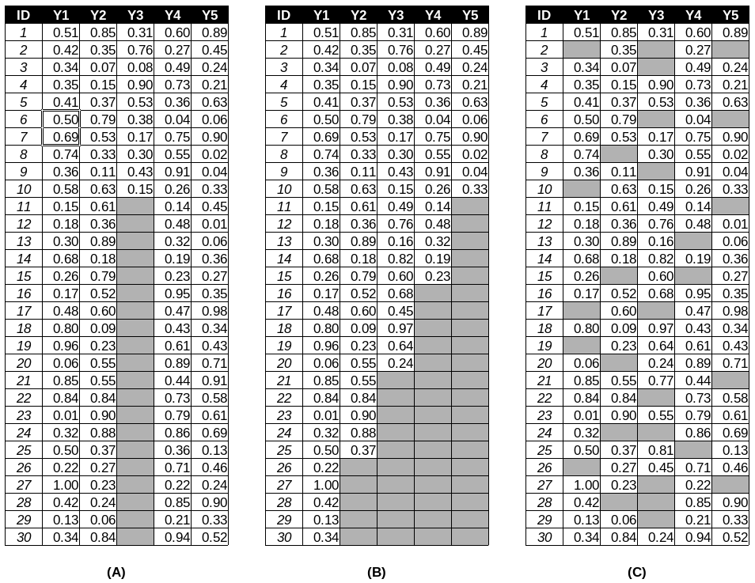
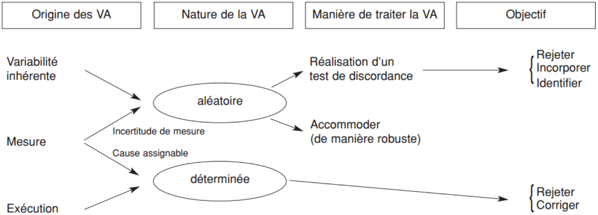
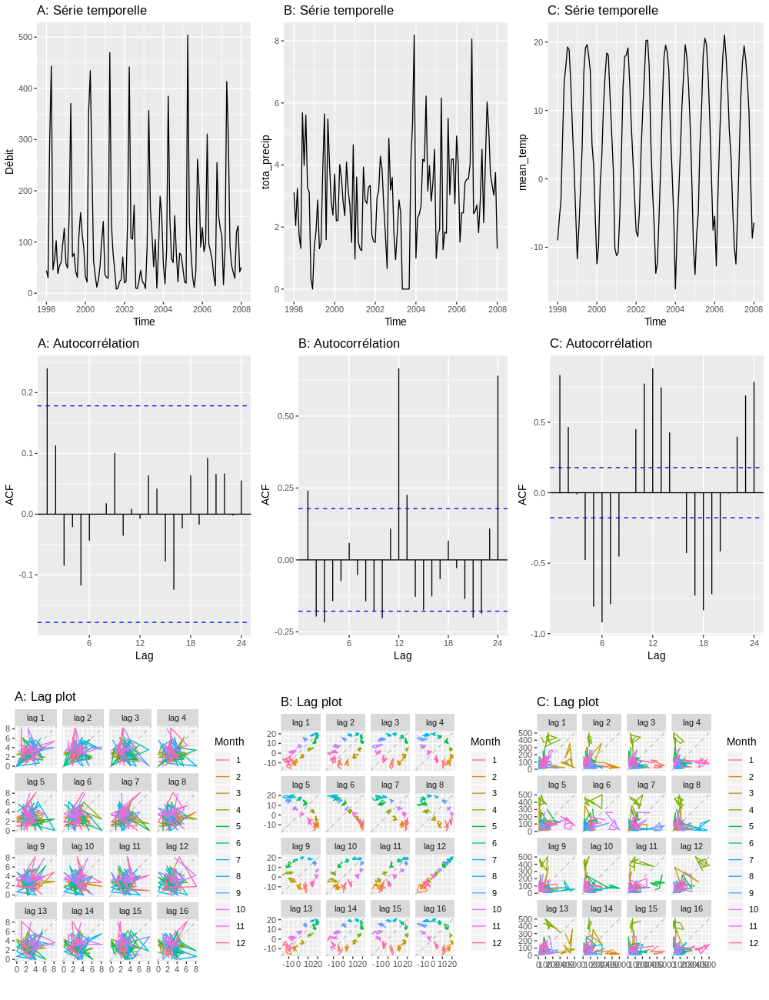

--- 
title: "Analyse et modélisation d'agroécosystèmes"
author: "Serge-Étienne Parent"
date: "`r Sys.Date()`"
site: bookdown::bookdown_site
output: bookdown::gitbook 
description: "Ce cours a pour objectif de former les étudiants gradués en génie agroenvironnemental, génie civil, génie écologique, agronomie, biologie, foresterie et écologie en analyse et modélisation de systèmes vivants. Les sujets traités sont l’introduction au langage de programmation R, l’analyse statistique descriptive, la visualisation, la modélisation inférentielle, prédictive et déterministe."
#bibliography: [book.bib, packages.bib]
#biblio-style: apalike
#link-citations: yes # bookdown::render_book("index.Rmd")
---

# Introduction {#chapitre-intro-cours}

En développant son jeu de la vie (*game of life*) en 1970, John Horton Connway a présenté un exemple percutant que des règles simples peuvent mener à des résultats inattendus. Le jeu consiste à placer des jetons sur les cases d'un plateau de jeu consistant en une simple grille orthogonale. Le jeu évolue en fonction du nombre de jetons présents parmi les huit cases du voisinage des jetons ou des cases vides.

1. Les jetons ayant 0 ou 1 voisin sont retirés.
2. Les jetons ayant 2 ou 3 voisins restent intacts
3. Les jetons ayant plus de 3 voisins sont retirés
4. Un jeton est posé sur les cases ayant exactement 3 voisins 

C'est tout. Selon la manière dont les jetons sont placés au départ, il se peut que la grille se vide de ses jetons, ou que les jetons y prennent beaucoup de place. Il arrive aussi que des cycles réguliers se dégagent ou que l'on se retrouve avec des formes régulières. Vous aurez peut-être compris à ce stade pourquoi le jeu est appelé "jeu de la vie". La première règle est une situation localisée de sous-population, condition dans laquelle la reproduction est difficile. La deuxième règle est une situation localisée stable. La troisième est une situation de surpopulation, où des individus meurent dans un environnement rendu inadéquat par une insuffisance de ressource ou une toxicité excessive. Enfin, la quatrième règle indique une situation favorable à la reproduction.

Une grille vidée correspond à une extinction et une grille remplie correspond à une explosion de population. Une oscillation est un "climax", un état stable en écologie. Un léger changement dans la disposition initiale des jetons peut mener à des solutions différentes.

Le jeu est une application de la technique des *automates cellulaires*. Il se complexifie à mesure que le nombre de jetons grandit. Un humain passera des heures à calculer une seule ronde à 50 jetons, commettra probablement quelques erreurs et prendra quelques cafés. Un processeur pourra gérer des centaines de rondes sur des grilles de centaines de jetons en quelques secondes.

En établissant des règles correspondant aux mécanismes de l'objet étudié, il devient possible de modéliser l'évolution des systèmes vivants, comme l'émergence ou le déclin d'espèces. La figure \@ref(fig:index-cellular-automata) présente un cas simple d'automates cellularies généré dans le langage de programmation R.

```{r index-cellular-automata, out.width="50%", fig.align="center", fig.cap="Simulation avec automates cellulaires [générés en R](https://www.r-bloggers.com/fast-conways-game-of-life-in-r/).", echo = FALSE}
knitr::include_graphics("images/01_conway.gif")
```

## Définitions

Les mathématiques confèrent aux humains une capacité d'abstraction suffisamment complexe pour leur permettre de toucher les étoiles et les atomes, de comprendre le passé et de prédire le futur, de toucher l'infini et de goûter à l'éternité. À partir des maths, on a pu créer des outils de calcul qui permettent de projeter des images de l'univers, bien au-delà de la Voie lactée. Mais appréhender le vivant, tout près de nous, demeure une tâche complexe.

```{r index-ecologie-mathematique, out.width="40%", fig.align="center", fig.cap="Domaines scientifiques de l'écologie mathématique.", echo = FALSE}
knitr::include_graphics("images/01_disciplines.png")
```

L'écologie mathématique couvre un large spectre de domaines (figure \@ref(fig:index-ecologie-mathematique)), mais peut être divisée en deux branches: l'**écologie théorique** et l'**écologie quantitative** ([Legendre et Legendre, 2012](https://www.elsevier.com/books/numerical-ecology/legendre/978-0-444-53868-0)). Alors que l'écologie théorique s'intéresse à l'expression mathématique des mécanismes écologiques, l'écologie quantitative, plus empirique, en étudie principalement les phénomènes. La **modélisation écologique** vise à prévoir une situation selon des conditions données. Faisant partie à la fois de l'écologie théorique et de l'écologie quantitative, elle superpose souvent des mécanismes de l'écologie théorique et des phénomènes empiriques de l'écologie quantitative. L'**écologie numérique** comprend la branche descriptive de l'écologie quantitative, c'est-à-dire qu'elle s'intéresse à évaluer des effets à partir de données empiriques. L'exploration des données dans le but d'y découvrir des structures passe souvent par des techniques multivariées comme la classification hiérarchique ou la réduction d'axe (par exemple, l'analyse en composantes principales), qui sont davantage heuristiques (dans notre cas, **bioheuristique**) que statistiques. Les tests d'hypothèses et l'analyse des probabilités, quant à eux, relèvent de la **biostatistique**.

Le **génie écologique**, une discipline intimement liée à l'écologie mathématique, est voué à l'analyse, la modélisation, la conception et la construction de systèmes vivants dans le but de résoudre de manière efficace des problèmes liés à l'écologie et à une panoplie de domaines qui lui sont raccordés. L'agriculture est l'un de ces domaines. C'est d'emblée la discipline qui sera prisée dans ce manuel. Néanmoins, les principes qui seront discutés sont transférables à l'écologie générale.

## À qui s'adresse ce manuel?

Le cours vise à introduire des étudiant.e.s gradué.e.s en agronomie, biologie, écologie, sols, génie agroenvironnemental, génie civil et génie écologique à l'analyse et la modélisation dans leur domaine, tant pour les appuyer pour leurs travaux de recherche que pour leur fournir une trousse d'outil émancipatrice pour leur cheminement professionnel. Plus spécifiquement, vous serez accompagné à découvrir différents outils numériques qui vous permettront d'appréhender vos données, d'en faire émerger l'information et de construire des modèles. L'objectif de ce cours n'est pas de vous former en mathématique, mais de vous aider à les utiliser. En ce sens, **c'est un cours de pilotage, pas un cours de mécanique**. Vous ferez tout de même un peu de mécanique pour mieux comprendre les réactions de notre machine.

Bien que des connaissances en programmation et en statistiques aideront grandement les étudiant.e.s à appréhender ce document, une littératie informatique n'est pas requise. Dans tous les cas, quiconque voudra tirer profit de ce manuel devra faire preuve d'autonomie. Vous serez guidés vers des ressources et des références, mais je vous suggère vivement de développer votre propre bibliothèque adaptée à vos besoins et à votre manière de comprendre.

## Les logiciels libres

Tous les outils numériques qui sont proposés dans ce cours sont des logiciels libres:

> « Logiciel libre » [free software] désigne des logiciels qui respectent la liberté des utilisateurs. En gros, cela veut dire que les utilisateurs ont la liberté d'exécuter, copier, distribuer, étudier, modifier et améliorer ces logiciels. Ainsi, « logiciel libre » fait référence à la liberté, pas au prix1 (pour comprendre ce concept, vous devez penser à « liberté d'expression », pas à « entrée libre »). - [Projet GNU](https://www.gnu.org/philosophy/free-sw.fr.html)

Donc: codes sources ouverts, développement souvent communautaire, gratuité. Plusieurs [raisons éthiques](https://www.youtube.com/watch?v=Ag1AKIl_2GM), principalement liées au contrôle de l'environnement virtuel par les utilisateurs et les communautés, peuvent justifier l'utilisation de logiciels libres. Plusieurs raisons pratiques justifient aussi cette orientation. Les logiciels libres vous permettent de transporter vos outils avec vous, d'une entreprise à l'autre, au bureau, ou à la maison, et ce, sans vous soucier d'acheter de coûteuses licences.

Il existe tout de même des risques liés aux possibles erreurs dans les codes des logiciels communautaires. Ces risques sont d'ailleurs les mêmes que ceux liés aux logiciels propriétaires. Pour les scientifiques, une erreur peut mener à une étude retirée de la littérature et même, potentiellement, des politiques publiques mal avisées. Pour les ingénieurs, les conséquences pourraient être dramatiques. Mais retenez qu'en toute circonstance, **comme professionnel.le, vous êtes responsable des outils que vous utilisez: vous devez vous assurer de la bonne qualité d'un logiciel, qu'il soit propriétaire ou communautaire**.

Alors que la qualité des logiciels propriétaires est généralement suivie par audits, celle des logiciels libres est plutôt soumise à la vigilance communautaire. Chaque approche a ses avantages et inconvénients, mais elles ne sont pas exclusives. Ainsi les logiciels libres peuvent être audités à l'externe par quiconque décide de le faire. Différentes entreprises, souvent concurrentes, participent tant à cette vigilance qu'au développement des logiciels libres: elles en sont même souvent les instigatrices (comme [RStudio](https://www.rstudio.com/), [Anaconda](https://www.anaconda.com/) et [Enthought](https://www.enthought.com/)).

Par ailleurs, ce manuel est distribué librement sous licence Creative commons, selon les termes suivants.

<a rel="license" href="http://creativecommons.org/licenses/by-nc-sa/4.0/"></a><br /><span xmlns:dct="http://purl.org/dc/terms/" href="http://purl.org/dc/dcmitype/Text" property="dct:title" rel="dct:type">Analyse et modélisation d’agroécosystèmes</span> de <a xmlns:cc="http://creativecommons.org/ns#" href="https://essicolo.github.io/ecologie-mathematique-R/" property="cc:attributionName" rel="cc:attributionURL">Serge-Étienne Parent</a> est mis à disposition selon les termes de la <a rel="license" href="http://creativecommons.org/licenses/by-nc-sa/4.0/">licence Creative Commons Attribution - Pas d’Utilisation Commerciale - Partage dans les Mêmes Conditions 4.0 International</a>.<br />Fondé(e) sur une œuvre à <a xmlns:dct="http://purl.org/dc/terms/" href="https://github.com/essicolo/ecologie-mathematique-R" rel="dct:source">https://github.com/essicolo/ecologie-mathematique-R</a>.

## Langage de programmation

### R

Ce cours est basé sur le langage [R](https://www.r-project.org/). En plus d'être libre, R est un langage de programmation dynamique largement utilisé dans le monde universitaire, et dont l'utilisation s'étend de manière soutenue hors des tours d'ivoire.

> R is also the name of a popular programming language used by a growing number of data analysts inside corporations and academia.  It is becoming their lingua franca partly because data mining has entered a golden age, whether being used to set ad prices, find new drugs more quickly or fine-tune financial models. [New York Times, janvier 2019](https://www.nytimes.com/2009/01/07/technology/business-computing/07program.html)

Son développement est supporté par la [R Foundation for Statistical Computing](https://www.r-project.org/foundation/), basée à l'Université de Vienne. Également, l'équipe de [RStudio](https://www.rstudio.com/) contribue largement au [développement de modules génériques](https://www.rstudio.com/products/rpackages/). R est principalement utilisé pour le calcul statistique, mais les récents développements le rendent un outil de choix pour tout ce qui entoure la science des données, de l'interaction avec les bases de données au déploiement d'outils d'intelligence artificielle en passant par la visualisation. Une fois implémenté avec des modules de calcul scientifique spécialisés en biologie, en écologie et en agronomie (que nous couvrirons au long du cours), R devient un outil de calcul convivial, rapide et fiable.

### Pourquoi pas Python?

La [première mouture de ce cours](https://github.com/essicolo/ecologie-mathematique-Py) se fondait sur le langage Python. Tout comme R, Python est un langage de programmation dynamique prisé pour le calcul scientifique. Python est un langage générique apprécié pour sa polyvalence et sa simplicité. Python est utilisé autant pour créer des logiciels ou des sites web que pour le calcul scientifique. Ainsi, Python peut être utilisé en interopérabilité avec une panoplie de logiciels libres, comme [QGIS](http://www.qgis.org) pour la cartographie et [FreeCAD](https://github.com/FreeCAD/FreeCAD) pour le dessin technique. Il est particulièrement apprécié en ingénierie pour ses modules de calcul par éléments finis (e.g. [FeNICS](https://fenicsproject.org/)) et en bioinformatique pour ses outils liés au séquençage ([scikit-bio](http://scikit-bio.org/)), mais ses lacunes en analyse statistique, en particulier en statistiques multivariées m'ont amené à favoriser R.

Bien que leurs possibilités se superposent largement, ce serait une erreur d'aborder R et Python comme des langages rivaux. Les deux langages s'expriment de manière similaire et s'inspirent mutuellement: apprendre à travailler avec l'un revient à apprendre l'autre. Les spécialistes en calcul scientifique tendent à apprendre à travailler avec plus d'un langage de programmation. Par ailleurs, il existe de plus en plus des moyens de travailler en R et en Python dans un même flux de travail. L'interface de calcul RStudio, que nous utiliserons pendant le cours, permet d'inclure des blocs de code en Python.

### Pourquoi pas Matlab?

Parce qu'on est en `r format(Sys.Date(), "%Y")`.

### Et... SAS?

Parce qu'on est à l'université.

### Mais pourquoi pas ______ ?

D'autres langages, comme [Julia](http://julialang.org), [Scala](http://www.scala-lang.org), [Javascript](https://dtabio.gitbooks.io/data-science-with-javascript/content/) et même [Ruby](http://sciruby.com) sont utilisés en calcul scientifique. Ils sont néanmoins moins garnis et moins documentés que R. Des langages de plus bas niveau, comme Fortran et C++, viennent souvent appuyer les fonctions des autres langages: ces langages sont plus ardus à utiliser au jour le jour, mais leur rapidité de calcul est imbattable.

## Contenu du manuel

Le pire angle avec lequel je pourrais aborder le sujet, c'est avec du code et des formules mathématiques. À travers chacun des chapitres, je tenterai de vous amener à résoudre des problèmes de la manière la plus intuitive possible. Nous aborderons l’analyse et la modélisation inférentielle, prédictive et déterministe appliquée aux agroécosystèmes.

**Chapitre \@ref(chapitre-intro-a-R) - Introduction au langage de programmation R**. Qu'est-ce que R? Comment l'aborder? Quelles sont les fonctionnalités de base et comment tirer profit de tout l'écosystème de programmation?

**Chapitre \@ref(chapitre-tableaux) - Organisation des données et opérations sur des tableaux**. Les tableaux permettent d'enchâsser l'information dans un format prêt-à-porter pour R. Comment les importer, les exporter, les filtrer, et en faire des sommaires?

**Chapitre \@ref(chapitre-visualisation) - Visualisation**. Comment présenter l'information contenue dans un long tableau en un seul coup d'oeil?

**Chapitre \@ref(chapitre-git) - Le travail collaboratif, le suivi de version et la science ouverte**. Ce chapitre offre une introduction à l'utilisation des outils de calcul collaboratif, ainsi qu'un aperçu du système de suivi de version *git* et de son utilisation sur [GitHub](https://github.com/).

**Chapitre \@ref(chapitre-biostats) - Biostatistiques**. Il est audacieux de ne consacrer qu'un seul chapitre sur ce vaste sujet. Nous irons à l'essentiel... pour vous donner les outils qui permettront d'approfondir le sujet.

**Chapitre \@ref(chapitre-biostats-bayes) - Biostatistiques bayésiennes**. Une très brève introduction pour qui est intéressé à l'analyse bayésienne.

**Chapitre \@ref(chapitre-explorer) - Explorer R**. La science des données évolue rapidement. Vous gagnerez à vous tenir au courrant de son évolution, et immanquablement vous vous buterez sur des opérations qui vous sembleront insolubles. Ce chapitre vous accompagnera à rester à jour sur le développement de R, à poser de bonnes questions et proposera des modules intéressants en écologie mathématique.

**Chapitre \@ref(chapitre-ordination) - Association, partitionnement et ordination**. Les écosystèmes diffèrent, mais en quoi sont-ils semblables, et en quoi dffèrent-ils? Ces questions importantes peuvent être abordés par l'écologie numérique, domaine d'étude au sein duquel l'association, le partitionnement et l'ordination sont des outils prédominants.

**Chapitre \@ref(chapitre-outliers) - Détection de valeurs aberrantes et imputation**. Une donnée aberrante sortira du lot, pour une raison ou pour une autre. Comment les détecter de manière systématique? D'autre part, que faire lorsqu'une donnée est manquante? Peut-on l'imputer? Comment?

**Chapitre \@ref(chapitre-temps) - Les séries temporelles**. Les capteurs modernes permettent de générer des données en fonction du temps. Que ce soit des données météorologiques enregistrées quotidiennement ou des données de teneur en eau enregistrées au 5 secondes, les données en fonction du temps forment un signal. Comment analyser ces signaux?

**Chapitre \@ref(chapitre-ml) - L'autoapprentissage**. Les applications de l'intelligence artificielle ne sont limitées que par votre imagination. Encore faut-il l'utiliser intelligemment.

**Chapitre \@ref(chapitre-geo) - Les données spatiales**. Non, nous n'aborderons pas les géostatistiques. Ce chapitre porte plutôt sur l'utilisation de R comme système d'information géographique de base. Nous utiliserons aussi l'autoapprentissage comme outil d'interpolation spatial.

**Chapitre \@ref(chapitre-ode) - La modélisation déterministe**. Les modèles sont des maquettes simplifiées. Comment utiliser les équations différentielles ordinaires pour créer ces maquettes?

Si les chapitres 3 à 5 peuvent être considérés comme fondamentaux pour bien maîtriser R, les autres peuvent être feuilletés à la pièce, bien qu'ils forment une suite logique.

Chaque chapitre de ce manuel est rédigé en format  *R notebook*, dans un environnement RStudio. Pour exécuter les commandes, les vous pourrez soit copier-coller les commandes dans R (ou RStudio), soit [télécharger les fichiers-sources](https://github.com/essicolo/ecologie-mathematique-R) et exécuter les blocs de code.

## Objectifs généraux

À la fin du cours, l'étudiant.e sera en mesure:

- de programmer en langage R
- d'importer, de manipuler (sélection des colonnes, filtres, sommaires statistiques) et d'exporter des tableaux
- de générer des graphiques d'utilisation commune
- d'appréhender des données écologiques et agronomiques à l'aide de tests statistiques fréquentiels
- d'explorer par lui.elle-même les possibilités offertes par la communauté de développement de modules R
- d'explorer les données à l'aide des outils de l'écologie numérique (association, partitionnement et ordination)
- d'imputer des données manquantes dans un tableau et de détecter des valeurs aberrantes
- d'effectuer une analyse de série temporelle
- de s'assurer que ses calculs soit auditables et reproductibles dans une perspective de science ouverte
- de créer un modèle d'autoapprentissage
- d'intrapoler des données spatiales
- de modéliser des équations différentielles ordinaires

## Lectures complémentaires

### Écologie mathématique

- [How to be a quantitative ecologist](). Jason Mathipoulos vous prend par la main pour découvrir les notions de mathématiques fondamentales en écologie, appliquées avec le langage R.  
- [Numerical ecology](https://www.elsevier.com/books/numerical-ecology/legendre/978-0-444-53868-0). L'ouvrage hautement détaillé des frères Legendre est non seulement fondamental, mais aussi fondateur d'une science qui évolue encore aujourd'hui: l'analyse des données écologiques.
- [A practical guide to ecological modelling](http://www.springer.com/us/book/9781402086236). Soetaert et Herman portent une attention particulière à la présentation des principes de modélisation dans un langage accessible - ce qui est rarement le cas dans le domaine de la modélisation. Les modèles présentés concernent principalement les bilans de masse, en termes de systèmes de réactions chimiques et de relations biologiques.
- [Modélisation mathématique en écologie](http://www.documentation.ird.fr/hor/fdi:010050350). Rare livre en modélisation écologique publié en français, la première partie s'attarde aux concepts mathématiques, alors que la deuxième planche à les appliquer. Si le haut niveau d'abstraction de la première partie vous rebute, n'hésitez pas débuter par la seconde partie et de vous référer à la première au besoin.
- [A new ecology: systems perspective](https://www.elsevier.com/books/a-new-ecology/jorgensen/978-0-444-53160-5). Principalement grâce au soleil, la Terre forme un ensemble de gradients d'énergie qui se déclinent en des systèmes d'une étonnante complexité. C'est ainsi que le regretté Sven Erik Jørgensen (1934-2016, figure \@ref(fig:se-jorgensen)) et ses collaborateurs décrivent les écosystèmes dans cet ouvrage qui fait suite aux travaux fondateurs de Howard Thomas Odum.
- Ecological engineering. Principle and Practice.
- Ecological processes handbook.
- Modeling complex ecological dynamics

```{r se-jorgensen, out.width="25%", fig.align="center", fig.cap="Sven Erik Jørgensen, Source: [Elsevier](http://scitechconnect.elsevier.com/in-memoriam-of-dr-sven-erik-jorgensen/).", echo = FALSE}
knitr::include_graphics("images/01_sven-jorgensen.png")
```

### Programmation

- [R for data science](http://r4ds.had.co.nz/). L'analyse de données est une branche importante de l'écologie mathématique. Ce manuel traite des matrices et la manipulation de données chapitre 3), de la visualisation (chapitre 4) ainsi que de l'apprentissage automatique (chapitre 11). *R for data science* repasse ces sujets plus en profondeur. En particulier, l'ouvrage de [Garrett Grolemund](https://twitter.com/StatGarrett) et [Hadley Wickham](https://twitter.com/hadleywickham) offre une introduction au module graphique `ggplot2`.
- [Numerical ecology with R](http://www.springer.com/la/book/9781441979759). Daniel Borcard enseigne l'écologie numérique à l'Université de Montréal. Son cours est condensé dans ce livre recettes voué à l'application des principes lourdement décrits dans [Numerical ecology](https://www.elsevier.com/books/numerical-ecology/legendre/978-0-444-53868-0).

### Divers

- [The truthful art](http://www.thefunctionalart.com/p/the-truthful-art-book.html). Dans cet ouvrage, Alberto Cairo s'intéresse à l'utilisation des données et de leurs présentations pour fournir une information adéquate à différents publics.

## Besoin d'aide?

Les ouvrages de référence reconnus vous offrent des bases solides sur lesquelles vous pouvez vous appuyer dans vos travaux. Mais au-delà des principes, au jour le jour, vous vous buterez immanquablement à toutes sortes de petits problèmes. Quel module utiliser pour cette tâche précise? Que veut dire ce message d'erreur? Comment interpréter ce résultat? Pour tous les petits accrocs du quotidien en calcul scientifique, internet offre de nombreuses ressources qui sont très hétérogènes en qualité. Vous apprendrez à reconnaître les ressources fiables à celles qui sont douteuses. Les plateformes basées sur Stack Exchange, comme [Stack Overflow](https://stackoverflow.com) et [Cross Validated](https://stats.stackexchange.com), m'ont souvent été d'une aide précieuse. Vous aurez avantage à vous construire une petite banque d'information ([Turtl](https://turtlapp.com/), [Notion](https://www.notion.so/), [Evernote](https://evernote.com/), Google Keep, One Note, etc.) en collectant des liens, en prenant en notes certaines recettes et en suivant des sites d'intérêt avec des flux RSS.

## À propos de l'auteur

Je m'appelle Serge-Étienne Parent. Je suis ingénieur écologue et professeur adjoint au Département des sols et de génie agroalimentaire de l'Université Laval, Québec, Canada. Je crois que la science est le meilleur moyen d'appréhender le monde pour prendre des décisions avisées.

## Un cours complémentaire à d'autres cours

Ce cours a été développé pour ouvrir des perspectives mathématiques en écologie et en agronomie à la FSAA de l'Université Laval. Il est complémentaire à certains cours offerts dans d'autres institutions académiques au Québec, dont ceux-ci.

- [BIO2041. Biostatistiques 1](https://admission.umontreal.ca/cours-et-horaires/cours/bio-2041/), Université de Montréal
- [BIO2042. Biostatistiques 2](https://admission.umontreal.ca/cours-et-horaires/cours/BIO-2042/), Université de Montréal
- [BIO109. Introduction à la programmation scientifique](https://github.com/EcoNumUdS/BIO109), Université de Sherbrooke
- [BIO500. Méthodes en écologie computationnelle](https://github.com/EcoNumUdS/BIO500), Université de Sherbrooke.

## Contribuer au manuel

Je suis ouvert aux commentaires et suggestions. Pour contribuer directement, dirigez-vous sur le dépôt du manuel sur [GitHub](https://github.com), puis ouvrez une *Issue* pour en discuter. Créez une nouvelle branche (*fork*), effectuez les modifications, puis lancer une requête de fusion (*pull resquest*).

<!--chapter:end:index.Rmd-->

--- 
site: bookdown::bookdown_site
output: bookdown::gitbook 
---

# La science des données avec R {#chapitre-intro-a-R}

 ***
️\ **Objectifs spécifiques**:

À la fin de ce chapitre, vous

- saurez contextualiser la science des données par rapport aux statistiques,
- serez en mesure de vous lancer dans un environnement de programmation R,
- serez en mesure d'effectuer des opérations de base en R,
- saurez différencier les grands types d'objets de R et
- saurez installer et charger des modules complémentaire.

 ***

Un projet en science des données comprend trois grandes étapes. D'abord, vous devez **collecter des données** et vous les compilez adéquatement. Cela peut consister à télécharger des données existantes, exécuter un dispositif expérimental ou effectuer une recensement (étude observationnelle). Compiler les données dans un format qui puisse être importé est une tâche souvent longue et fastidieuse. Puis, vous **investiguez les données** collectées, c'est-à-dire vous les visualisez, vous appliquez des modèles et testez des hypothèses. Enfin, la **communication des résultats** consiste à présenter les connaissances qui émergent de votre analyse sous forme visuelle et narrative, *avec un langage adapté à la personne qui vous écoute*, qu'elle soit experte ou novice, réviseure de revue savante ou gestionnaire [Grolemund et Wickham (2018)](http://r4ds.had.co.nz/introduction.html) propose la structure d'analyse de la figure \@ref(fig:R-data-flow-chart), avec de légères modifications de ma part.

```{r R-data-flow-chart, out.width="100%", fig.align="center", fig.cap="Flux des données en sciences des données.", echo = FALSE}
knitr::include_graphics("images/02_science-des-donnees-flow_.png")
```

Le grand cadre spécifie **Programmer**. Oui, vous aurez besoin d'écrire du code. Mais comme je l'ai indiqué dans le premier chapitre, ceci n'est pas un cours de programmation et je préférerai les approches intuitives.

## Statistiques ou science des données?

Selon [Whitlock et Schluter (2015)](http://whitlockschluter.zoology.ubc.ca/), la statistique est l'*étude des méthodes pour décrire et mesurer des aspects de la nature à partir d'échantillon*. Pour [Grolemund et Wickham (2018)](http://r4ds.had.co.nz/introduction.html), la science des données est *une discipline excitante permettant de transformer des données brutes en compréhension, perspectives et connaissances*. Oui, *excitante*! La différence entre les deux champs d'expertise est subtile, et certaines personnes n'y voient qu'une différence de ton.

<blockquote class="twitter-tweet" data-lang="fr"><p lang="en" dir="ltr">Data Science is statistics on a Mac.</p>&mdash; Big Data Borat (@BigDataBorat) <a href="https://twitter.com/BigDataBorat/status/372350993255518208?ref_src=twsrc%5Etfw">27 août 2013</a></blockquote>
<script async src="https://platform.twitter.com/widgets.js" charset="utf-8"></script>

Confinées à ses applications traditionnelles, les statistiques sont davantage vouées à la définition de dispositifs expérimentaux et à l'exécution de tests d'hypothèses, alors que la science des données est moins linéaire, en particulier dans sa phase d'analyse, où de nouvelles questions (donc de nouvelles hypothèses) peuvent être posées au fur et à mesure de l'analyse. Cela arrive généralement davantage lorsque l'on fait face à de nombreuses observations sur lesquelles de nombreux paramètres sont mesurés.

La quantité de données et de mesures auxquelles nous avons aujourd'hui accès grâce aux technologies de mesure et de stockage relativement peu dispendieux rend la science des données une discipline particulièrement attrayante, pour ne pas dire [sexy](https://hbr.org/2012/10/data-scientist-the-sexiest-job-of-the-21st-century).

## Débuter en R

[R](https://www.r-project.org) est un langage de programmation dérivé du langage S, qui fut initialement lancé en 1976.

```{r R-logo, out.width="25%", fig.align="center", fig.cap="Logo officiel du language R.", echo = FALSE}
knitr::include_graphics("images/02_R_logo.svg.png")
```

R figure parmi [les langages de programmation les plus utilisés au monde](https://www.tiobe.com/tiobe-index/). Bien qu'il soit basé sur les langages statiques C et Fortran, R est un langage dynamique, c'est-à-dire que le code peut être exécuté ligne par ligne ou bloc par bloc: un avantage majeur pour des activités qui nécessitent des interactions fréquentes. Bien que R soit surtout utilisé pour le calcul statistique, il s'impose de plus en plus comme outil privilégié en sciences des données en raison des récents développements de modules d'analyse, de modélisation et de visualisation, dont plusieurs seront utilisés dans ce manuel.

Un langage de programmation s'apprend un peu comme une langue. Au début, un code R peut sembler incompréhensible. Et face à son clavier, on ne sait pas trop comment exprimer ce que l'on désire. Au fur et à mesure de l'apprentissage, les symboles, les fonctions et le style deviennent de plus en plus familiers et on apprend tranquillement à traduire en code ce que l'on désire effectuer. Comme une langue s'apprend en la parlant dans la vie de tous les jours, un language de programmation s'apprend avantageusement en solutionnant vos propres problèmes.

```{r R-first-and-then, out.width="100%", fig.align="center", fig.cap="R avant et maintenant, Illustration de [Allison Horst](https://github.com/allisonhorst/stats-illustrations)", echo = FALSE}
knitr::include_graphics("images/02_r_first_then.png")
```

## Préparer son flux de travail

Il existe de nombreuses manières d'utiliser R. Parmi celles-ci, j'en couvrirai 3:

- Installation classique (installation suggérée)
- Installation avec Anaconda
- Utilisation infonuagique

### Installation classique

**Installation suggérée**. Sur Windows ou Mac, dirigez-vous [ici](https://cloud.r-project.org/), téléchargez et installez. Sur Linux, ouvrez votre gestionnaire d'application, chercher `r-base` (Ubuntu, Debian), `R-base` (openSuse) ou `R-core` (Fedora) et installez-le (assurez-vous que les librairies suivantes sont aussi installées: `gcc`, `gcc-fortran`, `gcc-c++` et `make`), vous aurez peut-être besoin d'installer des librairies supplémentaires pour faire fonctionner certains modules.

> **Note**. Les modules présentés dans ce cours devraient être disponibles sur Linux, Windows et Mac. Ce n'est pas le cas pour tous les modules R. La plupart fonctionnent néanmoins sur Linux, dont les systèmes d'opération (je recommande [Ubuntu](https://www.ubuntu.com/download/desktop) ou l'une de ses dérivées comme [elementary OS](https://elementary.io/)) sont de bonnes options pour le calcul scientifique.

À cette étape, R devrait fonctionner dans un interpréteur de commande . Si vous lancez R dans un terminal (chercher `cmd` dans le menu si vous êtes sur Windows), vous obtiendrez quelque chose comme ceci.

```{r R-terminal, out.width="100%", fig.align="center", fig.cap="R dans le terminal.", echo = FALSE}
knitr::include_graphics("images/02_terminal-prompt.png")
```

Le symbole `>` indique que R attend que vos instructions. Vous voilà dans un état méditatif devant l'indéchiffrable vide du terminal 😵. Ne vous en faites pas: nous commencerons bientôt à jaser avec R.

Avant cela, installons-nous au salon. Afin de travailler dans un environnement de travail plus confortable, je recommande l'installation de l'interface [RStudio](https://www.rstudio.com/products/rstudio/download/), gratuite et open source: téléchargez l'installateur et suivez les instructions. RStudio ressemble à ceci.

```{r R-rstudio, out.width="100%", fig.align="center", fig.cap="Fenêtre de RStudio.", echo = FALSE}
knitr::include_graphics("images/02_rstudio.png")
```

En haut à droite se trouve un menu *Project (None)*. Il s'agit d'un menu de vos projets. Je recommande d'utiliser ces projets avec RStudio, qui vous permettront de mieux gérer vos sessions de travail, en particulier en lien avec les chemins vers de vos données, graphiques, etc., que vous pouvez gérer relativement à l'emplacement de votre dossier de projet plutôt qu'à l'emplacement des fichiers sur votre machine: nous verrons plus en détails au chapitre \@ref(chapitre-git).

- En haut à gauche, vous avez vos feuilles de calcul, qui apparaîtront en tant qu'onglets. Une feuille de calcul est une série de commandes que vous lancez en séquence. Il peut aussi s'agir d'un livre de calcul (*notebook*) si vous choisissez de travailler en format *R markdown*. Ce format vous permettra de d'écrire du texte en format [*Markdown*](https://github.com/adam-p/markdown-here/wiki/Markdown-Here-Cheatsheet) entre des blocs de code. Il est question du format *R markdown* au chapitre \ref(chapitre-git).
- En bas à gauche apparaît la Console, où vous voyez les commandes envoyées à R ainsi que ses sorties.
- En haut à droite, les différents onglets indiquent où vous en êtes dans vos calculs. En particulier, la liste sous *Environment* indique les objets qui ont été générés ou chargés jusqu'alors.
- En bas à droite, on retrouve des onglets de nature variés. *Files* contient les sous-dossiers et fichiers du dossier de projets. *Plots* est l'endroit où apparaîtront vos graphiques. *Packages* contient la liste des modules déjà installés, ainsi qu'un outil de gestion des modules pour leur installation, leur désinstallation et leur mise à jour. *Help* affiche les fiches d'aide des fonctions (pour obtenir de l'aide sur une fonction dans RStudio, surlignez la fonction dans votre feuille de calcul, puis appuyez sur `F1`). Enfin, l'onglet *Viewer* affichera les sorties HTML, en particulier les graphiques interactifs que vous générerez par exemple avec le module `plotly`. Si votre environnement de travail était un avion, R serait le moteur et RStudio serait le cockpit!

```{r R-fifi, out.width="100%", fig.align="center", fig.cap="Scène de Fifi Brindacier ([Astrid Lindgren, 1945](https://fr.wikipedia.org/wiki/Fifi_Brindacier)).", echo = FALSE}
knitr::include_graphics("https://media.giphy.com/media/GmaV9oet9MAmI/giphy.gif")
```

### Installation avec Anaconda

Si vous cherchez une trousse complète d'analyse de données, comprenant R et Python, vous pourrez préférer [Anaconda](https://www.anaconda.com/download/#linux). Une fois installée, vous pourrez isoler un environnement de travail sur R, ou même isoler des environnements de travail particuliers pour vos projets. Une manière conviviale de créer des environnements de travail est de passer par l'interface *Anaconda navigator*, que vous lancerez soit dans le menu Windows, soit en ligne de commande `anaconda-navigator` sous Mac et Linux, puis d'installer `r-essentials`, `rstudio` et `jupyterlab` dans l'onglet *Environment*. Vous pourrez aussi installer `RStudio` et `Jupyter lab` via l'onglet *Home* de `Anaconda navigator`. Dans l'environnement de base, installez le package `nb_conda_kernels` pour vous assurer que tous les noyaux (R, Python, etc.) installés dans les environnements de travail soient automatiquement accessibles dans Jupyter. Si vous désirez utiliser dans Jupyter la version de R installée avec l'installation classique, référez-vous au guide présenté [en extra au bas de la page](#extra-jupyter).

```{r R-anaconda, out.width="100%", fig.align="center", fig.cap="Anaconda navigator.", echo = FALSE}
knitr::include_graphics("images/02_anaconda-navigator.png")
```

*Jupyter lab* est une interface notebook semblable à *R markdown*  - les format *Jupyter* (`*.ipynb`) et *R markdown* (`*.Rmd`) sont par ailleurs convertibles grâce au module [jupytext](https://towardsdatascience.com/introducing-jupytext-9234fdff6c57). L'utilisation de R en Anaconda n'est pas tout à fait au point, et pourrait poser problème pour l'installation de certains modules. Si vous optez pour cette option, préparez-vous à avoir à bidouiller un peu. Plusieurs préfèrent Jupyter à RStudio (ce n'est pas mon cas).

### Utilisation infonuagique

Pas besoin d'avoir une machine super puissante pour travailler en R. Il existe [une multitude de services infonuagiques](https://github.com/markusschanta/awesome-jupyter#hosted-notebook-solutions) (dans le *cloud*) vous permettant de lancer vos calculs sur des serveurs plutôt que sur votre Chromebook ou votre vieux laptop déglingué. Certains services sont gratuits, et d'autres souvent plus élaborés sont payants.

Un service gratuit qui fonctionne bien en R est [Azure Notebooks](https://notebooks.azure.com), offert par Microsoft. Vous y aurez accès avec un compte Microsoft ou un compte Exchange (par exemeple avec un IDUL de l'Université Laval). Azure notebooks offre des dossiers comportant des notebooks de type Jupyter ainsi que des fichiers de données. Les dossiers peuvent être rendus publics et clônésŝ par des collègues. Le travail collaboratif n'est pas disponible.

Pour collaborer en temps réel dans un document, vous pourrez utiliser Google Colaboratory, offert gratuitement par Google. Bien que les noyaux de calcul soient seulement offerts de manière explicite pour Python, vous pouvez [clôner ou importer un notebook conçu pour fonctionner en R](https://stackoverflow.com/a/54595286), et un noyau R sera chargé. Il vous faudra [bidouiller un peu pour charger vos données depuis Google drive ou votre ordinateur](https://colab.research.google.com/notebooks/io.ipynb). Un avantage de Google Colaboratory est que vous pouvez spécifier que vous désirez que vos calculs tournent sur un processeur graphique, utile pour les calculs lourds et parallélisables comme les réseaux neuronnaux. Si je viens de vous perdre, pas de problème, c'est de l'extra.

Si vous désirer autant que possible rester indépendant des géants du web, [CoCalc](https://cocalc.com/) est une option avec un volet gratuit et un autre payant.

## Premiers pas avec R

R ne fonctionne pas avec des menus, en faisant danser une souris sous une musique de clics. Vous devrez donc entrer des commandes avec votre clavier, que vous apprendrez par cœur au fur et à mesure, ou que vous retrouverez en lançant des recherches sur internet. Par expérience personnelle, lorsque je travaille avec R, j'ai toujours un navigateur ouvert prêt à recevoir une question.

Les étapes qui suivent sont des premiers pas. Elles ne feront pas de vous des *ceintures noires* delà programmation. La plupart des utilisateurs de R ont appris R en se pratiquant sur leurs données, en frappant des murs, en apprenant comment les escalader ou les contourner...

Pour l'instant, ouvrez seulement un interpréteur de commande, et lancez R. Voyons si R est aussi libre qu'on le prétend.

> "La liberté, c’est la liberté de dire que deux et deux font quatre. Si cela est accordé, tout le reste suit." - George Orwell, 1984

```{r intro-sum}
2 + 2
```

Et voilà.


Les opérations mathématiques sont effectuées telles que l'on devrait s'attendre.

```{r intro-operations}
67.1 - 43.3

2 * 4

1 / 2
```

L'exposant peut être noté `^`, comme c'est le cas dans *Excel*, ou `**` comme c'est le cas en Python.

```{r intro-power}
2^4
```

```{r intro-power-alt}
2**4
```

```{r intro-division}
1 / 2 # utilisez des espaces de part et d'autre des opérateurs (sauf pour l'exposant) pour éclaircir le code
```

R ne lit pas ce qui suit le caractère `#`. Cela vous laisse l'opportunité de commenter un code comprenant une séquence de plusieurs lignes. Remarquez également que la dernière opération comporte des espaces entre les nombres et l'opérateur `/`. Dans ce cas (ce n'est pas toujours le cas), les espaces ne signifient rien: ils aident seulement à éclaircir le code. Il existe des guides pour l'écriture de code en R. Je recommande le guide de style de [Hadley Wickahm](http://adv-r.had.co.nz/Style.html).

Assigner des objets à des variables est fondamental en programmation. En R, on assigne traditionnellement avec la flèche `<-`, mais vous verrez parfois le `=`, qui est davantage utilisé comme standard dans d'autres langages de programmation. Par exemple.

```{r intro-assignation}
a <- 3
```

Techniquement, `a` pointe vers le nombre entier 3. Conséquemment, on peut effectuer des opérations sur `a`.

```{r intro-assignation-mult}
a * 6
```

```{r intro-sensible-a-la-case}
# A + 2
```

Le message d'erreur nous dit que `A` n'est pas défini. Sa version minuscule, `a`, l'est pourtant. La raison est que R considère la *case* dans la définition des objets. Utiliser la mauvaise case mène donc à des erreurs.

**Note**. Les messages d'erreur ne sont pas toujours clairs, mais vous apprendrez à les comprendre. Dans tous les cas, ils sont fait pour vous aider. Lisez-les attentivement!

En général, le nom d'une variable doit toujours commencer par une lettre, et ne doit pas contenir de caractères réservés (espaces, `+`, `*`). Dans la définition des variables, plusieurs utilisent des symboles `.` pour délimiter les mots, mais la barre de soulignement `_` est à préférer. En effet, dans d'autres langages de programmation comme Python, le `.` a une autre signification: son utilisation est à éviter autant que possible.

**Note**. À ce stade, vous serez probablement plus à l'aise de copier-coller ces commandes dans votre terminal.

```{r intro-bloc-calcul}
rendement_arbre <- 50 # pomme/arbre
nombre_arbre <- 300 # arbre
nombre_pomme <- rendement_arbre * nombre_arbre
nombre_pomme
```

Comme chez la plupart des langages de programmation, R respecte les conventions des [priorités des opérations mathéatiques](https://fr.wikipedia.org/wiki/Ordre_des_op%C3%A9rations).

```{r intro-priorite-des-operations}
10 - 9^0.5 * 2
```

### Types de données

Jusqu'à maintenant, nous n'avons utilisé que des **nombres entiers** (*integer* ou `int`) et des **nombres réels** (*numeric* ou `float64`). R inclut d'autres types. La **chaîne de caractère** (*string* ou *character*) contient un ou plusieurs symboles. Elle est définie entre des doubles guillemets `" "` ou des apostrophes `' '`. Il n'existe pas de standard sur l'utilisation de l'un ou de l'autre, mais en règle générale, on utilise les apostrophes pour les expressions courtes, contenant un simple mot ou séquence de lettres, et les guillemets pour les phrases. Une raison pour cela: les guillemets sont utiles pour insérer des apostrophes dans une chaîne de caractère.

```{r intro-paste}
a <- "L'ours"
b <- "polaire"
paste(a, b)
```

On *colle* `a` et `b` avec la fonction `paste`. Notez que l'objet `a` a été défini précédemment. Il est possible en R de réassigner une variable, mais cela peut porter à confusion, jusqu'à générer des erreurs de calcul si une variable n'est pas assignée à l'objet auquel on voulait référer.

Combien de caractères contient la chaîne `"L'ours polaire"`? R sait compter. Demandons-lui.

```{r introchar-count}
c <- paste(a, b)
nchar(c)
```

Quatorze, c'est bien cela (comptez "L'ours polaire", en incluant l'espace). Comme `paste`, `nchar` est une fonction incluse par défaut dans l'environnement de travail de R: plus précisément, ces fonctions sont incluses dans le module `base`, inclut par défaut lorsque R est lancé. La fonction est appelée en écrivant `nchar()`. Mais une fonction de quoi? Des *arguments*, qui se trouvent entre les parenthèses. Dans ce cas, il y a un seul argument: `c`.

En calcul scientifique, il est courant de lancer des requêtes sur si un résultat est vrai ou faux.

```{r intro-bool}
a <- 17
a < 10
a > 10
a == 10
a != 10
a == 17
!(a == 17)
```

Je viens d'introduire un nouveau type de donnée: les données booléennes (*boolean*, ou `logical`), qui ne peuvent prendre que deux états - `TRUE` ou `FALSE`. En même temps, j'ai utilisé la fonction `print` parce que dans mon carnet, seule la dernière opération permet d'afficher le résultat. Si l'on veut forcer une sortie, on utilise `print`. Puis, on a vu plus haut que le symbole `=` est réservé pour assigner des objets: pour les tests d'égalité, on utilise le double égal, `==`, ou `!=` pour la non-égalité. Enfin, pour inverser une donnée de type booléenne, on utilise le point d'exclamation `!`.

### Les collections de données

Les exercices précédents ont permis de présenter les types de données offerts par défaut sur R qui sont les plus importants pour le calcul scientifique: `int` (*integer*, ou nombre entier), `numeric` (nombre réel), `character` (*string*, ou chaîne de caractère) et `logical` (booléen). D'autres s'ajouteront tout au long du cours, comme les catégories (`factor`) et les unités de temps (date-heure).

Lorsque l'on procède à des opérations de calcul en science, nous utilisons rarement des valeurs uniques. Nous préférons les organiser et les traiter en collections. Par défaut, R offre quatre types importants de collections: les **vecteurs**, les **matrices**, les **listes** et les **tableaux**.

#### Vecteurs

D'abord, les **vecteurs** sont une série de variables de même type. Un vecteur est délimité par la fonction `c( )` (`c` pour **c**oncaténation). Les éléments de la liste sont séparés par des virgules.

```{r intro-vector}
espece <- c("Petromyzon marinus", "Lepisosteus osseus", "Amia calva", "Hiodon tergisus")
espece
```

Pour accéder aux éléments d'une liste, appelle la liste suivie de la position de l'objet désiré entre crochets.

```{r intro-vect-index}
espece[1]
espece[2]
espece[1:3]
espece[c(1, 3)]
```

On peut noter que le premier élément de la liste est noté `1`, et non `0` comme c'est le cas de la plupart de langages. Le raccourcis `1:3` crée une liste de nombres entiers de `1` à `3` inclusivement, c'est-à-dire l'équivalent de `c(1, 2, 3)`. En effet, on crée une liste d'indices pour soutirer des éléments d'une liste. On peut utiliser le symbole de soustraction pour retirer un ou plusieurs éléments d'un vecteur.

```{r intro-vect-index-vect}
espece[-c(1, 3)]
```

Pour ajouter un élément à notre liste, on peut utiliser la fonction `c( )`.

```{r intro-vector-add}
espece <- c(espece, "Cyprinus carpio")
espece
```

Notez que l'on efface l'objet `espece` par une concaténation de l'objet `espece`, précédemment définie, et d'un autre élément.

En lançant `espece[3] <- "Lepomis gibbosus"`, il est possible de changer un élément de la liste.

```{r intro-vet-change}
espece[3] <- "Lepomis gibbosus"
espece
```

#### Matrices

Une **matrice** est un vecteur de dimension plus élevée que 1. En écologie, on dépasse rarement la deuxième dimension, quoi que les matrices en `N` dimensions soient courantes en modélisation mathématique. Je ne considérerai pour le moment que des matrices `2D`. Comme c'est la cas des vecteurs, les matrices contiennent des valeurs de même type. En R, on peut attribuer aux matrices `2D` des noms de ligne et de colonne.

```{r intro-mat}
mat <- matrix(c(1, 2, 3, 4, 5, 6, 7, 8, 9, 10, 11, 12), ncol = 3)
mat
```

```{r intro-mat-def}
colnames(mat) <- c("A", "B", "C")
rownames(mat) <- c("site_1", "site_2", "site_3", "site_4")
mat
```

On peut soutirer les noms de colonne et les noms de ligne. Le résultat est un vecteur.

```{r intro-mat-def-getnames}
colnames(mat)
rownames(mat)
```

#### Listes

Les **listes** sont des collections hétérogènes dans lesquelles on peut placer les objets désirés, sans distinction: elles peuvent même inclure d'autres listes. Chacun des éléments de la liste peut être identifié par une clé.

```{r intro-list}
ma_liste <- list(
  especes = c(
    "Petromyzon marinus", "Lepisosteus osseus",
    "Amia calva", "Hiodon tergisus"
  ),
  site = "A101",
  stations_meteos = c("746583", "783786", "856363")
)
ma_liste
```

Les éléments de la liste peuvent être soutirés par le nom de la clé ou par l'indice, de cette manière.

```{r intro-list-index}
ma_liste$especes
ma_liste[[1]]
```

**Exercice**. Accéder au deuxième élément du vecteur d'espèces dans la liste ma_liste.

#### Tableaux

Enfin, le type de collection de données le plus important est le tableau, ou `data.frame`. Techniquement, il s'agit d'une liste composée de vecteurs de même longueur. Chaque colonne peut ainsi prendre un type de donnée indépendamment des autres colonnes.

```{r intro-df}
tableau <- data.frame(
  espece = c(
    "Petromyzon marinus", "Lepisosteus osseus",
    "Amia calva", "Hiodon tergisus"
  ),
  poids = c(10, 13, 21, 4),
  longueur = c(35, 44, 50, 8)
)
tableau
```

En programmation classique en R (nous verrons plus loin la méthode `tidyverse`), les éléments d'un tableau se manipulent comme ceux d'une matrice et les colonnes peuvent être appelés comme les éléments d'une liste.

```{r intro-df-col}
tableau[, 2:3]
tableau$poids
```

Vous verrez aussi, quoi que rarement, ce format, qui à la différence du format `$` génère un tableau.

```{r intro-df-col2}
tableau["poids"]
```

Le tableau est le format de collection à privilégier pour manipuler des données. Récemment, le format de tableau `tibble` a été créé par l'équipe de RStudio pour offrir un format plus moderne.

### Les fonctions

Lorsque vous écrivez une commande suivit de parenthèses, comme `data.frame(especes = ...)`, vous demandez à R de passer à l'action en appelant une fonction. De manière très générale, une fonction transforme quelque chose en quelque chose d'autre (figure \@ref(fig:intro-fonction)).

```{r intro-fonction, out.width="25%", fig.align="center", fig.cap="Schéma simplifié d'une fonction.", echo = FALSE}
knitr::include_graphics("images/images/02_fonctions_io_.png")
```

Par exemple, la fonction `mean()` prend une collection de nombre comme entrée, puis en sort vous devinez quoi.

```{r intro-mean}
mean(tableau$poids)
```

Les entrées sont appelés les **arguments** de la fonction. Leur définition est toujours disponible dans la documentation.

**Exercice**. Familiarisez-vous avec la documentation de R en lançant `?mean`. Truc: si vous avez pris de l'avance et que vous travaillez déjà en RStudio, mettez le terme en surbrillance, puis appuyez sur F1.

Vous verrez dans la documentation que la fonction `mean()` demande trois arguments, `x`, `trim` et `na.rm`. Or nous avons seulement placé un vecteur, sans spécifier d'argument!

En effet. En l'absence d'une définition des arguments, R supposera que les arguments dans la parenthèse, séparés par une virgule, sont présentés dans le même ordre que celui spécifié dans la définition de la fonction (celle qui est présentée dans le fichier d'aide). Dans le cas qui nous intéresse, `mean(tableau$poids)` est équivalent à `mean(x = tableau$poids)`.

Maintenant, selon la fiche d'aire l'argument `na.rm` est un valeur logique spécifiant si oui (`TRUE`) ou non (`FALSE`) les valeurs manquantes doivent être considérées (une moyenne d'un vecteur comprenant au moins un `NA` sera de `NA`). En ne spécifiant rien, R prend la valeur par défaut, telle que spécifiée dans la documentation. Il en va de même que l'argument `trim`, qui permet d'élaguer des valeurs extrêmes. Dans la fiche d'aide,  `mean(x, trim = 0, na.rm = FALSE, ...)` signifie que par défaut, l'argument `x` est vide (il doit donc être spécifié), l'argument `trim` est de 0 et l'argument `na.rm` est `FALSE`.

```{r intro-mean-2}
mean(c(6, 1, 7, 4, 9, NA, 1))
mean(c(6, 1, 7, 4, 9, NA, 1), na.rm = TRUE)
```

Vous n'êtes pas emprisonné par les fonctions offertes par R. Vous pouvez installer des modules qui complètent les fonctions de base de R: on le verra un peu plus loin dans ce chapitre. Mais pour l'instant, voyons comment vous pouvez créer vos propres fonctions. Disons que vous voulez créer une fonction qui calcule la sortie de $x^3-2y+a$. Pour obtenir la réponse on a besoin des arguments `x`, `y` et `a`. La sortie de la fonction est ici triviale: la réponse de l'équation. L'opération `function` permet de prendre ça en charge.

```{r intro-define-function}
operation_f <- function(x, y, a = 10) {
  return(x^3 - 2 * y + a)
}
```

Notez que `a` a une valeur par défaut. La sortie de la fonction est ce qui se trouve entre les parenthèses de `return`. Vous pouvez maintenant utiliser la fonction operation_nl au besoin.

```{r intro-exec-function}
operation_f(x = 2, y = 3, a = 1)
```

Une telle fonction est peu utile. Mais l'utilisation de fonctions personnalisées vous permettra d'éviter de répéter la même opération plusieurs fois dans un flux de travail, en évitant de générer trop de code, donc aussi de potentielles erreurs. Personnellement, j'utilise les fonctions surtout pour générer des graphiques personnalisés.

**Exercice**. Afin d'acquérir de l'autonomie, vous devrez être en mesure de trouver le nom des commandes dont vous avez besoin pour effectuer la tâche que vous désirer effectuer. Cela peut causer des frustrations, mais vous vous sentirez toujours plus à l'aise avec R jour après jour. L'exercice ici est de trouver par vous-même la commande qui vous permettra mesurer la longueur d'un vecteur.

### Les boucles

Les boucles permettent d'effectuer une même suite d'opérations sur plusieurs objets. Pour faire suite à notre exemple, nous désirons obtenir le résultat de l'opération *f* pour des paramètres que nous enregistrons dans ce tableau.

```{r intro-df-loop}
params <- data.frame(
  x = c(2, 4, 1, 5, 6),
  y = c(3, 4, 8, 1, 0),
  a = c(6, 1, 8, 2, 5)
)
params
```

Nous créons un vecteur vide, puis nous itérons ligne par ligne en remplissant le vecteur.

```{r intro-loop}
operation_res <- c()
for (i in 1:nrow(params)) {
  operation_res[i] <- operation_f(x = params[i, 1], y = params[i, 2], a = params[i, 3])
}
operation_res
```

En faisant varier `i` sur des valeurs du vecteur donné par la séquence de nombre entiers de 1 au nombre de ligne du tableau de paramètres, nous demandons à R d'effectuer la suite d'opération entre les accolades `{}`. À chaque boucle, `i` prend une valeur de la séquence. `i` est utilisé ici comme indice de la ligne à soutirer du tableau `params`, qui correspond à l'indice dans le vecteur operation_res.

Ainsi, chaque résultat est calculé dans l'ordre des lignes du tableau de paramètres et l'on pourra très bien y coller nos résultats:

```{r intro-store-loop}
params$resultats <- operation_res
params
```

Notez que puisque la colonne `resultat` n'existe pas dans le tableau `params`, R crée automatiquement une nouvelle colonne.

Les boucles `for` vous permettront par exemple de générer en peu de temps 10, 100, 1000 graphiques (autant que vous voulez), chacun issu de simulations obtenues à partir de conditions initiales différentes, et de les enregistrer dans un répertoire sur votre ordinateur. Un travail qui pourrait prendre des semaines sur Excel peut être effectué en R en quelques secondes.

Un second outil est disponible pour les itérations: les boucles **`while`**. Elles effectuent une opération tant qu'un critère n'est pas atteint. Elles sont utiles pour les opérations où l'on cherche une convergence. Je les couvre rapidement puisqu’elles sont rarement utilisées dans les flux de travail courants. En voici un petit exemple.

```{r intro-while}
x <- 100
while (x > 1.1) {
  x <- sqrt(x)
  print(x)
}
```

Nous avons initié x à une valeur de 100. Puis, tant que (`while`) le test `x > 1.1` est vrai, attribuer à `x` la nouvelle valeur calculée en extrayant la racine de la valeur précédente de `x`. Enfin, indiquer la valeur avec `print`.

### Conditions: `if`, `else if`, `else`

> Si la condition 1 est remplie, effectuer une suite d'instruction 1. Si la condition 1 n'est pas remplie, et si la condition 2 est remplie, effectuer la suite d'instruction 2. Sinon, effectuer la suite d'instruction 3.

Voilà comment on exprime une suite de conditions. Prenons l'exemple simple d'une discrétisation d'une valeur continue. Si $x<10$, il est classé comme faible. Si $10 \leq x <20$, il est classé comme moyen. Si $x \geq 20$, il est classé comme élevé. Plaçons cette classification dans une fonction.

```{r intro-if}
classification <- function(x, lim1 = 10, lim2 = 20) {
  if (x < lim1) {
    categorie <- "faible"
  } else if (x < lim2) {
    categorie <- "moyen"
  } else {
    categorie <- "élevé"
  }
  return(categorie)
}
classification(-10)
classification(15.4)
classification(1000)
```

Une condition est définie avec le `if`, suivi du test à vrai ou faux entre parenthèses. Si le test retourne un *vrai* (`TRUE`), l'instruction entre accolades est exécutée. Si elle est fausse, on passe au suivant.

**Exercice**. Explorer les commandes `ifelse` et `cut` et réfléchissez à la manière qu'elles pourraient être utilisées pour effectuer une discrétisation plus efficacement qu'avec les `if` et les `else`.

### Installer et charger un module

La plupart des opérations d'ordre général (comme les racines carrées, les tests statistiques, la gestion de matrices et de tableau, les graphiques, etc.) sont accessibles grâce aux modules de base de R, qui sont installés et chargés par défaut lors du démarrage de R. Des équipes de travail ont néanmoins développé plusieurs modules pour répondre à leurs besoins spécialisés, et les ont laissées disponibles au grand public dans des modules que vous pouvez installer d'un dépôt CRAN (le AppStore de R), d'un dépôt Anaconda (le AppStore de Anaconda, si vous utilisez cette plate-forme), d'un dépôt Github (dépôts décentralisés), etc.

RStudio possède un pratique bouton *Install* qui vous permet d'y inscrire une liste de modules. Le navigateur anaconda offre aussi une interface d'installation. La commande R pour installer un module est `install.packages("ggplot2")`, si par exemple vous désirez installer `ggplot2`, le module graphique par excellence en R. C'est la commande que RStudio lancera tout seul si vous lui demandez d'installer `ggplot2`.

Les modules sont l'équivalent des applications spécialisées que vous installez sur un téléphone mobile. Pour les utiliser, il faut les ouvrir.

Généralement, j'ouvre toutes les applications nécessaires à mon flux de travail au tout début de ma feuille de calcul (la prochaine cellule retournera un message d'erreur si les packages ne sont pas installés).

```{r intro-package}
library("tidyverse") # méta-package qui charge entre autres dplyr et ggplot2
library("vegan")
library("nlme")
```

Les modules sont installés sur votre ordinateur à un endroit que vous pourrez retrouver avec la commande `.libPaths()`

**Exercice**. À partir d'ici jusqu'à la fin du cours, nous utiliserons RStudio. Ouvrez-le et familiarisez-vous avec l'interface! Quelques petits trucs:

- pour lancer une ligne, placez votre curseur sur la ligne, puis appuyez sur Ctrl+Enter
- pour lancer une partie de code précise, mettez le en surbrillance, puis Ctrl+Enter
- utilisez toujours le gestionnaire de projets, en haut à droite!
- installez le module **`tidyverse`**
- lancez `data("iris")` pour obtenir un tableau d'exercice, puis cliquez sur l'objet dans la fenêtre environnement

## Enfin...

Comme une langue, on n'apprend à s'exprimer en un langage informatique qu'en se mettant à l'épreuve, ce que vous ferez tout au long de ce cours. Pour vous encourager, voici quelques trucs pour apprendre à coder en R.

- **R n'aime pas l’ambiguïté**. Une simple virgule mal placée et il ne sait plus quoi faire. Cela peut être frustrant au début, mais cette rigidité est nécessaire pour effectuer du calcul scientifique.
- **Le copier-coller est votre ami**. En gardant à l'esprit que vous être responsable de votre code et que vous respectez les droits d'auteur, n'ayez pas peur de copier-coller des lignes de code et de personnaliser par la suite.
- **L'erreur que vous obtenez: d'autres l'ont obtenue avant vous**. Le site de question-réponse [stackoverflow](https://stackoverflow.com/questions/tagged/r) est une ressource inestimable où des gens ayant posté des questions ont reçu des réponses d'experts (les meilleures réponses et les meilleures questions apparaissent en premier). Apprenez à chercher intelligemment des réponses en formulant précisément vos questions!
- **Étudiez et pratiquez**. Les messages d'erreur en R sont courants, même chez les personnes expérimentées. La meilleure manière d'apprendre une langue est de la parler, d'étudier ses susceptibilités, de les tester dans une conversation, etc.

## Petit truc!

RStudio peut être implémenté avec des extensions. L'une d'elle permet d'ajuster votre style de code. Par exemple, vous voulez vous assurer que toutes les allocations sont bien effectuées avec des `<-` et non pas des `=`, 'il y a bien des espaces de part et d'autre de `<-`, que les retours de lignes sont bien placés, etc. Installez le module **`stryler`**, et des options apparaîtront dans le menu `Addins` comme à la figure \@ref(fig:vis-conference-2018).

```{r intro-fig-styler, out.width="40%", fig.align="center", fig.cap="L'extension styler permet de formater votre code dans un style particulier", echo = FALSE}
knitr::include_graphics("images/02_styler.png")
```

## Extra: Utiliser R avec Jupyter {#extra-jupyter}

Pour utiliser R dans Jupyter notebook ou Jupyter lab, vous devez installer le module **`IRkernel`** dans la version de R que vous désirez utiliser avec Jupyter, puis de lancer la commande `IRkernel::installspec()`. La prochaine fois que vous ouvrirez Jupyter, le noyau de R devrait apparaître.

Je n'ai aucune expérience sur Mac, mais semble-t-il cela fonctionne comme en Linux. Ouvrez R à partir d'un terminal (R + Enter), puis lancez `IRkernel::installspec()` après avoir installé **`IRkernel`**. Si vous travaillez en Windows, il vous faudra lancer R par son chemin complet dans l'invite de commande de Anaconda (*Anaconda Powershell Prompt*). Par exemple, ouvrir *Anaconda Powershell Prompt*, puis, si votre installation de R se trouve dans `C:\Program Files\R\R-3.6.2`, 

```
(base) PS C:\Users\fifi> cd "C:\Program Files\R\R-3.6.2\bin"
(base) PS C:\Program Files\R\R-3.6.2\bin> .\R.exe

R version 3.6.2 (2019-12-12) -- "Dark and Stormy Night"
Copyright (C) 2019 The R Foundation for Statistical Computing
Platform: x86_64-w64-mingw32/x64 (64-bit)

R est un logiciel libre livré sans AUCUNE GARANTIE.
Vous pouvez le redistribuer sous certaines conditions.
Tapez 'license()' ou 'licence()' pour plus de détails.

R est un projet collaboratif avec de nombreux contributeurs.
Tapez 'contributors()' pour plus d'information et
'citation()' pour la façon de le citer dans les publications.

Tapez 'demo()' pour des démonstrations, 'help()' pour l'aide
en ligne ou 'help.start()' pour obtenir l'aide au format HTML.
Tapez 'q()' pour quitter R.

> install.packages("IRkernel")
Installation du package dans 'C:/Users/fifi/Documents/R/win-library/3.6'
(car 'lib' n'est pas spécifié)
--- SVP sélectionner un miroir CRAN pour cette session ---
essai de l'URL 'https://cloud.r-project.org/bin/windows/contrib/3.6/IRkernel_1.1.zip'
Content type 'application/zip' length 138696 bytes (135 KB)
downloaded 135 KB

le package 'IRkernel' a été décompressé et les sommes MD5 ont été vérifiées avec succés

Les packages binaires téléchargés sont dans
       C:\Users\fifi\AppData\Local\Temp\Rtmp6xJtB3\downloaded_packages

> IRkernel::installspec()
[InstallKernelSpec] Installed kernelspec ir in C:\Users\fifi\AppData\Roaming\jupyter\kernels\ir
> qui()
```

```{r intro-rmlist, include=FALSE}
rm(list = ls())
```

<!--chapter:end:02_R.Rmd-->

--- 
site: bookdown::bookdown_site
output: bookdown::gitbook 
---

```{r, include=FALSE}
library("tidyverse")
```


# Organisation des données et opérations sur des tableaux {#chapitre-tableaux}

***

\ **Objectifs spécifiques**:

À la fin de ce chapitre, vous

- comprendrez les règles guidant la création et la gestion des tableaux,
- saurez importer et exporter des données et
- saurez effectuer des opérations en cascade avec le module tidyverse, dont
- des filtres sur les lignes,
- des sélections de colonnes,
- des sommaires statistiques et
- des jointures entre tableaux.

***

Les données sont utilisées à chaque étape dans les flux de travail en sciences. Elles alimentent l'analyse et la modélisation. Les résultats qui en découlent sont aussi des données qui peuvent alimenter les travaux subséquents. Une bonne organisation des données facilitera le flux de travail.

> **Dicton**. Proportions de temps voué au calcul scientifique : 80 % de nettoyage de données mal organisées, 20 % de calcul.

Qu'est-ce qu'une donnée ? De manière abstraite, il s'agit d'une valeur associée à une variable. Une variable peut être une dimension, une date, une couleur, le résultat d'un test statistique, à laquelle on attribue la valeur quantitative ou qualitative d'un chiffre, d'une chaîne de caractère, d'un symbole conventionné, etc. Par exemple, lorsque vous commandez un café *latte* végane, *au latte* est la valeur que vous attribuez à la variable *type de café*, et *végane* est la valeur de la variable *type de lait*.

L'exemple est peut-être horrible. J'ai besoin d'un café...


Ce chapitre traite de l'importation, l'utilisation et l'exportation de données structurées, en R, sous forme de vecteurs, matrices, tableaux et ensemble de tableaux (bases de données).

Bien qu'il soit toujours préférable d'organiser les structures qui accueilleront les données d'une expérience avant-même de procéder à la collecte de données, l'analyste doit s'attendre à réorganiser ses données en cours de route. Or, des données bien organisées au départ faciliteront aussi leur réorganisation.

Ce chapitre débute avec quelques définitions : les données, les matrices, les tableaux et les bases de données, ainsi que leur signification en R. Puis nous verrons comment organiser un tableau selon quelques règles simples, mais importantes pour éviter les erreurs et les opérations fastidieuses pour reconstruire un tableau mal conçu. Ensuite, nous traiterons des formats de tableau courant, pour enfin passer à l'utilisation de [**`dplyr`**](https://dplyr.tidyverse.org/), le module du *tidyverse* pour effectuer des opérations sur les tableaux.

## Les collections de données

Dans le chapitre \@ref(chapitre-intro-a-R), nous avons survolé différents types d'objets : réels, entiers, chaînes de caractères et booléens. Les données peuvent appartenir à d'autres types : dates, catégories ordinales (ordonnées : faible, moyen, élevé) et nominales (non ordonnées : espèces, cultivars, couleurs, unité pédologique, etc.). Comme mentionné en début de chapitre, une donnée est une valeur associée à une variable. Les données peuvent être organisées en collections.

Nous avons aussi vu au chapitre \@ref(chapitre-intro-a-R) que la manière privilégiée d'organiser des données était sous forme de **tableaux**. De manière générale, un tableau de données est une organisation de données en deux dimensions, comportant des *lignes* et des *colonnes*. Il est préférable de respecter la convention selon laquelle **les lignes sont des observations et les colonnes sont des variables**. Ainsi, un tableau est une liste de vecteurs de même longueur, chaque vecteur représentant une variable. Chaque variable est libre de prendre le type de données approprié. La position d'une donnée dans le vecteur correspond à une observation. Lorsque les vecteurs sont posés les uns à côté des autres, la position dans le vecteur devient une ligne qui définit les valeurs des variables d’une observation.

Imaginez que vous consignez des données météorologiques comme les précipitations totales ou la température moyenne pour chaque jour, pendant une semaine sur les sites A, B et C. Chaque site possède ses propres caractéristiques, comme la position en longitude-latitude. Il est redondant de répéter la position du site pour chaque jour de la semaine. Vous préférerez créer deux tableaux : un pour décrire vos observations, et un autre pour décrire les sites. De cette manière, vous créez une collection de tableaux interreliés : une **base de données**. Nous couvrirons cette notion un peu plus loin. R peut soutirer des données des bases de données grâce au module DBI, qui n'est pas couvert à ce stade de développement du cours.

Dans R, les données structurées en tableaux, ainsi que les opérations sur les tableaux, peuvent être gérés grâce aux modules **`readr`**, **`dplyr`** et **`tidyr`**, tous des modules faisant partie du méta-module **`tidyverse`**. Mais avant de se lancer dans l'utilisation de ces modules, voyons quelques règles à suivre pour bien structurer ses données en format *tidy*, un jargon du *tidyverse* qui signifie *proprement organisé*.

## Organiser un tableau de données

Afin de repérer chaque cellule d'un tableau, on attribue à chaque ligne et à chaque colonne un identifiant *unique*, que l'on nomme *indice* pour les lignes et *entête* pour les colonnes.

> **Règle no 1.** Une variable par colonne, une observation par ligne, une valeur par cellule.

Les unités expérimentales sont décrits par une ou plusieurs variables par des chiffres ou des lettres. Chaque variable devrait être présente en une seule colonne, et chaque ligne devrait correspondre à une unité expérimentale où ces variables ont été mesurées. La règle parait simple, mais elle est rarement respectée. Prenez par exemple le tableau suivant.

```{r tab-exwide, echo = FALSE}
extab_wide <- tibble(
  Site = c("Sainte-Souris", "Sainte-Fourmi", "Saint-Ours"),
  `Traitement A` = c(4.1, 5.8, 2.9),
  `Traitement B` = c(8.2, 5.9, 3.4),
  `Traitement C` = c(6.8, NA, 4.6)
)
knitr::kable(
  extab_wide,
  caption = "Rendements obtenus sur les sites expérimentaux selon les traitements.", booktabs = TRUE
)
```

Qu'est-ce qui cloche avec ce tableau? Chaque ligne est une observation, mais contient plusieurs observations d'une même variable, le rendement, qui devient étalé sur plusieurs colonnes. *À bien y penser*, le type de traitement est une variable et le rendement en est une autre:

```{r tab-exlong, echo = FALSE}
extab_long <- extab_wide %>%
  pivot_longer(cols = -Site, names_to = "Traitement", values_to = "Rendement")
knitr::kable(
  extab_long,
  caption = "Rendements obtenus sur les sites expérimentaux selon les traitements.", booktabs = TRUE
)
```

Plus précisément, l'expression *à bien y penser* suggère une réflexion sur la signification des données. Certaines variables peuvent parfois être intégrées dans une même colonne, parfois pas. Par exemple, les concentrations en cuivre, zinc et plomb dans un sol contaminé peuvent être placés dans la même colonne "Concentration" ou déclinées en plusieurs colonnes Cu, Zn et Pb. La première version trouvera son utilité pour des créer des graphiques (chapitre 3), alors que la deuxième favorise le traitement statistique (chapitre 5). Il est possible de passer d'un format à l'autre grâce à la fonction `pivot_longer()` et `pivot_wider()` du module tidyr.

> **Règle no 2.** Un tableau par unité observationnelle: ne pas répéter les informations.

Reprenons la même expérience. Supposons que vous mesurez la précipitation à l'échelle du site.

```{r tab-exlong-prec, echo = FALSE}
extab_long_prec <- extab_long %>%
  mutate(`Précipitations` = c(813, 813, 813, 642, 642, 642, 1028, 1028, 1028))
knitr::kable(
  extab_long_prec,
  caption = "Rendements et précipitations obtenus sur les sites expérimentaux selon les traitements.", booktabs = TRUE
)
```

Segmenter l'information en deux tableaux serait préférable.

```{r tab-prec, echo = FALSE}
extab_wide <- tibble(
  Site = c("Sainte-Souris", "Sainte-Fourmi", "Saint-Ours"),
  `Précipitations` = c(813, 642, 1028)
)
knitr::kable(
  extab_wide,
  caption = "Précipitations sur les sites expérimentaux.", booktabs = TRUE
)
```

Les tableaux \@ref(tab:tab-exlong) et \@ref(tab:tab-prec), ensemble, forment une base de données (collection organisée de tableaux). Les opérations de fusion entre les tableaux peuvent être effectuées grâce aux fonctions de jointure (`left_join()`, par exemple) du module **`tidyr`**. Une jointure de \@ref(tab:tab-prec) vers \@ref(tab:tab-exlong) donnera le tableau \@ref(tab:tab-exlong-prec).

> **Règle no 3.** Ne pas bousiller les données.

Par exemple.

- *Ajouter des commentaires dans des cellules*. Si une cellule mérite d'être commentée, il est préférable de placer les commentaires soit dans un fichier décrivant le tableau de données, soit dans une colonne de commentaire juxtaposée à la colonne de la variable à commenter. Par exemple, si vous n'avez pas mesure le pH pour une observation, n'écrivez pas "échantillon contaminé" dans la cellule, mais annoter dans un fichier d'explication que l'échantillon no X a été contaminé. Si les commentaires sont systématiques, il peut être pratique de les inscrire dans une colonne `commentaire_pH`.
- *Inscription non systématique*. Il arrive souvent que des catégories d'une variable ou que des valeurs manquantes soient annotées différemment. Il arrive même que le séparateur décimal soit non systématique, parfois noté par un point, parfois par une virgule. Par exemple, une fois importés dans votre session, les catégories `St-Ours` et `Saint-Ours` seront traitées comme deux catégories distinctes. De même, les cellules correspondant à des valeurs manquantes ne devraient pas être inscrite parfois avec une cellule vide, parfois avec un point, parfois avec un tiret ou avec la mention `NA`. Le plus simple est de laisser systématiquement ces cellules vides.
- *Inclure des notes dans un tableau*. La règle "une colonne, une variable" n'est pas respectée si on ajoute des notes un peu n'importe où sous ou à côté du tableau.
- *Ajouter des sommaires*. Si vous ajoutez une ligne sous un tableau comprenant la moyenne de chaque colonne, qu'est-ce qui arrivera lorsque vous importerez votre tableau dans votre session de travail? La ligne sera considérée comme une observation supplémentaire.
- *Inclure une hiérarchie dans les entêtes*. Afin de consigner des données de texture du sol, comprenant la proportion de sable, de limon et d'argile, vous organisez votre entête en plusieurs lignes. Une ligne pour la catégorie de donnée, *Texture*, fusionnée sur trois colonnes, puis trois colonnes intitulées *Sable*, *Limon* et *Argile*. Votre tableau est joli, mais il ne pourra pas être importé conformément dans un votre session de calcul : on recherche *une entête unique par colonne*. Votre tableau de données devrait plutôt porter les entêtes *Texture sable*, *Texture limon* et *Texture argile*. Un conseil : réserver le travail esthétique à la toute fin d'un flux de travail.

## Formats de tableau

Plusieurs outils sont à votre disposition pour créer des tableaux. Je vous présente ici les plus communs.

### *xls* ou *xlsx*

Microsoft Excel est un logiciel de type *tableur*, ou chiffrier électronique. L'ancien format *xls* a été remplacé par le format *xlsx* avec l'arrivée de Microsoft Office 2010. Il s'agit d'un format propriétaire, dont l'alternative libre la plus connue est le format *ods*, popularisé par la suite bureautique LibreOffice. Les formats *xls*, *xlsx* ou *ods* sont davantage utilisés comme outils de calcul que d'entreposage de données. Ils contiennent des formules, des graphiques, du formatage de cellule, etc. *Je ne les recommande pas pour stocker des données*.

### *csv*

Le format *csv*, pour *comma separated values*, est un fichier texte, que vous pouvez ouvrir avec n'importe quel éditeur de texte brut (Bloc note, [Atom](https://atom.io), [Notepad++](https://notepad-plus-plus.org), etc.). Chaque colonne doit être délimitée par un caractère cohérent (conventionnellement une virgule, mais en français un point-virgule ou une tabulation pour éviter la confusion avec le séparateur décimal) et chaque ligne du tableau est un retour de ligne. Il est possible d'ouvrir et d'éditer les fichiers csv dans un éditeur texte, mais il est plus pratique de les ouvrir avec des tableurs (LibreOffice Calc, Microsoft Excel, Google Sheets, etc.).

**Encodage des fichiers texte**. Puisque le format *csv* est un fichier texte, un souci particulier doit être porté sur la manière dont le texte est encodé. Les caractères accentués pourrait être importé incorrectement si vous importez votre tableau en spécifiant le mauvais encodage. Pour les fichiers en langues occidentales, l'encodage UTF-8 devrait être utilisé. Toutefois, par défaut, Excel utilise un encodage de Microsoft. Si le *csv* a été généré par Excel, il est préférable de l'ouvrir avec votre éditeur texte et de l'enregistrer dans l'encodage UTF-8.

### *json*

Comme le format *csv*, le format *json* indique un fichier en texte clair. En permettant des structures de tableaux emboîtés et en ne demandant pas que chaque colonne ait la même longueur, le format *json* permet plus de souplesse que le format *csv*, mais il est plus compliqué à consulté et prend davantage d’espace sur le disque que le *csv*. Il est utilisé davantage pour le partage de données des applications web, mais en ce qui concerne la matière du cours, ce format est surtout utilisé pour les données géoréférencées. L'encodage est géré de la même manière qu'un fichier *csv*.

### SQLite

SQLite est une application pour les bases de données relationnelles de type SQL qui n'a pas besoin de serveur pour fonctionner. Les bases de données SQLite sont encodés dans des fichiers portant l'extension *db*, qui peuvent être facilement partagés.

### Suggestion

En *csv* pour les petits tableaux, en *sqlite* pour les bases de données plus complexes. Ce cours se concentre toutefois sur les données de type *csv*.

## Entreposer ses données

La manière la plus sécurisée pour entreposer ses données est de les confiner dans une base de données sécurisée sur un serveur sécurisé dans un environnement sécurisé et d'encrypter les communications. C'est aussi... la manière la moins accessible. Des espaces de stockage nuagiques, comme Dropbox ou d'autres [options similaires](https://alternativeto.net/software/dropbox/), peuvent être pratiques pour les backups et le partage des données avec une équipe de travail (qui risque en retour de bousiller vos données). Le suivi de version est possible chez certains fournisseurs d'espace de stockage. Mais pour un suivi de version plus rigoureux, les espaces de développement (comme GitHub et GitLab) sont plus appropriés (couverts au chapitre \@ref(chapitre-git)). Dans tous les cas, il est important de garder (1) des copies anciennes pour y revenir en cas d'erreurs et (2) un petit fichier décrivant les changements effectués sur les données.

## Manipuler des données en mode tidyverse

Le méta-module **`tidyverse`** regroupe une collection de précieux modules pour l'analyse de données en R. Il permet d'importer des données dans votre session de travail avec **`readr`**, de les explorer avec le module de visualisation **`ggplot2`**, de les transformer avec **`tidyr`** et **`dplyr`** et de les exporter avec **`readr`**. Les tableaux de classe `data.frame`, comme ceux de la plus moderne classe `tibble`, peuvent être manipulés à travers le flux de travail pour l'analyse et la modélisation. Comme c'était le cas pour le chapitre sur la visualisation, ce chapitre est loin de couvrir les nombreuses fonctionnalités qui sont offertes dans le *tidyverse*.

### Importer vos données dans votre session de travail

Supposons que vous avec bien organisé vos données en mode *tidy*. Pour les importer dans votre session et commencer à les inspecter, vous lancerez une des commandes du module **`readr`**, décrites dans la documentation dédiée.

- ` read_csv()` si le séparateur de colonne est une virgule
- ` read_csv2()` si le séparateur de colonne est un point-virgule et que le séparateur décimal est une virgule
- ` read_tsv()` si le séparateur de colonne est une tabulation
- ` read_table()` si le séparateur de colonne est un espace blanc
- ` read_delim()` si le séparateur de colonne est un autre caractère (comme le point-virgule) que vous spécifierez dans l'argument `delim = ";"`

Les principaux arguments sont les suivants.

- `file`: le chemin vers le fichier. Ce chemin peut aussi bien être une adresse locale (data/...) qu'une adresse internet (https://...).
- `delim`: le symbole délimitant les colonnes dans le cas de `read_delim`.
- `col_names`: si TRUE, la première ligne est l'entête du tableau, sinon FALSE. Si vous spécifiez un vecteur numérique, ce sont les numéros des lignes utilisées pour le nom de l'entête. Si vous utilisez un vecteur de caractères, ce sont les noms des colonnes que vous désirez donner à votre tableau.
- `na`: le symbole spécifiant une valeur manquante. L'argument `na=''` signifie que les cellules vides sont des données manquantes. Si les valeurs manquantes ne sont pas uniformes, vous pouvez les indiquer dans un vecteur, par exemple `na = c("", "NA", "NaN", ".", "-")`.
- `local`: cet argument prend une fonction `local()` qui peut inclure des arguments de format de temps, mais aussi d'encodage ([voir documentation](https://readr.tidyverse.org/reference/locale.html))

D'autres arguments peuvent être spécifiés au besoin, et les répéter ici dupliquerait l'information de la documentation de [la fonction `read_csv` de readr](https://readr.tidyverse.org/reference/read_delim.html).

Je déconseille d'importer des données en format xls ou xlsx. Si toutefois cela vous convient, je vous réfère au module [readxl](https://readxl.tidyverse.org/).

L'[aide-mémoire de readr](https://github.com/rstudio/cheatsheets/raw/master/data-import.pdf) (figure \@ref(fig:tab-readr-cheatsheet)) est à afficher près de soi.

```{r tab-readr-cheatsheet, out.width="100%", fig.align="center", fig.cap="Aide-mémoire de readr, Source: https://github.com/rstudio/cheatsheets/raw/master/data-import.pdf", echo = FALSE}
knitr::include_graphics("images/04_data-import-cs.png")
```

Nous allons charger des données de culture de la chicouté (*Rubus chamaemorus*), un petit fruit nordique, tiré de Parent et al. (2013). Ouvrons d'abord le fichier pour vérifier les séparateurs de colonne et de décimale (figure \@ref(fig:tab-csv)).

```{r tab-csv, out.width="100%", fig.align="center", fig.cap="Aperçu brut d'un fichier csv.", echo = FALSE}
knitr::include_graphics("images/04_chicoute-csv-atom.png")
```

Le séparateur de colonne est un point-virgule et le décimal est une virgule.

Avec [Atom](https://atom.io/), mon éditeur texte préféré (il y en a d'[autres](https://alternativeto.net/software/atom/)), je vais dans Edit > Select Encoding et j'obtiens bien le UTF-8 (figure \@ref(fig:tab-csv-enc)).

```{r tab-csv-enc, out.width="100%", fig.align="center", fig.cap="Changer l'encodage d'un fichier csv.", echo = FALSE}
knitr::include_graphics("images/04_chicoute-csv-encoding.png")
```

Nous allons donc utiliser `read_csv2()` avec ses arguments par défaut.

```{r tab-read-csv}
library("tidyverse")
chicoute <- read_csv2("data/chicoute.csv")
```

Quelques commandes utiles inspecter le tableau:

- `head()` présente l'entête du tableau, soit ses 6 premières lignes
- `str()` et `glimpse()` présentent les variables du tableau et leur type - `glimpse()`est la fonction tidyverse et `str()` est la fonction classique (je préfère `str()`)
- `summary()` présente des statistiques de base du tableau
- `names()` ou `colnames()` sort les noms des colonnes sous forme d'un vecteur
- `dim()` donne les dimensions du tableau, `ncol()` son nombre de colonnes et `nrow()` son nombre de lignes
- `skim` est une fonction du module skimr montrant un portrait graphique et numérique du tableau

**Extra 1**. Plusieurs modules ne se trouvent pas dans les dépôts CRAN, mais sont disponibles sur GitHub. Pour les installer, installez d'abord le module devtools disponible sur CRAN. Vous pourrez alors installer les packages de GitHub comme on le fait avec le package skimr.

**Extra 2**. Lorsque je désire utiliser une fonction, mais sans charger le module dans la session, j'utilise la notation `module::fonction`. Comme dans ce cas, pour skimr.

```{r tab-skimr}
# devtools::install_github("ropenscilabs/skimr")
skimr::skim(chicoute)
```

**Exercice**. Inspectez le tableau.

### Comment sélectionner et filtrer des données ?

On utilise le terme *sélectionner* lorsque l'on désire choisir une ou plusieurs lignes et colonnes d'un tableau (la plupart du temps des colonnes). L'action de *filtrer* signifie de sélectionner des lignes selon certains critères.

#### Sélectionner

Voici 4 manières de sélectionner une colonne en R.

- Une méthode rapide mais peu expressive consiste à indiquer les valeurs numériques de l'indice de la colonne entre des crochets. Il s'agit d'appeler le tableau suivit de crochets. L'intérieur des crochets comprend deux éléments séparés par une virgule. Le premier élément sert à filtrer selon l'indice, le deuxième sert à sélectionner selon l'indice. Ainsi:
  - `chicoute[, 1]`: sélectionner la première colonne
  - `chicoute[, 1:10]`: sélectionner les 10 premières colonnes
  - `chicoute[, c(2, 4, 5)]`: sélectionner les colonnes 2, 4 et 5
  - `chicoute[c(10, 13, 20), c(2, 4, 5)]`: sélectionner les colonnes 2, 4 et 5 et les lignes 10, 13 et 20.
- Une autre méthode rapide, mais plus expressive, consiste à appeler le tableau, suivi du symbole `$`, puis le nom de la colonne, e.g. `chicoute$Site`.
- Ou bien d'inscrire le nom de la colonne, ou du vecteur des colonnes, entre des crochets suivant le nom du tableau, c'est-à-dire `chicoute[c("Site", "Latitude_m", "Longitude_m")]`.
- Enfin, dans une séquence d'opérations en mode pipeline (chaque opération est mise à la suite de la précédente en plaçant le *pipe* `%>%` entre chacune), il peut être préférable de sélectionner des colonnes avec la fonction `select()`, i.e.

```
chicoute %>%
  select(Site, Latitude_m, Longitude_m)
```

> **Truc**. La plupart des IDE, comme RStudio, peuvent vous proposer des colonnes dans une liste. Après avoir entrer le `$`, taper sur la touche de tabulation: vous pourrez sélectionner la colonne dans une liste défilante (figure \@ref(fig:tab-auto-complete)).

```{r tab-auto-complete, fig.align="center", fig.cap="Autocomplétion dans RStudio.", echo = FALSE}
knitr::include_graphics("images/04_auto-complete-cols.png")
```

La fonction `select()` permet aussi de travailler en exclusion. Ainsi pour enlever des colonnes, on placera un `-` (signe de soustraction) devant le nom de la colonne.

⚠️ **Attention**. Plusieurs modules utilisent la fonction `select` (et `filter`, plus bas). Lorsque vous lancez `select` et que vous obtenez un message d'erreur comme 

```
Error in select(., ends_with("pourc")) : 
  argument inutilisé (ends_with("pourc"))
```

il se pourrait bien que R utilise la fonction `select` d'un autre module. Pour spécifier que vous désirez la fonction `select` du module **`dplyr`**, spécifiez `dplyr::select`.

D'autre arguments de `select()` permettent une sélection rapide. Par exemple, pour obtenir les colonnes contenant des pourcentages:

```{r tab-pipe-select}
chicoute %>%
  select(ends_with("pourc")) %>%
  head(3)
```

#### Filtrer

Comme c'est le cas de la sélection, on pourra filtrer un tableau de plusieurs manières. J'ai déjà présenté comment filtrer selon les indices des lignes. Les autres manières reposent néanmoins sur une opération logique `==`, `<`, `>` ou `%in%` (le %in% signifie *se trouve parmi* et peut être suivi d'un vecteur de valeur que l'on désire accepter).

Les conditions booléennes peuvent être combinées avec les opérateurs *et*,  `&`, et *ou*, `|`. Pour rappel,

| Opération | Résultat |
| --------- | -------- |
| Vrai **et** Vrai | Vrai |
| Vrai **et** Faux | Faux |
| Faux **et** Faux | Faux |
| Vrai **ou** Vrai | Vrai |
| Vrai **ou** Faux | Vrai |
| Faux **ou** Faux | Faux |

- La méthode classique consiste à appliquer une opération logique entre les crochets, par exemple `chicoute[chicoute$CodeTourbiere == "BEAU", ]`
- La méthode *tidyverse*, plus pratique en mode pipeline, passe par la fonction `filter()`, i.e.

```
chicoute %>%
  filter(CodeTourbiere == "BEAU")
```

Combiner le tout.

```{r tab-pipe-filter}
chicoute %>%
  filter(Ca_pourc < 0.4 & CodeTourbiere %in% c("BEAU", "MB", "WTP")) %>%
  select(contains("pourc"))
```

### Le format long et le format large

Dans le tableau `chicoute`, chaque élément possède sa propre colonne. Si l'on voulait mettre en graphique les boxplot des facettes de concentrations d'azote, de phosphore et de potassium dans les différentes tourbières, il faudrait obtenir une seule colonne de concentrations.

Pour ce faire, nous utiliserons la fonction `pivot_longer()`. L'argument obligatoire (excluant le tableau, qui est implicite dans la chaîne d'opérations), est `cols`, le nom des colonnes à allonger. Pour obtenir des noms de colonnes allongées personnalisées, on spécifie le nom des variables consistant aux anciens noms de colonnes avec `names_to` et celui de la nouvelle colonne contenant les valeurs dans `values_to`. La suite consiste à décrire les colonnes à inclure ou à exclure. Dans le cas qui suit, j'exclue CodeTourbiere de la refonte j'utilise `sample_n()` pour présenter un échantillon du résultat. Notez la ligne comprenant la fonction `mutate`, que l'on verra plus loin. Cette fonction ajoute une colonne au tableau. Dans ce cas-ci, j'ajoute une colonne constituée d'une séquence de nombres allant de 1 au nombre de lignes du tableau (il y en a 90). Cet identifiant unique pour chaque ligne permettra de reconstituer par la suite le tableau initial.

```{r tab-longer}
chicoute_long <- chicoute %>%
  select(CodeTourbiere, N_pourc, P_pourc, K_pourc) %>%
  mutate(ID = 1:nrow(.)) %>% # mutate ajoute une colonne au tableau
  pivot_longer(cols = contains("pourc"), names_to = "nutrient", values_to = "concentration")
chicoute_long %>% sample_n(10)
```

L'opération inverse est `pivot_wider()`, avec laquelle nous sélectionnons une colonne spécifiant les nouvelles colonnes à construire (`names_from`) ainsi que les valeurs à placer dans ces colonnes (`values_from`).

```{r tab-wider}
chicoute_large <- chicoute_long %>%
  pivot_wider(names_from = nutrient, values_from = concentration)
chicoute_large %>% sample_n(10)
```

### Combiner des tableaux

Nous avons introduit plus haut la notion de base de données. Nous voudrions peut-être utiliser le code des tourbières pour inclure leur nom, le type d'essai mené à ces tourbières, etc. Importons d'abord le tableau des noms liés aux codes.

```{r tab-read-tourbieres}
tourbieres <- read_csv2("data/chicoute_tourbieres.csv")
tourbieres
```

Notre information est organisée en deux tableaux, liés par la colonne `CodeTourbiere`. Comment fusionner l'information pour qu'elle puisse être utilisée dans son ensemble?  La fonction `left_join` effectue cette opération typique avec les bases de données.

```{r tab-left-join}
chicoute_merge <- left_join(x = chicoute, y = tourbieres, by = "CodeTourbiere")
# ou bien chicoute %>% left_join(y = tourbieres, by = "CodeTourbiere")
chicoute_merge %>% sample_n(4)
```

D'autres types de jointures sont possibles, et décrites en détails dans la [documentation](https://dplyr.tidyverse.org/reference/join.html).

[Garrick Aden-Buie](https://www.garrickadenbuie.com/) a préparé de [jolies animations](https://gist.github.com/gadenbuie/077bcd2700ac1241c65c324581a9f619) pour décrire les différents types de jointures.

`left_join(x, y)` colle y à x seulement ce qui dans y correspond à ce que l'on trouve dans x.


`right_join(x, y)` colle y à x seulement ce qui dans x correspond à ce que l'on trouve dans y.

 

`inner_join(x, y)` colle x et y en excluant les lignes où au moins une variable de joint est absente dans x et y.

 

`full_join(x, y)`garde toutes les lignes et les colonnes de x et y.

 

### Opérations sur les tableaux

Les tableaux peuvent être segmentés en éléments sur lesquels on calculera ce qui nous chante.

On pourrait vouloir obtenir :

- la somme avec la function `sum()`
- la moyenne avec la function `mean()` ou la médiane avec la fonction `median()`
- l'écart-type avec la function `sd()`
- les maximum et minimum avec les fonctions `min()` et `max()`
- un décompte d’occurrence avec la fonction `n()` ou `count()`

Par exemple,

```{r tab-mean-col}
mean(chicoute$Rendement_g_5m2, na.rm = TRUE)
```

**En mode classique**, pour effectuer des opérations sur des tableaux, on utilisera la fonction `apply()`. Cette fonction prend, comme arguments, le tableau, l'axe (opération par ligne = 1, opération par colonne = 2), puis la fonction à appliquer.

```{r tab-op-apply-col}
apply(chicoute %>% select(contains("pourc")), 2, mean)
```

Les opérations peuvent aussi être effectuées par ligne, par exemple une somme (je garde seulement les 10 premiers résultats).

```{r tab-op-apply-row}
apply(chicoute %>% select(contains("pourc")), 1, sum)[1:10]
```

La fonction à appliquer peut être personnalisée, par exemple:

```{r tab-aop-apply-custom}
apply(
  chicoute %>% select(contains("pourc")), 2,
  function(x) (prod(x))^(1 / length(x))
)
```

Vous reconnaissez cette fonction? C'était la moyenne géométrique (la fonction `prod()` étant le produit d'un vecteur).

**En mode tidyverse**, on aura besoin principalement des fonction suivantes:

* `group_by()` pour effectuer des opérations par groupe, l’opération `group_by()` sépare le tableau en plusieurs petits tableaux, en attendant de les recombiner. C'est un peu l'équivalent des facettes avec le module de visualisation ggplot2, que nous explorons au chapitre \@ref(chapitre-visualisation).
* `summarise()` pour réduire plusieurs valeurs en une seule, il applique un calcul sur le tableau ou s'il y a lieu sur chaque petit tableau segmenté. Il en existe quelques variantes.
+ `summarise_all()` applique la fonction à toutes les colonnes
+ `summarise_at()` applique la fonction aux colonnes spécifiées
+ `summarise_if()` applique la fonction aux colonnes qui ressortent comme `TRUE` selon une opération booléenne
* `mutate()` pour ajouter une nouvelle colonne
+ Si l'on désire ajouter une colonne à un tableau, par exemple le sommaire calculé avec `summarise()`. À l'inverse, la fonction `transmute()` retournera seulement le résultat, sans le tableau à partir duquel il a été calculé. De même que `summarise()`, `mutate()` et `transmute()` possèdent leurs équivalents `_all()`, `_at()` et `_if()`.
* `arrange()` pour réordonner le tableau
+ On a déjà couvert `arrange()` dans le chapitre 3. Rappelons que cette fonction n'est pas une opération sur un tableau, mais plutôt un changement d'affichage en changeant l'ordre d'apparition des données.

Ces opérations sont décrites dans l'aide-mémoire [*Data Transformation Cheat Sheet*](https://github.com/rstudio/cheatsheets/raw/master/data-transformation.pdf) (figure \@ref(fig:tab-trans-cs))).

```{r tab-trans-cs, fig.align="center", fig.cap="Aide-mémoire pour la transformation des données, https://github.com/rstudio/cheatsheets/raw/master/data-transformation.pdf", echo = FALSE}
knitr::include_graphics("images/04_data-transformation-cs.png")
```

Pour effectuer des statistiques par colonne, on utilisera `summarise` pour des statistiques effectuées sur une seule colonne. `summarise` peut prendre le nombre désiré de statistiques dont la sortie est un scalaire.

```{r tab-summarise}
chicoute %>%
  summarise(
    moyenne = mean(TotalFloral_nombre_m2, na.rm = TRUE),
    ecart_type = sd(TotalFloral_nombre_m2, na.rm = TRUE)
  )
```

Si l'on désire un sommaire sur toutes les variables sélectionnées, on utilisera `summarise_all()`. Pour spécifier que l'on désire la moyenne et l'écart-type on inscrit les noms des fonctions dans `list()`.

```{r tab-summ-list}
chicoute %>%
  select(contains("pourc")) %>%
  summarise_all(list(mean, sd))
```

On utilisera `group_by()` pour segmenter le tableau, et ainsi obtenir des statistiques pour chaque groupe.

```{r tab-summ-groupby}
chicoute %>%
  group_by(CodeTourbiere) %>%
  summarise(
    moyenne = mean(TotalFloral_nombre_m2, na.rm = TRUE),
    ecart_type = sd(TotalFloral_nombre_m2, na.rm = TRUE)
  )
```

Dans le cas de `summarise_all`, les résultats s'affichent de la même manière.

```{r tab-summall-groupby}
chicoute %>%
  group_by(CodeTourbiere) %>%
  select(N_pourc, P_pourc, K_pourc) %>%
  summarise_all(list(mean, sd))
```

Pour obtenir des statistiques à chaque ligne, mieux vaut utiliser `apply()`, tel que vu précédemment. Le point, `.`, représente le tableau dans une fonction qui n'a pas été conçu pour fonctionner de facto avec **`dplyr`**.

```{r tab-pipe-apply}
chicoute %>%
  select(contains("pourc")) %>%
  apply(., 1, sum)
```

Prenons ce tableau des espèces menacées issu de l'Union internationale pour la conservation de la nature [distribuées par l'OCDE](https://stats.oecd.org/Index.aspx?DataSetCode=WILD_LIFE).

```{r tab-read-species, warning=FALSE}
library("tidyverse")
especes_menacees <- read_csv("data/WILD_LIFE_14012020030114795.csv")
```

Nous exécutons le pipeline suivant.

```{r tab-spec-top10}
especes_menacees %>%
  dplyr::filter(IUCN == "CRITICAL", SPEC == "VASCULAR_PLANT") %>%
  dplyr::select(Country, Value) %>%
  dplyr::group_by(Country) %>%
  dplyr::summarise(n_critical_plants = sum(Value)) %>%
  dplyr::arrange(desc(n_critical_plants)) %>%
  dplyr::top_n(10)
```

Ce pipeline consiste à:

```
prendre le tableau especes_menacees, puis
  filtrer pour n'obtenir que les espèces critiques dans la catégorie des plantes vascularies, puis
  sélectionner les colonnes des pays et des valeurs (nombre d'espèces), puis
  segmenter le tableaux en plusieurs tableaux selon le pays, puis
  appliquer la fonction sum pour chacun de ces petits tableaux (puis de recombiner ces sommaires), puis
  trier les pays en nombre décroissant de décompte d'espèces, puis
  afficher le top 10
```

### Exemple (difficile)

Pour revenir à notre tableau `chicoute`, imaginez que vous aviez une station météo (station_A) située aux coordonnées (490640, 5702453) et que vous désiriez calculer la distance entre l'observation et la station. Prenez du temps pour réfléchir à la manière dont vous procéderez... 

On pourra créer une fonction qui mesure la distance entre un point x, y et les coordonnées de la station A...

```{r tab-stations-f}
dist_station_A <- function(x, y) {
  return(sqrt((x - 490640)^2 + (y - 5702453)^2))
}
```

... puis ajouter une colonne avec mutate grâce à une fonction prenant les arguments x et y spécifiés.

```{r tab-stations-mutate}
chicoute %>%
  mutate(dist = dist_station_A(x = Longitude_m, y = Latitude_m)) %>%
  select(ID, CodeTourbiere, Longitude_m, Latitude_m, dist) %>%
  top_n(10)
```

Nous pourrions procéder de la même manière pour fusionner des données climatiques. Le tableau `chicoute` ne possède pas d'indicateurs climatiques, mais il est possible de les soutirer de stations météo placées près des sites. Ces données ne sont pas disponibles pour le tableau de la chicouté, alors j'utiliserai des données fictives pour l'exemple.

Voici ce qui pourrait être fait.

1. Créer un tableau des stations météo ainsi que des indices météorologiques associés à ces stations.
2. Lier chaque site à une station (à la main où selon la plus petite distance entre le site et la station).
3. Fusionner les indices climatiques aux sites, puis les sites aux mesures de rendement.

Ces opérations demandent habituellement du tâtonnement. Il serait surprenant que même une personne expérimentée soit en mesure de compiler ces opérations sans obtenir de message d'erreur, et retravailler jusqu'à obtenir le résultat souhaité. L'objectif de cette section est de vous présenté un flux de travail que vous pourriez être amenés à effectuer et de fournir quelques éléments nouveaux pour mener à bien une opération. Il peut être frustrant de ne pas saisir toutes les opérations: passez à travers cette section sans jugement. Si vous devez vous frotter à problème semblable, vous saurez que vous trouverez dans ce manuel une recette intéressante.

```{r tab-mes-stations}
mes_stations <- data.frame(
  Station = c("A", "B", "C"),
  Longitude_m = c(490640, 484870, 485929),
  Latitude_m = c(5702453, 5701870, 5696421),
  t_moy_C = c(13.8, 18.2, 16.30),
  prec_tot_mm = c(687, 714, 732)
)
mes_stations
```

La fonction suivante calcule la distance entre des coordonnées x et y et chaque station d'un tableau de stations, puis retourne le nom de la station dont la distance est la moindre.

```{r tab-stations-dist-f}
dist_station <- function(x, y, stations_df) {
  # stations est le tableau des stations à trois colonnes
  # 1iere: nom de la station
  # 2ieme: longitude
  # 3ieme: latitude
  distance <- c()
  for (i in 1:nrow(stations_df)) {
    distance[i] <- sqrt((x - stations_df[i, 2])^2 + (y - stations_df[i, 3])^2)
  }
  nom_station <- as.character(stations_df$Station[which.min(distance)])
  return(nom_station)
}
```

Testons la fonction avec des coordonnées.

```{r tab-stations-calc-dist}
dist_station(x = 459875, y = 5701988, stations_df = mes_stations)
```

Nous appliquons cette fonction à toutes les lignes du tableau, puis en retournons un échantillon.

```{r tab-stations-rowwise}
chicoute %>%
  rowwise() %>%
  mutate(Station = dist_station(x = Longitude_m, y = Latitude_m, stations_df = mes_stations)) %>%
  select(ID, CodeTourbiere, Longitude_m, Latitude_m, Station) %>%
  sample_n(10)
```

Cela semble fonctionner. On peut y ajouter un `left_join()` pour joindre les données météo au tableau principal.

```{r tab-stations-leftjoin}
chicoute_weather <- chicoute %>%
  rowwise() %>%
  mutate(Station = dist_station(x = Longitude_m, y = Latitude_m, stations_df = mes_stations)) %>%
  left_join(y = mes_stations, by = "Station")
chicoute_weather %>% sample_n(10)
```

### Exporter un tableau

Simplement avec `write_csv()`.

```{r tab-export}
write_csv(chicoute_weather, "data/chicoute_weather.csv")
```

### Aller plus loin dans le tidyverse

Le livre [R for Data Science](http://r4ds.had.co.nz), de Hadley Wickham et Garrett Grolemund (couverture à la figure \@ref(fig:tab-wickham-book)), est un incontournable.

```{r tab-wickham-book, out.width="30%", fig.align="center", fig.cap="Couverture du libre de Hadley Wickham et Garrett Grolemund, Source: https://r4ds.had.co.nz", echo = FALSE}
knitr::include_graphics("images/04_wickhamcover.png")
```

## Références

Parent L.E., Parent, S.É., Herbert-Gentile, V., Naess, K. et  Lapointe, L. 2013. Mineral Balance Plasticity of Cloudberry (Rubus chamaemorus) in Quebec-Labrador Bogs. American Journal of Plant Sciences, 4, 1508-1520. DOI: 10.4236/ajps.2013.47183


```{r, include=FALSE}
rm(list = ls())
```

<!--chapter:end:03_tableaux.Rmd-->

--- 
site: bookdown::bookdown_site
output: bookdown::gitbook 
---

# Visualisation {#chapitre-visualisation}

 ***
️\ **Objectifs spécifiques**:

À la fin de ce chapitre, vous

- comprendrez l'importance de l'exploration des données
- comprendrez les guides généraux pour créer un graphique approprié
- comprendrez la différence entre les modes impératifs et déclaratifs pour la création de graphique
- serez en mesure de créer des nuages de points, lignes, histogrammes, diagrammes en barres et boxplots en R
- saurez exporter un graphique en vue d'une publication

 ***

Reconnaissez-vous cette image (figure \@ref(fig:vis-hockey-stick))?

```{r vis-hockey-stick, out.width="100%", fig.align="center", fig.cap="Le bâton de hocket de Mann et al. (2001) Source: [GIEC, Bilan 2001 des changements climatiques : Les éléments scientifiques](https://www.ipcc.ch/pdf/climate-changes-2001/scientific-basis/scientific-spm-ts-fr.pdf))", echo = FALSE}
knitr::include_graphics("images/03_mann-hockey-stick-2001.png")
```

Elle a été conçue par Michael E. Mann, Raymond S. Bradley et Malcolm K. Hughes. Le graphique montre l'évolution des températures en °C normalisées selon la température moyenne entre 1961 et 1990 sur l'axe des Y en fonction du temps, sur l'axe des X. On le connait aujourd'hui comme le *bâton de hockey*, et on reconnait son rôle clé pour sensibiliser la civilisation entière face au réchauffement global.

Créer des graphiques est une tâche courante dans un flux de travail en science. Un graphique bien conçu est dense en information. La visualisation des données permet d'explorer des tableaux jusqu'à créer des éléments visuels voués à la publication, dont l'information serait autrement difficile, voire impossible à transmettre adéquatement.

## Pourquoi explorer graphiquement?

La plupart des graphiques que vous générerez ne seront pas destinés à être publiés. Ils viseront probablement d'abord à explorer des données. Cela vous permettra de mettre en évidence de nouvelles perspectives.

Prenons par exemple deux variables, $X$ et $Y$. Vous calculez leur moyenne, écart-type et la corrélation entre les deux variables (nous verrons les statistiques en plus de détails dans un prochain chapitre).

```{r vis-import-datasaurus, message=FALSE}
library("tidyverse")
datasaurus <- read_tsv("data/DatasaurusDozen.tsv")

cor_datasaurus <- datasaurus %>%
  group_by(dataset) %>%
  summarise(cor = cor(x = x, y = y, method = "pearson"))

datasaurus %>%
  group_by(dataset) %>%
  summarise_all(list(mean = mean, sd = sd)) %>%
  left_join(cor_datasaurus, by = "dataset")
```

Les moyennes, écarts-types et corrélations sont à peu près les mêmes pour tous les groupes. Peut-on conclure que tous les groupes sont semblables? Pas encore.

Pour démontrer que ces statistiques ne vous apprendront pas grand chose sur la structure des données, [Matejka et Fitzmaurice (2017)](https://www.autodeskresearch.com/publications/samestats) ont généré 12 jeux de données $X$ et $Y$, ayant chacun pratiquement les mêmes statistiques. Mais avec des structures bien différentes (figure \@ref(fig:vis-datasaurus-gif))!

```{r vis-datasaurus-gif, out.width="100%", fig.align="center", fig.cap="Animation montrant la progression du jeu de données *Datasaurus* pour toutes les formes visées. Source: [Same Stats, Different Graphs: Generating Datasets with Varied Appearance and Identical Statistics through Simulated Annealing](https://www.autodeskresearch.com/publications/samestats)", echo = FALSE}
knitr::include_graphics("images/04_DinoSequentialSmaller.gif")
```

## Publier un graphique

Vous voilà sensibilisé à l'importance d'explorer les données graphiquement. Mais ce qui ultimement émanera d'un projet sera le rapport que vous déposerez, l'article scientifique que vous ferez publier ou le billet de blogue que vous partagerez su les réseaux sociaux. Les graphiques inclus dans vos publications méritent une attention particulière pour que votre audience puisse comprendre les découvertes et perspectives offertes par vos travaux. Pour ce faire, un graphique doit répondre honnêtement à la question posée tout en étant attrayant.

### Cinq qualités d'un bon graphique

Alberto Cairo, chercheur spécialisé en visualisation de données, a fait paraître en 2016 le livre [*The Truthful art*](http://www.thefunctionalart.com/p/the-truthful-art-book.html), note cinq qualités d'une visualisation bien conçue (les citations de cette section proviennent de ma traduction de Alberto Cairo, *The Truthful Art* (2016), p. 45.).

> 1- **Elle est véritable**, puisqu'elle est basée sur une recherche exhaustive et honnête.

Cela vaut autant pour les graphiques que pour l'analyse de données. Il s'agit froidement de **présenter les données selon l'interprétation la plus exacte**. Les pièges à éviter sont le *picorage de cerises* et la *surinterprétation des données*. Le *picorage*, c'est lorsqu'on réduit les perspectives afin de soutenir un argumentaire. Par exemple, retirer des données d'une région ou d'une décennie qui rendraient factice une conclusion fixée *a priori*. Ceci vaut autant pour les graphiques que pour les statistiques (nous parlerons du p-hacking au prochain chapitre). La *surinterprétation*, c'est lorsque l'on saute rapidement aux conclusions: par exemple, que l'on génère des corrélations, voire même des relations de causalités à partir de ce qui n'est que du bruit de fond. À ce titre, lors [d'une conférence](https://youtu.be/uw1Tag08dK4), Heather Krause insiste sur l'importance de faire en sorte que les représentations graphiques répondent correctement aux questions posées dans une étude (figure \@ref(fig:vis-conference-2018)).

```{r vis-conference-2018, out.width="100%", fig.align="center", fig.cap="The F word: Protect your work from four hidden fallacies when working with data, une [conférence de Heather Krause, 2018](https://youtu.be/uw1Tag08dK4)", echo = FALSE}
knitr::include_graphics("images/03_Heather-Krause_youtube_.png")
```

> 2- **Elle est fonctionnelle**, puisqu'elle constitue une représentation précise des données, et qu'elle est construite de manière à laisser les observateurs.trices prendre des initiatives conséquentes.

"La seule chose qui est pire qu'un diagramme en pointe de tarte, c'est d'en présenter plusieurs" (Edward Tufte, designer, cité par Alberto Cairo, 2016, p. 50). Choisir le bon graphique pour représenter vos données est beaucoup moins une question de bon goût qu'**une question de démarche rationnelle sur l'objectif visé par la présentation d'un graphique**. Je présenterai des lignes guides pour sélectionner le type de graphique qui présentera vos données de manière fonctionnelle en fonction de l'objectif d'un graphique (d'ailleurs, avez-vous vraiment besoin d'un graphique?).

> 3- **Elle est attrayante** et intrigante, et même esthétiquement plaisante pour l'audience visée - les scientifiques d'abord, mais aussi le public en général.

En sciences naturelles, la pensée rationnelle, la capacité à organiser la connaissance et créer de nouvelles avenues sont des qualités qui sont privilégiées au talent artistique. **Que vous ayez où non des aptitudes en art visuel, présentez de l'information, pas des décorations**. Excel vous permet d'ajouter une perspective 3D à un diagramme en barres. La profondeur contient-elle de l'information? Non. Cette décoration ne fait qu'ajouter de la confusion. Minimalisez, fournissez le plus d'information possible avec le moins d'éléments graphiques possibles. C'est ce que vous proposent les guides graphiques que j'introduirai plus loin.

> 4- **Elle est pertinente**, puisqu'elle révèle des évidences scientifiques autrement difficilement accessibles.

Il s'agit de susciter un *eurêka*, dans le sens qu'**elle génère une idée, et parfois une initiative, en un coup d’œil**. Le graphique en bâton de hockey est un exemple où l'on a spontanément une idée de la situation. Cette situation peut être la présence d'un phénomène comme l'augmentation de la température globale, mais aussi l'absence de phénomènes pourtant attendus.

> 5- **Elle est instructive**, parce que si l'on saisit et accepte les évidences scientifiques qu'elle décrit, cela changera notre perception pour le mieux.

En présentant cette qualité, Alberto Cairo voulait insister ses lecteurs.trices à choisir des sujets de discussion visuelle de manière à participer à un monde meilleur. En ce qui nous concerne, il s'agit de bien **sélectionner l'information que l'on désire transmettre**. Imaginez que vous avez travaillé quelques jours pour créer un graphique, sont vous êtes fier, mais vous (ou un collègue hiérarchiquement favorisé) vous rendez compte que le graphique soutient peu ou pas le propos ou l'objectif de votre thèse/mémoire/rapport/article. Si c'est bien le cas, vous feriez mieux de laisser tomber votre oeuvre et considérer votre démarche comme une occasion d'apprentissage.

Alberto Cairo résume son livre *The Truthful Art* dans [une entrevue avec le National Geographic](http://news.nationalgeographic.com/2015/10/151016-data-points-alberto-cairo-interview/).

## Choisir le type de graphique le plus approprié

De nombreuses manières de présenter les données sont courrament utilisées, comme les nuages de point, les lignes, les histogrammes, les diagrammes en barre et en pointe de tarte. Les principaux types de graphique seront couverts dans ce chapitre. D'autres types spécialisés seront couverts dans les chapitres appropriés (graphiques davantage orientés vers les statistiques, les biplots, les dendrogrammes, les diagrammes ternaires, les cartes, etc.).

La visualisation de données est aujourd’hui devenue un métier pour plusieurs personnes ayant des affinités pour la science, les arts et la communication, dont certaines partagent leur expertise sur le web. À ce titre, le site [*from data to viz*](https://www.data-to-viz.com/) est à conserver dans vos marques-page. Il comprend des arbres décisionnels qui vous guident vers les options appropriées pour présenter vos données, puis fournissent des exemples pour produire ces visualisations en R. Également, je suggère le [site internet de Ann K. Emery](https://annkemery.com/essentials/), qui présente des lignes guide pour présenter le graphique adéquat selon les données en main. De nombreuses recettes sont également proposées sur [r-graph-gallery.com](https://www.r-graph-gallery.com/). En ce qui a trait aux couleurs, le choix n'est pas anodin. Si vous avez le souci des détails sur les éléments esthétiques de vos graphiques, je recommande la lecture de ce billet de blog de [Lisa Charlotte Rost](https://blog.datawrapper.de/colors/).

Retenez néanmois que *La couleur est une information*. Les couleurs devraient être sélectionnées d'abord pour être lisibles par les personnes ne percevant pas les couleurs (figure \@ref(fig:vis-colorbrewer)), selon le support (apte à être photocopié, lisible à l'écran, lisible sur des documents imprimés en noir et blanc) et selon le type de données.

- Données continues ou catégorielles ordinales: gradient (transition graduelle d'une couleur à l'autre), séquence (transition saccadée selon des groupes de données continues) ou divergentes (transition saccadée d'une couleur à l'autre vers des couleurs divergentes, par exemple orange vers blanc vers bleu).
- Données catégorielles nominales: couleurs éloignées d'une catégorie à une autre (plus il y a de catégories, plus les couleurs sont susceptibles de se ressembler).

```{r vis-colorbrewer, out.width="30%", fig.align="center", fig.cap="Capture d'écran de [colorbrewer2.org](http://colorbrewer2.org), qui propose des palettes de couleurs pour créer des cartes, mais l'information est pertinente pour tout type de graphique.", echo = FALSE}
knitr::include_graphics("images/03_colorbrewer2.png")
```

Le [Financial Times](https://ft.com/vocabulary) offre également ce guide visuel (figure \@ref(fig:vis-guide-ft)).

```{r vis-guide-ft, out.width="100%", fig.align="center", fig.cap="Guide de sélection de grapjhique du [Financial Times](https://ft.com/vocabulary)", echo = FALSE}
knitr::include_graphics("images/03_poster.png")
```

Cairo (2016) propose de procéder avec ces étapes:

1. Réfléchissez au message que vous désirez transmettre: comparer les catégories $A$ et $B$, visualiser une transition ou un changement de $A$ vers $B$, présenter une relation entre $A$ et $B$ ou la distribution de $A$ et $B$ sur une carte.
1. Essayez différentes représentations: si le message que vous désirez transmettre a plusieurs volets, il se pourrait que vous ayez besoin de plus d'un graphique.
1. Mettez de l'ordre dans vos données. C'était le sujet du chapitre \@ref(chapitre-tableaux).
1. Testez le résultat. "Hé, qu'est-ce que tu comprends de cela?" Si la personne hausse les épaules, il va falloir réévaluer votre stratégie.

## Choisir son outil de visualisation

Les modules et logiciels de visualisation sont basés sur des approches que l'on pourrait placer sur un spectre allant de l'impératif au déclaratif.

### Approche impérative

Selon cette approche, vous indiquez comment placer l'information dans un espace graphique. Vous indiquer les symboles, les couleurs, les types de ligne, etc. Peu de choses sont automatisées, ce qui laisse une grande flexibilité, mais demande de vouer beaucoup d'énergie à la manière de coder pour obtenir le graphique désiré. Le module graphique de Excel, ainsi que le module graphique de base de `R`, utilisent des approches impératives.

### Approche déclarative

Les stratégies d'automatisation graphique se sont grandement améliorées au cours des dernières années. Plutôt que de vouer vos énergies à créer un graphique, il est maintenant possible de spécifier ce que l'on veut présenter.

> La visualisation déclarative vous permet de penser aux données et à leurs relations, plutôt que des détails accessoires.
>
> [*Jake Vanderplas, Declarative Statistical Visualization in Python with Altair*](https://www.youtube.com/watch?v=FytuB8nFHPQ) (ma traduction)

L'approche déclarative passe souvent par une *grammaire graphique*, c'est-à-dire un langage qui explique ce que l'on veut présenter - en mode impératif, on spécifie plutôt comment on veut présenter les données. Le module **`ggplot2`** est le module déclaratif par excellence en R.

## Visualisation en R

En R, votre trousse d'outils de visualisation mériterait de comprendre les modules suivants.

- **`base`**. Le module de base de R contient des fonctions graphique très polyvalentes. Les axes sont générées automatiquement, on peut y ajouter des titres et des légendes, on peut créer plusieurs graphiques sur une même figure, on peut y ajouter différentes géométries (points, lignes et polygones), avec différents types de points ou de trait, et différentes couleurs, etc. Les modules spécialisés viennent souvent avec leurs graphiques spécialisés, construit à partir du module de base. En tant que module graphique impératif, on peut tout faire ou presque (pas d’interactivité), mais l'écriture du code est peut expressive.
- **`ggplot2`**. C'est le module graphique par excellence en R (et j'ose dire: en calcul scientifique). **`ggplot2`** se base sur une grammaire graphique. À partir d'un tableau de données, une colonne peut définir l'axe des x, une autre l'axe des y, une autre la couleur couleur des points ou leur dimension. Une autre colonne définissant des catégories peut segmenter la visualisation en plusieurs graphiques alignés horizontalement ou verticalement. Des extensions de **`ggplot2`** permettent de générer des cartes (ggmap), des diagrammes ternaires (ggtern), des animations (gganimate), etc.
- **`plotly`**. plotly est un module graphique particulièrement utile pour générer des graphiques interactifs. plotly offre une fonction toute simple pour rendre interactif un graphique **`ggplot2`**.

Nous survolerons rapidement le module de base, irons plus en profondeur avec **`ggplot2`**, puis je présenterai brièvement les graphiques interactifs avec plotly.

## Module de base pour les graphiques

Nous allons d'abord survoler le module de base, en mode impératif. La fonction de base pour les graphiques en R est `plot()`. Pour nous exercer avec cette fonction, chargeons d'abord le tableau de données d'exercice [`iris`](https://en.wikipedia.org/wiki/Iris_flower_data_set), publié en 1936 par le célèbre biostatisticien Ronald Fisher.

```{r}
data("iris")
head(iris)
```

Le tableau `iris` contient 5 colonnes, les 4 premières décrivant les longueurs et largeurs des pétales et sépales de différentes espèces d'iris dont le nom apparaît à la 5ième colonne. La manière la plus rapide d’extraire une colonne d'un tableau est d'appeler le tableau, suivit du `$`, puis du nom de la colonne, par exemple `iris$Species`. Pour générer un graphique avec la fonction `plot()`:

```{r}
plot(iris$Sepal.Length, iris$Petal.Length)
```

Par défaut, le premier argument est le vecteur définissant l'axe des x et le deuxième est celui définissant l'axe des y. Vous rencontrerez souvent de telles utilisations d'arguments implicites, mais je préfère être explicite en définissant bien les arguments: `plot(x = iris$Sepal.Length, y = iris$Petal.Length)`. Le graphique précédent peut être amplement personnalisé en utilisant différents arguments (figure \@ref(fig:vis-plot-iris-elements)).

```{r vis-plot-iris-elements, fig.align="center", fig.cap="Éléments personnalisables d'un graphique de base,", echo = FALSE}
knitr::include_graphics("images/03_plot-iris.png")
```

**Exercice**. Utilisez ces arguments dans la cellule de code de la figure `plot(iris$Sepal.Length, iris$Petal.Length)`.

Remarquez que la fonction a décidé toute seule de créer un nuage de point. La fonction plot() est conçue pour créer le graphique approprié selon le type des données spécifiées: lignes, boxplot, etc. Si l'on spécifiait les espèces comme argument `x`:

```{r}
plot(x = iris$Species, y = iris$Petal.Length)

# ou bien
# iris %>%
#   select(Species, Petal.Length) %>%
#   plot()
```

De même, la fonction `plot()` appliquée à un tableau de données générera une représentation bivariée.

```{r}
plot(iris)
```

Il est possible d'encoder des attributs grâce à des vecteurs de facteurs (catégories).

```{r}
plot(iris, col = iris$Species)
```

L'argument `type = ""` permet de personnaliser l'apparence:

- `type = "p"`: points
- `type = "l"`: ligne
- `type = "o"` et `type = "b"`: ligne et points
- `type = "n"`: ne rien afficher

Créons un jeu de données.

```{r}
time <- seq(from = 0, to = 100, by = 10)
height <- abs(time * 0.1 + rnorm(length(time), 0, 2)) # abs pourvaleur absolue (changement de signe si négatif)
plot(x = time, y = height, type = "b", lty = 2, lwd = 1)
```

Le type de ligne est spécifié par l'argument `lty` (qui peut prendre un chiffre ou une châine de caractères, i.e. `1` est équivalent de `"solid"`, `2` de `"dashed"`, `3` de `"dotted"`, etc.) et la largeur du trait (valeur numérique), par l'argument `lwd`.

La fonction `hist()` permet quant à elle de créer des histogrammes. Parmi ses arguments, `breaks` est particulièrement utile, car il permet d'ajuster la segmentation des incréments.

```{r}
hist(iris$Petal.Length, breaks = 60)
```

**Exercice**. Ajustez le titre de l'axe des x, ainsi que les limites de l'axe des x. Êtes-vous en mesure de colorer l'intérieur des barres en bleu?

La fonction `plot()` peut être suivie de plusieurs autres couches comme des lignes (`lines()` ou `abline()`), des points (`points()`), du texte (`text()`), des polygones (`polygon()`, des légendes (`legend()`)), etc. On peut aussi personnaliser les couleurs, les types de points, les types de lignes, etc. L'exemple suivant ajoute une ligne au graphique. Ne prêtez pas trop attention aux fonctions `predict()` et `lm()` pour l'instant: nous les verrons au chapitre \@ref(chapitre-biostats).

```{r}
plot(x = time, y = height)
lines(x = time, y = predict(lm(height ~ time)))
```

Pour exporter un graphique, vous pouvez passer par le menu Export de RStudio. Mais pour des graphiques destinés à être publiés, je vous suggère d'exporter vos graphiques avec une haute résolution à la suite de la commande `png()` (ou `jpg()` ou `svg()`).

```{r}
svg(filename = "images/mon-graphique.svg", width = 3000, height = 2000)
# png(filename = 'images/mon-graphique.png', width = 3000, height=2000, res=300)
plot(
  x = iris$Petal.Length,
  y = iris$Sepal.Length,
  col = iris$Species,
  cex = 3, # dimension des points
  pch = 16
) # type de points
dev.off()
```

Le format svg crée une version vectorielle du graphique, c'est-à-dire que l'image exportée est un fichier contenant les formes, non pas les pixels. Cela vous permet d'éditer votre graphique dans un logiciel de dessin vectoriel (comme [Inkscape](https://inkscape.org/)).

Dans le bloc de code précédent, j'ai mis en commentaire (`# ...`) le format d'image *png*, utile pour les images de type graphique, avec des changements de couleurs drastiques. J'y ai spécifié une haute résolution, à 300 pixels par pouce. Pour les photos, vous préférerez le format *jpg*. Des éditeurs demanderont peut-être des formats vectoriels comme *pdf* ou *eps*. Si vous ne trouvez pas de moyen de modifier un aspect du graphique dans le code (bouger des étiquettes ou des légendes, ajouter des éléments graphiques), vous pouvez exporter votre graphique en format svg et éditer votre graphique dans [Inkscape](https://inkscape.org/).

Le module de base de R comprend une panoplie d'autres particularités que je ne couvrirai pas ici, en faveur du module **`ggplot2`**.

## La grammaire graphique **`ggplot2`**

Le module **`esquisse`** est une extension de RStudio permettant de générer du code pour le module graphique **`ggplot2`**. La vidéo suivant, où j'utilise **`esquisse`**, montre ce en quoi consiste une grammaire graphique.

<video width="480" height="320" controls="controls">
<source src="images/03_esquisse.mp4" type="video/mp4">
</video>

Chaque colonne est un élément graphique et peut être encodé pour former la position en x, en y, la taille des points, leur couleur, ou même le panneau (facet). Mais quelle forme prendra le bidule positionner? Des points, lignes, boxplots, barres? C'est ce que défini une grammaire graphique. Brièvement, une grammaire graphique permet de schématiser des données avec des marqueurs (points, lignes, etc.) sur des attributs visuels (couleurs, dimension, forme). Cette approche permet de dégager 5 composantes.

1. **Les données**. Votre tableau est bien sûr un argument nécessaire pour générer le graphique.
1. **Les marqueurs**. Un terme abstrait pour désigner les points, les lignes, les polygones, les barres, les flèches, etc. En **`ggplot2`**, ce sont des *géométries*, par exemple `geom_point()` pour définir une géométrie de points.
1. **Les attributs encodés**. La position, la dimension, la couleur ou la forme que prendront les géométries. En **`ggplot2`**, on les nomme les *aesthetics*.
1. **Les attributs globaux**. Les attributs sont globaux lorsqu'ils sont constant (ils ne dépendent pas d'une variable). Les valeurs par défaut conviennent généralement, mais certains attributs peuvent être spécifiés: par exemple la forme ou la couleur des points, le type de ligne, etc.
1. **Les thèmes**. Le thème du graphique permet de personnalisé la manière dont le graphique est rendu. Il existe des thèmes prédéfinis, que vous pouvez ajuster, mais il est possible de créer vos propres thèmes (nous ne couvrirons pas cela dans ce cours).

```{r vis-allisonhorst-ggplot-art, out.width="100%", fig.align="center", fig.cap="Créer une oeuvre d'art avec **`ggplot2`**, dessin de [@allison_horst](https://twitter.com/allison_horst).", echo = FALSE}
knitr::include_graphics("images/03_ggplot2_masterpiece.png")
```

Le flux de travail pour créer un graphique à partir d'une grammaire ressemble donc à ceci:

```
Avec mon tableau,
Créer un marqueur (
encoder(position X = colonne A,
position Y = colonne B,
couleur = colonne C),
forme globale = 1)
Avec un thème noir et blanc
```

Le module **`tidyverse`** installera des modules utilisés de manière récurrente dans ce cours, comme **`ggplot2`**, **`dplyr`**, **`tidyr`** et **`readr`**. Je recommande de le charger au début de vos sessions de travail.

```{r vs-load-tidyverse, message=FALSE}
library("tidyverse")
```

L'approche *tidyverse* est une grammaire des données. Le module **`ggplot2`**, qui en fait partie, est une *grammaire graphique* (d'où le *gg* de *ggplot*).

## Mon premier ggplot

Pour notre premier exercice, je vais charger un tableau depuis le fichier de données [`abalone.data`](https://github.com/ajschumacher/gadsdc1/blob/master/dataset_research/clara_abalone.md). Pour plus de détails sur les tableaux de données, consultez le chapitre \@ref(chapitre-tableaux). Le fichier de données porte sur un escargot de mer et comprend le sexe (M: mâle, F: femelle et I: enfant), des poids et dimensions des individus observés, et le nombre d'anneaux comptés dans la coquille.

```{r vis-load-data}
abalone <- read_csv("data/abalone.csv")
```

Inspectons l'entête du tableau avec la fonction `head()`.

```{r vis-head-data}
head(abalone)
```

Suivant la grammaire graphique **`ggplot2`**, on pourra créer ce graphique de points comprenant les attributs suivants suivants.

1. `data = abalone`, le fichier de données.
1. `mapping = aes(...)`, spécifié comme attribut de la fonction `ggplot()`, cet encodage (ou `aes`thetic) reste l'encodage par défaut pour tous les marqueurs du graphique. Toutefois, l'encodage `mapping = aes()` peut aussi être spécifié dans la fonction du marqueur (par exemple `geom_point()`). Dans l'encodage global du graphique, on place en x la longueur de la coquille (`x = LongestShell`) et on place en y le poids de la coquille (`y = ShellWeight`).
1. Pour ajouter une fonction à `ggplot`, comme une nouvelle couche de marqueur ou des éléments de thème, on utilise le `+`. Généralement, on change aussi de ligne.
1. Le marqueur ajouté est un point, `geom_point()`, dans lequel on spécifie un encodage de couleur sur la variable Type (`colour = Type`) et un encodage de dimension du point sur la variable rings (`size = Rings`). L'attribut `alpha = 0.5` se situe hors du mapping et de la fonction `aes()`: c'est un attribut identique pour tous les points.

```{r}
ggplot(data = abalone, mapping = aes(x = LongestShell, y = ShellWeight)) +
  geom_point(mapping = aes(colour = Type, size = Rings), alpha = 0.5)
```

Il existe plusieurs types de marqueurs:

- `geom_point()` pour les points
- `geom_line()` pour les lignes
- `geom_bar()` pour les diagrammes en barre en décompte, `geom_col` en terme de grandeur  et `geom_histogram` pour les histogrammes
- `geom_boxplot()` pour les boxplots
- `geom_errorbar()`, `geom_pointrange()` ou `geom_crossbar()` pour les marges d'erreur
- `geom_map()` pour les cartes
- etc.

Il existe plusieurs attributs d'encodage:

- la position `x`, `y` et `z` (`z` pertinent notamment pour le marqueur `geom_tile()`)
- la taille `size`
- la forme des points `shape`
- la couleur, qui peut être discrète ou continue :
  - `colour`, pour la couleur des contours
  - `fill`, pour la couleur de remplissage
- le type de ligne `linetype`
- la transparence `alpha`
- et d'autres types spécialisés que vous retrouverez dans la documentation des marqueurs

Les types de marqueurs et leurs encodages sont décrits dans la [documentation de **`ggplot2`**](https://ggplot2.tidyverse.org/), qui fournit des  feuilles aide-mémoire qu'il est commode d'imprimer et d'afficher près de soi (figure \@ref(fig:vis-ggplot-cs)).

```{r vis-ggplot-cs, out.width="100%", fig.align="center", fig.cap="Aide-mémoire de **`ggplot2`**, source: https://www.rstudio.com/resources/cheatsheets/", echo = FALSE}
knitr::include_graphics("images/03_data-visualization-2.1.png")
```

#### Les facettes

Dans **`ggplot2`**, les `facet`ttes sont un type spécial d'encodage utilisés pour définir des grilles de graphique. Elles prennent deux formes:

- Le collage, `facet_wrap()`. Une variable catégorielle est utilisée pour segmenter les graphiques en plusieurs graphiques, qui sont placés l'un à la suite de l'autre dans un arrangement spécifié par un nombre de colonne ou un nombre de ligne.
- La grille, `facet_grid()`. Une ou deux variables segmentent les graphiques selon les colonnes et les lignes.

Les facettes peuvent être spécifiées n'importe où dans la chaîne de commande de **`ggplot2`**, mais conventionnellement, on les place tout de suite après la fonction `ggplot()`.

```{r}
ggplot(data = abalone, mapping = aes(x = LongestShell, y = ShellWeight)) +
  facet_wrap(~Type, ncol = 2) +
  geom_point(mapping = aes(colour = Type, size = Rings), alpha = 0.5)
```

La fonction `cut()` permet de discrétiser des variables continues en catégories ordonnées - les fonctions peuvent être utilisées à l'intérieur de la fonction ggplot.

```{r}
ggplot(data = abalone, mapping = aes(x = LongestShell, y = ShellWeight)) +
  facet_grid(Type ~ cut(Rings, breaks = seq(0, 30, 5))) +
  geom_point(mapping = aes(colour = Type), alpha = 0.5)
```

Par défaut, les axes des facettes, ainsi que leurs dimensions, sont les mêmes. Une telle représentation permet de comparer les facets sur une même échelle. Les axes peuvent être définis selon les données avec l'argument `scales`, tandis que l'espace des facettes peut être conditionné selon l'argument `space` - pour plus de détails, [voir la fiche de documentation](https://ggplot2.tidyverse.org/reference/facet_grid.html).

**Exercice**. Personnalisez le graphique avec les données `abalone` en remplaçant les variables et en réorganisant les facettes.

### Plusieurs sources de données

Il peut arriver que les données pour générer un graphique proviennent de plusieurs tableaux. Lorsqu'on ne spécifie pas la source du tableau dans un marqueur, la valeur par défaut est le tableau spécifier dans l'amorce `ggplot()`. Il est néanmoins possible de définir une source personnalisée pour chaque marqueur en spécifiant `data = ...` comme argument du marqueur.

```{r}
abalone_siteA <- data.frame(
  LongestShell = c(0.3, 0.8, 0.7),
  ShellWeight = c(0.05, 0.81, 0.77)
)

ggplot(data = abalone, mapping = aes(x = LongestShell, y = ShellWeight)) +
  geom_point(mapping = aes(colour = Type, size = Rings), alpha = 0.5) +
  geom_point(data = abalone_siteA, size = 8, shape = 4)
```

### Exporter avec style

Le fond gris est une marque distinctive de **`ggplot2`**. Il n'est toutefois pas apprécié de tout le monde. D'autres thèmes dits *complets* peuvent être utilisés ([liste des thèmes complets](https://ggplot2.tidyverse.org/reference/ggtheme.html)). Les thèmes complets sont appelés avant la fonction `theme()`, qui permet d'effectuer des ajustements précis dont la liste exhaustive se trouve [dans la documentation de **`ggplot2`**](https://ggplot2.tidyverse.org/reference/theme.html).

Vous pouvez aussi personnaliser le titre des axes (`xlab()` et `ylab()`) ou du graphique (`ggtitle()`), ou bien tout spécifier dans une même fonction ou bien tout en même temps dans `labs(x = "...", y = "...", title = "...")`. Il est possible d'utiliser des exposants dans le titre des axes avec la fonction `expression()`, par exemple `labs(x = expression("Dose (kg ha"^"-1"~")"))` pour intituler l'axe des x avec $Dose~(kg~ha^{-1})$. Aussi convient parfois de spécifier les limites (`xlim()` et `ylim()`, ou `expand_limits(x = c(0, 1), y = c(0, 1))`).

Pour exporter un ggplot, on pourra utiliser les commandes de R `png()`, `svg()` ou `pdf()`, ou les outils de RStudio. Toutefois, **`ggplot2`** offre la fonction `ggsave()`, que l'on place en remorque du graphique, en spécifiant les dimensions (`width` et `height`) ainsi que la résolution (`dpi`). La résolution d'un graphique destiné à la publication est typiquement de plus de 300 dpi.

```{r}
ggplot(data = abalone, mapping = aes(x = LongestShell, y = ShellWeight)) +
  geom_point(mapping = aes(colour = Type, size = Rings), alpha = 0.5) +
  #xlab("Length (mm)") +
  #ylab("Shell weight (g)") +
  #ggtitle("Abalone") + # préférablement dans une même ligne
  labs(x = "Length (mm)", y = "Shell weight (g)", title = "Abalone") +
  xlim(c(0, 1)) +
  theme_classic() +
  theme(
    axis.title = element_text(size = 20),
    axis.text = element_text(size = 20),
    axis.text.y = element_text(size = 20, angle = 90, hjust = 0.5),
    legend.box = "horizontal"
  )
ggsave("images/abalone.png", width = 8, height = 8, dpi = 300)
```

Nous allons maintenant couvrir différents types de graphiques, accessibles selon différents marqueurs:

- les nuages de points
- les diagrammes en ligne
- les boxplots
- les histogrammes
- les diagrammes en barres

### Nuages de points

L'exemple précédent est un nuage de points, que nous avons généré avec le marqueur `geom_point()`, qui a déjà été passablement introduit. L'exploration de ces données a permis de détecter une croissance exponentielle du poids de la coquille en fonction de sa longueur. Il est clair que les abalones juvéniles (Type I) sont plus petits et moins lourds, mais nous devrons probablement procéder à des tests statistiques pour vérifier s'il y a des différences entre mâles et femelles.

Le graphique étant très chargé, nous avons utilisé des stratégies pour l'alléger en utilisant de la transparence et des facettes. Le marqueur `geom_jitter()` peut permettre de mieux apprécier la dispersion des points en ajoutant une dispersion randomisée en x ou en y.

```{r}
ggplot(data = abalone, mapping = aes(x = LongestShell, y = ShellWeight)) +
  geom_jitter(mapping = aes(colour = Type, size = Rings), alpha = 0.5, width = 0.05, height = 0.1)
```

Dans ce cas-ci, ça ne change pas beaucoup, mais retenons-le pour la suite.

### Diagrammes en lignes

Les lignes sont utilisées pour exprimer des liens entre une suite d'information. Dans la plupart des cas, il s'agit d'une suite d'information dans le temps que l'on appelle les séries temporelles. En l’occurrence, les lignes devraient être évitées si la séquence entre les variables n'est pas évidente. Nous allons utiliser un tableau de données de R portant sur la croissance des orangers.

```{r}
data("Orange")
head(Orange)
```

La première colonne spécifie le numéro de l'arbre mesuré, la deuxième son âge et la troisième sa circonférence. Le marqueur `geom_line()` permet de tracer la tendance de la circonférence selon l'âge. En encodant la couleur de la ligne à l'arbre, nous pourrons tracer une ligne pour chacun d'entre eux.

```{r}
ggplot(data = Orange, mapping = aes(x = age, y = circumference)) +
  geom_line(aes(colour = Tree))
```

La légende ne montre pas les numéros d'arbre en ordre croissance. En effet, la légende (tout comme les facettes) classe les catégories prioritairement selon l'ordre des catégories si elles sont ordinales, ou par ordre alphabétique si les catégories sont nominales. Inspectons la colonne `Tree` en inspectant le tableau avec la commande `str()` - la commande `glimpse()` du tidyverse donne un sommaire moins complet que `str()`.

```{r}
str(Orange)
```

En effet, la colonne `Tree` est un facteur ordinal dont les niveaux sont dans le même ordre que celui la légende.

### Les histogrammes

Nous avons vu les histogrammes dans la brève section sur les fonctions graphiques de base dans R: il s'agit de segmenter l'axe des x en incréments, puis de présenter sur l'axe de y le nombre de données que l'on retrouve dans cet incrément. Le marqueur à utiliser est `geom_histogram()`.

Revenons à nos escargots. Comment présenteriez-vous la longueur de la coquille selon la variable `Type`? Selon des couleurs ou des facettes? La couleur, dans le cas des histogrammes, est celle du pourtour des barres. Pour colorer l'intérieur des barres, l'argument à utiliser est `fill`.

```{r}
ggplot(data = abalone, mapping = aes(x = LongestShell)) +
  geom_histogram(mapping = aes(fill = Type), colour = "black")
```

On n'y voit pas grand chose. Essayons plutôt les facettes.

```{r}
ggplot(data = abalone, mapping = aes(x = LongestShell)) +
  facet_grid(Type ~ .) +
  geom_histogram()
```

Les facettes permettent maintenant de bien distinguer la distribution des longueur des juvéniles. L'argument `bins`, tout comme l'argument `breaks` du module graphique de base, permet de spécifier le nombre d'incréments, ce qui peut être très utile en exploration de données.

```{r}
ggplot(data = abalone, mapping = aes(x = LongestShell)) +
  facet_grid(Type ~ .) +
  geom_histogram(bins = 60, colour = "white")
```

Le nombre d'incréments est un paramètre qu'il ne faut pas sous-estimer. À preuve, ce tweet de [@NicholasStrayer](https://twitter.com/NicholasStrayer):

<blockquote class="twitter-tweet" data-lang="fr"><p lang="en" dir="ltr">Histograms are fantastic, but make sure your bin-width/number is chosen well. This is the _exact_ same data, plotted with different bin-widths. Notice that the pattern doesn&#39;t necessarily get clearer as bin num increases. <a href="https://twitter.com/hashtag/dataviz?src=hash&amp;ref_src=twsrc%5Etfw">#dataviz</a> <a href="https://t.co/3MhSFwTVPH">pic.twitter.com/3MhSFwTVPH</a></p>&mdash; Nick Strayer (@NicholasStrayer) <a href="https://twitter.com/NicholasStrayer/status/1026893778404225024?ref_src=twsrc%5Etfw">7 août 2018</a></blockquote>
<script async src="https://platform.twitter.com/widgets.js" charset="utf-8"></script>

### Boxplots

Les boxplots sont une autre manière de visualiser des distributions. L'astuce est de créer une boîte qui s'étant du premier quartile (valeur où l'on retrouve 25% de données dont la valeur est inférieure) au troisième quartile  (valeur où l'on retrouve 75% de données dont la valeur est inférieure). Une barre à l'intérieur de cette boîte est placée à la médiane (qui est en fait le second quartile). De part et d'autre de la boîte, on retrouve des lignes spécifiant l'étendue hors quartile. Cette étendue peut être déterminée de plusieurs manières, mais dans le cas de **`ggplot2`**, il s'agit de 1.5 fois l'étendue de la boîte (l'*écart interquartile*). Au-delà de ces lignes, on retrouve les points représentant les valeurs extrêmes. Le marqueur à utiliser est `geom_boxplot()`. L'encodage x est la variable catégorielle et l'encodage y est la variable continue.

```{r}
ggplot(data = abalone, mapping = aes(x = Type, y = LongestShell)) +
  geom_boxplot()
```

**Exercice**. On suggère parfois de présenter les mesures sur les boxplots. Utiliser `geom_jitter()` avec un bruit horizontal.

### Les diagrammes en barre

Les diagrammes en barre représente une variable continue associée à une catégorie. Les barres sont généralement horizontales et ordonnées. Nous y reviendrons à la fin de ce chapitre, mais retenez pour l'instant que dans tous les cas, les diagrammes en barre doivent inclure le zéro pour éviter les mauvaises interprétations.

Pour les diagrammes en barre, nous allons utiliser les données de l'union internationale pour la conservation de la nature [distribuées par l'OCDE](https://stats.oecd.org/Index.aspx?DataSetCode=WILD_LIFE).

```{r}
# Certaines  colonnes de caractère sont considérées comme booléennes
# mieux vaut définir leur type pour s'assurer que le bon type
# soit attribué
especes_menacees <- read_csv("data/WILD_LIFE_14012020030114795.csv",
  col_types = list(
    "c", "c", "c", "c",
    "c", "c", "c", "c",
    "d", "c", "c", "c",
    "d", "c", "c"
  )
)
head(especes_menacees)
```

L'exercice consiste à créer un diagramme en barres horizontales du nombre de plantes vasculaires menacées de manière critique pour les 10 pays qui en contiennent le plus. Je vais effectuer quelques opérations sur ce tableau afin d'en arriver avec un tableau que nous pourrons convenablement mettre en graphique: n'y portez pas trop attention pour l'instant: ces opérations sont un avant-goût du prochain chapitre.

Nous allons filtrer le tableau pour obtenir le nombre de plantes vascularies critiquement menacées, sélectionner seulement le pays et le nombre d'espèces, les grouper par pays, additionner toutes les espèces pour chaque pays, les placer en ordre descendant et enfin sélectionner les 10 premiers. Comme vous le voyez, la création de graphique est liée de près avec la manipulation des tableaux!

```{r}
especes_crit <- especes_menacees %>%
  filter(IUCN == "CRITICAL", SPEC == "VASCULAR_PLANT") %>%
  dplyr::select(Country, Value) %>%
  group_by(Country) %>%
  summarise(n_critical_species = sum(Value)) %>%
  arrange(desc(n_critical_species)) %>%
  head(10)
especes_crit
```

Le premier type de diagramme en barre que nous allons couvrir est obtenu par le marqueur `geom_col()`.

```{r}
ggplot(data = especes_crit, mapping = aes(x = Country, y = n_critical_species)) +
  geom_col()
```

Ce graphique est perfectible. Les barres sont verticales et non ordonnées. Souvenons-nous que **`ggplot2`** ordonne par ordre alphabétique si aucun autre ordre est spécifié. Nous pouvons changer l'ordre en changeant l'ordre des niveaux de la variable `Country` selon le nombre d'espèces grâce à la fonction `fct_reorder`.

```{r}
especes_crit <- especes_crit %>%
  mutate(Country = fct_reorder(Country, n_critical_species))
```

Pour faire pivoter le graphique, nous ajoutons `coord_flip()` à la séquence.

```{r}
ggplot(data = especes_crit, mapping = aes(x = Country, y = n_critical_species)) +
  geom_col() +
  coord_flip()
```

Une autre méthode, `geom_bar()`, est un raccourcis permettant de compter le nombre d’occurrence d'une variable unique. Par exemple, dans le tableau abalone, le nombre de fois que chaque niveau de la variable Type

```{r}
ggplot(data = abalone, mapping = aes(x = Type)) +
  geom_bar() +
  coord_flip()
```

Personnellement, j'aime bien passer par un diagramme en lignes avec le marqueur `geom_segment()`. Cela me donne la flexibilité pour définir un largeur de trait et éventuellement d'ajouter un point au bout pour en faire un [diagramme en suçon](https://www.r-graph-gallery.com/lollipop-plot/). Tenez, j'en profite aussi pour y ajouter du texte (décalé horizontalement) et étendre les limtes pour m'assurer que les chiffres apparaissent bien.

```{r}
ggplot(data = especes_crit, mapping = aes(x = Country, y = n_critical_species)) +
  geom_segment(mapping = aes(xend = Country, yend = 0), lwd = 2) +
  geom_point(size = 5, colour = "black") +
  geom_text(aes(label = n_critical_species), hjust = -0.5) + # si ce ne sont pas des valeurs entières, arrondir avec signif()
  expand_limits(y = c(0, 1300)) +
  coord_flip() +
  theme_bw()
```

Les diagrammes en barre peuvent être placés en relation avec d'autres. Reprenons notre manipulation de données précédente, mais en incluant tous les pays, pour les trois niveaux d'alerte, pour les poissons.

```{r}
especes_pays_iucn <- especes_menacees %>%
  filter(IUCN %in% c("ENDANGERED", "VULNERABLE", "CRITICAL"), SPEC == "FISH_TOT") %>%
  dplyr::select(IUCN, Country, Value) %>%
  group_by(Country, IUCN) %>%
  summarise(n_species = sum(Value)) %>%
  group_by(Country) %>%
  mutate(n_tot = sum(n_species)) %>%
  ungroup() %>% # pour pouvoir modifier Country, non modifiable tant qu'elle est une variable de regroupement (voir group_by)
  mutate(Country = fct_reorder(Country, n_tot))
head(especes_pays_iucn)
```

Pour placer les barres les unes à côté des autres, nous spécifions `position = "dodge"`.

```{r}
ggplot(data = especes_pays_iucn, mapping = aes(x = Country, y = n_species)) +
  geom_col(aes(fill = IUCN), position = "dodge") +
  coord_flip()
```

Il est parfois plus pratique d'utiliser les facettes.

```{r}
ggplot(data = especes_pays_iucn, mapping = aes(x = Country, y = n_species)) +
  facet_grid(IUCN ~ .) +
  geom_col() +
  coord_flip()
```

Pour perfectionner encore ce graphique, on pourrait [réordonner les facettes individuellement](https://trinkerrstuff.wordpress.com/2016/12/23/ordering-categories-within-ggplot2-facets/), mais ne nous égarons par trop.

### Exporter un graphique

Plus besoin d'utiliser la fonction `png()` en mode **`ggplot2`**. Utilisons plutôt `ggsave()`.

```{r}
ggplot(data = especes_pays_iucn, mapping = aes(x = Country, y = n_species)) +
  facet_grid(IUCN ~ .) +
  geom_col(aes(fill = IUCN)) +
  coord_flip()
ggsave("images/especes_pays_iucn.png", width = 6, height = 8, dpi = 300)
```

## Les graphiques comme outil d'exploration des données

```{r vis-allisonhorst-ggplot-expl, out.width="100%", fig.align="center", fig.cap="Explorer les données avec **`ggplot2`**, dessin de [@allison_horst](https://twitter.com/allison_horst).", echo = FALSE}
knitr::include_graphics("images/03_ggplot2_exploratory.png")
```

La plupart des graphiques que vous créerez ne seront pas destinés à être publiés, mais serviront d'outil d'exploration des données. Le jeu de données datasaurus, présenté en [début de chapitre](#Pourquoi-explorer-grapiquement%3F), permet de saisir l'importance des outils graphiques pour bien comprendre les données.

```{r}
datasaurus <- read_tsv("data/DatasaurusDozen.tsv")
head(datasaurus)
```

Projetons d'abord les coordonnées x et y sur un graphique. J'utilise FacetGrid ici, sachant que ce sera utile pour l'exploration.

```{r}
ggplot(data = datasaurus, mapping = aes(x = x, y = y)) +
  geom_point()
```

Ce graphique pourrait ressembler à une distribution binormale, ou *un coup de 12 dans une porte de grange*. Mais on aperçoit des données alignées, parfois de manière rectiligne, parfois en forme d'ellipse. Le tableau `datasaurus` a une colonne d'information supplémentaire. Utilisons-la comme catégorie pour générer des couleurs différente.

```{r}
ggplot(data = datasaurus, mapping = aes(x = x, y = y)) +
  geom_point(mapping = aes(colour = dataset))
```

Ce n'est pas vraiment plus clair. Il y a toutefois des formes qui se dégage, comme des ellipse et des lignes. Et si je regarde bien, j'y vois une étoile. La catégorisation pourrait-elle être mieux utilisée si on segmentait par facettes au lieu de des couleurs?

```{r}
ggplot(data = datasaurus, mapping = aes(x = x, y = y)) +
  facet_wrap(~dataset, nrow = 2) +
  geom_point(size = 0.5) +
  coord_equal()
```

Voilà! Fait intéressant, ni les statistiques, ni les algorithmes de regroupement ne nous auraient été utiles pour différencier les groupes!

### Des graphiques interactifs!

Les graphiques sont traditionnellement des images statiques. Toutefois, les graphiques n'étant pas dépendants de supports papiers peuvent être utilisés de manière différente, en ajoutant une couche d’interaction. Conçue à Montréal, plotly est un module graphique interactif en soi. Il peut être utilisé grâce à son outil web, tout comme il peut être interfacé avec R, Python, javascript, etc. Mais ce qui retient notre attention ici est son interface avec **`ggplot2`**.

Les graphiques **`ggplot2`** peuvent être enregistrés en tant qu'objets. Il peuvent conséquemment être manipulés par des fonctions. La fonction ggplotly permet de rendre votre ggplot interactif.

```{r vis}
library("plotly")
especes_crit_bar <- ggplot(data = especes_crit, mapping = aes(x = Country, y = n_critical_species)) +
  geom_segment(mapping = aes(xend = Country, yend = 0), lwd = 2) +
  geom_point(size = 6) +
  coord_flip()
ggplotly(especes_crit_bar)
```

Vous pouvez publier votre graphique plotly en ligne pour le partager ou l'inclure dans une publication web. Il vous faudra créer un compte plotly, puis générer une clé d'utilisation dans Settings > API Keys > Generate key. Pour des raisons de sécurité, la clé du bloc ci-dessous ne fonctionnera pas. J'ai désactivé le bloc de code, mais le résultat se trouve en suivant le lien généré par plotly: https://plot.ly/~essicolo/152/.

```
Sys.setenv("plotly_username"="essicolo")
Sys.setenv("plotly_api_key"="iavd1ycE2iiqOp9YD45I")

chart_link <- api_create(x = ggplotly(especes_crit_bar), 
                         filename = "public-graph",
                         sharing = "public",
                         fileopt = "overwrite")
chart_link
```

### Des extensions de **`ggplot2`**

**`ggplot2`** est un module graphique élégant et polyvalent. Il a pourtant bien des limitations. Justement, le module est conçu pour être implémenté avec des extensions. Vous en trouverez plusieurs sur [ggplot2-exts.org](http://www.ggplot2-exts.org/gallery/), mais en trouverez de nombreuses autres en cherchant avec le terme **`ggplot2`** sur [github.com](https://github.com/search?q=ggplot2), probablement la plate-forme (voire un réseau social) de développement de logiciels la plus utilisée dans le monde. En voici quelques unes.

- [**`ggthemr`**](https://github.com/cttobin/ggthemr): spécifier un thème graphique une seule fois dans votre session, et tout le reste suit.
- [**`cowplot`**](https://github.com/wilkelab/cowplot) et [**`patchwork`**](https://patchwork.data-imaginist.com/index.html) permettent de créer des graphiques prêts pour la publication, par exemple en créant des grilles de plusieurs ggplots, en les numérotant, etc.
- Si les thèmes de base ne vous conviennent pas, vous en trouverez d'autres en installant [**`ggthemes`**](https://github.com/jrnold/ggthemes).
- [**`ggmap`**](https://github.com/dkahle/ggmap) et [**`ggspatial`**](https://github.com/paleolimbot/ggspatial) sont deux extensions pour créer des cartes. Un chapitre sur les données spatiales est en développement.
- [**`ggtern`**](http://www.ggtern.com/) permet de créer des diagrammes ternaires, qui sont utiles pour la visualisation de proportions incluant trois composantes. Ce sujet est couvert au chapitre 6, en développement.

### Aller plus loin avec **`ggplot2`**

- [Claus O. Wilke](@ClausWilke) est professeur en biologie intégrative à l'Université du Texas à Austin. Son livre [Fundamentals of Data Visualization](https://serialmentor.com/dataviz/) est un guide théorique et pratique pour la visualisation de données avec **`ggplot2`**.
- Le site [data-to-viz.com](https://www.data-to-viz.com/) vous accompagne dans le choix du graphique à créer selon vos données.
- Le site [r-graph-gallery.com](https://www.r-graph-gallery.com/) offre des recettes pour créer des graphiques avec **`ggplot2`**.

## Extra: Règles particulières

> Les mauvais graphiques peuvent survenir à cause de l'ignorance, bien sûr, mais souvent ils existent pour la même raison que la boeuferie [*bullhist*] verbale ou écrite. Parfois, les gens ne se soucient pas de la façon dont ils présentent les données aussi longtemps que ça appuie leurs arguments et, parfois, ils ne se soucient pas que ça porte à confusion tant qu'ils ont l'air impressionnant. $-$ Carl Bergstorm et Jevin West, [Calling Bullshit Read-Along Week 6: Data Visualization](https://graphpaperdiaries.com/2017/04/09/calling-bs-read-along-week-6-data-visualization/)

Une représentation visuelle est un outil tranchant qui peut autant présenter un état véritable des données qu'une perspective trompeuse. Bien souvent, une ou plusieurs des 5 qualités ne sont pas respectées. Les occasions d'erreur ne manquent pas - j'en ferai mention dans la section *Choisir le bon type de graphique*. Pour l'instant, notons quelques règles particulières.

### Ne tronquez pas inutilement l'axe des $y$

Tronquer l'axe vertical peut amener à porter de fausses conclusions. 

<center>

Effets sur la perception d'utiliser différentes références. Source: Yau (2015), [Real Chart Rules to Follow](https://flowingdata.com/2015/08/11/real-chart-rules-to-follow/).
</center>

La règle semble simple: les diagrammes en barre (utilisés pour représenter une grandeur) devraient toujours présenter le 0 et les diagrammes en ligne (utilisés pour présenter des tendances) ne requiert pas nécessairement le zéro ((Bergstrom et West, Calling bullshit: Misleading axes on graphs)[http://callingbullshit.org/tools/tools_misleading_axes.html]). Mais le zéro n'est pas toujours lié à une quantité particulière, par exemple, la température ou un log-ratio. De plus, avec un diagramme en ligne on pourra toujours magnifier des tendances en zoomant sur une variation somme toute mineure. On arrive donc moins à une règle qu'une qualité d'un bon graphique, en particulier la qualité no 1 de Cairo: offrir une représentation honnête des données. Par exemple, Nathan Yau, auteur du blogue Flowing Data, [propose](https://flowingdata.com/2015/08/31/bar-chart-baselines-start-at-zero/) de présenter des résultats de manière relative à la mesure initiale. C'est d'ailleurs ce qui a été fait pour générer le graphique de Michael Mann et al., ci-dessus, où le zéro correspond à la moyenne des températures enregistrées entre 1961 et 1990.

Il peut être tentant de tronquer l'axe des $y$ lorsque l'on désire superposer deux axes verticaux. Souvent, l'utilisation de plusieurs axes verticaux amène une perception de causalité dans des situations de [fausses corrélations](http://www.tylervigen.com/spurious-correlations). On ne devrait pas utiliser plusieurs axes verticaux.

### Utilisez un encrage proportionnel

Cette règle a été proposée par Edward Tufte dans [Visual Display of Quantitative Information](https://ariane25.bibl.ulaval.ca/ariane/wicket/detail?c=ariane&m=S&rq.ct=PE&rq.fa=false&rq.r.esc=false&rq.r.l[0].c=TI&rq.r.l[0].ex=false&rq.r.l[0].op=AND&rq.r.l[0].v=Visual+Display+of+Quantitative+Information&rq.r.la=*&rq.r.loc=*&rq.r.pft=false&rq.r.ta=*&rq.r.td=*&rq.rows=2&rq.st=1). Une des raisons pour lesquelles on évite de tronquer l'axe des $y$ en particulier pour les diagrammes en barre est que l'aire représentant une mesure (la quantité d'"encre" nécessaire pour la dessiner) devrait être proportionnelle à sa magnitude. Les diagrammes en barre sont particulièrement sensibles à cette règle, étant donnée que la largeur des barres peuvent amplifier l'aire occupée. Deux solutions dans ce cas: (1) utiliser des barres minces ou (2) préférer des "diagrammes de points" (*dot charts*, à ne pas confondre aux nuages de points).

L'encrage a beau être proportionnel, la difficulté que les humains éprouvent à comparer la dimension des cercles, et *a fortiori* la dimension de parties de cercle, donne peu d'avantage à utiliser des diagrammes en pointe de tarte, souvent utilisés pour illustrer des proportions. Nathan Yau [suggère](https://flowingdata.com/2015/08/11/real-chart-rules-to-follow/) de les utiliser avec suspicions et d'explorer d'[autres options](https://flowingdata.com/2009/11/25/9-ways-to-visualize-proportions-a-guide/).


Pour comparer deux proportions, une avenue intéressante est le diagramme en pente, suggéré notamment par [Ann K. Emery](http://annkemery.com/avoiding-diagonal-text/#).


Par extension, le diagramme en pente devient un diagramme en ligne lorsque plusieurs types de proportions sont comparées, ou lorsque des proportions évoluent selon des données continuent.

De la même manière, les [diagrammes en bulles](https://datavizcatalogue.com/methods/bubble_chart.html) ne devraient pas être représentatifs de la quantité, mais plutôt de contextualiser des données. Justement, le graphique tiré des données de *Gap minder* présenté plus haut est une contextualisation: l'aire d'un cercle ne permet pas de saisir la population d'un pays, mais de comparer grossièrement la population d'un pays par rapport aux autres.

### Publiez vos données

Vous avez peut-être déjà feuilleté un article et voulu avoir accès aux données incluses dans un graphique. Il existe des outils pour digitaliser des graphiques pour en extraire les données. Mais le processus est fastidieux, long, souvent peu précis. De plus en plus, les chercheurs sont encouragés à publier leurs données et leurs calculs. Matplotlib et Seaborn sont des outils graphiques classiques qui devraient être accompagnés des données et calculs ayant servi à les générer. Mais ce n'est pas idéal non plus. En revanche, les outils graphiques modernes comme Plotly et Altair peuvent être exportés en code javascipt, qui contient toutes les informations sur les données et la manière de les représenter graphiquement. Ce chapitre a pour objectif de vous familiariser avec les outils de base les plus communément utilisés en calcul scientifique avec Python, mais je vous encourage à explorer la nouvelle génération d'outils graphiques. Nous verrons ça au chapitre \@ref(chapitre-git).

### Visitez www.junkcharts.typepad.com de temps à autre 

Le statisticien et blogueur Kaiser Fung s'affaire quotidiennement à proposer des améliorations à de mauvais graphiques sur son blogue [Junk Charts](www.junkcharts.typepad.com).


```{r, include=FALSE}
rm(list = ls())
```

<!--chapter:end:04_visualisation.Rmd-->

--- 
site: bookdown::bookdown_site
output: bookdown::gitbook 
---

# Science ouverte et reproductibilité {#chapitre-git}

***
️\ **Objectifs spécifiques**:

À la fin de ce chapitre, vous

- saurez exprimer l'importance et les enjeux de la science ouverte
- saurez arranger vos données (format csv) et votre code (format notebook) afin de rendre vos recherches reproductibles
- saurez comment créer un dépôt sur GitHub, puis administrer son développement

***

```{r git-set-seed, echo=FALSE}
set.seed(645654)
```

La science ouverte favorise la diffusion des connaissances à travers plusieurs aspects.

- **Méthodologie ouverte**. Ce n'est pas pour rien que les revues scientifiques demandent de la minutie dans la description de la méthodologie: c'est pour s'assurer de bien comprendre la signification des données collectées et faire en sorte que vos données puissent être échantillonnées de la même manière dans une potentielle expérience subséquente. À ce titre, la revue *Nature* a créé le site de publication de protocoles expérimentaux [Protocol exchange](https://www.nature.com/protocolexchange/), "où la communauté scientifique met en commun son savoir-faire expérimental pour accélérer la recherche" (ma traduction).
- **Données ouvertes**. En rendant nos données publiques, on permet à la postérité de les utiliser pour améliorer les connaissances, découvrir des structures qui nous avaient échappées, etc. Dans certains cas, l'ouverture des données peut être contrainte par des enjeux légaux (données privées) ou éthiques (données pouvant être utilisées à mauvais escient). Dans la plupart des cas, les avantages surpassent largement les risques encourus par la publication des données, et les informations personnelles peuvent être retirées. Des journaux comme Plos [exigent](https://blogs.plos.org/everyone/2014/02/24/plos-new-data-policy-public-access-data-2/) que les données minimales à la reproduction de l'expérience soient fournies en tant que matériel supplémentaire.
- **Code source ouvert**. Les logiciels *open source*, comme R, sont gratuits pour la plupart. Cela permet à quiconque de les utiliser, pourvu que l'on possède le support matériel (un ordinateur) et une connection internet. De la même manière, le code R qui vous a permis de générer des résultats à partir de vos données peut être rendu public sous toutes sortes de licenses *open source* peu restrictive (GPL, BSD, MIT, etc.). Avec les données et le code, vos travaux pourront être reproduits.
- **Révision ouverte**. La révision est un travail essentiel en science. Traditionnellement, les publications scientifiques sont révisés de manière anonyme, le but étant d'éviter les conflits. Récemment, des revues comme [Frontiers](https://www.frontiersin.org/about/review-system) ont déployé des modes de révision ouverts, permettant (1) des échanges plus constructifs entre auteurs et réviseurs et (2) de remercier ouvertement la contribution des réviseurs à l'article final.
- **Accès ouvert**. Les éditeurs scientifiques sont [largement critiqués](https://www.nature.com/articles/d41586-019-00492-4) pour demander des frais usuraires aux bibliothèques et pour la consultation à la pièce, ainsi que des frais de publication démesurés. En réaction à cela, le site [Sci-Hub](https://fr.wikipedia.org/wiki/Sci-Hub) débloque gratuitement des millions d'articles scientifiques. Aussi, des journaux sérieux comme Plos et Frontiers publient *de facto* les articles sur leur site internet, de sorte qu'ils peuvent être librement téléchargés.

Le manque d'ouverture dans la science a mené plusieurs scientifiques à parler d'une crise de la reproductibilité ([Baker, 2016](https://www.nature.com/news/1-500-scientists-lift-the-lid-on-reproducibility-1.19970)). Dans ce chapitre, nous verrons quelques astuces pour que R devienne un outil favorisant la science ouverte. À la fin de ce chapitre, vous devriez être en mesure de déployer votre code sur une archive en ligne, comme ceci.

```{r github-exemple, fig.align="center", fig.cap="Exemple d'un dossier de code et de données ouvertes, ([Jeanne et al. 2019]())", echo = FALSE}
knitr::include_graphics("images/10_github_exemple.png")
```

## Un code reproductible

```{r repre-code-bes, out.width='50%', fig.align="center", fig.cap="A Guide to Reproducible Code in Ecology and Evolution, [BES 2017](https://www.britishecologicalsociety.org/wp-content/uploads/2017/12/guide-to-reproducible-code.pdf)", echo = FALSE}
knitr::include_graphics("images/10_bes_frontpage.png")
```

La *British ecological society* offre des lignes guide pour créer un flux de travail reproductible ([BES, 2017](https://www.britishecologicalsociety.org/wp-content/uploads/2017/12/guide-to-reproducible-code.pdf)). En outre, les principes suivants doivent être respectés (ma traduction, avec ajouts).

- Commencez votre analyse à partir d'une copie des données brutes. Les données doivent être fournies dans un format ouvert (csv, json, sqlite, etc.). Évitez de démarrer une analyse par un chiffrier électronique ou un logiciel propriétaire (qui n'est pas *open source*). En ce sens, démarrer avec Excel (`xls` ou `xlsx`) est à éviter, tout comme les sont les données encodées pour SPSS ou SAS.
- Toute opération sur les données, que ce soit du nettoyage, des fusions, des transformations, etc. devrait être effectuée avec du code, non pas manuellement. S'il s'agit d'une erreur de frappe dans un tableau, on peut déroger à la règle. Mais s'il s'agit par exemple d'élimier des outliers, ne supprimez pas des entrées de vos données brutes. De même, n'effectuez pas de transformation de vos données brutes à l'extérieur du code. En somme, vos calculs devraient être en mesure d'être lancés d'un seul coup, sans opérations manuelles intermédiaires.
- Séparez vos opérations en unités logiques thématiques. Par exemple, vous pourriez séparer votre code en parties: (i) charger, fusionner et nettoyer les données, (ii) analyser les données, (iii) créer des fichiers comme des tableaux et des figures.
- Éliminez la duplication du code en créant des fonctions personnalisées. Assurez-vous de commenter vos fonctions en détails, expliquez ce qui est attendu comme entrées et comme sorties, ce qu'elles font et pourquoi.
- Documentez votre code et vos données à même les feuilles de calcul ou dans un fichier de documentation séparé.
- Tout fichier intermédiaire devrait être séparé de vos données brutes.

### Structure d'un projet

Un projet de calcul devrait être contenu en un seul dossier. Si vous n'avez que quelques projets, il est assez facile de garder l'info en mémoire. Toutefois, en particulier en milieu d'entreprise, il se pourrait fort bien que vous ayez à mener plusieurs projets de front. Certaines entreprises créent des numéros de projet: vous aurez avantage à nommer vos dossiers avec ces numéros, incluant une brève description. Pour ma part, j'ordonne mes projets chronologiquement par année, avec un descriptif.

```
📁 2019_abeille-canneberge
```

Notez que je n'utilise ni espace, ni caractère spécial dans le nom du fichier, pour éviter les erreurs potentielles avec des logiciels capricieux.

À l'intérieur du dossier racine du projet, j'inclus l'information générale: données source (souvent des fichiers Excel), manuscrit (mémoire, thèse, article, etc.) documentation particulière (pour les articles, j'utilise Zotero, un gestionnaire de référence), photos et, évidemment, mon dossier de code (par exemple `rstats`).

```

📁 2019_abeille-canneberge
|-📁 documentation
|-📁 manuscrit
|-📁 photos
|-📁 rstats
|-📁 source

```

Si vous rédigez votre manuscrit à même votre code (en Latex, [Lyx](https://www.lyx.org/), markdown ou R markdown que nous verrons cela plus loin), vous pouvez très bien l'inclure dans votre fichier de calcul.

À l'intérieur du fichier de calcul, vous aurez votre projet RStudio et vos feuilles de calcul séquencées. J'utilise `01-`, et non pas `1-` pour éviter que le `10-` suive le `1-` dans le classement en ordre alpha-numérique au cas où j'aurais plus de 10 feuilles de calcul. J'inclus un fichier `README.md` (extension md pour markdown), qui contient les informations générales de mes calculs. Les données brutes (`csv`) sont placées dans un dossier `data`, mes graphiques sont exportés dans un dossier `image`, mes tableaux sont exportés dans un dossier `tables` et mes fonctions externes sont exportées dans un dossier `lib`.

```

📁 rstats
|-📁 data
|-📁 images
|-📁 lib
|-📁 tables
📄 bees.Rproj
📄 01_clean-data.R
📄 02_data-mining.R
📄 03_data-analysis.R
📄 04_data-modeling.R
📄 README.md

```

Je décris les noms de fichiers dans la langue de communication utile pour le rendu final du projet, souvent en anglais lors de publications académiques. J'évite les noms de fichier qui ne sont pas informatifs, par exemple `01.R` ou `Rplot1.png`, ainsi que les majuscules, les caractères spéciaux et les espaces comme dans `Deuxième essai.R` (le `README.md` est une exception).

Pour partager un dossier de projet sur R, on n'a qu'à le compresser (*zip*), puis l'envoyer. Pour que le code fonctionne sur un autre ordinateur, les liens vers les fichiers de données à importer ou les graphiques exportés doivent être relatifs au fichier R ouvert dans votre projet, non pas le chemin complet sur votre ordinateur.

```{r rel-link-allison-horst, out.width="100%", fig.align="center", fig.cap="Retrouvez votre chemin, dessin de [Allison Horst](https://github.com/allisonhorst/stats-illustrations)", echo = FALSE}
knitr::include_graphics("https://raw.githubusercontent.com/allisonhorst/stats-illustrations/master/rstats-artwork/here.png")
```

Tout comme la BSE, l'organisme sans but lucratif [rOpenSci](https://ropensci.org) offre [un guide sur la reproductibilité](http://ropensci.github.io/reproducibility-guide/).

### Le format [R markdown](https://rmarkdown.rstudio.com/)

Un code reproductible est un code bien décrit. La structure de projet présentée précédemment propose de segmenter le code en plusieurs fichiers R. Cette manière de procéder est optionnelle. Si le fichier de calcul n'est pas trop encombrant, on pourra n'en utiliser qu'un seul, par exemple `stats.R`. À l'intérieur même des feuilles de calcul R, vous devrez commenter votre code pour en expliquer les étapes, par exemple:

```
#############
## Titre 1 ##
#############

# Titre 2
## Titre 3
data <- read_csv("data/abeilles.csv") # commentaire particulier

```

RStudio a développé une approche plus conviviale avec son format **R markdown**. Le langage [*markdown*](https://daringfireball.net/projects/markdown/basics) permet de formater un texte avec un minimum de décorations, et R markdown permet d'intégrer du texte et des codes. Ces notes de cours sont par ailleurs entièrement écrites en R markdown.

```{r git-allison-horst-rmarkdown, out.width="100%", fig.align="center", fig.cap="La magie de *R markdown*, dessin de [Allison Horst](https://github.com/allisonhorst/stats-illustrations)", echo = FALSE}
knitr::include_graphics("images/10_rmarkdown_wizards.png")
```

#### Le langage markdown

Un fichier portant l'extension `.md` ou `.markdown` est un fichier texte clair (que vous pouvez ouvrir et éditer dans n'importe votre éditeur texte préféré), tout comme un fichier `.R`. Il existe néanmoins de nombreux éditeurs de texte spécialisés en édition markdown - mon préféré est [Typora](https://typora.io). Les décorations principales en markdown sont les suivantes (les citations utilisées ci-après sont tirées du roman Dune, de Frank Herbert).

**Italique**. Pour emphaser en italique, balisez le texte avec des astérisques. Par exemple, "`Pourrais-je porter parmi vous le nom de *Paul-Muad'dib*?`" devient "Pourrais-je porter parmi vous le nom de *Paul-Muad'dib*?"

**Gras**. Pour emphaser en gras, balisez le texte avec des doubles astérisques. Par exemple, "`L'espérance **ternit** l'observation.`" devient "L'espérance **ternit** l'observation".

**Largeur fixe**. Pour un texte à largeur fixe (signifiant du code), balisez le texte avec des accents graves. Par exemple, "``Quel nom donnez-vous à la petite `souris`, celle qui saute ?``" devient "Quel nom donnez-vous à la petite `souris`, celle qui saute?"

**Listes**. Pour effectuer une liste numérotée, utilisez le chiffre `1.` Par exemple,

```

1. Paul
1. Leto
1. Alia

```

devient

1. Paul
1. Jessica
1. Alia

De même, pour une liste à puces, changez le `1.` par le `- ` ou le `* `.

**Entêtes**. Les titres sont précédés par des `#`. Un `# ` pour un titre 1, deux `## ` pour un titre 2, etc. Par exemple,

```

# Imperium
## Landsraad
### Maison des Atréides
### Maison des Harkonnen
## CHOAM
# Guilde des navigateurs

```

Insérera les titres appropriés (que je n'insère pas pour ne pas bousiller la structure de ce texte).

**Liens**. Pour insérer des liens, le texte est entre crochet directement suivi du lien entre parenthèses. Par exemple, "`Longue vie aux [combattants](https://youtu.be/Cv87NJ2xX0k?t=59)`" devient "Longue vie aux [combattants](https://youtu.be/Cv87NJ2xX0k?t=59)".

**Équations**. Les équations suivent la syntaxe Latex entre deux `$$` pour les équations sur une ligne et entre des doubles `$$$$` pour les équations sur un paragraphe. Par exemple, `$c = \sqrt{a^2 + b^2}$` devient $c = \sqrt{a^2 + b^2}$.

**Images**. Pour insérer une image, ``.

Une liste exhaustive des balises markdown est disponible sous forme d'[aide-mémoire](https://github.com/adam-p/markdown-here/wiki/Markdown-Cheatsheet). L'extension de RStudio **`remedy`**, installable tout comme un module, fera apparaître une section REMEDY dans le menu Addins, où vous trouverez toutes sortes d'options de formatage automatique (figure \@ref(fig:git-remedy)).

```{r git-remedy, out.width="40%", fig.align="center", fig.cap="Menu des extensions de RStudio, avec l'extension **`remedy`**", echo = FALSE}
knitr::include_graphics("images/10_menu-remedy.png")
```

#### R markdown

Dans RStudio, ouvrez un R markdown par `File > New file > R Markdown`. Si le module **`rmarkdown`** n'est pas installé, RStudio vous demandera de l'installer. Une fenêtre apparaîtra.

```{r r-md-new-file, out.width="60%", fig.align="center", fig.cap="Nouveau fichier R markdown", echo = FALSE}
knitr::include_graphics("images/10_file-new-rmarkdown.png")
```

Les options d'exportation pourront être modifiées par la suite.

Un fichier d'exemple sera créé, et vous pourrez le modifier. Les parties de texte sont écrits en markdown, et le code R est enchâssé entre les balises ```` ```{r} ```` et ```` ``` ````. Je nommerai ces parties de code des *cellules* de code.

Des options de code l'intérieur peuvent être utilisées à l'intérieur des accolades `{r}`. Par exemple

- `{r, filtre-outliers}` donne le nom `filtre-outliers` au bloc de code, qui permet nommément de nommer les images créer dans le bloc de code.
- `{r, eval = FALSE}` permet d'activer (`TRUE`, valeur par défaut) ou de désactiver (`FALSE`) le calcul de la cellule.
- `{r, echo = FALSE}` permet de n'afficher que la sortie de la cellule de code en n'affichant pas le code, par exemple un graphique ou le sommaire d'une régression.
- `{r, results = FALSE}` permet de n'afficher que le code, mais pas la sortie.
- `{r, warning = FALSE, message = FALSE, error = FALSE}` n'affichera pas les avertissements, les messages automatiques et les messages d'erreur.
- `{r, fig.width = 10, fig.height = 5, fig.align = "center"}` affichera les graphiques dans les dimensions voulues, alignée au centre (`"center"`), à gauche (`"left"`) ou à droite (`"right"`).

Notez que vous pouvez exécuter rapidement du code sur une ligne avec la formulation ``` `r ` ```, par exemple ```la moyenne des nombres `\r a<-round(runif(4, 0, 10)); a` est de `\r mean(a)` ```, en enlevant les `\` devant les `r` (ajoutées artificiellement pour éviter que le code soit calculé) sera la moyenne des nombres `r a<-round(runif(4, 0, 10)); a` est de `r mean(a)`

Une fois que vous serez satisfait de votre document, cliquer sur `Knit`  et le fichier de sortie sera généré. Le guide qui permet de générer le fichier de sortie est tout en haut du fichier. Nous l'appelons le YAML (acronyme récursif de *YAML Ain't Markup Language*). Prenez le YAML suivant.

```
---
title: "Dune"
author: "Frank Herbert"
date: "1965-08-01"
output: github_document
---
```

Le titre, l'auteur et la date sont spécifiées. Pour indiquer la date courante, on peut simplement la générer avec R en remplaçant `"1965-08-01"` par `r format(Sys.Date())`. La spécification `output` indique le type de document à générer, par exemple `html_document` pour une page web, `pdf_document` pour un pdf, ou `word_document` pour un docx. Dans ce cas-ci, j'indique `github_document` pour créer un fichier markdown comprenant nommément des liens relatifs vers les images des graphiques générés. Pourquoi un `github_document`? C'est le sujet de la prochaine sous-section. Mais avant cela, je vous réfère à un autre aide-mémoire.

```{r r-md-cs, out.width="100%", fig.align="center", fig.cap="[Aide-mémoire pour R Markdown, Source: RStudio](https://github.com/rstudio/cheatsheets/raw/master/rmarkdown-2.0.pdf)", echo = FALSE}
knitr::include_graphics("https://www.rstudio.com/wp-content/uploads/2018/08/rmarkdown-2.0-600x464.png")
```

## Introduction à GitHub

Le system de suivi de version **`git`** (*open source*) a été créé par Linus Torvalds, aussi connu pour avoir créé Linux. **`git`** prend une photo de votre répertoire de projet à chaque fois que vous *commettez* un changement. Vous pourrez revenir sans problème sur d'anciennes versions si quelque chose tourne mal, et vous pourrez publier le résultat final sur un service d'hébergement utilisant **`git`**.

Il existe plusieurs services pour rendre **`git`** utilisable en ligne, mais GitHub est définitivement le plus utilisé d'entre tous. La plateforme [GitHub](https://github.com/) est presque devenue un réseau social de développement. GitHub, maintenant la propriété de Microsoft, n'est en soi pas *open source*. Si comme moi vous avez un penchant pour l'*open source*, je vous redirige vers la plateforme [GitLab](https://about.gitlab.com/), qui fonctionne à peu près de la même manière que GitHub, mais dans sa version gratuite GitLab vous octroie autant de répertoires privés que vous désirez. Seul hic, alors que la plateforme GitHub sera fort probablement toujours vivante dans plusieurs années, on en est moins sûr pour GitLab. C'est pourquoi, en règle générale, j'utilise [GitHub](https://github.com/essicolo) à des fins professionnelles mais [GitLab](gitlab.com/essicolo) à des fins personnelles.

Pour suivre cette partie du cours, je vous invite à [créer un compte sur GitHub](https://github.com/join?source=header-home) ou [GitLab](https://gitlab.com/users/sign_in?redirect_to_referer=yes&nav_source=navbar), à votre choix. Créez un nouveau dépôt (*New repository*).

```{r github-new-repo, out.width="100%", fig.align="center", fig.cap="Nouveau dépôt avec GitHub", echo = FALSE}
knitr::include_graphics("images/10_github-new-repo.gif")
```

```{r gitlab-new-repo, out.width="100%", fig.align="center", fig.cap="Nouveau dépôt avec GitLab", echo = FALSE}
knitr::include_graphics("images/10_gitlab-new-repo.gif")
```

Pour utiliser **`git`**, vous pourrez toujours travailler en ligne de commande, mais je vous suggère d'utiliser [GitHub Desktop](https://desktop.github.com/) (qui fonctionne aussi sur GitLab) - évidemment, d'[autres logiciels similaires existent](https://git-scm.com/downloads/guis). Github Desktop vous permettra d'abord de *cloner* un répertoire en ligne. Le clonage vous permet de créer une copie locale (sur votre ordinateur) du répertoire.

```{r github-clone-repo, out.width="100%", fig.align="center", fig.cap="Cloner dépôt avec GitHub", echo = FALSE}
knitr::include_graphics("images/10_github-clone-repo.gif")
```

```{r gitlab-clone-repo, out.width="100%", fig.align="center", fig.cap="Cloner dépôt avec GitLab", echo = FALSE}
knitr::include_graphics("images/10_gitlab-clone-repo.gif")
```

Une fois que le dépôt est cloné, il est sur votre ordinateur. Lorsque vous effectuez un changement, vous devez commettre (*commit*), puis envoyer (*push*) vos changements vers le dépôt en ligne. Pour que votre document markdown soit lisible par GitHub et GitLab, il doit être exporté sous forme de `github_document`. Un fichier `.md` sera créé, et inclura les détails de votre feuille de calculs, images y compris!

```{r github-push-repo, out.width="100%", fig.align="center", fig.cap="Commettre et déployer un dépôt avec GitHub", echo = FALSE}
knitr::include_graphics("images/10_github-push.gif")
```

L'interface de GitHub Desktop vous permet de revenir en arrière en éliminant des *commits* précédents.

```{r github-revert, out.width="100%", fig.align="center", fig.cap="Revenir en arrière avec GitHub desktop", echo = FALSE}
knitr::include_graphics("images/10_github-revert.png")
```

Vous pourrez ajouter des collaborateurs à votre dépôt, pour que plusieurs personnes travaillent de front sur un même dépôt. Il est aussi possible de créer une branche d'un dépôt, fusionner la branche de développement avec la branche principale, commenter les codes, suggérer des changements, etc., mais cela sort du cadre d'un cours sur la reproductibilité.

Enfin, pour renvoyer un article vers votre matériel supplémentaire, insérez le lien dans la section méthodologie. Il peut s'agit du lien complet, ou bien d'un lien raccourci avec [git.io](https://git.io/). Par exemple,

> The data and the R code used to compute the results are both available as supplementary material at https://git.io/fhHEj.

Notez que RStudio offre une interface pour utiliser **`git`** via un onglet afiché en haut à droite dans l'affichage par défaut. Ne l'ayant jamais utilisé, et je ne me sens pas à l'aise d'en suggérer l'utilisation, mais libre à vous d'explorer cet outil et de vous l'approprier!

```{r rstudio-git, out.width="100%", fig.align="center", fig.cap="L'outil *Git* de RStudio", echo = FALSE}
knitr::include_graphics("10_git-rstudio.png")
```

## Introduction à Pakrat 📦🐀

Alors que les modules sont continuellement mis à jour, on doit s'assurer que l'on sache exactement quelle version a été utilisée si l'on désire être stricte sur la reproductibilité. Lorsque je révise un article, je demande à ce que le nom des modules utilisés et leur numéro de version soient explicitement cités et référencés. Par exemple, dans un article sur l'analyse de compositions foliaires de laitues inoculées par une bactérie, j'écrivais:

> Computations were performed in the R statistical language version 3.4.1 (R Development Core Team, 2017). The main packages used in the data analysis workflow were the vegan package version 2.4-3 (Oksanen et al., 2017) for ordination, the compositions package version 1.40-1 (van den Boogaart and Tolosana-Delgado, 2013) for ilr transformations, the nlme version 3.1-131 (Pinheiro et al., 2017) package to compute the random experimental effect, the mvoutlier package version 2.0.8 (Filzmoser and Gschwandtner, 2017) for multivariate outlier detection, and the ggplot2 package version 2.2.1 (Wickham and Chang, 2017) for data visualization. The data and computations are publicly available at https://github.com/essicolo/Nicolas-et-al_Infected-lettuce-ionomics. [Nicolas et al., 2019](https://www.frontiersin.org/articles/10.3389/fpls.2019.00351)

De cette manière, une personne (que ce soit vos collègues, quiconque voudra auditer ou évaluer votre code ou vous-même dans le futur) pourra reproduire le code publié sur GitHub en installant les versions de R et des modules cités. Mais cela est fastidieux. C'est pourquoi l'équipe de RStudio (oui, encore ceux-là) ont développé le module [**`packrat`**](https://rstudio.github.io/packrat/), qui permet d'installer les modules à même voter dossier de projet (le dossier contenant le fichier `.Rproj`).

Pour l'utiliser à tout moment en cours de projet,

```{r rstudio-packrat, out.width="100%", fig.align="center", fig.cap="L'outil *Packrat* de RStudio", echo = FALSE}
knitr::include_graphics("images/10_packrat-rstudio.png")
```

Le `.gitignore` contient tous les documents et les types de documents qui sont ignorés par **`git`**. L'option par défaut est d'ignorer le dossier `lib`, qui contient les modules installés, mais de garder le dossier `src`, qui contient la source des modules non installés (qui devront être installés par les autres personnes utilisant votre projet). Mieux vaut garder les options par défaut. Initialiser *Packrat* revient à scanner vos documents de projet pour trouver les modules utilisés et créer un paquet contenant tout cela à même votre projet, dans un dossier `packrat`.

```

📁 rstats
|-📁 data
|-📁 images
|-📁 lib
|-📁 packrat
|-📁 tables
📄 sentier-d-or.Rproj
📄 stats.Rmd
📄 README.md

```

Ce dossier contiendra tout ce qu'il faut pour utiliser les modules du projet d'une personne que l'on nommera Leto. Lorsqu'une autre personne, appellons-la Ghanima, utilisera le projet de Leto, RStudio vérifiera si le module **`packrat`** est bien installé, et l'installera s'il ne l'est pas (Leto et Ghanima sont deux personnage de la série de science-fiction Dune). Pour utiliser les modules du projet et non pas les modules de son ordinateur, Ghanima lancera la fonction `packrat::restore()`. Si Leto décide de mettre à jour ses modules en cours de projet, il lancera la fonction `packrat::snapshot()` pour que ces nouveaux modules soit intégrés à son projet. Lorsque Leto commettra (*commit*) ses changements dans git et les publiera (*push*) sur GitHub, puis lorsque Ghanima mettra à jour (*fetch*) son dépôt local git lié au dépôt GitHub, elle devra à nouveau lancer `packrat::restore()` pour que les modules soient bel et bien ceux utilisés par Leto.

## Pour terminer, le **reprex**

Lorsque j'ai découvert un bogue dans le module **`weathercan`**, [j'ai ouvert une *issue* sur GitHub](https://github.com/ropensci/weathercan/issues/70) en indiquant le message d'erreur obtenu, en espérant que l'origine du bogue puisse être facilement déduit. Un développeur de **`weathercan`** m'a demandé un **reprex**. J'ai été déçu lorsque j'ai compris que le **reprex** n'était pas une espèce de dinosaure, mais plutôt un exemple reproductible (***re**producible **ex**ample*).

> 📗 **Reprex**: Un exemple reproductible.

J'ai essayé d'isoler le problème pour reproduire l'erreur avec le minimum de code possible. À partir d'un code de plus de 7000 lignes (les présentes notes de cours), j'en suis arrivé à ceci:

```{r git-reprex, eval = FALSE}
stations <- data.frame(A = 1)

library("weathercan")
mont_bellevue <- weather_dl(
  station_ids = c(5397, 48371),
  start = "2019-02-01",
  end = "2019-02-07",
  interval = "hour",
  verbose = TRUE
)
```

, qui me retournait l'erreur

```
Getting station: 5397
Formatting station data: 5397
Error in strptime(xx, f, tz = tz) : valeur 'tz' incorrecte
```

Le bogue: la fonction `weather_dl()` utilisait à l'interne un objet nommé `stations`, qui entrait en conflit avec un objet `stations` s'il était défini hors de la fonction.

Synthétiser une question n'est pas facile (créer cet exemple reprductible m'a pris près de 2 heures). Mais répondre à une question non synthétisée, c'est encore plus difficile. C'est pourquoi on (moi y compris) vous demandera systématiquement un *reprex* lorsque vous poserez une question liée à une erreur systématique, le plus souvent en programmation.

> Un exemple reproductible permet à quelqu'un de recréer l'erreur que vous avez obtenue simplement en copiant-collant votre code. - [Hadley Wickham](https://gist.github.com/hadley/270442)

Selon [Hadley Wickham](https://gist.github.com/hadley/270442) (gourou de R), un *reprex* devrait comprendre quatre éléments (je joue à l'hérétique en me permettant d'adapter le document du gourou):

1. Les modules devraient être chargés en début de code.
1. Puis vous chargez des données, qui peuvent être des données d'exemple ou des données incluses à même le code R (comme des données générées au hasard).
1. Assurez-vous que voter code est un exemple minimal (retirer le superflu) et qu'il soit facilement lisible.
1. Incluez la sortie de la fonction `sessionInfo()`, qui indique la plateforme matérielle et logicielle sur laquelle vous avez généré l'erreur. Ceci est important en particulier s'il s'agit d'un bogue.

Lorsque vous pensez avoir généré votre *reprex*, redémarrez R (`Session > Restart R` dans RStudio), puis lancez votre code pour vous assurer que l'erreur puisse être générée dans un nouvel environnement tout propre.

```{r git-rm, include=FALSE}
rm(list = ls())
```

<!--chapter:end:05_github.Rmd-->

# Biostatistiques {#chapitre-biostats}

 ***
️\ **Objectifs spécifiques**:

À la fin de ce chapitre, vous

- serez en mesure de définir les concepts de base en statistique: population, échantillon, variable, probabilité et distribution
- serez en mesure de calculer des statistiques descriptives de base: moyenne et écart-type, quartiles, maximum et minimum
- comprendrez les notions de test d'hypothèse, d'effet et de p-value, ainsi qu'éviter les erreurs communes dans leur interprétation
- saurez effectuer une modélisation statistique linéaire simple, multiple et mixte, entre autre sur des catégories
- saurez effectuer une modélisation statistique non linéaire simple, multiple et mixte

 ***


Aux chapitres précédents, nous avons vu comment visualiser, organiser et manipuler des tableaux de données. La statistique est une collection de disciplines liées à la collecte, l’organisation, l'analyse, l'interprétation et la présentation de données. Les biostatistiques est l'application de ces disciplines à la biosphère.

Dans [*Principles and procedures of statistics: A biometrical approach*](https://www.amazon.com/Principles-Procedures-Statistics-Biometrical-Approach/dp/0070610282), Steel, Torie et Dickey (1997) définissent les statistiques ainsi:

> Les statistiques forment la science, pure et appliquée, de la création, du développement, et de l'application de techniques par lesquelles l'incertitude de l'induction inférentielle peut être évaluée. (ma traduction)

Alors que l'inférence consiste à généraliser des observations sur des échantillons à l'ensemble d'une population, l'induction est un type de raisonnement qui permet de généraliser des observations en théories. Les statistiques permettent d'évaluer l'incertitude découlant du processus qui permet d'abord de passer de l'échantillon à la population représentée par cet échantillon, puis de passer de cette représentation d'une population en lois générales la concernant.

La définition de Whitlock et Schuluter (2015), dans [The Analysis of Biological Data](http://whitlockschluter.zoology.ubc.ca/), est plus simple, insistant sur l'inférence:

> La statistique est l’étude des méthodes pour mesurer des aspects de populations à partir d’échantillons et pour quantifier l'incertitude des mesures. (ma traduction)

Les statistiques consistent à *faire du sens* (anglicisme assumé) avec des observations dans l'objectif de répondre à une question que vous aurez formulée clairement, préalablement à votre expérience.

<blockquote class="twitter-tweet" data-lang="fr"><p lang="en" dir="ltr">The more time I spend as The Statistician in the room, the more I think the best skill you can cultivate is the ability to remain calm and repeatedly ask &quot;What question are you trying to answer?&quot;</p>&mdash; Bryan Howie (@bryan_howie) <a href="https://twitter.com/bryan_howie/status/1073054519808876544?ref_src=twsrc%5Etfw">13 décembre 2018</a></blockquote>
<script async src="https://platform.twitter.com/widgets.js" charset="utf-8"></script>

Le flux de travail conventionnel consiste à collecter des échantillons, transformer les données, effectuer des tests, analyser les résultats, les interpréter et les visualiser. Bien que ces tâches soient complexes, en particulier en ce qui a trait aux tests statistiques, la plupart des opérations statistiques peuvent être effectuées sans l'assistance de statisticien.ne.s... à condition de comprendre suffisamment les concepts utilisés. Ce chapitre à lui seul est trop court pour permettre d'intégrer toutes les connaissances nécessaires à une utilisation raisonnée des statistiques, mais fourni les bases pour aller plus loin. Notez que les erreurs d'interprétation statistiques sont courantes et la consultation de spécialistes n'est souvent pas un luxe.

Dans ce chapitre, nous verrons comment répondre correctement à une question valide et adéquate avec l'aide d'outils de calcul scientifique. Nous couvrirons les notions de bases des distributions et des variables aléatoires qui nous permettront d'effectuer des tests statistiques communs avec R. Nous couvrirons aussi les erreurs communément commises en recherche académique et les moyens simples de les éviter.

Ce chapitre est une introduction aux statistiques avec R, et ne remplacera pas un bon cours de stats.

En plus des modules de base de R nous utiliserons

* les modules de la **`tidyverse`**,
* le module de données agricoles **`agridat`**, ainsi que 
* le module **`nlme`** spécialisé pour la modélisation mixte. 

Avant de survoler les applications statistiques avec R, je vais d'abord et rapidement présenter quelques notions importantes en statistiques : populations et échantillons, variables, probabilités et distributions. Nous allons effectuer des tests d'hypothèse univariés (notamment les tests de *t* et les analyses de variance) et détailler la notion de p-value. Mais avant tout, je vais m'attarder plus longuement aux modèles linéaires généralisés, incluant en particulier des effets fixes et aléatoires (modèles mixtes), qui fournissent une trousse d'analyse polyvalente en analyse multivariée. Je terminerai avec les perspectives multivariées que sont les matrices de covariance et de corrélation.

## Populations et échantillons

Le principe d'inférence consiste à généraliser des conclusions à l'échelle d'une population à partir d'échantillons issus de cette population. Alors qu'une **population** contient tous les éléments étudiés, un **échantillon** d'une population est une observation unique. Une expérience bien conçue fera en sorte que les échantillons sont représentatifs de la population qui, la plupart du temps, ne peut être observée entièrement pour des raisons pratiques.

Les principes d'expérimentation servant de base à la conception d'une bonne méthodologie sont présentés dans le cours [*Dispositifs expérimentaux (BVG-7002)*](https://www.ulaval.ca/les-etudes/cours/repertoire/detailsCours/bvg-7002-dispositifs-experimentaux.html). Également, je recommande le livre *Principes d'expérimentation: planification des expériences et analyse de leurs résultats* de Pierre Dagnelie (2012), [disponible en ligne en format PDF](http://www.dagnelie.be/docpdf/ex2012.pdf). Un bon aperçu des dispositifs expérimentaux est aussi présenté dans [*Introductory Statistics with R*](https://www.springer.com/us/book/9780387790534), de Peter Dalgaard (2008).

Une population est échantillonnée pour induire des **paramètres**: un rendement typique dans des conditions météorologiques, édaphiques et managériales données, la masse typique des faucons pèlerins, mâles et femelles, le microbiome typique d'un sol agricole ou forestier, etc. Une **statistique** est une estimation d'un paramètre calculée à partir des données, par exemple une moyenne et un écart-type.

Par exemple, la moyenne ($\mu$) et l'écart-type ($\sigma$) d'une population sont estimés par les moyennes ($\bar{x}$) et écarts-types ($s$) calculés sur les données issues de l'échantillonnage.

Chaque paramètre est liée à une perspective que l'on désire connaître chez une population. Ces angles d'observations sont les **variables**.

## Les variables

Nous avons abordé au chapitre 4 la notion de *variable* par l'intermédiaire d'une donnée. Une variable est l'observation d'une caractéristique décrivant un échantillon et qui est susceptible de varier d'un échantillon à un autre. Si les observations varient en effet d'un échantillon à un autre, on parlera de variable aléatoire. Même le hasard est régi par certaines lois: ce qui est aléatoire dans une variable peut être décrit par des **lois de probabilité**, que nous verrons plus bas.

Mais restons aux variables pour l'instant. Par convention, on peut attribuer aux variables un symbole mathématique. Par exemple, on peut donner à la masse volumique d'un sol (qui est le résultat d'une méthodologie précise) le symbole $\rho$. Lorsque l'on attribue une valeur à $\rho$, on parle d'une donnée. Chaque donnée d'une observation a un indice qui lui est propre, que l'on désigne souvent par $i$, que l'on place en indice $\rho_i$. Pour la première donnée, on a $i=1$, donc $\rho_1$. Pour un nombre $n$ d'échantillons, on aura $\rho_1$, $\rho_2$, $\rho_3$, ..., $\rho_n$, formant le vecteur $\rho = \left[\rho_1, \rho_2, \rho_3, ..., \rho_n \right]$.

En R, une variable est associée à un vecteur ou une colonne d'un tableau.

```{r}
rho <- c(1.34, 1.52, 1.26, 1.43, 1.39) # matrice 1D
data <- data.frame(rho = rho) # tableau
data
```

Il existe plusieurs types de variables, qui se regroupe en deux grandes catégories: les **variables quantitatives** et les **variables qualitatives**.

### Variables quantitatives

Ces variables peuvent être continues dans un espace échantillonnal réel ou discrètes dans un espace échantillonnal ne considérant que des valeurs fixes. Notons que la notion de nombre réel est toujours une approximation en sciences expérimentales comme en calcul numérique, étant donnée que l'on est limité par la précision des appareils comme par le nombre d'octets à utiliser. Bien que les valeurs fixes des distributions discrètes ne soient pas toujours des valeurs entières, c'est bien souvent le cas en biostatistiques comme en démographie, où les décomptes d'individus sont souvent présents (et où la notion de fraction d'individus n'est pas acceptée).

### Variables qualitatives

On exprime parfois qu'une variable qualitative est une variable impossible à mesurer numériquement: une couleur, l'appartenance à espèce ou à une série de sol. Pourtant, dans bien des cas, les variables qualitatives peut être encodées en variables quantitatives. Par exemple, on peut accoler des pourcentages de sable, limon et argile à un loam sableux, qui autrement est décrit par la classe texturale d'un sol. Pour une couleur, on peut lui associer des pourcentages de rouge, vert et bleu, ainsi qu'un ton. En ce qui a trait aux variables ordonnées, il est possible de supposer un étalement. Par exemple, une variable d'intensité faible-moyenne-forte peut être transformée linéairement en valeurs quantitatives -1, 0 et 1. Attention toutefois, l'étalement peut parfois être quadratique ou logarithmique. Les séries de sol peuvent être encodées par la proportion de gleyfication ([Parent et al., 2017](https://www.frontiersin.org/articles/10.3389/fenvs.2017.00081/full#B4)). Quant aux catégories difficilement transformables en quantités, on pourra passer par l'**encodage catégoriel**, souvent appelé *dummyfication*, qui nous verrons plus loin.

## Les probabilités

> « Nous sommes si éloignés de connaître tous les agens de la nature, et leurs divers modes d'action ; qu'il ne serait pas philosophique de nier les phénomènes, uniquement parce qu'ils sont inexplicables dans l'état actuel de nos connaissances. Seulement, nous devons les examiner avec une attention d'autant plus scrupuleuse, qu'il paraît plus difficile de les admettre ; et c'est ici que le calcul des probabilités devient indispensable, pour déterminer jusqu'à quel point il faut multiplier les observations ou les expériences, afin d'obtenir en faveur des agens qu'elles indiquent, une probabilité supérieure aux raisons que l'on peut avoir d'ailleurs, de ne pas les admettre. » — Pierre-Simon de Laplace

Une probabilité est la vraisemblance qu'un évènement se réalise chez un échantillon. Les probabilités forment le cadre des systèmes stochastiques, c'est-à-dire des systèmes trop complexes pour en connaître exactement les aboutissants, auxquels on attribue une part de hasard. Ces systèmes sont prédominants dans les processus vivants.

On peut dégager deux perspectives sur les probabilités: l'une passe par une interprétation fréquentielle, l'autre bayésienne. L'interprétation **fréquentielle** représente la fréquence des occurrences après un nombre infini d’évènements. Par exemple, si vous jouez à pile ou face un grand nombre de fois, le nombre de pile sera égal à la moitié du nombre de lancés. Il s'agit de l'interprétation communément utilisée.

L'interprétation **bayésienne** vise à quantifier l'incertitude des phénomènes. Dans cette perspective, plus l'information s'accumule, plus l'incertitude diminue. Cette approche gagne en notoriété notamment parce qu'elle permet de décrire des phénomènes qui, intrinsèquement, ne peuvent être répétés infiniment (absence d'asymptote), comme celles qui sont bien définis dans le temps ou sur des populations limités.

L'approche fréquentielle teste si les données concordent avec un modèle du réel, tandis que l'approche bayésienne évalue la probabilité que le modèle soit réel. Une erreur courante consiste à aborder des statistiques fréquentielles comme des statistiques bayésiennes. Par exemple, si l'on désire évaluer la probabilité de l’existence de vie sur Mars, on devra passer par le bayésien, car avec les stats fréquentielles, l'on devra plutôt conclure si les données sont conformes ou non avec l'hypothèse de la vie sur Mars (exemple tirée du blogue [Dynamic Ecology](https://dynamicecology.wordpress.com/2011/10/11/frequentist-vs-bayesian-statistics-resources-to-help-you-choose/)).

Des rivalités factices s'installent enter les tenants des différentes approches, dont chacune, en réalité, répond à des questions différentes dont il convient réfléchir sur les limitations. Bien que les statistiques bayésiennes soient de plus en plus utilisées, nous ne couvrirons dans ce chapitre que l'approche fréquentielle. L'approche bayésienne est néanmoins traitée dans le chapitre \@ref(chapitre-biostats-bayes).

## Les distributions

Une variable aléatoire peut prendre des valeurs selon des modèles de distribution des probabilités. Une distribution est une fonction mathématique décrivant la probabilité d'observer une série d'évènements. Ces évènements peuvent être des valeurs continues, des nombres entiers, des catégories, des valeurs booléennes (Vrai/Faux), etc. Dépendemment du type de valeur et des observations obtenues, on peut associer des variables à différentes lois de probabilité. Toujours, l'aire sous la courbe d'une distribution de probabilité est égale à 1.

En statistiques inférentielles, les distributions sont les modèles, comprenant certains paramètres comme la moyenne et la variance pour les distributions normales, à partir desquelles les données sont générées.

Il existe deux grandes familles de distribution: **discrètes** et **continues**. Les distributions discrètes sont contraintes à des valeurs prédéfinies (finies ou infinies), alors que les distributions continues prennent nécessairement un nombre infini de valeur, dont la probabilité ne peut pas être évaluée ponctuellement, mais sur un intervalle.

L'**espérance** mathématique est une fonction de tendance centrale, souvent décrite par un paramètre. Il s'agit de la moyenne d'une population pour une distribution normale. La **variance**, quant à elle, décrit la variabilité d'une population, i.e. son étalement autour de l'espérance. Pour une distribution normale, la variance d'une population est aussi appelée variance, souvent présentée par l'écart-type.

### Distribution binomiale

En tant que scénario à deux issues possibles, des tirages à pile ou face suivent une loi binomiale, comme toute variable booléenne prenant une valeur vraie ou fausse. En biostatistiques, les cas communs sont la présence/absence d'une espèce, d'une maladie, d'un trait phylogénétique, ainsi que les catégories encodées. Lorsque l'opération ne comprend qu'un seul échantillon (i.e. un seul tirage à pile ou face), il s'agit d'un cas particulier d'une loi binomiale que l'on nomme une loi de *Bernouilli*.

Pour 25 tirages à pile ou face indépendants (i.e. dont l'ordre des tirages ne compte pas), on peut dessiner une courbe de distribution dont la somme des probabilités est de 1. La fonction `dbinom` est une fonction de distribution de probabilités. Les fonctions de distribution de probabilités discrètes sont appelées des fonctions de masse.

```{r}
library("tidyverse")
x <- 0:25
y <- dbinom(x = x, size = 25, prob = 0.5)
print(paste('La somme des probabilités est de', sum(y)))
ggplot(data = tibble(x, y), mapping = aes(x, y)) +
  geom_segment(aes(x = x, xend = x, y = 0, yend = y), color = "grey50") +
  geom_point()
```

### Distribution de Poisson

La loi de Poisson (avec un P majuscule, introduite par le mathématicien français Siméon Denis Poisson et non pas l'animal) décrit des distributions discrètes de probabilité d'un nombre d’évènements se produisant dans l'espace ou dans le temps. Les distributions de Poisson décrive ce qui tient du décompte. Il peut s'agir du nombre de grenouilles traversant une rue quotidiennement, du nombre de plants d'asclépiades se trouvant sur une terre cultivée, ou du nombre d’évènements de précipitation au mois de juin, etc. La distribution de Poisson n'a qu'un seul paramètre, $\lambda$, qui décrit tant la moyenne des décomptes.

Par exemple, en un mois de 30 jours, et une moyenne de 8 évènements de précipitation pour ce mois, on obtient la distribution suivante.

```{r}
x <- 1:30
y <- dpois(x, lambda = 8)
print(paste('La somme des probabilités est de', sum(y)))
ggplot(data = data.frame(x, y), mapping = aes(x, y)) +
  geom_segment(aes(x = x, xend = x, y = 0, yend = y), color = "grey50") +
  geom_point()
```

### Distribution uniforme

La distribution la plus simple est probablement la distribution uniforme. Si la variable est discrète, chaque catégorie est associée à une probabilité égale. Si la variable est continue, la probabilité est directement proportionnelle à la largeur de l'intervalle. On utilise rarement la distribution uniforme en biostatistiques, sinon pour décrire des *a priori* vagues pour l'analyse bayésienne (ce sujet est traité dans le chapitre \@ref(chapitre-biostats-bayes)). Nous utilisons la fonction `dunif`. À la différence des distributions discrètes, les fonctions de distribution de probabilités continues sont appelées des fonctions de densité d'une loi de probabilité (*probability density function*).

```{r}
increment <- 0.01
x <- seq(-4, 4, by = increment)
y1 <- dunif(x, min = -3, max = 3)
y2 <- dunif(x, min = -2, max = 2)
y3 <- dunif(x, min = -1, max = 1)

print(paste('La somme des probabilités est de', sum(y3 * increment)))

gg_unif <- data.frame(x, y1, y2, y3) %>% gather(variable, value, -x)

ggplot(data = gg_unif, mapping = aes(x = x, y = value)) +
  geom_line(aes(colour = variable))
```

### Distribution normale

La plus répandue de ces lois est probablement la loi normale, parfois nommée loi gaussienne et plus rarement loi laplacienne. Il s'agit de la distribution classique en forme de cloche.

La loi normale est décrite par une moyenne, qui désigne la tendance centrale, et une variance, qui désigne l'étalement des probabilités autour de la moyenne. La racine carrée de la variance est l'écart-type.

Les distributions de mesures exclusivement positives (comme le poids ou la taille) sont parfois avantageusement approximées par une loi **log-normale**, qui est une loi normale sur le logarithme des valeurs: la moyenne d'une loi log-normale est la moyenne géométrique.

```{r}
increment <- 0.01
x <- seq(-10, 10, by = increment)
y1 <- dnorm(x, mean = 0, sd = 1)
y2 <- dnorm(x, mean = 0, sd = 2)
y3 <- dnorm(x, mean = 0, sd = 3)

print(paste('La somme des probabilités est de', sum(y3 * increment)))

gg_norm <- data.frame(x, y1, y2, y3) %>% gather(variable, value, -x)

ggplot(data = gg_norm, mapping = aes(x = x, y = value)) +
  geom_line(aes(colour = variable))
```

Quelle est la probabilité d'obtenir le nombre 0 chez une observation continue distribuée normalement dont la moyenne est 0 et l'écart-type est de 1? Réponse: 0. La loi normale étant une distribution continue, les probabilités non-nulles ne peuvent être calculés que sur des intervalles. Par exemple, la probabilité de retrouver une valeur dans l'intervalle entre -1 et 2 est calculée en soustrayant la probabilité cumulée à -1 de la probabilité cumulée à 2.

```{r}
increment <- 0.01
x <- seq(-5, 5, by = increment)
y <- dnorm(x, mean = 0, sd = 1)

prob_between <- c(-1, 2)

gg_norm <- data.frame(x, y)
gg_auc <- gg_norm %>%
  filter(x > prob_between[1], x < prob_between[2]) %>%
  rbind(c(prob_between[2], 0)) %>%
  rbind(c(prob_between[1], 0))

ggplot(data.frame(x, y), aes(x, y)) +
  geom_polygon(data = gg_auc, fill = '#71ad50') + # #71ad50 est un code de couleur format hexadécimal
  geom_line()

prob_norm_between <- pnorm(q = prob_between[2], mean = 0, sd = 1) - pnorm(q = prob_between[1], mean = 0, sd = 1)
print(paste("La probabilité d'obtenir un nombre entre", 
            prob_between[1], "et", 
            prob_between[2], "est d'environ", 
            round(prob_norm_between, 2) * 100, "%"))
```

La courbe normale peut être utile pour évaluer la distribution d'une population. Par exemple, on peut calculer les limites de région sur la courbe normale qui contient 95% des valeurs possibles en tranchant 2.5% de part et d'autre de la moyenne. Il s'agit ainsi de l'intervalle de confiance sur la déviation de la distribution.

```{r}
increment <- 0.01
x <- seq(-5, 5, by = increment)
y <- dnorm(x, mean = 0, sd = 1)

alpha <- 0.05
prob_between <- c(qnorm(p = alpha/2, mean = 0, sd = 1),
                  qnorm(p = 1 - alpha/2, mean = 0, sd = 1))

gg_norm <- data.frame(x, y)
gg_auc <- gg_norm %>%
  filter(x > prob_between[1], x < prob_between[2]) %>%
  rbind(c(prob_between[2], 0)) %>%
  rbind(c(prob_between[1], 0))

ggplot(data = data.frame(x, y), mapping = aes(x, y)) +
  geom_polygon(data = gg_auc, fill = '#71ad50') + # #71ad50 est un code de couleur format hexadécimal
  geom_line() +
  geom_text(data = data.frame(x = prob_between,
                              y = c(0, 0),
                              labels = round(prob_between, 2)),
            mapping = aes(label = labels))
```

On pourrait aussi être intéressé à l'intervalle de confiance sur la moyenne. En effet, la moyenne suit aussi une distribution normale, dont la tendance centrale est la moyenne de la distribution, et dont l'écart-type est noté *erreur standard*. On calcule cette erreur en divisant la variance par le nombre d'observation, ou en divisant l'écart-type par la racine carrée du nombre d'observations. Ainsi, pour 10 échantillons:

```{r}
increment <- 0.01
x <- seq(-5, 5, by = increment)
y <- dnorm(x, mean = 0, sd = 1)

alpha <- 0.05
prob_between <- c(qnorm(p = alpha/2, mean = 0, sd = 1) / sqrt(10),
                  qnorm(p = 1 - alpha/2, mean = 0, sd = 1) / sqrt(10))

gg_norm <- data.frame(x, y)
gg_auc <- gg_norm %>%
  filter(x > prob_between[1], x < prob_between[2]) %>%
  rbind(c(prob_between[2], 0)) %>%
  rbind(c(prob_between[1], 0))

ggplot(data = data.frame(x, y), mapping = aes(x, y)) +
  geom_polygon(data = gg_auc, fill = '#71ad50') + # #71ad50 est un code de couleur format hexadécimal
  geom_line() +
  geom_text(data = data.frame(x = prob_between,
                              y = c(0, 0),
                              labels = round(prob_between, 2)),
            mapping = aes(label = labels))
```

## Statistiques descriptives

On a vu comment générer des statistiques sommaires en R avec la fonction `summary()`. Reprenons les données d'iris.

```{r}
data("iris")
summary(iris)
```

Pour précisément effectuer une moyenne et un écart-type sur un vecteur, passons par les fonctions `mean()` et `sd()`.

```{r}
mean(iris$Sepal.Length)
sd(iris$Sepal.Length)
```

Pour effectuer un sommaire de tableau piloté par une fonction, nous passons par la gamme de fonctions `summarise()`, de dplyr. Dans ce cas, avec `group_by()`, nous fragmentons le tableau par espèce pour effectuer un sommaire sur toutes les variables.

```{r}
iris %>%
  group_by(Species) %>%
  summarise_all(mean)
```

Vous pourriez être intéressé par les quartiles à 25, 50 et 75%. Mais la fonction `summarise()` n'autorise que les fonctions dont la sortie est d'un seul objet, alors faisons sorte que l'objet soit une liste - lorsque l'on imbrique une fonction `funs`, le tableau à insérer dans la fonction est indiqué par un `.`.

```{r}
iris %>%
  group_by(Species) %>%
  summarise_all(funs(list(quantile(.))))
```

En mode programmation classique de R, on pourra générer les quartiles à la pièce.

```{r}
quantile(iris$Sepal.Length[iris$Species == 'setosa'])
quantile(iris$Sepal.Length[iris$Species == 'versicolor'])
quantile(iris$Sepal.Length[iris$Species == 'virginica'])
```

La fonction `table()` permettra d'obtenir des décomptes par catégorie, ici par plages de longueurs de sépales. Pour obtenir les proportions du nombre total, il s'agit d'encapsuler le tableau croisé dans la fonction `prop.table()`.

```{r}
tableau_croise <- table(iris$Species, 
                        cut(iris$Sepal.Length, breaks = quantile(iris$Sepal.Length)))
tableau_croise
```

```{r}
prop.table(tableau_croise)
```

## Tests d'hypothèses à un et deux échantillons

Un test d'hypothèse permet de décider si une hypothèse est confirmée ou rejetée à un seuil de probabilité prédéterminé.

Cette section est inspirée du chapitre 5 de [Dalgaard, 2008](https://www.springer.com/us/book/9780387790534).

----

**Information: l'hypothèse nulle**. Les tests d'hypothèse évalue des *effets* statistiques (qui ne sont pas nécessairement des effets de causalité). L'effet à évaluer peut être celui d'un traitement, d'indicateurs météorologiques (e.g. précipitations totales, degré-jour, etc.), de techniques de gestion des paysages, etc. Une recherche est menée pour évaluer l'hypothèse que l'on retrouve des différences entre des unités expérimentales. Par convention, l'**hypothèse nulle** (écrite $H_0$) est l'hypothèse qu'il n'y ait pas d'effet (c'est l'hypothèse de l'avocat du diable 😈) à l'échelle de la population (et non pas à l'échelle de l'échantillon). À l'inverse, l'**hypothèse alternative** (écrite $H_1$) est l'hypothèse qu'il y ait un effet à l'échelle de la population.

----

À titre d'exercice en stats, on débute souvent par en testant si deux vecteurs de valeurs continues proviennent de populations à moyennes différentes ou si un vecteur de valeurs a été généré à partir d'une population ayant une moyenne donner. Dans cette section, nous utiliserons la fonction `t.test()` pour les tests de t et la fonction `wilcox.test()` pour les tests de Wilcoxon (aussi appelé de Mann-Whitney).

### Test de t à un seul échantillon

Nous devons assumer, pour ce test, que l'échantillon est recueillit d'une population dont la distribution est normale, $\mathcal{N} \sim \left( \mu, \sigma^2 \right)$, et que chaque échantillon est indépendant l'un de l'autre. L'hypothèse nulle est souvent celle de l'avocat du diable, que la moyenne soit égale à une valeur donnée (donc la différence entre la moyenne de la population et une moyenne donnée est de zéro): ici, que $\mu = \bar{x}$. L'erreur standard sur la moyenne (ESM) de l'échantillon, $\bar{x}$ est calculée comme suit.

$$ESM = \frac{s}{\sqrt{n}}$$

où $s$ est l'écart-type de l'échantillon et $n$ est le nombre d'échantillons.

Pour tester l'intervalle de confiance de l'échantillon, on multiplie l'ESM par l'aire sous la courbe de densité couvrant une certaine proportion de part et d'autre de l'échantillon. Pour un niveau de confiance de 95%, on retranche 2.5% de part et d'autre.

```{r}
set.seed(33746)
x <- rnorm(20, 16, 4)

level <-  0.95
alpha <- 1-level

x_bar <- mean(x)
s <- sd(x)
n <- length(x)

error <- qnorm(1 - alpha/2) * s / sqrt(n)
error
```

intervalle de confiance est l'erreur de par et d'autre de la moyenne.

```{r}
c(x_bar - error, x_bar + error)
```

Si la moyenne de la population est de 16, un nombre qui se situe dans l'intervalle de confiance on accepte l'hypothèse nulle au seuil 0.05. Si le nombre d'échantillon est réduit (généralement < 30), on passera plutôt par une distribution de t, avec $n-1$ degrés de liberté.

```{r}
error <- qt(1 - alpha/2, n-1) * s / sqrt(n)
c(x_bar - error, x_bar + error)
```

Plus simplement, on pourra utiliser la fonction `t.test()` en spécifiant la moyenne de la population. Nous avons généré 20 données avec une moyenne de 16 et un écart-type de 4. Nous savons donc que la vraie moyenne de l'échantillon est de 16. Mais disons que nous testons l'hypothèse que ces données sont tirées d'une population dont la moyenne est 18 (et implicitement que sont écart-type est de 4).

```{r}
t.test(x, mu = 18)
```

La fonction retourne la valeur de t (*t-value*), le nombre de degrés de liberté ($n-1 = 19$), une description de l'hypothèse alternative (`alternative hypothesis: true mean is not equal to 18`), ainsi que l'intervalle de confiance au niveau de 95%. Le test contient aussi la *p-value*. Bien que la *p-value* soit largement utilisée en science

----

#### Information: la *p-value*

La *p-value*, ou valeur-p ou p-valeur, est utilisée pour trancher si, oui ou non, un résultat est **significatif** (en langage scientifique, le mot significatif ne devrait être utilisé *que* lorsque l'on réfère à un test d'hypothèse statistique). Vous retrouverez des *p-value* partout en stats. Les *p-values* indiquent la confiance que l'hypothèse nulle soit vraie, selon les données et le modèle statistique utilisées.

> La p-value est la probabilité que les données aient été générées pour obtenir un effet équivalent ou plus prononcé si l'hypothèse nulle est vraie.

Une *p-value* élevée indique que le modèle appliqué à vos données concordent avec la conclusion que l'hypothèse nulle est vraie, et inversement si la *p-value* est faible. Le seuil arbitraire utilisée en écologie et en agriculture, comme dans plusieurs domaines, est 0.05.

Les six principes de l'[American Statistical Association](https://phys.org/news/2016-03-american-statistical-association-statement-significance.html) guident l'interprétation des *p-values*. [ma traduction]

0. Les *p-values* indique l'ampleur de l’incompatibilité des données avec le modèle statistique
0. Les *p-values* ne mesurent pas la probabilité que l'hypothèse étudiée soit vraie, ni la probabilité que les données ont été générées uniquement par la chance.
0. Les conclusions scientifiques et décisions d'affaire ou politiques ne devraient pas être basées sur si une *p-value* atteint un seuil spécifique.
0. Une inférence appropriée demande un rapport complet et transparent.
0. Une *p-value*, ou une signification statistique, ne mesure pas l'ampleur d'un effet ou l'importance d'un résultat.
0. En tant que tel, une *p-value* n'offre pas une bonne mesure des évidences d'un modèle ou d'une hypothèse.

Cet encadré est inspiré d'un [billet de blogue de Jim Frost](https://blog.minitab.com/blog/adventures-in-statistics-2/how-to-correctly-interpret-p-values) et d'un [rapport de l'American Statistical Association](https://phys.org/news/2016-03-american-statistical-association-statement-significance.html).

----

Dans le cas précédent, la *p-value* était de 0.01014. Pour aider notre interprétation, prenons l'hypothèse alternative: `true mean is not equal to 18`. L'hypothèse nulle était bien que *la vraie moyenne est égale à 18*. Insérons la *p-value* dans la définition: la probabilité que les données aient été générées pour obtenir un effet équivalent ou plus prononcé si l'hypothèse nulle est vraie est de 0.01014. Il est donc très peu probable que les données soient tirées d'un échantillon dont la moyenne est de 18. Au seuil de signification de 0.05, on rejette l'hypothèse nulle et l'on conclut qu'à ce seuil de confiance, l'échantillon ne provient pas d'une population ayant une moyenne de 18.

----

### Attention: mauvaises interprétations des *p-values*

> "La p-value n'a jamais été conçue comme substitut au raisonnement scientifique" [Ron Wasserstein, directeur de l'American Statistical Association](https://phys.org/news/2016-03-american-statistical-association-statement-significance.html) [ma traduction]. 

**Un résultat montrant une p-value plus élevée que 0.05 est-il pertinent?**

Lors d'une conférence, Dr Evil ne présentent que les résultats significatifs de ses essais au seuil de 0.05. Certains essais ne sont pas significatifs, mais bon, ceux-ci ne sont pas importants... En écartant ces résultats, Dr Evil commet 3 erreurs:

1. La *p-value* n'est pas un bon indicateur de l'importance d'un test statistique. L'importance d'une variable dans un modèle devrait être évaluée par la valeur de son coefficient. Son incertitude devrait être évaluée par sa variance. Une manière d'évaluer plus intuitive la variance est l'écart-type ou l'intervalle de confiance. À un certain seuil d'intervalle de confiance, la p-value traduira la probabilité qu'un coefficient soit réellement nul ait pu générer des données démontrant un coefficient égal ou supérieur.
1. Il est tout aussi important de savoir que le traitement fonctionne que de savoir qu'il ne fonctionne pas. Les résultats démontrant des effets sont malheureusement davantage soumis aux journaux et davantage publiés que ceux ne démontrant pas d'effets ([Decullier et al., 2005]( https://doi.org/10.1136/bmj.38488.385995.8F )).
1. Le seuil de 0.05 est arbitraire.

----


----

#### Attention au *p-hacking*

Le *p-hacking* (ou *data dredging*) consiste à manipuler les données et les modèles pour faire en sorte d'obtenir des *p-values* favorables à l'hypothèse testée et, éventuellement, aux conclusions recherchées. **À éviter dans tous les cas. Toujours. Toujours. Toujours.**

Vidéo suggérée (en anglais).

[](https://youtu.be/0Rnq1NpHdmw)

----

### Test de Wilcoxon à un seul échantillon

Le test de t suppose que la distribution des données est normale... ce qui est rarement le cas, surtout lorsque les échantillons sont peu nombreux. Le test de Wilcoxon ne demande aucune supposition sur la distribution: c'est un test non-paramétrique basé sur le tri des valeurs.

```{r}
wilcox.test(x, mu = 18)
```

Le `V` est la somme des rangs positifs. Dans ce cas, la *p-value* est semblable à celle du test de t, et les mêmes conclusions s'appliquent.

### Tests de t à deux échantillons

Les tests à un échantillon servent plutôt à s'exercer: rarement en aura-t-on besoin en recherche, où plus souvent, on voudra comparer les moyennes de deux unités expérimentales. L'expérience comprend donc deux séries de données continues, $x_1$ et $x_2$, issus de lois de distribution normale $\mathcal{N} \left( \mu_1, \sigma_1^2 \right)$ et $\mathcal{N} \left( \mu_2, \sigma_2^2 \right)$, et nous testons l'hypothèse nulle que $\mu_1 = \mu_2$. La statistique t est calculée comme suit.

$$t = \frac{\bar{x_1} - \bar{x_2}}{ESDM}$$

L'ESDM est l'erreur standard de la différence des moyennes:

$$ESDM = \sqrt{ESM_1^2 + ESM_2^2}$$

Si vous supposez que les variances sont identiques, l'erreur standard (s) est calculée pour les échantillons des deux groupes, puis insérée dans le calcul des ESM. La statistique t sera alors évaluée à $n_1 + n_2 - 2$ degrés de liberté. Si vous supposez que la variance est différente (*procédure de Welch*), vous calculez les ESM avec les erreurs standards respectives, et la statistique t devient une approximation de la distribution de t avec un nombre de degrés de liberté calculé à partir des erreurs standards et du nombre d'échantillon dans les groupes: cette procédure est considérée comme plus prudente ([Dalgaard, 2008](https://www.springer.com/us/book/9780387790534), page 101).

Prenons les données d'iris pour l'exemple en excluant l'iris setosa étant donnée que les tests de t se restreignent à deux groupes. Nous allons tester la longueur des pétales.

```{r}
iris_pl <- iris %>% 
    filter(Species != "setosa") %>%
    select(Species, Petal.Length)
sample_n(iris_pl, 5)
```

Dans la prochaine cellule, nous introduisons l'*interface-formule* de R, où l'on retrouve typiquement le `~`, entre les variables de sortie à gauche et les variables d'entrée à droite. Dans notre cas, la variable de sortie est la variable testée, `Petal.Length`, qui varie en fonction du groupe `Species`, qui est la variable d'entrée (variable explicative) - nous verrons les types de variables plus en détails dans la section [Les modèles statistiques](#Les-mod%C3%A8les-statistiques), plus bas.

```{r}
t.test(formula = Petal.Length ~ Species,
       data = iris_pl, var.equal = FALSE)
```

Nous obtenons une sortie similaire aux précédentes. L'intervalle de confiance à 95% exclu le zéro, ce qui est cohérent avec la p-value très faible, qui nous indique le rejet de l'hypothèse nulle au seuil 0.05. Les groupes ont donc des moyennes de longueurs de pétale significativement différentes.

----

#### Enregistrer les résultats d'un test

Il est possible d'enregistrer un test dans un objet.

```{r}
tt_pl <- t.test(formula = Petal.Length ~ Species,
                data = iris_pl, var.equal = FALSE)
summary(tt_pl)
str(tt_pl)
```

----

### Comparaison des variances

Pour comparer les variances, on a recours au test de F (F pour Fisher).

```{r}
var.test(formula = Petal.Length ~ Species,
         data = iris_pl)
```

Il semble que l'on pourrait relancer le test de *t* sans la procédure Welch, avec `var.equal = TRUE`.

### Tests de Wilcoxon à deux échantillons

Cela ressemble au test de t!

```{r}
wilcox.test(formula = Petal.Length ~ Species,
       data = iris_pl, var.equal = TRUE)
```

### Les tests pairés

Les tests pairés sont utilisés lorsque deux échantillons proviennent d'une même unité expérimentale: il s'agit en fait de tests sur la différence entre deux observations.

```{r}
set.seed(2555)

n <- 20
avant <- rnorm(n, 16, 4)
apres <- rnorm(n, 18, 3)
```

Il est important de spécifier que le test est pairé, la valeur par défaut de `paired` étant `FALSE`.

```{r}
t.test(avant, apres, paired = TRUE)
```

L'hypothèse nulle qu'il n'y ait pas de différence entre l'avant et l'après traitement est acceptée au seuil 0.05.

**Exercice**. Effectuer un test de Wilcoxon pairé.

## L'analyse de variance

L'analyse de variance consiste à comparer des moyennes de plusieurs groupe distribués normalement et de même variance. Cette section sera élaborée prochainement plus en profondeur. Considérons-la pour le moment comme une régression sur une variable catégorielle.

```{r}
pl_aov <- aov(Petal.Length ~ Species, iris)
summary(pl_aov)
```

La prochaine section, justement, est vouée aux modèles statistiques explicatifs, qui incluent la régression.

## Les modèles statistiques

La modélisation statistique consiste à lier de manière explicite des variables de sortie $y$ (ou variables-réponse ou variables dépendantes) à des variables explicatives $x$ (ou variables prédictives / indépendantes / covariables). Les variables-réponse sont modélisées par une fonction des variables explicatives ou prédictives.

Pourquoi garder les termes *explicatives* et *prédictives*? Parce que les modèles statistiques (basés sur des données et non pas sur des mécanismes) sont de deux ordres. D'abord, les modèles **prédictifs** sont conçus pour prédire de manière fiable une ou plusieurs variables-réponse à partir des informations contenues dans les variables qui sont, dans ce cas, prédictives. Ces modèles sont couverts dans le chapitre 11 de ce manuel (en développement). Lorsque l'on désire tester des hypothèses pour évaluer quelles variables expliquent la réponse, on parlera de modélisation (et de variables) **explicatives**. En inférence statistique, on évaluera les *corrélations* entre les variables explicatives et les variables-réponse. Un lien de corrélation n'est pas un lien de causalité. L'inférence causale peut en revanche être évaluée par des [*modèles d'équations structurelles*](https://www.amazon.com/Cause-Correlation-Biology-Structural-Equations/dp/1107442591), sujet qui fera éventuellement partie de ce cours.

Cette section couvre la modélisation explicative. Les variables qui contribuent à créer les modèles peuvent être de différentes natures et distribuées selon différentes lois de probabilité. Alors que les modèles linéaires simples (*lm*) impliquent une variable-réponse distribuée de manière continue, les modèles linéaires généralisés peuvent aussi expliquer des variables de sorties discrètes.

Dans les deux cas, on distinguera les variables fixes et les variables aléatoires. Les **variables fixes** sont les variables testées lors de l'expérience: dose du traitement, espèce/cultivar, météo, etc. Les **variables aléatoires** sont les sources de variation qui génèrent du bruit dans le modèle: les unités expérimentales ou le temps lors de mesures répétées. Les modèles incluant des effets fixes seulement sont des modèles à effets fixes. Généralement, les modèles incluant des variables aléatoires incluent aussi des variables fixes: on parlera alors de modèles mixtes. Nous couvrirons ces deux types de modèle.

### Modèles à effets fixes

Les tests de t et de Wilcoxon, explorés précédemment, sont des modèles statistiques à une seule variable. Nous avons vu dans l'*interface-formule* qu'une variable-réponse peut être liée à une variable explicative avec le tilde `~`. En particulier, le test de t est régression linéaire univariée (à une seule variable explicative) dont la variable explicative comprend deux catégories. De même, l'anova est une régression linéaire univariée dont la variable explicative comprend plusieurs catégories. Or l'interface-formule peut être utilisé dans plusieurs circonstances, notamment pour ajouter plusieurs variables de différents types: on parlera de régression multivariée.

La plupart des modèles statistiques peuvent être approximés comme une combinaison linéaire de variables: ce sont des modèles linéaires. Les modèles non-linéaires impliquent des stratégies computationnelles complexes qui rendent leur utilisation plus difficile à manœuvrer.

Un modèle linéaire univarié prendra la forme $y = \beta_0 + \beta_1 x + \epsilon$, où $\beta_0$ est l'intercept et $\beta_1$ est la pente et $\epsilon$ est l'erreur.

Vous verrez parfois la notation $\hat{y} = \beta_0 + \beta_1 x$. La notation avec le chapeau $\hat{y}$ exprime qu'il s'agit des valeurs générées par le modèle. En fait, $y = \hat{y} - \epsilon$.

#### Modèle linéaire univarié avec variable continue

Prenons les données [`lasrosas.corn`](https://rdrr.io/cran/agridat/man/lasrosas.corn.html) incluses dans le module `agridat`, où l'on retrouve le rendement d'une production de maïs à dose d'azote variable, en Argentine.

```{r}
library("agridat")
data("lasrosas.corn")
sample_n(lasrosas.corn, 10)
```

Ces données comprennent plusieurs variables. Prenons le rendement (`yield`) comme variable de sortie et, pour le moment, ne retenons que la dose d'azote (`nitro`) comme variable explicative: il s'agit d'une régression univariée. Les deux variables sont continues. Explorons d'abord le nuage de points de l'une et l'autre.

```{r}
ggplot(data = lasrosas.corn, mapping = aes(x = nitro, y = yield)) +
    geom_point()
```

L'hypothèse nulle est que la dose d'azote n'affecte pas le rendement, c'est à dire que le coefficient de pente et nul. Une autre hypothèse est que l'intercept est nul: donc qu'à dose de 0, rendement de 0. Un modèle linéaire à variable de sortie continue est créé avec la fonction `lm()`, pour *linear model*.

```{r}
modlin_1 <- lm(yield ~ nitro, data = lasrosas.corn)
summary(modlin_1)
```

Le diagnostic du modèle comprend plusieurs informations. D'abord la formule utilisée, affichée pour la traçabilité. Viens ensuite un aperçu de la distribution des résidus. La médiane devrait s'approcher de la moyenne des résidus (qui est toujours de 0). Bien que le -3.079 peut sembler important, il faut prendre en considération de l'échelle de y, et ce -3.079 est exprimé en terme de rendement, ici en quintaux (i.e. 100 kg) par hectare. La distribution des résidus mérite d'être davantage investiguée. Nous verrons cela un peu plus tard.

Les coefficients apparaissent ensuite. Les estimés sont les valeurs des effets. R fournit aussi l'erreur standard associée, la valeur de t ainsi que la p-value (la probabilité d'obtenir cet effet ou un effet plus extrême si en réalité il y avait absence d'effet). L'intercept est bien sûr plus élevé que 0 (à dose nulle, on obtient 65.8 quintaux par hectare en moyenne). La pente de la variable `nitro` est de ~0.06: pour chaque augmentation d'un kg/ha de dose, on a obtenu ~0.06 quintaux/ha de plus de maïs. Donc pour 100 kg/ha de N, on a obtenu un rendement moyen de 6 quintaux de plus que l'intercept. Soulignons que l'ampleur du coefficient est très important pour guider la fertilisation: ne rapporter que la p-value, ou ne rapporter que le fait qu'elle est inférieure à 0.05 (ce qui arrive souvent dans la littérature), serait très insuffisant pour l'interprétation des statistiques. La p-value nous indique néanmoins qu'il serait très improbable qu'une telle pente ait été générée alors que celle-ci est nulle en réalité. Les étoiles à côté des p-values indiquent l'ampleur selon l'échelle `Signif. codes` indiquée en-dessous du tableau des coefficients.

Sous ce tableau, R offre d'autres statistiques. En outre, les R² et R² ajustés indiquent si la régression passe effectivement par les points. Le R² prend un maximum de 1 lorsque la droite passe exactement sur les points.

Enfin, le test de F génère une p-value indiquant la probabilité que les coefficients de pente ait été générés si les vrais coefficients étaient nuls. Dans le cas d'une régression univariée, cela répète l'information sur l'unique coefficient.

On pourra également obtenir les intervalles de confiance avec la fonction `confint()`.

```{r}
confint(modlin_1, level = 0.95)
```

Ou soutirer l'information de différentes manières, comme avec la fonction `coefficients()`.

```{r}
coefficients(modlin_1)
```

Également, on pourra exécuter le modèle sur les données qui ont servi à le générer:

```{r}
predict(modlin_1)[1:5]
```

Ou sur des données externes.

```{r}
nouvelles_donnees <- data.frame(nitro = seq(from = 0, to = 100, by = 5))
predict(modlin_1, newdata = nouvelles_donnees)[1:5]
```

#### Analyse des résidus

Les résidus sont les erreurs du modèle. C'est le vecteur $\epsilon$, qui est un décalage entre les données et le modèle. Le R² est un indicateur de l'ampleur du décalage, mais une régression linéaire explicative en bonne et due forme devrait être accompagnée d'une analyse des résidus. On peut les calculer par $\epsilon = y - \hat{y}$, mais aussi bien utiliser la fonction `residuals()`.

```{r}
res_df <- data.frame(nitro = lasrosas.corn$nitro,
                     residus_lm = residuals(modlin_1), 
                     residus_calcul = lasrosas.corn$yield - predict(modlin_1))
sample_n(res_df, 10)
```

Dans une bonne régression linéaire, on ne retrouvera pas de structure identifiable dans les résidus, c'est-à-dire que les résidus sont bien distribués de part et d'autre du modèle de régression.

```{r}
ggplot(res_df, aes(x = nitro, y = residus_lm)) +
  geom_point() +
  labs(x = "Dose N", y = "Résidus") +
  geom_hline(yintercept = 0, col = "red", size = 1)
```

Bien que le jugement soit subjectif, on peut dire avec confiance qu'il n'y a pas structure particulière. En revanche, on pourrait générer un $y$ qui varie de manière quadratique avec $x$, un modèle linéaire montrera une structure évidente.

```{r}
set.seed(36164)
x <- 0:100
y <- 10 + x*1 + x^2 * 0.05 + rnorm(length(x), 0, 50)
modlin_2 <- lm(y ~ x)
ggplot(data.frame(x, residus = residuals(modlin_2)),
       aes(x = x, y = residus)) +
  geom_point() +
  labs(x = "x", y = "Résidus") +
  geom_hline(yintercept = 0, col = "red", size = 1)
```

De même, les résidus ne devraient pas croître avec $x$.

```{r}
set.seed(3984)
x <- 0:100
y <-  10 + x + x * rnorm(length(x), 0, 2)
modlin_3 <- lm(y ~ x)
ggplot(data.frame(x, residus = residuals(modlin_3)),
       aes(x = x, y = residus)) +
  geom_point() +
  labs(x = "x", y = "Résidus") +
  geom_hline(yintercept = 0, col = "red", size = 1)
```

On pourra aussi inspecter les résidus avec un graphique de leur distribution. Reprenons notre modèle de rendement du maïs.

```{r}
ggplot(res_df, aes(x = residus_lm)) +
  geom_histogram(binwidth = 2, color = "white") +
  labs(x = "Residual")
```

L'histogramme devrait présenter une distribution normale. Les tests de normalité comme le test de Shapiro-Wilk peuvent aider, mais ils sont généralement très sévères.

```{r}
shapiro.test(res_df$residus_lm)
```

L'hypothèse nulle que la distribution est normale est rejetée au seuil 0.05. Dans notre cas, il est évident que la sévérité du test n'est pas en cause, car les résidus semble générer trois ensembles. Ceci indique que les variables explicatives sont insuffisantes pour expliquer la variabilité de la variable-réponse.

#### Régression multiple

Comme c'est le cas pour bien des phénomènes en écologie, le rendement d'une culture n'est certainement pas expliqué seulement par la dose d'azote.

Lorsque l'on combine plusieurs variables explicatives, on crée un modèle de régression multivariée, ou une régression multiple. Bien que les tendances puissent sembler non-linéaires, l'ajout de variables et le calcul des coefficients associés reste un problème d'algèbre linéaire.

On pourra en effet généraliser les modèles linéaires, univariés et multivariés, de la manière suivante.

$$ y = X \beta + \epsilon $$

où:

$X$ est la matrice du modèle à $n$ observations et $p$ variables.

$$ X = \left( \begin{matrix} 
1 & x_{11} & \cdots & x_{1p}  \\ 
1 & x_{21} & \cdots & x_{2p}  \\ 
\vdots & \vdots & \ddots & \vdots  \\ 
1 & x_{n1} & \cdots & x_{np}
\end{matrix} \right) $$

$\beta$ est la matrice des $p$ coefficients, $\beta_0$ étant l'intercept qui multiplie la première colonne de la matrice $X$.

$$ \beta = \left( \begin{matrix} 
\beta_0  \\ 
\beta_1  \\ 
\vdots \\ 
\beta_p 
\end{matrix} \right) $$

$\epsilon$ est l'erreur de chaque observation.

$$ \epsilon = \left( \begin{matrix} 
\epsilon_0  \\ 
\epsilon_1  \\ 
\vdots \\ 
\epsilon_n
\end{matrix} \right) $$

#### Modèles linéaires univariés avec variable catégorielle **nominale**

Une variable catégorielle nominale (non ordonnée) utilisée à elle seule dans un modèle comme variable explicative, est un cas particulier de régression multiple. En effet, l'**encodage catégoriel** (ou *dummyfication*) transforme une variable catégorielle nominale en une matrice de modèle comprenant une colonne désignant l'intercept (une série de 1) désignant la catégorie de référence, ainsi que des colonnes pour chacune des autres catégories désignant l'appartenance (1) ou la non appartenance (0) de la catégorie désignée par la colonne.

##### L'encodage catégoriel

Une variable à $C$ catégories pourra être déclinée en $C$ variables dont chaque colonne désigne par un 1 l'appartenance au groupe de la colonne et par un 0 la non-appartenance. Pour l'exemple, créons un vecteur désignant le cultivar de pomme de terre.

```{r}
data <- data.frame(cultivar = c('Superior', 'Superior', 'Superior', 'Russet', 'Kenebec', 'Russet'))
model.matrix(~cultivar, data)
```

Nous avons trois catégories, encodées en trois colonnes. La première colonne est un intercept et les deux autres décrivent l'absence (0) ou la présence (1) des cultivars Russet et Superior. Le cultivar Kenebec est absent du tableau. En effet, en partant du principe que l'appartenance à une catégorie est mutuellement exclusive, c'est-à-dire qu'un échantillon ne peut être assigné qu'à une seule catégorie, on peut déduire une catégorie à partir de l'information sur toutes les autres. Par exemple, si `cultivar_Russet` et `cultivar_Superior` sont toutes deux égales à $0$, on conclura que `cultivar_Kenebec` est nécessairement égal à $1$. Et si l'un d'entre `cultivar_Russet` et `cultivar_Superior` est égal à $1$, `cultivar_Kenebec` est nécessairement égal à $0$. L'information contenue dans un nombre $C$ de catégorie peut être encodée dans un nombre $C-1$ de colonnes. C'est pourquoi, dans une analyse statistique, on désignera une catégorie comme une référence, que l'on détecte lorsque toutes les autres catégories sont encodées avec des $0$: cette référence sera incluse dans l'intercept. La catégorie de référence par défaut en R est celle la première catégorie dans l'ordre alphabétique. On pourra modifier cette référence avec la fonction `relevel()`.

```{r}
data$cultivar <- relevel(data$cultivar, ref = "Superior")
model.matrix(~cultivar, data)
```

Pour certains modèles, vous devrez vous assurer vous-même de l'encodage catégoriel. Pour d'autre, en particulier avec l'*interface par formule* de R, ce sera fait automatiquement.

##### Exemple d'application

Prenons la topographie du terrain, qui peut prendre plusieurs niveaux.

```{r}
levels(lasrosas.corn$topo)
```

Explorons le rendement selon la topographie.

```{r}
ggplot(lasrosas.corn, aes(x = topo, y = yield)) +
    geom_boxplot()
```

Les différences sont évidentes, et la modélisation devrait montrer des effets significatifs.

L'encodage catégoriel peut être visualisé en générant la matrice de modèle avec la fonction `model.matrix()` et l'interface-formule - sans la variable-réponse.

```{r}
model.matrix(~ topo, data = lasrosas.corn) %>% 
    tbl_df() %>% # tbl_df pour transformer la matrice en tableau
    sample_n(10) 
```

Dans le cas d'un modèle avec une variable catégorielle nominale seule, l'intercept représente la catégorie de référence, ici `E`. Les autres colonnes spécifient l'appartenance (1) ou la non-appartenance (0) de la catégorie pour chaque observation.

Cette matrice de modèle utilisée pour la régression donnera un intercept, qui indiquera l'effet de la catégorie de référence, puis les différences entre les catégories subséquentes et la catégorie de référence.

```{r}
modlin_4 <- lm(yield ~ topo, data = lasrosas.corn)
summary(modlin_4)
```

Le modèle linéaire est équivalent à l'anova, mais les résultats de `lm` sont plus élaborés.

```{r}
summary(aov(yield ~ topo, data = lasrosas.corn))
```

L'analyse de résidus peut être effectuée de la même manière.

#### Modèles linéaires univariés avec variable catégorielle **ordinale**

Bien que j'introduise la régression sur variable catégorielle ordinale à la suite de la section sur les variables nominales, nous revenons dans ce cas à une régression simple, univariée. Voyons un cas à 5 niveaux.

```{r}
statut <- c("Totalement en désaccord", 
            "En désaccord",
            "Ni en accord, ni en désaccord",
            "En accord",
            "Totalement en accord")
statut_o <- factor(statut, levels = statut, ordered=TRUE)
model.matrix(~statut_o) # ou bien, sans passer par model.matrix, contr.poly(5) où 5 est le nombre de niveaux
```

La matrice de modèle a 5 colonnes, soit le nombre de niveaux: un intercept, puis 4 autres désignant différentes valeurs que peuvent prendre les niveaux. Ces niveaux croient-ils linéairement? De manière quadratique, cubique ou plus loin dans des distributions polynomiales?

```{r}
modmat_tidy <- data.frame(statut, model.matrix(~statut_o)[, -1]) %>%
    gather(variable, valeur, -statut)
modmat_tidy$statut <- factor(modmat_tidy$statut, 
                             levels = statut, 
                             ordered=TRUE)
ggplot(data = modmat_tidy, mapping = aes(x = statut, y = valeur)) +
    facet_wrap(. ~ variable) +
    geom_point() +
    theme(axis.text.x = element_text(angle = 45, hjust = 1))
```

Règle générale, pour les variables ordinales, on préférera une distribution linéaire, et c'est l'option par défaut de la fonction `lm()`. L'utilisation d'une autre distribution peut être effectuée à la mitaine en utilisant dans le modèle la colonne désirée de la sortie de la fonction `model.matrix()`.

#### Régression multiple à plusieurs variables

Reprenons le tableau de données du rendement de maïs.

```{r}
head(lasrosas.corn)
```

Pour ajouter des variables au modèle dans l'interface-formule, on additionne les noms de colonne. La variable `lat` désigne la latitude, la variable `long` désigne la latitude et la variable `bv` (*brightness value*) désigne la teneur en matière organique du sol (plus `bv` est élevée, plus faible est la teneur en matière organique).

```{r}
modlin_5 <- lm(yield ~ lat + long + nitro + topo + bv,
               data = lasrosas.corn)
summary(modlin_5)
```

L'ampleur des coefficients est relatif à l'échelle de la variable. En effet, un coefficient de 5541 sur la variable `lat` n'est pas comparable au coefficient de la variable `bv`, de -0.5089, étant donné que les variables ne sont pas exprimées avec la même échelle. Pour les comparer sur une même base, on peut centrer (soustraire la moyenne) et réduire (diviser par l'écart-type).

```{r}
scale_vec <- function(x) as.vector(scale(x)) # la fonction scale génère une matrice: nous désirons un vecteur

lasrosas.corn_sc <- lasrosas.corn %>%
    mutate_at(c("lat", "long", "nitro", "bv"), 
                 scale_vec)

modlin_5_sc <- lm(yield ~ lat + long + nitro + topo + bv,
               data = lasrosas.corn_sc)
summary(modlin_5_sc)
```

Typiquement, les variables catégorielles, qui ne sont pas mises à l'échelle, donneront des coefficients plus élevées, et devrons être évaluées entre elles et non comparativement aux variables mises à l'échelle. Une manière conviviale de représenter des coefficients consiste à créer un tableau (fonction `tibble()`) incluant les coefficients ainsi que leurs intervalles de confiance, puis à les porter graphiquement.

```{r}
intervals <- tibble(Estimate = coefficients(modlin_5_sc)[-1], # [-1] enlever l'intercept
                    LL = confint(modlin_5_sc)[-1, 1], # [-1, ] enlever la première ligne, celle de l'intercept
                    UL = confint(modlin_5_sc)[-1, 2],
                    variable = names(coefficients(modlin_5_sc)[-1])) 
intervals
```

```{r}
ggplot(data = intervals, mapping = aes(x = Estimate, y = variable)) +
    geom_vline(xintercept = 0, lty = 2) +
    geom_segment(mapping = aes(x = LL, xend = UL, 
                               y = variable, yend = variable)) +
    geom_point() +
    labs(x = "Coefficient standardisé", y = "")
```

On y voit qu'à l'exception de la variable `long`, tous les coefficients sont différents de 0. Le coefficient `bv` est négatif, indiquant que plus la valeur de `bv` est élevé (donc plus le sol est pauvre en matière organique), plus le rendement est faible. Plus la latitude est élevée (plus on se dirige vers le Nord de l'Argentine), plus le rendement est élevé. La dose d'azote a aussi un effet statistique positif sur le rendement.

Quant aux catégories topographiques, elles sont toutes différentes de la catégorie `E`, ne croisant pas le zéro. De plus, les intervalles de confiance ne se chevauchant pas, on peut conclure en une différence significative d'une à l'autre. Bien sûr, tout cela au seuil de confiance de 0.05.

On pourra retrouver des cas où l'effet combiné de plusieurs variables diffère de l'effet des deux variables prises séparément. Par exemple, on pourrait évaluer l'effet de l'azote et celui de la topographie dans un même modèle, puis y ajouter une interaction entre l'azote et la topographie, qui définira des effets supplémentaires de l'azote selon chaque catégorie topographique. C'est ce que l'on appelle une interaction.

Dans l'interface-formule, l’interaction entre l'azote et la topographie est notée `nitro:topo`. Pour ajouter cette interaction, la formule deviendra `yield ~ nitro + topo + nitro:topo`. Une approche équivalente est d'utiliser le raccourci `yield ~ nitro*topo`.

```{r}
modlin_5_sc <- lm(yield ~ nitro*topo,
               data = lasrosas.corn_sc)
summary(modlin_5_sc)
```

Les résultats montre des effets de l'azote et des catégories topographiques, mais il y a davantage d'incertitude sur les interactions, indiquant que l'effet statistique de l'azote est sensiblement le même indépendamment des niveaux topographiques.

----

#### Attention à ne pas surcharger le modèle

Il est possible d'ajouter des interactions doubles, triples, quadruples, etc. Mais plus il y a d’interactions, plus votre modèle comprendra de variables et vos tests d'hypothèse perdront en puissance statistique.

----

#### Les modèles linéaires généralisés

Dans un modèle linéaire ordinaire, un changement constant dans les variables explicatives résulte en un changement constant de la variable-réponse. Cette supposition ne serait pas adéquate si la variable-réponse était un décompte, si elle est booléenne ou si, de manière générale, la variable-réponse ne suivait pas une distribution continue. Ou, de manière plus spécifique, il n'y a pas moyen de retrouver une distribution normale des résidus? On pourra bien sûr transformer les variables (sujet du chapitre 6, en développement). Mais il pourrait s'avérer impossible, ou tout simplement non souhaitable de transformer les variables. Le modèle linéaire généralisé (MLG, ou *generalized linear model* - GLM) est une généralisation du modèle linéaire ordinaire chez qui la variable-réponse peut être caractérisé par une distribution de Poisson, de Bernouilli, etc.

Prenons d'abord cas d'un décompte de vers fil-de-fer (`worms`) retrouvés dans des parcelles sous différents traitements (`trt`). Les décomptes sont typiquement distribué selon une loi de Poisson.

```{r}
cochran.wireworms %>% ggplot(aes(x = worms)) + geom_histogram(bins = 10)
```

Explorons les décomptes selon les traitements.

```{r}
cochran.wireworms %>% ggplot(aes(x = trt, y = worms)) + geom_boxplot()
```

Les traitements semble à première vue avoir un effet comparativement au contrôle. Lançons un MLG avec la fonction `glm()`, et spécifions que la sortie est une distribution de Poisson. Bien que la fonction de lien (`link = "log"`) soit explictement imposée, le log est la valeur par défaut pour les distributions de Poisson. Ainsi, les coefficients du modèles devront être interprétés selon un modèle $log \left(worms \right) = intercept + pente \times coefficient$.

```{r}
modglm_1 <- glm(worms ~ trt, cochran.wireworms, family = stats::poisson(link="log"))
summary(modglm_1)
```

L'interprétation spécifique des coefficients d'une régression de Poisson doit passer par la fonction de lien $log \left(worms \right) = intercept + pente \times coefficient$. Le traitement de référence (K), qui correspond à l'intercept, sera accompagné d'un nombre de vers de $exp \left(0.1823\right) = 1.20$ vers, et le traitement M, à $exp \left(1.6422\right) = 5.17$ vers. Cela correspond à ce que l'on observe sur les boxplots plus haut.

Il est très probable (p-value de ~0.66) qu'un intercept (traitement K) de 0.18 ayant une erreur standard de 0.4082 ait été généré depuis une population dont l'intercept est nul. Quant aux autres traitements, leurs effets sont tous significatifs au seuil 0.05, mais peuvent-ils être considérés comme équivalents?

```{r}
intervals <- tibble(Estimate = coefficients(modglm_1), # [-1] enlever l'intercept
                    LL = confint(modglm_1)[, 1], # [-1, ] enlever la première ligne, celle de l'intercept
                    UL = confint(modglm_1)[, 2],
                    variable = names(coefficients(modglm_1))) 
intervals
```

```{r}
ggplot(data = intervals, mapping = aes(x = Estimate, y = variable)) +
    geom_vline(xintercept = 0, lty = 2) +
    geom_segment(mapping = aes(x = LL, xend = UL, 
                               y = variable, yend = variable)) +
    geom_point() +
    labs(x = "Coefficient", y = "")
```

Les intervalles de confiance se superposant, on ne peut pas conclure qu'un traitement est lié à une réduction plus importante de vers qu'un autre, au seuil 0.05.

Maintenant, à défaut de trouver un tableau de données plus approprié, prenons le tableau `mtcars`, qui rassemble des données sur des modèles de voitures. La colonne `vs`, pour v-shaped, inscrit 0 si les pistons sont droit et 1 s'ils sont placés en V dans le moteur. Peut-on expliquer la forme des pistons selon le poids du véhicule (`wt`)?

```{r}
mtcars %>% sample_n(6)
```

```{r}
mtcars %>% 
    ggplot(aes(x = wt, y = vs)) + geom_point()
```

Il semble y avoir une tendance: les véhicules plus lourds ont plutôt des pistons droits (`vs = 0`). Vérifions cela.

```{r}
modglm_2 <- glm(vs ~ wt, data = mtcars, family = stats::binomial())
summary(modglm_2)
```

**Exercice**. Analyser les résultats.

#### Les modèles non-linéaires

La hauteur d'un arbre en fonction du temps n'est typiquement pas linéaire. Elle tend à croître de plus en plus lentement jusqu'à un plateau. De même, le rendement d'une culture traité avec des doses croissantes de fertilisants tend à atteindre un maximum, puis à se stabiliser.

Ces phénomènes ne peuvent pas être approximés par des modèles linéaires. Examinons les données du tableau `engelstad.nitro`.

```{r}
engelstad.nitro %>% sample_n(10)
```

```{r}
engelstad.nitro %>%
    ggplot(aes(x = nitro, y = yield)) +
        facet_grid(year ~ loc) +
        geom_line() +
        geom_point()
```

Le modèle de Mitscherlich pourrait être utilisé.

$$ y = A \left( 1 - e^{-R \left( E + x \right)} \right) $$

où $y$ est le rendement, $x$ est la dose, $A$ est l'asymptote vers laquelle la courbe converge à dose croissante, $E$ est l'équivalent de dose fourni par l'environnement et $R$ est le taux de réponse.

Explorons la fonction.

```{r}
mitscherlich_f <- function(x, A, E, R) {
    A * (1 - exp(-R*(E + x)))
}

x <- seq(0, 350, by = 5)
y <- mitscherlich_f(x, A = 75, E = 30, R = 0.02)

ggplot(tibble(x, y), aes(x, y)) +
    geom_point(data = engelstad.nitro, aes(x = nitro, y = yield)) +
    geom_line() + ylim(c(0, 100))
```

**Exercice**. Changez les paramètres pour visualiser comment la courbe réagit.

Nous pouvons décrire le modèle grâce à l'interface formule dans la fonction `nls()`. Notez que les modèles non-linéaires demandent des stratégies de calcul différentes de celles des modèles linéaires. En tout temps, nous devons identifier des valeurs de départ raisonnables pour les paramètres dans l'argument `start`. Vous réussirez rarement à obtenir une convergence du premier coup avec vos paramètres de départ. Le défi est d'en trouver qui permettront au modèle de converger. Parfois, le modèle ne convergera jamais. D'autres fois, il convergera vers des solutions différentes selon les variables de départ choisies.
<
```{r}
#modnl_1 <- nls(yield ~ A * (1 - exp(-R*(E + nitro))),
#                data = engelstad.nitro, 
#                start = list(A = 50, E = 10, R = 0.2))
```

Le modèle ne converge pas. Essayons les valeurs prises plus haut, lors de la création du graphique, qui semblent bien s'ajuster.

```{r}
modnl_1 <-  nls(yield ~ A * (1 - exp(-R*(E + nitro))),
                data = engelstad.nitro,
                start = list(A = 75, E = 30, R = 0.02))
```

Bingo! Voyons maintenant le sommaire.

```{r}
summary(modnl_1)
```

Les paramètres sont significativement différents de zéro au seuil 0.05, et donnent la courbe suivante.

```{r}
x <- seq(0, 350, by = 5)
y <- mitscherlich_f(x,
                    A = coefficients(modnl_1)[1],
                    E = coefficients(modnl_1)[2],
                    R = coefficients(modnl_1)[3])

ggplot(tibble(x, y), aes(x, y)) +
    geom_point(data = engelstad.nitro, aes(x = nitro, y = yield)) +
    geom_line() + ylim(c(0, 100))
```

Et les résidus...

```{r}
tibble(res = residuals(modnl_1)) %>%
    ggplot(aes(x = res)) + geom_histogram(bins = 20)
```

```{r}
tibble(nitro = engelstad.nitro$nitro, res = residuals(modnl_1)) %>%
    ggplot(aes(x = nitro, y = res)) + 
        geom_point() +
        geom_hline(yintercept = 0, colour = "red")
```

Les résidus ne sont pas distribués normalement, mais semble bien partagés de part et d'autre de la courbe.

### Modèles à effets mixtes

Lorsque l'on combine des variables fixes (testées lors de l'expérience) et des variables aléatoire (variation des unités expérimentales), on obtient un modèle mixte. Les modèles mixtes peuvent être univariés, multivariés, linéaires ordinaires ou généralisés ou non linéaires.

À la différence d'un effet fixe, un effet aléatoire sera toujours distribué normalement avec une moyenne de 0 et une certaine variance. Dans un modèle linéaire où l'effet aléatoire est un décalage d'intercept, cet effet s'additionne aux effets fixes:

$$ y = X \beta + Z b + \epsilon $$

où:

$Z$ est la matrice du modèle à $n$ observations et $p$ variables aléatoires. Les variables aléatoires sont souvent des variables nominales qui subissent un encodage catégoriel.

$$ Z = \left( \begin{matrix} 
z_{11} & \cdots & z_{1p}  \\ 
z_{21} & \cdots & z_{2p}  \\ 
\vdots & \ddots & \vdots  \\ 
z_{n1} & \cdots & z_{np}
\end{matrix} \right) $$

$b$ est la matrice des $p$ coefficients aléatoires.

$$ b = \left( \begin{matrix} 
b_0  \\ 
b_1  \\ 
\vdots \\ 
b_p 
\end{matrix} \right) $$

Le tableau `lasrosas.corn`, utilisé précédemment, contenait trois répétitions effectués au cours de deux années, 1999 et 2001. Étant donné que la répétition R1 de 1999 n'a rien à voir avec la répétition R1 de 2001, on dit qu'elle est **emboîtée** dans l'année.

Le module `nlme` nous aidera à monter notre modèle mixte.

```{r}
library("nlme")

mmodlin_1 <- lme(fixed = yield ~ lat + long + nitro + topo + bv,
                 random = ~ 1|year/rep,
                 data = lasrosas.corn)

```

À ce stade vous devriez commencer à être familier avec l'interface formule et vous deviez saisir l'argument `fixed`, qui désigne l'effet fixe. L'effet aléatoire, `random`, suit un tilde `~`. À gauche de la barre verticale `|`, on place les variables désignant les effets aléatoire sur la pente. Nous n'avons pas couvert cet aspect, alors nous le laissons à `1`. À droite, on retrouve un structure d'emboîtement désignant l'effet aléatoire: le premier niveau est l'année, dans laquelle est emboîtée la répétition.

```{r}
summary(mmodlin_1)
```

La sortie est semblable à celle de la fonction `lm()`.

#### Modèles mixtes non-linéaires

Le modèle non linéaire créé plus haut liait le rendement à la dose d'azote. Toutefois, les unités expérimentales (le site `loc` et l'année `year`) n'étaient pas pris en considération. Nous allons maintenant les considérer. 

Nous devons décider la structure de l'effet aléatoire, et sur quelles variables il doit être appliqué - la décision appartient à l'analyste. Il me semble plus convenable de supposer que le site et l'année affectera le rendement maximum plutôt que l'environnement et le taux: les effets aléatoires seront donc affectés à la variable `A`. Les effets aléatoires n'ont pas de structure d'emboîtement. L'effet de l'année sur A sera celui d'une pente et l'effet de site sera celui de l'intercept. La fonction que nous utiliserons est `nlme()`.

```{r}
mm <- nlme(yield ~ A * (1 - exp(-R*(E + nitro))),
           data = engelstad.nitro, 
           start = c(A = 75, E = 30, R = 0.02), 
           fixed = list(A ~ 1, E ~ 1, R ~ 1), 
           random = A ~ year | loc)
summary(mm)
```

Et sur graphique:

```{r}
engelstad.nitro %>%
  ggplot(aes(x = nitro, y = yield)) +
  facet_grid(year ~ loc) +
  geom_line(data = tibble(nitro = engelstad.nitro$nitro,
                          yield = predict(mm, level = 0)),
            colour = "grey35") +
  geom_point() +
  ylim(c(0, 95))
```


Les modèles mixtes non linéaires peuvent devenir très complexes lorsque les paramètres, par exemple A, E et R, sont eux-même affectés linéairement par des variables (par exemple `A ~ topo`). Pour aller plus loin, consultez [Parent et al. (2017) ](https://doi.org/10.3389/fenvs.2017.00081) ainsi que les [calculs associés à l'article](https://github.com/essicolo/site-specific-multilevel-modeling-of-potato-response-to-nitrogen-fertilization). Ou écrivez-moi un courriel pour en discuter!

**Note**. L'interprétation de p-values sur les modèles mixtes est controversée. À ce sujet, Douglas Bates a écrit une longue lettre à la communauté de développement du module `lme4`, une alternative à `nlme`, qui remet en cause l'utilisation des p-values, [ici](https://stat.ethz.ch/pipermail/r-help/2006-May/094765.html). De plus en plus, pour les modèles mixtes, on se tourne vers les statistiques bayésiennes, couvertes dans le chapitre \@ref(chapitre-biostats-bayes) avec le module greta. Mais en ce qui a trait aux modèles mixtes, le module [`brms`](https://github.com/paul-buerkner/brms) automatise bien des aspects de l'approche bayésienne.

### Aller plus loin

#### Statistiques générales:
- [The analysis of biological data](https://ariane25.bibl.ulaval.ca/ariane/wicket/detail?c=ariane&m=S&rq.ct=PE&rq.fa=false&rq.r.esc=false&rq.r.l%5B0%5D.c=TI&rq.r.l%5B0%5D.ex=false&rq.r.l%5B0%5D.op=AND&rq.r.l%5B0%5D.v=the+analysis+of+biological+data&rq.r.la=*&rq.r.loc=*&rq.r.pft=true&rq.r.ta=*&rq.r.td=*&rq.rows=5&rq.st=1)

#### Statistiques avec R

- Disponibles en version électronique à la bibliothèque de l'Université Laval:
    - Introduction aux statistiques avec R: [Introductory statistics with R](https://ariane25.bibl.ulaval.ca/ariane/wicket/detail?c=ariane&m=S&rq.ct=PE&rq.fa=false&rq.r.esc=false&rq.r.l%5B0%5D.c=TI&rq.r.l%5B0%5D.ex=false&rq.r.l%5B0%5D.op=AND&rq.r.l%5B0%5D.v=Introductory+statistics+with+R&rq.r.la=*&rq.r.loc=*&rq.r.pft=true&rq.r.ta=*&rq.r.td=*&rq.rows=1&rq.st=0)
    - Approfondir les statistiques avec R: [The R Book, Second edition](https://ariane25.bibl.ulaval.ca/ariane/wicket/detail?c=ariane&m=S&rq.ct=PE&rq.fa=false&rq.r.esc=false&rq.r.l%5B0%5D.c=TI&rq.r.l%5B0%5D.ex=false&rq.r.l%5B0%5D.op=AND&rq.r.l%5B0%5D.v=the+r+book&rq.r.la=*&rq.r.loc=*&rq.r.pft=true&rq.r.ta=*&rq.r.td=*&rq.rows=15&rq.st=2)
    - Approfondir les modèles à effets mixtes avec R: [Mixed Effects Models and Extensions in Ecology with R](https://ariane25.bibl.ulaval.ca/ariane/wicket/detail?c=ariane&m=S&rq.ct=PE&rq.fa=false&rq.r.esc=false&rq.r.l%5B0%5D.c=TI&rq.r.l%5B0%5D.ex=false&rq.r.l%5B0%5D.op=AND&rq.r.l%5B0%5D.v=Mixed+Effects+Models+and+Extensions+in+Ecology+with+R&rq.r.la=*&rq.r.loc=*&rq.r.pft=false&rq.r.ta=*&rq.r.td=*&rq.rows=2&rq.st=1)
- [ModernDive](https://moderndive.com/index.html), un livre en ligne offrant une approche moderne avec le package `moderndive`.

```{r, include=FALSE}
rm(list = ls())
```

<!--chapter:end:06-0_biostats.Rmd-->

# Introduction à l'analyse bayésienne en écologie {#chapitre-biostats-bayes}

 ***
️\ **Objectifs spécifiques**:

**Ce chapitre est un extra. Il ne fait pas partie des objectifs du cours. Il ne sera pas évalué.**

À la fin de ce chapitre, vous

- serez en mesure de définir ce que sont les statistiques bayésiennes
- serez en mesure de calculer des statistiques descriptives de base en mode bayésien avec le module [**`greta`**](https://greta-stats.org/).

 ***

Les statistiques bayésiennes forment une trousse d'outils à garder dans votre pack sack.

## Qu'est-ce que c'est?

En deux mots: modélisation probabiliste. Un approche de modélisation probabiliste se servant au mieux de l'information disponible. Pour calculer les probabilités d'une variable inconnu en mode bayésien, nous avons besoin:

* De données
* D'un modèle
* D'une idée plus ou moins précise du résultat avant d'avoir analysé les données

De manière plus formelle, le théorème de Bayes (qui forme la base de l'analyse bayéseienne), dit que la distribution de probabilité des paramètres d'un modèle (par exemple, la moyenne ou une pente) est proportionnelle à la mutliplication de la distribution de probabilité estimée des paramètres et la distribution de probabilité émergeant des données.

Plus formellement,

$$P\left(\theta | y \right) = \frac{P\left(y | \theta \right) \times P\left(\theta\right)}{P\left(y \right)}$$,

où $P\left(\theta | y \right)$ $-$ la probabilité d'obtenir des paramètres $\theta$ à partir des données $y$ $-$ est la distribution de probabilité *a posteriori*, calculée à partir de votre *a prioti* $P\left(\theta\right)$ $-$ la probabilité d'obtenir des paramètres $\theta$ sans égard aux données, selon votre connaissance du phénomène $-$ et vos données observées $P\left(y | \theta \right)$ $-$ la probabilité d'obtenir les données $y$ étant donnés les paramètres $\theta$ qui régissent le phénomène. $P\left(y\right)$, la probabilité d'observer les données, est appellée la *vraissemblance marginale*, et assure que la somme des probabilités est nulle.

## Pourquoi l'utiliser?

Avec la notion fréquentielle de probabilité, on teste la probabilité d'observer les données recueillies étant donnée l'absence d'effet réel (qui est l'hypothèse nulle généralement adoptée). La notion bayésienne de probabilité combine la connaissance que l'on a d'un phénomène et les données observées pour estimer la probabilité qu'il existe un effet réel. En d'autre mots, les stats fréquentielles testent si les données concordent avec un modèle du réel, tandis que les stats bayésiennes évaluent, selon les données, la probabilité que le modèle soit réel.

Le hic, c'est que lorsqu'on utilise les statistiques fréquentielles pour répondre à une question bayésienne, on s'expose à de mauvaises interprétations. Par exemple, lors d'un projet considérant la vie sur Mars, les stats fréquentielles évalueront si les données recueillies sont conformes ou non avec l'hypothèse de la vie sur Mars. Par contre, pour évaluer la *probabilité de l'existance de vie sur Mars*, on devra passer par les stats bayésiennes (exemple tirée du billet [Dynamic Ecology -- Frequentist vs. Bayesian statistics: resources to help you choose](https://dynamicecology.wordpress.com/2011/10/11/frequentist-vs-bayesian-statistics-resources-to-help-you-choose/)).

## Comment l'utiliser?

Bien que la formule du théorème de Bayes soit plutôt simple, calculer une fonction *a posteriori* demandera de passer par des algorithmes de simulation, ce qui pourrait demander une bonne puissance de calcul, et des outils appropriés. R comporte une panoplie d'outils pour le calcul bayésien générique ([**`rstan`**](https://github.com/stan-dev/rstan/wiki/RStan-Getting-Started), [**`rjags`**](https://cran.r-project.org/web/packages/rjags/index.html), [**`MCMCpack`**](https://cran.r-project.org/web/packages/MCMCpack/index.html), etc.), et d'autres outils pour des besoins particuliers ([**`brms`**: R package for Bayesian generalized multivariate non-linear multilevel models using Stan](https://github.com/paul-buerkner/brms)). Nous utiliserons ici le module générique [**`greta`**](https://greta-stats.org/), qui permet de générer de manière conviviale plusieurs types de modèles bayésiens.

Pour installer greta, vous devez préalablement installer Python, gréé des modules tensorflow et tensorflow-probability en suivant [le guide](https://greta-stats.org/articles/get_started.html). En somme, vous devez d'abord installer greta (`install.packages("greta")`). Puis vous devez installer une distribution de Python -- je vous suggère [Anaconda](https://www.anaconda.com/download) (~500 Mo) ou [Miniconda](https://conda.io/miniconda.html) pour une installation minimale (~60 Mo). Enfin, lancez les commandes suivantes (une connection internet est nécessaire pour télécharger les modules). Si vous avez installé la version complète d'Anaconda, vous avez accès à Anaconda-navigator, une interface pour la gestion de vos environnements de calcul: assurez-vous qu'il soit fermer pour éviter que la commande se butte à des fichiers verouillés.

```
 greta::install_tensorflow(
    method = "conda",
    envname = "r-greta",
    version = "1.14.0",
    extra_packages = "tensorflow-probability==0.7.0"
  )
```

Puis, vous devez installer une distribution de Python -- je vous suggère [Anaconda](https://www.anaconda.com/download) (~500 Mo) ou [Miniconda](https://conda.io/miniconda.html) pour une installation minimale (~60 Mo). Enfin, lancez les commandes suivantes pour installer Python, **`tensorflow`** et **`tensorflow-probability`** dans un nouvel environnement de calcul (nommé `r-greta`).

```
reticulate::conda_create(envname = "r-greta", packages = c("python", "tensorflow=1.14", "tensorflow-probability=0.7"))
```

## Faucons pélerins

Empruntons un exemple du livre [Introduction to WinBUGS for Ecologists: A Bayesian Approach to Regression, ANOVA and Related Analyses](https://www.elsevier.com/books/introduction-to-winbugs-for-ecologists/kery/978-0-12-378605-0), de Marc Kéry et examinons la masse de faucons pélerins. Mais alors que Marc Kéry utilise WinBUGS, un logiciel de résolution de problème en mode bayésien, nous utiliserons greta.


Source: [Wikimedia Commons](https://commons.wikimedia.org/wiki/File:Falco_peregrinus_-_01.jpg)

Pour une première approche, nous allons estimer la masse moyenne d'une population de faucons pélerins.

À titre de données, générons des nombres aléatoires. Cette stratégie permet de valider les statistiques en les comparant aux paramètre que l'on impose. Ici, nous imposons une moyenne de 600 grammes et un écart-type de 30 grammes. Générons une séries de données avec 20 échantillons.

```{r}
library("tidyverse")
set.seed(5682)
y20 <- rnorm(n = 20, mean=600, sd = 30)
y200 <- rnorm(n = 200, mean=600, sd = 30)
par(mfrow = c(1, 2))
hist(y20, breaks=5)
hist(y200, breaks=20)
```

Je crée une fonction qui retourne la moyenne et l'erreur sur la moyenne ou sur la distribution. Calculons les statistiques classiques.

```{r}
confidence_interval <- function(x, on="deviation", distribution="t", level=0.95) {
  m <- mean(x)
  se <- sd(x)
  n <- length(x)
  if (distribution == "t") {
    error <- se * qt((1+level)/2, n-1)
  } else if (distribution == "normal") {
    error <- se * qnorm((1+level)/2)
  }
  if (on == "error") {
    error <- error/sqrt(n)
  }
  return(c(ll = m-error, mean = m, ul = m+error))
}
```

```{r}
print("Déviation, 95%")
print(round(confidence_interval(y20, on='deviation', level=0.95), 2))

print("Erreur, 95%")
print(round(confidence_interval(y20, on='error', level=0.95), 2))

print("Écart-type")
print(round(sd(y20), 2))
```

En faisant cela, nous prenons pour acquis que les données sont distribuées normalement. En fait, nous savons qu'elles devraient l'être pour de grands échantillons, puisque nous avons nous-même généré les données. Par contre, comme observateur par exemple de la série de 20 données générées, la distribution est définitivement asymétrique. Sous cet angle, la moyenne, ainsi que l'écart-type, pourraient être des paramètres biaisés. Nous pouvons justifier le choix d'une loi normale par des connaissances a priori des distributions de masse parmi des espèces d'oiseau. Ou bien transformer les données pour rendre leur distribution normale (chapitre \@ref(chapitre-explorer)).

## Statistiques d'une population

### Calcul analytique

Supposer une distribution normale d'une population implique d'estimer deux paramètres: sa moyenne et son écart-type. Toutefois, pour cet exemple, nous supposons que l'écart-type est connu, ce qui n'est à toute fin pratique jamais le cas, mais vous découvrirez bientôt pourquoi nous laisse tomber l'écart-type à cette étape. Nous allons donc estimer la moyenne d'une population de faucons dont l'écart-type est de 30: $X \sim \mathcal{N}(\mu, 30)$.

On sait qu'une distribution normale est définir par la fonction suivante.

$$f(x) = \frac{1}{\sigma \sqrt{2\pi} } e^{-\frac{1}{2}\left(\frac{x-\mu}{\sigma}\right)^2}$$

Ou, en R:
  
```{r}
normdist <- function(x, mean, sd) {
  f <- 1 / (sd * sqrt(2*pi)) * exp(-0.5 * ((x-mean)/sd)^2)
  return(f)
}
```

Ce qui n'est utile que pour une petite démonstration, étant donnée cette opération peut être effectuée avec la fonction `dnorm()`, qui vient avec le module **`stats`** chargé en R par défaut.

```{r}
x_ <- seq(0, 2000, 100)
plot(x_, dnorm(x = x_, mean = 750, sd = 300), "l", lwd = 4, col = "pink")
points(x_, normdist(x = x_, mean = 750, sd = 300))
```

Reprenons notre équation de Bayes.

$$P\left(\theta | y \right) = \frac{P\left(y | \theta \right) \times P\left(\theta\right)}{P\left(y \right)}$$,

En mode bayésien, nous devons définir la connaissance *a priori*, P\left(\theta\right), sous forme de variables aléatoires non-observées selon une distribution. Prenons l'exemple des faucons pélerins. Disons que nous ne savons pas à quoi ressemble la moyenne du groupe a priori. Nous pouvons utiliser un *a priori* peu informatif, où la masse moyenne peut prendre n'importe quelle valeur entre 0 et 2000 grammes, sans préférence: nous lui imposons donc un a priori selon une distribution uniforme. Idem pour l'écart-type. C'est ce qu'on appelle des *a priori* plats. Mais il est plutôt conseiller ([Gelman et al., 2013](http://www.stat.columbia.edu/~gelman/book/)) d'utiliser des *a priori* vagues plutôt que plats ou non-informatifs. En effet, des masses de 0 g ou 2000 g ne sont pas aussi probables qu'une masse de 750 g. Si vous étudiez les faucons pélerins (ce qui n'est pas mon cas), vous aurez une idée de sa masse, ne serait-ce qu'en arcourrant la littérature à son sujet. Mais disons que j'estime très vaguement qu'une masse moyenne échantillonale devrait être autour de 750 g, avec un large écart-type de 200 g sur la moyenne. Il s'agit de l'écart-type de la moyenne, pas de l'écart-type de l'échantillon que nous supposons être connu. Notez que l'*a priori* peu avoir la forme que l'on désire: il s'agit seulement de créer un vecteur. Toutefois, générer ce vecteur avec des distributions connues est aussi pratique qu'élégant.

```{r}
x_mean <- seq(400, 1200, 5)
prob <- tibble(mass = x_mean, 
               Prior = dnorm(x = x_mean, mean = 750, sd = 200))

prob$Prior <- prob$Prior / sum(prob$Prior)

prob %>% 
  ggplot(aes(mass, Prior))+
  geom_line() +
  expand_limits(y=0)
```

Note sur le jargon: étant donnée que cet *a priori* aura la même distribution que l'*a posteriori*, on dit que cet *a priori* est *conjugué*.

Nous allons également utiliser nos données pour créer une fonction de vraissemblance (likelihood), $P\left(y | \theta \right)$, qui est la distribution de probabilité issue des données: une distribution normale avec une moyenne calculée et une variance connue.

```{r}
prob$Likelihood <- dnorm(x = x_mean, mean = mean(y20), sd = 30)
prob$Likelihood <- prob$Likelihood / sum(prob$Likelihood)

prob %>% 
  pivot_longer(-mass, names_to = "type", values_to = "probability") %>% 
  ggplot(aes(mass, probability, colour = type)) +
  geom_line() +
  expand_limits(y=0)
```

Noter distribution *a posteriori* est proportionnelle à la multiplication de l'*a priori* et de la vraissemblance. Puis nous allons normaliser l'*a posteriori* pour faire en sorte que la somme des probabilités soit de 1.

```{r}
prob$Posterior <- prob$Likelihood * prob$Prior
prob$Posterior <- prob$Posterior / sum(prob$Posterior)

prob %>% 
  pivot_longer(-mass, names_to = "type", values_to = "probability") %>% 
  ggplot(aes(mass, probability, colour = type)) +
  geom_line() +
  expand_limits(y=0)
```

La distribution *a posteriori* est presque callée sur les données. Pas étonnant, étant donnée que l'*a priori* est très vague. En revanche, un *a priori* plus affirmé, avec un écart-type plus faible, aurait davantage de poids sur l'*a posteriori*.

> **Exercice**. Changez l'*a priori* et visualisez l'effet sur l'*a posteriori*.

Maintenant, imaginez ajouter l'écart-type. Cela reste faisable en calcul analytique, mais ça complique le calcul pour normaliser les proabilité. Ajoutez encore une variable et le calcul bayésien devient un véritable casse-tête. En fait, en bayésien, la difficulté de mettre à l'échelle de plus d'un paramètre rend rare la multiplication distributions de probabilité. C'est pourquoi l'on préfère les simuler et échantillonnant, à l'aide de différents algorithmes, la distribution *a posteriori*. En R, le module **`greta`** est conçu pour cela.

### greta

Chargeons d'abord les modules nécessaires. Avant de charger **`greta`**, il faut sélectionner l'environnement coda (Python) auquel se connecter. Lors de l'installation, nous avions spécifié que l'installation se fasse dans l'environnement nommé `r-greta`.

```{r}
reticulate::use_condaenv("r-greta", required = TRUE) 
library("greta")
library("DiagrammeR")
library ("bayesplot")
library("tidybayes")
```

Reprenons l'*a piori* utilisé précédemment. Dans **`greta`**, nous définissons notre *a priori* ainsi.

```{r}
param_mean <- normal(mean = 750, 200)
```

L'écart-type d'un échantillon ne peut pas être négatif. Il est commun pour les écarts-types d'utiliser une distribution en tronquée à 0. On pourrait utiliser une normale tronquée, mais la cauchy tronquée est souvent recommandée (e.g. [Gelman, 2006](http://www.stat.columbia.edu/~gelman/research/published/taumain.pdf)) puisque la queue, plus épaisse que la distribution normale, permet davantage de flexibilité. Disons que nous supposons un écart-type d'une moyenne de 50, et d'un écart-type de 100, tronqué à 0.

```{r}
x_ <- seq(0, 500, 10)
plot(x_, dcauchy(x = x_, location = 50, scale = 100), "l")
param_sd <- cauchy(location = 50, scale = 100, dim = NULL, truncation = c(0, Inf))
```


La fonction a porteriori inclue la fonction de vraissemblance ainsi que la connaissancew a priori.

```{r}
distribution(y20) <- normal(param_mean, param_sd)
```

Le tout forme un modèle pour apprécier y, la masse des faucons pélerins.

```{r}
m <- model(param_mean, param_sd)
plot(m)
```

**Légende**:


Le graphique du modèle montre que deux paramètres sont attachés à des distributions pour générer une distribution de sortie.

Nous pouvons enfin lancer le modèle.

```{r}
draws <- mcmc(m, n_samples = 1000)
```

L'inspection de l'échantillonnage peut être effectuée grâce au module bayesplot.

```{r}
mcmc_combo(draws, combo = c("hist", "trace"))
```

À gauche, nous obtenons la distribution des paramètres. À droite, nous pouvons observer que l'échantillonnage semble stable. Dans le cas où il ne le serait pas, il faudrait revoir le modèle. Nous pouvons calculer des intervales de crédibilté.

```{r}
draws_tidy <- draws %>%
  spread_draws(param_mean, param_sd)

draws_mean <- confidence_interval(x = draws_tidy$param_mean, on = "deviation", distribution = "normal", level = 0.95)
print("Moyenne:")
draws_mean

draws_sd <- confidence_interval(x = draws_tidy$param_sd, on = "deviation", distribution = "normal", level = 0.95)
print("Écart-type:")
draws_sd
```

L'*a priori* étant vague, les résultats de l'analyse bayésienne sont comparables aux statistiques fréquentielles.

```{r}
print("Erreur, 95%")
print(round(confidence_interval(y20, on='error', level=0.95), 2))
```

Les résultats des deux approches doivent néanmoins être interprétés de manière différente. En ce qui a trait à la moyenne:

- **Fréquentiel**. Il y a une probabilité de 95% que mes données aient été générées à partir d'une moyenne se situant entre 584 et 614 grammes.

- **Bayésien**. Étant donnée mes connaissances (vagues) de la moyenne et de l'écart-type avant de procéder à l'analyse (*a priori*), il y a une probabilité de 95% que la moyenne de la masse de la population se situe entre `r round(draws_mean[1], 1)` et `r round(draws_mean[3], 1)` grammes.

Nous avons une idée de la distribution des paramètres... mais pas de la masse dans la population. Pas de problème: nous avons des échantillons de moyennes et d'écart-type. Nous pouvons les échantilonnés avec remplacement pour générer des possibilités de distrbution, puis échantillonné une masse selon ces distributions échantillonnées. Disons... 10000?

```{r starwars10000, out.width="100%", fig.align="center", fig.cap="Source: Star Wars, a new hope", echo = FALSE}
knitr::include_graphics("https://media.giphy.com/media/ZEaHzwGBp2qC0LN9Ye/giphy.gif")
```

Yep, 10 000.

```{r}
n_mass <- 10000
sim_mass <- rep(0, n_mass)
for (i in 1:n_mass) {
  sim_mean <- sample(draws_tidy$param_mean)
  sim_sd <- sample(draws_tidy$param_sd)
  sim_mass[i] <- rnorm(1, sim_mean, sim_sd)
}
```

La distribution avec laquelle j'ai créé les données `y20` plus haut avait une moyenne de 600 et un écart-type de 30. Je la superpose ici avec La distribution modélisée avec notre petit modèle bayésien.

```{r}
x_ <- seq(450, 750, 5)
plot(x_, dnorm(x_, 600, 30), lty = 3, col = "red", type = "l", xlab = "Mass (g)", ylab = "Density")
lines(density(sim_mass), col = "blue")

sim_mass_limits <- confidence_interval(x = sim_mass, on = "deviation", distribution = "normal", level = 0.95)
abline(v = sim_mass_limits[1], lty = 2, col = "blue")
abline(v = sim_mass_limits[3], lty = 2, col = "blue")
text(x = sim_mass_limits[1], y = 0.01, labels = round(sim_mass_limits[1]), pos = 2, col = "blue")
text(x = sim_mass_limits[3], y = 0.01, labels = round(sim_mass_limits[3]), pos = 4, col = "blue")
```

Raisonnement bayésien: Étant donnée mes connaissances vagues de la moyenne et de l'écart-type avant de procéder à l'analyse, il y a une probabilité de 95% que la masse de la population se situe entre `r round(sim_mass_limits[1], 1)` et `r round(sim_mass_limits[3], 1)` grammes.

Nous avons maintenant une idée de la distribution de moyenne de la population. Mais, rarement, une analyse s'arrêtera à ce stade. Il arrive souvent que l'on doive comparer les paramètres de deux, voire plusieurs groupes. Par exemple, comparer des populations vivants dans des écosystèmes différents, ou comparer un traitement à un placébo. Ou bien, comparer, dans une même population de faucons pélerins, l'envergure des ailes des mâles et celle des femelles.

## Test de t: Différence entre des groupes

Pour comparer des groupes, on exprime généralement une hypothèse nulle, qui typiquement pose qu'il n'y a pas de différence entre les groupes. Puis, on choisit un test statistique **pour déterminer si les distributions des données observées sont plausibles dans si l'hypothèse nulle est vraie**.

En d'autres mots, le test statistique exprime la probabilité que l'on obtienne les données obtenues s'il n'y avait pas de différence entre les groupes. 

Par exemple, si 

1. vous obtenez une *p-value* de moins de 0.05 après un test de comparaison et
2. l'hypothèse nulle pose qu'il n'y a pas de différence entre les groupes,

cela signifie qu'il y a une probabilité de 5% que vous ayiez obtenu ces données s'il n'y avait en fait pas de différence entre les groupe. Il serait donc peu probable que vos données euent été générées comme telles s'il n'y avait en fait pas de différence.

```{r}
n_f <- 30
moy_f <- 105
n_m <- 20
moy_m <- 77.5
sd_fm <- 2.75

set.seed(21526)
envergure_f <- rnorm(mean=moy_f, sd=sd_fm, n=n_f)
envergure_m <- rnorm(mean=moy_m, sd=sd_fm, n=n_m)

envergure_f_df <- data.frame(Sex = "Female", Wingspan = envergure_f)
envergure_m_df <- data.frame(Sex = "Male", Wingspan = envergure_m)
envergure_df <- rbind(envergure_f_df, envergure_m_df)

envergure_df %>%
  ggplot(aes(x=Wingspan)) +
  geom_histogram(aes(y=..density.., fill=Sex)) +
  geom_density(aes(value=Sex, y=..density..))
```

Et les statistiques des deux groupesL

```{r}
envergure_df %>%
  group_by(Sex) %>%
  summarise(mean = mean(Wingspan),
            sd = sd(Wingspan),
            n = n())
```

Évaluer s'il y a une différence significative peut se faire avec un test de t (ou de Student).

```{r}
t.test(envergure_f, envergure_m)
```

La probabilité que les données ait été générées de la sorte si les deux groupes n'était semblables est très faible (`p-value < 2.2e-16`). On obtiendrait sensiblement les mêmes résultats avec une régression linéaire.

```{r}
linmod <- lm(Wingspan ~ Sex, envergure_df)
summary(linmod)
```

Le modèle linéaire est plus informatif. Il nous apprend que l'envergure des ailes des mâles est en moyenne plus faible de 28.0 cm que celle des femelles...

```{r}
confint(linmod, level = 0.95)
```

... avec un intervalle de confiance entre -29.6 cm à -26.4 cm.

Utilisons l'information dérivée de statistiques classiques dans nos a priori. Oui-oui, on peut faire ça. Mais attention, un a priori trop précis ou trop collé sur nos données orientera le modèle vers une solution préalablement établie: ce qui constituerait aucune avancée par rapport à l'*a priori*. Nous allons utiliser a priori pour les deux groupes la moyenne des deux groupes, et comme dispersion la moyenne le double de l'écart-type. Rappelons que cet écart-type est l'a priori de écart-type sur la moyenne, non pas de la population.

Procédons à la création d'un modèle greta. Nous utiliserons la régression linéaire préférablement au test de t.

```{r}
is_female <- model.matrix(~envergure_df$Sex)[, 2]
```


```{r, eval = FALSE}
int <- normal(600, 30)
coef <- normal(30, 10)
sd <- cauchy(0, 10, truncation = c(0, Inf))

mu <- int + coef * is_female

distribution(envergure_df$Wingspan) <- normal(mu, sd)

m <- model(int, coef, sd, mu)
plot(m)
```

Go!

```{r, eval = FALSE}
draws <- mcmc(m, n_samples = 1000)
```

Et les résultats.

```{r, eval = FALSE}
mcmc_combo(draws, combo = c("dens", "trace"), pars = c("int", "coef", "sd"))
```


```{r, eval = FALSE}
draws_tidy <- draws %>%
  spread_draws(int, coef, sd)
draws_tidy
```

```{r, eval = FALSE}
print("Intercept:")
confidence_interval(x = draws_tidy$int, on = "deviation", distribution = "normal", level = 0.95)

print("Pente:")
confidence_interval(x = draws_tidy$coef, on = "deviation", distribution = "normal", level = 0.95)
```

## Modélisation multiniveau

Vous souvenez-vous en quoi consiste un effet aléatoire? Pour rappel, il s'agit d'un effet global nul mais variable d'un groupe à l'autre, alors qu'un effet fixe ne subit pas la contrainte d'effet nul. En modélisation linéaire, l'effet aléatoire peut se trouver sur l'intercept ou sur une pente (ou plusieurs pentes). Ce concept peut être porté naturellement en modélisation bayésienne en ajoutant à l'intercept ou à une pente un effet dont l'*a priori* est une distribution étalée autour de zéro (effet global nul, mais variable).

Reprenons le modèle considéré à la section \@ref(chapitre-biostats). 

```
mmodlin_1 <- lme(fixed = yield ~ lat + long + nitro + topo + bv,
                 random = ~ 1|year/rep,
                 data = lasrosas.corn)
```

```{r}
data(lasrosas.corn, package = "agridat")
lasrosas.corn$year_rep <- paste0(lasrosas.corn$year, "_", lasrosas.corn$rep)

lasrosas.corn_sc <- lasrosas.corn %>%
  select(lat, long, nitro, bv) %>% 
  mutate_all(scale) %>% 
  bind_cols(lasrosas.corn %>% select(-lat, -long, -nitro, -bv)) %>% 
  mutate(year = as.factor(year))

corn_modmat <- model.matrix(~lat + long + nitro + topo + bv + year + year_rep, data = lasrosas.corn_sc)
#head(corn_modmat)
```


Définissons d'abord nos *a priori* sur les pentes


## Pour aller plus loin

Le module greta est conçu et maintenu par [Nick Golding](https://github.com/goldingn), du Quantitative & Applied Ecology Group de l'University of Melbourne, Australie. La [documentation de greta](https://greta-stats.org/) offre des [recettes](https://greta-stats.org/articles/example_models.html) pour toutes sortes d'analyses en écologie.

Les livres de Mark Kéry, bien que rédigés pour les calculs en langage R et WinBUGS, offre une approche bien structurée et traduisible en greta, qui est plus moderne que WinBUGS.

- [Introduction to WinBUGS for Ecologists (2010)](https://www.amazon.com/Introduction-WinBUGS-Ecologists-Bayesian-regression/dp/0123786053)
- [Bayesian Population Analysis using WinBUGS: A Hierarchical Perspective (2011)](https://www.amazon.com/Bayesian-Population-Analysis-using-WinBUGS/dp/0123870208)
- [Applied Hierarchical Modeling in Ecology: Analysis of distribution, abundance and species richness in R and BUGS (2015)](https://www.amazon.com/Applied-Hierarchical-Modeling-Ecology-distribution/dp/0128013788)

<!--chapter:end:06-1_biostats_bayes.Rmd-->

# Explorer R {#chapitre-explorer}

L'apprentissage de R peut être étourdissant. Cette section est une petite pause fourre-tout qui vous introduira aux nombreuses possibilités de R.

***
️\ **Objectifs spécifiques**:

À la fin de ce chapitre, vous

- serez en mesure d'identifier les sources d'information principales sur le développement de R et de ses modules
- comprendrez l'importance du prétraitement des données, en particulier dans le cadre de l'analyse de données compositionnelles, et saurez effectuer un prétraitement adéquat
- saurez comment acquérir des données météo d'Environnement Canada avec le module [weathercan](http://ropensci.github.io/weathercan/)
- saurez identifier les modules d'analyse de sols ([soiltexture](https://github.com/julienmoeys/soiltexture) et [aqp](http://ncss-tech.github.io/aqp/docs/))
- saurez comment débuter un projet de méta-analyse et de déploiement d'un logiciel sur R

***

Pour certains, le langage R est un labyrinthe. Pour d'autres, c'est une myriade de portes ouvertes. Si vous lisez ce manuel, vous vous êtes peut-être engagé dans un labyrinthe dans l'objectif d'y trouver la clé qui dévérouillera une porte bien précise qui mène à un trésor, un objet magique... ou un diplôme. Peut-être aussi prendrez-vous le goût d'errer dans ce labyrinthe, explorant ses débouchés, pour y dénicher au hasard des petits outils et des débouchés.


Séquence du jeu vidéo *The legend of Zelda*.

Cette section est un amalgame de plusieurs outils de R pertinents en analyse écologique.

## R sur le web

Dans un environnement de travail en évolution rapide et constante, il est difficile de considérer que ses compétences sont abouties. Rester informé sur le développement de R vous permettra de dénicher de résoudre des problèmes persistants de manière plus efficace ou par de nouvelles avenues, et vous offrira même l'occasion de dénicher des problèmes dont vous ne soupçonniez pas l'existance.  Plusieurs sources d'information vous permettront de vous tenir à jour sur le développement de R, de ses environnement de travail (RStudio, Jupyter, Atom, etc.) et des nouveaux modules qui s'y greffent. Plus largement, vous gagnerez à vous informer sur les dernières tendances en calcul scientifique sur d'autres plate-forme que R (Python, Javascript, Julia, etc.). Évidemment, nos tâches quotidiennes ne nous permettent pas de tout suivre. Même si vous pouviez n'attrapper qu'1% du défilement, ce sera déjà 1% de plus que rien du tout.

> Évidemment, rester au courant aide parce que vous en apprenez davantage sur les outils et leurs applications. Mais ça aide aussi parce que ça vous permet de connaître des gens et des organisations! Il est très utile de savoir qui travaille sur quoi et où se déroulent les développements sur un sujet donné, car si vous cherchez consciemment quelque chose plus tard, ça vous aidera à trouver votre chemin plus facilement. - Maëlle Salmon, [Keeping up to date with R news](https://masalmon.eu/2019/01/25/uptodate/) (ma traduction)

Je vous propose une liste de ressources. Ne vous y tenez surtout pas: discartez ce qui ne vous convient pas, et partez à l'aventure!


The Hobbit: An Unexpected Journey, Peter Jackson (2012)

### GitHub

Nous verrons au chapitre \@ref(chapitre-git) l'importance d'utilser des outils d'archivage et de suivi de version, comme *git*, dans le déploiement de la *science ouverte*. Pour l'instant, retenons que [GitHub](https://www.github.com) est une plate-forme *git* en ligne acquise par Microsoft qui est devenue un réseau social de développement informatique. [De nombreux modules de R y sont développés](https://github.com/topics/r). Au chapitre \@ref(chapitre-git), vous serez invités à y ouvrir un compte et à y archiver du contenu. Vous pourrez alors **suivre** (dans le même sens que sur Facebook ou Twitter) le développement de projets et suivre les travaux des personnes qui vous semblent d'intérêt.

### Twitter
Le *hashtag* `#rstats` rassemble sur [Twitter](https://twitter.com/hashtag/rstats?src=hash) ce qui se tweete sur le sujet. On y retrouve les comptes de [R-bloggers](https://twitter.com/Rbloggers), [RStudio](https://twitter.com/rstudio) et [rOpenSci](https://twitter.com/rOpenSci). Certaines communauté y sont aussi actives, comme [R4DS online learning community](https://twitter.com/R4DScommunity), qui partage des nouvelles sur R, et [R-Ladies Global](https://twitter.com/RLadiesGlobal), qui vise à amener davantage de diversité à la communauté de R. Des comptes thématiques comme [Daily R Cheatsheets](https://twitter.com/daily_r_sheets) et [One R Package a Day](https://twitter.com/RLangPackage) permettent de découvrir quotidiennement de nouvelles possibilités. Enfin, plusieurs personnes contribuent positivement à la communauté R. [Hadley Wickham](https://twitter.com/hadleywickham) brille parmi les étoiles de R. Les comptes de [Mara Averick](https://twitter.com/dataandme), [Claus Wilke](https://twitter.com/ClausWilke) et [David Robinson](https://twitter.com/drob) sont aussi intéressants.

### Nouvelles
Le site d'aggrégation [R-bloggers](https://www.r-bloggers.com/), mis à jour quotidiennement, republie des articles en anglais tirés d'un peu partout sur la toile. On y trouve principalement des tutoriels et des annonces de nouveaux développement. Deux fois par mois, l'organisation [rOpenSci](https://news.ropensci.org/) offre un portrait de l'univ-R (💩), ce que [R Weekely](https://rweekly.org/) offre de manière hebdomadaire (l'information sera probablement redondante). Le tidyverse a quant à lui son propre [blogue](https://www.tidyverse.org/articles/).

### Des questions?

Bien que davantage voués à la résolution de problème qu' à l'exploration de nouvelles opportunités, [Stackoverflow](https://stackoverflow.com/questions/tagged/r) et [Cross Validated](https://stats.stackexchange.com/questions/tagged/r) sont des plate-forme prisées. De plus, la liste de courriels [r-sig-ecology](https://www.mail-archive.com/r-sig-ecology@r-project.org/info.html) permet des échanges entre professionnels et novices en analyse de données écologiques avec R.

### Participer

R est un logiciel basé sur une communauté de développement, d'utilisation et de vulgarisation. Des personnes offrent généreusement du temps de support. Si vous vous sentez à l'aise, offrez aussi le vôtre!

### Mise en garde

Les modules de R sont développés par quiconque le veut bien: leur qualité n'est pas nécessairement auditée. Souvent, ils ne sont vérifiés que par une vigilance communautaire: dans ce cas, vous êtes les cobailles. Ce qui n'est pas nécessairement une mauvaise chose, mais cela nécessite de prendre ses précautions. Dans sa conférence [How to be a resilient R user](https://maelle.github.io/fluctuat_nec_mergitur), [Maëlle Salmon](https://twitter.com/ma_salmon) propose quelques guides pour juger de la qualité d'un module.

**1. Le module est-il activement développé?**

Bien!


Attention!


**2. Le module est-il bien testé?**

Vérifiez si le module a fait l'objet d'une publication scientifique, s'il a été utilisé avec succès dans la litérature ou dans des documents crédibles.

**3. Le module est-il bien documenté?**

Un site internet dédié est-il utilisé pour documenter l'utilisation du module? Les fichiers d'aide sont-ils complets, et sont-ils de bonne qualité?

**4. Le module est-il largement utilisé?**

Un module peu populaire n'est pas nécessessairement de mauvaise qualité: peut-être est-il seulement destiné à des applications de niche. S'il n'est pas un indicateur à lui seul de la solidité ou la validité d'un module, une masse critique indique que le module a passé sous la surveillance de plusieurs utilisateurs. Dans GitHub, ceci peut être évalué par le nombre d'étoiles attribué au module (équivalent à un J'aime).

 

**5. Le module est-il développé par une personne ou une organisation crédible?**

On peut affirmer sans trop se compromettre que l'équipe de RStudio développe des modules de confiance. Tout comme il faudrait se méfier d'un module développé par une personne anonyme.

Le module [packagemetrics](https://github.com/ropenscilabs/packagemetrics) permet d'évaluer ces critères.

```{r expl-package_list_metrics, eval = FALSE}
# devtools::install_github("ropenscilabs/packagemetrics")
library("packagemetrics")
pm <- package_list_metrics(c("dplyr", "ggplot2", "vegan", "greta"))
metrics_table(pm)
```

### Prendre tout ça en note

Un logiciel de prise de notes (comme [Evernote](http://evernote.com/), [OneNote](http://onenote.com/), [Notion](http://notion.so), [Simplenote](https://simplenote.com), [Turtl](https://turtlapp.com/), etc.) pourrait vous être utile pour retrouver l'information soutirée de vos flux d'information. Mais certaines personnes consignent simplement leurs informations dans un carnet ou un document de traitement de texte.

## R en chaire et en os

L'Université Laval (institution auprès de laquelle ce manuel est développé) sera haute en mai 2019 de la conférence R à Québec 2019. Des ateliers seront offerts pour les utilisateurs novices et avancés.

[](http://raquebec.ulaval.ca/2019/)

## Quelques outils en écologie mathématique avec R

### Prétraitement des données

Il arrive souvent ques les données brutes ne soient pas exprimées de manière appropriée ou optimale pour l'analyse statistique ou la modélisation. Vous devrez alors effectuer un prétraitement sur ces données. Lors du chapitre \@ref(chapitre-biostats), nous avons abordé la mise à l'échelle, où des variables numériques étaient transformées pour avoir une moyenne de zéro et un écart-type de 1. Cette opération permettait d'apprécier les coefficients et leur incertitude sur une même échelle. L'encodage catégorielle a quant à lui permi d'utiliser des méthodes quantitatives sur des données qualitatives. Dans les deux cas, nous n'avons pas utilisé le terme, mais il s'agissait d'un **prétraitement**, c'est-à-dire une transformation des données préalable à l'analyse ou la modélisation.

Un prétraitement peut consister simplement en une transformation logarithmique ou exponentielle. En particulier, si vos données forment une partie d'un tout (exprimées en pourcentages ou fractions), vous devriez probablement utiliser un prétraitement grâce aux outils de l'**analyse compositionnelle**. Avant de les aborder, nous allons traiter des transformations de base.

#### Standardisation

La standardisation consiste à centrer vos données à une moyenne de 0 et à les échelonner à une variance de 1, c'est-à-dire

$$x_{standard} = \frac{x - \bar{x}}{\sigma}$$

où $\bar{x}$ est la moyenne du vecteur $x$ et où $\sigma$ est son écart-type.

Ce prétraitement des données peut s'avérér utile lorsque la modélisation tient compte de l'échelle de vos mesures (par exemple, les paramètres de régression vus au chapitre \@ref(chapitre-biostats) ou les distances que nous verrons au chapitre \@ref(chapitre-ordination)). En effet, les pentes d'une régression linéaire multiple ne pourront être comparées entre elles que si elles sont une même échelle. Par exemple, on veut modéliser la consommation en miles au gallon (`mpg`) de voitures en fonction de leur puissance (`hp`), le temps en secondes pour parcourir un quart de mile (`qsec`) et le nombre de cylindre.

```{r expl-scale1}
data("mtcars")
modl <- lm(mpg ~ hp + qsec + cyl, mtcars)
summary(modl)
```

Les pentes signifient que la distance parcourue par gallon d'essence diminue de 0.03552 miles au gallon pour chaque HP, de 0.89242 par seconde au quart de mile et de 2.2696 par cyclindre additionnel. L'interprétation est conviviale à cette échelle. Mais lequel de ces effets est le plus important? L `t value` indique que ce seraient les cylindres. Mais pour juger l'importance en terme de pente, il vaudrait mieux standardiser.

```{r expl-scale2}
library("tidyverse")
standardise <- function(x) (x-mean(x))/sd(x)
mtcars_sc <- mtcars %>%
  mutate_if(is.numeric, standardise) # ou bien scale(mtcars, center = TRUE, scale = TRUE)
modl_sc <- lm(mpg ~ hp + qsec + cyl, mtcars_sc)
summary(modl_sc)
```

Les valeurs des pentes ne peuvent plus être interprétées directement, mais peuvent maintenant être comparées entre elles. Dans ce cas, le nombre de cilyndres a en effet une importance plus grande que la puissance et le temps pour parcourir un 1/4 de mile.

Les algorithmes basés sur des distances auront, de même, avantage à être standardisés.

#### À l'échelle de la plage

Si vous désirez préserver le zéro dans le cas de données positives ou plus généralement vous voulez que vos données prétraitées soient positives, vous pouvez les transformer à l'échelle de la plage, c'est-à-dire les forcer à s'étaler de 0 à 1:

$$ x_{range01} = \frac{x - x_{min}}{x_{max} - x_{min}}  $$

Cette transformation est sensible aux valeurs aberrantes, et une fois le vecteur transformé les valeurs aberrantes seront toutefois plus difficiles à détecter.

```{r expl-scale-range}
range_01 <- function(x) (x-min(x))/(max(x) - min(x))
mtcars %>%
  mutate_if(is.numeric, range_01) %>% # en fait, toutes les colonnes sont numériques, alors mutate_all aurait pu être utilisé au lieu de mutate_if
  sample_n(4)
```

#### Normaliser

Le terme *normaliser* est associer à des opérations différentes dans la littérature. Nous prendrons la nomenclature de [scikit-learn](https://scikit-learn.org/stable/modules/preprocessing.html#normalization), pour qui la normalisation consiste à faire en sorte que la longueur du vecteur (sa norme, d'où *normaliser*) soit unitaire. Cette opération est le plus souvent utilisée par observation (ligne), non pas par variable (colonne). Il existe plusieurs manières de mesures la distance d'un vecteur, mais la plus commune est la distance euclidienne. La seule fois que j'ai eu à utiliser ce prétraitement était en analyse spectrale ([Chemometrics with R, Ron Wehrens, 2011, chapitre 3.5](https://www.springer.com/us/book/9783642178405#otherversion=9783642178412)). En R,

```{r expl-scale-norm}
library("pls")
data("gasoline")
spectro <- gasoline$NIR %>% unclass() %>% as_tibble()

normalise <- function(x) x/sqrt(sum(x^2))
spectro_norm <- spectro %>% 
  rowwise() %>% # différentes approches possibles pour les opérations sur les lignes
  normalise()
spectro_norm[1:4, 1:4]
```

#### Analyse compositionnelle en R

En 1898, le statisticien Karl Pearson nota que des corrélations étaient induites lorsque l'on effectuait des ratios par rapport à une variable commune.


Source [Karl Pearson, 1897. Mathematical contributions to the theory of evolution.—on a form of spurious correlation which may arise when indices are used in the measurement of organs. Proceedings of the royal society of London](https://royalsocietypublishing.org/doi/pdf/10.1098/rspl.1896.0076)

Faisons l'exercice! Nous générons au hasard 1000 données (comme le proposait Pearson) pour trois dimensions: le fémur, le tibia et l'humérus. Ces dimensions ne sont pas générées par des distributions corrélées.

```{r expl-coda-bones}
set.seed(3570536)
n <- 1000
bones <- tibble(femur = rnorm(n, 10, 3),
                tibia = rnorm(n, 8, 2),
                humerus = rnorm(n, 6, 2))
plot(bones)
cor(bones)
```

Pourtant, si j'utilise des ratios allométriques avec l'humérus comme base,

```{r expl-bones-allo}
bones_r <- bones %>% 
  transmute(fh = femur/humerus,
            th = tibia/humerus)
plot(bones_r)
text(30, 20, paste("corrélation =", round(cor(bones_r$fh, bones_r$th), 2)), col = "blue")
```

Nous avons induit ce que Pearson appelait une fausse corrélation (*spurious correlation*). En 1960, [Chayes](https://doi.org/10.1029/JZ065i012p04185) proposa que de telles fausses corrélations sont induites non seulement sur des ratios de valeurs absolues, mais aussi sur des ratios d'une somme totale. Par exemple, dans une composition simple de deux types d'utilisation du territoire, si une proportion augmente, l'autre doit nécessairement diminuer.


```{r expl-bones-corr}
n <- 100
tibble(A = runif(n, 0, 1)) %>% 
  mutate(B = 1 - A) %>% 
  ggplot(aes(x=A, y=B)) +
  geom_point()
```

Les variables exprimées relativement à une somme totale sont dites *compositionnelles*. Elles possèdent les caractéristiques suivantes.

1. **Redondance d'information**. Un système de deux proportions ne contient qu'une seule variable du fait que l'on puisse déduire l'une en soutrayant l'autre de la somme totale. Un vecteur compositionnel contient de l'information redondante. Pourtant, effectuer des statistiques sur l'une plutôt que sur l'autre donnera des résultats différents.
2. **Dépendance d'échelle**. Les statistiques devraient être indépendantes de la somme totale utilisée. Pourtant, elles différeront sur l'on utilise par exemple, une proportion des mâles d'une part et des femelles d'autre part, ou la proportion de la somme des deux, de même que les résultats d'un test sanguin différera si l'on utilise une base sèche ou une base humide.
3. **Distribution théorique des données**. Étant donnée que les proportions sont confinées entre 0 et 1 (ou 100%, ou une somme totale quelconque), la distribution normale (qui s'étend de -∞ à +∞) n'est souvent pas appropriée. On pourra utiliser la distribution de Dirichlet ou la distribution logitique-normale, mais d'autres approches sont souvent plus pratiques.

Pour illustrer l'effet de la distribution, voyons un diagramme ternaire incluant le sable, le limon et l'argile. En utilisant des écart-types univariés, nous obtenons l'ellipse en rouge, qui non seulement représente peu l'étalement des données, mais elle dépasse les bornes du triangle, admettant ainsi des proportions négatives. En bleu, la distribution logistique normale (issue des méthodes présentées plus loin dans cette section) convient davantage.


Les conséquences d'effectuer des statistiques linéaires sur des données compositionnelles brutes peuvent être majeures. En outre, [Pawlowksy-Glahn et Egozcue (2006)](http://dx.doi.org/10.1144/GSL.SP.2006.264.01.01), s'appuyant en outre sur Rock (1988), note les problèmes suivants (exprimés en mes mots).

1. les régressions, les regroupements et les analyses en composantes principales peuvent avoir peu ou pas de signification
2. les propriétés des distributions peuvent être générées par l'opération de fermeture de la composition (s'assurer que le total des proportions donne 100%)
3. les résultats d'analyses discriminantes linéaires sont propices à être illusoires
4. tous les coefficients de corrélation seront affectés à des degrés inconnus
5. les résultats des tests d'hypothèses seront intrinsèquement faussés

Pour contourner ces problèmes, il faut d'abord aborder les données compositionnelles pour ce qu'elles sont: des données intrinsèquement multivariées. Elles sont un nuage de point, et non pas une collection de variables individuelles. Ceci qui n'empêche pas d'effectuer des analyses consciencieusement sous des angles particuliers. 

En R, on pourra aisément rapporter une composition en somme unitaire grâce à la fonction `apply`. Mais auparavant, chargeons le module `compositions` (n'oubliez pas de l'installer au préalable) pour accéder à des données fictives de proportions de sable, limon et argile dans des sédiments.

```{r expl-coda-arcticlake, message=FALSE, warning=FALSE}
library("compositions")
data("ArcticLake")
ArcticLake <- ArcticLake %>% as_tibble()
head(ArcticLake)
```

```{r expl-coda-acomp1}
comp <- ArcticLake %>%
  select(-depth) %>%
  apply(., 1, function(x) x/sum(x)) %>% 
  t()
comp[1:5, ]
```

On pourra aussi utiliser la fonction `acomp` (pour Aitchison-composition) pour fermer la composition à une somme de 1.

```{r expl-coda-acomp2}
comp <- ArcticLake %>%
  select(-depth) %>%
  acomp(.)
comp[1:5, ]
```

Cette stratégie a pour avantage d'attribuer à la variable `comp` la classe `acomp`, qui automatise les opérations dans l'espace compositionnel (que l'on nomme aussi le *simplex*). La représentation ternaire est souvent utilisée pour présenter des compositions. Toutefois, il est difficile d'interpréter les compositions de plus de trois parties. La classe `acomp` automatise aussi la représentation teranaire.

```{r expl-coda-tern}
plot(comp)
```

Afin de transposer cet espace clôt en un espace ouvert, on pourra diviser chaque proportion par une proportion de référence choisie parmi n'importe quelle proportion. Du coup, on retire une dimension redondante! Dans ce ratio, on choisit d'utiliser la proportion de référence au dénominateur, ce qui est arbitraire. En utilisant le log du ratio, l'inverse du ratio ne sera qu'un changement de signe, ce qui est pratique en statistiques linéaries. Cette solution, proposée par Aitchison (1986), s'applique non seulement sur les compositions à deux composantes, mais sur toute composition. Il s'agit alors d'utiliser une composition de référence pour effecteur les ratios. Pour une composition de $A$, $B$, $C$, $D$ et $E$:

$$alr_A = log \left( \frac{A}{E} \right), alr_B = log \left( \frac{B}{E} \right), alr_C = log \left( \frac{C}{E} \right), alr_D = log \left( \frac{D}{E} \right)$$

Dans R, la colonne de référence est par défaut la **dernière colonne de la matrice des compositions**.

```{r expl-alr}
add_lr <- alr(comp)
```

Cette dernière stratégie se nomme les **log-ratios aditifs** ($alr$ pour *additive log-ratio*). Bien que valide pour effectuer des tests statistiques, cette stratégie a le désavantage de dépendre de la décision arbitraire de la composante à utiliser au numérateur. Deuxième restriction des *alr*: les axes de l'espace des *alr* n'étant pas orthogonaux, ils ne peuvent pas être utilisés pour effectuer des statistiques basées sur les distances (que nous couvrirons au chapitre \@ref(chapitre-ordination)).

L'autre stratégie proposée par Aitchison était d'effectuer un log-ratio entre chaque composante et la moyenne géométrique de toutes les composantes. Cette transformation se nomme le **log-ratio centré** ($clr$, pour *centered log-ratio*)

$$clr_i = log \left( \frac{x_i}{g \left( x \right)} \right)$$

En R,

```{r expl-clr}
cen_lr <- clr(comp)
```

Avec des CLRs, les distances sont valides. Mais... nous restons avec le problème de la redondance d'information. En fait, la somme de chacunes des lignes d'une matrice de clr est de 0. Pas très pratique lorsque l'on effectue des statistiques incluant une inversion de la matrice de covariance (distance de Mahalanobis, géostatistiques, etc.)

```
cen_lr %>% 
  cov() %>% 
  solve()
 Error in solve.default(.) : le système est numériquement singulier : conditionnement de la réciproque = 4.44407e-17
```

Enfin, une autre méthode de transformation développée par Egoscue et al. (2003), les log-ratios isométriques (ou *isometric log-ratios, ilr*) projette les compositions comprenant D composantes dans un espace restreint de D-1 dimensions orthonormées. Ces dimensions doivent doivent être préalablement établie dans un dendrogramme de bifurcation, où chaque composante ou groupe de composante est successivement divisé en deux embranchement. La manière d'arranger ces balances importe peu, mais on aura avantage à créer des balances interprétables.

Le diagramme de balances peut être encodé dans une partition binaire séquentielle (ou *sequential bianry partition, sbp*). Une *sbp* est une matrice de contraste ou chaque ligne représente une partition entre deux variables ou groupes de variables. Une composante étiquettée `+1` correspondra au groupe du numérateur, une composante étiquettée `-1` au dénominateur et une composante étiquettée `0` sera exclue de la partition ([Parent et al., 2013](http://dx.doi.org/10.3389/fpls.2013.00039)). J'ai reformulé la fonction CoDaDendrogram pour que l'on puisse ajouter des informations intéressantes sur les balants horizontaux. Cette fonction est disponible sur github.

```{r expl-sbp}
source("https://raw.githubusercontent.com/essicolo/AgFun/master/codadend2.R")

sbp <- matrix(c(1, 1,-1,
                1,-1, 0),
              byrow = TRUE,
              ncol = 3)

CoDaDendrogram2(comp, V = gsi.buildilrBase(t(sbp)), ylim = c(0, 1),
                equal.height = TRUE)

```

Si la SBP est plus imposante, il pourrait être plus aisé de monter dans un chiffrier, puis de l'importer dans R via un fichier csv.

Le calcul des ILRs est effectué comme suit.

$$ilr_j = \sqrt{\frac{n_j^+ n_j^-}{n_j^+ + n_j^-}} log \left( \frac{g \left( c_j^+ \right)}{g \left( c_j^+ \right)} \right)$$

ou, à la ligne $j$ de la SBP, $n_j^+$ et $n_j^-$ sont respectivement le nombre de composantes au numérateur et au dénominateur, $g \left( c_j^+ \right)$ est la moyenne géométrique des composantes au numérateur et $g \left( c_j^- \right)$ est la moyenne géométrique des composantes au dénominateur.

Les balances sont conventionnellement notées `[A,B | C,D]`, ou les composantes `A` et `B` au dénominateur sont balancées avec les composantes `C` and `D` au numérateur. Une balance positive signifie que la moyenne géométrique des concentrations au numérateur est supérieur à celle au dénominateur, et inversement, alors qu'une balance nulle signifie que les moyennes géométriques sont égales (équilibre). Ainsi, en modélisation linéaire, un coefficient positif sur `[A,B | C,D]` signifie que l'augmentation de l'importance de `C` et `D` comparativement à `A` et `B` est associé à une augmentation de la variable réponse du modèle.

En R,

```{r expl-ilr}
iso_lr <- ilr(comp, V = gsi.buildilrBase(t(sbp)))
```

Notez la forme `gsi.buildilrBase(t(sbp))` est une opération pour obtenir la matrice d'orthonormalité à partir de la SBP.

Les ILRs sont des balances multivariées sur lesquelles on pourra effectuer des statistiques linéaries. Bien que l'interprétation des résultats comme collection d'interprétations sur des balances univariées pourra être affectée par la structure de la SBP, ni les statistiques linéaires multivariées, ni la distance entre les points ne seront affectés. En effet, chaque variante de la SBP est une rotation (d'un facteur de 60°) par rapport à l'origine:

```{r expl-rotation}
source("lib/ilr-rotation-sbp.R")
```


Pour les transformations inverses, vous pourrez utiliser les fonctions `alrInv`, `clrInv` et `ilrInv`. Dans tous les cas, si vous tenez à garder la trace de vos données dans leur format original, vous aurez avantage à ajouter à votre vecteur compositionnel la valeur de remplissage, constitué d'un amalgame des composantes non mesurées. Par exemple,

```{r expl-npk}
pourc <- c(N = 0.03, P = 0.001, K = 0.01)
acomp(pourc) # vous perdez la trace des proportions originales
```

```{r expl-npk-acomp}
pourc <- c(N = 0.03, P = 0.001, K = 0.01)
Fv <- 1 - sum(pourc)
comp <- acomp(c(pourc, Fv = Fv))
comp
```

```{r expl-npk-ilr}
iso_lr <- ilr(comp) # avec une sbp par défaut
ilrInv(iso_lr)
```

Si vos données font partie d'un tout, je vous recommande chaudement d'utiliser des méthodes compositionnelles autant pour l'analyse que la modélisation. Pour en savoir davantage, le livre *Compositional data analysis with R*, de van den Boogart et Tolosana-Delgado, est disponible en format électronique à la bibliothèque de l'Université Laval.

Pour aller plus loin, j'ai écri un billet à ce sujet (auquel à ce jour il manque toujours un cas d'étude): [We should use balances and machine learning to diagnose ionomes](https://www.authorea.com/users/23640/articles/281937-we-should-use-balances-and-machine-learning-to-diagnose-ionomes).

### Acquérir des données météo

Une tâche commune en écologie est de lier des observations à la météo... qui sont rarement collectés lors d'expériences. [Environnement Canada](https://meteo.gc.ca/) possède sont réseau de stations. Les données sont disponibles sur internet en libre accès. Vous pouvez chercher des stations, effectuer des requêtes et télécharger des fichiers csv. Pour un petit tableau, la tâche est plutôt triviale. Mais ça devient rapidement laborieux à mesure que l'on doit rechercher de nombreuses données.

Le module [weathercan](http://ropensci.github.io/weathercan/), développé par Steffi LaZerte, permet d'effectuer des requêtes rapidement à partir des coordonnées de votre site expérimental. Par exemple, si je cherche une station météo sfournissant des données horaires situé à moins de 20 km du sommet du Mont-Bellevue, à Sherbrooke, aux coordonnées [latitude 45.35, longitude -71.90],

```{r expl-weathercan-stations}
library("weathercan")
station_site <- stations_search(coords = c(45.35, -71.90), dist = 20, interval = "hour")
station_site
```

Je prends en note l'identifiant de la station désirée (ou des stations, disons 5397 et 48371), puis je lance une requête pour obtenir la météo horaire entre les dates désirées.

```{r expl-weathercan-data}
mont_bellevue <- weather_dl(station_ids = c(5397, 48371),
                            start = "2019-02-01",
                            end = "2019-02-07",
                            interval = "hour",
                            verbose = TRUE, tz_disp = "Etc/GMT+5")
mont_bellevue %>% head(5)
```

Et voilà.

```{r expl-weathercan-plot}
mont_bellevue %>% 
  ggplot(aes(x = time, y = temp)) +
  geom_line(aes(colour = station_name))
```

### Pédométrie avec R

*Cette section a été écrite par [Michael Leblanc](https://www.researchgate.net/profile/Michael_Leblanc7).*

Plusieurs fonctionnalités ont été développées sur R afin d'aider les *pédométriciens* à visualiser, explorer et traiter les données numériques en science des sols. Voici quelques exemples.

#### Texture du sol

La texture du sol est définie par sa composition granulométrique, habituellement représentée par trois fractions (sable, limon, argile), laquelle peut être généralisée en classe texturale. La définition des classes texturales diffère d'un système ou d'un pays à l'autre comme en témoigne l'article [Perdus dans le triangle des textures (Richer de Forges et al. 2008)](http://www.afes.fr/wp-content/uploads/2017/10/EGS_15_2_richerdeforges.pdf). La définition des fractions granulométriques peut également différer selon le domaine d'étude (ingénierie, pédologie) ou le pays. Par exemple, le diamètre du limon est de 0,002 mm à 0,05 mm dans le système canadien, américain et français alors qu'il est de 0,002 mm à 0,02 mm dans le système australien et de 0,002 mm à 0,063 mm dans le système allemand. Il est donc important de vérifier la méthodologie et le système de classification utilisés pour interpréter les données de texture du sol. Le module `soilTexture` propose des fonctions permettant d'aborder ces multiples définitions.

```{r expl-sol-soiltexture}
library("soiltexture")
```

##### Les triangles texturaux

Avec la fonction `TT.plot`, vous pouvez présenter vos données granulométriques dans un triangle textural tel que défini par les différents systèmes nationaux. Auparavant, créons un objet comprenant des textures aléatoires.

```{r expl-sol-data}
set.seed(848341) # random.org
rand_text <- TT.dataset(n=100, seed.val=29)
head(rand_text)
```

Avec le module soiltexture, les tableaux de texture doivent inclure les intitullés exactes CLAY, SILT et SAND (notez les majuscules). Les points des textures générées peuvent être portés dans des diagrammes ternaires texturaux de différents systèmes de classification, par exemple le système canadioen et le système USDA.

```{r expl-sol-tern, fig.width = 16, fig.height = 8}
par(mfrow=c(1, 2))

TT.plot(class.sys = "CA.FR.TT", 
        tri.data = rand_text,
        col = "blue")
TT.plot(class.sys = "USDA.TT", 
        tri.data = rand_text,
        col = "blue")

```

Les paramètres de la figure (titres, polices, style de la grille, etc.) peuvent être personnalisés avec les [arguments TT.plot](https://www.rdocumentation.org/packages/soiltexture/versions/1.5.1/topics/TT.plot).

##### Les classes texturales

La fonction `TT.points.in.classes` est utile pour désigner la classe texturale à partir des données granulométriques, en spécifiant bien le système de classification désiré.

```{r expl-sol-classes}
TT.points.in.classes(
  tri.data = rand_text[1:10, ], # 
  class.sys = "CA.FR.TT",
  PiC.type = "t"
)
```

Plusieurs autres fonctions sont proposées par `soiltexture` afin de visualiser, classifier et transformer les données de texture du sol : [Functions in soiltexture](https://www.rdocumentation.org/packages/soiltexture/versions/1.5.1). Julien Moeys (2018) propose également le tutoriel [*The soil texture wizard: a tutorial*](https://cran.r-project.org/web/packages/soiltexture/vignettes/soiltexture_vignette.pdf).

#### Profils de sols

Le profil de sols est une entité décrite par une séquence de couches ou d'horizons avec différentes caractéristiques morphologiques. Le module AQP, pour [*Algorithms for Quantitative Pedology*](http://ncss-tech.github.io/AQP/), propose des fonctions de visualisation, d'agrégation et de classification permettant d'aborder la complexité inhérente aux informations pédologiques.

##### La visualisation de profils

Vous devez d'abord structurer vos données dans un tableau (`data.frame`) incluant minimalement ces trois colonnes :

1. Identifiant unique du profil (groupes d'horizons) (`id`)
2. Limites supérieures de l'horizon (`top`)
3. Limites inférieures de l'horizon (`down`)

Vos données morphologiques, physico-chimiques, etc., sont incluses dans les autres colonnes. Chargeons un fichier pédologique à titre d'exemple.

```{r expl-sol-pedometrie}
profils <- read_csv("data/06_pedometric-profile.csv")
head(profils)
```

La fonction `munsell2rgb` permet de convertir le code de couleur *Munsell* en format *RGB*.

```{r expl-sol-aqp}
library("aqp")
profils$soil_color <- with(profils, munsell2rgb(hue, value, chroma))
```

Préalablement à la visualisation, le tableau est transformé en objet `SoilProfileCollection` par la fonction `depths`. Pour ce faire, le tableau doit être un pur `data.frame`, non pas un `tibble`.

```{r expl-sol-profils}
profils <- profils %>% as.data.frame()
depths(profils) <- id ~ top + bottom
```

La fonction `plot` détectera le type d'objet et appellera la fonction de visualisation en conséquence.

```{r expl-sol-profils-plot, fig.width = 12, fig.height = 4}
par(mfrow = c(1, 3))
plot(profils, name="horizon")
title('Couleur des horizons', cex.main=1)
plot(profils, name="horizon", color='C.CNS.pc', col.label='C total (%)')
plot(profils, name="horizon", color='pH.CaCl2', col.label='pH CaCl2')
```

De multiples figures thématiques peuvent être générées afin de représenter les particuliarités des profils. Pour aller plus loin, consultez les guides [*Introduction to SoilProfileCollection Objects*](http://ncss-tech.github.io/AQP/aqp/aqp-intro.html) et [*Generating Sketches from SPC Objects*](http://ncss-tech.github.io/AQP/aqp/SPC-plotting-ideas.html).

##### Les plans verticaux (depth functions)

Les plans verticaux sont des diagrammes qui permettent d'interpréter les données en fonction de la profondeur. La fonction `slab` permet le calcul de statistiques descriptives par intervalles de profondeur réguliers, lesquelles permettent de visualiser la variabilité verticale des propriétés des sols.

```{r expl-sol-slab}
agg <- slab(profils, fm = ~ C.CNS.pc + pH.CaCl2)
```

La visualisation est générée par le module graphique ggplot2

```{r expl-sol-agg-ggplot}
agg %>%
  ggplot(mapping = aes(x = -top, y = p.q50)) +
  facet_grid(. ~ variable, scale = "free") +
  geom_ribbon(aes(ymin =  p.q25, ymax = p.q75), fill = "grey75", alpha = 0.5) +
  geom_path() +
  labs(x = "Profondeur (cm)",
       y = "Médiane bordée des 25e and 75e percentiles") +
  coord_flip()
```

##### Le regroupement de profils

Le calcul des distances de dissimilarité entre les profils avec `profile_compare` permet la construction de dendrogramme et le regroupement des profils. Notez que nous survolerons au chapitre \@ref(chapitre-ordination) les concepts de dissimilarité et de partitionnement.

```{r expl-sol-cluster}
library("cluster")
library("mvtnorm")
library("sharpshootR") # remotes::install_github("ncss-tech/sharpshootR")
d <- profile_compare(profils, vars=c('C.CNS.pc', 'pH.CaCl2'), k=0, max_d=40)
d_diana <- diana(d)
plotProfileDendrogram(profils, name="horizon", d_diana,
                      scaling.factor = 0.3, y.offset = 5,
                      color='pH.CaCl2',  col.label='pH CaCl2')
```

##### Diagramme de relations entre les horizons

Il est possible de visualiser les transitions d'horizon les plus probables dans un groupe de profils de sols.

```{r expl-sol-relations, fig.width = 10, fig.height = 5}
tp <- hzTransitionProbabilities(profils, name="horizon")
par(mar = c(0, 0, 0, 0), mfcol = c(1, 2))
plot(profils, name="horizon")
plotSoilRelationGraph(tp, graph.mode = "directed", edge.arrow.size = 0.5, edge.scaling.factor = 2, vertex.label.cex = 0.75, 
                      vertex.label.family = "sans")
```

Consultez [AQP project](http://ncss-tech.github.io/AQP/) pour des présentations, des tutoriels et des exemples de figures qui montrent les nombreuses possibilités du package `AQP`.

### Méta-analyses en R

Je conseille les livres [*Introduction to Meta-Analysis*](https://www.wiley.com/en-us/Introduction+to+Meta+Analysis-p-9780470057247), [*Meta-analysis with R*](https://www.springer.com/us/book/9783319214153) et [*Handbook of Meta-analysis in Ecology and Evolution*](https://press.princeton.edu/titles/10045.html) pour les méta-analyses sur des écosystèmes. Le module metafor est un ioncournable pour effectuer des métaanalyses en R. On ne passe pas tout à fait à côté si l'on utilise le module meta, lui-même basé en partie sur metafor. Le module meta a touttefois l'avantage d'être simple d'utilisation. Par exemple, pour une méta-analyse d'une réponse continue,

```{r expl-meta-load}
library("meta")
meta_data <- read_csv("https://portal.uni-freiburg.de/imbi/_SUPPRESS_ACCESSRULE/lehre/lehrbuecher/meta-analysis-with-r/dataset02.csv")
meta_analyse <- metacont(n.e = Ne, mean.e = Me, sd.e = Se, n.c = Nc, mean.c = Mc, sd.c = Sc, data = meta_data, sm = "SMD")
meta_analyse
```

Et pour effectuer un *forest plot*,

```{r expl-meta-plot}
forest(meta_analyse)
```

### Créer des applications avec R

RStudio vous permet de déployer vos résultats sous forme d'applications web grâce à son module [shiny](https://www.rstudio.com/products/shiny/). Pour ce faire, le seul préalable est de savoir programmer en R. En agençant une interface avec des *inputs* (listes de sélection, des boîtes de dialogue, des sélecteurs, des boutons, etc.) avec des modèles que vous développez, vous pourrez créer des interfaces intéractives.

Pour créer une application shiny, vous devez créer une partie pour l'interface (`ui`) et une autre pour le calcul (`server`). Je n'irai pas dans les détails, étant donnée qu'il s'agit d'un sujet à part entière. Pour aller plus loin, visitez le site du projet [shiny](https://www.rstudio.com/products/shiny/).

```
library("shiny")

ui <- basicPage(
  sliderInput("A", "Asymptote:", min = 0, max = 100, value = 50),
  sliderInput("E", "Environnement:", min = -10, max = 100, value = 20),
  sliderInput("R", "Taux:", min = 0, max = 0.1, value = 0.035),
  sliderInput("prix_dose", "Prix dose:", min = 0, max = 5, value = 1),
  sliderInput("prix_vente", "Prix vente:", min = 0, max = 200, value = 100),
  sliderInput("dose", "Dose:", min = 0, max = 300, value = c(0, 200)),
  plotOutput("distPlot")
)

server <- function(input, output) {
  mitsch_f <- reactive({
    input$A * (1 - exp(-input$R * (seq(input$dose[1], input$dose[2], length = 100) + input$E)))
  })
  
  mitsch_opt <- reactive({
    (log((input$A * input$R * input$prix_vente) / input$prix_dose - input$E * input$R) / input$R )
  })
  
  
  output$distPlot <- renderPlot({
    plot(seq(input$dose[1], input$dose[2], length = 100), mitsch_f(), type = "l", ylim = c(0, 100))
    abline(v = mitsch_opt() )
    text(mitsch_opt(), 2, paste("Dose optimale:", round(mitsch_opt(), 0)))
  })
}

shinyApp(ui, server)
```

Une fois l'application créée, il est possible de la déployer sur le site shninyapps.io. D'abord créer une application shiny dans RStudio: File > New File > Shiny Web App. Écrivez votre code dans le fichier app.R (dans ce cas, ce peut être un copier-coller), puis cliquez sur Run App en haut à droite de la fenêtre d'édition du code. Lorsque l'application fonctionne, vous pourrez la publier via RStudio en cliquant sur le bouton Publish dans la fenêtre Viewer (vous devez au préalable avoir un comte sur shinyapp.io).

Une application sera publique et sera ouverte. https://essicolo.shinyapps.io/Mitscherlich/

Pour déployer en mode privé, vous devrez débourser pour un forfait ou installer votre propre serveur.

### Travailler en Python

Le chapitre \@ref(chapitre-biostats-bayes) a présenté un module pour les statistiques bayésiennes nécessitant un environnement Python. Il s'agissait de faire fonctionner un module en R qui, à l'interne, effectue ses calculs en Python. Rien ne vous empêche d'effectuer des calculs directement en Python à même l'interface de RStudio.

Il vous faudra d'abord installer Python et les modules de calcul que vous désirez. Il existe plusieurs distributions de Python. Parmi elles, Anaconda est probablement la plus intuitive à installer. Choisissez d'abord [Anaconda](https://www.anaconda.com/download) (~500 Mo) ou [Miniconda](https://conda.io/miniconda.html) pour une installation minimale (~60 Mo) - si vous installez Miniconda, vous devrez aussi installer les modules nécessaires pour le calcul. Installez aussi le module [**`reticulate`**](https://rstudio.github.io/reticulate/) de R, de sortte que vous puissiez communiquer avec Python. Anaconda fonctionne avec des environnements de calcul. Chaque environnement possède sa propre version de Python et ses propres modules: cela vous permet d'isoler vos environnements et de contrôler la version des modules. Vous pouvez connecter R à l'environnement de base créé lors de l'installation d'Anaconda, ou bien en créer un autre. Pour en créer un nouveau, incluant une liste de modules de calcul,

```
library("reticulate")
conda_create(envname = "monprojet", packages = c("python", "numpy", "scipy", "matplotlib", "pandas", "scikit-learn"))
```

Connectez-vous à votre environnement Python.

```{r expl-connecter-python}
library("reticulate")
use_condaenv("monprojet", required = TRUE)
# use_python("home/essi/anaconda3/bin/") # ou le chemin vers l'exécutable pyhton, attention, non reproductible!
```

Supposons que vous travailliez en R markdown. Pour lancer un bloc de code en Python, indiquez `{python}` au lieu de `{r}` dans l'entête.

```{python expl-py-matplotlib}
# ```{python}
import numpy as np
import matplotlib.pyplot as plt
a = np.linspace(0, 30, 101)
b = np.sin(a)
plt.plot(a, b)
plt.title("Un graphique en Matplotlib dans RStudio")
# ```
```

Pour récupérer une variable Python en R, précédez la variable de `py$`.

```{r expl-importer-var-py}
plot(py$a, py$b, type = "l", main = "Un graphique en R avec \n des variables définies en Python")
```

Idem, pour récupérer un objet R en Python, `r data("iris")`.

```{python expl-importer-var-r}
r.iris.head(6)
```

Vous aurez ainsi accès aux fonctionnalités de Python et R dans un même flux de travail.

```{r, include=FALSE}
rm(list = ls())
```

<!--chapter:end:07_explorer.Rmd-->

# Association, partitionnement et ordination {#chapitre-ordination}

***
️\ **Objectifs spécifiques**:

À la fin de ce chapitre, vous

- serez en mesure d'effectuer des calculs permettant de mesurer des différence entre des observations, des groupes d'observation ou des variables observées
- serez en mesure d'effection des analyses de partitionnement hiérarchiques et non-hiérarchiques
- serez en mesure d'effectuer des calculs d'ordination à l'aide des techniques de réduction d'axe communes: analyse en composante principale, l'analyse de correspondance, l'analyse en coordonnées principales, analyse discriminante linéaire, l'analyse de redondance et l'analyse canonique des correspondances.

***

Les données écologiques incluent généralement plusieurs variables qui doivent être analysées conjointement. Les techniques pour l'analyse multivariée de données écologiques ont grandi en nombre et en complexité, laissant émerger l'écologie numérique, un nouveau domaine d'étude scientifique initié par Pierre Legendre et Louis Legendre dont l'ouvrage *Numerical Ecology*, aujourd'hui à sa troisième édition, reste un incontournable pour qui s'intéresse aux mathématiques sous-jacentes au domaine. Pour la rédaction de ces notes, c'est toutefois le livre *Numerical ecology with R*, écrit par Borcard et al. (2011) pour offrir un guide à qui voudrait une approche plus appliquée.

L'écologie numérique sera effleurée dans ce chapitre, qui introduit à trois concepts.

1. Les **associations** permettent de quantifier la ressemblance ou la différence entre deux observation (échantillons) ou variables (descripteurs). Lorsque l'on a plus de deux variables ou plus de deux site, nous obtenons des matrices d'association.
2. Le **partitionnement** permet de regrouper des observations ou des variables selon des métriques d'association.
3. L'**ordination** vise par l'intermédiaire de techniques de réduction d'axe à mettre de l'ordre dans des données dont le nombre élevé de variables peut amener à des difficultés d'appréciation et d'interprétaion. 

```{r}
library("tidyverse")
```


## Espaces d'analyse

### Abondance et occurence

L'abondance est le décompte d'espèces observées, tandis que l'occurence est la présence ou l'absence d'une espèce. Le tableau suivant contient des données d'abondance.

```{r}
abundance <- tibble('Bruant familier' = c(1, 0, 0, 3),
                    'Citelle à poitrine rousse' = c(1, 0, 0, 0),
                    'Colibri à gorge rubis' = c(0, 1, 0, 0),
                    'Geai bleu' = c(3, 2, 0, 0),
                    'Bruant chanteur' = c(1, 0, 5, 2),
                    'Chardonneret' = c(0, 9, 6, 0),
                    'Bruant à gorge blanche' = c(1, 0, 0, 0),
                    'Mésange à tête noire' = c(20, 1, 1, 0),
                    'Jaseur boréal' = c(66, 0, 0, 0))
```

Ce tableau peut être rapidement transformé en données d'occurence, qui ne comprennent que l'information booléenne de présence (noté 1) et d'absence (noté 0).

```{r}
occurence <- abundance %>%
  transmute_all(~if_else(. > 0, 1, 0))
```

L'**espace des espèces** (ou des variables ou descripteurs) est celui où les espèces forment les axes et où les sites sont positionnés dans cet espace. Il s'agit d'une perspective en *mode R*, qui permet principalement d'identifier quels espèces se retrouvent plus courrament ensemble.


```{r}
abundance %>% 
  select("Bruant chanteur", "Chardonneret", "Mésange à tête noire")
```

Dans l'**espace des sites** (ou les échantillons ou objets), on transpose la matrice d'abondance. On passe ici en *mode Q*, où chaque point est une espèce, et où l'on peut observer quels échantillons sont similaires.

```{r}
abundance %>% t()
```

### Environnement

L'**espace de l'environnement** comprend souvent un autre tableau contenant l'information sur l'environnement où se trouve les espèces: les coordonnées et l'élévation, la pente, le pH du sol, la pluviométrie, etc.

## Analyse d'association

Nous utiliserons le terme *association* comme une **mesure pour quantifier la ressemblance ou la différence entre deux objets (échantillons) ou variables (descripteurs)**.

Alors que la corrélation et la covariance sont des mesures d'association entre des variables (analyse en *mode R*), la **similarité** et la **distance** sont deux types de une mesure d'association entre des objets (analyse en *mode Q*). Une distance de 0 est mesurée chez deux objets identiques. La distance augmente au fur et à mesure que les objets sont dissociés. Une similarité ayant une valeur de 0 indique aucune association, tandis qu'une valeur de 1 indique une association parfaite. À l'opposé, la dissimilarité est égale à 1-similarité.

La distance peut être liée à la similarité par la relation:

$$distance=\sqrt{1-similarité}$$

ou

$$distance=\sqrt{dissimilarité}$$

La racine carrée permet, pour certains indices de similarité, d'obtenir des propriétés euclédiennes. Pour plus de détails, voyez le tableau 7.2 de [Legendre et Legendre (2012)](https://www.elsevier.com/books/numerical-ecology/legendre/978-0-444-53868-0).

Les matrices d'association sont généralement présentées comme des matrices carrées, dont les dimensions sont égales au nombre d'objets (*mode Q*) ou de vrariables (*mode R*) dans le tableau. Chaque élément ("cellule") de la matrice est un indice d'association entre un objet (ou une variable) et un autre. Ainsi, la diagonale de la matrice est un vecteur nul (distance ou dissimilarité) ou unitaire (similarité), car elle correspond à l'association entre un objet et lui-même. 

Puisque l'association entre A et B est la même qu'entre B et A, et puisque la diagonale retourne une valeur convenue, il est possible d'exprimer une matrice d'association en mode "compact", sous forme de vecteur. Le vecteur d'association entre des objets A, B et C contiendra toute l'information nécessaire en un vecteur de trois chiffres, `[AB, AC, BC]`, plutôt qu'une matrice de dimension $3 \times 3$. L'impact sur la mémoire vive peut être considérable pour les calculs comprenant de nombreuses dimensions.

En R, les calculs de similarité et de distances peuvent être effectués avec le module vegan. La fonction `vegdist` permet de calculer les indices d'association en forme carrée.

Nous verons plus tard les méthodes de mesure de similarité et de distance plus loin. Pour l'instant, utilisons la méthode de *Jaccard* pour une démonstration sur des données d'occurence.

```{r}
library("vegan")
vegdist(occurence, method = "jaccard",
        diag = TRUE, upper = TRUE)
```

Remarquez que `vegdist` retourne une matrice dont la diagonale est de 0 (on l'affiche en spécifiant `diag = TRUE`). La diagonale est l'association d'un objet avec lui-même. Or la similarité d'un objet avec lui-même devrait être de 1! En fait, par convention `vegdist` retourne des dissimilarités, non pas des similarités. La matrice de distance serait donc calculée en extrayant la racine carrée des éléments de la matrice de dissimilarité:

```{r}
dissimilarity <- vegdist(occurence, method = "jaccard",
                         diag = TRUE, upper = TRUE)
distance <- sqrt(dissimilarity)
distance
```

Dans le chapitre sur l'analyse compositionnelle, nous avons abordé les significations différentes que peuvent prendre le zéro. L'information fournie par un zéro peut être différente selon les circonstances. Dans le cas d'une variable continue, un zéro signifie généralement une mesure sous le seuil de détection. Deux tissus dont la concentration en cuivre est nulle ont une afinité sous la perspective de la concentration en cuivre. Dans le cas de mesures d'abondance (décompte) ou d'occurence (présence-absence), on pourra décrire comme similaires deux niches écologiques où l'on retrouve une espèce en particulier. Mais deux sites où l'on de retouve pas d'ours polaires ne correspondent pas nécessairement à des niches similaires! En effet, il peut exister de nombreuses raisons écologiques et méthodologiques pour lesquelles l'espèces ou les espèces n'ont pas été observées. C'est le problème des **double-zéros** (espèces non observées à deux sites), problème qui est amplifié avec les grilles comprenant des espèces rares.

La ressemblance entre des objets comprenant des données continues devrait être calculée grâce à des indicateurs *symétriques*. Inversement, les affinités entre les objets décrits par des données d'abondance ou d'occurence susceptibles de générer des problèmes de double-zéros devraient être évaluées grâce à des indicateurs *asymétriques*. Un défi supplémentaire arrive lorsque les données sont de type mixte.

Nous utiliserons la convention de `vegan` et nous calculerons la dissimilarité, non pas la similarité. Les mesures de dissimilarité sont calculées sur des données d'abondance ou des données d'occurence. Notons qu'il existe beaucoup de confusion dans la littérature sur la manière de nommer les dissimilarités (ce qui n'est pas le cas des distances, dont les noms sont reconnus). Dans les sections suivantes, nous noterons la dissimilarité avec un $d$ minuscule et la distance avec un $D$ majuscule.

### Association entre objets (mode Q)

#### Objets: Abondance

La **dissimilarité de Bray-Curtis** est asymétrique. Elle est aussi appelée l'indice de Steinhaus, de Czekanowski ou de Sørensen. Il est important de s'assurer de bien s'entendre la méthode à laquelle on fait référence. L'équation enlève toute ambiguité. La dissimilarité de Bray-Curtis entre les points A et B est calculée comme suit.

$$d_{AB} =  \frac {\sum \left| A_{i} - B_{i} \right| }{\sum \left(A_{i}+B_{i}\right)}$$

Utilisons `vegdist` pour générer les matrices d'association. Le format "liste" de R est pratique pour enregistrer la collection d'objets, dont les matrice d'association que nous allons créer dans cette section.

```{r}
associations_abund <- list()
associations_abund[['BrayCurtis']] <- vegdist(abundance, method = "bray")
associations_abund[['BrayCurtis']]
```

La dissimilarité de Bray-Curtis est souvent utilisée dans la littérature. Toutefois, la version originale de Bray-Curtis n'est pas tout à fait métrique (semimétrique). Conséquemment, la **dissimilarité de Ruzicka** (une variante de la dissimilarité de Jaccard pour les données d'abondance) est métrique, et devrait probablement être préféré à Bary-Curtis ([Oksanen, 2006](http://ocw.um.es/ciencias/geobotanica/otros-recursos-1/documentos/vegantutorial.pdf)).

$$d_{AB, Ruzicka} =  \frac { 2 \times d_{AB, Bray-Curtis} }{1 + d_{AB, Bray-Curtis}}$$

```{r}
associations_abund[['Ruzicka']] <- associations_abund[['BrayCurtis']] * 2 / (1 + associations_abund[['BrayCurtis']])
```

La **dissimilarité de Kulczynski** (aussi écrit Kulsinski) est asymétrique et semimétrique, tout comme celle de Bray-Curtis. Elle est calculée comme suit.

$$d_{AB} = 1-\frac{1}{2} \times \left[ \frac{\sum min(A_i, B_i)}{\sum A_i} + \frac{\sum min(A_i, B_i)}{\sum B_i} \right]$$

```{r}
associations_abund[['Kulczynski']] <- vegdist(abundance, method = "kulczynski")
```

Une approche commune pour mesurer l'association entre sites décrits par des données d'abondance est la **distance de Hellinger**. Notez qu'il s'agit ici d'une distance, non pas d'une dissimilarité. Pour l'obtenir, on doit d'abord diviser chaque donnée d'abondance par l'abondance totale pour chaque site pour obtenir les espèces en tant que proportions, puis on extrait la racine carrée de chaque élément. Enfin, on calcule la distance euclidienne entre les proportions de chaque site. Pour rappel, une distance euclidienne est la généralisation en plusieurs dimensions du théorème de Pythagore, $c = \sqrt{a^2 + b^2}$.

$$D_{AB} = \sqrt {\sum \left( \frac{A_i}{\sum A_i} - \frac{B_i}{\sum B_i} \right)^2}$$

------------------ -----------------------------------------------
😱\ **Attention**   La distance d'Hellinger hérite des biais liées aux données compositionnelles. Elle peut être substitiée par une matrice de distances d'Aitchison.

------------------------------------------------------------------

```{r}
associations_abund[['Hellinger']] <- dist(decostand(abundance, method="hellinger"))
```

Toute comme la distance d'Hellinger, la **distance de chord** est calculée par une distance euclidienne sur des données d'abondance transformées de sorte que chaque ligne ait une longueur (norme) de 1.

```{r}
associations_abund[['Chord']] <- dist(decostand(abundance, method="normalize"))
```

La **métrique du chi-carré**, ou $\chi$-carré, ou chi-square, donne davantage de poids aux espèces rares qu'aux espèces communes. Son utilisation est recommandée lorsque les espèces rares sont de bons indicateurs de conditions écologiques particulières ([Legendre et Legendre, 2012](https://www.elsevier.com/books/numerical-ecology/legendre/978-0-444-53868-0), p. 308).

$$  d_{AB} = \sqrt{\sum _j \frac{1}{\sum y_j} \left( \frac{A_j}{\sum A} - \frac{B_j}{\sum B} \right)^2 }  $$

La métrique peut être transformée en distance en la multipliant par la racine carrée de la somme totale des espèces dans la matric d'abondance ($X$).

$$ D_{AB} = \sqrt{\sum X} \times d_{AB} $$


```{r}
associations_abund[['ChiSquare']] <- dist(decostand(abundance, method="chi.square"))
```

Une mannière visuellement plus intéressante de présenter une matrice d'association est un graphique de type *heatmap*.

```{r}
associations_abund_df <- list()

for (i in 1:length(associations_abund)) {
  associations_abund_df[[i]] <- data.frame(as.matrix(associations_abund[[i]]))
  colnames(associations_abund_df[[i]]) <- rownames(associations_abund_df[[i]])
  associations_abund_df[[i]]$row <- rownames(associations_abund_df[[i]])
  associations_abund_df[[i]] <- associations_abund_df[[i]] %>% gather(key=row)
  associations_abund_df[[i]]$column = rep(1:4, 4)
  associations_abund_df[[i]]$dist <- names(associations_abund)[i]
}
associations_abund_df <- do.call(rbind, associations_abund_df)

ggplot(associations_abund_df, aes(x=row, y=column)) +
  facet_wrap(. ~ dist, nrow = 2) +
  geom_tile(aes(fill = value)) +
  geom_text(aes(label = round(value, 2))) +
  scale_fill_gradient2(low = "#00ccff", mid = "#aad400", high = "#ff0066", midpoint = 2) +
  labs(x="Site", y="Site")
```

Peu importe le type d'association utilisée, les *heatmaps* montrent les mêmes tendances. Les assocaitions de dissimilarité (Bray-Curtis, Kulczynski et Ruzicka) s'étalent de 0 à 1, tandis que les distances (Chi-Square, Chord et Hellinger) partent de zéro, mais n'ont pas de limite supérieure. On note les plus grandes différences entre les sites 2 et 4, tandis que les sites 2 et 3 sont les plus semblables pour toutes les mesures d'association à l'exception de la dissimilarité de Kulczynski.

#### Objets: Occurence (présence-absence)

Des indices d'association différents devraient être utilisés lorsque des données sont compilées sous forme booléenne. En général, les tableaux de données d'occurence seront compilés avec des 1 (présence) et des 0 (absence).

La **similarité de Jaccard** entre le site A et le site B est la proportion de double 1 (présences de 1 dans A et B) parmi les espèces. La dissimilarié est la proportion complémentaire (comprenant [1, 0], [0, 1] et [0, 0]). La distance de Jaccard est la racine carrée de la dissimilarité.

```{r}
associations_occ <- list()
associations_occ[['Jaccard']] <- vegdist(occurence, method = "jaccard")
```

Les **distances d'Hellinger, de chord et de chi-carré** sont aussi appropriées pour les calculs de distances sur des tableaux d'occurence.


```{r}
associations_occ[['Hellinger']] <- dist(decostand(occurence, method="hellinger"))
associations_occ[['Chord']] <- dist(decostand(occurence, method="normalize"))
associations_occ[['ChiSquare']] <- dist(decostand(occurence, method="chi.square"))
```

Graphiquement,

```{r}
associations_occ_df <- list()

for (i in 1:length(associations_occ)) {
  associations_occ_df[[i]] <- data.frame(as.matrix(associations_occ[[i]]))
  colnames(associations_occ_df[[i]]) <- rownames(associations_occ_df[[i]])
  associations_occ_df[[i]]$row <- rownames(associations_occ_df[[i]])
  associations_occ_df[[i]] <- associations_occ_df[[i]] %>% gather(key=row)
  associations_occ_df[[i]]$column = rep(1:4, 4)
  associations_occ_df[[i]]$dist <- names(associations_occ)[i]
}
associations_occ_df <- do.call(rbind, associations_occ_df)

ggplot(associations_occ_df, aes(x=row, y=column)) +
  facet_wrap(. ~ dist) +
  geom_tile(aes(fill = value)) +
  geom_text(aes(label = round(value, 2))) +
  scale_fill_gradient2(low = "#00ccff", mid = "#aad400", high = "#ff0066", midpoint = 1) +
  labs(x="Site", y="Site")

```

Il est attendu que les matrices d'association sur l'occurence sont semblables à celles sur l'abondance. Dans ce cas-ci, la distance d'Hellinger donne des résultats semblables à la dissimilarité de Jaccard.

#### Objets: Données quantitatives

Les données quantitative en écologie peuvent décrire l'état de l'environnement: le climat, l'hydrologie, l'hydrogéochimie, la pédologie, etc. En règle générale, les coordonnées des sites ne sot pas des variables environnementales, à que l'on soupçonne la coordonnée elle-même d'être responsable d'effets sur notre système: mais il s'agira la plupart du temps d'effets confondants (par exemple, on peut mesurer un effet de lattitude sur le rendement des agrumes, mais il s'agira probablement avant tout d'effets dus aux conditions climatiques, qui elles changent en fonction de la lattitude). D'autre types de données quantitative pouvant être appréhendées par des distances sont les traits phénologiques, les ionomes, les génomes, etc.

La **distance euclidienne** est la racine carrée de la somme des carrés des distances sur tous les axes. Il s'agit d'une application multidimensionnelle du théorème de Pythagore. La **distance d'Aitchison**, couverte dans le chapitre \@ref(chapitre-explorer), est une distance euclidienne calculée sur des données compositionnelles préalablement transformées. La distance euclidienne est sensible aux unités utilisés: utiliser des milimètres plutôt que des mètres enflera la distance euclidienne. Il est recommandé de porter une attention particulière aux unités, et de standardiser les données au besoin (par exemple, en centrant la moyenne à zéro et en fixant l'écart-type à 1).

On pourrait, par exemple, mesurer la distance entre des observations des dimensions de différentes espèces d'iris. Ce tableau est inclu dans R par défaut.

```{r}
data(iris)
iris %>% sample_n(5)
```

Les mesures du tableau sont en centimètres. Pour éviter de donner davantage de poids aux longueur des sépales et en même temps de négliger la largeur des pétales, nous allons standardiser le tableau.

```{r}
iris_sc <- iris %>%
  select(-Species) %>% 
  scale(.)%>% 
  as_tibble(.) %>% 
  mutate(Species = iris$Species) 
iris_sc
```

Pour les comparaisons des dimensions, prenons la moyenne des dimensions (mises à l'échelle) par espèce.

```{r}
iris_means <- iris_sc %>%
  group_by(Species) %>%
  summarise_all(mean) %>%
  select(-Species)
iris_means
```

Nous pouvons utiliser la distance euclidienne, commune en géométrie, pour comparer les espèces. La distance euclidienne est calculée comme suit.


$$ \mathcal{E} = \sqrt{\Sigma_i \left( A_i - B_i \right) ^2 } $$

```{r}
associations_cont = list()
associations_cont[['Euclidean']] <- dist(iris_sc %>% select(-Species), method="euclidean")
```

La **distance de Mahalanobis** est semblable à la distance euclidienne, mais qui tient compte de la covariance de la matrice des objets. Cette covariance peut être utilisée pour décrire la structure d'un nuage de points. La diastance de Mahalanobis se calcule comme suit.

$$\mathcal{M} = \sqrt{(A - B)^T S^{-1} (A-B)}$$

Notez qu'il s'agit d'une généralisation de la distance euclidienne, qui équivaut à une distance de Mahalanobis dont la matrice de covariance est une matrice identité.

La distance de Mahalanobis permet de représenter des distances dans un espace fortement corrélé. Elle est courramment utilisée pour détecter les valeurs aberrantes selon des critères de distance à partir du centre d'un jeu de données multivariées.

```{r}
associations_cont[['Mahalanobis']] <- vegdist(iris_sc %>% select(-Species), 'mahalanobis')
```

La **distance de Manhattan** porte aussi le nom de distance de cityblock ou de taxi. C'est la distance que vous devrez parcourir pour vous rendre du point A au point B à Manhattan, c'est-à-dire selon une séquence de tronçons perpendiculaires.

$$ D_{AB} = \sum _i \left| A_i - B_i \right| $$

La distance de Manhattan est appropriée lorsque les gradients (changements d'un état à l'autre ou d'une région à l'autre) ne permettent pas des changements simultanés. Mieux vaut standardiser les variables pour éviter qu'une dimension soit prépondérante.

```{r}
associations_cont[['Manhattan']] <- vegdist(iris_sc %>% select(-Species), 'manhattan')
```

Avant de présenter les résultats des espèces d'iris, voici une représentation des distances euclidiennes (rouge), de Mahalanobis (bleu) et de Manhattan (vert), chacune de 1 et 2 unités à partir du centre et, pour ce qui est de la distance de Mahalanobis, selon la covariance.

```{r, fig.height=5, fig.width=5}
library("car")
library("MASS")
select <- dplyr::select # éviter les conflits de fonctions entre MASS et dplyr
filter <- dplyr::filter

sigma <- matrix(c(1, 0.6, 0.6, 1), ncol = 2) # matrice de covariance
mu <- c(0, 0) # centre
data <- mvrnorm(n = 100, mu, sigma) # générer des données

plot(data, ylim = c(-2, 2), xlim = c(-2, 2), asp = 1)

## cercles
t <- seq(0,2*pi,length=100)
c1 <- t(rbind(mu[2] + sin(t)*1, mu[1] + cos(t)*1))
c2 <- t(rbind(mu[2] + sin(t)*2, mu[1] + cos(t)*2))
lines(c1, lwd = 2, col = "red")
lines(c2, lwd = 2, col = "red")


## ellipses
e1 <- ellipse(mu, sigma, radius=1, add=TRUE)
e2 <- ellipse(mu, sigma, radius=2, add=TRUE)

## carrés
lines(c(1, 0, -1, 0, 1), c(0, 1, 0, -1, 0), lwd = 2, col = "green")
lines(c(2, 0, -2, 0, 2), c(0, 2, 0, -2, 0), lwd = 2, col = "green")
```

Et, graphiquement, les résultats des distances des iris.

```{r}
associations_cont_df <- list()

for (i in 1:length(associations_cont)) {
  associations_cont_df[[i]] <- data.frame(as.matrix(associations_cont[[i]]))
  colnames(associations_cont_df[[i]]) <- rownames(associations_cont_df[[i]])
  associations_cont_df[[i]]$row <- rownames(associations_cont_df[[i]])
  associations_cont_df[[i]] <- associations_cont_df[[i]] %>% gather(key=row)
  associations_cont_df[[i]]$column = rep(1:nrow(iris), nrow(iris))
  associations_cont_df[[i]]$dist <- names(associations_cont)[i]
}
associations_cont_df <- do.call(rbind, associations_cont_df)

ggplot(associations_cont_df, aes(x=row, y=column)) +
  facet_wrap(. ~ dist) +
  geom_tile(aes(fill = value), colour = NA) +
  #geom_text(aes(label = round(value, 2))) +
  scale_fill_gradient2(low = "#00ccff", mid = "#aad400", high = "#ff0066", midpoint = 5) +
  labs(x="Site", y="Site")
```


Le tableau `iris` est ordonné par espèce. Les distances euclidienne et de Manhattan permettent aisément de distinguer les espèces selon les dimensions des pétales et des sépales. Toutefois, l'utilsation de la covariance avec la distance de Mahalanobis crée des distinction moins tranchées.

#### Objets: Données mixtes

Les données catégorielles ordinales peuvent être transformées en données continues par gradations linéaires ou quadratiques. Les données catégorielles nominales, quant à elles, peuvent être encodées (*encodage catégoriel*) en données similaires à des occurences. Attention toutefois: contrairement à la régression linéaire qui demande d'exclure une catégorie, l'encodage catégoriel doit inclure toutes les catégories. Le comportement par défaut de la fonction `model.matrix` est d'exclure la catégorie de référence: on doit spécifier que l'intercept est de zéro, c'est-à-dire `model.matrix(~ + categorie)`.

La **similarité de Gower** a été développée pour mesurer des associations entre des objets dont les données sont mixtes: booléennes, catégorielles et continues. La similarité de Gower est calculée en additionnant les distances calculées par colonne, individuellement. Si la colonne est booléenne, on utilise les distances de Jaccard (qui exclue les double-zéro) de manière univariée: une variable à la fois. Pour les variables continues, on utilise la distance de Manhattan divisée par la plage de valeurs de la variable (pour fin de standardisation). Puisqu'elle hérite de la particularité de la distance de Manhattan et de la similarité de Jaccard univariée, la **similarité de Gower** reste une combinaison linéaire de distances univariées.


```{r}
X <- tibble(ID = 1:8,
            age = c(21, 21, 19, 30, 21, 21, 19, 30),
            gender = c('M','M','N','M','F','F','F','F'),
            civil_status = c('MARRIED','SINGLE','SINGLE','SINGLE','MARRIED','SINGLE','WIDOW','DIVORCED'),
            salary = c(3000.0,1200.0 ,32000.0,1800.0 ,2900.0 ,1100.0 ,10000.0,1500.0),
            children = c(TRUE, FALSE, TRUE, TRUE, TRUE, TRUE, FALSE, TRUE),
            available_credit = c(2200,100,22000,1100,2000,100,6000,2200))
X
```

Il faut préalablement procéder à l'encodage catégoriel pour les variables catégorielles nominales.

```{r}
X_dum <- model.matrix(~ 0 + ., X[, -1])
X_dum
```

Calculons la dissimilarité de Gower (cette fois le graphique est fait avec `pheatmap`).

```{r}
library("pheatmap")
d_gow <- as.matrix(vegdist(X_dum, 'gower'))
colnames(d_gow) <- rownames(d_gow) <- X$ID
pheatmap(d_gow)
```

Les dendrogrammes apparaissants sur les axes du graphique sont issus d'un processus de partitionnement basé sur la distance, que nous verrons plus loin dans ce chapiter. Les profils des clients 4 et 7, ainsi que ceux des clients 3 et 7 diffèrent le plus. Les profils 3 et 4 sont néanmoins plutôt différents.

### Associations entre variables (mode R)

Il existe de nombreuses approches pour mesurer les associations entre variables. La plus connue est la corrélation. Mais les données d'abondance et d'occurence demandent des approches différentes.

#### Variables: Abondance

La distance du chi-carré est suggérée par [Borcard et al. (2011)](http://www.springer.com/us/book/9781441979759).

```{r}
abundance_r <- t(abundance)
D_chisq_R <- as.matrix(dist(decostand(abundance_r, method="chi.square")))
pheatmap(D_chisq_R, display_numbers = round(D_chisq_R, 2))
```

Des coabondances sont notables pour la mésange à tête noire, le jaseur boréal, la citelle à poitrine rousse et le bruant à gorge blanche (tache bleu au centre).

#### Variables: Occurence

La dissimilarité de Jaccard peut être utilisée.

```{r}
occurence_r <- t(occurence)
D_jacc_R <- as.matrix(vegdist(occurence_r, method = "jaccard"))
pheatmap(D_jacc_R, display_numbers = round(D_jacc_R, 2))
```

Des cooccurences sont notables pour le jaseur boréal, la citelle à poitrine rousse et le bruant à gorge blanche (tache bleu au centre).

#### Variables: Quantités

La matrice des corrélations de Pearson peut être utilisée pour les données continues. Quant aux variables ordinales, elles devraient idéalement être liées linéairement ou quadratiquement. Si ce n'est pas le cas, c'est-à-dire que les catégories sont ordonnées par rang seulement, vous pourrez avoir recours aux coefficients de corrélation de Spearman ou de Kendall.

```{r}
iris_cor <- iris %>%
  select(-Species) %>%
  cor(.)
pheatmap(cor(iris[, -5]), cluster_rows = FALSE, cluster_cols = FALSE,
         display_numbers = round(iris_cor, 2))
```

### Conclusion sur les associations

Il n'existe pas de règle claire pour déterminer quelle technique d'association utiliser. Cela dépend en premier lieu de vos données. Vous sélectionnerez votre méthode d'association selon le type de données que vous abordez, la question à laquelle vous désirez répondre ainsi l'expérience dans la littérature comme celle de vos collègues scientifiques. S'il n'existe pas de règle clair, c'est qu'il existe des dizaines de méthodes différentes, et la plupart d'entre elles vous donneront une perspective juste et valide. Il faut néanmoins faire attention pour éviter de sélectionner les méthodes qui ne sont pas appropriées. 

## Partitionnement

Les données suivantes ont été générées par [Leland McInnes](https://github.com/scikit-learn-contrib/hdbscan/blob/master/notebooks/clusterable_data.npy) (Tutte institute of mathematics, Ottawa). Êtes-vous en mesure d'identifier des groupes? Combien en trouvez-vous?

```{r}
df_mcinnes <- read_csv("data/clusterable_data.csv", col_names = c("x", "y"), skip = 1)
ggplot(df_mcinnes, aes(x=x, y=y)) + geom_point() + coord_fixed()
```

En 2D, l'oeil humain peut facilement détecter les groupes. En 3D, c'est toujours possible, mais au-delà de 3D, le partitionnement cognitive devient rapidement maladroite. Les algorithmes sont alors d'une aide précieuse. Mais ils transportent en pratique tout un baggage de limitations. Quel est le critère d'association entre les groupes? Combien de groupe devrions-nous créer? Comment distinguer une donnée trop bruitée pour être classifiée?

Le partitionnement de données (*clustering* en anglais), et inversement leur regroupement, permet de créer des ensembles selon des critères d'association. On suppose donc que Le partitionnement permet de créer des groupes selon l'information que l'on fait émerger des données. Il est conséquemment entendu que les données ne sont pas catégorisées à priori: **il ne s'agit pas de prédire la catégorie d'un objet, mais bien de créer des catégories à partir des objets** par exemple selon leurs dimensions, leurs couleurs, leurs signature chimique, leurs comportements, leurs gènes, etc. 

Plusieurs méthodes sont aujourd'hui offertes aux analystes pour partitionner leurs données. Dans le cadre de ce manuel, nous couvrirons ici deux grandes tendances dans les algorithmes.

1. *Méthodes hiérarchique et non hiérarchiques*. Dans un partitionnement hiérarchique, l'ensemble des objets forme un groupe, comprenant des sous-regroupements, des sous-sous-regroupements, etc., dont les objets forment l'ultime partitionnement. On pourra alors identifier comment se décline un partitionnement. À l'inverse, un partitionnement non-hiérarchique des algorhitmes permettent de créer les groupes non hiérarchisés les plus différents que possible.

2. *Membership exclusif ou flou*. Certaines techniques attribuent à chaque objet une classe unique: l'appartenance sera indiquée par un 1 et la non appartenance par un 0. D'autres techniques vont attribuer un membership flou où le degré d'appartenance est une variable continue de 0 à 1. Parmi les méthodes floues, on retrouve les méthodes probabilistes.

### Évaluation d'un partitionnement

Le choix d'une technique de partitionnement parmi de nombreuses disponibles, ainsi que le choix des paramètres gouvernant chacune d'entre elles, est avant tout basé sur ce que l'on désire définir comme étant un groupe, ainsi que la manière d'interpréter les groupes. En outre, **le nombre de groupe à départager est *toujours* une décision de l'analyste**. Néanmoins, on peut se fier [des indicateurs de performance de partitionnement](http://scikit-learn.org/stable/modules/clustering.html#clustering-performance-evaluation). Parmis ceux-ci, retenons le score [silouhette](https://rdrr.io/cran/cluster/man/silhouette.html) ainsi que l'[indice de Calinski-Harabaz](https://www.tandfonline.com/doi/abs/10.1080/03610927408827101).

#### Score silouhette

En anglais, le *h* dans silouhette se trouve après le *l*: on parle donc de *silhouette coefficient* pour désigner le score de chacun des objets dans le partitionnement. Pour chaque objet, on calcule la distance moyenne qui le sépare des autres points de son groupe ($a$) ainsi que la distance moyenne  qui le sépare des points du groupe le plus rapproché.

$$s = \frac{b-a}{max \left(a, b \right)}$$

Un coefficient de -1 indique le pire classement, tandis qu'un coefficient de 1 indique le meilleur classement. La moyenne des coefficients silouhette est le score silouhette.

#### Indice de Calinski-Harabaz

L'indice de Calinski-Harabaz est proportionnel au ratio des dispersions intra-groupe et la moyenne des dispersions inter-groupes. Plus l'indice est élevé, mieux les groupes sont définis. La mathématique est décrite [dans la documentation de scikit-learn](http://scikit-learn.org/stable/modules/clustering.html#calinski-harabaz-index), un module d'analyse et autoapprentissage sur Python.

**Note**. Les coefficients silouhette et l'indice de Calinski-Harabaz sont plus appropriés pour les formes de groupes convexes (cercles, sphères, hypersphères) que pour les formes irrégulières (notamment celles obtenues par la DBSCAN, discutée ci-desssous).

### Partitionnement non hiérarchique

Il peut arriver que vous n'ayez pas besoin de comprendre la structure d'agglomération des objets (ou variables).  Plusieurs techniques de partitionnement non hiérarchique sont disponibles sur R. On s'intéressera en particulier aux *k-means* et au *dbscan*.

#### Kmeans

L'objectif des kmeans est de minimiser la distance euclédienne entre un nombre prédéfini de *k* groupes exclusifs.

1. L'algorhitme commence par placer une nombre *k* de centroides au hasard dans l'espace d'un nombre *p* de variables (vous devez fixer *k*, et *p* est le nombre de colonnes de vos données).
2. Ensuite, chaque objet est étiquetté comme appartenant au groupe du centroid le plus près.
3. La position du centroide est déplacée à la moyenne de chaque groupe.
4. Recommencer à partir de l'étape 2 jusqu'à ce que l'assignation des objets aux groupes ne change plus.


<center>Source: [David Sheehan](https://dashee87.github.io/data%20science/general/Clustering-with-Scikit-with-GIFs/)</center>

La technique des kmeans suppose que les groupes ont des distributions multinormales - représentées par des cercles en 2D, des sphères en 3D, des hypersphères en plus de 3D. Cette limitation est problématique lorsque les groupes se présentent sous des formes irrégulières, comme celles du nuage de points de Leland McInnes, présenté plus haut. De plus, la technique classique des kmeans est basée sur des distances euclidiennes: l'utilisation des kmeans n'est appropriée pour les données comprenant beaucoup de zéros, comme les données d'abondance, qui devraient préalablement être transformées en variables centrées et réduites ([Legendre et Legendre, 2012](https://www.elsevier.com/books/numerical-ecology/legendre/978-0-444-53868-0)). La technique des **mixtures gaussiennes** ([*gaussian mixtures*](https://www.stat.washington.edu/mclust/)) est une généralisation des kmeans permettant d'intégrer la covariance des groupes. Les groupes ne sont plus des hyper-sphères, mais des hyper-ellipsoïdes.

##### Application

Nous pouvons utilisé la fonction `kmeans` de R. Toutefois, puisque l'on désire ici effectuer des tests de partitionnement pour plusieurs nombres de groupes, nous utiliserons `cascadeKM`, du module vegan. Notez que de nombreux paramètres par défaut sont utilisés dans les exécutions ci-dessous. Ces notes de cours ne forment pas un travail de recherche scientifique. Lors de travaux de recherche, l'utilsation d'un argument ou d'un autre dans une fonction doit être justifié: qu'un paramètre soit utilisé par défaut dans une fonction n'est a priori pas une justification convainquante.

Pour les kmeans, on doit fixer le nombre de groupes. Le graphique des données de Leland McInnes montrent 6 groupes. Toutefois, il est rare que l'on puisse visualiser des démarquations aussi tranchées que celles de l'exemple, qui plus est dans des cas où l'on doit traiter de plus de deux dimensions. Je vais donc lancer le partitionnement en boucle pour plusieurs nombres de groupes, de 3 à 10 et pour chaque groupe, évaluer le score silouhette et de Calinski-Habaraz. J'utilise un argument random_state pour m'assurer que les groupes seront les mêmes à chaque fois que la cellule sera lancée.

```{r}
library("vegan")
mcinnes_kmeans <- cascadeKM(df_mcinnes, inf.gr = 3, sup.gr = 10, criterion = "calinski")
str(mcinnes_kmeans)
```

L'objet `mcinnes_kmeans`, de type `cascadeKM`, peut être visualisé directement avec la fonction `plot`.

```{r}
plot(mcinnes_kmeans)
```

On obtient un maximum de Calinski à 4 groupes, qui correspons à la deuxième simulation effectuée de 3 à 10.

Examinons les scores silouhette (module: cluster).

```{r}
library("cluster")
asw <- c()
for (i in 1:ncol(mcinnes_kmeans$partition)) {
  mcinnes_kmeans_silhouette <- silhouette(mcinnes_kmeans$partition[, i], dist = vegdist(df_mcinnes, method = "euclidean"))
  asw[i] <- summary(mcinnes_kmeans_silhouette)$avg.width
}
plot(3:10, asw, type = 'b')
````

Le score silouhette maximum est à 3 groupes. La forme des groupes n'étant pas convexe, il fallait s'attendre à ce que indicateurs maximaux pour les deux indicateurs soient différents. C'est d'ailleurs souvent le cas. Cet exemple supporte que le choix du nombre de groupe à départager repose sur l'analyste, non pas uniquement sur les indicateurs de performance. Choisissons 6 groupes, puisque que c'est visuellement ce que l'on devrait chercher pour ce cas d'étude.

```{r}
kmeans_group <- mcinnes_kmeans$partition[, 4]
mcinnes_kmeans$partition %>% head(3)
df_mcinnes %>% 
  mutate(kmeans_group = kmeans_group) %>% # ajouter une colonne de regoupement
  ggplot(aes(x=x, y=y)) +
  geom_point(aes(colour = factor(kmeans_group))) +
  coord_fixed()

```

L'algorithme kmeans est loin d'être statisfaisant. Cela est attendu, puisque les kmeans recherchent des distribution gaussiennes sur des groupes vraisemblablement non-gaussiens.

Nous pouvons créer un graphique silouhette pour nos 6 groupes. Notez qu'à cause d'un bogue, il n'est pas possible de présenter les données clairement lorsqu'elles sont nombreuses.

```{r, fig.height=30, fig.width=8}
sil <- silhouette(mcinnes_kmeans$partition[, 6],
                  dist = vegdist(df_mcinnes[, ], method = "euclidean"))
sil <- sortSilhouette(sil)
plot(sil, col = 'black')
```

#### DBSCAN

La technique DBSCAN (* **D**ensity-**B**ased **S**patial **C**lustering of **A**pplications with **N**oise*) sousentend que les groupes sont composés de zones où l'on retrouve plus de points (zones denses) séparées par des zones de faible densité. Pour lancer l'algorithme, nous devons spécifier une mesure d'association critique (distance ou dissimilarité) *d* ainsi qu'un nombre de point critique *k* dans le voisinage de cette distance.

1. L'algorithme commence par étiqueter chaque point selon l'une de ces catégories:

- *Noyau*: le point a au moins *k* points dans son voisinage, c'est-à-dire à une distance inférieure ou égale à *d*.
- *Bordure*: le point a moins de *k* points dans son voisinage, mais l'un de des points voisins est un *noyau*.
- *Bruit*: le cas échéant. Ces points sont considérés comme des outliers.


2. Les noyaux distancés de *d* ou moins sont connectés entre eux en englobant les bordures.


Le nombre de groupes est prescrit par l'algorithme DBSCAN, qui permet du coup de détecter des données trop bruitées pour être classées.

[Damiani et al. (2014)](https://doi.org/10.1145/2666310.2666417) a développé une approche utilisant la technique DBSCAN pour partitionner des zones d'escale pour les flux de populations migratoires.

##### Application

La technique **DBSCAN** n'est pas basée sur le nombre de groupe, mais sur la densité des points. L'argument `x` ne constitue pas les données, mais une matrice d'association. L'argument minPts spécifie le nombre minimal de points qui l'on doit retrouver à une distance critique d* pour la formation des *noyaux et la propagation des groupes, spécifiée dans l'argument eps. La distance d peut être estimée en prenant une fraction de la moyenne, mais on aura volontiers recours à sont bon jugement.

```{r}
library("dbscan")
mcinnes_dbscan <- dbscan(x = vegdist(df_mcinnes[, ], method = "euclidean"),
                         eps = 0.03, minPts = 10)
dbscan_group <- mcinnes_dbscan$cluster
unique(dbscan_group)
```

Les paramètres spécifiés donnent 5 groupes (`1, 2, ..., 5`) et des points trop bruités pour être classifiés (étiquetés `0`). Voyons comment les groupes ont été formés.

```{r}
df_mcinnes %>% 
  mutate(dbscan_group = dbscan_group) %>% # ajouter une colonne de regoupement
  ggplot(aes(x=x, y=y)) +
  geom_point(aes(colour = factor(dbscan_group))) +
  coord_fixed()
```

Le partitionnement semble plus conforme à ce que l'on recherche. Néanmoins, DBSCAN cré quelques petits groupes indésirables (groupe 6,  en rose) ainsi qu'un grand groupe (violet) qui auraient lieu d'être partitionné. Ces défaut pourraient être réglés en jouant sur les paramètres `eps` et `minPts`.

### Partitionnement hiérarchique

Les techniques de partitionnement hiérarchique sont basées sur les matrices d'association. La technique pour mesurer l'association (entre objets ou variables) déterminera en grande partie le paritionnement des données. Les partitionnements hiérarchiques ont l'avantage de pouvoir être représentés sous forme de dendrogramme (ou arbre) de partition. Un tel dendrogramme présente des sous-groupes qui se joignent en groupes jusqu'à former un seul ensemble.

Le partitionnement hiérarchique est abondamment utilisé en phylogénie, pour étudier les relations de parenté entre organismes vivants, populations d'organismes et espèces. La phénétique, branche empirique de la phylogénèse interspécifique, fait usage du partitionnement hiérarchique à partir d'associations génétiques entre unités taxonomiques. On retrouve de nombreuses ressources académiques en phylogénétique ainsi que des outils pour [R](https://www.springer.com/us/book/9781461495413) et [Python](https://academic.oup.com/bioinformatics/article/26/12/1569/287181/DendroPy-a-Python-library-for-phylogenetic). Toutefois, la phylogénétique en particulier ne fait pas partie de la présente ittération de ce manuel.

#### Techniques de partitionnement hiérarchique

Le partitionnement hiérarchique est typiquement effectué avec une des quatres méthodes suivantes, dont chacune possède ses particularités, mais sont toutes agglomératives: à chaque étape d'agglomération, on fusionne les deux groupes ayant le plus d'affinité sur la base des deux sous-groupes les plus rapprochés.

**Single link** (`single`). Les groupes sont agglomérés sur la base des deux points parmi les groupes, qui sont les plus proches.

**Complete link** (`complete`). À la différence de la méthode *single*, on considère comme critère d'agglomération les éléments les plus éloignés de chaque groupe.

**Agglomération centrale**. Il s'agit d'une fammlle de méthode basées sur les différences entre les tendances centrales des objets ou des groupes.

- **Average** (`average`). Appelée UPGMA (Unweighted Pair-Group Method unsing Average), les groupes sont agglomérés selon un centre calculés par la moyenne et le nombre d'objet pondère l'agglomération (le poids des groupes est retiré). Cette technique est historiquement utilisée en bioinformatique pour partitionner des groupes phylogénétiques ([Sneath et Sokal, 1973](https://www.cabdirect.org/cabdirect/abstract/19730310919)).
- **Weighted** (`weighted`). La version de average, mais non pondérée (WPGMA).
- **Centroid** (`centroid`). Tout comme average, mais le centroïde (centre géométrique) est utilisé au lieu de la moyenne. Accronyme: UPGMC.
- **Median** (`median`). Appelée WPGMC. Devinez! ;)

**Ward** (`ward`). L'optimisation vise à minimiser les sommes des carrés par regroupement.

#### Quel outil de partitionnement hiérarchique utiliser?

Alors que le choix de la matrice d'association dépend des données et de leur contexte, la technique de partitionnement hiérarchique peut, quant à elle, être basée sur un critère numérique. Il en existe plusieurs, mais le critère recommandé pour le choix d'une technique de partitionnement hiérarchique est la **corrélation cophénétique**. La distance cophénétique est la distance à laquelle deux objets ou deux sous-groupes deviennent membres d'un même groupe. La corrélation cophénétique est la corrélation de Pearson entre le vecteur d'association des objets et le vecteur de distances cophénétiques.

#### Application

Les techniques de partitionnement hiérarchique présentées ci-dessus sont disponibles dans le module `stats` de R, qui est chargé automatiquement lors de l'ouversture de R. Nous allons classifier les dimensions des iris grâce à la distance de Manhattan.

```{r}
mcinnes_hclust_distmat <- vegdist(df_mcinnes, method = "manhattan")

clustering_methods <- c('single', 'complete', 'average', 'centroid', 'ward')

clust_l <- list()
coph_corr_l <- c()

for (i in seq_along(clustering_methods)) {
  clust_l[[i]] <- hclust(mcinnes_hclust_distmat, method = clustering_methods[i])
  coph_corr_l[i] <- cor(mcinnes_hclust_distmat, cophenetic(clust_l[[i]]))
}

tibble(clustering_methods, coph_corr = coph_corr_l) %>% 
  ggplot(aes(x = fct_reorder(clustering_methods, -coph_corr), y = coph_corr)) +
  geom_col() +
  labs(x = "Méthode de partitionnement", y = "Corrélation cophénétique")

```

La méthode `average` retourne la corrélation la plus élevée. Pour plus de flexibilité, enchâssons le nom de la méthode dans une variable. Ainsi, en chageant le nom de cette variable, le reste du code sera conséquent.

```{r}
names(clust_l) <- clustering_methods
best_method <- "average"
```

Le partitionnement hiérarchique peut être visualisé par un dendrogramme.

```{r, fig.width=15, fig.height=5}
plot(clust_l[[best_method]])
```

#### Combien de groupes utiliser?

La longueur des lignes verticales est la distance séparant les groupes enfants. Bien que la sélection du nombre de groupe soit avant tout basée sur les besoins du problème, nous pouvons nous appuyer sur certains outils. La hauteur totale peut servir de critère pour définir un nombre de groupes adéquat. On pourra sélectionner le nombre de groupe où la hauteur se stabilise en fonction du nombre de groupe. On pourra aussi utiliser le *graphique silhouette*, comprenant une collection de *largeurs de silouhette*, représentant le degré d'appartenance à son groupe. La fonction `sklearn.metrics.silhouette_score`, du module scikit-learn, s'en occupe.


```{r}
asw <- c()
num_groups <- 3:10
for(i in seq_along(num_groups)) {
  sil <- silhouette(cutree(clust_l[[best_method]], k = num_groups[i]), mcinnes_hclust_distmat)
  asw[i] <- summary(sil)$avg.width
}
plot(num_groups, asw, type = "b")
```

Le nombre optimal de groupes serait de 5. Coupons le dendrorgamme à la hauteur correspondant à 5 groupes avec la fonction `cutree`.

```{r, fig.width=15, fig.height=5}
k_opt <- num_groups[which.max(asw)]
hclust_group <- cutree(clust_l[[best_method]], k = k_opt)
plot(clust_l[[best_method]])
rect.hclust(clust_l[[best_method]], k = k_opt)
```

La classification hiérarchique, uniquement basée sur la distance, peut être inappropriée pour définir des formes complexes.

```{r}
df_mcinnes %>% 
  mutate(hclust_group = hclust_group) %>% # ajouter une colonne de regoupement
  ggplot(aes(x=x, y=y)) +
  geom_point(aes(colour = factor(hclust_group))) +
  coord_fixed()
```

### Partitionnement hiérarchique basée sur la densité des points

La tecchinque HDBSCAN, dont l'algorithme est relativement récent ([Campello et al., 2013](https://link.springer.com/chapter/10.1007%2F978-3-642-37456-2_14)), permet une partitionnement hiérarchique sur le même principe des zones de densité de la technique DBSCAN. Le HDBSCAN a été utilisée pour partitionner les lieux d'escale d'oiseaux migrateurs en Chine ([Xu et al., 2013](https://www.jstage.jst.go.jp/article/dsj/12/0/12_WDS-027/_article)).

Avec DBSCAN, un rayon est fixé dans une métrique appropriée. Pour chaque point, on compte le nombre de point voisins, c'est à dire le nombre de point se situant à une distance (ou une dissimilarité) égale ou inférieure au rayon fixé. Avec HDBSCAN, on spécifie le nombre de points devant être recouverts et on calcule le rayon nécessaire pour les recouvrir. Ainsi, chaque point est associé à un rayon critique que l'on nommera $d_{noyau}$. La métrique initiale est ensuite altérée: on remplace les associations entre deux objets A et B par la valeur maximale entre cette association, le rayon critique de A et le rayon critique de B. Cette nouvelle distance est appelée la *distance d'atteinte mutuelle*: elle accentue les distances pour les points se trouvant dans des zones peu denses. On applique par la suite un algorithme semblable à la partition hiérarchique *single link*: En s'élargissant, les rayons se superposent, chaque superposition de rayon forment graduellement des groupes qui s'agglomèrent ainsi de manière hiérarchique. Au lieu d'effectuer une tranche à une hauteur donnée dans un dendrogramme de partitionnement, la technique HDBSCAN se base sur un dendrogramme condensé qui discarte les sous-groupes comprenant moins de *n* objets ($n_{gr min}$). Dans nouveau dendrogramme, on recherche des groupes qui occupent bien l'espace d'analyse. Pour ce faitre, on utilise l'inverse de la distance pour créer un indicateur de *persistance* (semblable à la similarité), $\lambda$. Pour chaque groupe hiérarchique dans le dendrogramme condensé, on peut calculer la persistance où le groupe prend naissance. De plus, pour chaque objet d'un groupe, on peut aussi calculer une distance à laquelle il quitte le groupe. La *stabilité* d'un groupe est la domme des différences de persistance entre la persistance à la naissance et les persistances des objets. On descend dans le dendrogramme. Si la somme des stabilité des groupes enfants est plus grande que la stabilité du groupe parent, on accepte la division. Sinon, le parent forme le groupe. La [documentation du module `hdbscan`](http://hdbscan.readthedocs.io/en/latest/how_hdbscan_works.html) pour Python offre une description intuitive et plus exhaustive des principes et algorithme de HDBSCAN.

#### Paramètres

Outre la métrique d'association dont nous avons discuté, HDBSCAN demande d'être nourri avec [quelques paramètres importants](https://www.rdocumentation.org/packages/dbscan/versions/1.1-3/topics/hdbscan). En particulier, le **nombre minimum d'objets par groupe**, $n_{gr min}$ dépend de la quantité de données que vous avez à votre disposition, ainsi que de la quantité d'objets que vous jugez suffisante pour créer des groupes. Nous utiliserons l'implémentation de HDBSCAN du module dbscan. Si vous désirez davantage d'options, vous préférerez probablement l'[implémentation du module largeVis](https://www.rdocumentation.org/packages/largeVis/versions/0.2.1.1/topics/hdbscan).

```{r, fig.width=15, fig.height=7}
mcinnes_hdbscan <- hdbscan(x = vegdist(df_mcinnes, method = "euclidean"),
                           minPts = 20,
                           gen_hdbscan_tree = TRUE,
                           gen_simplified_tree = FALSE)
hdbscan_group <- mcinnes_hdbscan$cluster
unique(hdbscan_group)
```

Nous avons 6 groupes, numérotés de 1 à 6, ainsi que des étiquettes identifiant des objets désignés comme étant du bruit de fond, numéroté 0. Le dendrogramme non condensé peu être produit.

```{r}
plot(mcinnes_hdbscan$hdbscan_tree)
```

Difficile d'y voir clair avec autant d'objets. L'objet `mcinnes_hdbscan` a un nombre minimum d'objets par groupe de 20. Ce qui permet de présenter le dendrogramme de manière condensée.

```{r, fig.width=15, fig.height=7}
plot(mcinnes_hdbscan)
```

Enfin, un aperçu des stratégies de partitionnement utilisés jusqu'ici.

```{r, fig.width=8, fig.height=8}
clustering_group <- df_mcinnes %>% 
  mutate(kmeans_group,
         hclust_group,
         dbscan_group,
         hdbscan_group) %>% 
  gather(-x, -y, key = "method", value = "cluster")
clustering_group$cluster <- factor(clustering_group$cluster)
clustering_group %>% 
  ggplot(aes(x = x, y = y)) +
  geom_point(aes(colour = cluster)) +
  facet_wrap(~method, ncol = 2) +
  coord_equal() +
  theme_bw()
```

Clairement, le partitionnement avec HDBSCAN donne les meilleurs résultats.

### Conclusion sur le partitionnement

Au chapitre \@ref(chapitre-visualisation), nous avons vu avec le jeu de données "datasaurus" que la visualisation peut permettre de détecter des structures en segmentant les données selon des groupes.


Or, si les données n'étaient pas étiquetées, leur structure serait indétectable avec les algorithmes disponibles actuellement. Le partitionnement permet d'explorer des données, de détecter des tendances et de dégager des groupes permettant la prise de décision.

Plusieurs techniques de partitionnement ont été présentées. Le choix de la technique sera déterminante sur la manière dont les groupes seront partitionnés. La définition d'un groupe variant d'un cas à l'autre, il n'existe pas de règle pour prescrire une méthode ou une autre. La partitionnement hiérarchique a l'avantage de permetre de visualiser comment les groupes s'agglomèrent. Parmi les méthodes de partitionnement hiérarchique disponibles, les méthodes basées sur la densité permettent une grande flexibilité, ainsi qu'une détection d'observations ne faisant partie d'aucun goupe.

## Ordination

En écologie, biologie, agronommie comme en foresterie, la plupart des tableaux de données comprennent de nombreuses variables: pH, nutriments, climat, espèces ou cultivars, etc. L'ordination vise à mettre de l'ordre dans des données dont le nombre élevé de variables peut amener à des difficultés d'appréciation et d'interprétaion ([Legendre et Legendre, 2012](https://www.elsevier.com/books/numerical-ecology/legendre/978-0-444-53868-0)). Plus précisément, le terme ordination est utilisé en écologie pour désigner les techniques de réduction d'axe. L'analyse en composante principale est probablement la plus connue de ces techniques. Mais de nombreuses techniques d'ordination ont été développées au cours des dernières années, chacune ayant ses domaines d'application.

Les techniques de réduction d'axe permettent de dégager l'information la plus importante en projetant une synthèse des relations entre les observations et entre les variables. Les techniques ne supposant aucune structure *a priori* sont dites *non-contraignantes*: elles ne comprennent pas de tests statistiques. À l'inverse, les ordinations contraignantes lient des variables descriptives avec une ou plusieurs variables prédictives.

La référence en la matière est indiscutablement ([Legendre et Legendre, 2012](https://www.elsevier.com/books/numerical-ecology/legendre/978-0-444-53868-0)). Cette section en couvrira quelques unes et vous guidera vers la technique la plus appropriée pour vos données.

### Ordination non contraignante

Cette section couvrira l'**analyse en composantes principales** (ACP), l'**analyse de correspondance** (AC), **l'analyse factorielle** (AF) ainsi que l'**analyse en coordonnées principales** (ACoP).

| Méthode | Distance préservée | Variables |
|---|---|---|
| Analyse en composantes principales (ACP) | Distance euclidienne | Données quantitatives, relations linéaires (attention aux double-zéros) |
| Analyse de correspondance (AC) | Distance de $\chi^2$ | Données non-négatives, dimentionnellement homogènes ou binaires, abondance ou occurence |
| Positionnement multidimensionnel (PoMd) | Toute mesure de dissimilarité | Données quantitatives, qualitatives nominales/ordinales ou mixtes |

Source: Adapté de ([Legendre et Legendre, 2012](https://www.elsevier.com/books/numerical-ecology/legendre/978-0-444-53868-0), chapitre 9)


#### Analyse en composantes principales

L'objectif d'une ACP est de représenter les données dans un nombre réduit de dimensions représentant le plus possible la variation d'un tableau de données: elle permet de projetter les données dans un espace où les variables sont combinées en axes orthogonaux dont le premier axe capte le maximum de variance. L'ACP peut par exemple être utilisée pour analyser des corrélations entre variables ou dégager l'information la plus pertinente d'un tableau de données météo ou de signal en un nombre plus retreint de variables.

L'ACP effectue une rotation des axes à partir du centre (moyenne) du nuage de points effectuée de manière à ce que le premier axe définisse la direction où l'on retrouve la variance maximale. Ce premier axe est une combinaison linéaire des variables et forme la première composante principale. Une fois cet axe définit, on trouve de deuxième axe, orthogonal au premier, où l'on retouve la variance maximale - cet axe forme la deuxième composante principale, et ainsi de suite jusqu'à ce que le nombre d'axe corresponde au nombre de variables. Les projections des observations sur ces axes principaux sont appelés les **scores**. Les projections des variables sur les axes principaux sont les **vecteurs propres**  (*eigenvectors*, ou *loadings*). La variance des composantes principales diminue de la première à la dernière, et peut être calculée comme une proportion de la variance totale: c'est le **pourcentage d'inertie**. Par convention, on utilise les **valeurs propres** (*eigenvalues*) pour mesurer l'importance des axes. Si la première composante principale a une inertie de 50% et la deuxième a une intertie de 30%, la représentation en 2D des projection représentera 80% de la variance du nuage de points.

L'hétérogénéité des échelles de mesure peut avoir une grande importance sur les résultats d'une ACP (les données doivent être dimensionnellement homogènes). En effet, la hauteur d'un ceriser aura une variance plus grande que le diamètre d'une cerise exprimé dans les mêmes unités, et cette dernière aura plus de variance que la teneur en cuivre d'une feuille. Il est conséquemment avisé de mettre les données à l'échelle en centrant la moyenne à zéro et l'écart-type à 1 avant de procéder à une ACP.

L'ACP a été conçue pour projetter en un nombre moindre de dimensions des observations dont les distributions sont multinormales. Bien que l'ACP soit une technique robuste, il est préférable de transformer préalablement les variables dont la distribution est particulièrement asymétriques ([Legendre et Legendre, 2012, p. 450](https://www.elsevier.com/books/numerical-ecology/legendre/978-0-444-53868-0)). Le cas échéant, les valeurs extrêmes pourraient faire dévier les vecteurs propres et biaiser l'analyse. En particulier, les données ACP menées sur des données compositionnelles sont réputées pour générer des analyses biaisées ([Pawlowsky-Glahn and Egozcue, 2006](http://sp.lyellcollection.org/content/specpubgsl/264/1/1.full.pdf)). Le test de Mardia ([Korkmaz, 2014](https://journal.r-project.org/archive/2014-2/korkmaz-goksuluk-zararsiz.pdf)) peut être utilisé pour tester la multinormalité. Une distribution multinormale devrait générer des scores en forme d'hypersphère (en forme de cercle sur un biplot: voir plus loin).

##### Vecteurs propres et valeurs propres

Une matrice carrée (comme une matrice de covariance $\Sigma$) multipliée par un vecteur propre $e$ est égale aux valeurs propres $\lambda$ multipliées par les vecteurs propres $e$.

$$ \Sigma e = \lambda e $$

De manière intuitive, les vecteurs propres indiquent l'orientation de la covariance, et les valeurs propres indique la longueur associée à cette direction. L'ACP est basée sur le calcul des vecteurs propres et des valeurs propres de la matrice de covariance des variables. Pour d'abord obtenir les valeurs propres $\lambda$, il faut résoudre l'équation

$$ det(cov(X) - \lambda I) = 0 $$, 

où $det$ est l'opération permettant de calculer le déterminant, $cov$ est l'opération pour calculer la covariance, $X$ est la matrice de données, $\lambda$ sont les valeurs propres et $I$ est une matrice d'identité.

Pour $p$ variables dans votre tableau $X$, vous obtiendrex $p$ valeurs propres. Ensuite, on trouve les vecteurs propres en résolvant l'équation $ \Sigma e = \lambda e $.

Bien qu'il soit possible d'[effectuer cette opération à la main](https://www.youtube.com/watch?v=2fCBE7DWgd0&list=PLBv09BD7ez_5_yapAg86Od6JeeypkS4YM) pour des cas très simples, vous aurez avantage à utiliser un langage de programmation.

Chargeons les données d'iris, puis isolons seulement les deux dimensions des sépales l'espèce *setosa*.

```{r}
data("iris")
setosa_sepal <- iris %>% 
  filter(Species == "setosa") %>% 
  select(starts_with("Sepal"))
setosa_sepal
```

```{r}
library("MVN")
setosa_sepal_mvn <- mvn(setosa_sepal, mvnTest = "mardia")
setosa_sepal_mvn$multivariateNormality
```

Pour considérer la distribution comme multinormale, la p-value de la distortion (`Mardia Skewness`) **et** la statistique de Kurtosis (`Mardia Kurtosis`) doit être égale ou plus élevée que 0.05 ([Kormaz, 2019, fiche d'aide de la fonction `mvn` de R](https://www.rdocumentation.org/packages/MVN/versions/5.6/topics/mvn)). C'est bien le cas pour les données du tableau `setosa_sepal`.

Retirons de la matrice de covariance les valeurs et vecteurs propres avec la fonction `eigen`.

```{r}
setosa_eigen <- eigen(cov(setosa_sepal))
setosa_eigenval <- setosa_eigen$values
setosa_eigenvec <- setosa_eigen$vectors
```

Le premier vecteur propre correspond à la première colonne, et le second à la deuxième. Les coordonnées x et y sont les premières et deuxièmes lignes. Les vecteurs propres ont une longueur unitaire (norme de 1). Ils peuvent être mis à l'échelles à la racine carrée des valeurs propres.

```{r}
setosa_eigenvec_sc <- setosa_eigenvec %*% diag(sqrt(setosa_eigen$values))
```

Pour effectuer une translation des vecteurs propres au centre du nuage de point, nous avons besoin du centroïde.

```{r}
centroid <- setosa_sepal %>% apply(., 2, mean)
```


```{r}
plot(setosa_sepal, asp = 1)

# vecteurs propres brutes
lines(x=c(centroid[1], centroid[1] + setosa_eigenvec[1, 1]),
      y=c(centroid[2], centroid[2] + setosa_eigenvec[2, 1]), col = "green", lwd = 3) # vecteur propre 1
lines(x=c(centroid[1], centroid[1] + setosa_eigenvec[1, 2]),
      y=c(centroid[2], centroid[2] + setosa_eigenvec[2, 2]), col = "green", lwd = 3) # vecteur propre 1

# vecteurs propres à l'échelle
lines(x=c(centroid[1], centroid[1] + setosa_eigenvec_sc[1, 1]),
      y=c(centroid[2], centroid[2] + setosa_eigenvec_sc[2, 1]), col = "red", lwd = 4) # vecteur propre 1
lines(x=c(centroid[1], centroid[1] + setosa_eigenvec_sc[1, 2]),
      y=c(centroid[2], centroid[2] + setosa_eigenvec_sc[2, 2]), col = "red", lwd = 4) # vecteur propre 1

points(x=centroid[1], y=centroid[2], pch = 16, cex = 2, col  ="blue") # centroid
```

On peut observer que, comme je l'ai mentionné plus haut, **les vecteurs propres indiquent l'orientation de la covariance, et les valeurs propres indique la longueur associée à cette direction**.

##### Biplot

Imaginez un nuage de points en 3D, axes y compris. Vous tournez votre nuage de points pour trouver la perspective en 2D qui fera en sorte que vos données soient les plus dispersées possibles. Avec une lampe de poche, vous illuminez votre nuage de points dans l'axe de cette perspective: vous venez d'effectuer une analyse en composantes principales, et l'ombre des points et des axes sur le mur formera votre biplot.

Pour créer un biplot, on juxtapose les descripteurs (variables) en tant que vecteurs propres, représentés par des flèches, et les objets (observations) en tant que scores, représentés par des points. Les résultats d'une ordination peuvent être présentés selon deux types de biplots ([Legendre et Legendre, 2012](https://www.elsevier.com/books/numerical-ecology/legendre/978-0-444-53868-0)).


<center>Biplot de corrélation permettant de visualiser les corrélations entre des variables météorologiques. Source: [Parent, 2017]()</center>

Deux types de projection sont courramment utilisés.

**Biplot de distance**. Ce type de projection permet de visualiser la position des objets entre eux et par rapport aux descripteurs et d'apprécier la contribution des descripteurs pour créer les composantes principales. Pour créer un biplot de distance, on projette directement les vecteurs propres ($U$) en guise de descripteurs. Pour ce qui est des objets, on utilise les scores de l'ACP ($F$). De cette manière, 

1. les distances euclidiennes entre les scores sont des approximations des distances euclidiennes dans l'espace multidimentionnel,
2. la projection d'un objet sur un descripteur perpendiculairement à ce dernier est une approximation de la position de l'objet sur le descripteur et
3. la projection d'un descripteur sur un axe principal est proportionnelle à sa contribution pour générer l'axe.

**Biplot de corrélation**. Cette projection permet d'apprécier les corrélations entre les descripteurs. Pour ce faire, les objets et les valeurs propres doivent être transformés. Pour générer les descripteurs, les vecteurs propres ($U$) doivent être multipliés par la matrice diagonalisée de la racine carrée des valeurs propres ($\Lambda$), c'est-à-dire $U \Lambda ^{\frac{1}{2}}$. En ce qui a trait aux objets, on multiplie les scores par ($F$) par la racine carrée négative des valeurs propres diagonalisées, c'est-à-dire $F \Lambda ^{- \frac{1}{2}}$. De cette manière, 

1. tout comme c'est le cas pour le biplot de distance, la projection d'un objet sur un descripteur perpendiculairement à ce dernier est une approximation de la position de l'objet sur le descripteur,
2. la projection d'un descripteur sur un axe principal est proportionnelle à son écart-type et
3. les **angles** entre les descripteurs sont proportionnelles à leur corrélation (et non pas leur proximité).

En d'autres mots, le bilot de distances devrait être utilisé pour apprécier la distance entre les objets et le biplot de corrélation devrait être utilisé pour apprécier les corrélations entre les descripteurs. Mais dans tous les cas, **le type de biplot utilisé doit être indiqué**.

Le *triplot* est une forme apparentée au biplot, auquel on ajoute des variables prédictives. Le triplot est utile pour représenter les résultats des ordinations contraignantes comme les analyses de redondance et les analyse de correspondance canoniques.

##### Application

Bien que l'ACP puisse être effectuée grâce à des modules de base de R, nous utiliserons le module vegan. Le tableau [`varechem`](https://rdrr.io/rforge/vegan/man/varechem.html) comprend des données issues d'analyse de sols identifiés par leur composition chimique, leur pH, leur profondeur totale et la profondeur de l'humus publiées dans [Väre et al. (1995)](http://onlinelibrary.wiley.com/doi/10.2307/3236351/abstract) et exportées du module [vegan](https://rdrr.io/rforge/vegan/).

```{r}
library("vegan")
data("varechem")
varechem %>% 
  sample_n(5)
```

Comme nous l'avons vu précdemment, les données de concentration sont de type *compositionnelles*. Les données compositionnelles du tableau `varechem` mériteraient d'être transformées ([Aitchison et Greenacre, 2002](http://doi.wiley.com/10.1111/1467-9876.00275)). Utilisons les log-ratios centrés (*clr*).

```{r}
library("compositions")
varecomp <- varechem %>%
  select(-Baresoil, -Humdepth, -pH) %>% 
  mutate(Fv = apply(., 1, function(x) 1e6 - sum(x)))
vareclr <- varecomp %>%
  acomp(.) %>%
  clr(.) %>% 
  as_tibble() %>% 
  bind_cols(varechem %>%
              select(Baresoil, Humdepth, pH))
vareclr %>% 
  sample_n(5)
```

Effectuons l'ACP. Pour cet exemple, nous standardiserons les données étant données que les colonnes Baresoil, Humedepth et pH ne sont pas à la même échelle que les colonnes des clr.

```{r}
vareclr_sc <- scale(vareclr)
vare_pca <- rda(vareclr_sc) # ou bien rda(vareclr, scale = TRUE, mais la mise à l'échelle préalable est plus explicite)
```

L'objet `vareclr_pca` contient l'information nécessaire pour mener notre ACP.

```{r}
summary(vare_pca, scaling = 2) # scaling = 2 pour obtenir les infos pour les biplots de corrélation
```

La deuxième ligne de `Importance of components`, `Proportion Explained`, indique la proportion de la variance totale captée successivement par les axes principaux. Le premier axe principal comporte 47.68% de la variance. Le deuxième axe principal ajoutant une proportion de 16,51%, une représentation en deux axes principaux présentent 64.19 % de la variance.

```{r}
prop_expl <- vare_pca$CA$eig / sum(vare_pca$CA$eig)
prop_expl
```


La décision du nombre d'axes principaux à retenir est arbitraire. Elle peut dépendre d'un nombre maximal de paramètre à retenir pour éviter de surdimensionner un modèle (*curse of dimensionality*, section 11) ou d'un seuil de pourcentage de variance minimal à retenir, par exemple 75%. Ou bien, vous retiendrez deux composantes principales si vous désirez présenter un seul biplot. 

L'approche de *Kaiser-Guttmann* ([Borcard et al., 2011](http://www.springer.com/us/book/9781441979759)) consiste à sélectionner les composantes principales dont la valeur propre est supérieure à leur moyenne.

```{r}
plot(x = 1:length(vare_pca$CA$eig),
     y = vare_pca$CA$eig,
     type = "b",
     xlab = "Rang de la valeur propre",
     ylab = "Valeur propre")
abline(h = mean(vare_pca$CA$eig), col = "red", lty = 2)
```

L'approche du *broken stick* consiste à couper un bâton d'une longueur de 1 en n tranches. La première tranche est de longueur $\frac{1}{n}$. La tranche suivante est d'une longueur de la tranche précédente à laquelle on aditionne  $\frac{1}{longueur~restante}$. Puis on place les longueurs en ordre décroissant. On retient les composantes principales dont les valeurs propres cumulées sont plus grandes que le broken stick.


```{r}
broken_stick <- function(x) {
  bsm <- vector("numeric", length = x)
  bsm[1] <- 1/x
  for (i in 2:x) {
    bsm[i] <- bsm[i-1] + 1/(x+1-i)
  }
  bsm <- rev(bsm/x)
  return(bsm)
}

```

Le graphique du *broken stick*:

```{r}
plot(x = 1:length(vare_pca$CA$eig),
     y = prop_expl,
     type = "b",
     xlab = "Rang de la valeur propre",
     ylab = "Valeur propre")
lines(x = 1:length(vare_pca$CA$eig),
      y = broken_stick(length(vare_pca$CA$eig)),
      col = "red",
      lty = 2)
```

Les approches *Kaiser-Guttmann* et *broken stick* suggèrent que les trois premières composantes sont suffisantes pour décrire la dispersion des données.

Examinons les loadings (vecteurs propres) plus en particulier. Dans le langage du module vegan, les vecteurs propres sont les espèces (`species`) et les scores sont les `sites`.

```{r}
vare_eigenvec <- vegan::scores(vare_pca, scaling = 2, display = "species", choices = 1:(ncol(vareclr)-1))
vare_eigenvec
```

L'ordre d'importance des vecteurs propres est établi en ordre croissant des élément des vecteurs propres associées. Un vecteur propre est une combinaison linéaire des variables. Par exemple, le premier vecteur propre pointe surtout dans la direction du Fe (-1.497) et de l'Al (-1.463). Le deuxième pointe surtout vers le Mo (2.145). Les vecteurs (*loadings*) d'un biplot de distance présentant les des deux premières composantes principales prendront les coordonnées des deux premières colonnes. Le vecteur Al aura la coordonnée [-1.463 ; -0.601], le vecteur de Fe sera placé à [-1.497 ; -0.606] et le vecteur Mo à [-0.312 ; 2.145]. Il existe différentes fonctions d'affichage des biplots. Notez que leur longueur peut être magnifiée pour améliorer la visualisation.

Lançons la fonction `biplot` pour créer un biplot de distance et un autre de corrélation.

```{r}
par(mfrow = c(1, 2))
biplot(vare_pca, scaling = 1, main = "Biplot de distance")
biplot(vare_pca, scaling = 2, main = "Biplot de corrélation")
```

Le biplot de distance permet de dégager les variables qui expliquent davantage la variabilité dans notre tableau: les clr du Fe et de l'Al forment en grande partie le premier axe principal, alors que le clr du Mo forme en grande partie le second axe. Le biplot de corrélation montre que les clr du Fe et du Al sont corrélés dans le même sens, mais das le sens contraire du clr du Mn. L'information sur la teneur en Fe et celle de l'Al est en grande partie redondante. Toutefois, le clr du Mo est presque indépendant du clr du Fe, ceux-ci étant à angle presque droit (~90°). Ces relations peuvent être explorées directement.

```{r}
par(mfrow = c(1, 2))
plot(vareclr$Al, vareclr$Fe)
plot(vareclr$Mo, vareclr$Fe)
```

Nous avons mentionné que l'ACP est une rotation. Prenons un second exemple pour bien en saisir les tenants et aboutissants. Le tableau de données que nous chargerons provient d'un infographie d'un dauphin, intitullée *Bottlenose Dolphin*, conçu par l'artiste [Tarnyloo](https://www.blendswap.com/blends/view/83681). Les points correspondent à la surface d'un dauphin. J'ai ajouté une colonne `anatomy`, qui indique à quelle partie anatomique le point appartient.

```{r}
dolphin <- read_csv("data/07_dolphin.csv")
dolphin %>% sample_n(5)
```

Voici en vue isométrique ce en quoi consiste ce nuage de points.

```{r}
library("scatterplot3d")
scatterplot3d(x = dolphin$x, y = dolphin$y, z = dolphin$z, pch = 16, cex.symbols = 0.2)
```

Effectuons l'ACP sur le dauphin.

```{r}
dolph_pca <- rda(dolphin %>% select(x, y, z), scale = FALSE)
biplot(dolph_pca, scaling = 2)
```

On n'y voit pas grand chose, mais si l'on extrait les scores et que l'on raccourcit les vecteurs:

```{r}
dolph_scores <- vegan::scores(dolph_pca, display = "sites")
dolph_loads <- vegan::scores(dolph_pca, display = "species")
dolph_loads

plot(dolph_scores, pch = 16, cex = 0.24, asp = 1, col = factor(dolphin$anatomy))
segments(x0 = rep(0, 3), y0 = rep(0, 3),
         x = dolph_loads[, 1]/50,
         y = dolph_loads[, 2]/50,
         col = "chocolate", lwd = 4)
```

La meilleure représentation du dauphin en 2D, selon la variance, est son profil - en effet, il est plus long et haut que large.

<div class="alert alert-block alert-info">**Note**. Une ACP effectue seulement une rotation des points. Les distances euclidiennes entre les points sont maintenues.</div>

<div class="alert alert-block alert-info">**Note**. L'ACP a été conçue pour projetter en un nombre moindre de dimensions des observations dont les distributions sont multinormales (ce n'est évidemment pas le cas du dauphin).</div>

<div class="alert alert-block alert-info">**Note**. Les axes principaux d'une ACP sont des variables aléatoires. Elles peuvent être assujetties à des tests ststistiques, des modèles, du partitionnement de données, etc.</div>

<div class="alert alert-block alert-success">**Excercice**. Effectuez maintenant une ACP avec les données d'iris.</div>

#### Analyse de correspondance (AC)

L'analyse de correspondance (AC) est particulièrement appropriée pour traiter des données d'abondance et d'occurence. Tout comme l'analyse en composantes principales, les données apportés vers une AC doivent être dimensionnellement homogènes, c'est-à-dire que chaque variable doit être de même métrique: pour des données d'abondance, cela signifie que les décomptes réfèrent tous au même concept: individus, colonies, surfaces occupées, etc. Alors que la distance euclidienne est préservée avec l'ACP, l'AC préserve la distance du $\chi^2$, qui est insensible aux double-zéros.

L'AC produit $min(n,p)-1$ axes principaux orthogonaux qui captent non pas le maximum de variance, mais la proportion de mesures aux carré par rapport à la somme des carrés de la matrice. Le biplot obtenu peut être présenté sous forme de biplot de site (*scaling 1*), où la distance du $\chi^2$ est préservée entre les sites ou biplot d'espèces (*scaling 2*), ou la distance du $\chi^2$ est préservée entre les espèces. L'AC hérite du coup une propriété importate de la distance du $\chi^2$, qui accorde davantage de distance entre un compte de 0 et de 1 qu'entre 1 et 2, et davantage entre 1 et 2 qu'entre 2 et 3.

Par exemple, sur ces trois sites, on a compté un individu A de moins que d'individu B.

```{r}
abundance_0123 = tibble(Site = c("Site 1", "Site 2", "Site 3"),
                        A = c(0, 1, 9),
                        B = c(1, 2, 10))
abundance_0123
```

Pourtant, la distance du $\chi^2$ est plus élevée entre le site 1 et le site 2 qu'entre le site 2 et le site 3.

```{r}
dist(decostand(abundance_0123 %>% select(-Site), method="chi.square"))
```

La distance du $\chi^2$ donne davantage d'importance aux espèces rares, ce dont une analyse doit tenir compte. Il pourrait être envisageable de retirer d'un tableau des espèces rare, ou bien prétransformer des données d'abondance par une transformation de chord ou de Hellinger (tel que discuté au chapitre 6), puis procéder à une ACP sur ces données ([Legendre et Gallagher, 2001](https://doi.org/10.1007/s004420100716)).

##### Application

Le tableau [`varespec`](https://rdrr.io/rforge/vegan/man/varechem.html) comprend des données de surface de couverture de 44 espèces de plantes en lien avec les données environnementales du tableau `varechem`. Ces données ont été publiées dans [Väre et al. (1995)](http://onlinelibrary.wiley.com/doi/10.2307/3236351/abstract) et exportées du module [vegan](https://rdrr.io/rforge/vegan/).

```{r}
data("varespec")
varespec %>%sample_n(5)
```

Pour effectuer l'AC, nous utiliserons, comme pour l'ACP, le module vegan mais cette fois-ci avec la fonction `cca`. L'AC en *scaling 1* est effectuée sur le tableau des abondances avec les espèces comme colonnes et les sites comme lignes. Les matrices d'abondance transposées indique les sites où chque espèce ont été dénombrées: pour une analyse en *scaling 2*, on effectue une analyse de correspondance sur la matrice d'abondance (ou d'occurence) transposée.

Pour chacune des AC, je filtre pour m'assurer que toutes les lignes contiennent au moins une observation. Ce n'est pas nécessaire dans notre cas, mais je le laisse pour l'exemple.

```{r}
vare_cca <- cca(varespec %>% filter(rowSums(.) > 0))
summary(vare_cca, scaling = 1)
```

```{r}
varespec_eigenval <- eigenvals(vare_cca, scaling = 1)

prop_expl <- varespec_eigenval / sum(varespec_eigenval)

par(mfrow = c(1, 2))
plot(x = 1:length(varespec_eigenval),
     y = vare_cca$CA$eig,
     type = "b",
     xlab = "Rang de la valeur propre",
     ylab = "Valeur propre")
abline(h = mean(varespec_eigenval), col = "red", lty = 2)

plot(x = 1:length(varespec_eigenval),
     y = prop_expl,
     type = "b",
     xlab = "Rang de la valeur propre",
     ylab = "Valeur propre")
lines(x = 1:length(varespec_eigenval),
      y = broken_stick(length(varespec_eigenval)),
      col = "red",
      lty = 2)
```

Créons les biplots.

```{r, fig.height=5, fig.width=10}
par(mfrow = c(1, 2))
plot(vare_cca, scaling = 1, main = "Biplot des espèces")
plot(vare_cca, scaling = 2, main = "Biplot des sites")
```

Le **biplot des espèces**, à gauche (`scaling = 1`), montre la distribution des sites selon les espèces. Les emplacements des scores (en noir) montrent les contrastes entre sites selon les espèces qui les recouvrent. Les sites 14 et 15, par exemple, contrastent les sites 19, 20, 21 et 22 selon le 2ième axe principal. Par ailleurs, les axes principaux sont formé de plusieurs espèces dont aucune ne domine clairement. 

Le **biplot des sites**, à droite (`scaling = 2`), montre la distribution des recouvrements d'espèces selon les sites. Par exemple, les espèces Betupube ([*Betula pubescens*](https://fr.wikipedia.org/wiki/Betula_pubescens)) et Barbhatc ([*Barbilophozia hatcheri *](https://en.wikipedia.org/wiki/Marchantiophyta)) se recouvrent en particulier le site 24. Le site 1 est difficile à identifier, car il est couvert par plusieurs noms d'espèces, au bas au centre. Les sites 3 et 13 se confondent avec Dicrsp (une espèce de [*Dicranum*](https://en.wikipedia.org/wiki/Dicranum)) qui le recouvre amplement.

Pour les deux types de biplot, les sites où les espèces situés près de l'origine, car ils peuvent être soit près de la moyenne, soit distribués uniformément.

Le nombre de composantes à retenir peut être évalué par les approches *Kaiser-Guttmann* et *broken-stick*.

```{r, fig.width=10, fig.height=4}
scaling <- 1
varespec_eigenval <- eigenvals(vare_cca, scaling = scaling) # peut être effectué sur les deux types de scaling

prop_expl <- varespec_eigenval / sum(varespec_eigenval)

par(mfrow = c(1, 2))
plot(x = 1:length(varespec_eigenval),
     y = vare_cca$CA$eig,
     type = "b",
     xlab = "Rang de la valeur propre",
     ylab = "Valeur propre",
     main = paste("Eigenvalue - Kaiser-Guttmann, scaling =", scaling))
abline(h = mean(varespec_eigenval), col = "red", lty = 2)

plot(x = 1:length(varespec_eigenval),
     y = prop_expl,
     type = "b",
     xlab = "Rang de la valeur propre",
     ylab = "Valeur propre",
     main = paste("Proportion - broken stick, scaling =", scaling))
lines(x = 1:length(varespec_eigenval),
      y = broken_stick(length(varespec_eigenval)),
      col = "red",
      lty = 2)
```

Pour les deux scalings, l'approche *Kaiser-Guttmann* propose 7 axes, tandis que l'approche *broken-stick* en propose 5.

Les représentations biplot d'analyse de correspondance peuvent prendre la forme d'un boomerang, en particulier celles qui sont basées sur des données d'occurence. Le tableau suivant initialement de [Chessel et al. (1987)](http://pbil.univ-lyon1.fr/R/pdf/pps047.pdf) et est distribué dans le module ade4.

```{r}
library("ade4")
data("doubs")
fish <- doubs$fish
doubs_cca <- cca(fish %>% filter(rowSums(.) > 0))
plot(doubs_cca, scaling = 2)
```

Les numéros de sites correspondent à la position dans une rivière, 1 étant en amont et 30 en aval. Le premier axe discrimine l'amont et l'aval, tandis que le deuxième montre deux niches en amont. Bien que l'on observe une discontinuité dans le cours d'eau, il y a une continuité dans les abondances. Cet effet peut être corrigé en retirant la tendance de l'analyse de correspondance par une *detrended correspondance analysis*. Pour cela, il faudra utiliser la fonction `decorana`, ce qui ne sera pas couvert ici.

L'*analyse des correspondances multiples* (ACM) est utile pour l'ordination des données catégorielles. Le module [*ade4*](https://larmarange.github.io/analyse-R/analyse-des-correspondances-multiples.html#acm-avec-ade4) est en mesure d'effectuer des AMC, mais n'est pas couvert dans ce manuel.

<div class="alert alert-block alert-success">**Excercice**. Effectuez et analysez une AC avec les données de recouvrement `varespec`.</div>

#### Positionnement multidimensionnel (PoMd)

Le positionnement multidimensionnel (PoMd), ou [*manifold analysis*](http://scikit-learn.org/stable/modules/manifold.html), se base sur les assiciations entre les objets (mode Q) ou les variables (mode R) pour en réduire les dimensions. Alors que l'analyse en composantes principales conserve la distance euclidienne et que l'analyse de correspondance conserve la distance du $\chi^2$, le PoMd conserve l'association que vous sélectionnerez à votre convenance. Le PoMd vise à représenter en un nombre limité de dimensions (souvent 2) la distance (ou dissimilarité) qu'ont les objets (ou des variables) les uns par rapport aux autres dans l'espace multidimensionnel.

Il existe deux types d'AEM. Le **PoMd-métrique** (*metric multidimentional scaling* MMDS, parfois le *metric* est retiré, MDS, et parfois l'on parle de *classic MDS*) vise à représenter fidèlement la distance entre les objets ou les variables. Le PoMd-métrique ne devrait être utilisée que lorsque la métrique n'est ni euclidienne, ni de $\chi^2$ et que l'on désire préserver les distances entre les objets. L'PoMd-métrique aussi appelée *analyse en coordonnées principales* (ACoP ou de l'anglais *PCoA*) .

Le **PoMd-non-métrique** (*nonmetric multidimentional scaling*, NMDS) vise quant à lui à représenter l'ordre des distances entre les objets ou les variables. C'est une approche par rang: le PoMd-non-métrique vise représenter les objets sont plus proches ou plus éloignées les uns des autres plutôt que de représenter leur similarité dans l'espace multidimentionnelle.

L'**IsoMap**, pour *isometric feature mapping*, est une extension du PoMd qui recontruit les distances selon les points retrouvés dans le voisinage. Les isomaps sont en mesure d'applatir des données ayant des formes complexes.

Nous ne traitons pour l'instant que de l'PoMd-métrique (fonction `vegan::cmdscale`) et des PoMd-non-métrique (fonction `vegan::metaMDS`).

##### Application

Utilisons les données d'abondance que nous avions au tout début de ce chapitre. La matrice d'association de Bray-Curtis sera utilisée. 

```{r, fig.width=3, fig.height=2.4}
assoc_mat <- vegdist(abundance, method = "bray")
pheatmap(assoc_mat %>% as.matrix(), cluster_rows = FALSE, cluster_cols = FALSE,
         display_numbers = round(assoc_mat %>% as.matrix(), 2))
```

Les sites 2 et 3 devraient être plus près l'un et l'autre, puis les sites 3 et 4. Les autres associations sont éloignés d'environ la même distance. Lançons le calcul de la PoMd-métrique.

```{r}
pcoa <- cmdscale(assoc_mat, k = nrow(abundance)-1, eig = TRUE)
spec_scores <- wascores(pcoa$points, abundance)
ordiplot(vegan::scores(pcoa), type = 't', cex = 1.5)
text(spec_scores, row.names(spec_scores), col = "red", cex = 0.75)
```

On observe en effet que les sites 2 et 3 sont les plus près. Les sites 3 et 4sont plus éloignés. Les sites 1, 2 et 4 font à peu près un triangle équilatéral, ce qui correspond à ce à quoi on devrait s'attendre. Les wa-scores permettent de juxtaposer les espèces sur les sites, pour référence. Le colibri n'est présent que sur le site 2. Le site 1 est populé par des jaseurs et des mésanges, et c'est le seul site où l'on a observé une citelle. On a observé des chardonnerets sur les sites 2 et 3. Sur le site 4, on n'a observé que des bruants, que l'on a aussi observé ailleurs, sauf au site 2.

Le PoMd-non-métrique (*non metric dimensional scaling, NMDS*) fonctionne de la même manière que la PoMd-métrique, à la différence que la distance est basée sur les rangs. À cet égard, le site 4 à une distance de 0.76 du site 3, mais plutôt le deuxième plus loin, après le site 2 et avant le site 1. Utilisons la fonction `metaMDS`.

```{r}
nmds <- metaMDS(assoc_mat, k = nrow(abundance)-1, eig = TRUE)
spec_scores <- wascores(nmds$points, abundance)
ordiplot(vegan::scores(nmds), type = 't', cex = 1.5)
text(spec_scores, row.names(spec_scores), col = "red", cex = 0.75)
```

Dans ce cas, entre PoMd-métrique et non-métrique, les résultats peuvent être interprétés de manière similaire.

En ce qui a trait au dauphin,

```{r, echo=FALSE, warning=FALSE, message=FALSE, results='hide', fig.keep='all'}
dolphin_sample <- dolphin %>% sample_n(300)
pcoa_dolphin <- cmdscale(dolphin_sample %>% select(-anatomy) %>% vegdist(method = "euclidean"))
nmds_dolphin <- metaMDS(dolphin_sample %>% select(-anatomy) %>% vegdist(method = "euclidean"), k = 2)

par(mfrow = c(1, 2))
plot(vegan::scores(pcoa_dolphin), pch = 16, col = factor(dolphin_sample$anatomy))
plot(vegan::scores(nmds_dolphin), pch = 16, col = factor(dolphin_sample$anatomy))
```

Pour plus de détails, je vous invite à vous référer à [Borcard et al. (2011)](http://www.springer.com/us/book/9781441979759)) ou de consulter l'excellent site [GUSTA ME](https://mb3is.megx.net/gustame/dissimilarity-based-methods/nmds).

#### Conclusion sur l'ordination non contraignante

Lorsque les données sont euclidiennes, l'analyse en composantes principales (ACP) dervait être utilisée. Lorsque la métrique est celle du $\chi^2$, on préférera l'analyse de correspondance (AC). Si la métrique est autre, le positionnement multidimensionel (PoMd) est préférable. Dans ce dernier cas, si l'on recherche une représentation simplifiée de la distance entre les objets ou variables, on utilisera un PoMd-métrique. À l'inverse, si l'on désire une représentation plus fidèle au rang des distances, on préférera l'PoMd-non-métrique.

### Ordination contraignante

Alors que l'ordination non contraignante vous permet de dresser un protrait de vos variables, l'ordination contraignante (ou canonique) permet de tester statistiquement ainsi que de représenter la relation entre plusieurs variables explicatives (par exemple, des conditions environnementales) et une ou plusieurs variables réponses (par exemple, les espèces observées). 

- L'analyse discriminante n'a fondamentalement qu'une seulement variable réponse, et celle-ci doit décrire l'appartenance à une catégorie.
- L'analyse de redondance sera préférée lorsque le nombre de variable est plus restreint (variables ionomiques et indicateurs de performance des cultures). Les détails, ainsi que les tenants et aboutissants de ces méthodes, sont présentés dans [Numerical Ecology (Legendre et Legendre, 2012)](https://www.elsevier.com/books/numerical-ecology/legendre/978-0-444-53868-0).
- L'analyse canonique des corrélations sera préférée lorsque les variables sont parsemées (beaucoup de colonnes avec beaucoup de zéros, comme les variables d'abondance).

#### Analyse discriminante

Alors que l'analyse en composante principale vise à présenter la perspective (les axes) selon laquelle les points sont les plus éclatées, l'analyse discriminante, le plus souvent utilisé dans sa forme linéaire (ADL) et quadratique (ADQ), vise à présenter la perspective selon laquelle les groupes sont les plus éclatés, les groupes formant la variable contraignante. Ces groupes peuvent être connus (e.g. cultivar, région géographique) ou attribués (exemple: par partitionnement). L'ADL est parfois nommée *analyse canonique de la variance*.

L'AD vise à représenter des différences entre des groupes aux moyens de combinaisons linéaires (ADL) ou quadratique (ADQ) de variables mesurées. Sa représentation sous forme de biplot permet d'apprécier les différences entre les groupes d'identifier les variables qui sont responsables de la discrimination.


<center>Biplot de distance de l'analyse discriminante des ionomes d'espèces de plantes à fruits cultivées sauvages et domestiquées,  Source: [Parent et al. (2013)](https://doi.org/10.3389/fpls.2013.00039)</center>

L'ADL a été développée par [Fisher (1936)](http://onlinelibrary.wiley.com/doi/10.1111/j.1469-1809.1936.tb02137.x/abstract), qui à titre d'exemple d'application a utilisé un jeu de données de dimensions d'iris collectées par Edgar Anderson, du Jardin botanique du Missouri, sur 150 spécimens d'iris collectés en Gaspésie (Est du Québec), ma région natale (suis-je assez chauvin?). Ce jeu de données est amplement utilisé à titre d'exemple en analyse multivariée.

[Williams (1983)](http://www.jstor.org/stable/1937836) a présenté les tenants et aboutissants de l'ADL en écologie. Tout comme les données passant pas une ACP doivent suivre une distribution multinormale pour être statistiquement valide, les distributions des groupes dans une ADL doivent être multinormales et les variances des points par groupe doivent être homogènes... ce qui est rarement le cas en science. Néanmoins:

> Heureusement, il y a des évidences dans la littérature que certaines d'entre [ces règles] peuvent être transgressées modérément sans de grands changement dans les taux de classification. Cette conclusion dépends, toutefois, de la sévérité des transgressions, et de facteurs structueaux comme la position relative des moyennes des populations et de la nature des dispersions. - [Williams (1983)](http://www.jstor.org/stable/1937836)

L'ADL peut servir autant d'outil d'interprétation que d'outil de classification, c'est à dire de prédire une catégorie selon les variables (chapitre \@ref(chapitre-ml)). Dans les deux cas, lorsque le nombre de variables approchent le nombre d'observation, les résultats d'une ADL risque d'être difficilement interprétables. Le test approprié pour évaluer l'homodénéité de la covariance est le M-test de Box. Ce test est peu documenté dans la littérature, est rarement utilisé mais a la [réputation](https://en.wikiversity.org/wiki/Box%27s_M) d'être particulièrement sévère. 

Il est rare que des données écologiques aient des dispersions (covariances) homogènes. Contrairement à l'ADL, l'ADQ ne demande pas à ce que les dispersions (covariances) soient homogènes. Néanmoins, l'ADQ ne génère ni de scores, ni de loadings: il s'agit d'un outil pour prédire des catégories (classification), non pas d'un outil d'ordination.

##### Application

Utilisons les données d'iris.

```{r}
data("iris")
```

Testons la multinormalité par groupe. Rappelons-nous que pour considérer la distribution comme multinormale, la p-value de la distortion ainsi que la statistique de Kurtosis doivent être égale ou plus élevée que 0.05. La fonction `split` sépare le tableau en listes et la fonction `map` applique la fonction spécifiée à chaque élément de la liste. Cela permet d'effectuer des tests de multinormalité sur chacune des espèces d'iris.

```{r}
iris %>% 
  split(.$Species) %>% 
  map(~ mvn(.x %>% select(-Species),
            mvnTest = "mardia")$multivariateNormality)
```

Le test est passé pour toutes les espèces. Voyons maintenant l'homogénéité de la covariance. Pour ce faire, nous aurons besoin de la fonction `boxM`, disponible avec le module `biotools`. Pour que les covariances soient considérées comme égales, la p-vaule doit être supérieure à 0.05.

```{r}
library("heplots")
boxM(iris %>% select(-Species),
     group = iris$Species)
```

On est loin d'un cas où les distributions sont homogènes. Nous allons néanmoins procéder à l'analyse discriminante avec le module ade4. Nous aurons d'abord besoin d'effectuer une ACP avec la fonction `dudi.pca` de ade4 (en spécifiant une mise à l'échelle), que nous projeterons en ADL avec `discrimin`.

```{r}
library("ade4")
iris_pca <- dudi.pca(df = iris %>% select(-Species),
                     scannf = FALSE, # ne pas générer de graphique
                     scale = TRUE)
iris_lda <- discrimin(dudi = iris_pca,
                      fac = iris$Species,
                      scannf = FALSE)
```

La visualisation peut être effectuée directement sur l'objet issu de la fonction `discrimin`.

```{r}
plot(iris_lda)
```

Il s'agit toutefois d'une visualisation pour le diagnostic davantage que pour la publication. Si l'objectif est la pubilcation, vous pourriez utiliser la fonction `plotDA` que j'ai conçue à cet effet. J'ai aussi conçu une [fonction similaire qui utilise le module graphique de base de R](https://raw.githubusercontent.com/essicolo/AgFun/master/plotDA_trad.R).

```{r}
source("https://raw.githubusercontent.com/essicolo/AgFun/master/plotDA_gg.R")
plotDA(scores = iris_lda$li,
       loadings = iris_lda$fa,
       fac = iris$Species,
       level=0.95,
       facname = "Species",
       propLoadings = 1) 
```

À la différence de l'ACP, l'ADL maximise la sépatation des groupes. Nous avions noté avec l'ACP que les dimensions des pétales distingaient les groupes. Puisque nous avions justement des informations sur les groupes, nous aurions pu procéder directement à un ADL pour obtenir des conclusions plus directes. Si la longueur des pétales permet de distinguer l'espèce *setosa* des deux autres, la largeur des pétales permet de distinguer *virginica* et *versicolor*, bien que les nuages de points se superposent. De manière bivariée, les régions de confiance des moyennes des scores discriminants (petites ellipses) montrent des différence significatives au seuil 0.05. 

<div class="alert alert-block alert-success">**Excercice**. Si l'on effectuait l'ADL sur notre dauphin, avec la colonne `anatomy` comme  variable de regroupement, qu'obtiendrions-nous? Si l'on consière la nageoire codale (queue) comme faisant partie du corps? Quelles sont les limitations?</div>

#### Analyse de redondance (RDA)

En anglais, on la nomme *redundancy analysis*, souvent abrégée RDA. Elle est utilisée pour résumer les relations linéaires entre des variables réponse et des variables explicatives. La "redondance" se situe dans l'utilisation de deux tableaux de données contenant de l'information concordante. L'analyse de redondance est une manière élégante d'effectuer une régresssion linéaire multiple, où la matrice de valeurs prédites par la régression est assujettie à une analyse en composantes principales. Il est ainsi possible de superposer les scores des variables explicatives à ceux des variables réponse.

Plus précisément, une RDA effectue les étapes suivantes ([Borcard et al. (2011)](http://www.springer.com/us/book/9781441979759)) entre une matrice de variables indépendantes (explicatives) $X$ et une matrice de variables dépendantes (réponse) $Y$.

##### 1. Régression entre $Y$ et $X$
Pour chacune des variables réponse de $Y$ ($y_1$, $y_2$, , $y_j$), effectuer une régression linéaire sur les variables explicatives $X$. 

$$\hat{y}_j = b_j + m_{1, j} \times x_1 + m_{2, j} \times x_2 + ... + m_{i, j} \times x_i$$

$$\hat{y}_j = y_j + y_{res, j}$$

Pour chaque observation ($n$), nous obtenons une série de valeurs de $\hat{y}_j$ et de $y_{res, j}$. Donc chaque cellule de la matrice $Y$ a ses pendant $\hat{y}$ et $y_{res}$. Nous obtenons ainsi une matrice de prédiction $\hat{Y}$ et une matrice des résidus $Y_{res} = Y - \hat{Y}$.

##### 2. Analyse en composantes principales

Ensuite, on effectue une analyse en composantes principales (ACP) sur la matrice des prédictions $\hat{Y}$. On obtient ainsi ses valeurs et vecteurs propres. Nommons $U$ ses vecteurs propres. Les fonctions de RDA mettent souvent ces veceturs à l'échelle avant de les retourner à l'utilisateur. En ordination écologique, ces vecteurs mis à l'échelle sont souvent appelés les *scores des espèces*, bien qu'il ne s'agisse pas nécessairement d'espèces, mais plus généralement des variables de la matrice dépendante $Y$.

Il est aussi possible d'effectuer une ACP sur $Y_{res}$.

##### 3. Calculer les scores

Les vecteurs propres $U$ sont utilisés pour calculer les *scores des sites*, $Y \times U$, ainsi que les *contraintes de site*  $\hat{Y} \times U$.

##### Application

Nous allons utiliser la fonction `rda` du module vegan. En ce qui a trait aux données, utilisons les données varespec (matrice Y) et varechem (matrice X). La fonction `rda` peut fonctionner avec l'interface-formule de R, où à gauche du `~` on retrouve le Y (la matrice de la communauté écologique, i.e. les abondances d'espèces) contre le X (l), à gauche, ce qui peut être pratique pour l'analyse d'intéractions. Mais pour comparer deux matrices, nous pouvons définir X et Y. Ce qui est mélangeant, c'est que vegan, contrairement aux conventions, défini X comme étant la matrice réponse et Y comme étant la matrice explicative.

```{r, fig.height=6, fig.width=10}
vare_rda <- rda(X = varespec, Y = vareclr, scale = FALSE)
par(mfrow = c(1, 2))
ordiplot(vare_rda, scaling = 1, type = "text", main = "Scaling 1: triplot de distance")
ordiplot(vare_rda, scaling = 2, type = "text", main = "Scaling 2: triplot de corrélation")
```

La fonction `ordiplot` permet de créer un triplot de base. La représentation des wascores est réputée plus robuste (moins susceptible d'être bruitée), mais leur interprétation porte à confusion ([Borcard et al. (2011)](http://www.springer.com/us/book/9781441979759)).

**Triplot de distance (scaling 1)**. Les angles entre les variables explicatives représentent leur corrélation (non pas les variables réponse). 

**Triplot de corrélation (scaling 2)**. Les angles entre les variables représentent leurs corrélation, que les variables soient réponse ou explicative, ou entre variables réponses et variables explicatives. Les distances entre les objets sur le triplot ne sont pas des approximation de leur distance euclidienne.

Les triplots montrent que les variables ont toutes un rôle important sur la dispersion des sites autours des axeds principaux. Le premier axe principal est composé de manière plus marquée par le clr de l'Al et celui du Fe. Le deuxième axe principal est composé de manière plus marquée par le clr du S, du P et du K. Le triplot de corrélation ne présente pas de tendance appréciable pour la plupart des espèces, qui ne possèdent pas de niche particulière. Toutefois, l'espèce Cladstel, présente surtout dans les sites 9 et 10, est liée à de basses teneurs en N et à de faibles valeurs de Baresoil (sol nu). L'espèce Pleuschr est liée à des sols où l'on retrouve une grande épaisseur d'humus, ainsi que des teneurs élevées en nutriment K, P, S, Ca, Mg et Zn. Elle semble apprécier les sols à bas pH, mais à faible teneur en Fe et Al. La teneur en N lui semble plus indifférente (son vecteur étant presque perpendiculaire).

On pourra personnaliser les graphiques en extrayant les scores.

```{r, fig.height=6, fig.width=6}
scaling <- 2
sites <- vegan::scores(vare_rda, display = "wa", scaling = scaling)
species <- vegan::scores(vare_rda, display = "species", scaling = scaling)
env <- vegan::scores(vare_rda, display = "reg", scaling = scaling)

plot(0, 0, type = "n", xlim = c(-3, 5), ylim = c(-3, 4), asp = 1)
abline(h=0, v = 0, col = "grey80")
text(sites/2, labels = rownames(sites), cex = 0.7, col = "grey50")
text(species/2, labels = rownames(species), col = "green", cex = 0.7)
segments(x0 = 0, y0 = 0, x = env[, 1], y = env[, 2], col = "blue")
text(env, labels = rownames(env), col = "blue", cex = 1)

```

On pourra effectuer une analyse de Kaiser-Guttmann ou de broken-stick de la même manière que précédemment. Étant une collection de régressions, une RDA est en mesure d'effectuer des tests statistiques sur les coefficients de la régression en utilisant des permutations pour tester la signification des coefficients et des axes d'une RDA. On doit néanmoins obligatoirement effectuer la RDA avec l'interface formule. L'a variable de gauche'objet à gauche du `~` peut être une matrice ou un tableau, et celui de droite est défini dans `data`. Le `.` dans l'interface formule signifie "une combinaison linéaire de toutes les variables, sans intéraction".

```{r}
vare_rda <- rda(varespec ~ ., data = vareclr, scale = FALSE)
perm_test_term <- anova(vare_rda, by = "term")
#perm_test_axis <- anova(vare_rda, by = "axis")
```

La signification des axes est difficile à interpréter. Toutefois, celui des variables présente un intérêt.

```{r}
perm_test_term
```

La p-value est la probabilité que les pentes calculées pour les variables émergent de distributions dont la moyenne est nulle. Au seuil 0.05, les variables significatives sont (les clr de) l'azote, le phosphore, le potassium et l'aluminium.

Dans le cas des matrices d'abondance (ce n'est pas le cas de varespec, constituée de données de recouvrement), il est préférable avec les RDA de les transformer préalablement avec la transformation compositionnelle, de chord ou de Hellinger (chapitre \@ref(chapitre-explorer)). Une autre option est d'effectuer une RDA sur des matrices d'association en passant par une analyse en coordonnées principales ([Legendre et Anderson, 1999](http://www.jstor.org/stable/2657192 )). Enfin, les données d'abondance à l'état brutes devraient plutôt passer utiliser une analyse canonique des corrélations.

#### Analyse canonique des correspondances (ACC)

L'analyse canonique des correspondances (*Canonical correspondance analysis*), ACC, a été à l'origine conçue pour étudier les liens entre des variables environnementales et l'abondance (décompte) ou l'occurence (présence-absence) d'espèces ([ter Braak, 1986](https://www.ohio.edu/plantbio/staff/mccarthy/multivariate/terBraak1986.pdf)). L'ACC est à la RDA ce que la CA est à l'ACP. Alors que la RDA préserve les distance euclidiennes entre variables dépendantes et indpendantes, l'ACC préserve les distances du $\chi^2$. Tout comme l'AC, elle hérite du coup une propriété importate de la distance du $\chi^2$: il y a davantage davantage d'importance aux espèces rares.

L'analyse des correspondances canoniques est souvent utilisée dans la littérature, mais dans bien des cas une RDA sur des données d'abondance transformées donnera des résultats davantage intérprétables ([Legendre et Gallagher, 2001](https://doi.org/10.1007/s004420100716)).

##### Application

Cet exemple d'application concerne des données d'abondance. Nous allons conséquemment utiliser une CCA avec la fonction `cca`, toujours avec le module vegan.

Les tableaux [`doubs_fish` et `doubs_env`](https://rdrr.io/cran/ade4/man/doubs.html) comprennent respectivement des données d'abondance d'espèces de poissons et dans différents environnements de la rivière Doubs (Europe) publiées dans [Verneaux. (1973)](https://www.worldcat.org/title/cours-deau-de-franche-comte-massif-du-jura-recherches-ecologiques-sur-le-reseau-hydrographique-du-doubs-essai-de-biotypologie/oclc/496763306) et exportées du module [`ade4`](https://rdrr.io/rforge/ade4/).

```{r}
data("doubs")
doubs_fish <- doubs$fish
doubs_env <- doubs$env
```

Sur le site no 8, aucun poisson n'a pas été observé. Les observations ne comprenant que des zéro doivent être préalablement retirées.

```{r}
tot_spec <- doubs_fish %>%
  transmute(tot_spec = apply(., 1, sum))
doubs_fish <- doubs_fish %>%
  filter(tot_spec != 0)
doubs_env <- doubs_env %>%
  filter(tot_spec != 0)
```

De la même manière qu'avec la fonction `rda` de vegan, nous utilisons `cca` pour l'ACC.

```{r}
doubs_cca <- cca(doubs_fish ~ ., data = doubs_env, scale = FALSE)
```

Comparons les résultats

```{r, fig.width=10, fig.height=6}
par(mfrow = c(1, 2))
ordiplot(doubs_cca, scaling = 1, type = "text", main = "CCA - Scaling 1 - Triplot de distance")
ordiplot(doubs_cca, scaling = 2, type = "text", main = "CCA - Scaling 2 - Triplot de corrélation")
```

**Triplot de distance (scaling 1)**.

> (1) La projection des variables réponse à angle droit sur les variables explicatives est une approximation de la réponse sur l'explication. (2) Un objet (site ou réponse) situé près d'une variable explicative est plus susceptible d'avoir le décompte `1`. (3) Les distances entre les variables (réponse et explicatives) approximent la distance du $\chi^2$ (traduction adaptée de [Borcard et al. (2011)](http://www.springer.com/us/book/9781441979759)).

**Triplot de corrélation (scaling 2)**. 

> (1) La valeur optmiale de l'espèce sur une variable environnementale quantitative peut être obtenue en projetant l'espèce à angle droit sur la variable. (2) Une espèce se trouvant près d'une variable environnementale est susceptible de se trouver en plus grande abondance aux sites de statut `1` pour cette variable. (3) Les distances n'approximent pas la distance du $\chi^2$ (traduction adaptée de [Borcard et al. (2011)](http://www.springer.com/us/book/9781441979759)).

```{r, include=FALSE}
rm(list = ls())
```

<!--chapter:end:08_association-partition-ordination.Rmd-->

# Détection de valeurs aberrantes et imputation de données manquantes {#chapitre-outliers}

***
️\ **Objectifs spécifiques**:

À la fin de ce chapitre, vous

- saurez comment procéder à l'imputation de valeurs manquantes en mode univarié et multivarié
- saurez comment détecter des valeurs aberrantes en mode univarié et multivarié

***

> **Note**. Ce chapitre a été initialement rédigé par Zonlehoua Coulibali, qui a gracieusement accepté de contribuer à ces notes de cours. Le texte a été adapté au format du manuel par Serge-Étienne Parent.

Les données écologiques sont généralement recueillies à différentes échelles, concernent plusieurs sites et plusieurs variables (corrélées ou non), impliquent différents individus de différentes agences et peuvent s'étendre sur plusieurs années ([Alameddine et al., 2010](https://ascelibrary.org/doi/10.1061/%28ASCE%29EE.1943-7870.0000271); [Lokupitiya et al., 2006](https://doi.org/10.1002/env.773)). De ce fait, la plupart de ces bases de données contiennent des valeurs manquantes et/ou aberrantes liées à différentes sources d'erreurs, pouvant parfois limiter l'utilité des inférences statistiques ([Collins et al., 2001](https://europepmc.org/abstract/MED/11778676); [Glasson-Cicognani et Berchtold, 2010](https://hal.inria.fr/inria-00494698/document)). Il convient alors de les traiter correctement avant d'effectuer les analyses statistiques car les ignorer peut entraîner, outre une perte de précision, de forts biais dans les modèles d'analyse ([Alameddine et al., 2010](https://ascelibrary.org/doi/10.1061/%28ASCE%29EE.1943-7870.0000271); [Filzmoser et al., 2008](https://www.researchgate.net/publication/222423330_Outlier_identification_in_high_dimension); [Glasson-Cicognani et Berchtold, 2010](https://hal.inria.fr/inria-00494698/document)).

## Données manquantes: définition, origine, typologie et traitement

### Définition

Les tableaux de données sont organisés en lignes et colonnes. Les lignes représentent les observations, les unités, les sujets ou les cas étudiés selon le contexte, et les colonnes représentent les variables mesurées pour chaque observation. Les entrées qui sont les valeurs (ou contenus) des cellules ou encore les valeurs observées, peuvent être des valeurs continues, ou des valeurs catégoriales ([Little et Rubin, 2002](https://onlinelibrary.wiley.com/doi/book/10.1002/9781119013563)). Considérant une variable aléatoire $X$ quelconque, une donnée manquante $x_m$, est une donnée pour laquelle la valeur  de la variable $X$ est inconnue (ou absente). En d'autres termes, on ne dispose pas de la valeur de $X$ pour le sujet $i$ donné. C'est une donnée non disponible qui serait utile pour l'analyse si elle était observée ([Ware  et al., 2012](https://www.nejm.org/doi/full/10.1056/NEJMsm1210043)).

La littérature sur les données manquantes est plus abondante dans les domaines des sciences sociales sur les données d'enquêtes, et des sciences médicales ([Davey et al., 2001](https://www.jstor.org/stable/3069628?seq=1/subjects); [Graham, 2012](https://www.springer.com/us/book/9781461440178)). Pour représenter leur répartition dans la table de données, une matrice indicatrice des valeurs manquantes $M = (m_{ij})$ est généralement utilisée où $m_{ij}$ est une variable binaire qui prend la valeur 1 si la valeur de la variable ($X$) est observée et 0 si $x$ est absent ([Collins et al., 2001](https://europepmc.org/abstract/MED/11778676); [Graham, 2012](https://www.springer.com/us/book/9781461440178); [Little et Rubin, 2002](https://onlinelibrary.wiley.com/doi/book/10.1002/9781119013563)).

### Origines des données manquantes

Les données manquantes ont des origines matérielles diverses. Des valeurs peuvent être absentes soit parce qu'elles n'ont pas été observées, ou qu'elles ont été perdues ou étaient incohérentes ([Glasson-Cicognani et Berchtold, 2010]([Glasson-Cicognani et Berchtold, 2010](https://hal.inria.fr/inria-00494698/document)). La donnée peut avoir été

- perdue lors de la collecte ou du processus d'enregistrement des données,
- non mesurée en raison du dysfonctionnement d'un équipement,
- non mesurable en raison de la disparition du sujet d'étude (mort, fugue, champ non récolté, etc.),
- écartée en raison d'une contamination,
- oubliée,
- non étudiée,
- etc.

### Profils des données manquantes

Les auteurs traitant des données manquantes distinguent des formes de répartition des données manquantes et des mécanismes conduisant à ces dernières. La répartition des données manquantes décrit les dispositions des valeurs présentes et celles qui sont manquantes dans la matrice indicatrice. Les mécanismes à l'origine des données manquantes décrivent la relation probabiliste entre les valeurs observées et les valeurs manquantes de la table de données.

#### Répartition des données manquantes

Les données manquantes se répartissent selon différents cas de figures ([Graham, 2012](https://www.springer.com/us/book/9781461440178); [Little et Rubin, 2002](https://onlinelibrary.wiley.com/doi/book/10.1002/9781119013563)) dont les trois principaux sont

- les valeurs manquantes univariées,
- les valeurs manquantes monotones et
- celles non monotones ou arbitraires.

Cette distinction est fonction de la matrice indicatrice des valeurs manquantes. Cette matrice est dite à **valeurs manquantes univariées** ou de non-réponse univariée, lorsque pour une variable donnée, si une observation est absente, alors toutes les observations suivantes pour cette variable sont absentes (figure \@ref(fig:mv-types)a). En expérimentation agricole, ce cas de figure est qualifié de problème de la parcelle manquante où, pour une raison quelconque (par exemple : une absence de germination, une destruction accidentelle d'une parcelle ou des enregistrements incorrects), un facteur à l'étude est non disponible. Les **valeurs manquantes monotones** surviennent lorsque la valeur d'une variable $Y_j$ manquante pour un individu $i$ implique que toutes les variables suivantes $Y_k$ ($k > j$) sont manquantes pour cet individu (figure \@ref(fig:mv-types)b). Les **valeurs manquantes arbitraires** ou non monotones ou encore générales, surviennent lorsque la matrice ne dessine spécifiquement aucune des formes précédentes (figure \@ref(fig:mv-types)c).

```{r mv-types, out.width='100%', fig.align='center', fig.cap="Exemple de profils de données manquantes", echo = FALSE}

```

Le module VIM permet de visualiser la structure des données manquantes.

```{r echo = FALSE}
library("VIM")
library("tidyverse")
```

Pour l'exemple, prenons le tableau `iris` puis remplaçons au hasard des données par des valeurs manquantes (`NA`), puis vérifions les proportions de données manquantes et les proportions de combinaisons de données manquantes.

```{r}
set.seed(2868374)

data("iris")
iris_NA <- iris
n_NA <- 20
row_NA <- sample(1:nrow(iris), n_NA, replace = TRUE)
col_NA <- sample(1:ncol(iris), n_NA, replace = TRUE)
for (i in 1:n_NA) iris_NA[row_NA[i], col_NA[i]] <- NA

summary(aggr(iris_NA, sortVar = TRUE))
```

Avec la fonction `matrixplot`, il est possible de visualiser les données manquantes en rouge, tandis que les données présentes prennent un niveau de gris selon leur valeur.

```{r fig.width=2, fig.height=5}
matrixplot(iris_NA)
```

#### Mécanismes conduisant aux données manquantes

Les mécanismes conduisant aux données manquantes décrivent la relation entre les valeurs manquantes et celles observées des variables de la table (Collins et al., 2001; [Graham, 2012](https://www.springer.com/us/book/9781461440178); [Little et Rubin, 2002](https://onlinelibrary.wiley.com/doi/book/10.1002/9781119013563)). En considérant la table de donnée $Y = \{O,M\}$ où $O = \left[ o_{i, j} \right]$ représente les données observées et $M = \left[ m_{i, j} \right]$ la matrice indicatrice des données manquantes, le mécanisme à l'origine des données manquantes est défini par la distribution conditionnelle de $M$ sachant $Y$.

Lorsque la probabilité qu'une valeur soit manquante ne dépend ni des valeurs observées, ni de celles manquantes, les données sont dites **manquantes complètement au hasard** (* **MCAR**, missing completely at random*). La probabilité d'absence est donc la même pour toutes les observations et elle ne dépend que de paramètres extérieurs indépendants de cette variable (Collins et al., 2001; [Graham, 2012](https://www.springer.com/us/book/9781461440178); [Heitjan, 1997](https://www.ncbi.nlm.nih.gov/pmc/articles/PMC1380829/); [Little et Rubin, 2002](https://onlinelibrary.wiley.com/doi/book/10.1002/9781119013563); [Rubin, 1976](https://www.jstor.org/stable/2335739?seq=1#page_scan_tab_contents)). Avec de telles données (MCAR), les régressions qui n'utilisent que les enregistrements complets, les moyennes des cas disponibles, les tests non-paramétriques et les méthodes basées sur les "moments", sont toutes valides ([Heitjan, 1997](https://www.ncbi.nlm.nih.gov/pmc/articles/PMC1380829/)). Toutefois, une perte de précision est à prévoir dans les résultats ([Collins et al., 2001](https://europepmc.org/abstract/MED/11778676)).

Selon les mêmes auteurs, lorsque la probabilité qu'une valeur soit manquante dépend uniquement de la composante observée "O" (une ou plusieurs variables observées) mais pas des valeurs manquantes elles-mêmes, les données sont dites **manquantes au hasard** (* **MAR**: missing at random*). Dans ce cas, les méthodes du maximum de vraisemblance sont valides pour estimer les paramètres du modèle. Les procédures d'imputation multiples utilisent implicitement le mécanisme MAR ([Collins et al., 2001](https://europepmc.org/abstract/MED/11778676); [Heitjan, 1997](https://www.ncbi.nlm.nih.gov/pmc/articles/PMC1380829/)).

Lorsque la probabilité qu'une valeur manque dépend de la valeur non observée de la variable elle-même ($M$), les données ne manquent pas au hasard (* **MNAR**: missing not at random*). Ce type de données ne doit pas être ignoré dans l'ajustement de modèles car elles induisent une perte de précision (inhérente à tout cas de données manquantes) mais aussi un biais dans l'estimation des paramètres ([Collins et al., 2001](https://europepmc.org/abstract/MED/11778676); [Heitjan, 1997](https://www.ncbi.nlm.nih.gov/pmc/articles/PMC1380829/)).

### Traitement des données manquantes

La présence de données manquantes dans une analyse peut conduire à des estimés de paramètres biaisés, gonfler les erreurs de type I et II, baisser les performances des intervalles de confiance ([Collins et al., 2001](https://europepmc.org/abstract/MED/11778676)) et entacher la généralisation des résultats ([Taylor et al., 2002](https://www.ncbi.nlm.nih.gov/pubmed/12370166)). Plusieurs méthodes existent pour calculer des estimés de paramètres de modèles approximativement sans biais, en présence de données manquantes.

#### L'analyse des cas complets

Cette méthode consiste à exclure du fichier de données tous les individus ayant au moins une donnée manquante ([Glasson-Cicognani et Berchtold, 2010]([Glasson-Cicognani et Berchtold, 2010](https://hal.inria.fr/inria-00494698/document)). Elle serait la plus utilisée pour traiter les valeurs manquantes mais n'est efficace que pour les cas de données manquant complètement au hasard (MCAR) lorsque le nombre de d'observations à éliminer n'est pas trop important ([Davey et al., 2001](https://www.jstor.org/stable/3069628?seq=1/subjects)).

En R, de manière générique, il est possible d'identifier une donnée manquante dans un tableau, une matrice ou un vecteur avec `is.na`, qui retourne un objet booléen (`TRUE` / `FALSE`). La fonction `any` permet d'identifier si au moins une valeur est vraie ou fausse dans un objet, alors que la fonction `all` permet d'identifier si toutes les valeurs sont vraies. On pourra vérifier si une ligne contient une valeur manquante avec la fonction `apply`, dans l'axe des lignes. Il faudra toutefois inverser le résultat booléen avec un `!` pour faire en sorte que l'on écarte les valeurs manquantes.

```{r}
row_missing <- iris_NA %>%
        filter(apply(., 1, function(x) any(is.na(x))))
row_complete <- iris_NA %>%
        filter(!apply(., 1, function(x) any(is.na(x))))
row_missing
```

Au lieu de `apply`, R fournit la fontion raccourci `complete.cases`.

```{r}
row_missing <- iris_NA %>%
        filter(complete.cases(.))
```

Le module tidyr (inclus dans tidyverse) nous facilite la vie avec la fonction `tidyr::drop_na`, qui retire toutes les lignes contenant au moins une valeur manquante.

```{r}
row_complete <- iris_NA %>%
        drop_na()
```

De même, on pourra évaluer la proportion de données manquantes.

```{r}
nrow(row_complete) / nrow(iris)
```

Ou bien, évaluer la proportion de donnée manquante par groupe.

```{r}
iris_NA %>%
        group_by(Species) %>%
        summarise_each(funs(sum(is.na(.))/length(.)))
```

Pour terminer cette section, il est possible que certaines variables soient peu mesurées dans une étude. Au jugement, on pourra sacrifier une colonne contenant plusieurs données manquantes en vue de conserver des lignes.

#### L'imputation

L'imputation permet de créer des bases de données complètes ([Donzé, 2001](http://citeseerx.ist.psu.edu/viewdoc/download?doi=10.1.1.1012.8980&rep=rep1&type=pdf)). Elle corrige la non-réponse partielle en substituant une "valeur artificielle" à la valeur manquante. Les auteurs distinguent l'imputation unique et l'imputation multiple.

##### L'imputation unique

*L'imputation unique consiste à remplacer chaque donnée manquante par une seule valeur plausible telle que la moyenne calculée sur les données réellement observées, l'imputation par le ou les plus proche(s) voisin(s)* (la technique des plus proches voisins est couverte au chapitre \@ref(chapitre-ml)). Cette dernière remplace les données manquantes par des valeurs provenant d'individus similaires pour lesquels toute l'information a été observée. L'imputation peut aussi se faire par régression en remplaçant les valeurs manquantes par des valeurs prédites selon un modèle de régression ou des méthodes bayésiennes plus sophistiquées. L'imputation unique est valide en présence de données manquantes de type MAR ([Davey et al., 2001](https://www.jstor.org/stable/3069628?seq=1/subjects); [Donzé, 2001](http://citeseerx.ist.psu.edu/viewdoc/download?doi=10.1.1.1012.8980&rep=rep1&type=pdf); [Glasson-Cicognani et Berchtold, 2010]([Glasson-Cicognani et Berchtold, 2010](https://hal.inria.fr/inria-00494698/document)).

Selon [Heitjan (1997)](https://www.ncbi.nlm.nih.gov/pmc/articles/PMC1380829/), il n'existe pas de règles strictes pour décider quand il faut entreprendre une imputation multiple. Néanmoins, si la fraction des observations avec des données manquantes est inférieure à par exemple 5%, et le mécanisme est ignorable (MCAR ou MAR), les analyses les plus simples sont satisfaisantes.

Bien que conçu principalement pour l'imputation multiple (on y arrive bientôt), le module mice permet l'imputation univariée. Nous allons tester l'imputation par la moyenne. Voyons par exemple la moyenne des longueurs des sépales.

```{r}
mean(iris_NA$Sepal.Length[!complete.cases(iris_NA)], na.rm = TRUE)
```

Lançons l'imputation par la fonction `mice`, puis la prédiction du tableau imputé par la fonction `complete`.

```{r message=FALSE, warning=FALSE, results=FALSE}
library("mice")
iris_mice <- mice(iris_NA, method = "mean")
iris_imp <- complete(iris_mice)
```

Le tableau original peut être comparé au tableau imputé.

```{r}
iris_NA[!complete.cases(iris_NA), ]
iris[!complete.cases(iris_NA), ]
iris_imp[!complete.cases(iris_NA), ]
```

Dans la colonne `Sepal.Length`, toutes les valeurs manquantes ont été remplacées par ~5.862.

**Exercice**. Pourquoi la prédiction diffère-t-elle de la moyenne?

----

😱 **Attention**. Lorsque les valeurs sont systématiquement manquantes chez une catégorie, les estimateurs seront biaisés.

```{r}
iris_NA_biais_1 <- tibble(Sepal.Length = c(5.3, NA, 4.9, NA, 4.7, NA),
                          Species = c("setosa", "versicolor", "setosa", "versicolor", "setosa", "versicolor"))
mean(iris_NA_biais_1$Sepal.Length, na.rm = TRUE)

iris_NA_biais_2 <- tibble(Sepal.Length = c(5.3, 7.0, 4.6, 6.4, 4.8, 6.9),
                          Species = c("setosa", "versicolor", "setosa", "versicolor", "setosa", "versicolor"))
mean(iris_NA_biais_2$Sepal.Length, na.rm = TRUE)
```

Dans l'exemple précédent, les données sont systématiquement manquantes chez l'espèce *versicolor*. La moyenne de la longueur des sépales est donc biaisée, et l'imputation par la moyenne de sera tout autant. L'imputation par la moyenne est jugée non recommandable par plusieurs statisticiens. Dans la mesure du possible, **l'imputation multiple devrait être favorisée à l'imputation univariée**.

----

##### L'imputation multiple

L'imputation multiple consiste à imputer plusieurs fois les valeurs manquantes et à combiner les résultats pour diminuer l'erreur causée par la complétion ([Davey et al., 2001](https://www.jstor.org/stable/3069628?seq=1/subjects)). Les valeurs manquantes sont remplacées par $M$ ($M > 1$) ensembles de valeurs simulées donnant lieu à $M$ versions plausibles mais différentes des données complètes ([Collins et al., 2001](https://europepmc.org/abstract/MED/11778676); [Taylor et al., 2002](https://www.ncbi.nlm.nih.gov/pubmed/12370166)). En pratique, seulement $M$ allant de 5 à 10 (imputations) est suffisant pour produire des bonnes inférences ([Collins et al., 2001](https://europepmc.org/abstract/MED/11778676); [Donzé, 2001](http://citeseerx.ist.psu.edu/viewdoc/download?doi=10.1.1.1012.8980&rep=rep1&type=pdf)). Chacun des $M$ ensembles de données est analysé de la même manière par des méthodes standards d'analyse de données complètes, et les résultats sont combinés en utilisant une arithmétique simple: les moyennes des paramètres estimés sont calculées, les erreurs standards sont combinées pour refleter l'incertitude des données manquantes et l'erreur d'échantillonnage.

L'imputation multiple est une procédure basée sur un modèle (model-based). L'utilisateur doit spécifier un modèle de probabilité conjointe pour les données observées et manquantes ([Collins et al., 2001](https://europepmc.org/abstract/MED/11778676); [Taylor et al., 2002](https://www.ncbi.nlm.nih.gov/pubmed/12370166)).

Le module mice donne accès à plusieurs types de modèles (argument `method`). Les modèles `cart` et `rf` tombent la la catégorie de l'autoapprentissage (couvert au chapitre \@ref(chapitre-ml)). Ils ont l'avantage important d'être applicables autant pour tout type de variable.

```{r message=FALSE, warning=FALSE, results=FALSE}
iris_mice <- mice(iris_NA, method = "rf")
iris_imp <- complete(iris_mice)
```

De même que précédemment, le tableau original peut être comparé au tableau imputé.

```{r}
iris_NA[!complete.cases(iris_NA), ]
iris[!complete.cases(iris_NA), ]
iris_imp[!complete.cases(iris_NA), ]
```

Mieux vauit éviter d'imputer des données compositionnelles transformées (alr, clr ou ilr), car l'imputation d'une dimension transformée aura un impact sur tout le vecteur. Dans ce cas, vous pourriez préférablemen utiliser la fonction `robCompositions::impCoda`.

## Valeurs et échantillons aberrants: définition, origines, méthodes de détection et traitement

### Définitions

En analyse univariée, une valeur aberrante est une "donnée observée" pour une variable qui semble anormale au regard des valeurs dont on dispose pour les autres observations de l'échantillon ([Planchon, 2005](https://www.researchgate.net/publication/26406403_Traitement_des_valeurs_aberrantes_concepts_actuels_et_tendances_generales)). En analyse multivariée, l'échantillon aberrant résulte d'une erreur importante se trouvant dans un des composants du vecteur de réponse, ou de petites erreurs systématiques dans chacun de ses composants, et qui de ce fait, ne partage pas les relations entre les variables de la population ([Planchon, 2005](https://www.researchgate.net/publication/26406403_Traitement_des_valeurs_aberrantes_concepts_actuels_et_tendances_generales)).

La valeur ou l'observation aberrante est statistiquement discordante dans le contexte d'un modèle de probabilité supposé connu ([Barnett et Lewis, 1994](https://www.wiley.com/en-us/Outliers+in+Statistical+Data%2C+3rd+Edition-p-9780471930945); [Grubbs, 1969](https://www.tandfonline.com/doi/abs/10.1080/00401706.1969.10490657); [Munoz-Garcia et al., 1990](https://www.jstor.org/stable/1403805?seq=1#page_scan_tab_contents); [Pires et Santos-Pereira, 2005](https://www.researchgate.net/publication/239850370_Using_Clustering_and_Robust_Estimators_to_Detect_Outliers_in_Multivariate_Data)). Leur présence dans les données peut conduire à des estimateurs de paramètres biaisés et, suite à la réalisation de tests statistiques, à une interprétation des résultats erronée ([Planchon, 2005](https://www.researchgate.net/publication/26406403_Traitement_des_valeurs_aberrantes_concepts_actuels_et_tendances_generales)).

### Origines

Dans une collecte de données, plusieurs sources de variabilité peuvent mener à des données aberrantes: la variabilité inhérente mais inusitée ou erreur systématique, l'erreur de mesure et l'erreur d'exécution (figure \@ref(fig:va-origine)) ([Barnett et Lewis, 1994](https://www.wiley.com/en-us/Outliers+in+Statistical+Data%2C+3rd+Edition-p-9780471930945); [Planchon, 2005](https://www.researchgate.net/publication/26406403_Traitement_des_valeurs_aberrantes_concepts_actuels_et_tendances_generales)).

```{r va-origine, out.width='100%', fig.align='center', fig.cap="Schéma général de traitement des valeurs aberrantes - adapté de Barnett et Lewis, 1994", echo = FALSE}

```

La variabilité inhérente est celle par laquelle les observations varient naturellement de manière aléatoire à travers la population. L'erreur de mesure renferme les inadéquations au niveau de la méthode de mesure, des instruments de mesure, l'arrondi des valeurs obtenues ou les erreurs d'enregistrement. Cette erreur est donc liée à des circonstances bien déterminées. Les erreurs d'exécution interviennent également dans des circonstances bien déterminées. Ce sont les erreurs de manipulation, les erreurs commises dans l'assemblage des données, ou lors du traitement informatique.

L'examen des valeurs aberrantes dans une base de données a pour objectif de les identifier pour soit les supprimer, soit les conserver, ou les corriger avant d'ajuster des modèles non robustes ([Filzmoser et al., 2008](https://www.researchgate.net/publication/222423330_Outlier_identification_in_high_dimension); [Planchon, 2005](https://www.researchgate.net/publication/26406403_Traitement_des_valeurs_aberrantes_concepts_actuels_et_tendances_generales)). La valeur extrême peut être liée à un événement atypique, mais néanmoins connu et intéressant à étudier. Dans ce cas elle est importante à conserver. La correction (ou accommodation) évite le rejet des observations aberrantes et consiste à estimer les valeurs des paramètres de la distribution de base de façon relativement libre sans déformation des résultats liés à leur présence ([Barnett et Lewis, 1994](https://www.wiley.com/en-us/Outliers+in+Statistical+Data%2C+3rd+Edition-p-9780471930945)).

### Détection et traitement des échantillons aberrants multivariés

L'approche d'identification des observations aberrantes selon [Davies et Gather (1993)](https://www.tandfonline.com/doi/abs/10.1080/01621459.1993.10476339) est de supposer qu'elles ont une distribution différente de celle du reste des observations. [Reimann et al. (2005)](https://doi.org/10.1016/j.scitotenv.2004.11.023) les distinguent ainsi des valeurs extrêmes qui, bien qu'éloignées du centre du nuage, appartiennent à la même distribution que les autres observations.

En analyse univariée, les méthodes graphiques telles que le diagramme de dispersion des observations classées en fonction de leur rang, les boxplots, les graphiques des quantiles de valeurs brutes ou des résidus, permettent de signaler la présence de valeurs aberrantes ([Planchon, 2005](https://www.researchgate.net/publication/26406403_Traitement_des_valeurs_aberrantes_concepts_actuels_et_tendances_generales)). En analyse multivariée, il existe deux approches fondamentales d'identification des valeurs aberrantes: celles basées sur le calcul de distances et les méthodes par projection ([Filzmoser et al., 2008](https://www.researchgate.net/publication/222423330_Outlier_identification_in_high_dimension); Hadi et al., 2009).

#### Approches basées sur les distances

##### La distance de Mahalanobis

Les méthodes basées sur la distance détectent les valeurs aberrantes en calculant la distance, généralement la distance de Mahalanobis (vue au chapitre \@ref(chapitre-ordination)) entre un point particulier et le centre des données ([Filzmoser et al., 2008](https://www.researchgate.net/publication/222423330_Outlier_identification_in_high_dimension); [Pires et Santos-Pereira, 2005](https://www.researchgate.net/publication/239850370_Using_Clustering_and_Robust_Estimators_to_Detect_Outliers_in_Multivariate_Data)). Pour un échantillon $x$ multivarié, la distance de Mahalanobis est calculée comme:

$$ \mathscr{M} = \sqrt{(\vec{x}-\vec{\mu})^T S^{-1} (\vec{x}-\vec{\mu})}.\ $$
où $\vec{\mu}$ est la moyenne arithmétique multivariée (le centroïde) et $S$ la matrice de variance-covariances de l'échantillon, qui doit être inversée.

Cette distance indique à quel point chaque observation est éloignée du centre du nuage multivarié créé par les données ([Alameddine et al., 2010](https://ascelibrary.org/doi/10.1061/%28ASCE%29EE.1943-7870.0000271); [Davies et Gather, 1993](https://www.tandfonline.com/doi/abs/10.1080/01621459.1993.10476339)). D'après [Alameddine et al. (2010)](https://ascelibrary.org/doi/10.1061/%28ASCE%29EE.1943-7870.0000271), lorsque les données sont supposées suivre une distribution normale, les carrés des distances $\mathscr{M}$ calculées peuvent être considérés comme suivant une distribution du $\chi^2$. Par convention, tout point qui a une  dépassant un quantile donné de la distribution du $\chi^2$ (par exemple, $\chi^2_{df = p ; 0.975}$, le quantile 97,5% avec $p$ (le nombre de variables) degrés de liberté), est considéré comme atypique et identifié comme une valeur aberrante ([Filzmoser et al., 2005](https://dl.acm.org/citation.cfm?id=1650448)). Les observations aberrantes multivariées peuvent ainsi être définies comme des observations ayant une grande distance de Mahalanobis ($\mathscr{M}^2$).

L'inconvénient avec les méthodes basées sur les distances réside dans la difficulté d'obtenir des estimés robuste de la moyenne $\mu$ et de la matrice de variance-covariances $S$, puisque la distance de Mahalanobis est elle-même sensible aux données extrêmes. De plus, il serait difficile de fixer la valeur critique idéale de $\mathscr{M}$ permettant de séparer les valeurs aberrantes des points réguliers ([Filzmoser et al., 2005](https://dl.acm.org/citation.cfm?id=1650448); [Filzmoser et al., 2008](https://www.researchgate.net/publication/222423330_Outlier_identification_in_high_dimension)).

La fonction `sign1` du module mvoutlier détecte les valeurs aberrantes selon un seuil du $\chi^2_{df = 3 ; 0.975}$ pour les transformations en log-ratio isométriques de Al, Fe et K dans un humus (l'inverse de la matrice de covariance des les log-ratio centrés est singulière).

```{r message=FALSE}
library("mvoutlier")
library("compositions")
data("humus")
sbp <- matrix(c(1, 1,-1,-1,
                1,-1, 0, 0,
                0, 0, 1,-1), ncol = 4, byrow = TRUE)
ilr_elements <- humus %>%
        dplyr::select(Al, Fe, K, Na) %>%
        ilr(., V = gsi.buildilrBase(t(sbp))) %>%
        as_tibble(.) %>%
        dplyr::rename(AlFe_KNa = V1,
                      Al_Fe = V2,
                      K_Na = V3)
is_out <- sign1(ilr_elements, qcrit = 0.975)$wfinal01
plot(ilr_elements, col = is_out + 2)
```

La proportion de valeurs aberrantes:

```{r}
sum(is_out == 0) / length(is_out)
```

Différentes méthodes *robustes* (qui s'accommodent de la présence de points extrêmes) de détection des valeurs aberrantes sont présentées dans la littérature telles que la méthode du volume minimum de l'ellipsoïde (**MVE**, *minimum volume ellipsoid*), du déterminant minimum de la matrice de covariance (MCD, *minimum Covariance matrix determinant*), et les estimateurs de type maximum de vraisemblance (M-estimators) ([Alameddine et al., 2010](https://ascelibrary.org/doi/10.1061/%28ASCE%29EE.1943-7870.0000271); [Filzmoser et al., 2008](https://www.researchgate.net/publication/222423330_Outlier_identification_in_high_dimension)). Ces méthodes calculent des distances robustes similaires aux distances de Mahalanobis, mais remplacent les matrices des moyennes et des covariances respectivement par un seuil critique multivarié robuste (sur $\mu$) et un estimateur d'échelle (sur $S$) qui ne sont pas influencés par les valeurs aberrantes ([Alameddine et al., 2010](https://ascelibrary.org/doi/10.1061/%28ASCE%29EE.1943-7870.0000271)).

##### La méthode du volume minimum de l'ellipsoïde (MVE)

Le volume minimum de l'ellipsoïde est le plus petit ellipsoïde régulier couvrant au moins $h$ éléments de l'ensemble des données $X = \{x_1, x_2, ..., x_n \}$ où l'estimateur de localisation est le centre de cet ellipsoïde et l'estimateur de dispersion correspond à sa matrice de covariance. $h$ est fixé à priori supérieur ou égal à $\frac{n}{2}+1$, où $n$ est le nombre total de points du nuage de données. Le seuil de détection qui est la fraction des valeurs aberrantes qui, lorsqu'elle est dépassée entraîne des estimés totalement biaisés est de l'ordre de 50% à mesure que $n$ augmente ([Alameddine et al., 2010](https://ascelibrary.org/doi/10.1061/%28ASCE%29EE.1943-7870.0000271); Croux et al., 2002; [Filzmoser et al., 2005](https://dl.acm.org/citation.cfm?id=1650448); Van Aelst et Rousseeuw, 2009).

L'algorithme MVE est initié en choisissant au hasard un ensemble de $p+1$ points de données pour estimer le modèle majoritaire, où $p$ est le nombre de variables. Cet ensemble initial est alors augmenté pour contenir les $h$ points de données. L'algorithme passe par plusieurs itérations avant de converger sur l'ensemble des points les plus rapprochés qui auront le plus petit volume d'ellipsoïde ([Alameddine et al., 2010](https://ascelibrary.org/doi/10.1061/%28ASCE%29EE.1943-7870.0000271)).

Le module MASS comprend la fonction `cov.mve` à cet effet. Cette fonction demande le nombre minimal de points que l'on désire conserver, en absolu. Il s'agit d'un nombre entier, alors si l'on désire en utiliser une fraction (ici, 90%), il faut l'arrondir. Parmi les sorties de la fonction `cov.mve`, on retrouve les numéros de ligne qui se trouvent à l'intérieur de l'ellipsoide.

```{r message=FALSE}
library("MASS")
select <- dplyr::select # pour éviter que la fonction select du module MASS remplace celle de dplyr
min_in <- round(0.9 * nrow(ilr_elements)) # le minimum de points à garder, 90% du total
id_in <- cov.mve(ilr_elements, quantile.used = min_in)$best
is_in <- 1:nrow(ilr_elements) %in% id_in
plot(ilr_elements, col = is_in + 2)
```

La proportion de valeurs aberrantes:

```{r}
sum(!is_in) / length(is_in)
```

##### La méthode du déterminant minimum de la matrice de covariance (MCD)

La méthode du déterminant minimum de la matrice de covariance a pour objectif de trouver $h$ ($h > n$) observations de l'ensemble de données $X = \{x_1, x_2, ..., x_n \}$,  dont la matrice de covariance a le plus petit déterminant. Comme avec la méthode MVE, l'estimateur de localisation est la moyenne de ces $h$ points et celui de la dispersion est proportionnel à la matrice de covariance ([Filzmoser et al., 2005](https://dl.acm.org/citation.cfm?id=1650448); [Hubert et al., 2018](https://onlinelibrary.wiley.com/doi/full/10.1002/wics.1421); [Rousseeuw et Van Driessen, 1999](https://www.tandfonline.com/doi/abs/10.1080/00401706.1999.10485670)).

```{r message=FALSE}
id_in <- cov.mcd(ilr_elements, quantile.used = min_in)$best
is_in <- 1:nrow(ilr_elements) %in% id_in
plot(ilr_elements, col = is_in + 2)
```

La proportion de valeurs aberrantes:

```{r}
sum(!is_in) / length(is_in)
```

Mais en cas de dissymétrie des données, ces tests (MVE, MCD) ne seraient pas applicables ([Planchon, 2005](https://www.researchgate.net/publication/26406403_Traitement_des_valeurs_aberrantes_concepts_actuels_et_tendances_generales)).

#### Les méthodes par projection

Ces méthodes de détection des observations aberrantes trouvent des projections appropriées des données dans lesquelles les observations aberrantes sont facilement apparentes. Ces observations sont ensuite pondérés pour produire un estimateur robuste pouvant être utilisé pour identifier les observations aberrantes ([Filzmoser et al., 2008](https://www.researchgate.net/publication/222423330_Outlier_identification_in_high_dimension)). Ces méthodes n'assument pas une distribution particulière des données mais cherchent des projections utiles. Elles ne sont donc pas affectées par la non-normalité et s'appliquent sur divers types de distributions ([Filzmoser et al., 2008](https://www.researchgate.net/publication/222423330_Outlier_identification_in_high_dimension); [Hadi et al., 2009](https://onlinelibrary.wiley.com/doi/pdf/10.1002/wics.6)). Le but de cette projection exploratoire est d'utiliser les données pour trouver des projections minimales (à une, deux ou trois dimensions) qui fournissent les vues les plus révélatrices des données complètes ([Friedman, 1987](https://amstat.tandfonline.com/doi/abs/10.1080/01621459.1987.10478427)). La méthode attribue un indice numérique à chaque projection en fonction de la densité des données projetée pour capturer le degré de structure non linéaire présent dans la distribution projetée ([Friedman, 1987](https://amstat.tandfonline.com/doi/abs/10.1080/01621459.1987.10478427); [Hadi et al., 2009](https://onlinelibrary.wiley.com/doi/pdf/10.1002/wics.6)).

En R, nous revenons au module mvoutlier, mais cette fois-ci avec la fonction `sign2`.

```{r}
is_out <- sign2(ilr_elements, qcrit = 0.975)$wfinal01
plot(ilr_elements, col = is_out + 2)
```

La proportion de valeurs aberrantes:

```{r}
sum(is_out == 0) / length(is_out)
```

```{r, include=FALSE}
rm(list = ls())
```

<!--chapter:end:09_outliers-imputation.Rmd-->

# Les séries temporelles {#chapitre-temps}

***
️\ **Objectifs spécifiques**:

À la fin de ce chapitre, vous

- saurez comment importer et manipuler des données temporelles (utiliser le format de date, filtrer, effectuer des sommaires, agréger des données, etc.)
- effectuer une régression sur une série temporelle

***

Les séries temporelles (ou chronologiques) sont des données associées à des indices temporels de tout ordre de grandeur: seconde, minute, heure, jour, mois, année, etc. En analyse de série temporelle, le temps est une variable explicative (ou dépendante) incontournable. L'émergence de cycles est une particularité des séries temporelles. Ceux-ci peuvent être analysés en vue d'en déterminer la tendance. Les séries temporelles peuvent également être modélisés en vue d'effectuer des prévisions.


Source: Scène de Back to the future, Robert Zemeckis et and Bob Gale, 1985

Nous allons couvrir les concepts de base en analyse et modélisation de séries temporelles. Mais avant cela, voyons comment les données temporelles sont manipulées en R.

Cette section est basée sur le livre *Forecasting: Principles and Practice*, de Rob J. Hyndman et George Athanasopoulos, qui peut être entièrement [consulté gratuitement en ligne](https://otexts.com/fpp2/), ainsi que le cours associé sur la plateforme d'apprentissage [DataCamp](https://campus.datacamp.com/courses/forecasting-using-r).

```{r fpp2, out.width="30%", fig.align="center", fig.cap="[*Forecasting: Principles and Practice*, de Rob J. Hyndman et George Athanasopoulos](https://otexts.com/fpp2/).", echo = FALSE}
knitr::include_graphics("images/09_fpp2_cover.jpg")
```

## Opérations sur les données temporelles

Le débit de la [rivière Chaudière](https://fr.wikipedia.org/wiki/Rivi%C3%A8re_Chaudi%C3%A8re), dont l'exutoire se situe près de Québec, sur la rive Sud du fleuve Saint-Laurent, est mesuré depuis 1915.

```{r, load-data}
library("tidyverse")
hydro <- read_csv("data/023402_Q.csv")
```

La fonction `read_csv()` détecte automatiquement que la colonne `Date` est une date.

```{r, inspect-data}
glimpse(hydro)
```

Le débit de la rivière Chaudière peut être exploré graphiquement.

```{r, plot-hydro}
hydro %>%
  ggplot(aes(x = Date, y = `Débit`)) +
  geom_line()
```

On observe des données sont manquantes de la fin des années 1920 à la fin des années 1930. Autrement, il est difficile de visualiser la structure du débit en fonction du temps, notamment si le débit suit des cycles réguliers. On pourra isoler les données depuis 2014.

```{r, plot-hydro-2014}
hydro %>%
  filter(Date >= as.Date("2014-01-01")) %>%
  ggplot(aes(x = Date, y = `Débit`)) +
  geom_line()
```

R comprend la fonction `as.Date()`, où l'argument `format` décrit la manière avec laquelle la date est exprimée.

```{r as-date}
as.Date(x = "1999/03/29", format = "%Y/%m/%d")
```

L'argument `x` peut aussi bien être une chaîne de caractères qu'un vecteur où l'on retrouve plusieurs chaînes de caractères exprimant un format de date commun. La fonction `as.Date()` permet ainsi de transformer des caractères en date si `read_csv()` ne le détecte pas automatiquement. Ce format peut prendre la forme désirée, dont les paramètres sont listés sur la [page d'aide de la fonction `strptime()`](https://rdrr.io/r/base/strptime.html). Toutefois, le plus petit incrément de temps accepté par `as.Date()` est le jour: `as.Date()` exclut les heures, minutes et secondes. Le module [**`lubridate`**](https://lubridate.tidyverse.org/), issu du *tidyverse*, permet quant à lui de manipuler avec plus de grâce les formats de date standards, incluant les dates et les heures: **`lubridate`** sera préféré dans ce chapitre.

```{r echo = FALSE}
library("lubridate")
ymd_hms("2011-02-19 09:14:00")
```

Plusieurs autres formats standards sont présentés sur un [aide-ménoire de **`lubridate`**](https://rawgit.com/rstudio/cheatsheets/master/lubridate.pdf). Si vos données comprennent des formats de date non standard, vous pourrez utiliser la fonction `as.POSIXlt()`, mais il pourrait être préférable de standardiser les dates *a priori*.

```{r lubridate-cheatsheet, out.width="100%", fig.align="center", fig.cap="Aide-mémoire du module [lubridate](https://rawgit.com/rstudio/cheatsheets/master/lubridate.pdf).", echo = FALSE}
knitr::include_graphics("images/09_lubridate-cheatsheet-thumbs.png")
```

Le module **`lubridate`** rend possible l'extraction de la date (`date()`), l'année (`year()`), le mois (`month()`), le jour de la semaine (`wday()`), le jour julien (`yday()`), etc. pour plus d'options, voir [l'aide-mémoire de **`lubridate`**])(https://rawgit.com/rstudio/cheatsheets/master/lubridate.pdf).

```{r}
date_1 <- ymd_hms("2019-03-14 09:14:00")
date_1 %>% date()
date_1 %>% month()
date_1 %>% yday()
date_1 %>% wday()
date_1 %>% seconds()
```

Ces extractions peuvent être utilisées dans des suites d'opération (*pipelines*). Par exemple, si nous désirons obtenir le débit mensuel moyen de la rivière Chaudière depuis 1990, nous pouvons créer une nouvelle colonne `Year` et une autre `Month` avec la fonction `mutate()`, effectuer un filtre sur l'année, regrouper par mois pour obtenir le sommaire en terme de moyenne, puis lancer le graphique.

```{r}
hydro_month <- hydro %>%
  mutate(Year = Date %>% year(),
         Month = Date %>% month()) %>%
  filter(Year >= 1990) %>%
  group_by(Month) %>%
  dplyr::summarise(MeanFlow = mean(`Débit`, na.rm = TRUE))

hydro_month %>%
  ggplot(aes(x=Month, y=MeanFlow)) +
  geom_line() +
  scale_x_continuous(breaks = 1:12) +
  expand_limits(y = 0)
```

On pourra aussi agréger par moyenne mensuelle en gardant l'année respective en créant une nouvelle colonne de date `YearMonth` qui permettra le regroupement avec `group_by()`, puis créer plusieurs facettes.

```{r fig.width=10, fig.height=3}
hydro %>%
  mutate(Year = Date %>% year(),
         Month = Date %>% month(),
         YearMonth = ymd(paste0(Year, "-", Month, "-01"))) %>%
  filter(Year >= 2010 & Year < 2018) %>%
  group_by(Year, YearMonth) %>%
  dplyr::summarise(`Débit` = mean(`Débit`, na.rm = TRUE)) %>%
  ggplot(aes(x=YearMonth, y=`Débit`)) +
  facet_wrap(~Year, scales = "free_x", ncol = 4) +
  geom_line() +
  expand_limits(y = 0)
```

Il est possible d'effectuer des opérations mathématiques sur des données temporelles. Par exemple, ajouter 10 jours à chaque date.

```{r}
hydro %>%
  head(5) %>%
  mutate(DateOffset = Date + days(10))
```

Pour effectuer des opérations sur des incréments inférieurs aux jours, il faut s'assurer que le type des données temporelles soit bien `POSIXct`, et non pas `Date`.

```{r}
hydro %>% pull(Date) %>% class()
hydro <- hydro %>%
  mutate(Date = as_datetime(Date))
hydro %>% pull(Date) %>% class()
hydro %>%
  head(5) %>%
  mutate(DateOffset = Date + seconds(10))
```

## Analyse de séries temporelles

Tout comme c'est le cas de nombreux sujet couverts lors de ce cours, l'analyse et modélisation de séries temporelles est un domaine d'étude en soi. Nous allons nous restreindre ici aux séries temporelles consignées à fréquence régulière. Les exemples d'analyses et modélisation de séries temporelles sont typiquement des données économiques, bien que les principes qui les guident sont les mêmes qu'en d'autres domaines. Cette section est vouée à l'analyse, alors que la prochaine est vouée à la modélisation.

Par exemple, voici une série temporelle économique typique, qui exprime les dépenses mensuelles en restauration en Australie.

```{r}
library("forecast")
library("fpp2")
data("auscafe")
autoplot(auscafe)
```

On y détecte une tendance générale, probablement propulsée par la croissance de la démographie et des revenus, ainsi que des tendances cycliques. On verra plus loin comment prédire des occurrences futures, ainsi que l'incertitude de ces prédictions, à partir des données consignées.

Jusqu'à présent, nous avons travaillé avec des tableaux de données incluant une colonne en format date. Nous allons maintenant travailler avec des séries temporelles telles que représentées en R.

### Créer et visualiser des séries temporelles

L'information consignée dans une série temporelle inclut nécessairement un indice temporel associé à au moins une variable. En R, cette information est consignée dans un objet de type `ts`, pour *time series*. Prenons une mesure quelconque prise à chaque trimestre de l'année 2018.

```{r}
set.seed(96683)
date <- ymd(c("2018-01-01", "2018-04-01", "2018-07-01", "2018-10-01"))
mesure <- runif(length(date), 1, 10)
mesure_ts <- ts(mesure, start = date[1], frequency = 4)
mesure_ts
```

L'argument `start` est la date de la première observation et `frequency` est le nombre d'observations par unité temporelle, ici l'année.

J'ai auparavant recueilli des données météo avec **`weathercan`** (dispobibles seulement depuis 1998) et fusionné avec le tableau `hydro`. Pour accélérer la procédure, j'ai enregistré les données dans un fichier RData. De facto, ne gardons que les données disponibles entre 1998 et 2008, ainsi que les colonnes désignant la date, le débit, les précipitations totales et la température.

```{r echo = FALSE}
#source("lib/hydrometeo.R")
load("data/09_hydrometeo.RData")
hydrometeo <- hydrometeo %>%
  filter(Date >= ymd("1998-01-01"), Date <= ymd("2008-01-01")) %>%
  dplyr::select(Date, `Débit`, total_precip, mean_temp)
hydrometeo %>% glimpse()
```

Pour créer une série temporelle de type `ts`, j'enlève la date, je démarre au premier événement de 1998, et chaque incrément a une fréquence de 1/365.25 unités depuis 1998 (il y a en moyenne 365.25 jours par an).

```{r}
hydrometeo_ts <- ts(hydrometeo %>% dplyr::select(-Date),
                    start = c(hydrometeo$Date[1] %>% year(), 1),
                    frequency = 365.25)
```

Le module **`ggplot2`** comprend la fonction `autoplot()`, pratique pour visualiser les séries temporelles.

```{r}
autoplot(hydrometeo_ts, facets = TRUE) +
  scale_x_continuous(breaks = 1998:2008)
```

Il est possible de filtrer des séries temporelles en mode tidyverse. Toutefois, il est plus simple d'utiliser la fonction de base `windows()`. Disons, les 10 premiers jours de l'an 2000.

```{r, echo = FALSE}
window(hydrometeo_ts, start = c(2000, 1), end = c(2000, 11)) # 11, parce qu'un jour est un peu plus long pour tenir compte des années bissextiles
```

Voyons l'évolution des débits mensuelles.

```{r}
hydrometeo_monthly <- hydrometeo %>%
  mutate(Year = Date %>% year(),
         Month = Date %>% month(),
         YearMonth = ymd(paste0(Year, "-", Month, "-01"))) %>%
  group_by(Year, YearMonth) %>%
  dplyr::summarise(`Débit` = mean(`Débit`, na.rm = TRUE),
                   total_precip = sum(total_precip, na.rm = TRUE), # somme
                   mean_temp = mean(mean_temp, na.rm = TRUE)) # moyenne
hydrometeo_monthly_ts <- ts(hydrometeo_monthly %>% ungroup() %>% dplyr::select(`Débit`, total_precip, mean_temp), start = c(1998, 1), frequency = 12)
```

Contraignons la période grâce à `window()`, puis visualisons les tendances cycliques avec `forecast::ggseasonplot()` et `forecast::ggsubseriesplot()`. Notez que j'utilise la fonction `cowplot::plot_grid()` pour arranger différents graphiques ggplot2 en une grille.

```{r, fig.width=15, fig.height=4}
library("cowplot")
theme_set(theme_grey()) # cowplot change le theme
ggA <- ggseasonplot(window(hydrometeo_monthly_ts[, 1], 1998, 2004-1/365.25)) + ggtitle("")
ggB <- ggseasonplot(window(hydrometeo_monthly_ts[, 1], 1998, 2004-1/365.25), polar = TRUE) + ggtitle("")
ggC <- ggsubseriesplot(window(hydrometeo_monthly_ts[, 1], 1998, 2004-1/365.25), polar = TRUE) + ggtitle("") + labs(y="Flow")
plot_grid(ggA, ggB, ggC, ncol = 3, labels = c("A", "B", "C"))
```

### Structures dans les séries temporelles

Les séries temporelles sont susceptibles d'être caractérisées par des structures communément observées.

- La **tendance** est une structure décrivant la hausse ou la baisse à *long terme* d'une variable numérique.
- La **fluctuation saisonnière** est une structure périodique, qui oscille autour de la tendance générale de manière régulière selon le calendrier.
- La **fluctuation cyclique** est aussi une structure périodique, mais irrégulière (par exemple, les oscillations peuvent durer parfois 2 ans, parfois 3). Les fluctuations cycliques sont souvent de plus longue fréquence que les fluctuations saisonnières, et leur irrégularité rend les prédictions plus difficiles.

**Note**. Une tendance détectée sur une période de temps trop courte peut s'avérer être une fluctuation.

La figure \@ref(fig:trend) montre différentes structures. La figure \@ref(fig:trend)A montre une tendance croissante des dépenses mensuelles en restauration en Australie, ainsi que des fluctuations saisonnières. La figure \@ref(fig:trend)B montre des fluctuations saisonnières des températures quotidiennes moyennes à l'Université Laval, sans présenter de tendance claire. La figure \@ref(fig:trend)C montre des fluctuations cycliques du nombre de lynx trappés par année au Canada de 1821 à 1934, sans non plus présenter de tendance claire. Les cycles sont conséquents des mécanismes de dynamique des populations (plus de proie entraîne plus de prédateur, plus de prédateur entraîne moins de proie, moins de proie entraîne moins de prédateur, moins de prédateur entraîne plus de proie, etc.), que nous couvrirons au chapitre \@ref(chapitre-ode).

```{r trend, fig.width=12, fig.height=4, fig.cap="Identification des tendances et fluctuations dans des séries temporelles"}
data("lynx")
plot_grid(autoplot(auscafe),
          autoplot(hydrometeo_ts[, 3]) + labs(y="Mean temperature"),
          autoplot(lynx),
          ncol = 3,
          labels = c("A", "B", "C"))
```

Il est possible que l'on retrouve une hiérarchie dans les fluctuations, c'est-à-dire que de grandes fluctuations (saisonnières ou cycliques) peuvent contenir des fluctuations sur des incréments de temps plus petits.

### L'autocorrélation

Lorsque les données présentes des fluctuations (saisonnières ou cycliques), le graphique d'autocorrélation montrera un sommet aux étapes des cycles ou des saisons. Le graphique d'autocorrélation de données aléatoires (aussi appelées *bruit blanc*) montera des sommets sans signification.

Un graphique de retardement (*lag plot*) met successivement en relation $y_t$ avec $y_{t-p}$. Un graphique d'autocorrélation est la corrélation entre $y_t$, $y_{t-1}$, $y_{t-2}$, etc. Une graphique de retardement donne un aperçu de la dépendance d'une variable selon ses valeurs passées. Les graphiques de retardement de données ayant une forte tendance présenteront des points près de la diagonale, tandis que ceux montrant des données fluctuantes de type sinusoïdal présenteront des points disposés de manière circulaire. Des données aléatoires, quant à elles, ne présenteront pas de structure de retardement facilement identifiable.

```{r, fig.width=15, fig.height=10}
set.seed(64301)
bruit_blanc <- ts(runif(114, 0, 6000), start = c(1821, 1), frequency = 1)

plot_grid(autoplot(lynx) + ggtitle("Lynx: Série temporelle"),
          ggAcf(lynx) + ggtitle("Lynx: Autocorrélation"),
          gglagplot(lynx) + ggtitle("Lynx: Lag plot"),
          autoplot(bruit_blanc) + ggtitle("Bruit blanc: Série temporelle"),
          ggAcf(bruit_blanc) + ggtitle("Bruit blanc: Autocorrélation"),
          gglagplot(bruit_blanc) + ggtitle("Bruit blanc: Lag plot"),
          ncol = 3)

```

**Exercice**. Créez, puis interprétez des graphiques `autoplot()`, `ggAcf()` et `gglagplot()` pour les données `auscafe`.

**Exercice**. Trouvez le graphique d'autocorrélation et le graphique de retardement correspondant à chaque série temporelle.

```{r exercice-viz, out.width="100%", fig.align="center", fig.cap="Exercice: Trouvez le graphique d'autocorrélation et le graphique de retardement correspondant à chaque série temporelle.", echo = FALSE}
#source("lib/09_exercice-hydrometeo.R")

```

Réponse, voir `source("lib/09_exercice-hydrometeo.R")`:
- `Débit`: A-B-C
- `total_precip`: B-A-A
- `mean_temp`: C-C-B

### Signification statistique d'une série temporelle

J'ai précédemment introduit la notion de bruit blanc, qui est un signal ne contenant pas de structure, comme le grésillement d'une radio mal syntonisée. Nous avons vu au chapitre \@ref(chapitre-biostats) que les tests d'hypothèse en statistiques fréquentielles visent entre autre à détecter la probabilité que les données soient générées par une distribution dont la tendance centrale est nulle. De même, pour les séries temporelles, il est possible de calculer la probabilité qu'un signal soit un bruit blanc. Deux outils peuvent nous aider à effectuer ce test: l'un visuel, l'autre sous forme de calcul.

Le graphique d'autocorrélation est à même d'inclure des seuils pour lesquels la corrélation est significative (lignes pointillées bleues).

```{r}
ggAcf(lynx, ci = 0.95) + ggtitle("Lynx: Autocorrélation")
```

L'analyse des seuils de signification de l'autocorrélation indique sur la possibilité de conduire la série temporelle vers un processus de modélisation prédictive. Dans l'exemple ci-dessus, on remarque qu'il existe des corrélations significatives pour un décalage de 4 à 6 données, mais que les données situées près les unes des autres pourraient être plus difficiles à modéliser.

Le test de Ljung-Box permet quant à lui de tester si la série temporelle entière peut être différenciée d'un bruit blanc.

```{r}
Box.test(lynx, lag = 20, type = "Ljung-Box")
```

La probabilité que la série soit un bruit blanc est presque nulle.

Notons que les tests statistiques sont aussi valides sur les dérivées des séries temporelles. En outre, une dérivée première de la série temporelle sur les dépenses devient une série temporelle de la variation des dépenses en restauration.

```{r fig.width=15, fig.height=5}
plot_grid(autoplot(diff(auscafe)) + ggtitle("Restauration: Série temporelle"),
          ggAcf(diff(auscafe)) + ggtitle("Restauration: Autocorrélation"),
          gglagplot(diff(auscafe)) + ggtitle("Restauration: Lag plot"),
          ncol = 3)
Box.test(diff(auscafe), lag = 16, type = "Ljung-Box")
```

Jusqu'à présent, nous nous sommes contentés d'observer des séries temporelles. Lançons-nous maintenant dans un domaine plus excitant.


Source: Scène de Back to the future, Robert Zemeckis et and Bob Gale, 1985

## Modélisation de séries temporelles

L'objectif général de la modélisation de série temporelle est la prévision (*forecast*). La majorité des modèles se base sur des simulations de futurs possibles, desquels on pourra déduire une tendance centrale (*point forecast*) ainsi que des intervalles prévisionnels. Il est important d'insister sur le fait que la tendance centrale ne signifie pas que les données futures suivront cette tendance, mais que, selon les données et le modèle, la moitié des données devrait se retrouver sous la ligne, et l'autre moitié au-dessus. De plus, la région de confiance définie par les intervalles prévisionnels signifient que par exemple 95% des points devraient se situer dans cette région.

Une manière d'évaluer la performance d'une prévision est de prévoir des données auparavant observées à partir des données qui les précèdent. Ces valeurs sont dites *lissées*. Tout comme c'est le cas en régression statistique, il est possible de déduire les résidus du modèle. Pour les régressions couvertes au chapitre \@ref(chapitre-biostats), nous vérifions la validité du modèle en vérifiant si les résidus étaient distribuées normalement. Pour une série temporelle, on tend plutôt à vérifier si les résidus forment un bruit blanc, c'est-à-dire qu'ils ne sont pas corrélés. De plus, pour éviter d'être biaisées, leur moyenne doit être de 0. De manière complémentaire pour la validité des intervalles prévisionnels, mais non essentielle à la validité du modèle, les résidus devraient être distribués normalement et leur variance devrait être constante ([Hyndman et Athanasopoulos, 2018](https://otexts.com/fpp2/)).

Il est possible qu'un modèle remplisse toutes ces conditions, mais que sa prévision soit médiocre. Comme nous le verrons également au chapitre \@ref(chapitre-ml), une prédiction ou une prévision issue d'un modèle ne peut pas être évaluée sur des données qui ont servies à lisser le modèle. **Pour vérifier une prévision temporelle, il faut séparer les données en deux séries: une série d'entraînement et une série de test** (figure \@ref(fig:train-test)).

```{r train-test, out.width="100%", fig.align="center", fig.cap="Les points bleus désigne la série d'entraînement et les points rouges, la série de test. Source de l'image: [Hyndman et Athanasopoulos, 1998](https://otexts.com/fpp2/).", echo = FALSE}
knitr::include_graphics("https://otexts.com/fpp2/fpp_files/figure-html/traintest-1.png")
```

La séparation dans le temps entre la série d'entraînement et la série de test se fait à votre convenance, selon la disponibilité des données. Vous aurez toutefois avantage à conserver davantage de données en entraînement (typiquement, 70%), et à tout le moins, séparer au moins une fluctuation saisonnière ou cyclique. La série d'entraînement servira à lisser le modèle pour en découvrir les possibles structures. La série de test servira à évaluer sa performance sur des données obtenues, mais inconnues du modèle pour vérifier les structures découvertes par le modèle. L'erreur prévisionnelle est la différence entre une donnée observée en test et sa prévision (l'équivalent des résidus, mais appliqués sur des données indépendantes du modèle). La performance d'une prévision peut être évaluée de différentes manières, mais l'erreur moyenne absolue échelonnée (*mean absolute scaled error*, MASE) est conseillée puisqu'elle ne dépend pas de la métrique de la quantité produite: plus la MASE se rapproche de zéro, meilleure est la prévision.

Plusieurs méthodes de prévision sont possibles. Nous en couvrirons 3 dans ce chapitre: la méthode naïve, la méthode SES et la méthode ARIMA. Nous allons couvrir les différents aspects de la modélisation des séries temporelles à travers l'utilisation de ces méthodes.

### Méthode naïve

La méthode naïve définit la valeur suivante selon la valeur précédente (fonction `forecast::naive()`), ou la valeur de la saison précédente (fonction `forecast::snaive()`). Ces fonctions du module **`forecast`** incluent un composante aléatoire pour simuler des occurrences futures selon des marches aléatoires (*random walks*), où chaque valeur suivante est simulée aléatoirement, considérant la valeur précédente.

Nous tenterons de prévoir les débits de la rivière Chaudière. Ceux-ci étant caractérisé par des fluctuations saisonnières, mieux vaut utiliser `snaive()`. Mais auparavant, séparons la série en série d'entraînement et série de test.

```{r}
flow_ts <- hydrometeo_monthly_ts[, 1]
flow_ts_train <- window(flow_ts, start = 1998, end = 2005.999)
flow_ts_test <- window(flow_ts, start = 2006)
```

Lançons la modélisation sur les données d'entraînement.

```{r}
hm_naive <- snaive(flow_ts_train, h = 24)
autoplot(hm_naive) +
  autolayer(fitted(hm_naive)) +
  autolayer(flow_ts_test, color = rgb(0, 0, 0, 0.6)) +
  labs(x = "Année", y = "Débit")
```

Le graphique précédent montre que la prévision naïve (en rose) prend bien la valeur observée au cycle précédent (en noir). Les données de test sont en gris transparent. Notons que la présence de débit négatifs pourrait être évitée en utilisant une transformation logarithmique du débit préalablement à la modélisation.

Voyons maintenant l'analyse des résidus avec la fonction `forecast::checkresiduals()`.

```{r}
checkresiduals(hm_naive)
```

La `p-value` étant de 0.01546, il est peu probable que les résidus forment un bruit blanc. Les résidus contiennent de l'autocorrélation, ce qui devrait être évité. Ceci est toutefois dû à un seul point allant au-delà du seuil de 0.05, que l'on peut observer sur le graphique d'autocorrélation. Le graphique de la distribution des résidus montre des valeurs aberrantes, ainsi qu'une distribution plutôt pointue, qui donnerait un test de Kurtosis probablement élevé.

```{r}
shapiro.test(residuals(hm_naive)) # non-normal si p-value < seuil (0.05)
library("e1071")
kurtosis(residuals(hm_naive), na.rm = TRUE) # le résultat d'un test de kurtosis sur une distribution normale devrait être de 0.
```

Pas de panique, les prédictions peuvent néanmoins être valides: seulement, les intervalles prévisionnels pourraient être trop vagues ou trop restreintes: à prendre avec des pincettes.

L'évaluation du modèle peut être effectuée avec la fonction `forecast::accuracy()`, qui détecte automatiquement la série d'entraînement et la série de test si on lui fournit la série entière (ici l'objet `flow_ts`).

```{r}
accuracy(hm_naive, flow_ts)
```

La méthode naïve est rarement utilisée en pratique autrement que comme standard par rapport auquel la performance d'autres modèles est évaluée.

### Méthode SES

Alors que la méthode naïve donne une crédibilité complète à la valeur précédente (ou au cycle précédent), la méthode SES (*simple exponential smoothing*) donne aux valeurs précédentes des poids exponentiellement décroissants selon leur ancienneté. La prévision par SES sera une moyenne pondérée des dernières observations, en donnant plus de poids sur les observations plus rapprochées.

Mathématiquement, la méthode SES est décrite ainsi.

$$\hat{y}_{t + h|t} = \alpha y_t + \alpha\left( 1-\alpha \right) y_{t-1} + \alpha\left( 1-\alpha \right)^2 y_{t-2} + ...$$

où $\hat{y}_{t + h|t}$ est la prévision de $y$ au temps $t + h|t$, qui est le décalage de $h$ à partir de la dernière mesure au temps $t$. Le paramètre $\alpha$ prend une valeur de 0 à 1, et décrit la distribution des poids. Une valeur de $\alpha$ élevé donnera davantage de poids aux événements récents. La somme de tous poids $\alpha$ tend vers 1 lorsque les pas de temps précédents tendent vers l'$\infty$.

```{r echo = FALSE}
ses_weights <- function(a, n) {
  weights <- vector(mode = "numeric", length = n)
  for (i in 1:n) {
    weights[i] <- a*(1-a)^(i-1)
  }
  return(weights)
}
plot(1:10, ses_weights(a = 0.8, n = 10),
     type = 'l',
     xlab = "t + h|t",
     ylab = "weight", lwd = 2)
text(1.2, 0.6, "alpha = 0.8", pos = 4)
lines(1:10, ses_weights(a = 0.4, n = 10), type = 'l', lwd = 2, col = "red")
text(4, 0.1, "alpha = 0.4", pos = 4, col = "red")
```

Une autre manière d'exprimer l'équation est de la segmenter en deux: une pour la prévision en fonction du niveau (*level*, le modèle), une autre pour décrire comment le niveau change au fil du temps.

| Description | Équation |
|---|---|
| Prévision | $\hat{y}_{t + h|t} = l_t$ |
| Niveau | $l_t = \alpha y_t + \alpha\left( 1-\alpha \right) l_{t-1}$ |

Exprimée ainsi, la prévision n'exprimera aucune tendance ni fluctuation. Il s'agira d'une projection jusqu'à l'infini de la moyenne des observations précédentes pondérée par leur décalage.

#### SES de base

Prenons les [données de la NASA](https://data.giss.nasa.gov/gistemp/graphs/graph_data/Global_Mean_Estimates_based_on_Land_and_Ocean_Data/graph.txt) sur l'indice de température terre-océan, qui décrit un décalage par rapport à la moyenne des températures globales observées entre de 1951 à 1980. La méthode SES est appelée par la fonction `forecast::ses()`, de la même manière qu'on l'a fait précédemment avec la méthode naïve.

```{r message = FALSE}
loti_ts <- read_csv("data/09_nasa.csv") %>% pull(LOTI) %>% ts(., start = 1880, frequency = 1)
#loti_ts <- window(loti_ts, start = 1950)
loti_ts_tr <- window(loti_ts, end = 2004)
loti_ses <- ses(loti_ts_tr, h = 20, alpha = 0.5)
autoplot(loti_ses) + autolayer(fitted(loti_ses))
```

> **Note**. Les prévisions climatiques sont effectuées par des modèles bien plus complexes que ce que nous voyons ici. Les prévisions du GIEC agrègent des tendances localisées et incluent une batterie de covariables, dont la plus évidente est la concentration en CO2 dans l'atmosphère. Il s'agit seulement d'un exemple d'application.

#### SES avec tendance

La prévision a peu d'intérêt, étant donnée qu'elle n'inclut pas de tendance. Or, nous pouvons en ajouter une à l'équation. Ainsi exprimée, la tendance changera aussi au fil du temps.

| Description | Équation |
|---|---|
| Prévision | $\hat{y}_{t + h|t} = l_t + \left( \phi + \phi^2 + ... + \phi^h \right) \times b_t$ |
| Niveau | $l_t = \alpha y_t + \alpha\left( 1-\alpha \right) \left( l_{t-1} + \phi b_{t-1} \right) $ |
| Tendance | $b_t = \beta^* \left( l_t - l_{t-1} \right) + (1-\beta^*) \phi b_{t-1}$ |

Le paramètre $\beta^*$ décrit la vitesse à laquelle la tendance peut changer, de 0 où la pente ne change pas à 1 où la pente change rapidement. Le paramètre $\phi$ adouci la pente en s'éloignant de la dernière mesure. Un \phi tendant vers 0 générera un fort adoucissement, alors qu'un \phi tendant vers 1 ne générera pas d'adoucissement. Il peut être difficile de déterminer les paramètres de lissage $\alpha$, $\beta^*$ et $\phi$, ainsi que les paramètres d'état $l_0$ et $b_0$. La fonction de `forecast::holt()` permet de les estimer automatiquement.

```{r, fig.width=10, fig.height=4}
loti_holt_dF <- holt(loti_ts_tr, damped = FALSE, h = 100)
loti_holt_dT <- holt(loti_ts_tr, damped = TRUE, h = 100)
plot_grid(autoplot(loti_holt_dF), autoplot(loti_holt_dT))
loti_holt_dF$model$par
loti_holt_dT$model$par
```

Dans ce cas, l'optimisation de $\phi$ lui donne une valeur de 0.8, une valeur suffisamment faible pour que l'adoucissement soit fort. Vous obtiendrez une valeur de $\phi$ plus élevée en ne considérant que les données obtenues depuis 1950 (en décommentant `loti_ts <- window(loti_ts, start = 1950)`, plus haut).

#### SES avec fluctuation saisonnière

D'autres paramètres peuvent être ajoutés pour de tenir compte des fluctuations saisonnières (les fluctuations cycliques sont plus difficiles à modéliser) de manière additive ou multiplicative. Voici la modification apportée pour la modélisation additive, en laissant tomber l'adoucissement.

| Description | Équation |
|---|---|
| Prévision | $\hat{y}_{t + h|t} = l_t + h \times b_t + s_{t-m+h_m^+}$ |
| Niveau | $l_t = \alpha \left(y_t - s_{t-m} \right) + \alpha\left( 1-\alpha \right) \left( l_{t-1} + b_{t-1} \right) $ |
| Tendance | $b_t = \beta^* \left( l_t - l_{t-1} \right) + (1-\beta^*) b_{t-1}$ |
| Saison | $s_t = \gamma \left( y_t - l_{t-1} - b_{t-1} \right) + (1-\gamma) s_{t-m}$ |

où $m$ est la périodicité des fluctuations saisonnière, par exemple 4 pour quatre saisons annuelles et $\gamma$ est un paramètre de la portion saisonnière, qui, tout comme un effet aléatoire en biostatistiques, fluctue autour de zéro. La variante multiplicative multiplie la prévision par un facteur plutôt que d'imposer un décalage. La mathématique n'est pas présentée ici pour plus de simplicité (consulter [Hyndman et Athanasopoulos (2018), chapitre 7.3](https://otexts.com/fpp2/holt-winters.html) pour plus de détails). Dans le cas multiplicatif, l'effet saisonnier fluctue autour de 1. Si l'amplitude de la fluctuation s'accroît au fil de la série temporelle, la méthode multiplicative donnera probablement de meilleurs résultats.

La fonction que nous utiliserons pour les SES-saisonniers est `forecast::hw()`. Les données de la NASA ne sont pas saisonnières (`frequency(loti_ts)` donne 1).

```{r}
flow_hw <- hw(flow_ts_train, damped = TRUE, h = 12*3, seasonal = "additive")
autoplot(flow_hw) + autolayer(fitted(flow_hw))
```

#### Automatiser la prévision avec les SES

L'erreur du modèle peut aussi être calculée de sorte qu'elle soit constante ou augmente selon le niveau (ou décalage). Nous avons donc plusieurs types de modèles de la famille SES.

- Tendance: [sans tendance, tendance additive, tendance adoucie]
- Saison: [sans saison, saison additive, saison multiplicative]
- Erreur: [erreur additive, erreur multiplicative]

Lequel choisir? Encore une fois, on peut laisser R optimiser notre choix avec un modèle ETS (*error, tend and seasonnal*). L'optimisation est lancée avec la fonction `forecast::ets()`.

```{r}
flow_model <- ets(flow_ts_train)
flow_model
```

Le modèle retenu est un `ETS(M,N,M)`, définissant dans l'ordre le type d'erreur, de tendance et de saison selon `A` pour additif, `M` pour multiplicatif et `N` pour l'absence. Nous avons une erreur de type `M` (multiplicative), une tendance de type `N` (sans tendance) et une saison de type `M` (multiplicative). L'absence de valeur pour `phi` indique que l'adoucissement n'est probablement pas nécessaire.

Nous pouvons visualiser l'évolution des différentes composantes.

```{r}
autoplot(flow_model)
```

Dans un modèle sans tendance, avec saisonnalité multiplicative, les données *levels* sont multipliées par les données *season* pour obtenir la prévision. Malgré l'absence de tendance dans le modèle, il semble que le débit a diminué de 2000 à 2003 entre deux états stables de 1998 à 2000 et de 2003 à 2006.

La fonction `forecast::ets()` génère un modèle, mais pas de prédiction. Pour obtenir une prédiction, nous devons utiliser la fonction `forecast::forecast()`, que j'utiliserai ici en mode *tidyverse*.

```{r}
flow_ets <- flow_ts_train %>% ets()
flow_fc <- flow_ets %>% forecast()
flow_fc %>% autoplot()
```

L'analyse d'exactitude et celle des résidus sont toutes aussi pertinentes. La première est effectuée sur la prévision, et la seconde sur le modèle.

```{r}
accuracy(flow_fc, flow_ts)
checkresiduals(flow_ets)
```

Il est peu probable que les résidus aient été générés par un bruit blanc, indiquant qu'il existe une structure dans les données qui n'a pas été capturée par le modèle.

**Exercice**. Modéliser la série temporelle `lynx` avec `forecast::ets()`. Que se passe-t-il?

#### Prétraitement des données

J'ai spécifié plus haut que les données de débit pourraient avantageusement être transformées avec un logarithme pour éviter les prédictions de débits négatifs. D'autres types de transformation peuvent être utilisées, comme la racine carrée ou cubique, l'opposée de l'inverse ($-1/x$) ou les transformations compositionnelles (chapitre \@ref(chapitre-explorer)). La transformation Box-Cox est aussi largement utilisée pour sa polyvalence.

$$
w =
\begin{cases}
ln(y_t) &\text{if } \lambda = 0 \\
\frac{y_t - 1}{\lambda} &\text{if } \lambda \neq 0
\end{cases}
$$

$\lambda = 1$: pas de transformation
$\lambda = 1/2$: ressemble à $\sqrt{y_t}$
$\lambda = 1/3$: ressemble à $\sqrt[3]{y_t}$
$\lambda = 0$: log naturel
$\lambda = -1$: ressemble à $1/y_t$

La fonction `forecast::BoxCox.lambda()` estime la valeur optimale de $\lambda$.

```{r}
BoxCox.lambda(flow_ts_train)
```

Cette valeur peut être imputée à l'argument `lambda` de la fonction `forecast::ets()`. Dans notre cas, nous désirions plutôt une transformation logarithmique. Conséquemment, nous utilisons `lambda = 0`.

```{r}
flow_ts_train %>%
  ets(lambda = 0) %>%
  forecast() %>%
  autoplot()
```

Les erreurs ne franchissent pas le 0, mais sont vraisemblablement surestimées lors des sommets. Notez que R s'occupe de la transformation retour.

La **différenciation** est aussi une forme de prétraitement. La différenciation (fonction `base::diff()`) consiste en la soustraction de la valeur précédente à la valeur suivante. La valeur précédente peut être décalée à la valeur de la période de l'unité temporelle précédente, par exemple le mois de mars de l'année précédente. Un objectif de la différenciation est de rendre la série temporelle stationnaire en termes de tendance et de fluctuation saisonnière, de sorte que la série différenciée se comporte comme un bruit blanc.

```{r}
plot_grid(flow_ts_train %>% autoplot() + ggtitle("Débit"),
          loti_ts_tr %>% autoplot() + ggtitle("LOTI"),
          flow_ts_train %>% diff(., lag = 12) %>% autoplot() + ggtitle("Débit avec différenciation saisonnière"),
          loti_ts_tr %>% diff(., lag = 1) %>% autoplot() + ggtitle("LOTI avec différenciation d'ordre 1"))
```

### La méthode ARIMA

Un modèle ARIMA, l'acronyme de l'anglais *auto-regressive integrated moving average*, est une combinaison de trois parties: AR-I-MA. L'**autorégression** consiste en une régression linéaire dont la variable réponse $y_t$ est la variable à l'instant $t$ et les variables explicatives sont les variables aux instants précédents. Pour un nombre $p$ de périodes précédentes, nous obtenons une régression linéaire typique.

$$y_t = c + \phi_1 y_{t-1} + \phi_2 y_{t-2} + ... + \phi_p y_{t-p} + \epsilon_t$$
où $\epsilon_t$ est l'erreur sur la prédiction.

La partie concernant la **moyenne mobile** est une régression non pas sur les observations, mais sur les erreurs. Considérant les $q$ erreurs précédentes, nous obtenons

$$y_t = c + \theta_1 \epsilon_{t-1} + \theta_2 \epsilon_{t-2} + ... + \theta_q \epsilon_{t-q} + \epsilon_t$$

La somme de l'autorégression et de la moyenne mobile donne un modèle ARMA. Le I de ARIMA, mis pour *integrated*, est le contraire de la différenciation, que j'ai présenté à la fin de la section sur les SES. Puisque la série temporelle doit être stationnaire pour effectuer l'ARMA, nous devons différencier la série un nom $d$ de fois avant de procéder à l'autorégression et au calcul de la moyenne mobile.

Nous obtenons ainsi une ARIMA d'ordres $p$, $d$ et $q$, notée $ARIMA(p,d,q)$. Nous devons aussi statuer si $c$ (l'intercept ou le *drift*) doit être ou non considéré come nul. Ces ordres peuvent être spécifiés dans la fonction telle que `forecast::Arima(order = c(0, 1, 1), include.constant = TRUE)`. Toutefois, il est possible de les optimiser grâce à la fonction `forecast::auto.arima()`. Tout comme les sorties de `forecast::ets()`, `forecast::auto.arima()` fourni le modèle, mais pas les prédictions: la fonction `forecast::forecast()` doit être lancée pour obteir la prédiction.

```{r}
loti_arima <- loti_ts_tr %>% auto.arima()
loti_arima %>% forecast(h = 30) %>% autoplot()
summary(loti_arima)
```

Le sommaire du modèle spécifie une $ARIMA(1,1,3)$ en utilisant l'intercept $c$ (*with drift*).

Lorsque l'on compte prédire des séries saisonnières, nous devons ajouter un nouveau jeu d'ordres $(P,D,Q)m$, où $P$, $D$ et $Q$ sont équivalents à leurs minuscules, mais portent sur des décalages saisonniers et non pas des décalages d'unités de temps. L'ordre $m$ est le nombre de périodes à considérer par unité temporelle, par exemple 12 mois par an. Bonne nouvelle: `forecast::auto.arima()` automatise le tout. Nous pouvons utiliser `lambda = 0` pour effectuer une transformation logarithmique.

```{r}
flow_arima <- flow_ts_train %>% auto.arima(lambda = 0)
flow_arima %>% forecast(h = 36) %>% autoplot()
summary(flow_arima)
```

Le sommaire du modèle, `ARIMA(1,0,0)(2,1,0)[12]` sous le format $ARIMA(p,d,q)(P,D,Q)m$, retourne automatiquement une période de 12 mois avec une différenciation saisonnière mais sans différenciation ordinaire, excluant la moyenne mobile dans les deux cas.

**Exercice**. Il est toujours pertinent d'effectuer l'analyse des résidus...

### Les modèles dynamiques

J'ai noté précédemment que l'évolution du climat tient compte d'une série de covariables explicatives. De même, le débit dans la rivière Chaudière n'est pas un effet de la saison, mais de son environnement (climat, changements dans la morphologie du paysage, utilisation de l'eau, etc.). La prévision du débit aura avantage à considérer ces covariables. L'ARIMA peut accueillir des covariables en modélisant le terme d'erreur, $\epsilon_t$ en fonction de séries temporelles conjointes.

Le débit mensuel de la rivière Chaudière peut être modélisé en fonction de la température moyenne mensuelle et des précipitations totales mensuelles en ajoutant l'argument `xreg` à la fonction `forecast::auto.arima()`. L'argument consiste en la matrice temporelle des variables explicatives. Notez que `forecast::auto.arima()` ne fonctionne pas (encore?) avec l'interface-formule de R, mais que l'on peut se débrouiller en transformant en série temporelle la sortie de la fonction `base::model.matrix()`, qui elle peut accueillir une formule.

```{r}
hm_tr <- window(hydrometeo_monthly_ts, end = c(2004, 12))
hm_te <- window(hydrometeo_monthly_ts, start = c(2005, 1))
flow_darima <- auto.arima(y = hm_tr[, "Débit"],
                          xreg = hm_tr[, c("total_precip", "mean_temp")],
                          lambda = 0)
summary(flow_darima)
```

> **Note**. Pour obtenir des résultats plus précis, mais dont les résultats seront plus longs à venir, spécifiez l'argument `stepwise = FALSE` dans la fonction `forecast::auto.arima()`.

Les coefficients sur les covariables sont interprétables *dans l'échelle de la prévision transformée*. Ainsi, 1 mm de précipitation par mois augmentera le logarithme naturel du débit augmente de 0.0028. De même, 1 °C de température moyenne diminuera le logarithme naturel du débit augmente de 0.0215: notez que l'erreur standard sur ce coefficient étant très élevée, le coefficient n'est à première vue pas différent de 0. La température moyenne aurait avantage à être remplacée par un meilleur indicateur incluant les périodes d'accumulation de neige et de leur fonte. Pas mal doc?


Source: Scène de Back to the future, Robert Zemeckis et and Bob Gale, 1985

La prévision d'un modèle dynamique demandera les séries temporelles des covariables, qui peuvent elles-mêmes être modélisées ou être issues de simulations. Dans notre cas, nous pouvons utiliser la série de test.

```{r}
flow_darima %>%
  forecast(xreg = hm_te[, c("total_precip", "mean_temp")]) %>%
  autoplot()
checkresiduals(flow_darima)
```

### Les modèles TBATS

Les modèles TBATS ([Hyndman et Athanasopoulos, 2018](https://otexts.com/fpp2/complexseasonality.html)) combinent tout ce que l'on a vu jusqu'à présent, *à l'exception notable des covariables*, dans une interface automatisée. L'automatisation a l'avantage d'une utilisation rapide, mais donne parfois des prédictions erronées.

```{r}
lynx_tbats <- lynx %>% tbats()
lynx_tbats_f <- lynx_tbats %>% forecast()
lynx_tbats_f %>% autoplot()
summary(lynx_tbats_f)
```

Le sommaire du modèle le type de modèle sélectionné ainsi que ses paramètres. Le titre du graphique en donne aussi un aperçu: `BATS(0.159, {5,1}, 0.833, -)`:

- Le coefficient lambda utilisé est 0.159.
- Le {5, 1} signifie que p = 5 et et q = 1.
- L'adoucissement est de 0.833
- Aucune période n'est incluse

L'approche TBATS performe bien pour les données à fluctuations cycliques. Toutefois, les intervalles prévisionnels son souvent trop larges et l'optimisation peut être longue.

## Pour terminer...

Nous avons vu comment manipuler des séries temporelles avec **`dplyr`** et le format de base `ts`. Le nouveau format de série temporelle du module [**`tsibble`**](https://tsibble.tidyverts.org/) permet des manipulations dans un flux de travail plus conforme au *tidyverse*. De même, la nouvelle mouture du module **`forecast`** nommée [**`fable`**](https://fable.tidyverts.org/), réécrite vers l'approche *tidyverse*, offrira des fonctions permettant notamment une hiérarchisation dans les fluctuations saisonnières, par exemple des cycles journaliers enchâssés dans des cycles hebdomadaires, enchâssés dans des cycles trimestriels. Le module [**`prophet`**](https://facebook.github.io/prophet/), distribué par Facebook en mode open source, gagne en popularité. Bien qu'il soit réputé pour offrir des prévisions fiables, ses bases mathématiques me semblent insuffisamment documentées. Fait intéressant: **`prophet`** est en mesure d'effectuer des prévisions en mode dynamique. Quoi qu'il en soit, j'ai favorisé des modules plus matures et mieux documentés, qui pourront vous servir de tremplin vers les nouveaux modules.

Maintenant, le futur vous appartient.


```{r, include=FALSE}
rm(list = ls())
```

<!--chapter:end:10_series-temporelles.Rmd-->

# Introduction à l'autoapprentissage {#chapitre-ml}

***
️\ **Objectifs spécifiques**:

À la fin de ce chapitre, vous

- saurez établir un plan de modélisation par autoapprentissage
- saurez définir le sous-apprentissage et le surapprentissage
- serez en mesure d'effectuer un autoapprentissage avec les techniques des *k*-proches voisins, les arbres de décision, les forêts aléatoires, les réseaux neuronnaux et les processus gaussiens

***

Plusieurs cas d'espèces en sciences et génies peuvent être approchés en liant un variable avec une ou plusieurs autres à l'aide de régressions linéaires, polynomiales, sinusoïdales, exponentielle, sigmoïdales, [etc](https://dl.sciencesocieties.org/publications/aj/pdfs/107/2/786). Encore faut-il s'assurer que ces formes préétablies représentent le phénomène de manière fiable.

Lorsque la forme de la réponse est difficile à envisager, en particulier dans des cas non-linéaires ou impliquant plusieurs variables, on pourra faire appel à des modèles dont la structure n'est pas contrôlée par une équation rigide gouvernée par des paramètres (comme la pente ou l'intercept).

L'**autoapprentissage**, apprentissage automatique, ou *machine learning*, vise à détecter des structures complexes émergeant d'ensembles de données à l'aide des mathématiques et de processus automatisés afin de prédire l'émergence de futures occurrences. Comme ensemble de techniques empiriques, l'autoapprentissage est un cas particulier de l'**intelligence artificielle**, qui elle inclut aussi les mécanismes déterministes et des ensembles d'opérations logiques. Par exemple, les premiers ordinateurs à compétitionner aux échecs se basaient sur des règles de logique (si la reine noire est positionnée en c3 et qu'un le fou blanc est en position f6 et que ... alors bouge la tour en g5 - j'écris n'importe quoi). Un jeu simple d'intelligence artificielle consiste à lancer une marche aléatoire, par exemple bouger à chaque pas d'une distance au hasard en x et y, puis de recalculer le pas s'il arrive dans une boîte définie (figure \@ref(fig:random-walk)). Dans les deux cas, il s'agit d'intelligence artificielle, mais pas d'autoapprentissage. 

```{r random-walk, out.width='100%', fig.align="center", fig.cap="Petite tortue, n'entre pas dans la boîte!", echo = FALSE}
set.seed(68538)
n_step <- 100
y <- x <- vector(length = n_step)
y[1] <- x[1] <- 0

box <- c(xg = 0, xd = 4, yb = 0, yh = 2)

for (i in 2:n_step) {
  x[i] <- x[i-1] + runif(1, -1, 1)
  y[i] <- y[i-1] + runif(1, -1, 1)
  while (x[i] > box[1] & x[i] < box[2] & y[i] > box[3] & y[i] < box[4]) {
    x[i] <- x[i-1] + runif(1, -1, 1)
    y[i] <- y[i-1] + runif(1, -1, 1)
  }
}

plot(x, y, type = 'l', col = rgb(0, 0, 1, 0.5), asp = 1)
for (i in 1:(n_step-1)) {
  arrows(x0 = x[i], y0 = y[i],
         x1 = x[i+1], y1 = y[i+1], 
         col = rgb(i/n_step, 0, 1-i/n_step),
         length = 0.08)
}
polygon(x = c(box[1], box[2], box[2], box[1]),
        y = c(box[3], box[3], box[4], box[4]),
        col = rgb(1, 0, 0, 0.25))
points(x, y,  pch = "🐢")

```

L'autoapprentissage passera davantage par la simulation de nombreuses parties et dégagera la structure optimale pour l'emporter considérant les positions des pièces sur l'échiquier.

## Lexique

L'autoapprentissage possède son jargon particulier. Puisque certains termes peuvent porter à confusion, voici quelques définitions de termes que j'utiliserai dans ce chapitre.

- **Réponse**. La variable que l'on cherche à obtenir. Il peut s'agir d'une variable continue comme d'une variable catégorielle. On la nomme aussi la *cible*.
- **Prédicteur**. Une variable utilisée pour prédire une réponse. Les prédicteurs sont des variables continues. Les prédicteurs de type catégoriel doivent préalablement être dummifiés (voir chapitre 5). On nomme les prédicteurs les *entrées*.
- **Apprentissage supervisé** et **non-supervisé**. Si vous avez suivi le cours jusqu'ici, vous avez déjà utilisé des outils entrant dans la grande famille de l'apprentissage automatique. La régression linéaire, par exemple, vise à minimiser l'erreur sur la réponse en optimisant les coefficients de pente et l'intercept. Un apprentissage supervisé a une cible, comme c'est le cas de la régression linéaire. En revanche, un apprentissage non supervisé n'en a pas: on laisse l'algorithme le soin de détecter des structures intéressantes. Nous avons déjà utilisé cette approche. Pensez-y un peu... l'analyse en composante principale ou en coordonnées principales, ainsi que le partitionnement hiérarchique ou non, couverts au chapitre \@ref(chapitre-ordination), sont des exemples d'apprentissage non supervisé. En revanche, l'analyse de redondance a une réponse. L'analyse discriminante aussi, bien que sa réponse soit catégorielle. L'apprentissage non supervisé ayant déjà été couvert (sans le nommer) au chapitre \@ref(chapitre-ordination), ce chapitre ne s'intéresse qu'à l'apprentissage supervisé.
- **Régression** et **Classification**. Alors que la régression est un type d'apprentissage automatique pour les réponses continues, la classification vise à prédire une réponse catégorielle. Il existe des algorithmes uniquement application à la régression, uniquement applicables à la classification, et plusieurs autres adaptable aux deux situations.
- **Données d'entraînement** et **données de test**. Lorsque l'on génère un modèle, on désire qu'il sache comment réagir à ses prédicteurs. Cela se fait avec des données d'entraînement, sur lesquelles on **calibre** et **valide** le modèle. Les données de test servent à vérifier si le modèle est en mesure de prédire des réponses sur lesquelles il n'a pas été entraîné.
- **Fonction de perte**. Une fonction qui mesure l'erreur d'un modèle.

## Démarche

La première tâche est d'explorer les données, ce que nous avons couvert au chapitres \@ref(chapitre-tableaux) et \@ref(chapitre-visualisation).

### Prétraitement

Pour la plupart des techniques d'autoapprentissage, le choix de l'échelle de mesure est déterminant sur la modélisation subséquente. Par exemple, un algorithme basé sur la distance comme les *k* plus proches voisins ne mesurera pas les mêmes distances entre deux observations si l'on change l'unité de mesure d'une variable du mètre au kilomètre. Il est donc important d'effectuer, ou d'envisager la possibilité d'effectuer un prétraitement sur les données. Je vous réfère au chapitre \@ref(chapitre-explorer) pour plus de détails sur le prétraitement.

### Entraînement et test

Vous connaissez peut-être l'expression sportive "avoir l'avantage du terrain". Il s'agit d'un principe prétendant que les athlètes performent mieux en terrain connu. Idem pour les modèles phénoménologiques. Il est possible qu'un modèle fonctionne très bien sur les données avec lesquelles il a été entraîné, mais très mal sur des données externes. De mauvaises prédictions effectuées à partir d'un modèle qui semblait bien se comporter peut mener à des décisions qui, pourtant prises de manière confiante, se révèlent fallacieuses au point d'aboutir à de graves conséquences. C'est pourquoi, **en mode prédictif, on doit évaluer la précision et la justesse d'un modèle sur des données qui n'ont pas été utilisés dans son entraînement**.

En pratique, il convient de séparer un tableau de données en deux: un tableau d’entraînement et un tableau de test. Il n'existe pas de standards sur la proportion à utiliser dans l'un et l'autre. Cela dépend de la prudence de l'analyse et de l'ampleur de son tableau de données. Dans certains cas, nous préférerons couper le tableau à 50%. Dand d'autres, nous préférerons réserver le deux-tiers des données pour l'entraînement, ou 70%, 75%. Rarement, toutefois, réservera-t-on moins plus de 50% et moins de 20% à la phase de test.

Si les données sont peu équilibrées (par exemple, on retrouve peu de données de l'espèce $A$, que l'on retrouve peu de données à un pH inférieur à 5 ou que l'on a peu de données croisées de l'espèce $A$ à ph inférieur à 5), il y a un danger qu'une trop grande part, voire toute les données, se retrouvent dans le tableau d'entraînement (certaines situations ne seront ainsi pas testées) ou dans le tableau de test (certaines situations ne seront pas couvertes par le modèle). L'analyste doit s'assurer de séparer le tableau au hasard, mais de manière consciencieuse.

### Sousapprentissage et surapprentissage

Une difficulté en modélisation phénoménologique est ce qui tient de la structure et ce qui tient du bruit. Lorsque l'on considère une structure comme du bruit, on est dans un cas de sousapprentissage. Lorsque, au contraire, on interprète du bruit comme une structure, on est en cas de surapprentissage. Les graphiques de la figure \@ref(fig:mesapprentissage) présentent ces deux cas, avec au centre un cas d'apprentissage conforme.

```{r, mesapprentissage, fig.align="center", fig.cap="Cas de figure de mésapprentissage. À gauche, sous-apprentissage. Au centre, apprentissage valide. À droite, surapprentissage.", echo = FALSE}
set.seed(35473)
n <- 50
x <- seq(0, 20, length = n) 
y <- 500 + 0.4 * (x-10)^3 + rnorm(n, mean=10, sd=80) # le bruit est généré par rnorm()

par(mfrow = c(1, 3))
plot(x, y, main = "Sousapprentissage", col = "#46c19a", pch=16)
lines(x, predict(lm(y~x)), col = "#b94a73")

plot(x, y, main = "Apprentissage conforme", col = "#46c19a", pch=16)
lines(x, 
      predict(lm(y~x + I(x^2) + I(x^3))),
      col = "#b94a73")

plot(x, y, main = "Surapprentissage", col = "#46c19a", pch=16)
lines(x, 
      predict(lm(y~x + I(x^2) + I(x^3) + I(x^4) + 
                   I(x^5) + I(x^6) + I(x^7) + I(x^8) +
                   I(x^9) + I(x^10) + I(x^11) + I(x^12) +
                   I(x^13) + I(x^14) + I(x^15) + I(x^16))),
      col = "#b94a73")

```

Il est néanmoins difficile d'inspecter un modèle comprenant plusieurs entrées. On détectera le mésapprentissage lorsque la précision d'un modèle est lourdement altérée en phase de test. Une manière de limiter le *mésapprentissage* est d'avoir recours à la validation croisée.

### Validation croisée

Souvent confondue avec le fait de séparer le tableau en phases d'entraînement et de test, la validation croisée est un principe incluant plusieurs algorithmes qui consiste à entraîner le modèle sur un échantillonnage aléatoire des données d'entraînement. La technique la plus utilisée est le *k-fold*, où l'on sépare aléatoirement le tableau d'entraînement en un nombre *k* de tableaux. À chaque étape de la validation croisée, on calibre le modèle sur tous les tableaux sauf un, puis on valide le modèle sur le tableau exclu. La performance du modèle en entraînement est jugée sur les validations.

### Choix de l'algorithme d'apprentissage

Face aux [centaines d’algorithmes d'apprentissages qui vous sont offertes](https://topepo.github.io/caret/available-models.html), choisir l'algorithme (ou les algorithmes) adéquats pour votre problème n'est pas une tâche facile. Ce choix sera motivé par les tenants et aboutissants des algorithmes, votre expérience, l'expérience de la littérature, l'expérience de vos collègues, etc. À moins d'être particulièrement surdoué.e, il vous sera pratiquement impossible de maîtriser la mathématique de chacun d'eux. Une approche raisonnable est de tester plusieurs modèles, de retenir les modèles qui semblent les plus pertinents, et d'approfondir si ce n'est déjà fait la mathématique des options retenues. Ajoutons qu'il existe des algorithmes génétiques, qui ne sont pas couverts ici, qui permettent de sélectionner des modèles d'autoapprentissages optimaux. Un de ces algorithmes est offert par le module Python [`tpot`](https://epistasislab.github.io/tpot/).

### Déploiement

Nous ne couvrirons pas la phase de déploiement d'un modèle. Notons seulement qu'il est possible, en R, d'exporter un modèle dans un fichier `.Rdata`, qui pourra être chargé dans un autre environnement R. Cet environnement peut être une feuille de calcul comme une interface visuelle montée, par exemple, avec [Shiny](https://shiny.rstudio.com/) (chapitre \@ref(chapitre-explorer)).

----

En résumé,

1. Explorer les données
1. Sélectionner des algorithmes
1. Effectuer un prétraitement
1. Créer un ensemble d'entraînement et un ensemble de test
1. Lisser les données sur les données d'entraînement avec validation croisée
1. Tester le modèle
1. Déployer le modèle

## L'autoapprentissage en R

Plusieurs options sont disponibles.

1. Les modules que l'on retrouve en R pour l'autoapprentissage sont nombreux, et parfois spécialisés. Il est possible de les utiliser individuellement.
1. Chacun de ces modules fonctionne à sa façon. Le module **`caret`** de R a été conçu pour donner accès à des centaines de fonctions d'autoapprentissage via une interface commune.
1. Le module **`mlr`** occupe sensiblement le même créneau que **`caret`**, mais utilise plutôt une approche par objets connectés. Au moment d'écrire ces lignes, **`mlr`** est peu documenté, donc *a priori* plus complexe à prendre en main.
1. En Python, le module **`scikit-learn`** offre un interface unique pour l'utilisation de nombreuses techniques d'autoapprentissage. Il est possible d'appeler des fonctions de Python à partir de R grâce au module **`reticulate`**.

Dans ce chapitre, nous verrons comment fonctionnent certains algorithmes sélectionnés, puis nous les appliquerons avec le module respectif qui m'a semblé le plus approprié.

```{r}
library("tidyverse") # évidemment
library("caret")
```

## Algorithmes

Il existe des centaines d'algorithmes d'apprentissage. Je n'en couvrirai que quatre, qui me semblent être appropriés pour la modélisation phénoménologique en agroécologie, et utilisables autant pour la régression et la classification.

- Les *k* plus proches voisins 
- Les arbres de décision
- Les réseaux neuronaux
- Les processus gaussiens

### Les *k* plus proches voisins

```{r les-voisons, out.width="100%", fig.align="center", fig.cap="<< Le... l'idée en arrière pour être... euh... simpliste, là c'est que c'est un peu de... euhmm... de la vitamine de vinyle.>> - Georges ([Les voisins](https://youtu.be/-RpYi_Vuviw?t=6m40s), une pièce de Claude Meunier).", echo = FALSE}
knitr::include_graphics("images/11_les-voisins.jpg")
```

Pour dire comme Georges, le... l'idée en arrière des KNN pour être... euh... *simpliste*, c'est qu'un objet va ressembler à ce qui se trouve dans son voisinage. Les KNN se basent en effet sur une métrique de distance pour rechercher un nombre *k* de points situés à proximité de la mesure. Les *k* points les plus proches sont retenus, *k* étant un entier non nul à optimiser. Un autre paramètre parfois utilisé est la distance maximale des voisins à considérer: un voisin trop éloigné pourra être discarté. La réponse attribuée à la mesure est calculée à partir de la réponse des *k* voisins retenus. Dans le cas d'une régression, on utiliser généralement la moyenne. Dans le cas de la classification, la mesure prendra la catégorie qui sera la plus présente chez les *k* plus proches voisins.

L'algorithme des *k* plus proches voisins est relativement simple à comprendre. Certains pièges sont, de même, peuvent être contournés facilement. Imaginez que vous rechercher les points les plus rapprochés dans un système de coordonnées géographiques où les coordonnées $x$ sont exprimées en mètres et les coordonnées $y$, en centimètres. Vous y projetez trois points (figure \@ref(fig:knn1)).

```{r, knn1, fig.align="center", fig.cap="Distances entre les points pour utilisation avec les KNN", echo = FALSE}
data <- data.frame(X = c(0, 1, 0),
                   Y = c(0, 0, 1),
                   row.names = c('A', 'B', 'C'))
par(pty="s")
plot(data, cex=3,
     xlab = 'Position X (m)', ylab = 'Position Y (cm)')
text(data, labels = rownames(data))
```

Techniquement la distance A-B est 100 plus élevée que la distance A-C, mais l'algorithme ne se soucie pas de la métrique que vous utilisez (figure \@ref(fig:knn1)). Il est primordial dans ce cas d'utiliser la même métrique. Cette stratégie est évidente lorsque les variables sont comparables. C'est rarement le cas, que ce soit lorsque l'on compare des dimensions physionomiques (la longueur d'une phalange ou celle d'un fémur) mais lorsque les variables incluent des mélanges de longueurs, des pH, des décomptes, etc., il est important de bien identifier la métrique et le type de distance qu'il convient le mieux d'utiliser. En outre, la standardisation des données à une moyenne de zéro et à un écart-type de 1 est une approche courrament utilisée.

#### Exemple d'application

Pour ce premier exemple, je présenterai un cheminement d'autoapprentissage, du prétraitement au test. Nous allons essayer de classer les espèces de dragon selon leurs dimensions.

```{r dragons, out.width="50%", fig.align="center", fig.cap="Dimensions mesurés sur les dragons capturés.", echo = FALSE}
knitr::include_graphics("images/11_dragon.png")
```

```{r}
dragons <- read_csv("data/11_dragons.csv")
```

Assurons-nous que les données sont toutes à l'échelle. Nous pourrions utiliser la fonction `scale()`. Toutefois, si je capture un nouveau dragon, je n'aurai pas l'information pour convertir mes nouvelles dimensions dans la même métrique que celle utilisée pour lisser mon modèle. Prenez donc soin de conserver la moyenne et l'écart-type pour subséquemment calculer des mises à l'échelle.

```{r}
dim_means <- dragons %>% 
  dplyr::select(starts_with("V")) %>% 
  summarise_all(mean, na.rm = TRUE)

dim_sds <- dragons %>% 
  dplyr::select(starts_with("V")) %>% 
  summarise_all(sd, na.rm = TRUE)

dragons_sc <- dragons %>% 
  dplyr::select(starts_with("V")) %>%
  scale(.) %>% 
  as_tibble() %>% 
  mutate(Species = dragons$Species)
```

Séparons les données en entraînement (`_tr`) et en test (`_te`) avec une proportion 70/30 (`p = 0.7`). Il est essentiel d'utiliser `set.seed()` pour s'assurer que la partition soit la même à chaque session de code (pour la reproductibilité) - j'ai l'habitude de taper n'importe quel numéro à environ 6 chiffres, mais lors de publications, je vais sur [random.org](https://www.random.org/) et je génère un numéro au hasard, sans biais.

```{r}
set.seed(68017)
id_tr <- createDataPartition(dragons_sc$Species, p = 0.7, list = FALSE)
dragons_tr <- dragons_sc[id_tr, ]
dragons_te <- dragons_sc[-id_tr, ]
```

Avant de lancer nos calculs, allons vois sur la [page de caret](https://topepo.github.io/caret/available-models.html) les modules qui effectuent des KNN pour la classification. Nous trouvons **`knn`** et **`kknn`**. Si les modules nécessaires aux calculs ne sont pas installés sur votre ordinateur, **`caret`** vous demandera de les installer. Prenons le module **`kknn`**, qui demande le paramètre `kmax`, soit le nombre de voisins à considérer, ainsi qu'un paramètre de `distance` (spécifiez 1 pour la distance de Mahattan et 2 pour la distance euclidienne), et un `kernel`, qui est une fonction pour mesurer la distance. Comment choisir les bons paramètres? Une manière de procéder est de créer une grille de paramètres.

```{r}
kknn_grid <- expand.grid(kmax = 3:6,
                         distance = 1:2,
                         kernel = c("rectangular", "gaussian", "optimal"))
```

Les noms des colonnes de la grille doivent correspondre aux noms des paramètres du modèle. Nous allons modéliser avec une validation croisée à 5 plis.

```{r}
ctrl <- trainControl(method="repeatedcv", repeats = 5)
```

Pour finalement lisser le modèle.

```{r}
set.seed(8961704)
clf <- train(Species ~ .,
             data = dragons_tr,
             method = "kknn",
             tuneGrid = kknn_grid,
             trainControl = ctrl)
clf
```

Nous obtenons les paramètres du modèle optimal. Prédisons l'espèce de dragons selon ses dimensions pour chacun des tableaux.

```{r}
pred_tr <- predict(clf)
pred_te <- predict(clf, newdata = dragons_te)
```

Une manière d'évaluer la prédiction est d'afficher un tableau de contingence.

```{r}
table(dragons_tr$Species, pred_tr)
```

```{r}
table(dragons_te$Species, pred_te)
```

Les espèces de dragon sont toutes bien classées tant entraînement qu'en test (c'est rarement le cas dans les situations réelles).

### Les arbres décisionnels

```{r ents, out.width="100%", fig.align="center", fig.cap="Les Ents, tiré du film le Seigneur des anneaux, qui prennent trop de temps avant de se décider - paradoxalement, les abrbres de décisions sont dotés d'algorithmes rapides.", echo = FALSE}
knitr::include_graphics("images/11_Entmoot.jpg")
```

Un arbre décisionnel est une collection hiérarchisée de décisions, le plus souvent binaires. Chaque embranchement est un test à vrai ou faux sur une variable. La réponse, que ce soit une catégorie ou une valeur numérique, se trouve au bout de la dernière branche. Les suites de décisions sont organisées de manière à ce que la précision de la réponse soit optimisée. Ils ont l'avantage de pouvoir être exprimés en un schéma simple et imprimable.

```{r jj-dt, out.width="50%", fig.align="center", fig.cap="Exemple d'arbre de décision, tiré du [blogue de Jeremy Jordon](https://www.jeremyjordan.me/decision-trees/).", echo = FALSE}
knitr::include_graphics("https://www.jeremyjordan.me/content/images/2017/03/Screen-Shot-2017-03-11-at-10.15.37-PM.png")
```

Les arbres sont notamment paramétrés par le nombre maximum d'embranchements, qui s'il est trop élevé peut mener à du surapprentissage. [Il existe de nombreux algorithmes d'arbres de décision](https://topepo.github.io/caret/available-models.html).

Une collection d'arbres devient une forêt. Les forêts aléatoires (*random forest*) sont une catégorie d'algorithmes composés de plusieurs arbres de décision optimisés sur des données répliquées aléatoirement par *bagging*. Allons-y par étape. À partir des données existantes composées de *n* observations (donc *n* lignes) sélectionnées pour l'entraînement, échantillonnons au hasard *avec remplacement* un nombre *n* de nouvelles observations. Le remplacement implique qu'on retrouvera fort probablement dans notre nouveau tableau des lignes identiques. Lissons un arbre sur notre tableau aléatoire. Effectuons un nouveau tirage, puis un autre arbre. Puis encore, et encore, disons 10 fois. Nous obtiendrons une forêt de 10 arbres. Pour une nouvelle observation à prédire, nous obtenons donc 10 prédictions, sur lesquelles nous pouvons effectuer un moyenne s'il s'agit d'une variable numérique, ou bien prenons la catégorie la plus souvent prédite dans le cas d'une classification. Les forêts aléatoires peuvent être constitués de 10, 100, 1000 arbres: autant qu'il en est nécessaire.

#### Exemple d'application

Utilisons toujours nos données de dimensions de dragons. Bien qu'il en existe plusieurs, le module conventionnel pour effectuer un arbre de décision est **`rpart2`**. [Sur la page de **`caret`**](https://topepo.github.io/caret/available-models.html), nous trouvons **`rpart2`**, apte pour les classifications et les régressions, [qui n'a besoin que du paramètre `maxdepth`](https://topepo.github.io/caret/train-models-by-tag.html#random-forest).

```{r}
rpart2_grid <- expand.grid(maxdepth = 3:10) # expand_grid n'est pas nécessaire ici
```

Prenons 5 plis encore une fois.

```{r}
ctrl <- trainControl(method="repeatedcv", repeats = 5)
```

Pour finalement lisser le modèle.

```{r}
set.seed(3468973)
clf <- train(Species ~ .,
             data = dragons_tr,
             method = "rpart2",
             tuneGrid = rpart2_grid)
clf
```

Nous obtenons les paramètres du modèle optimal: `maxdepth = 3` - puisque c'est à la limite inférieure de la grille, mieux vaudrait étendre la grille, mais passons pour l'exemple. Comme je l'ai mentionné, un arbre de décision est un outil convivial à visualiser.

```{r}
plot(clf$finalModel)
text(clf$finalModel)
```

Ou en plus beau, je vous laisse essayer.

```{r eval = FALSE}
library("rattle")
fancyRpartPlot(clf$finalModel)
```

Tout comme pour les KNN, prédisons l'espèce de dragons selon ses dimensions pour chacun des tableaux.

```{r}
pred_tr <- predict(clf)
pred_te <- predict(clf, newdata = dragons_te)
```

En ce qui a trait aux tableaux de contigence...

```{r}
table(dragons_tr$Species, pred_tr)
```

```{r}
table(dragons_te$Species, pred_te)
```

Les espèces de dragon sont toutes bien classées en entraînement et en test... sauf pour les dragons de caverne, qui (l'avez-vous remarquez?) n'apparaissent pas dans l'arbre de décision!

Le module **`caret`** vient avec la fonction `varImp()` qui offre une appréciation de l'importance des variables dans le modèle final. La notion d'importance varie d'un modèle à l'autre, et reste à ce jour mal documenté. Mieux vaut en examiner les tenants et aboutissants avant d'interpréter exessivement la sortie de cette fonction.

```{r}
varImp(clf) %>% plot(.)
```

On pourra effectuer de la même manière une forêt aléatoire, mais cette fois-ci avec le module **`rf`**.

```{r}
set.seed(3468973)
ctrl <- trainControl(method="repeatedcv", repeats = 5)
clf <- train(Species ~ .,
             data = dragons_tr,
             method = "rf")
clf
```

Et les résultats.

```{r}
pred_tr <- predict(clf)
pred_te <- predict(clf, newdata = dragons_te)
table(dragons_te$Species, pred_te)
table(dragons_tr$Species, pred_tr)
```

Notez que les forêts aléatoires ne génère par de visuel.

### Les réseaux neuronaux

Après les KNN et les *random forests*, nous passons au domaine plus complexe des réseaux neuronaux. Le terme *réseau neuronal* est une métaphore liée à une perception que l'on avait du fonctionnement du cerveau humain lorsque la technique des réseaux neuronaux a été développée dans les années 1950. Un réseau neuronal comprend une série de boîtes d'entrées liée à des fonctions qui transforment et acheminent successivement l'information jusqu'à la sortie d'une ou plusieurs réponse. Il existe plusieurs formes de réseaux neuronnaux, dont la plus simple manifestation est le *perceptron multicouche*. Dans l'exemple de la figure \@ref(fig:nn1), on retrouve 4 variables d'entrée et trois variables de sortie entre lesquelles on retrouve 5 couches dont le nombre de neurones varient entre 3 et 6.

```{r nn1, out.width="50%", fig.align="center", fig.cap="Réseau neuronal schématisé, Source: [Neural designer](https://www.neuraldesigner.com/).", echo = FALSE}
knitr::include_graphics("images/11_deep_neural_network.png")
```

Entre la première couche de neurones (les variables prédictives) et la dernière couche (les variables réponse), on retrouve des *couches cachées*. Chaque neurone est relié à tous les neurones de la couche suivante.

Les liens sont des poids, qui peuvent prendre des valeurs dans l'ensemble des nombres réels. À chaque neurone suivant la première couche, on fait la somme des poids multipliés par la sortie du neurone. Le nombre obtenu entre dans chaque neurone de la couche. Le neurone est une fonction, souvent très simple, qui transforme le nombre. La fonction plus utilisée est probablement la fonction ReLU, pour *rectified linear unit*, qui expulse le même nombre aux neurones de la prochaine couche s'il est positif: sinon, il expulse un zéro.

**Exercice**. Si tous les neurones sont des fonctions ReLU, calculez la sortie de ce petit réseau neuronal.


Vous trouverez la réponse sur l'image `images/11_nn_ex1_R.jpg`.

Il est aussi possible d'ajouter un *biais* à chaque neurone, qui est un nombre réel additionné à la somme des neurones pondérée par les poids.

L'optimisation les poids pour chaque lien et les biais pour chaque neurone (grâce à des algorithmes dont le fonctionnement sort du cadre de ce cours) constitue le processus d'apprentissage. Avec l'aide de logiciels et de modules spécialisés, la construction de réseaux de centaines de neurones organisés en centaines de couches vous permettra de capter des patrons complexes dans des ensembles de données.

Vous avez peut-être déjà entendu parler d'apprentissage profond (ou *deep learning*). Il s'agit simplement d'une appellation des réseaux neuronaux modernisé pour insister sur la présence de nombreuses couches de neurones. C'est un terme à la mode.

#### Les réseaux neuronaux sur R avec **`neuralnet`**

Plusieurs modules sont disponibles sur R pour l'apprentissage profond. Certains utilisent le module [H2O.ia](https://github.com/h2oai/h2o-3), propulsé en Java, d'autres utilisent plutôt [Keras](https://keras.rstudio.com/), propulsé en Python par l'intermédiaire de [Tensorflow](https://www.tensorflow.org/). J'ai une préférence pour Keras, puisqu'il supporte les réseaux neuronaux classiques (perceptrons multicouche) autant que convolutifs ou récurrents. Keras pourrait néanmoins être difficile à installer sur Windows, où Python ne vient pas par défaut. Sur Windows, Keras ne fonctionne qu'avec Anaconda: vous devez donc installez [Anaconda ou Miniconda](https://www.anaconda.com/download/#windows) (Miniconda offre une installation minimaliste).

Donc, pour ce cours, nous utiliserons le module **`neuralnet`**. Il est possible de l'utilser grâce à l'interface de **`caret`**, mais son utilisation directe permet davantage de flexibilité. Chargeons les données d'iris.

```{r}
library("neuralnet")
data("iris")
```

Prenons soin de segmenter nos données en entraînement et en test.

```{r}
set.seed(8453668)
iris_tr_index <- createDataPartition(y=iris$Species, p = 0.75, list = FALSE)
```

Nous pouvons ainsi créer nos tableaux d'entraînement et de test pour les variables prédictives.

Les réseaux neuronnaux sont aptes à générer des sorties multiples. Nous désirons prédire une catégorie, et **`neuralnet`** ne s'occupe pas de les transformer de facto. Lors de la prédiction d'une catégorie, nous devons générée des sorties multiples qui permettront de décider de l'appartenance exclusive à une catégorie ou une autre. Nous avons abordé l'encodage catégoriel aux chapitres \@ref(chapitre-biostats) et \@ref(chapitre-explorer). C'est ce que nous ferons ici.

```{r}
species_oh <- model.matrix(~ 0 + Species, iris)
colnames(species_oh) <- levels(iris$Species)
iris_oh <- iris %>% 
  cbind(species_oh)
iris_tr <- iris_oh[iris_tr_index, ]
iris_te <- iris_oh[-iris_tr_index, ]
```

Lançons le réseau neuronnal avec l'interface-formule de R (neuralnet n'accepte pas le `.` pour indiquer *prend toutes les variables à l'exeption de celles utilisées en y*): nous allons les inclure à la main.  L'argument `hidden` est un vecteur qui indique le nombre de neuronnes pour chaque couche. L'argument `linear.input` indique si l'on désire travailler en régression (`linear.output = TRUE`) ou en classification (`linear.output = FALSE`). Lorsque les données sont nombreuses, patience, le calcul prend pas mal de temps. Dans ce cas-ci, nous avons un tout petit tableau.

```{r}
nn <- neuralnet(setosa + versicolor + virginica ~ Sepal.Length + Sepal.Width + Petal.Length + Petal.Width,
                data = iris_tr, 
                hidden = c(5, 5),
                act.fct = "tanh",
                linear.output = FALSE)
```

Un réseau neuronnal peu complexe peut être lisible.

```{r}
plot(nn)
```

Il n'existe pas de règle stricte sur le nombre de couche et le nombre de noeud par couche. Il est néanmoins conseillé de générer d'abord un modèle simple, puis au besoin de le complexifier graduellement en terme de nombre de noeuds, puis de nombre de couches. Si vous désirez aller plus loin et utiliser keras, le module [`autokeras`](https://autokeras.com/), disponible seulement en Python, est conçu pour optimiser un modèle Keras.

La sortie du réseau neuronal est une valeur près de 1 ou une valeur près de 0. Voici une manière de générer un vecteur catégoriel.

```{r}
compute_te <- compute(nn, iris_te)
pred_te <- compute_te$net.result %>%
  as_tibble() %>% 
  apply(., 1, which.max) %>% 
  levels(iris$Species)[.] %>%
  as.factor()
```

La fonction `caret::confusionMatrix()` permet de générer les statistiques du modèle.

```{r}
confusionMatrix(iris_te$Species, pred_te)
```

Encore une fois, c'est rarement le cas mais nous obtenons une classification parfaite.

#### Pour aller plus loin

En une heure divisée en [4 vidéos](https://www.youtube.com/playlist?list=PLZHQObOWTQDNU6R1_67000Dx_ZCJB-3pi), Grant Sanderson explique les réseaux neuronaux de manière intuitive. En ce qui a trait à Keras, je recommande le livre [Deep learning with R, de François Allaire](https://www.safaribooksonline.com/library/view/deep-learning-with/9781617295546/?ar), auquel vous avez accès avec un IDUL de l'Université Laval. Si vous vous sentez à l'aise à utiliser Keras avec le langage Python, je vous recommande le cours gratuit en ligne [*Applications of deep neural networks*, de Jeff Heaton](https://www.youtube.com/watch?v=sRy26qWejOI&list=PLjy4p-07OYzulelvJ5KVaT2pDlxivl_BN).

Des types de réseaux neuronaux spécialisés ont été développés. Je les présente sans aller dans les détails.

- **Réseaux neuronaux convolutif**. Ce type de réseau neuronal est surtout utilisé en reconnaissance d'image. Les couches de neurones convolutifs possèdent, en plus des fonctions des perceptrons classiques, des filtres permettant d'intégrer les variables descriptives connexes à l'observation: dans le cas d'une image, il s'agit de scanner les pixels au pourtour du pixel traité. [Une brève introduction sur Youtube](https://www.youtube.com/watch?v=YRhxdVk_sIs).
- **Réseaux neuronaux récurrents**. Prédire des occurrences futures à partir de séries temporelles implique que la réponse au temps t dépend non seulement de conditions externes, mais aussi le la réponse au temps t-1. Les réseaux neuronaux récurrents. Vous devrez ajouter des neurones particuliers pour cette tâche, qui pourra être pris en charge par Keras grâce aux couches de type [*Long Short-Term Memory network*, ou LSTM](https://www.youtube.com/watch?v=UnclHXZszpw).
- **Réseaux neuronaux probabilistes**. Les réseaux neuronaux non-probabilistes offre une estimation de la variable réponse. Mais quelle est la crédibilité de la réponse selon les variables descriptives? Question qui pourrait se révéler cruciale en médecine ou en ingénierie, à la laquelle on pourra répondre en mode probabiliste. Pour ce faire, on pose des distributions *a priori* sur les poids du réseau neuronal. Le module [`edward`](http://edwardlib.org/), programmé et distribué en Python, offre cette possibilité. Vous pourrez accéder à `edward` grâce au module `reticulate`, mais à ce stade mieux vaudra basculer en Python. Pour en savoir davantage, considérez [cette conférence de Andrew Rowan](https://www.youtube.com/watch?v=I09QVNrUS3Q).

### Les processus gaussiens

Les sorties des techniques que sont les KNN, les arbres ou les forêts ainsi que les réseaux neuronaux sont (classiquement) des nombres réels ou des catégories. Dans les cas où la crédibilité de la réponse est importante, il devient pertinent que la sortie soit probabiliste: les prédictions seront alors présentées sous forme de distributions de probabilité. Dans le cas d’une classification, la sortie du modèle sera un vecteur de probabilité qu’une observation appartienne à une classe ou à une autre. Dans celui d’une régression, on obtiendra une distribution continue.

Les **processus gaussiens** tirent profit des statistiques bayésiennes pour effectuer des prédictions probabilistes. D’autres techniques peuvent être utilisées pour effectuer des prédictions probabilistes, comme les [réseaux neuronaux probabilistes](http://edwardlib.org/iclr2017), que j'ai introduits précédemment.

Bien que les processus gaussiens peuvent être utilisés pour la classification, son fonctionnement s'explique favorablement, de manière intuitive, pas la régression.

#### Un approche intuitive

Ayant acquis de l'expérience en enseignement des processus gaussiens, [John Cunningham](http://stat.columbia.edu/~cunningham/) a développé une approche intuitive permettant de saisir les mécanismes des processus gaussiens. lors de conférences disponible sur YouTube ([1](https://youtu.be/BS4Wd5rwNwE), [2](https://www.youtube.com/watch?v=Jv25sg-IYHU)), il aborde le sujet par la nécessité d'effectuer une régression non-linéaire.

Générons d'abord une variable prédictive `x`, l'heure, et une variable réponse `y`, le rythme cardiaque d'un individu en battements par minute (bpm).

```{r}
x <- c(7, 8, 10, 14, 17)
y <- c(61, 74, 69, 67, 78)

plot(x, y, xlab="Heure", ylab="Rythme cardiaque (bpm)")
abline(v=12, lty=3, col='gray50');text(12, 67, '?', cex=2)
abline(v=16, lty=3, col='gray50');text(16, 72, '?', cex=2)
```

Poser un problème par un processus gaussien, c'est se demander les valeurs crédibles qui pourraient être obtenues hors du domaine d'observations (par exemple, dans la figure ci-dessus, à `x=12` et `x=16`)? Ou bien, de manière plus générale, *quelles fonctions ont pu générer les variables réponse à partir d'une structure dans les variables prédictives?*

Les distributions normales, que nous appellerons *gaussiennes* dans cette section par concordance avec le terme *processus gaussien*, sont particulièrement utiles pour répondre à cette question.

Nous avons vu précédemment ce que sont les distributions de probabilité: des outils mathématiques permettant d'appréhender la structure des processus aléatoires. Une distribution gaussienne représente une situation où l'on tire au hasard des valeurs continues. Une distribution gaussienne de la variable aléatoire $X$ de moyenne $0$ et de variance de $1$ est notée ainsi:

$$ X \sim \mathcal{N} \left( 0, 1\right)$$

Par exemple, une courbe de distribution gaussienne du rythme cardiaque à 7:00 pourrait prendre la forme suivante.

$$ bpm \sim \mathcal{N} \left( 65, 5\right)$$

En `R`:

```{r}
x_sequence <- seq(50, 80, length=100)
plot(x_sequence,
     dnorm(x_sequence, mean=65, sd=5),
     type="l",
     xlab="Rythme cardiaque (bpm)",
     ylab="Densité")
```

Une distribution **bi**normale, un cas particulier de la distribution **multi**normale, comprendra deux vecteurs, $x_1$ et $x_2$. Elle aura donc deux moyennes. Puisqu'il s'agit d'une distribution binormale, et non pas deux distributions normales, les deux variables ne sont pas indépendantes et l'on utilisera une matrice de covariance au lieu de deux variances indépendantes.

$$
\binom{x_1}{x_2} \sim \mathcal{N}
\Bigg( 
\binom{\mu_1}{\mu_2},
\left[ {\begin{array}{cc}
\Sigma_{x_1} & \Sigma_{x_1,x_2} \\
\Sigma_{x_1,x_2}^T & \Sigma_{x_2} \\
\end{array} } \right]
\Bigg)
$$

La matrice $\Sigma$, dite de *variance-covariance*, indique sur sa diagonale les variances des variables ($\Sigma_{x_1}$ et $\Sigma_{x_2}$). Les covariances $\Sigma_{x_1,x_2}$ et $\Sigma_{x_1,x_2}^T$ sont symétriques et indiquent le lien entre les variables.

On pourrait supposer que le rythme cardiaque à 8:00 soit corrélé avec celui à 7:00. Mises ensembles, les distributions gaussiennes à 7:00 et à 8:00 formeraient une distribution gaussienne binormale.

$$
\binom{bpm_7}{bpm_8} \sim \mathcal{N}
\Bigg( 
\binom{65}{75},
\left[ {\begin{array}{cc}
10 & 6 \\
6 & 15 \\
\end{array} } \right]
\Bigg)
$$

En `R`:

```{r}
library("ellipse")
means_vec <- c(65, 75)
covariance_mat <- matrix(c(10, 6, 6, 15), ncol=2)
par(pty='s')
plot(ellipse(x=covariance_mat, centre=means_vec, levels=0.95), 
     type='l',
     xlab="Rythme cardiaque à 7:00 (bpm)",
     ylab="Rythme cardiaque à 8:00 (bpm)")
#lines(ellipse(x=covariance_mat, centre=means_vec, level=0.8))
```

On peut se poser la question: étant donnée que $x_1 = 68$, quelle serait la distribution de $x_2$? Dans ce cas bivariée, la distribution marginale serait univariée, mais dans le cas multivarié en $D$ dimensions, la distribution marginale où l'on spécifie $m$ variables serait de $D-m$. de  Une propriété fondamentale d'une distribution gaussienne est que peu importe l'endroit où l'angle selon lequel on la tranche, la distribution marginale sera aussi gaussienne. Lorsque l'on retranche une ou plusieurs variables en spécifiant la valeur qu'elles prennent, on applique un *conditionnement* à la distribution.

```{r echo = FALSE}
library("condMVNorm")

condition_x1 <- 61 # changer ce chiffre pour visualiser l'effet

cond_parameters <- condMVN(mean=means_vec, sigma=covariance_mat,
                           dependent=2, given=1, X.given=condition_x1)
cond_mean <- cond_parameters$condMean
cond_sd <- sqrt(cond_parameters$condVar)
x2_sequence <- seq(50, 90, length=100)
x2_dens <- dnorm(x2_sequence, mean=cond_mean, sd=cond_sd)

par(pty='s')
plot(ellipse(x=covariance_mat, centre=means_vec, levels=0.95), type='l',
     xlab="Rythme cardiaque à 7:00 (bpm)",
     ylab="Rythme cardiaque à 8:00 (bpm)")
abline(v=condition_x1, col='#f8ad00', lwd=2, lty=2)
lines(x=condition_x1 + x2_dens*40, y=x2_sequence, col="#f8ad00", lwd=2)
lines(x = c(condition_x1, condition_x1),
      y = c(cond_mean-cond_sd, cond_mean+cond_sd),
      lwd=3, col='#46c19a')
points(condition_x1, cond_mean, 
       col='#46c19a', pch=16, cex=2)

n_sample <- 20
points(x = rep(condition_x1, n_sample),
       y = rnorm(n_sample, cond_mean, cond_sd),
       pch=4, col = rgb(0, 0, 0, 0.5))
```

Les points sur l'axe (symbole x) conditionnés sont des échantillons tirés au hasard dans la distribution conditionnée.

Une autre manière de visualiser la distribution gaussienne binormale est de placer $x_1$ et $x_2$ côte à côte en abscisse, avec leur valeur en ordonnée. Le bloc de code suivant peut sembler lourd au premier coup d’œil: pas de panique, il s'agit surtout d'instructions graphiques. Vous pouvez vous amuser à changer les paramètres de la distribution binormale (section 1) ainsi que la valeur de $x_1$ à laquelle est conditionnée la distribution de $x_2$ (section 2).

```{r echo = FALSE}
source("lib/plot_matrix.R")

# 1. Distribution
means_vec <- c(65, 65)
covariance_mat <- matrix(c(10, 6, 6, 15), ncol=2)

# 2. Condition
condition_x1 <- 61 # changer ce chiffre pour visualiser l'effet

# 3. Densité conditionnée
cond_parameters <- condMVN(mean=means_vec, sigma=covariance_mat,
                           dependent=2, given=1, X.given=condition_x1)
cond_mean <- cond_parameters$condMean
cond_sd <- sqrt(cond_parameters$condVar)
x2_sequence <- seq(50, 90, length=100)
x2_dens <- dnorm(x2_sequence, mean=cond_mean, sd=cond_sd)
x2_draw <- rnorm(1, cond_mean, cond_sd)

# 4. Graphiques
options(repr.plot.width = 8, repr.plot.height = 5)
layout(matrix(c(1,2,3,3), nrow=2), widths=c(1,2))
par(mar=c(4, 4, 1, 1), pty='s')

## 4.1 Ellipse
plot(ellipse(x=covariance_mat, centre=means_vec, levels=0.95), 
     type='l', xlab="BPM à 7:00", ylab="BPM à 8:00")
abline(v=condition_x1, col='#f8ad00', lwd=1)
lines(x=condition_x1 + x2_dens*40, y=x2_sequence, col="#f8ad00", lwd=1)
lines(x = c(condition_x1, condition_x1),
      y = c(cond_mean-cond_sd, cond_mean+cond_sd),
      lwd=2, col='#46c19a')
points(condition_x1, cond_mean, 
       col='#46c19a', pch=16, cex=1)
points(condition_x1, x2_draw, pch=16, col="#b94a73")

## 4.2 Covariance
plot_matrix(covariance_mat)

## 4.3 Série
plot(c(1, 2), c(condition_x1, x2_draw), xlim=c(0, 6), ylim=c(55, 75), type='l',
     xlab="Indice de la variable", ylab="Rythme cardiaque (bpm)")
points(1, condition_x1, pch=16, col='#46c19a', cex=3)
points(2, x2_draw, pch=16, col='#b94a73', cex=3)
```

Les valeurs que peuvent prendre le rythme cardiaque en $x_2$ sont tirées aléatoirement d'une distribution conditionnée. Sautons maintenant au cas multinormal, incluant 6 variables (*hexanormal*!). Afin d'éviter de composer une matrice de covariance à la mitaine, je me permets de la générer avec une fonction. Cette fonction particulière est nommée *fonction de base radiale* ou *exponentiel de la racine*.

$$K_{RBF} \left( x_i, x_j \right) = \sigma^2 exp \left( -\frac{\left( x_i - x_j \right)^2}{2 l^2}  \right) $$

```{r}
RBF_kernel <- function(x, sigma, l) {
  n <- length(x)
  k <- matrix(ncol = n, nrow = n)
  for (i in 1:n) {
    for (j in 1:n) {
      k[i, j] = sigma^2 * exp(-1/(2*l^2) * (x[i] - x[j])^2)
    }
  }
  colnames(k) <- paste0('x', 1:n)
  rownames(k) <- colnames(k)
  return(k)
}
```

Dans la fonction `RBF_kernel`, `x` désigne les dimensions, `sigma` désigne un écart-type commun à chacune des dimensions et `l` est la longueur désignant l'amplification de la covariance entre des dimensions éloignées (dans le sens que la première dimension est éloignée de la dernière). Pour 6 dimensions, avec un écart-type de 4 et une longueur de 2.

```{r}
covariance_6 <- RBF_kernel(1:6, sigma=4, l=2)
round(covariance_6, 2)
```

Changez la valeur de `l` permet de bien saisir son influence sur la matrice de covariance. Avec un `l` de 1, la covariance entre $x_1$ et $x_6$ est pratiquement nulle: elle est un peut plus élevée avec `l=2`. Pour reprendre l'exemple du rythme cardiaque, on devrait en effet s'attendre à retrouver une plus grande corrélation entre celles mesurées aux temps 4 et 5 qu'entre les temps 1 et 6.

De même que dans la situation où nous avions une distribution binormale, nous pouvons conditionner une distribution multinormale. Dans l'exemple suivant, je conditionne la distribution multinormale de 6 dimensions en spécifiant les valeurs prises par les deux premières dimensions. Le résultat du conditionnement est une distribution en 4 dimensions. Puisqu'il est difficile de présenter une distribution en 6D, le graphique en haut à gauche ne comprend que les dimensions 1 et 6. Remarquez que la corrélation entre les dimensions 1 et 6 est faible, en concordance avec la matrice de covariance générée par la fonction `RBF_kernel`. Lancez plusieurs fois le code et voyez ce qui advient des échantillonnages dans les dimensions 3 à 6 selon le conditionnement en 1 et 2.

```{r echo = FALSE}
library("MASS")

# 1. Distribution
means_vec <- rep(65, 6)
covariance_mat <- covariance_6

# 2. Condition
conditions_x <- c(61, 74) # changer ces chiffres pour visualiser l'effet

# 3. Densité conditionnée
cond_parameters <- condMVN(mean=means_vec, sigma=covariance_mat, 
                           dependent.ind = 3:6, given.ind=1:2,
                           X.given=conditions_x)
cond_mean <- cond_parameters$condMean
cond_sd <- sqrt(cond_parameters$condVar)
x6_sequence <- seq(50, 90, length=100)
x6_dens <- dnorm(x2_sequence, mean=cond_mean[4], sd=cond_sd[4, 4])

x_3.6_draw <- mvrnorm(n = 1, mu = cond_mean, Sigma = cond_sd^2)

# 4. Graphiques
layout(matrix(c(1,2,3,3), nrow=2), widths=c(1,2))
par(mar=c(4, 4, 1, 1))

## 4.1 Ellipse
plot(ellipse(x=covariance_mat[c(1, 6), c(1, 6)], centre=means_vec[c(1, 6)], levels=0.95), 
     type='l', xlab="BPM à 7:00", ylab="BPM à 8:00")
abline(v=conditions_x[1], col='#f8ad00', lwd=1)
lines(x=condition_x1 + x6_dens*40, y=x2_sequence, col="#f8ad00", lwd=1)
lines(x = c(conditions_x[1], conditions_x[1]),
      y = c(cond_mean[4]-cond_sd[4, 4], cond_mean[4]+cond_sd[4, 4]),
      lwd=2, col='#46c19a')
points(conditions_x[1], cond_mean[4],
       col='#46c19a', pch=16, cex=1)
points(conditions_x[1], x_3.6_draw[4], pch=16, col="#b94a73")

## 4.2 Covariance
plot_matrix(covariance_mat, cex=0.8)

## 4.3 Série
plot(1:6, c(conditions_x, x_3.6_draw), xlim=c(0, 6), ylim=c(60, 85), type='l',
     xlab="Indice de la variable", ylab="Rythme cardiaque (bpm)")
points(c(1, 2), conditions_x, pch=16, col='#46c19a', cex=3)
points(3:6, x_3.6_draw, pch=16, col='#b94a73', cex=3)
```

La structure de la covariance assure que les dimensions proches prennent des valeurs similaires, assurant une courbe lisse et non en dents de scie. Pourquoi s'arrêter à 6 dimensions? Prenons-en plusieurs, puis générons plus d'un échantillon. Ensuite, utilisons ces simulations pour de calculer la moyenne et l'écart-type de chacune des dimensions.

```{r echo=FALSE}
# 1. Distribution
n <- 20
means_vec <- rep(65, n)
covariance_mat <- RBF_kernel(x = 1:n, sigma = 10, l = 2)

# 2. Condition
conditions_x <- c(61, 74) # changer ces chiffres pour visualiser l'effet

# 3. Densité conditionnée
cond_parameters <- condMVN(mean=means_vec, sigma=covariance_mat, 
                           dependent.ind = 3:n, given.ind=1:2,
                           X.given=conditions_x)
cond_mean <- cond_parameters$condMean
cond_sd <- cond_parameters$condVar

# 4. Graphiques
par(mar=c(4, 4, 1, 1))

## 4.3 Série
plot(0, 0, xlim=c(0, n), ylim=c(40, 95), type='l',
     xlab="Indice de la variable", ylab="Rythme cardiaque (bpm)")

samples <- 50
x_3.n_draw <- mvrnorm(n = samples, mu = cond_mean, Sigma = cond_sd)
for (i in 1:samples) {
  lines(1:n, c(conditions_x, x_3.n_draw[i, ]), col = rgb(0, 0, 0, 0.15))
}
x_3.n_draw_mean <- apply(x_3.n_draw, 2, mean)
x_3.n_draw_sd <- apply(x_3.n_draw, 2, stats::sd)

lines(1:n, c(conditions_x, x_3.n_draw_mean), lwd = 2)
lines(1:n, c(conditions_x, x_3.n_draw_mean + x_3.n_draw_sd), col = "#b94a73", lwd = 2)
lines(1:n, c(conditions_x, x_3.n_draw_mean - x_3.n_draw_sd), col = "#b94a73", lwd = 2)
points(c(1, 2), conditions_x, pch=16, col='#46c19a', cex=2)
```

Revenons au rythme cardiaque. On pourra utiliser le conditionnement aux temps observés, soit 7:00, 8:00, 10:00, 14:00 et 17:00 pour estimer la distribution à 12:00 et 16:00, où à des dimensions artificielles quelconques ici fixées aux demi-heures.

```{r echo = FALSE}
# 1. Distribution
n <- 21
means_vec <- rep(65, n)
covariance_mat <- RBF_kernel(x = 1:n, sigma = 5, l = 2)

# 2. Condition
conditions_x <- c(61, 74, 69, 67, 78)
conditions_indices <- c(1, 3, 7, 15, 21)
dependent_indices <- (1:20)[! 1:20 %in% conditions_indices]

# 3. Densité conditionnée
cond_parameters <- condMVN(mean=means_vec, sigma=covariance_mat, 
                           dependent.ind = dependent_indices,
                           given.ind=conditions_indices,
                           X.given=conditions_x)
cond_mean <- cond_parameters$condMean
cond_sd <- cond_parameters$condVar
samples <- 100
x_draw <- mvrnorm(n = samples, mu = cond_mean, Sigma = cond_sd)
means_draw <- apply(x_draw, 2, mean)
sd_draw <- apply(x_draw, 2, stats::sd)

# 4. Graphiques
par(mar=c(4, 4, 1, 1))

## 4.1 Combiner les prédictions
bpm <- rep(NA, n)
bpm[conditions_indices] <- conditions_x
bpm[dependent_indices] <- means_draw

bpm_sd <- rep(NA, n)
bpm_sd[conditions_indices] <- 0
bpm_sd[dependent_indices] <- sd_draw


## 4.2 Combiner les tirages et les données
x_draw_all <- matrix(ncol = n, nrow = samples)
for (i in 1:length(conditions_x)) x_draw_all[, conditions_indices[i]] <- conditions_x[i]
x_draw_all[, dependent_indices] <- x_draw


## 4.3 Série
plot(1:n, bpm, xlim=c(0, n), ylim=c(40, 90), type='l', lwd = 2,
     xlab="Indice de la variable", ylab="Rythme cardiaque (bpm)")
for (i in 1:samples) {
  lines(1:n, x_draw_all[i, ], col = rgb(0, 0, 0, 0.1))
}
lines(1:n, bpm+bpm_sd, col = "#b94a73", lwd = 2)
lines(1:n, bpm-bpm_sd, col = "#b94a73", lwd = 2)
points(conditions_indices, bpm[conditions_indices], pch=16, col='#46c19a', cex=2)

```

Comme on devrait s'y attendre, la régression résultant de la mise en indices de la distribution est précise aux mesures, et imprécise aux indices peu garnis en mesures. Nous avions utilisé 21 dimensions. **Lorsque l'on généralise la procédure à une quantité infinie de dimensions, on obtient un *processus gaussien*.** 


L'indice de la variable devient ainsi une valeur réelle. Un processus gaussien, $\mathcal{GP}$, est défini par une fonction de la moyenne, $m \left( x \right)$, et une autre de la covariance que l'on nomme *noyau* (ou *kernel*), $K \left( x, x' \right)$. Un processus gaussien est noté de la manière suivante:

$$\mathcal{GP} \sim \left( m \left( x \right), K \left( x, x' \right) \right)$$

La fonction définissant la moyenne peut être facilement écartée en s'assurant de centrer la variable réponse à zéro ($y_{centré} = y - \hat{y}$). Ainsi, par convention, on spécifie une fonction de moyenne comme retournant toujours un zéro. Quant au noyau, il peut prendre différentes fonctions de covariance ou combinaisons de fonctions de covariance. Règle générale, on utilisera un noyau permettant de définir deux paramètres: la hauteur ($\sigma$) et la longueur de l'ondulation ($l$) (figure \@ref(fig:gp-hyperp)).

```{r gp-hyperp, out.width="100%", fig.align="center", fig.cap="Hyperparamètres d'un noyau RBF.", echo = FALSE}

hyperparameters <- expand.grid(l=c(1, 3, 9), sigma=1:3)

# Graphique
n <- 100

samples_list <- list()
for (i in 1:nrow(hyperparameters)) {
  sample <- mvrnorm(n = 1, mu = rep(0, n), 
                    Sigma = RBF_kernel(x=1:n,
                                       sigma = hyperparameters$sigma[i],
                                       l = hyperparameters$l[i]))
  samples_list[[i]] <- data.frame(sigma = paste("sigma =", hyperparameters$sigma[i]),
                                  l = paste("l =", hyperparameters$l[i]),
                                  x = 1:n,
                                  sample = sample)
  
}
samples_df <- do.call(rbind.data.frame, samples_list)
samples_df %>%
  ggplot(mapping = aes(x = x, y = sample)) +
  geom_line() +
  facet_grid(l ~ sigma)
```

On pourra ajouter à ce noyau un bruit blanc, c'est-à-dire une variation purement aléatoire, sans covariance (noyau générant une matrice diagonale).

Le noyau devient ainsi un *a priori*, et le processus gaussien conditionné aux données devient un *a posteriori* probabiliste.

Finalement, les processus gaussiens peuvent être extrapolés à plusieurs variables descriptives.

### Les processus gaussiens en `R`

Pas de souci, vous n'aurez pas à programmer vos propres fonctions pour lancer des processus gaussiens. Vous pourrez [passer par `caret`](https://topepo.github.io/caret/train-models-by-tag.html#gaussian-process). Vous pourriez, comme c'est le cas avec les réseaux neuronnaux, obtenir davantage de contrôle sur l'autoapprentissage en utilisant directement la fonction `gausspr()` du package **`kernlab`**.

```{r}
library("kernlab")
x <- c(7, 8, 10, 14, 17)
y <- c(61, 74, 69, 67, 78)
y_sc <- (y - mean(y)) / sd(y)

m <- gausspr(x, y_sc, 
             kernel = 'rbfdot', # le noyau: différents types disponibles (?gausspr)
             kpar = list(sigma = 4), # hyperparamètre du noyau (l est optimisé)
             variance.model = TRUE, # pour pouvoir générer les écarts-type
             scaled = TRUE, # mettre à l'échelle des variables
             var = 0.01, # bruit blanc
             cross = 2) # nombre de plis de la validation croisée

xtest <- seq(6, 18, by = 0.1)
y_sc_pred_mean <- predict(m, xtest, type="response")
y_pred_mean <- y_sc_pred_mean * sd(y) + mean(y)
y_sc_pred_sd <- predict(m, xtest, type="sdeviation") # "sdeviation" en régression et "probabilities" pour la classification
y_pred_sd <- y_sc_pred_sd * sd(y)

plot(x, y, xlim = c(6, 18), ylim = c(45, 90))
lines(xtest, y_pred_mean)
lines(xtest, y_pred_mean + y_pred_sd, col="red")
lines(xtest, y_pred_mean - y_pred_sd, col="red")
abline(v=12, lty=3, col='gray50');text(12, 67, '?', cex=2)
abline(v=16, lty=3, col='gray50');text(16, 72, '?', cex=2)
```

#### Application pratique

Les processus gaussiens sont utiles pour effectuer des prédictions sur des phénomène sur lesquels on désire éviter de se commettre sur la structure. Les séries temporelles ou les signaux spectraux en sont des exemples. Aussi, j'ai utilisé les processus gaussiens pour modéliser des courbes de réponse aux fertilisants. Prenons ces données générées au hasard, comprenant l'identifiant de la mesure, le bloc du test, la dose de fertilisant, trois variables environnementales ainsi que la performance de la culture en terme de rendement.

```{r, message=FALSE}
fert <- read_csv("data/11_response_fert.csv")
```

```{r}
fert %>% 
  ggplot(aes(x = Dose, y = Yield)) +
  geom_line(aes(group = Block), colour = rgb(0, 0, 0, 0.5))
```

Les blocs 1 à 30 serviront d'entraînement, les autres de test. Le rendement est mis à l'échelle pour la modélisation.

```{r}
environment <- fert %>% 
  dplyr::select(Dose, var1, var2, var3)
yield_sc <- (fert$Yield - mean(fert$Yield)) / sd(fert$Yield)

environment_tr <- environment[fert$Block <= 30, ]
environment_te <- environment[fert$Block > 30, ]
yield_tr <- yield_sc[fert$Block <= 30]
yield_te <- yield_sc[fert$Block > 30]
```

Je pourrais optimiser les hyperparamètres en créant une grille puis en lançant plusieurs processus gaussiens en boucle. Mais pour l'exemple j'utilise des hyperparamètres quelconque.

```{r}
yield_gp <- gausspr(environment_tr, yield_tr, kernel = 'rbfdot',
                    kpar = list(sigma = 0.1),
                    variance.model = TRUE,
                    scaled = TRUE,
                    var = 0.1,
                    cross = 10)

# rendements prédits dans l'échelle originale
gp_pred_tr <- predict(yield_gp, environment_tr, type="response") * sd(fert$Yield) + mean(fert$Yield)
gp_pred_te <- predict(yield_gp, environment_te, type="response") * sd(fert$Yield) + mean(fert$Yield)

# rendements réels dans l'échelle originale
yield_tr_os <- yield_tr * sd(fert$Yield) + mean(fert$Yield)
yield_te_os <- yield_te * sd(fert$Yield) + mean(fert$Yield)

par(mfrow = c(1, 2))
plot(yield_tr_os, gp_pred_tr, main = "train")
abline(0, 1, col = "red")
plot(yield_te_os, gp_pred_te, main = "test")
abline(0, 1, col = "red")
```

La prédiction semble bien fonctionner en entraînement comme en test. Pour une application à un cas d'étude, disons que pour mon site j'ai des variables environnementales de valeurs du bloc 50, et que je cherche la dose optmale.

```{r}
fert %>% 
  dplyr::filter(Block == 50) %>% 
  dplyr::select(var1, var2, var3) %>% 
  dplyr::slice(1)
  
```


Je peux créer un tableau comprenant des environnements égaux pour chaque ligne, mais comprenant des incréments de dose, puis prédire la courbe de réponse ainsi que son incertitude. Et puisque c'est un cas documenté, je peux afficher les résultats de l'essai pour vérifier si le modèle est crédible.

```{r}
environment_appl <- data.frame(Dose = seq(0, 200, 5), var1 = 1.57, var2 = 101.5, var3 = -10.7)
yield_appl_sc <- predict(yield_gp, environment_appl, type="response")
y_sc_pred_sd_sc <- predict(yield_gp, environment_appl, type="sdeviation")

yield_appl <- yield_appl_sc * sd(fert$Yield) + mean(fert$Yield)
yield_appl_sd <- y_sc_pred_sd_sc * sd(fert$Yield)

plot(environment_appl$Dose, yield_appl, type = "l", ylim = c(0, 35))
points(x = fert[fert$Block == 50, ]$Dose, y = fert[fert$Block == 50, ]$Yield)
lines(environment_appl$Dose, yield_appl + yield_appl_sd, col = "red")
lines(environment_appl$Dose, yield_appl - yield_appl_sd, col = "red")
```

<our chaque incrément de dose de la courbe de rponse, il est possible de calculer un rendement économique et/ou écologique en fonction du prix de la dose pondéré par un coût environnemental, puis de soutirer une performance optimale en terme de fertilisation.

**Exercice**. Changez les valeurs des variables environnementales pour générer le tableau `environment_appl` avec des valeurs qui sortent du lot (voir figure \@ref(fig:variables-env)). Qu'observez-vous? Pourquoi?

```{r variables-env, out.width="100%", fig.align="center", fig.cap="Vairables environnementales du tableau fictif `fert`.", echo = FALSE}
fert %>% 
  gather(key = "variable", value = "value", var1, var2, var3) %>% 
  ggplot(aes(x = value)) +
  facet_wrap(~variable, scales = "free_x") +
  geom_histogram(bins = 10)
```

**Exercice**. Effectuer la prédiction du rendement avec d'autres techniques, comme des réseaux neuronaux. Comment les modèles se comportent-ils?

```{r, echo = FALSE, eval = FALSE}
# réseau neuronal
yield_nn <- neuralnet(Yield ~ Dose + var1 + var2 + var3,
                      data = bind_cols(Yield = yield_tr, environment_tr), 
                      hidden = c(20, 100, 100, 20),
                      threshold = 0.05,
                      stepmax = 100000,
                      linear.output = TRUE)

# calcul des réponses
yield_tr_nn_compute <- compute(yield_nn, environment_tr)
yield_tr_nn <- yield_tr_nn_compute$net.result * sd(fert$Yield) + mean(fert$Yield)

yield_te_nn_compute <- compute(yield_nn, environment_te)
yield_te_nn <- yield_te_nn_compute$net.result * sd(fert$Yield) + mean(fert$Yield)

par(mfrow = c(1, 2))
plot(yield_tr_os, yield_tr_nn, main = "train")
abline(0, 1, col = "red")
plot(yield_te_os, yield_te_nn, main = "test")
abline(0, 1, col = "red")

environment_appl <- data.frame(Dose = seq(0, 200, 5), var1 = 1.57, var2 = 101.5, var3 = -10.7)
yield_appl_sc <- compute(yield_nn, environment_appl)$net.result
yield_appl <- yield_appl_sc * sd(fert$Yield) + mean(fert$Yield)

plot(environment_appl$Dose, yield_appl, type = "l", ylim = c(0, 50))
points(x = fert[fert$Block == 50, ]$Dose, y = fert[fert$Block == 50, ]$Yield)
```

```{r, include=FALSE}
rm(list = ls())
```

<!--chapter:end:11_autoapprentissage.Rmd-->

# Les données géospatiales {#chapitre-geo}

***
️\ **Objectifs spécifiques**:

À la fin de ce chapitre, vous

- saurez cartographier des données géoréférencées avec ggplot
- serez en mesure d'effectuer un autoapprentissage spatial
- saurez utiliser R comme outil d'analyse spatiale (donnée associées à des points, lignes, polygones et rasters)

***

## Les données spatiales

Des données associées à un endroit sont spatiales. Puisque ce cours ne traite pas d'écologie exoplanétaire, nous traiterons en particulier de données *géo*spatiales, mot que l'on utilise pour désigner des données avec référence spatiale sur la planète Terre.

Lorsque nous avons abordé les séries temporelles, j'ai pris pour acquis que nous utilisions le calendrier grégorien comme référence temporelle. Les données géospatiales, quant à elles, sont souvent exprimées en termes d'angles donnant une position à la surface d'une référence dont la forme est un ellipsoide de révolution (le système géodésique): la longitude décrivant l'angle de part et d'autre (entre 0° et 180° Ouest ou Est) du méridien de référence (le *premier méridien*, près de Greenwich) et la latitude décrivant l'angle entre l'équateur et l'un des pôles (entre 0° et 90° Nord ou Sud). Les angles sont parfois exprimées sous forme `degré° minute' seconde'' Sens cardinal`, par exemple `46° 53' 21.659'' S`. Toutefois, il est plus commun (et plus pratique) d'exprimer les angles de manière décimale, accompagnée d'un signe pour indiquer le sens cardinal (par convention positif au Nord et à l'Est). Par exemple, on exprimerait `46° 53' 21.659'' S` sous forme décimale par les opérations suivantes.

$$
secondes = \frac{21.659''}{3600'' \cdot °^{-1}} = 0.00602°
$$

$$
minutes = \frac{53'}{60' \cdot °^{-1}} = 0.883°
$$

$$
- \left( 46° + 0.883° + 0.00602° \right) = -46.889°
$$

La référence de l'altitude est généralement donnée par rapport à un géoïde, qui est une élévation théorique du niveau de la mer ainsi qu'une direction de la gravité évaluée sur toute la surface du globe.

Toutefois, les angles ne sont pas pratiques pour évaluer des distances, ce que l'on fera bien mieux sur une carte. Pour présenter la Terre sous forme de carte, on cré des représentations applaties du globe sous forme de carte avec l'aide d'équations de projection.

Or, il existe différents systèmes géodésiques, différents géoides et de nombreuses manières de calculer les projections. Ainsi, il est important de spécifier les références utilisées lorsque l'on donne dans la précision. Pour cette séance, je prendrai pour acquis que vous possédez certaines bases en positionnement, qui sont par ailleurs essentielles pour pratiquer adéquatement un métier scientifique.

```{r, message=FALSE, warning=FALSE}
library("tidyverse")
```

Dans ce chapitre, j'utiliserai notamment comme exemple d'application des données météorologiques soutirées d'Environnement Canada grâce au module **`weathercan`**, obtenues entre les longitudes -60° et -80° et entre les latitudes 45° et 50° en mai 2018. J'ai effectué quelques opérations pour obtenir des indicateurs météo: degrés-jour (somme des degrés de température moyenne > 5 °C, `degree_days`), précipitations totales (`cumul_precip`) et indice de diversité des précipitations (plus l'indice `sdi` s'approche de 1, plus les températures sont uniformément distribuées pendant la période). Les calculs sont consignés dans le fichier `lib/12_weather-fetch.R`, mais étant donné que le téléchargement prend pas mal de temps, j'ai créé un csv. Les coordonnées se trouvent dans les colonnes de latitude (`lat`) et longitude (`lon`).

```
source("lib/12_weather-fetch.R")
```

```{r message=FALSE}
weather <- read_csv("data/12_weather.csv")
weather %>% head()
```

Dans le tableau `weather`, chaque observation est liée à un point dans l'espace. Dans ce cas, nous avons tous les outils nécessaires pour afficher nos points dans l'espace (figure \@ref(fig:weather-ggplot1)).

```{r weather-ggplot1, out.width="100%", fig.align="center", fig.cap="Position des stations météo du tableau `weather`"}
weather %>%
  ggplot(mapping = aes(x = lon, y = lat)) +
  geom_point()
```

Si vous avez l'oeil averti, vous avez peut-être repéré le Québec, le Nouveau-Brunswick et la frontière avec les États-Unis. L'absence de repère rend néanmoins difficle l'interprétation de cette carte.

## Cartographier avec le module **`ggmap`**

Le module **`ggmap`** ajoute des couches d'images téléchargées depuis des services de cartorgaphie en ligne. Dans cette section, nous allons utiliser le service de carte [Stamen](http://maps.stamen.com), qui ne demande pas de frais d'utilisation ou d'enregistrement particulier. La fonction `get_stamenmap()` demande une boîte de coordonnées délimitant la carte à produire, un paramètre de zoom (plus le zoom est élevé, plus la carte incluera de détails: un zoom de 2 est suffisant pour une carte du monde, mais pour l'Est du Canada, on prendra plutôt un zoom de 6 - un bon zoom est obtenu par tâtonnement) et accessoirement un type de carte. 

```{r message = FALSE}
library("ggmap")
east_canada <- get_stamenmap(bbox = c(left=-81, right = -59, bottom = 44, top = 51),
                             zoom = 6,
                             maptype = "terrain")
```

Pour afficher la carte, nous enchâssons notre objet dans une fonction `ggmap()`, à laquelle nous pouvons ajouter une couche.

```
ggmap(east_canada) + 
  geom_point(data = weather, mapping = aes(x = lon, y = lat))
```

Une approche plus généraliste consiste à spécifier dans la fonction `ggmap()` l'agument de base utilisé pour lancer un graphique ggplot, comme à la figure figure \@ref(fig:weather-ggmap1). En outre, l'utiliation de l'argument `base_layer` permet d'effectuer des fecettes et d'éviter de spécifier la source des données dans toutes les couches subséquentes.

```{r weather-ggmap1, out.width="100%", fig.align="center", fig.cap="Position des stations météo du tableau `weather` superposé à une carte importée par **`ggmap`**"}
ggmap(east_canada,
      base_layer = ggplot(weather, aes(x = lon, y = lat))) + 
  geom_point()
```

La carte que nous avons créée est de type `terrain`, un type d'affichage efficace mais peu approprié pour une publication visant à être imprimée. Le type `toner-lite` est davantage voué à l'impression, alors que le type `watercolor` est plus joli pour le web. Les types offerts sont listés dans la ficher d'aide `?get_stamenmap`.

```
maptype = c("terrain", "terrain-background", "terrain-labels",
            "terrain-lines", "toner", "toner-2010", "toner-2011",
            "toner-background", "toner-hybrid",
            "toner-labels", "toner-lines", "toner-lite", "watercolor")
```

## Types génériques de données spatiales

Nous avons jusqu'à présent utilisé des données spatiales attachées à un point. Ce ne sont pas les seuls.

1. **Données ponctuelles**: associées à un point. Exemple: mesure à un endroit précis.
1. **Données linéaires**: associées à une série de point. Exemple: mesure associée à une route ou une rivière.
1. **Données de polygone**: associées à une aire délimitée par des points. Exemples: Données associées à un champ, une unité administrative, un bassin versant, etc.
1. **Données raster**: associées à une grille. Exemple: une image satellite où chaque pixel est associé à un recouvrement foliaire.

L'enregistrement des données ponctuelles ne posent pas de défi particulier. Les données associées à un ligne, toutefois posent un problème d'organisation, puisqu'une ligne elle-même contient des informations sur les *coordonnées* de ses points ainsi que l'*ordre* dans lequel les points sont connectés. On pourra soit créer un tableau de données ayant une colonne où l'identifiant de la ligne est consigné, renvoyant à un autre tableau où chaque ligne décrit un point en terme d'identifiant de ligne à laquelle il appartient, ses coordonnées, ainsi que sont ordre de rattachement dans la ligne. Les informations de la ligne pourraient aussi être enchâssées dans une cellule de tableau de données, en tant que sous-tableau. Ou bien, on pourrait créer un tableau sous forme de jointure entre le tableau des données et le tableau des lignes. Un défi similaire pourrait subvenir avec des polygones, qui demandent davantage d'information étant donnée qu'ils peuvent être troués (par exemple un lac) ou séparés en différents morceaux (un archipel, par exemple). Enfin, il existe des formats de données spatiales génériques (shapefiles et geojson) ou spécialement conçus pour R (module **`sf`**), que nous couvrirons plus loin dans ce chapitre.

## Les choroplèthe

Les cartes de type *choroplèthe* se présentent sous forme de **polygones** décrits par un *groupe* et un *ordre*, dont un la couleur de remplissage dépend d'une variable. Les pays, par exemple, forment des polygones.

```{r message=FALSE, warning=FALSE}
world <- map_data(map = "world") # jeu de donneés de ggplot2
head(world)
```

La fonction `map_data()` de **`ggplot2`** permet de soutirer des polygone de [certaines cartes](https://www.rdocumentation.org/packages/ggplot2/versions/3.1.0/topics/map_data). Pour les zones géographiques prédéfinies, il est préférable de soutirer les polygones désirées de données existantes plutôt que les créer soi-même. Souvent, ces polygones ne sont pas directement disponibles en R. Dans ce cas, il faudra trouver des fichiers de carte auprès de [Statistique Canada](https://www.statcan.gc.ca/fra/debut), [Données Québec](https://www.donneesquebec.ca), etc., ce que nous verrons plus loin.

```{r message=FALSE, warning=FALSE}
especes_menacees <- read_csv('data/WILD_LIFE_14012020030114795.csv')
iucn_oecd <- especes_menacees %>%
  dplyr::filter(IUCN == 'THREATENED') %>%
  dplyr::select(Country, Value) %>%
  dplyr::group_by(Country) %>% 
  dplyr::summarise(n_threatened_species = sum(Value)) %>%
  dplyr::arrange(desc(n_threatened_species))
```

Les noms des pays doivent correspondre exactement, et la colonne des pays doit porter le même nom (j'ai inspecté les vecteurs `iucn_oecd30$Country` et `unique(world$region)`).

```{r}
iucn_oecd <- iucn_oecd %>% 
  replace(.=="United States", "USA") %>% 
  replace(.=="Slovak Republic", "Slovakia") %>% 
  replace(.=="United Kingdom", "UK") %>% 
  dplyr::rename("region" = "Country")
```

Les espèces sont jointes au tableau contenant les polygones.

```{r}
world_iucn <- world %>% 
  left_join(iucn_oecd, by = "region")
```

Pour le graphique de la figure \@ref(fig:iucn1), La stratégie est de créer des polygones groupés par groupes de polygones (`group = group`), dont la couleur de remplissage correspond à au nombre d'espèce. J'ajoute `coord_map()` en spécifiant une projection de type Mercator (essayez `projection = "ortho"`). Le reste est de la décoration.

```{r iucn1, out.width="100%", fig.align="center", fig.cap="Nombre d'espèces en danger dans les pays de l'OCDE"}
ggplot(world_iucn, aes(long, lat)) +
  geom_polygon(aes(group = group, fill = n_threatened_species),
               colour = "grey50", lwd = 0.1) +
  coord_map(projection = "mercator", xlim = c(-180, 180), ylim = c(-90, 90)) +
  scale_fill_gradient(low = "#8CBFE6", high = "#FF0099", na.value = "grey80") +
  labs(title = "Number of threatened species in OECD countries",
       subtitle = "Source: OCDE, 2019") +
  theme(panel.background = element_rect(fill = "grey97"),
        plot.background = element_rect(fill = "white"),
        axis.text = element_blank(),
        axis.ticks = element_blank(),
        axis.title = element_blank(),
        panel.grid = element_blank()) +
  guides(fill = guide_legend(title = "Number of\nthreatened\nspecies"))
```

Comme c'est le cas des points de la figure \@ref(fig:weather-ggmap1), on peut superposer des choroplèthes à des cartes téléchargées (figure \@ref(fig:choropleth-ggpmap1)).

```{r choropleth-ggpmap1, message=FALSE, out.width="100%", fig.align="center", fig.cap="Nombre d'espèces en danger dans les pays de l'OCDE superposé à une carte importée par **`ggmap`**"}
worldmap <- get_stamenmap(bbox = c(left=-170, right = 170, bottom = -80, top = 80),
                          zoom = 2,
                          maptype = "watercolor")
world_iucn_oecd <- world_iucn %>% 
  filter(!is.na(n_threatened_species))
ggmap(worldmap,
      base_layer = ggplot(world_iucn_oecd, aes(long, lat))) +
  geom_polygon(aes(group = group, fill = n_threatened_species),
               colour = "black", lwd = 0.2) +
  coord_map(projection = "mercator", xlim = c(-180, 180), ylim = c(-90, 90)) +
  scale_fill_gradient(low = "blue", high = "red", na.value = "grey80") +
  labs(title = "Number of threatened species in OECD countries",
       subtitle = "Source: OCDE, 2019") +
  theme(axis.text = element_blank(),
        axis.ticks = element_blank(),
        axis.title = element_blank(),
        panel.grid = element_blank()) +
  guides(fill = guide_legend(title = "Number of\nthreatened\nspecies"))
```

Si vous savez créer des polygones, vous saurez créer des lignes de manière similaire avec la couche graphique `geom_path()`. Pour les rasters, c'est moins évident.

## Les rasters

Les *rasters* sont des données associées à un grille. Nous avons introduit la fonction `expand.grid()` au chapitre \@ref(chapitre-ml) lorsque nous désirions créer un tableau où chaque ligne désigne une des combinaisons possibles d'hyperparamètres pour ajuster un modèle d'autoapprentissage. De même, nous pouvons créer une grille comprenant les combinaisons de longitudes et de latitudes, puis créer une variable spatialisée $z = 10\times sin \left( xy \right) - 0.01x^2 + 0.05y^2$.

```{r}
grid <- expand.grid(lon = seq(from = -80, to = -60, by = 0.25),
                    lat = seq(from = 45, to = 50, by = 0.25))
grid <- grid %>% 
  mutate(z = 10*sin(lon*lat) - 0.01*lon^2 + 0.05*lat^2) # créer une variable spatialisée

grid %>% head()
```

Pour visualiser une grille avec **`ggplot2`**, on peut avoir recourt à la couche graphique `geom_tile()`, dont la couleur remplissage est associée à la colonne `z` du tableau. Ce type de graphique est appelée *heatmap* (figure \@ref(fig:geom-tile)).

```{r geom-tile, out.width="100%", fig.align="center", fig.cap=" "}
ggplot(grid, aes(lon, lat)) +
  geom_tile(aes(fill = z))
```

Remarquez que j'ai créé une fonction pour générer une variable spatialisée. *Une telle fonction n'a pas besoin d'être inventée*: on peut en créer une en utilisant les outils que nous avons appris jusqu'à présent, en particulier avec l'autoapprentissage.

## Autoapprentissage spatial

La géostatistique est l'étude statistique des variables spatiales, un sujet complexe qui sort du cadre de ce cours - que vous pourrez creuser dans le livre [*Applied Spatial Data Analysis with R*](https://asdar-book.org/). Ici, nous allons projeter des variables spatialisées à l'aide de l'autoapprentissage, où la position (coordonnées en longitude et latitude, par exemple) peut servir de variable prédictive (ainsi que, éventuellement, des variables spatialisées concernant l'altitude, l'hydrologie, la géomorphologie, l'écologie, la sociologie, la gestion du territoire, etc.). Pour ce faire, vous pourrez utiliser algorithme qui convient à vos données et à votre domaine d'étude. Nous allons utiliser les processus gaussiens, qui sont particulièrement utiles pour évaluer l'*incertitude* des prédictions. Par exemple, nous allons prédire sur une grille les données de degrés-jour du tableau `weather` avec un processus gaussien. Pour évaluer la *performance* d'une prédiction, n'oublions de séparer nos données en jeux d'entraînement et de test (avec la fonction `caret::createDataPartition()`)!

```{r message=FALSE}
library("caret")
weather_dd <- weather %>% 
  dplyr::select(lon, lat, degree_days) %>% 
  drop_na()
weather_dd_sc <- weather_dd %>% 
  mutate(degree_days = (degree_days - mean(degree_days))/sd(degree_days))
train_id <- createDataPartition(y = weather_dd_sc$degree_days, p = 0.7, list = FALSE)
```

Utilisons la fonction `kernlab::gausspr()`, vue au chapitre \@ref(chapitre-ml).

```{r message=FALSE}
library("kernlab")
dd_gp <- gausspr(x = weather_dd_sc[train_id, c("lon", "lat")],
                 y = weather_dd_sc[train_id, "degree_days"],
                 kernel = "rbfdot",
                 #kpar = list(sigma = 01), # laisser optimiser
                 variance.model = TRUE,
                 scale = TRUE,
                 var = 0.1,
                 cross = 5)
```

Évaluons visuellement al performance de la prédiction (figure \@ref(fig:gp-perf)).

```{r gp-perf, out.width="100%", fig.align="center", fig.cap="Performance du processus gaussien en entraînement et en test."}
pred_dd_tr <- predict(dd_gp)
pred_dd_te <- predict(dd_gp, newdata =  weather_dd_sc[-train_id, c("lon", "lat")])

par(mfrow = c(1, 2))
plot(weather_dd_sc$degree_days[train_id], pred_dd_tr, main = "Train prediction", xlab = "mesuré", ylab = "prédit")
abline(0, 1, col="red")
plot(weather_dd_sc$degree_days[-train_id], pred_dd_te, main = "Test prediction", xlab = "mesuré", ylab = "prédit")
abline(0, 1, col="red")
```

La prédiction n'est pas extraordinaire, mais gardons-la pour l'exemple (j'ai essayé avec des réseaux neuronaux sans plus de succès). La prochaine étape est de créer une gille où chaque point [longitude, latitude] servira de variable explicative pour calculer les degrés-jour.

```{r}
grid <- expand.grid(lon = seq(from = -80, to = -60, by = 0.25),
                    lat = seq(from = 45, to = 50, by = 0.25))
grid <- grid %>% 
  mutate(pred_dd_mean = predict(dd_gp, newdata = ., type = "response") * sd(weather_dd$degree_days) + mean(weather_dd$degree_days),
         pred_dd_sd = predict(dd_gp, newdata = ., type = "sdeviation") * sd(weather_dd$degree_days))
head(grid)
```

Utilisons les polygones de la carte du monde zoomée à l'endroit qui nous intéresse, et ajoutons-y notre prédiction superposée par les localisations des stations météo. J'ajoute des contours ainsi que des étiquettes de contours (ce qui nécessite le module **`metR`**). Les processus gaussiens permettent de juxtaposer une carte des écart-type des prédictions, donnant une appréciation de la précision du modèle (figure \@ref(fig:pred-dd)). Cette juxtaposition est effectuée avec la fonction `plot_grid()` le module **`cowplot`**.

```{r pred-dd, warning=FALSE, out.width="100%", fig.align="center", fig.cap="Prédiction des degrés-jour dans l'espace avec les processus gaussiens", fig.width=12}
library("metR")
gg_mean <- ggplot(grid, aes(x = lon, y = lat)) +
  xlim(c(-80, -60)) +  ylim(c(45, 50)) +  coord_equal() +
  geom_tile(aes(fill = pred_dd_mean)) +
  geom_contour(data = grid, mapping = aes(x = lon, y = lat, z = pred_dd_mean), binwidth = 50, colour = "black", lwd = 0.2) +
  geom_label_contour(aes(z = pred_dd_mean)) +
  geom_path(data = world, aes(x = long, y = lat, group = group)) +
  geom_point(data = weather, mapping = aes(x = lon, y = lat), size = 0.1) +
  scale_fill_gradient(low = "#8CBFE6", high = "#FF0099", na.value = "grey80")

gg_sd <- ggplot(grid, aes(x = lon, y = lat)) +
  xlim(c(-80, -60)) +  ylim(c(45, 50)) +  coord_equal() +
  geom_tile(aes(fill = pred_dd_sd)) +
  geom_contour(data = grid, mapping = aes(x = lon, y = lat, z = pred_dd_sd), binwidth = 50, colour = "black", lwd = 0.2) +
  geom_label_contour(aes(z = pred_dd_sd)) +
  geom_path(data = world, aes(x = long, y = lat, group = group)) +
  geom_point(data = weather, mapping = aes(x = lon, y = lat), size = 0.1) +
  scale_fill_gradient(low = "#8CBFE6", high = "#FF0099", na.value = "grey80")

cowplot::plot_grid(gg_mean, gg_sd, labels = c("A", "B"), nrow = 2)

```

## Les objets spatialisés en R

Au chapitre \@ref(chapitre-temps), nous avons couvert le type d'objet `ts`, spécialisé pour les séries temporelles. De même, le type d'objet `sf` est spécialisé pour les objets georéférencés. Les formats de données spatiales conventionnellement utilisés en R depuis 2003 sont offerts par le module **`sp`**. Ce format héritait de difficultés, récemment surmontées par le module [**`sf`**](https://r-spatial.github.io/sf/), plus convivial et mieux adapté au *tidyverse*. Bien que **`sp`** soit plus largement documenté, **`sf`** est suffisamment mature pour une utilisation professionnelle. Évidemment, [un aide-mémoire a été créé](https://github.com/rstudio/cheatsheets/raw/master/sf.pdf) (figure \@ref(fig:sf-cheatsheet)).

```{r sf-cheatsheet, out.width="100%", fig.align="center", fig.cap="[Aide-mémoire du module **`sf`**](https://github.com/rstudio/cheatsheets/raw/master/sf.pdf), créé par RStudio", echo = FALSE}
knitr::include_graphics("images/12_sf-cheatsheet_canvas.png")
```

Nous avons couvert quatre types de données spatiales. Nous allons maintenant les traiter en deux catégories:

1. les données vectorielle, comprenant les points, lignes et polygones et
1. les données raster, comprenant les grilles de données.

### Données vectorielles (points, lignes et polygones)

Un cas typique consiste à importer un tableau de données localisées en un point, que l'on désire localiser en format `sf` avec la fonction `st_as_sf()`. Le tableau weather, par exemple, comporte une latitude (colonne `lat`) et une longitude (colonne `lon`), spécifiées dans l'argument `coord`. Puisqu'il s'agit de données canadiennes, je suppose que les coordonnées sont projetées en format NAD83, tel qu'utilisé par Statistique Canada et Ressources naturelles Canada (à défaut de trouver la bonne info en ce moment). Le code PROJ4, spécifié sous l'argument `crs`, décrit l'ellipsoïde utilisé pour calculer les longitudes et latitudes ainsi que, s'il y a lieu, la projection (détails plus loin dans la section \@ref(section-systeme-coord)).

```{r}
library("sf")
weather_geo <- weather %>% 
  st_as_sf(coords = c("lon", "lat"), crs = "+proj=longlat +datum=NAD83")
weather_geo
```

Notre objet `sf` comprend des métadonnées sur le type de géométrie (`geometry type: POINT`), les limites des objets (`bbox: ...`), le système de référence (`epsg` ou `proj4string: ...`) ainsi que le tableau descriptif. En format `sf`, la colonne `geometry` (qui elle est de type `sfc`) comprend dans chacune des cellules, exprimée sous forme de liste, toute l'information nécessaire à la construction de la géométrie, que ce soit un point, une ligne ou un polygone.

Pour ce qui est des polygones et des lignes, il est plus commun de les importer depuis des sources institutionnelles. On pourra télécharger des données géographiques, puis dézipper les fichier manuellement. Mais on peut aussi copier un lien, le coller dans R et dézipper automatiquement. Le block de code suivant télécharge un dossier de shapefiles décrivant les polygones des régions administratives du Québec.

```{r, eval=FALSE}
download.file("ftp://ftp.mrnf.gouv.qc.ca/public/dgig/produits/bdga5m/vectoriel/region_admin_SHP.zip",
              destfile="data/12_quebec/12_region_admin_SHP.zip")
unzip("data/12_quebec/12_region_admin_SHP.zip", exdir = "data/12_quebec/")
```

Pour charger dans R des shapefiles en format `sf`, nous utilisons la fonction `st_read()` pointant vers le fichier `.shp`.

```{r}
quebec <- st_read("data/12_quebec/region_admin_polygone.shp")
head(quebec)
```

Nous avons vu au chapitre \@ref(chapitre-tableaux) qu'il est préférable d'éviter la répétition de l'information. Dans le format `tibble` que nous avons utilisé pour décrire les polygones, l'information attachée à un polygone est répétée pour chaque point qui le compose: forcer une information hiérarchisée à se conformer à une structure rectangulaire multiplie la quantité d'information. Le format `sf` évite cette mutiplication d'information en hiérachisant les polygones dans la colonne `geometry`.

En guise d'exploration rapide, la fonction `plot()` affichera les choroplèthes.

```{r quebec-plot, out.width="100%", fig.align="center", fig.cap=" "}
plot(quebec)
```

Si nous ne désirons que la géométrie,

```{r quebec-geometry-plot, out.width="100%", fig.align="center", fig.cap=" "}
quebec %>%
  st_geometry() %>%
  plot() # ou bien plot(st_geometry(quebec)), ou bien plot(quebec %>% select(geometry))
```

**Exercice**. Explorer l'objet `quebec`, en particulier la colonne `geometry`, notamment en utilisant la fonction `str()`.

Vous pourrez soutirer les informations du système de coordonnées avec la fonction `st_crs()`. Il est possible de calculer des attributs des géométries à l'aide des fonctions `st_area()` pour les polygones, ou `st_length()` pour les lignes et les polygones et la fonction `st_centroid()` pour trouver le centroïde d'un polygone  - à cette étape, il se pourrait que R vous demande d'installer le module **`lwgeom`**: suivez ses consignes!

```{r quebec-centroid-plot, out.width="100%", fig.align="center", fig.cap=" "}
quebec_point <- quebec %>% 
  mutate(st_area = st_area(quebec),
         st_length = st_length(quebec)) %>% 
  st_centroid()
plot(quebec_point)
```

Les aires et les périmètres calculés ne correspondent pas tout à fait à ceux des variables `AREA` et `PERIMETER`, probablement calculés sur une autre base. La fonction `st_centroid()` crée un nouveau tableau dont la géométrie est le `POINT`, elle doit donc être passée après les opérations sur les polygones.

La fonction `st_simplify()` permet de simplifier les polygones en un nombre réduit de points, ce qui peut être utile pour accélérer les calculs. La fonction `st_buffer()` permet de créer un rayon d'une longueur donnée autour d'un point, procédure souvent utilisée pour visualiser un rayon d'influence. Mais pour calculer des distances, les données doivent projetées. Nous pouvons les projeter avec `st_transform()` avec [le code EPSG désiré](https://epsg.io/3348).

```{r quebec-radius-plot, out.width="100%", fig.align="center", fig.cap=" "}
quebec_point %>% 
  st_transform(3348) %>% 
  st_buffer(50000) %>% # 50 km du centre de la région
  plot()
```

D'autres opérations sur les vecteurs sont offertes et documentées sous la fiche d'aire [`sf::geos_unary()`](https://r-spatial.github.io/sf/reference/geos_unary.html). 

Enfin, pour exporter un tableau `sf` en format csv *incluant la géométrie*, utilisez `st_write(obj = tableau,dsn = "tableau.csv", layer_options = "GEOMETRY=AS_XY")`.  Toutefois, si la géométrie n'est pas consituée de points, il faudra préalablement transformer les polygones en points avec `st_cast()`.

```{r, eval = FALSE}
st_write(obj = quebec %>% 
           dplyr::filter(AREA < 1) %>% # ne retenir que quelques régions pour créer un fichier moins volumineux
           st_cast("POINT"),
         dsn = "data/12_quebec_export.csv",
         layer_options = "GEOMETRY=AS_XY")
```

### Données raster

Les données rasters sont des grilles, souvent enchâssées dans des images `tif` géoréférencées. Ces images peuvent comprendre plusieurs variables, que l'on nomme des *bandes*, en référence aux bandes spectrales des images satélitaires (rouge, vert et bleu). Les données raster peuvent être importées dans votre session grâce à deux fonctions du module **`raster`** : `raster()` importera des données raster à une bande et `brick()`, des données raster à plusieurs bandes.

```{r message=FALSE, warning=FALSE}
library("raster")
canopy <- raster("data/12_nytrees/canopy.tif") # source: https://assets.datacamp.com/production/repositories/738/datasets/79cb56df0fa27272e16b366a697aba8ac1d3e923/canopy.zip
canopy
manhattan <- brick("data/12_nytrees/manhattan/manhattan.tif") # source: https://assets.datacamp.com/production/repositories/738/datasets/30830f8ba4a60aa1711f41e9a842b22cba3204f3/manhattan.zip
manhattan
```

Les informations des objets `RasterLayer` et `RasterBrick` peuvent être extraites par les fonctions `extent()`, `ncell()`, `nlayers()` et `crs()`. La fonction `plot()` permet d'explorer les données en créant un graphique par bande.

```{r manhattan-plot, out.width="100%", fig.align="center", fig.cap=" "}
plot(manhattan)
```

Les fichiers raster, en format qui viennent souvent en format `tif`, sont typiquement très volumineux. Si une plus faible résolution convient à une analyse spatiale, on pourra simplifier un raster avec la fonction `raster::aggregate()` (j'utilise la notation `module::fonction()` pour éviter la confusion avec la fonction `dplyr::aggregate()`). L'argument `fact` est le facteur de conversion et l'argument `fun` est la fonction d'aggrégation (typiquement `mean` ou `median`).

```{r manhattan-lowres-plot, out.width="100%", fig.align="center", fig.cap=" "}
manhattan_lowres <- raster::aggregate(manhattan, fact = 20, fun = median)
manhattan_lowres
plot(manhattan_lowres)
```

Avec un facteur de conversion de 20, nous sommes passés d'une grille de 773 $\times$ 801 à 39 $\times$ 41. L'exemple utilisé est volontairement exagéré pour montrer l'effet de la perte de résolution, et généralement le facteur de conversion utilisé est plus faible que 20.

La fonction `reclassify()` est l'équivalent de `cut()` pour les rasters. L'argument demandé, en plus de l'objet raster, est une matrice de classification à trois colonnes. Les deux premières colonnes spécifient la plage de valeur à classifier et la troisième colonne spécifie la valeur de remplacement (qui peut être `NA`). La classification s'applique à toutes les couches s'il s'agit d'un `RasterBrick`.

```{r manhattan-rcl-plot, out.width="100%", fig.align="center", fig.cap=" "}
manhattan_rcl <- reclassify(manhattan_lowres, rcl = matrix(c(0, 50, 1,
                                                             50, 100, 2,
                                                             100, 1000, NA),
                                                           ncol = 3, byrow = TRUE))
plot(manhattan_rcl)
```

## Les systèmes de coordonnées {#section-systeme-coord}

Les longitudes et latitudes sont des angles sur un ellipsoïde de révolution. Différentes institutions utilisent différentes formes d'ellipsoïde portant leur nom particulier: NAD83, WGS84, ETRS89, etc. Les projections servent à aplanir des coordonnées géodésiques obtenues selon un ellipsoïde donné en vue de créer des représentations 2D, comme la projection Mercator universelle ou de [nombreuses autres](https://bl.ocks.org/mbostock/3711652). Le système de coordonnées peut être projeté ou non.

1. **Système de coordonnées *non*-projetées**: caractérisé par des angles de *longitude* et de *latitudes* sur un système géodésique 3D représenté par un ellipsoïde de révolution.
1. **Système de coordonnées projetées**: caractérisé par des distances X et Y sur une système géodésique représenté en 2D.

Lorsque vous utilisez des shapefiles, les informations du système de coordonnées seront incluses dans le fichier ayant une extension `prj`. Examinons le système de coordonnées du tableau `quebec` avec la fonction `st_crs()`.

```{r}
st_crs(quebec)
```

D'emblée, la mention `+proj=longlat` retrouvée dans `proj4string` (une représentation de [PROJ4](https://proj4.org/)) indique que le système n'est pas projeté, et que le système géodésique est le [GRS80](https://en.wikipedia.org/wiki/Geodetic_Reference_System_1980), [pratiquement identique au WGS84](https://mern.gouv.qc.ca/territoire/outils/outils-faq.jsp). Le code `EPSG` contient la même information que le `proj4string`, traduite de manière succincte par un code à 4 chiffres. Dans certains cas, les informations du système de coordonnées ne sont pas disponibles: il vous faudra creuser si elles sont essentielles à vos travaux. Pour assigner un système de coordonnées, vous pourrez soit assigner l'EPSG par `st_crs(objet_sg) <- 4269` ou `objet_sg <- objet_sg %>% st_set_crs()`, ou bien le PROJ4 par `st_crs(objet_sg) <- "+proj=longlat +ellps=GRS80 +towgs84=0,0,0,0,0,0,0 +no_defs"`. La procédure est la même pour les rasters, mais avec la fonction `crs()` au lieu de `st_crs()`.

Pour passer d'un système de coordonnées à un autre, utilisez `st_transform()` pour les vecteurs et `projectRasters()` pour les rasters. Pour les rasters, si vos données sont catégorielles, et non pas numérique, utilisez `method = "ngb"` plutôt que la valeur par défaut, `method = "bilinear"`, conçue pour les variables numériques.

## Manipuler des tableaux `sf`

Vous avez peut-être remarqué que j'ai précédemment effectué une opération `mutate()` en mode pipeline (`%>%`) sur un tableau `sf`. Eh oui, les `sf` sont compatibles avec le mode *tidyverse*. Vous pourrez filtrer avec `filter()`, sélectionner avec `select()` et manipuler des colonnes avec `mutate()`. Reprenons les données des espèces en danger, mais cette fois-ci nous allons travailler avec des données spatialisées avec `sf`. D'abord, allons chercher une carte du monde: le format geojson peut être importé de la même manière que des shape files. Puisqu'un geojson consigne l'information géographique en un seul fichier (les shapefiles en contiennent plusieurs), on peut l'importer directement d'Internet.

```{r message=FALSE}
world_gj <- st_read("https://raw.githubusercontent.com/johan/world.geo.json/master/countries.geo.json")
world_gj
```

Des multipolygones sont formés lorsque plusieurs polygones forment une seule entité, par exemple un pays constitué de plusieurs îles. Nous allons effectué la jointure entre le tableau `world_gj` et les données de l'IUCN. De même que précédemment, les noms des pays doivent correspondre exactement.

```{r}
iucn_oecd <- iucn_oecd %>% 
  replace(.=="USA", "United States of America") %>% 
  replace(.=="UK", "United Kingdom") %>% 
  dplyr::rename("name" = "region")
```

Pour cette jointure, je désire ne conserver que les données géographiques des pays de l'OCDE. Je peux effectuer une jointure à gauche sur le tableau `iucn_oecd` ou une joiture à droite sur le tableau `world_gj`.

```{r}
oecd_gj <- world_gj %>% 
  right_join(iucn_oecd, by = "name")
```

Contrairement aux tableaux `tibble`, le format `sf` conserve la géométrie.

```{r}
oecd_gj %>% 
  dplyr::select(name, n_threatened_species)
```

Pour une raison ou une autre, si vous désirex retirer la géométrie, 

```{r}
oecd_gj %>% 
  dplyr::select(name, n_threatened_species) %>% 
  st_set_geometry(NULL) %>% 
  top_n(4)
```

On pourra explorer notre tableau avec la fonction `plot()`.

```{r oecd_gj-plot, out.width="100%", fig.align="center", fig.cap=" "}
plot(oecd_gj)
```

Tout comme on effectue des jointures entre des tableaux, on peut effectuerd es jointures spatiales sur des `sf`. On pourra trouver des intersections entre polygones, effectuer des unions, des différences, etc. Par exemple, en modélisation, il est commun d'extrapoler des résultats sur une grille. Ici, nous créons une grille couvrant tout le québec (figure \@ref(fig:quebec-grid)).

1. Nous créons une grille constituée des centroïdes, `%>%` # (par défaut, il s'agit d'une grille de polygones rectangulaires)
1. nous transformons le résultat en format `sf` (au lieu de `sfc`), `%>%`
1. nous effectuons une jointure sous forme d'intersection et `%>%`
1. nous retirons les occurences hors de la jointure.

```{r quebec-grid, out.width="100%", fig.align="center", fig.cap=" "}
quebec_grid <- quebec %>% 
  st_make_grid(n = 80, what = "centers") %>% 
  st_sf() %>%  # transformer en objet sf
  st_join(quebec, join = st_intersects) %>% 
  drop_na()

par(mfrow = c(1, 2))
plot(quebec_grid %>% st_geometry(), pch = 16, cex = 0.2, main = "Grille Québec")
plot(quebec_grid %>% filter(RES_NM_REG == "Montérégie") %>% st_geometry(), main = "Grille Montérégie")
```

Pour soutirer la grille en vue de modéliser,

```{r}
quebec_grid %>%
  st_coordinates() %>% 
  as_tibble() %>% 
  dplyr::rename("lon" = "X", "lat" = "Y")
```


## Manipuler des objets raster

Comme les objets vectoriels, les objets raster peuvent subir différents types d'opérations. Nous en couvrirons trois.

- Masque (`mask()`): l'intersection entre un polygone et un raster.
- Découper (`crop()`): découpe rectangulaire selon les limites de l'objet.
- Extraction (`extract()`): extrait, et accessoirement effectue un sommaire, des rasters dans un polygone donné

Créons d'abord un polygone ayant le même système de coordonnées que le raster `canopy`.

```{r}
poly <- st_sfc(st_polygon(list(cbind(c(1800000, 1830000, 1820000, 1800000),
                                     c(2160000, 2200000, 2150000, 2160000))))) %>%
  st_set_crs(as.character(crs(canopy))) %>%
  st_cast("POLYGON")
```

En ce moment, le module **`raster`** n'est pas adapté au format `sf`, qu'il faudrait préalablement convertir vers l'ancien format `sp`.

```{r}
poly_sp <- as(poly, "Spatial")
```

Appliquons un masque, puis un crop, puis les deux.

```{r raster-operations, fig.height=3, fig.width=12, out.width="100%", fig.align="center", fig.cap=" "}
canopy_mask <- mask(canopy, mask = poly_sp)
canopy_crop <- crop(canopy, y = poly_sp)
canopy_mc <- crop(canopy_mask, y = poly_sp)

par(mfrow = c(1, 4))
plot(canopy, main = "Original")
plot(poly_sp, add = TRUE)
plot(canopy_mask, main = "mask()")
plot(poly_sp, add = TRUE)
plot(canopy_crop, main = "crop()")
plot(poly_sp, add = TRUE)
plot(canopy_mc, main = "mask() & crop()")
plot(poly_sp, add = TRUE)
```

Pour effectuer un calcul sur l'intérieur du polygone avec `extract()`... on spécifie le raster, le polygone et la fonction!

```{r}
extract(canopy, poly_sp, fun = mean)
```

## Graphiques d'objets spatialisés

Pour afficher les objets `sf` et raster, nous avons utilisé les fonctions de base à titre exploratoire. Mais lorsque vient le temps de publier une carte, la trousse de **`ggplot2`** est toute indiquée, en y ajoutant l'outil `geom_sf()`.

```{r quebec-sf-gg, out.width="100%", fig.align="center", fig.cap=" "}
ggplot(quebec) +
  geom_sf(aes(fill = RES_NM_REG)) +
  geom_sf(data = quebec_point)
```

Les coordonnées peuvent être manipulées avec `coord_sf()`.

```{r iucn-north-america, out.width="100%", fig.align="center", fig.cap=" "}
world_gj_iucn <- world_gj %>% 
  full_join(iucn_oecd, by = "name")

ggplot(world_gj_iucn) +
  geom_sf(aes(fill = n_threatened_species), colour = "gray50") +
  coord_sf(xlim = c(-170, -40), ylim = c(10, 80)) +
  scale_fill_gradient(low = "#8CBFE6", high = "#FF0099", na.value = "grey80") +
  labs(title = "Number of threatened species in OECD countries",
       subtitle = "Source: OCDE, 2019") +
  guides(fill = guide_legend(title = "Number of\nthreatened\nspecies"))
```

Les cartes thématiques de [`tmap`](https://www.jstatsoft.org/article/view/v084i06) (*thematic maps*) sont construites sensiblement de la même manière que **`ggplot2`**. Différents types de projections sont [disponibles](https://www.rdocumentation.org/packages/tmaptools/versions/2.0-1/topics/get_proj4) avec différentes palettes de couleurs (`palette_explorer()`).

```{r iucn-tmap, out.width="100%", fig.align="center", fig.cap=" "}
library("tmap")
library("tmaptools")
tm_shape(set_projection(world_gj_iucn, "wintri")) +
  tm_polygons("n_threatened_species", palette = "viridis")
```

Si vous désirez créer des cartes intéractives, passez en mode [*leaflet*](https://rstudio.github.io/leaflet/) en spécifiant `tmap_mode("view")` (pour revenir en mode statique, `tmap_mode("plot")`)

```{r iucn-tmap-view, out.width="100%", fig.align="center", fig.cap=" "}
tmap_mode("view")
tm_shape(world_gj_iucn) +
  tm_polygons("n_threatened_species", palette = "viridis")
```

Petit exemple avec des facettes synchronisées.

```{r quebec-tmap-facet, out.width="100%", fig.align="center", fig.cap=" "}
quebec_tmap <- tm_shape(quebec) +
  tm_polygons(c("AREA", "PERIMETER")) +
  tm_facets(sync = TRUE, ncol = 2)
quebec_tmap
```

Les cartes `tmap` peuvent être exportées sous forme d'image.

```{r}
tmap_save(tm = quebec_tmap, filename = "images/12_quebec_tmap.png", height=7)
```
 
Toutefois, au moment d'écrire ces lignes, l'exportation en format dynamique [ne fonctionne pas pour les facettes](https://github.com/r-spatial/mapview/issues/35). De plus, il semble y avoir [un bogue avec les chemins relatifs](https://stackoverflow.com/a/48691210). Il faudra donc coller (`paste0`) le répertoire de travail (`getwd()`) au chemin relatif (`"/images/12_quebec_tmap_widget/12_quebec_tmap.html"`). Enfin, les fichiers html font souvent référence à des fichiers externes: mieux vaut les enregistrer dans des dossiers indépendants (dans ce cas dans `"12_quebec_tmap_widget"`, que vous pourrez zipper avant de partager, ou placer sur un site web) plutôt que dans un dossier comprenant plusieurs images. Pas si compliqué... quand on le sait.
 
```{r}
quebec_tmap_area <- tm_shape(quebec) +
  tm_polygons("AREA")
tmap_save(tm = quebec_tmap_area, filename = paste0(getwd(),"/images/12_quebec_tmap_widget/12_quebec_tmap.html"))
```

## Ressources complémentaires

- [Geocomputation with R](https://geocompr.robinlovelace.net/), de Robin Lovelace, Jakub Nowosad et Jannes Muenchow (2019).
- [Spatial Data Science](https://www.rspatial.org/), de Robert J. Hijmans, du Geospatial and Farming Systems Research Consortium (GFC), University of California (2019) 
- [Simple Features for R](https://r-spatial.github.io/sf/index.html), de Edzer Pebesma (2019)

```{r, include=FALSE}
rm(list = ls())
```

<!--chapter:end:12_donnees-spatiales.Rmd-->

# Modélisation de mécanismes écologiques {#chapitre-ode}

***
️\ **Objectifs spécifiques**:

À la fin de ce chapitre, vous

- saurez définir une équation différentielle ordinaire et une équation différentielle partielle
- saurez aptes à détecter un problème impliquant le besoin d'utiliser des équations différentielles
- serez en mesure d'effectuer une modélisation impliquant un système d'ÉDO en contexte écologique

***

On se réfère à la modélisation mécanistique lorsque des principes théoriques guident une modélisation, à l'inverse de la modélisation phénoménologique, qui est guidée par les données. Il existe de nombreuses techniques de modélisation mécanistique, mais la plupart sont guidées par les équations différentielles.

## Équations différentielles
Les équations différentielles permettent la résolution de problèmes impliquant des gradients dans le temps et dans l'espace. On les utilise pour modéliser la dynamique des populations, la thermodynamique, l'écoulement de l'eau dans les sols, le transport des solutés, etc. On en distingue deux grandes catégories: les équations différentielles ordinaires et partielles.

**Équations différentielles ordinaires (ÉDO)**. Les équations différentielles ordinaires s'appliquent sur des fonctions s'appliquant à une seule variables, qui est souvent le temps. On pourra suivre, par exemple, l'évolution de la température en un point, en fonction du temps à partir d'une condition initiale. Parfois, plusieurs ÉDO sont utilisées conjointement pour créer un système d'ÉDO que l'on pourra nommé un *système dynamique*. Les solutions analytiques des ÉDO sont parfois relativement faciles à résoudre, mais les ordinateurs permettent des résolutions numériques en quelques lignes de code.

**Équations différentielles partielles (ÉDP)**. Dans ce cas, ce sont plusieurs variables qui sont différenciées dans la même fonction. Il peut s'agir des coordonnées dans l'espace $[x, y, z]$ (régime permanent), qui peuvent aussi être appliqués à différents pas de temps (régime transitoire). Le problème sera délimité non pas seulement par des conditions initiales, mais aussi par des conditions aux frontières du modèle. Puisque que les solutions analytiques des EDP peuvent rarement être développées, on utilisera pratiquement toujours des approches numériques que sont principalement les méthodes de résolution par différences finies ou par éléments finis. La présente mouture de ce manuel ne comprend pas la résolution d'ÉDP.

## Les équations différentielles ordinaires en modélisation écologique

L'évolution des populations dans le temps peut être abordée à l'aide de systèmes d'équations différentielles. Une simple équation décrivant la croissance d'une population peut être couplée à des schémas d'exploitation de cette population, que ce soit une exploitation forestière, une terre fourragère ou un territoire de chasse. On pourra aussi faire interagir des populations dans des schémas de relations biologiques. Ces processus peuvent être implémentés avec des processus aléatoires pour générer des schémas probabilistes. De plus, les biostatistiques et l'autoapprentissage peuvent être mis à contribution afin de calibrer les modèles.

### Évolution d'une seule population en fonction du temps

La croissance d'une population (ou de sa densité) isolée en fonction du temps dépend des conditions qui lui offre son environnement. Dans le cas de la biomasse d'une culture à croissance constante, le taux de croissance est toujours le même.

$$ \frac{d 🌿 }{dt} = c $$

$$ \int_0^t c dt = \int_{🌿_0}^{🌿(t)} ~d🌿 $$

$$ ct = 🌿(t) - 🌿_0$$

$$ 🌿(t) = 🌿_0 + ct $$

```{r croissance-const, message=FALSE}
library("tidyverse")
y0 <- 2
c <- 2 # exprimé en individu / pas de temps
time <- seq(0, 6, 0.1)
y <- y0 + c * time
tibble(time, y) %>%
  ggplot(aes(x = time, y = y)) +
  geom_line() +
  geom_label(x = max(time), y = max(y), label = round(max(y))) +
  expand_limits(y = 0)
```

Dans le cas d'une population qui se reproduit, une formulation simple modélise une évolution linéaire associée à un taux de natalité $n$ et un taux de mortalité $m$, où $r = n-m$ est le taux de croissance de la population d'une population de lapins 🐰 en fonction du temps $t$.

$$ \frac{d🐰}{dt} = n🐰 - m🐰 = r🐰 $$

$$ \int_0^t dt = \int_{🐰_0}^{🐰(t)} \frac{1}{r🐰} ~d🐰 $$

$$ t = \frac{1}{r} ln(🐰) \bigg\rvert_{🐰_0}^{🐰(t)} $$

$$ rt = ln \left( \frac{🐰(t)}{🐰_0} \right) $$

$$ 🐰(t) = 🐰_0 exp(rt) $$

La vitesse de croissance est constante pour une population constante, mais la croissance de la population est exponentielle étant donnée que chaque nouvel individu se reproduit.

```{r croissance-exp}
y0 <- 10
r <- 0.2 # exprimé en individu / pas de temps
time <- seq(0, 10, 0.1)
y <- y0 * exp(r*time)
tibble(time, y) %>%
  ggplot(aes(x = time, y = y)) +
  geom_line() +
  geom_label(x = max(time), y = max(y), label = round(max(y))) +
  expand_limits(y = 0)
```

De 10 lapins au départ, nous en avons un peu plus de 75 après 10 ans... et près de 5 milliards après 100 ans! En fait, la capacité de support d'une population étant généralement limitée, on peut supposer que le taux de natalité décroit et que le taux de mortalité croit linéairement avec l'effectif.

$$ n(🐰) = \alpha - \beta 🐰 $$
$$ m(🐰) = \gamma + \delta 🐰 $$

On aura donc

$$ \frac{d🐰}{dt} = 🐰 \left( \alpha - \beta 🐰 \right) - 🐰 \left( \gamma + \delta 🐰 \right) = r🐰 \left( 1 - \frac{🐰}{K} \right) $$

où $r = \alpha - \gamma$ est l'ordonnée à l'origine du taux de croissance (théorique, lorsque la population est nulle) et $K = \frac{\alpha-\gamma}{\beta + \delta}$ est la capacité limite du milieu de subsistance. On pourra s'aider d'un logiciel de calcul symbolique comme `sympy` ou [`maxima`](https://andrejv.github.io/wxmaxima/) pour en tirer une solution analytique. Mais à ce point, nous utiliserons une approximation numérique. Nous utiliserons le module `deSolve`.

```{r}
library("deSolve")
```

`deSolve` demande de définir les paramètres de l'ÉDO ou du système d'ÉDO. Nous devons d'abord spécifier à quels pas de temps notre ÉDO doit être approximée. J'étends la plage de temps à 30 ans pour bien visualiser la courbe de croissance.

```{r}
time <- seq(0, 30, by = 0.5)
```

Les conditions initiales du système d'ÉDO sont aussi définies dans un vecteur. La seule condition initiale de notre ÉDO est le nombre initial de lapin.

```{r}
y0 <- c(lapin = 10)
```

On définira les paramètres dans un vecteur `p`. Dans notre cas, nous avons $r$, le taux de croissance à l'origine et $K$, la capacité de support de l'écosystème. Il est préférable de nommer les paramètres du vecteur pour éviter les erreurs.

```{r}
p <- c(r = 0.2, K = 40)
```

Enfin, une fonction définit l'ÉDO avec, comme entrées, les pas de temps, les conditions initiales et les paramètres. La sortie de la fonction est un vecteur des dérivées emboîtés dans une liste (lisez le fichier d'aide de la fonction `ode` pour les détails en lançant `?ode`).

```{r}
model_logistic <- function(t, y, p) {
  lapin <- y[1]
  dlapin_dt <- p[1] * lapin * (1 - lapin/p[2])
  return(list(c(dlapin_dt)))
}
```

Une fois que les pas de temps, les conditions initiales, les paramètres et le modèle sont définis, on les spécifie comme arguments dans la fonction `ode`. La sortie de la fonction `ode` est une matrice dont la première colonne comprend les pas de temps imposés, et les autres colonnes sont les dérivées spécifiées à la sortie de la fonction `ode`.

```{r}
lapin_t <- ode(y = y0, times = time, model_logistic, p)
head(lapin_t)
```

```{r croissance-logistique, message=FALSE}
lapin_t %>%
  as_tibble() %>%
  ggplot(aes(x = time, y = lapin)) +
  geom_line() +
  expand_limits(y = 0)
```

**Exercice**. Que ce passerait-il si le taux de croissance était négatif? Profitez-en pour changer les paramètres `r` et `K`.

```{r solution-croissance-neg, message=FALSE, eval=FALSE, echo=FALSE}
p <- c(r = -0.1, K = 100)
lapin_t <- ode(y = y0, times = time, model_logistic, p)
lapin_t %>%
  as_tibble() %>%
  ggplot(aes(x = time, y = lapin)) +
  geom_line() +
  expand_limits(y = 0)
```

**Exercice**. D'autres formulations existent pour exprimer des taux de croissance (Gompertz, Allee, etc.). En outre la formulation de Gompertz s'écrit comme suit.

$$ \frac{d🐰}{dt} = r🐰 \left( ln \frac{K}{🐰} \right) $$

Entrer cet ÉDO dans `R` avec `deSolve`.

```{r solution-croissance-gompertz, message=FALSE, eval=FALSE, echo=FALSE}
time <- seq(0, 30, by = 0.5)
y0 <- c(lapin = 10)
p <- c(r = 0.2, K = 40)
model_gompertz <- function(t, y, p) {
  lapin <- y[1]
  dlapin_dt <- p[1] * lapin * (log(p[2]/lapin))
  return(list(c(dlapin_dt)))
}
lapin_t <- ode(y = y0, times = time, model_gompertz, p)
lapin_t %>%
  as_tibble() %>%
  ggplot(aes(x = time, y = lapin)) +
  geom_line() +
  expand_limits(y = 0)
```

### Population exploitée

L'exploitation d'une population peut être effectuée de différentes manières. D'abord, le prélèvement peut être effectué de manière constante, par exemple dans un élevage ou par la chasse ou la cueillette. Ajoutons un prélèvement constant dans une courbe de croissance logistique.

$$ \frac{d🐰}{dt} = r🐰 \left( 1 - \frac{🐰}{K} \right) - Q $$

où $Q$ est le quota, ou le prélèvement constant.

On pourra aussi effectuer un prélèvement proportionnel à la population.

$$ \frac{d🐰}{dt} = r🐰 \left( 1 - \frac{🐰}{K} \right) - E🐰 $$

où $E$ est l'effort d'exploitation.

Ou bien effectuer une série de prélèvement ponctuels, comme la récolte de plantes fourragères.

$$ \frac{d🌿}{dt} = c - \left[ 🌿 - \gamma \right] \bigg\rvert_{t=a, b, c, d, e, ...} $$

où $\gamma$ est le reste de la biomasse après la récolte et $t=a, b, c, d, e, ...$ sont les pas de temps où le bloc entre les crochets est actif, c'est-à-dire la période de récolte. La solution analytique d'une culture à croissance constante est plutôt facile à déduire.

Les fonctions de prélèvement peuvent être modulées à votre guise.

Prenons pour l'exemple un prélèvement constant et une croissance logistique.

```{r prel-const, message=FALSE}
p <- c(r = 0.2, K = 40, Q = 1)

model_logistic_expl <- function(t, y, p) {
  lapin <- y[1]
  dlapin_dt <- p[1] * lapin * (1 - lapin/p[2]) - p[3]
  return(list(c(dlapin_dt)))
}

lapin_t <- ode(y = y0, times = time, model_logistic_expl, p)
lapin_t %>%
  as_tibble() %>%
  ggplot(aes(x = time, y = lapin)) +
  geom_line() +
  expand_limits(y = 0)
```

**Exercice**. Modéliser avec un prélèvement proportionnel. Qu'arrive-t-il lorsque le prélèvement est trop élevé?

```{r solution-prel-prop, eval=FALSE, echo=FALSE, message=FALSE}
p <- c(r = 0.2, K = 40, E = 0.25)

model_logistic_expl <- function(t, y, p) {
  lapin <- y[1]
  dlapin_dt <- p[1] * lapin * (1 - lapin/p[2]) - lapin*p[3]
  return(list(c(dlapin_dt)))
}

lapin_t <- ode(y = y0, times = time, model_logistic_expl, p)
lapin_t %>%
  as_tibble() %>%
  ggplot(aes(x = time, y = lapin)) +
  geom_line() +
  expand_limits(y = 0)
```

L'**exploitation ponctuelle**, comme la récolte ou l'administration d'une série de traitements, implique l'utilisation d'approches intermittentes. Bien que `deSolve` ignore les changements dans les variables d'état (`y`) tels que définis dans les dérivés, nous pouvons avoir recours à des *évènements* dans le jargon de `deSolve`. Ces évènements doivent être spécifiés dans un `data.frame` ou une liste. Il est difficile de trouver un exemple générique pour modéliser des évènements. Pour en savoir davantage, je vous invite donc à consulter la fiche d'aide `?events`.

Dans notre cas, nous allons modéliser une récolte de plantes fourragères. La récolte est déclenchée lorsque le rendement atteint 2 t/ha, et laisser 0.3 t/ha au sol pour assurer le renouvellement pour les coupes subséquentes. Définissons d'abord les entrées du modèles.

```{r}
time <- seq(0, 120, 0.1)
p <- c(r = 0.1, K = 2.5)
y0 <- c(champ = 0.1)
```

Nous devons définir une fonction *root* (racine), comprenant tous les arguments de la fonction d'ÉDO, dont la sortie est une valeur qui déclenchera un évènement lorsque la valeur sera nulle. Dans notre cas, la valeur correspond simplement au rendement moins 2, la quantité au champ y[1]. Notez que d'autres stratégies peuvent être utilisées pour déclencher une récolte, par exemple le pourcentage de floraison qui demanderait des simulations plus poussées.

```{r}
recolte_root <- function(t, y, p) y[1]-2
```

Puis, lorsque la fonction root est déclenchée, l’évènement ramène la quantité au champs à 0.3 t/ha, une quantité qui permet de relancer la croissance.

```{r}
recolte_event <- function(t, y, p) {
  y[1] <- 0.3
  return(y)
}
```

La fonction du modèle est telle qu'utilisée auparavant: une fonction logistique.

```{r}
recolte <- function(t, y, p) {
  champ <- y[1]
  dchamp_dt <- p[1] * champ * (1 - champ/p[2])
  return(list(c(dchamp_dt)))
}
```

La fonction `ode` est lancée en entrant les fonction `root` et `events`.

```{r recolte}
out <- ode(times = time, y = y0, func = recolte, parms = p,
           rootfun = recolte_root,
           events = list(func = recolte_event, root = TRUE),
           method="impAdams")
plot(out)
```

Nous pourrons organiser deux récoltes de 1.7 t/ha et une de 2 t/ha pour terminer la saison.

**Exercice**. Qu'adviendrait-il si vous laissiez 0.15 t/ha au champ au lieu de 0.3? Ou si vous laissiez 1 t/ha? Ou si vous déclenchiez une récolte à 2.3 t/ha?

**Défi**. Pouvez-vous modéliser l'ensilage?

### Interactions biologiques

Les interactions biologiques entre deux espèces à un stade de croissance défini peuvent prendre différentes formes, du mutualisme (les deux espèces bénéficient de la relation) à la compétition (les deux espèces se nuisent) en passant par la prédation ou le parasitisme (une espèce bénéficie de l'autre en lui nuisant) ou le neutralisme (aucun effet). Ces effets sont décrits dans [Pringle (2016)](https://doi.org/10.1371/journal.pbio.2000891) en un tableau synthèse.


```{r interactions-biologiques, out.width="60%", fig.align="center", fig.cap="Interactions biologiques, Pringle, E.G. 2016. Orienting the Interaction Compass: Resource Availability as a Major Driver of Context Dependence. Plos Biology. https://doi.org/10.1371/journal.pbio.2000891.", echo = FALSE}
knitr::include_graphics("images/13_journal.pbio.2000891.g001.png")
```

Ces interactions peuvent être décrite mathématiquement dans des systèmes d'ÉDO, ou ÉDO couplées. Le cas d'étude le plus courant reprend le système d'équation prédateur-proie de **Lotka-Volterra**, deux auteurs ayant développé de manière indépendante des équations similaires respectivement en 1925 et 1926.

Les équations de Lotka-Volterra supposent une croissance illimitée des deux espèces: les proies 🐰 se reproduisent par elles-mêmes ($\alpha 🐰$), tandis que les prédateurs 🦊 croissent selon la disponibilité des proies ($\delta 🐰🦊$). À l'inverse, la mortalité des proies dépend du nombre de prédateurs ($- \beta 🐰🦊$), mais la mortalité des prédateurs est indépendante des proies ($- \gamma 🦊$). On obtient ainsi un système d'équation.

$$\frac{d🐰}{dt} = \alpha 🐰 - \beta 🐰🦊 = 🐰 \left( \alpha - \beta 🦊 \right)$$

$$\frac{d🦊}{dt} = \delta 🐰🦊 - \gamma 🦊 = 🦊 \left( \delta 🐰 - \gamma \right) $$

À l'équilibre de 🐰, c'est-à-dire où $\frac{d🐰}{dt} = 0$, on retrouve $🐰=0$ ou $🦊 = \frac{\alpha}{\beta}$. De même, à l'équilibre de 🦊, on retrouve $🦊=0$ ou $🐰 = \frac{\gamma}{\delta}$. En termes mathématiques, ces équilibre sont des isoclines, des points d'inflexion dans le système d'ÉDO.

Nous allons résoudre les équations de Lotka-Volterra avec `deSolve`. Rappelons-nous que nous devons définir des pas de temps où approximer les populations (`times`), des conditions initiales (`y0`) et des paramètres (`p`).

```{r}
time <- seq(0, 30, by = 0.1)
y0 <- c(lapin = 3, renard = 1)
p <- c(alpha = 2, # taux de croissance des lapins (naissance - mortalité, 1/an)
       beta = 0.8, # taux de prédation des lapins (renard / an)
       delta = 0.1, # taux de conversion lors de la prédation (lapin / renard)
       gamma = 0.2) # mortalité naturelle des renards (1/an)
```

On peut calculer d'emblée les isoclines.

```{r}
lapin_iso <- p[4]/p[3]
renard_iso <- p[1]/p[2]
```

Nous devons ensuite créer notre modèle.

```{r}
modele_LV <- function(t, y, p) {
  lapin = y[1]
  renard = y[2]
  dlapin_dt = p[1] * lapin - p[2] * lapin * renard
  drenard_dt = p[3] * lapin * renard - p[4] * renard
  return(list(c(dlapin_dt, drenard_dt)))
}
```

Lançons l'approximation.

```{r}
effectifs_t = ode(y = y0, times = time, modele_LV, p)
head(effectifs_t)
```

```{r lv-time, message=FALSE}
effectifs_t %>%
  as_tibble() %>%
  gather(key="espece", value = "value", -time) %>%
  ggplot(aes(x=time, y=value)) +
  geom_line(aes(colour=espece)) +
  expand_limits(y = 0)
```

Lorsque la population de lapins croit, celle des renards croit à retardement jusqu'à ce que la population de lapin diminue jusqu'à être presque éteinte. Dans ces conditions, la population de renard ne peut plus être soutenue, et décroit, ce qui en retour donne l'opportunité de la population de lapins de resurgir.

```{r lv-cycle, message=FALSE}
effectifs_t %>%
  as_tibble() %>%
  ggplot(aes(x = lapin, y = renard)) +
  geom_path() +
  geom_hline(yintercept = lapin_iso, linetype = 2) +
  geom_vline(xintercept = renard_iso, linetype = 2)
```

Les conditions initiales sont responsables de l'amplitude des cycles.

**Excercice**. Vérifier l'effet des paramètres sur les cycles.

Qu’adviendrait-il des populations si l'on prenait plutôt un profil de croissance logistique chez les lapins?

$$\frac{d🐰}{dt} = \alpha🐰 \left( 1-\frac{🐰}{K} \right) - \beta 🐰🦊 $$

$$\frac{d🦊}{dt} = \delta 🐰🦊 - \gamma 🦊 $$

Pour les isoclines, à l'équilibre où $\frac{d🐰}{dt} = 0$, on retrouve $🦊=\frac{\alpha}{\beta} \left( 1-\frac{🐰}{K} \right)$ ou $🐰=0$. De même que précédemment, à l'équilibre de 🦊, on retrouve $🦊=0$ ou $🐰 = \frac{\gamma}{\delta}$.

Reprenons nos paramètres, mais en ajoutant la capacité de support des lapins, à $K = 40$.

```{r message = FALSE}
time <- seq(0, 60, by = 0.1)
y0 <- c(lapin = 3, renard = 1)
p <- c(alpha = 2, # taux de croissance des lapins (naissance - mortalité, 1/an)
       beta = 0.8, # taux de prédation des lapins (renard / an)
       delta = 0.1, # taux de conversion lors de la prédation (lapin / renard)
       gamma = 0.2, # mortalité naturelle des renards (1/an)
       K = 40) # capacité de support de l'écosystème
```

Calculons les isoclines, en tenant compte que, cette fois-ci, l'isocline des renards est une fonction du nombre de lapins.

```{r}
lapin_iso <- p[4] / p[3]
renard_iso <- tibble(lapin = seq(from = 0, to = 40, by = 1)) %>%  # acec une séquence de lapins ...
  mutate(renard = p[1] / p[2] * (1 - lapin/p[5])) # ... calculer les renards
```

Le modèle logistique diffère peu du modèle classique de Lotka-Volterra.

```{r}
modele_LV_logist <- function(t, y, p) {
  lapin = y[1]
  renard = y[2]
  dlapin_dt = p[1] * lapin * (1-y[1]/p[5]) - p[2] * lapin * renard
  drenard_dt = p[3] * lapin * renard - p[4] * renard
  return(list(c(dlapin_dt, drenard_dt)))
}
```

Lançons la modélisation, puis affichons les résultats.

```{r lv-logistique, message=FALSE, warning=FALSE}
effectifs_t <- ode(y = y0, times = time, modele_LV_logist, p)

gg_time <- effectifs_t %>%
  as_tibble() %>%
  gather(key="espece", value = "value", -time) %>%
  ggplot(aes(x=time, y=value)) +
  geom_line(aes(colour=espece)) +
  expand_limits(y = 0)

gg_cycle <- effectifs_t %>%
  as_tibble() %>%
  ggplot(aes(x = lapin, y = renard)) +
  geom_path() +
  geom_vline(xintercept = lapin_iso, linetype = 2) +
  geom_line(data = renard_iso, linetype = 2) +
  xlim(c(0, 10))

cowplot::plot_grid(gg_time, gg_cycle)
```

Ainsi conçu, le système tant vers des effectifs constants aux isoclines.

Dans les cycles étudiés jusqu'ici, les effectifs atteignent systématiquement un état critique, mais se recouvrent sans cesse. Il serait toutefois étonnant que les paramètres des équations (reproduction, mortalité, prédation, support des écosystèmes) soient constants. On peut admettre que les paramètres peuvent varier en fonction de d'autres paramètres, ou simplement au hasard. Justement, il est possible d'ajouter de la stochastique (processus aléatoire) dans nos fonctions. En outre, plusieurs simulations pourront nous indiquer un risque d'effondrement d'un écosystème.

Mais adviendra la possibilité que les effectifs des populations prennent des valeurs négatives, ce qui n'est pas admissible. Une solution est de reformuler nos équations pour faire en sorte de modéliser le logarithme des effectifs, qui pourront être recalculées par l'exponentielle dans la base du log. Un log négatif retransformé par l'exponentiel devient une fraction de 1 (si $log_{10}(x) = -1$, $x = 0.1$). Une autre approche est d'utiliser un événement ramenant l'effectif négatif à zéro, déclanché lorsqu'un des effectifs est infrieur ou égal à zéro. C'est ce que nous allons faire, avec les mêmes `time`, `y0` et `p` que précédemment.

La fonction *root* est un moyen de déclencher l'événement. Elle prend la valeur de zéro si l'un des deux effectifs est nul.

```{r message=FALSE}
zero_root <- function(t, y, p) {
  x1 <- y[1] >= 0
  x2 <- y[2] >= 0
  xnum <- as.numeric(x1 & x2)
  return(xnum)
}

zero_event <- function(t, y, p) {
  if (y[1] <= 0) y[1] <- 0
  if (y[2] <= 0) y[2] <- 0
  return(y)
}
```

Reprenons la fonction logistique, mais en ajoutant un effet aléatoire à chacun des paramètres.

```{r}
modele_LV_alea <- function(t, y, p) {
  lapin = y[1]
  renard = y[2]
  alpha <- rnorm(1, p[1], 0.0005)
  beta <- rnorm(1, p[2], 0.0005)
  delta <- rnorm(1, p[3], 0.001)
  gamma <- rnorm(1, p[4], 0.001)
  K <- rnorm(1, p[5], 1)
  dlapin_dt <- alpha * lapin * (1-lapin/K) - beta * lapin * renard
  drenard_dt <- delta * lapin * renard - gamma * renard
  return(list(c(dlapin_dt, drenard_dt)))
}
```

La modélisation prend en compte l'événement.

```{r}
set.seed(14389)
effectifs_t = ode(y = y0,
                  times = time,
                  func = modele_LV_alea,
                  parms = p,
                  rootfun = zero_root,
                  events = list(func = zero_event, root = TRUE),
                  method="impAdams")
effectifs_tibble <- effectifs_t %>% unclass() %>% as_tibble()
```

On lance ensuite les mêmes fonctions de visualisation que précédemment.

```{r lv-alea, message=FALSE}
gg_time <- effectifs_tibble %>%
  gather(key="espece", value = "value", -time) %>%
  ggplot(aes(x=time, y=value)) +
  geom_line(aes(colour=espece)) +
  expand_limits(y = 0)

gg_cycle <- effectifs_tibble %>%
  ggplot(aes(x = lapin, y = renard)) +
  geom_path(aes(colour = time)) +
  geom_vline(xintercept = lapin_iso, linetype = 2) +
  geom_line(data = renard_iso, linetype = 2) +
  expand_limits(x = 0, y = 0)

cowplot::plot_grid(gg_time, gg_cycle)
```

Une très faible variance sur les paramètres peu grandement perturber le système. Il est possible, en effectuant plusieur simulations en boucle, d'évaluer le risque d'effondrement des effectifs d'une espèce, ce qui arrive pour le cas simulé pour les lapins, puis pour les renards.

Nous avons modélisé une relation biologique de prédation. Il existe dans la littérature une panoplie de modèles d'ÉDO pour décrire les relations biologiques, qui peuvent être modélisés entre plusieurs espèces pour créer des réseaux trophiques complexes. Toutefois, la difficulté de collecter des données en quantité et en qualité suffisante rendent ces modèles difficiles à appréhender.

**Exercice**. Modéliser une compétition interspécifique où chaque population croit de manière logistique.

$$\frac{d🐁}{dt} = r_1 🐁 \left( 1-\frac{🐁}{K_1} -\alpha \frac{🐀}{K_2} \right) $$

$$\frac{d🐀}{dt} = r_2 🐀 \left( 1-\frac{🐀}{K_2} -\beta \frac{🐁}{K_1} \right) $$

où $r_1$ et $r_2$ sont les taux de croissances respectifs des 🐁 et des 🐀, ainsi que $K_1$ et que $K_2$ sont les capacités de support des 🐁 et des 🐀. Le coefficient $\alpha$ décrit l'ampleur de la compétition de 🐀 sur 🐁 et le coefficient $\beta$ décrit l'ampleur de la compétition de 🐁 sur 🐀 ($\alpha$ et $\beta$ sont >= 0).

```{r solution-competition-is, eval = FALSE, echo = FALSE}
time <- seq(0, 200, by = 1)
y0 <- c(blanc = 3, gris = 3)
p <- c(alpha = 0.9, # taux de compétition des gris sur les blancs
       beta = 0.2, # taux de compétition des blancs sur les gris
       r1 = 0.2, # taux de croissance des blancs
       r2 = 0.15, # taux de croissance des gris
       K1 = 40,  # capacité de support de l'écosystème des blancs
       K2 = 45) # capacité de support de l'écosystème des gris

modele_IS <- function(t, y, p) {
  dblanc_dt = p[3] * y[1] * (1 - y[1]/p[5] - p[1]*y[2]/p[6])
  dgris_dt = p[4] * y[2] * (1 - y[2]/p[6] - p[2]*y[1]/p[5])
  return(list(c(dblanc_dt, dgris_dt)))
}

effectifs_t <- ode(y = y0, times = time, modele_IS, p)

gg_time <- effectifs_t %>%
  as_tibble() %>%
  gather(key="espece", value = "value", -time) %>%
  ggplot(aes(x=time, y=value)) +
  geom_line(aes(colour=espece)) +
  expand_limits(y = 0)

gg_cycle <- effectifs_t %>%
  as_tibble() %>%
  ggplot(aes(x = blanc, y = gris)) +
  geom_path()

cowplot::plot_grid(gg_time, gg_cycle)
```

**Exercice**. Les interactions biologiques forment une bonne introduction aux systèmes d'équations différentielles ordinaires. On fait néanmoins souvent référence aux équations de [Lorenz (1963)](https://journals.ametsoc.org/doi/abs/10.1175/1520-0469%281963%29020%3C0130:DNF%3E2.0.CO;2), qui a développé un système d'ÉDO chaotique depuis trois équations,

$$ X' = aX + YZ, $$
$$ Y' = b \left(Y-Z\right), $$
$$ Z' =  -XY + cY - Z, $$

où $X$ est la température horizontale, $Y$ est la température verticale, $Z$ est le flux de chaleur convectif, et où l'on retrouve les paramètres $a = -8/3$, $b=-10$ et $c=28$.

Résoudre les équations de Lorents avec `deSolve`. Porter graphiquement les relations entre X, Y et Z.

```{r solution-lorenz, echo=FALSE, eval=FALSE}
time <- seq(0, 20, by = 0.01)
y0 <- c(X = 10, Y = 10, Z = 10)
p <- c(a = -8/3, b = -10, c = 28)

modele_lorenz <- function(t, y, p) {
  dxdt <- p[1]*y[1] + y[2]*y[3]
  dydt <- p[2]*(y[2] - y[3])
  dzdt <- -y[1]*y[2] + p[3] * y[2] - y[3]
  return(list(c(dxdt, dydt, dzdt)))
}

lorenz_t <- ode(y = y0, times = time, modele_lorenz, p)

gg_time <- lorenz_t %>%
  as_tibble() %>%
  gather(key="variable", value = "value", -time) %>%
  ggplot(aes(x=time, y=value)) +
  geom_line(aes(colour=variable)) +
  expand_limits(y = 0)

gg_XY <- lorenz_t %>%
  as_tibble() %>%
  ggplot(aes(x=X, y=Y)) +
  geom_path(alpha = 0.6)

gg_XZ <- lorenz_t %>%
  as_tibble() %>%
  ggplot(aes(x=X, y=Z)) +
  geom_path(alpha = 0.6)

gg_YZ <- lorenz_t %>%
  as_tibble() %>%
  ggplot(aes(x=Y, y=Z)) +
  geom_path(alpha = 0.6)

cowplot::plot_grid(gg_XY, gg_XZ, gg_YZ, gg_time, ncol=2)
```

```{r, include=FALSE}
rm(list = ls())
```

<!--chapter:end:13_modelisation-deterministe.Rmd-->

