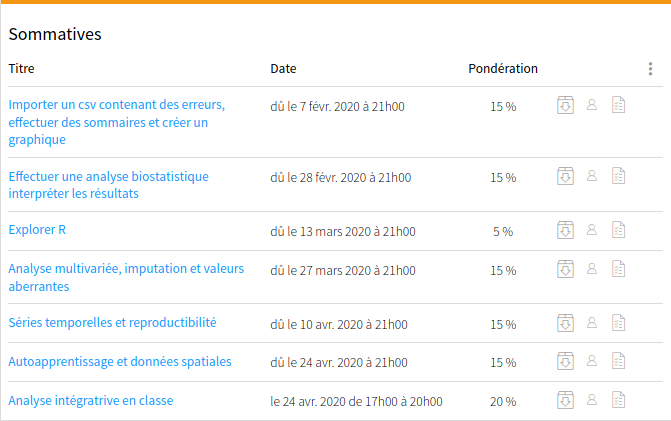

## Présentation

Serge-Étienne Parent, ingénieur écologue, prof. adjoint au Département des sols et de génie agroalimentaire à l'Université Laval

## Objectif général

Au terme du cours, les étudiant.e.s gradué.e.s en génie agroenvironnemental, génie civil, génie écologique, agronomie, biologie,
foresterie et écologie seront autonomes dans l'utilisation de R, l'analyse statistique descriptive, la visualisation, ainsi que la
modélisation inférentielle, prédictive et déterministe dans le domaine de l'agroenvironnement.

## Objectifs spécifiques (1/2)

Vous serez en mesure

- de programmer en langage R
- d'importer, de manipuler (sélection des colonnes, filtres, sommaires statistiques) et d'exporter des tableaux
- de générer des graphiques d'utilisation commune
- d'appréhender des données écologiques et agronomiques à l'aide de tests statistiques fréquentiels
- d'explorer par lui.elle-même les possibilités offertes par la communauté de développement de modules R
- d'explorer les données à l'aide des outils de l'écologie numérique (association, partitionnement et ordination)

## Objectifs spécifiques (2/2)

- d'imputer des données manquantes dans un tableau et de détecter des valeurs aberrantes
- d'effectuer une analyse de série temporelle
- de s'assurer que ses calculs soit auditables et reproductibles dans une perspective de science ouverte
- de créer un modèle d'autoapprentissage
- d'intrapoler des données spatiales
- de modéliser des équations différentielles ordinaires

## Démarche d'apprentissage

Les vidéos sont déjà en ligne. Ils ont été importé d'une session ultérieure. Il pourrait arriver qu'ils soient
mis à jour mineures au cours de la session. Leur version définitive sera disponible les vendredis, mais vous êtes libres de suivre le cours à votre rythme.

- Introduction: Que savez-vous?
- Activités d'apprentissage <--
- Exercices
- Autoévaluation: Qu'avez-vous appris?

## Encadrement

- Forum du site du cours
- Messagerie: 
  - Riot: @essicolo:matrix.org
  - Skype: sergeetienneparent
- Courriel: serge-etienne.parent.1@ulaval.ca

## Activités (1/2)

- Plan de cours et introduction à R
- Organisation des données et opérations sur des tableaux
- Visualisation
- Science ouverte et suivi de version
- Biostatistiques
- Explorer R

## Activités (2/2)

- Association, partitionnement et ordination
- Détection de valeurs aberrantes et imputation
- Les séries temporelles
- Autoapprentissage
- Les données spatiales
- Modélisation déterministe

## Évaluation

## Imprévus?

- **Retard**: -10% par jour
- **Absence** à l'examen final: me prévenir!

## Français

Maximum de -10% (-1 point par faute)

## Révision de note

C'est *votre* droit. Me contacter dans les 10 jours ouvrables suivant la publication des notes ([règlement des études](https://www.ulaval.ca/fileadmin/Secretaire_general/Reglements/Reglement_des_etudes.pdf)).

## Cote

## Matériel obligatoire

- Accéder à R (sur votre ordinateur ou sur un serveur)
- Notes de cours: [disponibles en ligne](https://essicolo.github.io/ecologie-mathematique-R/)