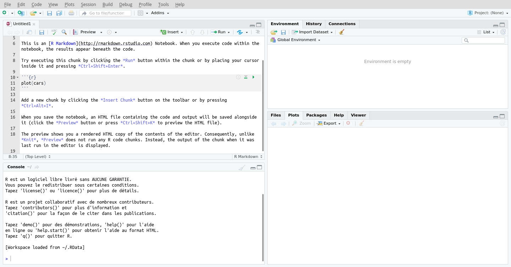

## L'écologie mathématique


## Le génie écologique

Le génie écologique, une discipline intimement liée à l’écologie mathématique, est voué à l’analyse, la modélisation, la conception et la construction de systèmes vivants dans le but de résoudre de manière efficace des problèmes liés à l’écologie et à une panoplie de domaines qui lui sont raccordés. 

## Les logiciels libres

> Liberté d’exécuter, copier, distribuer, étudier, modifier et améliorer.

Comme professionnel.le, vous êtes responsable des outils que vous utilisez: vous devez vous assurer de la bonne qualité d’un logiciel, qu’il soit propriétaire ou communautaire.

## Langages de programmation libres

- **R**. Le langage de programmation statistique libre.
- **Python**. Un langage de programmation libre et générique, largement utilisé en calcul scientifique.
- **Langages propriétaires**. Matlab, SAS, Mathematica, Maple, etc.

## La science des données avec R


## Objectifs spécifiques

À la fin de ce chapitre, vous

- saurez contextualiser la science des données par rapport aux statistiques,
- serez en mesure de vous lancer dans un environnement de programmation R,
- serez en mesure d’effectuer des opérations de base en R,
- saurez différencier les grands types d’objets de R et
- saurez installer et charger des modules complémentaire.

## Sciences des données vs Statistiques

- **Statistique**: l’étude des méthodes pour décrire et mesurer des aspects de la nature à partir d’échantillon (Whitlock et Schluter, 2015).
- **Sciences des données**: une discipline *excitante* permettant de transformer des données brutes en compréhension, perspectives et connaissances (Grolemund et Wickham, 2018).

## Flux de travail en sciences des données


<small>[Adapté de Grolemund et Wickham (2018)](https://r4ds.had.co.nz/introduction.html)</small>

## Installer R

#### Installation classique

- Windows et Mac [-->](https://cloud.r-project.org/)
- `r-base` (Ubuntu, Debian), `R-base` (openSuse) ou `R-core` (Fedora)

#### Installation Anaconda (Jupyter)

- Téléchargez [Anaconda](https://www.anaconda.com/), ouvrez Anaconda Navigator, installez RStudio ou bien créez un nouvel environnement R.
- Vous devriez être en mesure d'utiliser R dans Jupyter lab ou Jupyter notebook

## Premier aperçu de R


## RStudio



## RStudio

- R script ou R notebook?
- L'interface par projets
- Exécuter la ligne, le *chunk* ou le code en surbrillance: `Ctrl + Enter`

## Premiers pas en R

```{r}
2 + 2
```

- opérations `+`, `-`, `*`, `/` et `^` (ou `**`) respectant la précédence mathématique

```{r}
2 + 2 # ceci est un commentaire
```


## Assigner des objets à des variables

La flèche `<-` constitue le standard en R, mais le `=` est parfois utilisé.

```{r}
a <- 3
b <- 2
a + b
```

## Nom des objets (1/2)

R tient compte de la case.

```{r}
ours <- 4
# Ours
```

**Note**. Lisez-les attentivement les messages d'erreur: ils sont là pour vous aider.

## Nom des objects (2/2)

Éviter les majuscules, les points, les noms trop longs et d'utiliser des noms de fonction.

| Ok | Pas super |
| --- | --- |
| ours_brun | Ours.Brun |
| mod_lin1 | modele_lineaire_pH_CNS_ssSP |
| site_d | sd (fonction pour calculer l'écart-type) |

## Types de données (1/3)

### Nombres entiers

```{r}
rendement_arbre <- 50 # pomme/arbre
nombre_arbre <- 300 # arbre
nombre_pomme <- rendement_arbre * nombre_arbre
nombre_pomme
```

## Types de données (2/3)

### Chaîne de caractère

```{r}
a <- "L'ours"
b <- "polaire"
paste(a, b) # paste est une fonction pour laquelle on définit deux arguments, a et b
```

## Types de données (3/3)

### Booléenne

```{r}
a <- 21
a < 10
```

## Exercice

Essayer d'autres opérateurs d'égalité: `>`, `<=`, `>=`, `==` et `!=`

> **Truc**. Pour inverser une variable booléenne, utiliser `!`

```{r}
b <- a == 21
!b
```

## Les collections de données

- Vecteur
- Matrice
- Liste
- Tableau

## Vecteur

- Les vecteurs sont une série de valeurs *de même type*.
- Les valeurs sont assemblées par *concaténation* avec la fonction `c()`.

```{r}
espece <- c("Petromyzon marinus", "Lepisosteus osseus", "Amia calva", "Hiodon tergisus")
espece
```

## Accéder à un élément du vecteur

Avec les crochets! (en R, on commence les indices à compter à 1)

```{r}
espece[1]
```

## Créer un vecteur de nombres

```{r}
1:3
```

... c'est aussi créer un vecteur d'indices

```{r}
espece[1:3]
```

## Exercice

Pouvez-vous créer un vecteur d'indice avec la fonction `c()`?

## Solution

```{r}
espece[c(1, 3)]
```

Qu'est-ce que la commande `espece[-c(1, 3)]` donnerait comme réponse, selon vous?

## Matrice

- un assemblage rectangle (ou en plusieurs dimensions) de valeurs *de même type*

```{r}
mat <- matrix(c(1, 2, 3, 4, 5, 6, 7, 8, 9, 10, 11, 12), ncol=3) # ou nrow
colnames(mat) <- c('A', 'B', 'C')
rownames(mat) <- c('site_1', 'site_2', 'site_3', 'site_4')
mat
```

## Accéder aux éléments d'une matrice

```{r}
mat[2, 3] # une seule cellule
mat[, 3] # la colonne 3
mat[2, ] # la figne 2
mat[c(1, 3), c(2, 3)]
```

## Listes

- une collection hétérogène

```{r}
ma_liste <- list(especes = c('Petromyzon marinus', 'Lepisosteus osseus',
                             'Amia calva', 'Hiodon tergisus'),
                 site = 'A101',
                stations_meteos = c('746583', '783786', '856363'))
ma_liste
```

## Accéder aux éléments d'une matrice

```{r}
ma_liste[[2]]
```

```{r}
ma_liste$especes
```

## Exercice

Accéder au deuxième élément du vecteur d’espèces dans la liste ma_liste.

## Tableau

- liste composée de vecteurs de même longueur

```{r}
tableau <- data.frame(espece = c('Petromyzon marinus', 'Lepisosteus osseus',
                                'Amia calva', 'Hiodon tergisus'),
                     poids = c(10, 13, 21, 4),
                     longueur = c(35, 44, 50, 8))
tableau
```

## Exercice

Accéder aux éléments 3 et 4 des poids.

## Solution

```{r}
tableau$poids[c(3, 4)]
```


```{r}
tableau[c(3, 4), 2]
```

## Les fonctions (1/3)

Une fonction appelle à une transformation.


```{r}
mean(x = tableau$poids)
```

## Les fonctions (2/3)

Pour consulter la documentation, `?mean` ou mettre `mean` en surbrillance, puis appuyer sur F1.


## Les fonctions (3/3)

Définir ses propres fonctions, disons $z = x^3 - 2y + a$.

```{r}
calculer_z <- function(x, y, a = 10) {
  z <- x^3 - 2 * y + a
  return(z)
}
calculer_z(x = 2, y = 3, a = 1)
```

## Exercice

Trouvez par vous-même la commande qui vous permettra mesurer la longueur d'un vecteur.

## Les boucles (1/2)

Effectuer une opération similaire plusieurs fois.

```{r}
params <- data.frame(x = c(2, 4, 1, 5, 6),
                     y = c(3, 4, 8, 1, 0),
                     a = c(6, 1, 8, 2, 5))
calcul_res <- c() # option numériquement plus rapide: vector(length = nrow(params))

for (i in 1:nrow(params)) {
  print(paste('boucle:', i))
  calcul_res[i] <- calculer_z(x = params[i, 1],
                              y = params[i, 2],
                              a = params[i, 3])
}

calcul_res
```

## Les boucles (2/2)

Les boucles sont très utiles, mais de moins en moins nécessaires en R grâce aux fonctions que nous verrons au chapitre 3.

## Les conditions

```{r}
classification <- function(x, lim1=10, lim2=20)  {
    if (x < lim1) {
        categorie <- "faible"
    } else if (x < lim2) {
        categorie <- "moyen"
    } else {
        categorie <- "élevé"
    }
    return(categorie)
}
classification(-10)
```

## Exercice

Explorer les commandes `ifelse` et `cut` et réfléchissez à la manière qu’elles pourraient être utilisées pour effectuer une discrétisation plus efficacement qu’avec les `if` et les `else`.

## Les modules (1/2)


## Les modules (2/2)

**Note**. Pour accéder à une fonction sans charger le module, ou bien pour s'assurer que l'on utilise une fonction issue d'un module et non une autre d'un même nom (oui, ça arrive!), on peut appeler la fonction sous la forme `module::fonction`, par exemple `vegan::rda`.

## Retour sur les objectifs spécifiques

À la fin de ce chapitre, vous

- saurez contextualiser la science des données par rapport aux statistiques,
- serez en mesure de vous lancer dans un environnement de programmation R,
- serez en mesure d’effectuer des opérations de base en R,
- saurez différencier les grands types d’objets de R et
- saurez installer et charger des modules complémentaire.

## Exercices

À partir d’ici jusqu’à la fin du cours, nous utiliserons RStudio. Ouvrez-le et familiarisez-vous avec l’interface! Quelques petits trucs:

- pour lancer une ligne, placez votre curseur sur la ligne, puis appuyez sur Ctrl+Enter
- pour lancer une partie de code précise, mettez le en surbrillance, puis Ctrl+Enter
- utilisez toujours le gestionnaire de projets, en haut à droite!
- installez le module tidyverse
- lancez `data(iris)` pour obtenir un tableau d’exercice, puis cliquez sur l’objet dans la fenêtre environnement