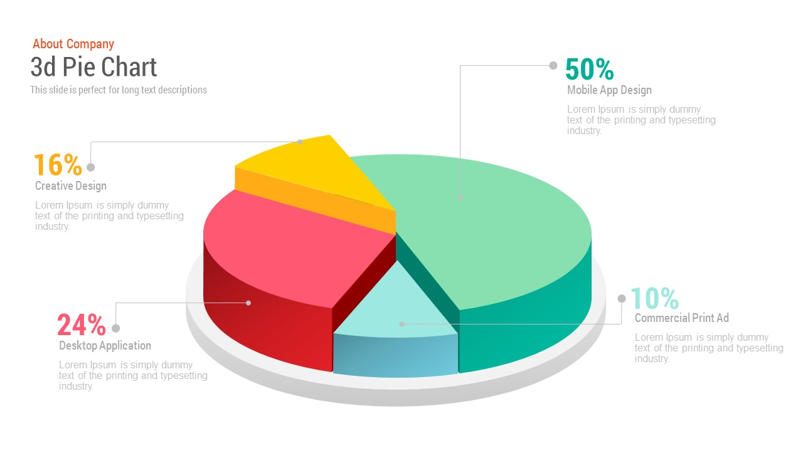
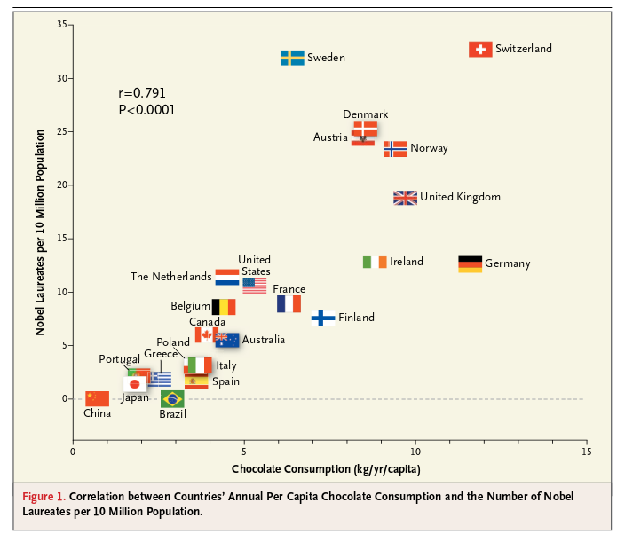

## Plan

<!-- 0. Intro -->

1. Les graphiques: avant de publier
2. Choisir le bon type de graphique
3. L'approche impérative et l'approche déclarative
4. Visualisation en R
5. Fermeture

## Objectifs spécifiques

À la fin de ce chapitre, vous

- comprendrez l'importance de l'exploration des données
- comprendrez les guides généraux pour créer un graphique approprié
- comprendrez la différence entre les modes impératifs et déclaratifs pour la création de graphique
- serez en mesure de créer des nuages de points, lignes, histogrammes, diagrammes en barres et boxplots en R
- saurez exporter un graphique en vue d'une publication

<!-- 1. Les tableaux et leur organisation -->

## 1. Les graphiques: avant de publier

## Un outil d'exploration

<!---->

<small>
<center>Animation montrant la progression du jeu de données *Datasaurus* pour toutes les formes visées. Source: [Same Stats, Different Graphs: Generating Datasets with Varied Appearance and Identical Statistics through Simulated Annealing](https://www.autodeskresearch.com/publications/samestats).</small>

## Cinq qualités d'un bon graphique

1. **Elle est véritable**, puisqu'elle est basée sur une recherche exhaustive et honnête.
2. **Elle est fonctionnelle**, puisqu'elle constitue une représentation précise des données, et qu'elle est construite de manière à laisser les observateurs.trices prendre des initiatives conséquentes.
3. **Elle est attrayante** et intrigante, et même esthétiquement plaisante pour l'audience visée - les scientifiques d'abord, mais aussi le public en général.
4. **Elle est pertinente**, puisqu'elle révèle des évidences scientifiques autrement difficilement accessibles.
5. **Elle est instructive**, parce que si l'on saisit et accepte les évidences scientifiques qu'elle décrit, cela changera notre perception pour le mieux.

## Qualité 1. Honnêteté

```{r}
library("tidyverse")
nasa_temp <- read_tsv("https://climate.nasa.gov/system/internal_resources/details/original/647_Global_Temperature_Data_File.txt",
                       col_names = c('year', 'temp', 'loess'))
```

##

```{r, fig.height=4, fig.width=6}
nasa_temp %>%
  #filter(year >= 1998 & year <= 2008) %>% 
  ggplot(mapping = aes(x = year, y = temp)) +
  geom_line()
```

## Qualité 2. Fonctionnelle


Source: [Slidebazaar](https://slidebazaar.com/items/free-3d-pie-chart-powerpoint-template/)

##

```{r, fig.height=4, fig.width=6}
market <- tibble(category = c("Creative Design", "Desktop Application", "Commercial Print Ad", "Mobile App Design"), proportion = c(16, 24, 10, 50))
market %>% 
  ggplot(mapping = aes(x = fct_reorder(category, proportion), y = proportion)) + geom_col() + labs(x = "", y = "Proportion") + coord_flip()
```

## Qualité 3. Visuel

```{r, fig.height=4, fig.width=6, warning=FALSE}
library("ggthemr")
ggthemr(palette = "dust", layout = "scientific", type = "outer")
market %>% 
  ggplot(mapping = aes(x = fct_reorder(category, proportion), y = proportion)) + geom_col() + labs(x = "", y = "Proportion") + coord_flip()
```

## Qualité 4. Pertinence


<center>Source: [GIEC, Bilan 2001 des changements climatiques : Les éléments scientifiques](https://www.ipcc.ch/pdf/climate-changes-2001/scientific-basis/scientific-spm-ts-fr.pdf)</center>

## Qualité 5. Instructive


Source: [Messerli, (2012)](https://www.nejm.org/doi/full/10.1056/NEJMon1211064)


<!-- 3. et 4. -->

## 3. Choisir le bon type de graphique

1. Mettez de l'ordre dans vos données.
1. Réfléchissez au message que vous désirez transmettre.
1. Essayez différentes représentations.
1. Testez le résultat.

## 

[](https://ft.com/vocabulary)


## 4. Différentes approches

**Impérative**. *Comment* placer l'information sur une canevas. Exemple: R-base, Matplotlib (Python), Excel.

**Déclarative**. Spécifier *quoi* afficher. Exemple: ggplot2, altair (Python).

> La visualisation déclarative vous permet de penser aux données et à leurs relations, plutôt que des détails accessoires.
>
> [*Jake Vanderplas, Declarative Statistical Visualization in Python with Altair*](https://www.youtube.com/watch?v=FytuB8nFHPQ) (ma traduction)

<!-- 5. Visualisation en R  -->

## 5. Visualisation en R

- R-base
- ggplot2 (et ses nombreuses extensions)
- plotly (et ggplotly)

## R-base

--> basculer vers les notes de cours.

## ggplot2

1. **Les données**. Votre tableau est bien sûr un argument nécessaire pour générer le graphique.
1. **Les marqueurs**. Un terme abstrait pour désigner les points, les lignes, les polygones, les barres, les flèches, etc.
1. **Les attributs encodés**. La position, la dimension, la couleur ou la forme que prendront les géométries. En ggplot2, on les nomme les *aesthetics*.
1. **Les attributs globaux**. Les attributs sont globaux lorsqu'ils sont constant (ils ne dépendent pas d'une variable). Les valeurs par défaut conviennent généralement, mais certains attributs peuvent être spécifiés: par exemple la forme ou la couleur des points, le type de ligne.
1. **Les thèmes**. Le thème du graphique peut être spécifié dans son ensemble, c'est-à-dire en utilisant un thème prédéfini, mais l'on peut modifier certains détails.

## ggplot2

--> basculer vers les notes de cours.


<!-- 6. Fermeture -->

## 6. Fermeture