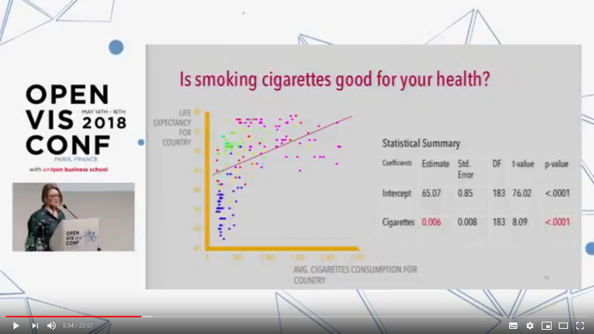
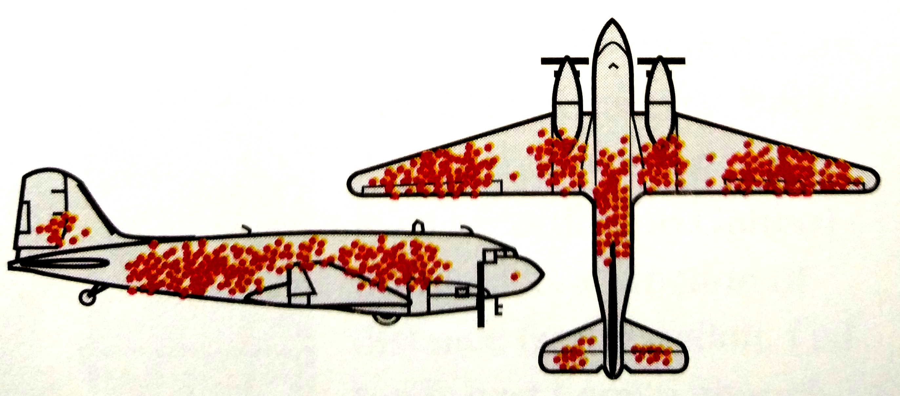

```{r, echo=FALSE, warning=FALSE, message=FALSE, results='hide', fig.keep='all'}
library("tidyverse")
library("nlme")
library("ggthemr")
ggthemr('dust')

library("agridat")
data("lasrosas.corn")

set.seed(8946)
espece <- c("Leptinosith darthvador", "Delia leia", "Pieris jaba")
n <- 20
dv <- tibble(espece = rep(espece[1], n), dommage = rnorm(n, 10, 5))
pl <- tibble(espece = rep(espece[2], n), dommage = rnorm(n, 7, 3))
jh <- tibble(espece = rep(espece[3], n), dommage = rnorm(n, 5, 3))
all <- bind_rows(dv, pl, jh)
write_csv(all, "data/bibittes.csv")

statut <- c("Totalement en désaccord", 
            "En désaccord",
            "Ni en accord, ni en désaccord",
            "En accord",
            "Totalement en accord")
statut_o <- factor(statut, levels = statut, ordered=TRUE)
```

## Objectifs spécifiques (1/2)

À la fin de ce chapitre, vous

- serez en mesure de définir les concpets de base en statistique: population, échantillon, variable, probabilité et distribution
- serez en mesure de calculer des statistiques descriptives de base: moyenne et écart-type, quartiles, maximum et minimum
- comprendrez les notions de test d’hypothèse, d’effet et de p-value, ainsi qu’éviter les erreurs communes dans leur interprétation

## Objectifs spécifiques (2/2)

- saurez effectuer une modélisation statistique linéaire simple, multiple et mixte, entre autre sur des catégories
- saurez effectuer une modélisation statistique non linéaire simple, multiple et mixte

## Tout commence par une question

Que voulez-vous exprimer?



[Source](https://www.youtube.com/watch?v=uw1Tag08dK4&feature=youtu.be)

## La question

Que voulez-vous exprimer?

.png)

[Source](https://www.youtube.com/watch?v=uw1Tag08dK4&feature=youtu.be)

## Où renforcer l'avion?

Disposition des trous de balle sur les avions britaniques de retour de leur sortie durant la deuxième guerre mondiale.


Source: Whitlock et Schuluter (2015), [The Analysis of Biological Data](http://whitlockschluter.zoology.ubc.ca/).

## Définitions

> La statistique est l’étude des méthodes pour mesurer des aspects de populations à partir d’échantillons et pour quantifier l'incertitude des mesures. (ma traduction de [Whitlock et Schuluter (2015)](http://whitlockschluter.zoology.ubc.ca/)).

## Population

Ensemble circonscrit du sujet d'étude.

## Échantillon

Sous-ensemble de la population.

Si l'échantillon est représentatif de la population (non biaisé), on peut extrapoler ses propriétés à la population (inférence).

## Variable aléatoire

Dimension d'un objet catractérisé par une distribution de probabilité.

## Probabilité

Une probabilité est la vraisemblance qu'un évènements se réalise chez un échantillon. 

## Distribution de probabilité

Une distribution décrit la probabilité d'obtenir une valeur (distribution discrète) ou une plage de valeurs (distribution continue) dans une échantillon pris au hasard d'une population.

Une distribution des probabilité est décrite par un ou plusieurs **paramètres**, par exemple une moyenne et un écart-type dans le cas d'une distribution normale.

## **Une** statistique

Une **statistique** est une estimation d'un paramètre calculée à partir des données, par exemple une moyenne et un écart-type échantillonnaux.

## Statistiques fréquentielles ou bayésiennes

**Fréquentielle**. Les données sont générées par des mécanismes stochastiques décrits par des distributions de probabilités, et nous cherchons à déterminer la probabilité que les données soient générées par ces mécanismes (p-valule). <-- approche la plus commune (et couverte dan ce chapitre)

## Statistiques fréquentielles ou bayésiennes

**Bayésienne**. Les paramètres et leur incertitude sont déterminés par les données et les connaissances préalables. <-- approche de plus en plus utilisée (effleurée dans le chapitre 6, en extra)

## Bayes ou freq?

Tout dépend de la question posée. 

- **Bayésien**: quelle est la probabilité qu'il y ait de la vie sur Mars?
- **Fréquentiel**: est-ce que les données sont conformes avec avec l'hypothèse de la vie sur Mars 

<small>exemple tirée du blogue [Dynamic Ecology](https://dynamicecology.wordpress.com/2011/10/11/frequentist-vs-bayesian-statistics-resources-to-help-you-choose/)</small>

## Plusieurs types de distribution

##

```{r, echo=FALSE, warning=FALSE, message=FALSE, results='hide', fig.keep='all'}
x <- 0:25
y <- dbinom(x = x, size = 25, prob = 0.5)
ggplot(data = tibble(x, y), mapping = aes(x, y)) +
  geom_segment(aes(x = x, xend = x, y = 0, yend = y), color = "grey50") +
  geom_point() +
  labs(title = "Binomiale",
       subtitle = "Nombre d'événements vrais obtenus après n tirages. Exemples: présence/absence.",
       y = "Fréquence")
```

## 

```{r, echo=FALSE, warning=FALSE, message=FALSE, results='hide', fig.keep='all'}
x <- 1:30
y <- dpois(x, lambda = 8)
ggplot(data = tibble(x, y), mapping = aes(x, y)) +
  geom_segment(aes(x = x, xend = x, y = 0, yend = y), color = "grey50") +
  geom_point() +
  labs(title = "Poisson",
       subtitle = "Nombre d’évènements se produisant dans l'espace ou dans le temps. Exemples: décomptes.",
       y = "Fréquence")
```

##

```{r, echo=FALSE, warning=FALSE, message=FALSE, results='hide', fig.keep='all'}
increment <- 0.01
x <- seq(-10, 10, by = increment)
y1 <- dnorm(x, mean = 0, sd = 1)
y2 <- dnorm(x, mean = 0, sd = 2)
y3 <- dnorm(x, mean = 0, sd = 3)
gg_norm <- tibble(x, `sd = 1` = y1, `sd = 2` = y2, `sd = 3` = y3) %>% gather(variable, value, -x)

ggplot(data = gg_norm, mapping = aes(x = x, y = value)) +
  geom_line(aes(colour = variable)) +
  labs(title = "Normale",
       subtitle = "L'aire sous la courbe entre deux valeurs désigne la probabilité d'obtention\nd'une valeur continue sur une certaine plage.",
       y = "Fréquence")

```

## Les tests d'hypothèse

Un test d'hypothèse permet de décider si une hypothèse est confirmée ou rejetée à un seuil de probabilité prédéterminé.

**H0**. L'hypothèse nulle propose l'absence d'effet statistique (c'est l'hypothèse de l'avocat du diable 😈) .

**H1**. L'hypothèse alternative propose l'inverse (😇).

## Exemple

Est-ce que les données sont conforment avec avec l'hypothèse de la vie sur Mars.

**H0**. Il n'y a pas de vie sur Mars.

**H1**. Il y a de la vie sur Mars.

## 

> **Dans une expérience, la confirmation de l'hypothèse nulle n'est pas un échec.**

## Test de t (Student) à deux échantillons

Comparaison des moyennes deux échantillons dont la distribution est normale et dont la variance est la même.

```{r, fig.height = 4, echo=FALSE, warning=FALSE, message=FALSE, results='hide', fig.keep='all'}
set.seed(562354)

n <- 30
a <- rnorm(n, 10, 3)
b <- rnorm(n, 8, 2)

exemple_ech <- tibble(a, b) %>% gather(echantillon, value)

ggplot(data = exemple_ech, mapping = aes(x = value)) +
  geom_histogram(mapping = aes(fill = echantillon), color = "grey35", bins = 10)

```

##

```{r}
exemple_ech %>% sample_n(5)
tt_exemple <- t.test(formula = value ~ echantillon,
                     data = exemple_ech, var.equal = TRUE)
tt_exemple
```

## Enregistrer les résultats dans un objet

```{r}
str(tt_exemple)
tt_exemple$p.value
```

## p-value (1/)

> "La p-value n'a jamais été conçue comme substitut au raisonnement scientifique" [Ron Wasserstein, directeur de l'American Statistical Association](https://phys.org/news/2016-03-american-statistical-association-statement-significance.html) [ma traduction]. 

## p-value (2/)

**Un résultat montrant une p-value plus élevée que 0.05 est-il pertinent?**

Lors d'une conférence, Dr Evil ne présentent que les résultats significatifs de ses essais au seuil de 0.05. Certains essais ne sont pas significatifs, mais bon, ceux-ci ne sont pas importants...


## Rappel

> **Dans une expérience, la confirmation de l'hypothèse nulle n'est pas un échec.**

## p-value: erreurs (3/)

1. Pour évaluer l'importance de l'effet: voir le coefficient. Pour évaluer son incertitude: voir son intervalle de confiance.
2. Il est tout aussi important de savoir que le traitement fonctionne que de savoir qu'il ne fonctionne pas.
3. Le seuil de 0.05 est arbitraire.

## p-value: p-hacking ou data dregging (4/)

Modifier les données ou la question posée dans le but d'obtenir une p-value < 0.05, c'est tricher.

## L'analyse de variance (ANOVA)

Comparaison des **moyennes** de plus de 2 groupes (à variance égale)

```{r}
pl_aov <- aov(Petal.Length ~ Species, iris)
summary(pl_aov)
```

## Modélisation statistique

$$Y = f\left( X \right)$$
$X$: variables prédictives / indépendantes / covariables / explicatives
$Y$: variables de sortie / réponse / dépendante

## Modèles prédictifs / explicatifs

----
<font size="8">⚠️ Ne pas confondre. ⚠</font>
----

Modèles **prédictifs**. Le modèle doit être testé sur des données qui n'ont pas servi à l'entraîner. (chapitre 12)

Modèle **explicatif**. Le modèle sert à tester des hypothèses. (chapitres 5)

## Variables fixes et aléatoires

**Variables fixes**: testées lors de l’expérience: dose du traitement, espèce/cultivar, météo, etc.

**Variables aléatoires**: sources de variation qui génèrent du bruit dans le modèle: les unités expérimentales ou le temps lors de mesures répétées.

## Modèle linéaire univarié

$$y = \beta_0 + \beta_1 x + \epsilon$$

## Modèle linéaire univarié

**Question**. Le rendement varie-t-il selon la dose d'azote?

**H0**. la dose d'azote n'affecte pas le rendement ($\beta_1 = 0$).

```{r, fig.height=4, echo=FALSE, warning=FALSE, message=FALSE, results='hide', fig.keep='all'}
ggplot(data = lasrosas.corn, mapping = aes(x = nitro, y = yield)) +
  geom_point()
```

## La fonction `lm`

```{r}
modlin_1 <- lm(yield ~ nitro, data = lasrosas.corn)
summary(modlin_1)
```

## `predict`

```{r, fig.height=4}
ggplot(data = lasrosas.corn, mapping = aes(x = nitro, y = yield)) +
  geom_point() +
  geom_line(data = tibble(nitro = lasrosas.corn$nitro, yield = predict(modlin_1)),
            size = 2, colour = "grey35")
```

## Analyse des résidus (1/)

**Résidus**: erreurs du modèle, $\epsilon = y - \hat{y}$, fonction `residuals()`.

```{r}
res_df <- data.frame(nitro = lasrosas.corn$nitro,
                     residus_lm = residuals(modlin_1))
res_df %>% sample_n(4)
```

## Analyse des résidus (2/)

- Pas de structure identifiable dans les résidus
- Distribution normale

```{r, fig.height=4, echo=FALSE, warning=FALSE, message=FALSE, results='hide', fig.keep='all'}
ggplot(res_df, aes(x = nitro, y = residus_lm)) +
  geom_point() +
  labs(x = "Dose N", y = "Résidus") +
  geom_hline(yintercept = 0, col = "grey35", size = 2)
```

## Modélisation linéaire multiple

$$ y = X \beta + \epsilon $$

## Modèles linéaires univariés avec variable catégorielle **nominale**

`topo` est la classe topographique

```{r}
lasrosas.corn[c(1, 35, 51, 67), ]
```

## Matrice-modèle avec intercept

```{r}
model.matrix(~ topo, lasrosas.corn)[c(1, 35, 51, 67), ]
```

## Matrice-modèle sans intercept

```{r}
model.matrix(~ 0 + topo, lasrosas.corn)[c(1, 35, 51, 67), ]
```

## Modèle linéaire sur des catégories = régression multiple

```{r}
mod_cat <- lm(yield ~ topo, lasrosas.corn)
summary(mod_cat)
```

## Du modèle linéaire à l'anova

```{r}
anova(mod_cat) # summary(aov(yield ~ topo, data = lasrosas.corn)
```

## Modèles linéaires univariés avec variable catégorielle **ordinale**

```{r}
model.matrix(~ statut_o)
```

## Régression linéaire multiple

```{r}
modlin_mult <- lm(yield ~ lat + long + nitro + topo + bv,
                  data = lasrosas.corn)
summary(modlin_mult)
```

## Standardiser les données pour comparer les effets

```{r}
scale_vec <- function(x) as.vector(scale(x)) # la fonction scale génère une matrice: nous désirons un vecteur
lasrosas.corn_sc <- lasrosas.corn %>%
  mutate_at(c("lat", "long", "nitro", "bv"), scale_vec)
```

##

```{r}
modlin_mult_sc <- lm(yield ~ lat + long + nitro + topo + bv,
                     data = lasrosas.corn_sc)
summary(modlin_mult_sc)
```

## Intéraction

Une intéraction est une pente additionnelle informant sur l'effet statistique combiné de deux variables.

Interface-formule: le symbole `:` appelle l'intéraction et le synbole `*` appelle les effets simples et les intéractions.

```{r}
modlin_int_sc <- lm(yield ~ nitro*topo,
                    data = lasrosas.corn_sc)
summary(modlin_int_sc)
```

## Modèles linéaires généralisées

Évaluer l'effet sur une variable entière, booléenne, factorielle, etc.

```{r, fig.height=4, echo=FALSE, warning=FALSE, message=FALSE, results='hide', fig.keep='all'}
cochran.wireworms %>% ggplot(aes(x = trt, y = worms)) + geom_boxplot()
```

## La fonction `glm`

```{r}
modglm_1 <- glm(worms ~ trt, cochran.wireworms, family = "poisson")
summary(modglm_1)
```

## Sur graphique

```{r, fig.height=3, fig.width=6, echo=FALSE, warning=FALSE, message=FALSE, results='hide', fig.keep='all'}
intervals <- tibble(Estimate = coefficients(modglm_1), # [-1] enlever l'intercept
                    LL = confint(modglm_1)[, 1], # [-1, ] enlever la première ligne, celle de l'intercept
                    UL = confint(modglm_1)[, 2],
                    variable = names(coefficients(modglm_1))) 

ggplot(data = intervals, mapping = aes(x = Estimate, y = variable)) +
  geom_vline(xintercept = 0, lty = 2) +
  geom_segment(mapping = aes(x = LL, xend = UL, 
                             y = variable, yend = variable)) +
  geom_point() +
  labs(x = "Coefficient", y = "")
```

## Modèles non-linéaires

```{r, echo=FALSE, warning=FALSE, message=FALSE, results='hide', fig.keep='all'}
engelstad.nitro %>%
  ggplot(aes(x = nitro, y = yield)) +
  facet_grid(year ~ loc) +
  geom_line() +
  geom_point() +
  ylim(c(0, 95))
```

## Mitscherlich

$$ y = A \left( 1 - e^{-R \left( E + x \right)} \right) $$

```{r, fig.height = 4, echo=FALSE, warning=FALSE, message=FALSE, results='hide', fig.keep='all'}
mitscherlich_f <- function(x, A, E, R) {
  A * (1 - exp(-R*(E + x)))
}

x <- seq(0, 350, by = 5)
y <- mitscherlich_f(x, A = 75, E = 30, R = 0.02)

ggplot(tibble(x, y), aes(x, y)) +
  geom_point(data = engelstad.nitro, aes(x = nitro, y = yield)) +
  geom_line() + ylim(c(0, 100)) +
  annotate("text", x = 300, y = 35, label = "A = 75,\nE = 30,\nR = 0.02")
```

## La focntion `nls`

```{r}
modnl_1 <-  nls(yield ~ A * (1 - exp(-R*(E + nitro))),
                data = engelstad.nitro,
                start = list(A = 75, E = 30, R = 0.02))
summary(modnl_1)
```

## Résidus

```{r, fig.height = 4}
tibble(res = residuals(modnl_1)) %>%
    ggplot(aes(x = res)) + geom_histogram(bins = 20)
```


## Modèles à effets mixtes

À la différence d'un effet fixe, un effet aléatoire ($b$) sur des variables aléatoires ($Z$) sera toujours distribué normalement avec une moyenne de 0 et une certaine variance. Pour un modèle à intercept aléatoire, nous aurons

$$ y = X \beta + Z b + \epsilon $$

Pour un modèle à pente aléatoire, nous aurons (à vérifier)

$$ y = X \left( \beta + Zb \right) + \epsilon $$


## La fonction `lme` du module nlme

`random = ~ slope|intercept`

```{r}
mmodlin_1 <- lme(fixed = yield ~ lat + long + nitro + topo + bv,
                 random = ~ 1|year/rep,
                 data = lasrosas.corn)
summary(mmodlin_1)
```

## Effet aléatoire

```{r}
ranef(mmodlin_1)
ranef(mmodlin_1)[[2]] %>% summarise(mean(`(Intercept)`))
```

## Modèles mixtes non-linéaires

```{r}
mm <- nlme(yield ~ A * (1 - exp(-R*(E + nitro))),
           data = engelstad.nitro, 
           start = c(A = 75, E = 30, R = 0.02), 
           fixed = list(A ~ 1, E ~ 1, R ~ 1), 
           random = A ~ year | loc)
summary(mm)
```

## Modèle mixte non-linéaire

```{r, echo=FALSE, warning=FALSE, message=FALSE, results='hide', fig.keep='all'}
engelstad.nitro %>%
  ggplot(aes(x = nitro, y = yield)) +
  facet_grid(year ~ loc) +
  geom_line(data = tibble(nitro = engelstad.nitro$nitro,
                          yield = predict(mm, level = 0)),
            colour = "grey35") +
  geom_point() +
  ylim(c(0, 95))
```


## Modélisation non-linéaire multiple

--> [Parent et al., 2018](https://www.frontiersin.org/articles/10.3389/fenvs.2017.00081/full)

## Objectifs spécifiques (1/2)

À la fin de ce chapitre, vous

- serez en mesure de définir les concpets de base en statistique: population, échantillon, variable, probabilité et distribution
- serez en mesure de calculer des statistiques descriptives de base: moyenne et écart-type, quartiles, maximum et minimum
- comprendrez les notions de test d’hypothèse, d’effet et de p-value, ainsi qu’éviter les erreurs communes dans leur interprétation

## Objectifs spécifiques (2/2)

- saurez effectuer une modélisation statistique linéaire simple, multiple et mixte, entre autre sur des catégories
- saurez effectuer une modélisation statistique non linéaire simple, multiple et mixte


