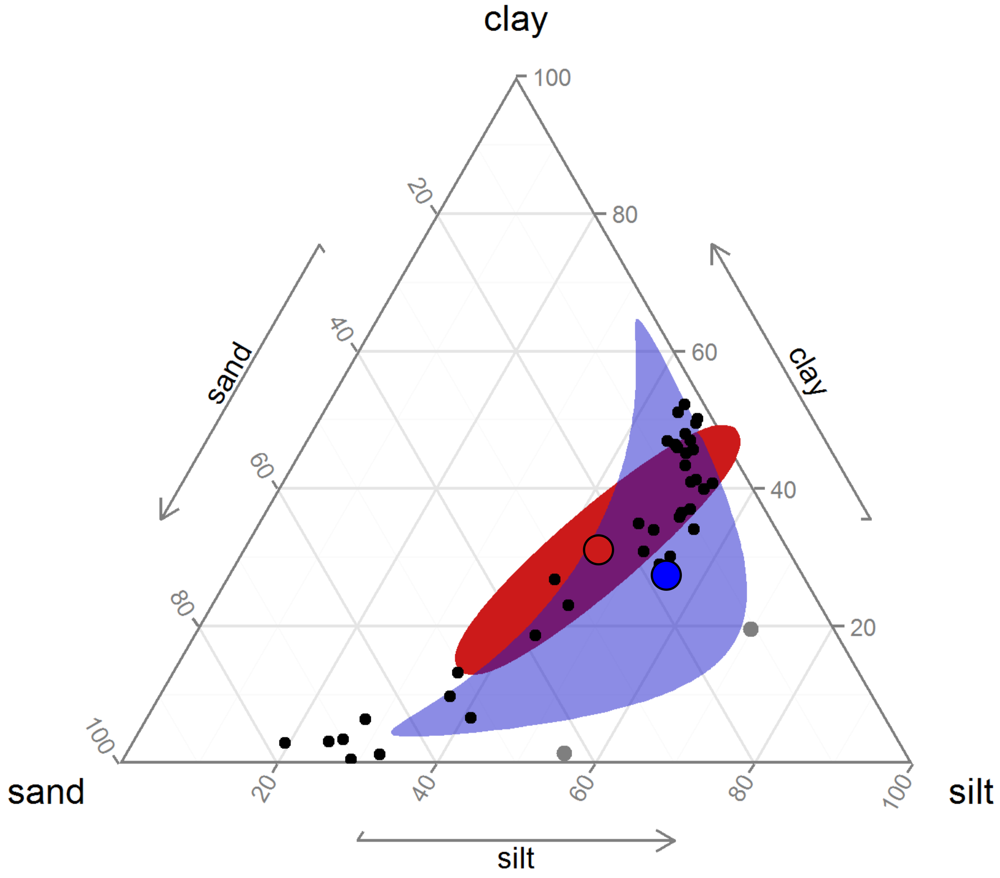
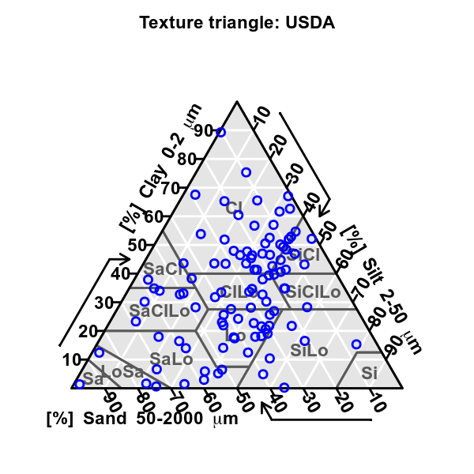

```{r, echo=FALSE, warning=FALSE, message=FALSE, results='hide', fig.keep='all'}
library("tidyverse")
```

## Objectifs spécifiques (1/)

À la fin de ce chapitre, vous

- serez en mesure d'identifier les sources d'information principales sur le développement de R et de ses modules
- comprendrez l'importance du prétraitement des données, en particulier dans le cadre de l'analyse de données compositionnelles, et saurez effectuer un prétraitement adéquat

## Objectifs spécifiques (2/)

- saurez comment acquérir des données météo d'Environnement Canada avec le module [weathercan](http://ropensci.github.io/weathercan/)
- saurez identifier les modules d'analyse de sols ([soiltexture](https://github.com/julienmoeys/soiltexture) et [aqp](http://ncss-tech.github.io/aqp/docs/))
- saurez comment débuter un projet de méta-analyse et de déploiement d'un logiciel sur R

## Explorer R


## Sur le web

- [Github](github.com)
- [Twitter](https://twitter.com/hashtag/rstats?src=hash)
- Nouvelles: [R-bloggers](https://www.r-bloggers.com/), [rOpenSci](https://news.ropensci.org/), [R Weekly](https://rweekly.org/), [Tidyverse](https://www.tidyverse.org/articles/)
- Support: [Stackoverflow](https://stackoverflow.com/questions/tagged/r), [Cross Validated](https://stats.stackexchange.com/questions/tagged/r), [r-sig-ecology](https://www.mail-archive.com/r-sig-ecology@r-project.org/info.html)

## Mise en garde

1. Le module est-il activement développé?
2. Le module est-il bien testé?
3. Le module est-il bien documenté?
4. Le module est-il largement utilisé?
5. Le module est-il développé par une personne ou une organisation crédible?

## R à Québec

[](http://raquebec.ulaval.ca/2019/)

## Prétraitement

- Standardisation: moyenne de 0 et écart-type de 1
- À l'échelle de la plage: pour préserver les zéro
- Normaliser: chaque vecteur a une longueur (norme) de 1
- Analyse compositionnelle

## Données compositionnelles (1/)

Variables relatives à un tout.

1. Redondance d'information (D-1 degrés de liberté pour une composition de D parties)

Sachant qu'une journée a 24 heures et que je passe 8 heures au travail, il reste implicitement 16 h hors du travail.

## Données compositionnelles (2/)

2. Dépendance d'échelle: Les stats ne devraient pas dépendre de la notion du "tout", qui est arbitraire.

Si je segmente la journée en plusieurs tâches au travail et plusieurs tâches hors du travail, les statistiques au travail ne devraient être influencées par le fait que les heures soient exprimées en proportion de mon temps de travail (/8h) ou en proportion de mon temps total (/24h).

## Données compositionnelles (3/)

3. Distribution théorique des données.

Les statistiques ne devraient pas admettre des proportions négatives ou dépassant 1 (ou 100%, ou 24h).



## Conséquence des biais *méthodologiques* (1/)

1. les régressions, les regroupements et les analyses en composantes principales peuvent avoir peu ou pas de signification
2. les propriétés des distributions peuvent être générées par l'opération de fermeture de la composition (s'assurer que le total des proportions donne 100%)

## Conséquence des biais *méthodologiques* (2/)

4. les résultats d'analyses discriminantes linéaires sont propices à être illusoires
5. tous les coefficients de corrélation seront affectés à des degrés inconnus
6. les résultats des tests d'hypothèses seront intrinsèquement faussés

## Prétraitement

$$alr_j = log \left( \frac{x_j}{x_{ref}} \right)$$
$$ clr_i = log \left( \frac{x_i}{g \left( x \right)} \right) $$
$$ ilr_j = \sqrt{\frac{n_j^+ n_j^-}{n_j^+ + n_j^-}} log \left( \frac{g \left( c_j^+ \right)}{g \left( c_j^+ \right)} \right) $$

## CoDa

```{r, warning=FALSE, message=FALSE}
library("compositions")
data("ArcticLake")
comp <- ArcticLake %>%
  as_tibble() %>% 
  select(-depth) %>%
  acomp(.)
```

## Diagramme ternaire

```{r fig.height=4, fig.width=6}
plot(comp)
```


## ILR

```{r fig.height=4, fig.width=6}
sbp <- matrix(c(1, 1,-1,
                1,-1, 0),
              byrow = TRUE,
              ncol = 3)
CoDaDendrogram(comp, V = gsi.buildilrBase(t(sbp)))
```

## Nommer les balances

`[Argile | Limon,Sable]`, `[Limon | Sable]`

## La SBP


## Météo (1/)

Rechercher une station par coordonnées

```{r}
library("weathercan")
station_site <- stations_search(coords = c(45.35, -71.90), dist = 20, interval = "hour")
station_site
```

## Météo (2/)

```{r}
mont_bellevue <- weather_dl(station_ids = c(5397, 48371), start = "2019-01-01", end = "2019-01-07")
mont_bellevue %>% 
  ggplot(aes(x = time, y = temp)) +
  geom_line(aes(colour = station_name))
```

## Pédométrie

- soiltexture
- aqp

## soiltexture (1/)

```{r fig.height=4, fig.width=4}
library("soiltexture")
rand_text <- TT.dataset(n=100, seed.val=29)
png("images/soiltexture_1.png", width = 600, height = 600, res = 90)
TT.plot(class.sys = "USDA.TT", 
        tri.data = rand_text,
        col = "blue")
dev.off()
```

## soiltexture (2/)



## soiltexture (3/)

```{r}
TT.points.in.classes(
  tri.data = rand_text[1:10, ], # 
  class.sys = "CA.FR.TT",
  PiC.type = "t"
)
```

## aqp (1/)

```{r, warning=FALSE, message=FALSE}
library("aqp")
profils <- read_csv("data/06_pedometric-profile.csv") %>% as.data.frame()
profils$soil_color <- munsell2rgb(profils$hue, profils$value, profils$chroma)
depths(profils) <- id ~ top + bottom
```

## aqp (2/)

```{r}
plot(profils, name="horizon")
```


## Méta-analyses (1/)

```{r}
library("meta")
meta_data <- read_csv("https://portal.uni-freiburg.de/imbi/_SUPPRESS_ACCESSRULE/lehre/lehrbuecher/meta-analysis-with-r/dataset02.csv")
meta_analyse <- metacont(n.e = Ne, mean.e = Me, sd.e = Se, n.c = Nc, mean.c = Mc, sd.c = Sc, data = meta_data, sm = "SMD")
```

## Méta-analyse (2/)

```{r}
meta_analyse
```


## Méta-analyses (3/)

```{r}
forest(meta_analyse)
```

## Créer des applications avec R

L'entreprise RStudio a créé [shiny](https://www.rstudio.com/products/shiny/) pour permettre le développement d'applications R.

https://essicolo.shinyapps.io/Mitscherlich/

## Objectifs spécifiques (1/)

À la fin de ce chapitre, vous

- serez en mesure d'identifier les sources d'information principales sur le développement de R et de ses modules
- comprendrez l'importance du prétraitement des données, en particulier dans le cadre de l'analyse de données compositionnelles, et saurez effectuer un prétraitement adéquat

## Objectifs spécifiques (2/)

- saurez comment acquérir des données météo d'Environnement Canada avec le module [weathercan](http://ropensci.github.io/weathercan/)
- saurez identifier les modules d'analyse de sols ([soiltexture](https://github.com/julienmoeys/soiltexture) et [aqp](http://ncss-tech.github.io/aqp/docs/))
- saurez comment débuter un projet de méta-analyse et de déploiement d'un logiciel sur R
