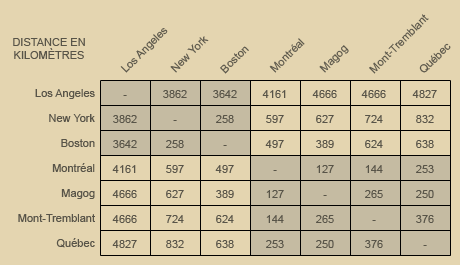
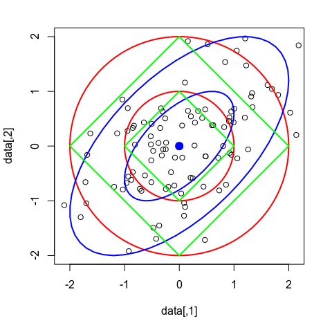
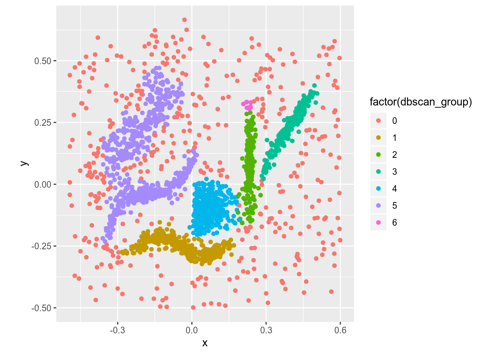
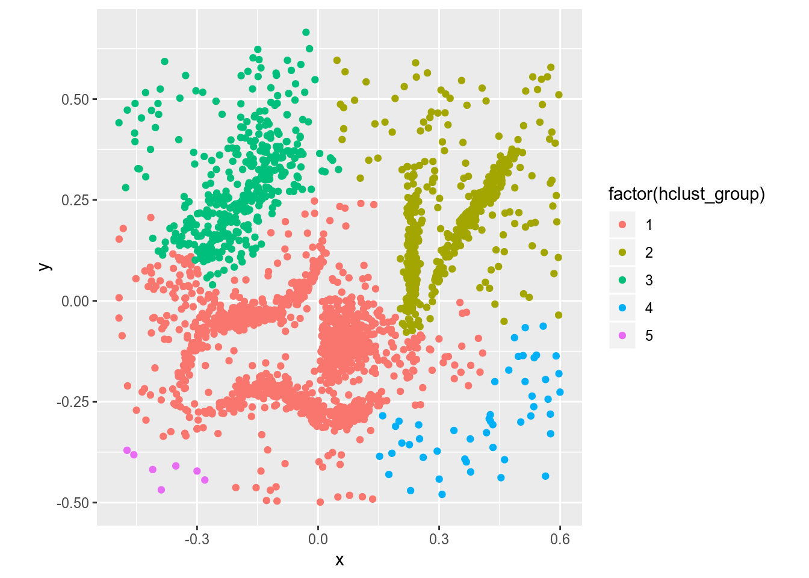
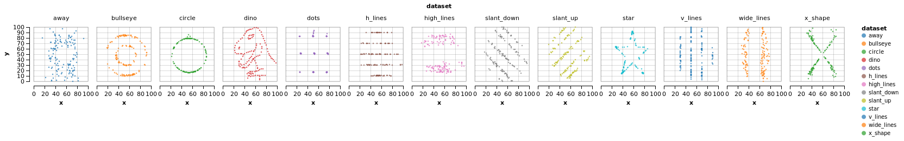
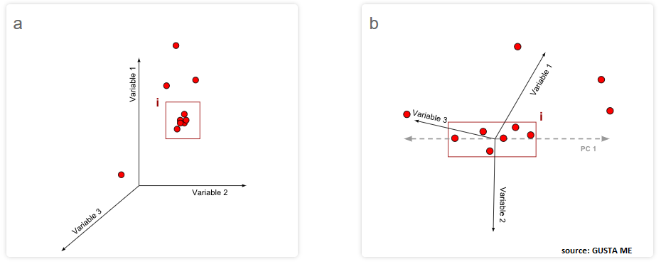
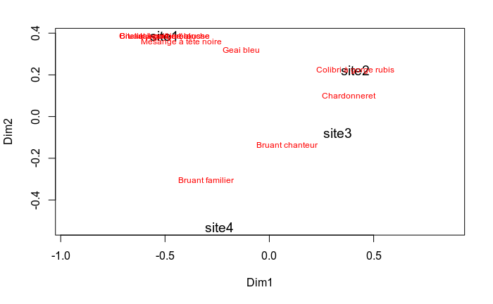

```{r, echo=FALSE, warning=FALSE, message=FALSE, results='hide', fig.keep='all'}
library("tidyverse")
library("pheatmap")
library("dbscan")
library("vegan")
library("ade4")

abundance <- tibble('Bruant familier' = c(1, 0, 0, 3),
                    'Citelle à poitrine rousse' = c(1, 0, 0, 0),
                    'Colibri à gorge rubis' = c(0, 1, 0, 0),
                    'Geai bleu' = c(3, 2, 0, 0),
                    'Bruant chanteur' = c(1, 0, 5, 2),
                    'Chardonneret' = c(0, 9, 6, 0),
                    'Bruant à gorge blanche' = c(1, 0, 0, 0),
                    'Mésange à tête noire' = c(20, 1, 1, 0),
                    'Jaseur boréal' = c(66, 0, 0, 0))
                    
occurence <- abundance %>%
  transmute_all(funs(if_else(. > 0, 1, 0)))
  
df_mcinnes <- read_csv("data/clusterable_data.csv", col_names = c("x", "y"), skip = 1)

data("iris")
data("varespec")
data("varechem")
data("doubs")
doubs_fish <- doubs$fish
doubs_env <- doubs$env
tot_spec <- doubs_fish %>%
  transmute(tot_spec = apply(., 1, sum))
doubs_fish <- doubs_fish %>%
  filter(tot_spec != 0)
doubs_env <- doubs_env %>%
  filter(tot_spec != 0)
```


## Objectifs spécifiques
À la fin de ce chapitre, vous

- serez en mesure d'effectuer des calculs permettant de mesurer des différence entre des observations, des groupes d'observation ou des variables observées
- serez en mesure d'effection des analyses de partitionnement hiérarchiques et non-hiérarchiques
- serez en mesure d'effectuer des calculs d'ordination à l'aide des techniques de réduction d'axe communes: analyse en composante principale, l'analyse de correspondance, l'analyse en coordonnées principales, analyse discriminante linéaire, l'analyse de redondance et l'analyse canonique des correspondances.

## Analyse d'associations
**Association**. Mesure pour quantifier la ressemblance (ou la différence) entre deux objets (échantillons) ou variables (descripteurs) numériques, ${\rm I\!R}$, d'abondance (${\rm I\!N}$), d'occurrence ($[0, 1]$), de catégories, etc.

## Mode R et mode Q
**Mode R**. Association entre variables (e.g. corrélation, covariance).

**Mode Q**. Association entre observations (e.g. similarité, distance).

## Distance vs dissimilarité

La distance est de 0 pour des objets identiques et augmente avec la différence.

La similarité (= 1 - dissimilarité) est de 0 pour les objets n'ayant aucun lien et de 1 pour une association parfaite.

## Exemple de matrice de distance



## Exemple de données d'abondance

```{r}
abundance
```

## Exemple de données d'occurence

```{r}
occurence
```

## Dissimilarité/distance d'abondance


## Dissimilarité de Bray-Curtis

```{r}
bray_curtis <- vegdist(abundance, method = "bray") # ?vegdist
pheatmap(bray_curtis, display_numbers = round(bray_curtis, 2)) # library("pheatmap")
```

## Dissimilarité/distance d'occurence


## Distance du $\chi^2$

```{r}
chi_square <- dist(decostand(occurence, method="chi.square")) # ?decostand
```

## Distance quantitative

- Euclidienne: attention à l'échelle
- Mahalanobis: inclu la covariance
- Manhattan: attention à l'échelle (gradients orthogonaux)
- Aitchison: données compositionnelles

## Distance euclidienne vs de Mahalanobis vs de Manhattan



## Dissimilarité mixtes
Distance de *Gower*: Jaccard (occurrence et catégories) + Manhattan. --> voir notes de cours.

## Quelle métrique choisir?

1. Type de données: abondance, occurrence, numérique, mixte
2. Pas de réponse claire:
- Consulter l'expérience dans la littérature
- Comparer l'équation mathématique à la question statistique

## Partitionnement (1/)
Catégoriser des objets qui n'appartiennent *a priori* à aucune catégori pour faire en sorte que les différences entre les groupes soient plus grande que les différences entre les objets d'un groupe.

## Partitionnement (2/)

- Critère d'association entre les groupes
- Nombre de groupe à créer
- Possibilité qu'une donnée n'appartienne à aucun groupe


## Partitionnement (3/)

Deux types:

- Non-hiérarchique: groupes non ordonnés (nombre de groupes *a priori*)
- Hiérarchique: séquence de groupes et de sous-groupes (nombre de groupes *a posteriori*)

## Non-hiérarchique: les *k-means* (1/)

Pour la plupart des algorithmes, les *k-means* se basent sur la distance euclidienne (mettre à l'échelle).


## Non-hiérarchique: les *k-means* (2/)

```{r, fig.height=5}
mcinnes_kmeans <- cascadeKM(df_mcinnes, inf.gr = 3, sup.gr = 10, criterion = "calinski")
plot(mcinnes_kmeans)
```

## Non-hiérarchique: les *k-means* (3/)


## Non-hiérarchique: *dbscan* (1/)

**dbscan**:  Density-Based Spatial Clustering of Applications with Noise
Les groupes sont composés de zones où l’on retrouve plus de points (zones denses) séparées par des zones de faible densité.

## Non-hiérarchique: *dbscan* (2/)


## Non-hiérarchique: *dbscan* (3/)


## Non-hiérarchique: *dbscan* (4/)

```{r}
mcinnes_dbscan <- dbscan(x = vegdist(df_mcinnes[, ], method = "euclidean"),
                         eps = 0.03, minPts = 10) # library("dbscan")
dbscan_group <- mcinnes_dbscan$cluster
```

## Non-hiérarchique: *dbscan* (5/)



## Hiérarchique: *hclust* (1/)
Basé sur les matrices d'association, puis sur différentes approches.

- **Single link**. Les groupes sont agglomérés sur la base des deux points parmi les groupes, qui sont les plus proches.
- **Complete link**. À la différence de la méthode single, on considère comme critère d’agglomération les éléments les plus éloignés de chaque groupe.
- **Agglomération centrale**. Il s’agit d’une famille de méthodes basées sur les différences entre les tendances centrales des objets ou des groupes.
- **Ward**. L’optimisation vise à minimiser les sommes des carrés par regroupement.

Choix de la meilleure méthode: corrélation cophénétique --> voir les notes de cours.

## Hiérarchique: *hclust* (2/)

```{r, fig.height=4}
mcinnes_hclust_distmat <- vegdist(df_mcinnes, method = "manhattan")
mcinnes_hclust <- hclust(mcinnes_hclust_distmat, method = "average")
plot(mcinnes_hclust)
```

## Hiérarchique: *hclust* (2/)


## Hiérarchique: *hclust* (3/)



## Hiérarchique: *hdbscan* (1/)

Idem *dbscan*, mais la distance critique est successivement augmentée.

```{r}
mcinnes_hdbscan <- hdbscan(x = vegdist(df_mcinnes, method = "euclidean"),
                           minPts = 20,
                           gen_hdbscan_tree = TRUE,
                           gen_simplified_tree = FALSE)
hdbscan_group <- mcinnes_hdbscan$cluster
```

## Hiérarchique: *hdbscan* (2/)

```{r, fig.height=5}
plot(mcinnes_hdbscan$hdbscan_tree)
```

## Hiérarchique: *hdbscan* (3/)
Nombre minimum d’objets par groupe de 20 (`minPts = 20`).

```{r, fig.height=5}
plot(mcinnes_hdbscan)
```

## Résultat des partitionnements


## Pas toujours facile




## Ordination

Réduction d'axe pour mettre de l’ordre dans des données dont le nombre élevé de variables peut amener à des difficultés d’interprétaion.

- Non-contraignante
- Contraignante

## Ordination non-contraignante

| Méthode | Distance préservée | Variables |
|---|---|---|
| Analyse en composantes principales (ACP) | Distance euclidienne | Données quantitatives, relations linéaires (attention aux double-zéros) |
| Analyse de correspondance (AC) | Distance de $\chi^2$ | Données non-négatives, dimentionnellement homogènes ou binaires, abondance ou occurence |
| Positionnement multidimensionnel (PoMd) | Toute mesure de dissimilarité | Données quantitatives, qualitatives nominales/ordinales ou mixtes |

## Analyse en composantes principales (1/)

Un sommaire d'un espace multidimensionnel en moindres dimensions (généralement 2). Les axes principaux sont orthogonales et construites par combinaisons linéaires des variables.



## Analyse en composantes principales: pourquoi faire? (2/)

Explorer la variabilité des points, la redondance des variables, des potentiels regroupements, des valeurs aberrantes, etc.

## Analyse en composantes principales: application (3/)

```{r, fig.height=4, fig.width=8}
iris_pca <- rda(iris %>% select(-Species), scale = TRUE)
par(mfrow = c(1, 2))
opl1 <- biplot(iris_pca, scaling = 1, main = "Biplot de distances") ; text(opl1, "species", col="red")
opl2 <- biplot(iris_pca, scaling = 2, main = "Biplot de corrélation") ; text(opl2, "species", col="red")
```

## Analyse en composantes principales: les biplots (4/)

**Biplot de distance**. Ce type de projection permet de visualiser la position des objets entre eux et par rapport aux descripteurs et d’apprécier la contribution des descripteurs pour créer les composantes principales. 

**Biplot de corrélation**. Cette projection permet d’apprécier les corrélations entre les descripteurs. Pour ce faire, les objets et les valeurs propres doivent être transformés. 

## Analyse en composantes principales: l'intertie (5/)

```{r, fig.height=3, fig.width=3}
prop_expl <- iris_pca$CA$eig / sum(iris_pca$CA$eig)
tibble(rank = seq_along(prop_expl), cum_prop = cumsum(prop_expl)) %>% 
  ggplot(aes(x = rank, y = cum_prop)) + geom_col()
```

## Analyse de correspondance (AC) (1/)

Réduction pour les données d'abondance ou d'occurence.

## Analyse de correspondance (AC) (2/)

```{r, fig.height=4, fig.width=8}
vare_cca <- cca(abundance %>% filter(rowSums(.) > 0))
par(mfrow = c(1, 2))
plot(vare_cca, scaling = 1, main = "Biplot des espèces")
plot(vare_cca, scaling = 2, main = "Biplot des sites")
```

## Analyse de correspondance (AC) (3/)

Le **biplot des espèces**, à gauche (`scaling = 1`), montre la distribution des sites selon les espèces.

Le **biplot des sites**, à droite (`scaling = 2`), montre la distribution des recouvrements d'espèces selon les sites.


## Positionnement multidimensionnel (PoMd) (1/)

Le PoMd vise à représenter en un nombre limité de dimensions (souvent 2) la distance (ou dissimilarité) qu'ont les objets (ou des variables) les uns par rapport aux autres dans l'espace multidimensionnel.

- Le **PoMd-métrique** vise à représenter fidèlement la distance entre les objets ou les variables.
- Le **PoMd-non-métrique** vise quant à lui à représenter l'ordre des distances entre les objets ou les variables.

## Positionnement multidimensionnel: application (PoMd) (2/)

```{r, fig.width=3, fig.height=2.4}
pheatmap(bray_curtis %>% as.matrix(), cluster_rows = FALSE, cluster_cols = FALSE,
         display_numbers = round(bray_curtis %>% as.matrix(), 2))
```

## Positionnement multidimensionnel: application (PoMd) (3/)

```{r}
pcoa <- cmdscale(bray_curtis, k = nrow(abundance)-1, eig = TRUE)
spec_scores <- wascores(pcoa$points, abundance)
```

## Positionnement multidimensionnel: ordiplot (PoMd) (4/)

```
ordiplot(scores(pcoa), type = 't', cex = 1.2)
text(spec_scores, row.names(spec_scores), col = "red", cex = 0.75)
```



## Quel type d'ordination non contraignante choisir?

Règle du pouce:

- Lorsque les données sont euclidiennes, l'analyse en composantes principales (ACP)
- Lorsque la métrique est celle du $\chi^2$, l'analyse de correspondance (AC). 
- Si la métrique est autre, le positionnement multidimensionel (PoMd) est préférable. 

## Ordination contraignante

- Analyse discriminante linéaire
- Analyse de redondance (RDA)
- Analyse canonique des correspondances (ACC)

## Analyse discriminante linéaire (1/) 

Présente la perspective selon laquelle les groupes sont les plus éclatés.

## Analyse discriminante linéaire (2/) 

```{r}
library("ade4")
iris_pca <- dudi.pca(df = iris %>% select(-Species),
                     scannf = FALSE, # ne pas générer de graphique
                     scale = TRUE)
iris_lda <- discrimin(dudi = iris_pca,
                      fac = iris$Species,
                      scannf = FALSE)
```

## Analyse discriminante linéaire (3/) 

```{r}
source("https://raw.githubusercontent.com/essicolo/AgFun/master/plotDA_gg.R")
plotDA(scores = iris_lda$li, loadings = iris_lda$fa, fac = iris$Species, level=0.95, facname = "Species", propLoadings = 1) 
```

## Analyse de redondance (1/)

Résumer les relations linéaires entre des variables réponse et des variables explicatives.

## Analyse de redondance (2/)

```{r, fig.height=6, fig.width=10}
vare_rda <- rda(varespec ~ ., data = varechem, scale = FALSE)
par(mfrow = c(1, 2))
ordiplot(vare_rda, scaling = 1, type = "text", main = "Scaling 1: triplot de distance")
ordiplot(vare_rda, scaling = 2, type = "text", main = "Scaling 2: triplot de corrélation")
```

## Analyse de redondance (3/)

**Triplot de distance**. Les angles entre les variables explicatives représentent leur corrélation (non pas les angles entre variables réponse), et les distances entre les objets indiquent leurs distances euclidiennes.

**Triplot de corrélation**. Les angles entre les variables représentent leurs corrélation, que les variables soient réponse ou explicative, ou entre variables réponses et variables explicatives. Les distances entre les objets sur le triplot ne sont pas des approximation de leur distance euclidienne.

## Analyse de redondance: test de permutation (4/)

```{r}
(perm_test_term <- anova(vare_rda, by = "term"))
```

## Analyse canonique des correspondances (1/)

Idem RDA, mais pour des données d'abondance et d'occurence.

```{r, fig.width=8, fig.height=4}
doubs_cca <- cca(doubs_fish ~ ., data = doubs_env, scale = FALSE)
par(mfrow = c(1, 2))
ordiplot(doubs_cca, scaling = 1, type = "text", main = "CCA - Scaling 1 - Triplot de distance")
ordiplot(doubs_cca, scaling = 2, type = "text", main = "CCA - Scaling 2 - Triplot de corrélation")
```
