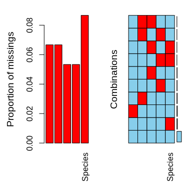
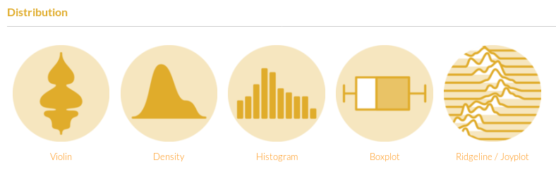

```{r, echo=FALSE, warning=FALSE, message=FALSE, results='hide', fig.keep='all'}
library("tidyverse")

# missing
library("VIM")
library("mice")

data("iris")

set.seed(128074)

data("iris")
iris_NA <- iris
n_NA <- 50
row_NA <- sample(1:nrow(iris), n_NA, replace = TRUE)
col_NA <- sample(1:ncol(iris), n_NA, replace = TRUE)
for (i in 1:n_NA) iris_NA[row_NA[i], col_NA[i]] <- NA

iris_NA_biais_1 <- tibble(Sepal.Length = c(5.3, NA, 4.9, NA, 4.7, NA),
                        Species = c("setosa", "versicolor", "setosa", "versicolor", "setosa", "versicolor"))

iris_NA_biais_2 <- tibble(Sepal.Length = c(5.3, 7.0, 4.6, 6.4, 4.8, 6.9),
                        Species = c("setosa", "versicolor", "setosa", "versicolor", "setosa", "versicolor"))


# outliers
library("mvoutlier")
library("compositions")
data("humus")
sbp <- matrix(c(1, 1,-1,-1,
                1,-1, 0, 0,
                0, 0, 1,-1), ncol = 4, byrow = TRUE)
ilr_elements <- humus %>%
        select(Al, Fe, K, Na) %>% 
        ilr(., V = gsi.buildilrBase(t(sbp))) %>% 
        as_tibble(.) %>% 
        rename(`[Al,Fe | K,Na]` = V1,
               `[Al | Fe]` = V2,
               `[K | Na]` = V3)

```


## Objectifs spécifiques

À la fin de ce chapitre, vous

- saurez comment procéder à l’imputation de valeurs manquantes en mode univarié et multivarié
- saurez comment détecter des valeurs aberrantes en mode univarié et multivarié

## Données manquantes

Donnée:

- perdue lors de la collecte ou du processus d'enregistrement des données,
- non mesurée en raison du dysfonctionnement d'un équipement,
- écartée en raison d'une contamination,
- oubliée
- non étudiée

## Données manquantes

```{r}
iris_NA %>% sample_n(6)
```

## Données manquantes: biais

```{r}
iris_NA_biais_1
mean(iris_NA_biais_1$Sepal.Length, na.rm = TRUE)
```

## Données manquantes: biais

```{r}
iris_NA_biais_2
mean(iris_NA_biais_2$Sepal.Length, na.rm = TRUE)
```

## Portrait des données manquantes: proportions

```{r, warning=FALSE}
iris_NA %>% 
        group_by(Species) %>% 
        summarise_each(funs(sum(is.na(.))/length(.)))
```

## Portrait des données manquantes: types de données manquantes

```{r out.width='70%', fig.align='center', fig.cap="(A) non-réponse univariée (B) non-réponse multivariée", echo = FALSE}
knitr::include_graphics('images/08_mv-types.png')
```

## Portrait des données manquantes: diagrammes (1/)

```{r, fig.width=4, fig.height=4}
VIM::matrixplot(iris_NA)
```

## Portrait des données manquantes: diagrammes (2/)

```
plot(VIM::aggr(iris_NA))
```

```{r out.width='40%', fig.align='center', echo = FALSE}

```

## Mécanismes des données manquantes

- Manquante complètement au hasard (MCAR). La probabilité d'absence est la même pour toutes les observations et ne dépend que de paramètres extérieurs indépendants de cette variable.
- Manquante au hasard (MAR). La probabilité de l'absence dépend de la valeur observée (univariée ou multivariée).
- Manquante non au hasard (MNAR). La probabilité qu'une valeur manque dépend d'une valeur non observée.

## Imputation

- Enlever les lignes où l'on trouve des données manquantes, ou bien des colonnes où l'on retrouve plusieurs données manquantes (MCAR)
- ~~Remplacer par la moyenne (MCAR ou MAR)~~
- **Imputation multiple: modélisation en fonction des données présentes**

## Imputation multiple

Remplacer les données manquantes par une estimation basée sur les distributions et les relations entre les covariables présentes.

## Imputation multiple avec MICE (MCAR)

```{r, results=FALSE}
iris_mice <- mice::mice(iris_NA, method = "rf") # rf pour random forest
iris_imp <- complete(iris_mice)
```

##

```{r, echo = FALSE}
iris_NA[!complete.cases(iris_NA), ]
```

##

```{r, echo = FALSE}
iris_imp[!complete.cases(iris_NA), ]
```

##

```{r, echo = FALSE}
iris[!complete.cases(iris_NA), ]
```

## Données aberrantes

**Définition**. Un scalaire ou un vecteur qui semble non conforme en regard des autres scalaires ou vecteurs dont on dispose pour les autres observations de l’échantillon.

## Données aberrantes

**Conséquences**. Estimateurs de paramètres biaisés, puis interprétation ou prédiction erronée.

## Origine des donnes aberrantes

- la variabilité inhérente mais inusitée
- erreur méthodologique
- erreur d'exécution (ou de transcription)

## Examiner la distribution



Source: [R graph gallery](https://www.r-graph-gallery.com/)


## Distribution

```{r, fig.height= 2.5}
ilr_elements %>%
  gather("balance", "value") %>% 
  ggplot(aes(x = value)) +
  geom_histogram(bins = 30) +
  facet_grid(. ~ balance)
```

## Bivarié

```{r, fig.height= 4}
plot(ilr_elements)
```

## Méthodes

Basées sur la distance

- Distance de Mahalanobis
- Distance de Mahalanobis robuste sur les PCA robustes

Basées sur le nombre de points

- Minimisation du volume minimum de l'ellipsoïde (MVE)
- Minimisation du déterminant - indicateur de dispersion (MCD)

## MVE et MCD

```{r message=FALSE}
library("MASS")
select <- dplyr::select # pour éviter que la fonction select du module MASS remplace celle de dplyr
min_in <- round(0.9 * nrow(ilr_elements)) # le minimum de points à garder, 90% du total
id_in <- cov.mve(ilr_elements, quantile.used = min_in)$best
is_in <- 1:nrow(ilr_elements) %in% id_in
```

## MVE et MCD

```{r message=FALSE}
plot(ilr_elements, col = is_in + 2)
```

## MVE et MCD

```{r}
sum(!is_in) / length(is_in)
```


## Distance

```{r}
is_out <- sign2(ilr_elements, qcrit = 0.975)$wfinal01 # sign1 pour la distance de Mahalanobis
plot(ilr_elements, col = is_out + 2)
```

## Distance

```{r}
sum(is_out == 0) / length(is_out)
```

## Et alors?

- Les méthodes MVE et MCD sont peu adaptées au distributions assymétriques.
- La méthode `sign1` suppose une distribution multinormale.
- La méthode `sign2` est robuste et s'applique sur divers types de distributions.

## Attention

Une donnée aberrante n'est pas nécessairement une mauvaise donnée.

## Objectifs spécifiques

À la fin de ce chapitre, vous

- saurez comment procéder à l’imputation de valeurs manquantes en mode univarié et multivarié
- saurez comment détecter des valeurs aberrantes en mode univarié et multivarié
