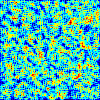
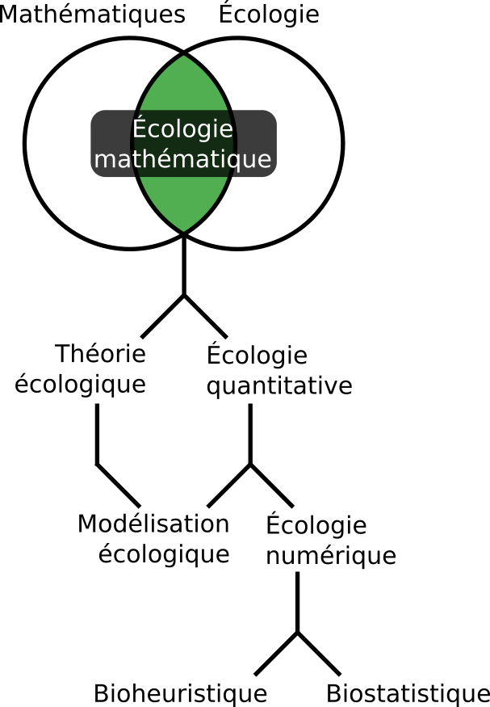

--- 
title: "Analyse et modélisation d'agroécosystèmes"
author: "Serge-Étienne Parent"
date: "`r Sys.Date()`"
site: bookdown::bookdown_site
output: bookdown::gitbook 
description: "Ce cours a pour objectif de former les étudiants gradués en génie agroenvironnemental, génie civil, génie écologique, agronomie, biologie, foresterie et écologie en analyse et modélisation de systèmes vivants. Les sujets traités sont l’introduction au langage de programmation R, l’analyse statistique descriptive, la visualisation, la modélisation inférentielle, prédictive et déterministe."
#bibliography: [book.bib, packages.bib]
#biblio-style: apalike
#link-citations: yes # bookdown::render_book("index.Rmd")
---

# Introduction {#chapitre-intro-cours}

En développant son jeu de la vie (*game of life*) en 1970, John Horton Connway a présenté un exemple percutant que des règles simples peuvent mener à des résultats inattendus. Le jeu consiste à placer des jetons sur les cases d'un plateau de jeu consistant en une simple grille orthogonale. Le jeu évolue en fonction du nombre de jetons présents parmi les huit cases du voisinage des jetons ou des cases vides.

1. Les jetons ayant 0 ou 1 voisin sont retirés.
2. Les jetons ayant 2 ou 3 voisins restent intacts
3. Les jetons ayant plus de 3 voisins sont retirés
4. Un jeton est posé sur les cases ayant exactement 3 voisins 

C'est tout. Selon la manière dont les jetons sont placés au départ, il se peut que la grille se vide de ses jetons, ou que les jetons y prennent beaucoup de place. Il arrive aussi que des cycles réguliers se dégagent ou que l'on se retrouve avec des formes régulières. Vous aurez peut-être compris à ce stade pourquoi le jeu est appelé "jeu de la vie". La première règle est une situation localisée de sous-population, condition dans laquelle la reproduction est difficile. La deuxième règle est une situation localisée stable. La troisième est une situation de surpopulation, où des individus meurent dans un environnement rendu inadéquat par une insuffisance de ressource ou une toxicité excessive. Enfin, la quatrième règle indique une situation favorable à la reproduction.

Une grille vidée correspond à une extinction et une grille remplie correspond à une explosion de population. Une oscillation est un "climax", un état stable en écologie. Un léger changement dans la disposition initiale des jetons peut mener à des solutions différentes.

Le jeu est une application de la technique des *automates cellulaires*. Il se complexifie à mesure que le nombre de jetons grandit. Un humain passera des heures à calculer une seule ronde à 50 jetons, commettra probablement quelques erreurs et prendra quelques cafés. Un processeur pourra gérer des centaines de rondes sur des grilles de centaines de jetons en quelques secondes.

En établissant des règles correspondant aux mécanismes de l'objet étudié, il devient possible de modéliser l'évolution des systèmes vivants, comme l'émergence ou le déclin d'espèces. La figure \@ref(fig:index-cellular-automata) présente un cas simple d'automates cellularies généré dans le langage de programmation R.

```{r index-cellular-automata, out.width="50%", fig.align="center", fig.cap="Simulation avec automates cellulaires [générés en R](https://www.r-bloggers.com/fast-conways-game-of-life-in-r/).", echo = FALSE}

```

## Définitions

Les mathématiques confèrent aux humains une capacité d'abstraction suffisamment complexe pour leur permettre de toucher les étoiles et les atomes, de comprendre le passé et de prédire le futur, de toucher l'infini et de goûter à l'éternité. À partir des maths, on a pu créer des outils de calcul qui permettent de projeter des images de l'univers, bien au-delà de la Voie lactée. Mais appréhender le vivant, tout près de nous, demeure une tâche complexe.

```{r index-ecologie-mathematique, out.width="40%", fig.align="center", fig.cap="Domaines scientifiques de l'écologie mathématique.", echo = FALSE}

```

L'écologie mathématique couvre un large spectre de domaines (figure \@ref(fig:index-ecologie-mathematique)), mais peut être divisée en deux branches: l'**écologie théorique** et l'**écologie quantitative** ([Legendre et Legendre, 2012](https://www.elsevier.com/books/numerical-ecology/legendre/978-0-444-53868-0)). Alors que l'écologie théorique s'intéresse à l'expression mathématique des mécanismes écologiques, l'écologie quantitative, plus empirique, en étudie principalement les phénomènes. La **modélisation écologique** vise à prévoir une situation selon des conditions données. Faisant partie à la fois de l'écologie théorique et de l'écologie quantitative, elle superpose souvent des mécanismes de l'écologie théorique et des phénomènes empiriques de l'écologie quantitative. L'**écologie numérique** comprend la branche descriptive de l'écologie quantitative, c'est-à-dire qu'elle s'intéresse à évaluer des effets à partir de données empiriques. L'exploration des données dans le but d'y découvrir des structures passe souvent par des techniques multivariées comme la classification hiérarchique ou la réduction d'axe (par exemple, l'analyse en composantes principales), qui sont davantage heuristiques (dans notre cas, **bioheuristique**) que statistiques. Les tests d'hypothèses et l'analyse des probabilités, quant à eux, relèvent de la **biostatistique**.

Le **génie écologique**, une discipline intimement liée à l'écologie mathématique, est voué à l'analyse, la modélisation, la conception et la construction de systèmes vivants dans le but de résoudre de manière efficace des problèmes liés à l'écologie et à une panoplie de domaines qui lui sont raccordés. L'agriculture est l'un de ces domaines. C'est d'emblée la discipline qui sera prisée dans ce manuel. Néanmoins, les principes qui seront discutés sont transférables à l'écologie générale.

## À qui s'adresse ce manuel?

Le cours vise à introduire des étudiant.e.s gradué.e.s en agronomie, biologie, écologie, sols, génie agroenvironnemental, génie civil et génie écologique à l'analyse et la modélisation dans leur domaine, tant pour les appuyer pour leurs travaux de recherche que pour leur fournir une trousse d'outil émancipatrice pour leur cheminement professionnel. Plus spécifiquement, vous serez accompagné à découvrir différents outils numériques qui vous permettront d'appréhender vos données, d'en faire émerger l'information et de construire des modèles. L'objectif de ce cours n'est pas de vous former en mathématique, mais de vous aider à les utiliser. En ce sens, **c'est un cours de pilotage, pas un cours de mécanique**. Vous ferez tout de même un peu de mécanique pour mieux comprendre les réactions de notre machine.

Bien que des connaissances en programmation et en statistiques aideront grandement les étudiant.e.s à appréhender ce document, une littératie informatique n'est pas requise. Dans tous les cas, quiconque voudra tirer profit de ce manuel devra faire preuve d'autonomie. Vous serez guidés vers des ressources et des références, mais je vous suggère vivement de développer votre propre bibliothèque adaptée à vos besoins et à votre manière de comprendre.

## Les logiciels libres

Tous les outils numériques qui sont proposés dans ce cours sont des logiciels libres:

> « Logiciel libre » [free software] désigne des logiciels qui respectent la liberté des utilisateurs. En gros, cela veut dire que les utilisateurs ont la liberté d'exécuter, copier, distribuer, étudier, modifier et améliorer ces logiciels. Ainsi, « logiciel libre » fait référence à la liberté, pas au prix1 (pour comprendre ce concept, vous devez penser à « liberté d'expression », pas à « entrée libre »). - [Projet GNU](https://www.gnu.org/philosophy/free-sw.fr.html)

Donc: codes sources ouverts, développement souvent communautaire, gratuité. Plusieurs [raisons éthiques](https://www.youtube.com/watch?v=Ag1AKIl_2GM), principalement liées au contrôle de l'environnement virtuel par les utilisateurs et les communautés, peuvent justifier l'utilisation de logiciels libres. Plusieurs raisons pratiques justifient aussi cette orientation. Les logiciels libres vous permettent de transporter vos outils avec vous, d'une entreprise à l'autre, au bureau, ou à la maison, et ce, sans vous soucier d'acheter de coûteuses licences.

Il existe tout de même des risques liés aux possibles erreurs dans les codes des logiciels communautaires. Ces risques sont d'ailleurs les mêmes que ceux liés aux logiciels propriétaires. Pour les scientifiques, une erreur peut mener à une étude retirée de la littérature et même, potentiellement, des politiques publiques mal avisées. Pour les ingénieurs, les conséquences pourraient être dramatiques. Mais retenez qu'en toute circonstance, **comme professionnel.le, vous êtes responsable des outils que vous utilisez: vous devez vous assurer de la bonne qualité d'un logiciel, qu'il soit propriétaire ou communautaire**.

Alors que la qualité des logiciels propriétaires est généralement suivie par audits, celle des logiciels libres est plutôt soumise à la vigilance communautaire. Chaque approche a ses avantages et inconvénients, mais elles ne sont pas exclusives. Ainsi les logiciels libres peuvent être audités à l'externe par quiconque décide de le faire. Différentes entreprises, souvent concurrentes, participent tant à cette vigilance qu'au développement des logiciels libres: elles en sont même souvent les instigatrices (comme [RStudio](https://www.rstudio.com/), [Anaconda](https://www.anaconda.com/) et [Enthought](https://www.enthought.com/)).

Par ailleurs, ce manuel est distribué librement sous licence Creative commons, selon les termes suivants.

<a rel="license" href="http://creativecommons.org/licenses/by-nc-sa/4.0/"></a><br /><span xmlns:dct="http://purl.org/dc/terms/" href="http://purl.org/dc/dcmitype/Text" property="dct:title" rel="dct:type">Analyse et modélisation d’agroécosystèmes</span> de <a xmlns:cc="http://creativecommons.org/ns#" href="https://essicolo.github.io/ecologie-mathematique-R/" property="cc:attributionName" rel="cc:attributionURL">Serge-Étienne Parent</a> est mis à disposition selon les termes de la <a rel="license" href="http://creativecommons.org/licenses/by-nc-sa/4.0/">licence Creative Commons Attribution - Pas d’Utilisation Commerciale - Partage dans les Mêmes Conditions 4.0 International</a>.<br />Fondé(e) sur une œuvre à <a xmlns:dct="http://purl.org/dc/terms/" href="https://github.com/essicolo/ecologie-mathematique-R" rel="dct:source">https://github.com/essicolo/ecologie-mathematique-R</a>.

## Langage de programmation

### R

Ce cours est basé sur le langage [R](https://www.r-project.org/). En plus d'être libre, R est un langage de programmation dynamique largement utilisé dans le monde universitaire, et dont l'utilisation s'étend de manière soutenue hors des tours d'ivoire.

> R is also the name of a popular programming language used by a growing number of data analysts inside corporations and academia.  It is becoming their lingua franca partly because data mining has entered a golden age, whether being used to set ad prices, find new drugs more quickly or fine-tune financial models. [New York Times, janvier 2009](https://www.nytimes.com/2009/01/07/technology/business-computing/07program.html)

Son développement est supporté par la [R Foundation for Statistical Computing](https://www.r-project.org/foundation/), basée à l'Université de Vienne. Également, l'équipe de [RStudio](https://www.rstudio.com/) contribue largement au [développement de modules génériques](https://www.rstudio.com/products/rpackages/). R est principalement utilisé pour le calcul statistique, mais les récents développements le rendent un outil de choix pour tout ce qui entoure la science des données, de l'interaction avec les bases de données au déploiement d'outils d'intelligence artificielle en passant par la visualisation. Une fois implémenté avec des modules de calcul scientifique spécialisés en biologie, en écologie et en agronomie (que nous couvrirons au long du cours), R devient un outil de calcul convivial, rapide et fiable.

### Pourquoi pas Python?

La [première mouture de ce cours](https://github.com/essicolo/ecologie-mathematique-Py) se fondait sur le langage Python. Tout comme R, Python est un langage de programmation dynamique prisé pour le calcul scientifique. Python est un langage générique apprécié pour sa polyvalence et sa simplicité. Python est utilisé autant pour créer des logiciels ou des sites web que pour le calcul scientifique. Ainsi, Python peut être utilisé en interopérabilité avec une panoplie de logiciels libres, comme [QGIS](http://www.qgis.org) pour la cartographie et [FreeCAD](https://github.com/FreeCAD/FreeCAD) pour le dessin technique. Il est particulièrement apprécié en ingénierie pour ses modules de calcul par éléments finis (e.g. [FeNICS](https://fenicsproject.org/)) et en bioinformatique pour ses outils liés au séquençage ([scikit-bio](http://scikit-bio.org/)), mais ses lacunes en analyse statistique, en particulier en statistiques multivariées m'ont amené à favoriser R.

Bien que leurs possibilités se superposent largement, ce serait une erreur d'aborder R et Python comme des langages rivaux. Les deux langages s'expriment de manière similaire et s'inspirent mutuellement: apprendre à travailler avec l'un revient à apprendre l'autre. Les spécialistes en calcul scientifique tendent à apprendre à travailler avec plus d'un langage de programmation. Par ailleurs, il existe de plus en plus des moyens de travailler en R et en Python dans un même flux de travail. L'interface de calcul RStudio, que nous utiliserons pendant le cours, permet d'inclure des blocs de code en Python.

### Pourquoi pas Matlab?

Parce qu'on est en `r format(Sys.Date(), "%Y")`.

### Et... SAS?

Parce qu'on est à l'université.

### Mais pourquoi pas ______ ?

D'autres langages, comme [Julia](http://julialang.org), [Scala](http://www.scala-lang.org), [Javascript](https://dtabio.gitbooks.io/data-science-with-javascript/content/) et même [Ruby](http://sciruby.com) sont utilisés en calcul scientifique. Ils sont néanmoins moins garnis et moins documentés que R. Des langages de plus bas niveau, comme Fortran et C++, viennent souvent appuyer les fonctions des autres langages: ces langages sont plus ardus à utiliser au jour le jour, mais leur rapidité de calcul est imbattable.

## Contenu du manuel

Je favorise une l'approche intuitive aux développements mathématiques. Nous aborderons l’analyse et la modélisation inférentielle, prédictive et mécanistique appliquée aux agroécosystèmes.

**Chapitre \@ref(chapitre-intro-a-R) - Introduction au langage de programmation R**. Qu'est-ce que R? Comment l'aborder? Quelles sont les fonctionnalités de base et comment tirer profit de tout l'écosystème de programmation?

**Chapitre \@ref(chapitre-tableaux) - Organisation des données et opérations sur des tableaux**. Les tableaux permettent d'enchâsser l'information dans un format prêt-à-porter pour R. Comment les importer, les exporter, les filtrer, et en faire des sommaires?

**Chapitre \@ref(chapitre-visualisation) - Visualisation**. Comment présenter l'information contenue dans un long tableau en un seul coup d'oeil?

**Chapitre \@ref(chapitre-git) - Le travail collaboratif, le suivi de version et la science ouverte**. Ce chapitre offre une introduction à l'utilisation des outils de calcul collaboratif, ainsi qu'un aperçu du système de suivi de version *git* et de son utilisation sur [GitHub](https://github.com/).

**Chapitre \@ref(chapitre-biostats) - Biostatistiques**. Il est audacieux de ne consacrer qu'un seul chapitre sur ce vaste sujet. Nous irons à l'essentiel... pour vous donner les outils qui permettront d'approfondir le sujet.

**Chapitre \@ref(chapitre-biostats-bayes) - Biostatistiques bayésiennes (section facultative)**. Une très brève introduction pour qui est intéressé à l'analyse bayésienne.

**Chapitre \@ref(chapitre-explorer) - Explorer R**. La science des données évolue rapidement. Vous gagnerez à vous tenir au courrant de son évolution, et immanquablement vous vous buterez sur des opérations qui vous sembleront insolubles. Ce chapitre vous accompagnera à rester à jour sur le développement de R, à poser de bonnes questions et proposera des modules intéressants en écologie mathématique.

**Chapitre \@ref(chapitre-ordination) - Association, partitionnement et ordination**. Les écosystèmes diffèrent, mais en quoi sont-ils semblables, et en quoi dffèrent-ils? Ces questions importantes peuvent être abordés par l'écologie numérique, domaine d'étude au sein duquel l'association, le partitionnement et l'ordination sont des outils prédominants.

**Chapitre \@ref(chapitre-outliers) - Détection de valeurs aberrantes et imputation**. Une donnée aberrante sortira du lot, pour une raison ou pour une autre. Comment les détecter de manière systématique? D'autre part, que faire lorsqu'une donnée est manquante? Peut-on l'imputer? Comment?

**Chapitre \@ref(chapitre-ml) - L'autoapprentissage**. Les applications de l'intelligence artificielle ne sont limitées que par votre imagination. Encore faut-il l'utiliser... intelligemment.

**Chapitre \@ref(chapitre-temps) - Les séries temporelles**. Les capteurs modernes permettent de générer des données en fonction du temps. Que ce soit des données météorologiques enregistrées quotidiennement ou des données de teneur en eau enregistrées au 5 secondes, les données en fonction du temps forment un signal. Comment analyser ces signaux?

**Chapitre \@ref(chapitre-geo) - Les données spatiales**. Non, nous n'aborderons pas les géostatistiques. Ce chapitre porte plutôt sur l'utilisation de R comme système d'information géographique de base. Nous utiliserons aussi l'autoapprentissage comme outil d'interpolation spatial.

**Chapitre \@ref(chapitre-ode) - La modélisation mécanistique (section facultative)**. Les modèles sont des maquettes simplifiées. Comment utiliser les équations différentielles ordinaires pour créer ces maquettes?

Si les chapitres 3 à 5 peuvent être considérés comme fondamentaux pour bien maîtriser R, les autres peuvent être feuilletés à la pièce, bien qu'ils forment une suite logique.

Chaque chapitre de ce manuel est rédigé en format  *R markdown*, dans un environnement RStudio. Pour exécuter les commandes, les vous pourrez soit copier-coller les commandes dans R (ou RStudio), soit [télécharger les fichiers-sources](https://github.com/essicolo/ecologie-mathematique-R) et exécuter les blocs de code.

## Objectifs généraux

À la fin du cours, vous serez en mesure:

- de programmer en langage R
- d'importer, de manipuler (sélection des colonnes, filtres, sommaires statistiques) et d'exporter des tableaux
- de générer des graphiques d'utilisation commune
- de vous assurer que ses calculs soit auditables et reproductibles dans une perspective de science ouverte
- d'appréhender des données écologiques et agronomiques à l'aide de tests statistiques fréquentiels
- d'explorer par vous-même les possibilités offertes par la communauté de développement de modules R
- d'explorer les données à l'aide des outils de l'écologie numérique (association, partitionnement et ordination)
- d'imputer des données manquantes dans un tableau et de détecter des valeurs aberrantes
- de créer un modèle d'autoapprentissage
- d'effectuer une analyse de série temporelle
- d'intrapoler des données spatiales
- de modéliser des équations différentielles ordinaires

## Lectures complémentaires

### Écologie mathématique

- [How to be a quantitative ecologist](). Jason Mathipoulos vous prend par la main pour découvrir les notions de mathématiques fondamentales en écologie, appliquées avec le langage R.  
- [Numerical ecology](https://www.elsevier.com/books/numerical-ecology/legendre/978-0-444-53868-0). L'ouvrage hautement détaillé des frères Legendre est non seulement fondamental, mais aussi fondateur d'une science qui évolue encore aujourd'hui: l'analyse des données écologiques.
- [A practical guide to ecological modelling](http://www.springer.com/us/book/9781402086236). Soetaert et Herman portent une attention particulière à la présentation des principes de modélisation dans un langage accessible - ce qui est rarement le cas dans le domaine de la modélisation. Les modèles présentés concernent principalement les bilans de masse, en termes de systèmes de réactions chimiques et de relations biologiques.
- [Modélisation mathématique en écologie](http://www.documentation.ird.fr/hor/fdi:010050350). Rare livre en modélisation écologique publié en français, la première partie s'attarde aux concepts mathématiques, alors que la deuxième planche à les appliquer. Si le haut niveau d'abstraction de la première partie vous rebute, n'hésitez pas débuter par la seconde partie et de vous référer à la première au besoin.
- [A new ecology: systems perspective](https://www.elsevier.com/books/a-new-ecology/jorgensen/978-0-444-53160-5). Principalement grâce au soleil, la Terre forme un ensemble de gradients d'énergie qui se déclinent en des systèmes d'une étonnante complexité. C'est ainsi que le regretté Sven Erik Jørgensen (1934-2016, figure \@ref(fig:se-jorgensen)) et ses collaborateurs décrivent les écosystèmes dans cet ouvrage qui fait suite aux travaux fondateurs de Howard Thomas Odum.
- Ecological engineering. Principle and Practice.
- Ecological processes handbook.
- Modeling complex ecological dynamics

```{r se-jorgensen, out.width="25%", fig.align="center", fig.cap="Sven Erik Jørgensen, Source: [Elsevier](http://scitechconnect.elsevier.com/in-memoriam-of-dr-sven-erik-jorgensen/).", echo = FALSE}

```

### Programmation

- [R for data science](http://r4ds.had.co.nz/). L'analyse de données est une branche importante de l'écologie mathématique. Ce manuel traite des matrices et la manipulation de données chapitre 3), de la visualisation (chapitre 4) ainsi que de l'apprentissage automatique (chapitre 11). *R for data science* repasse ces sujets plus en profondeur. En particulier, l'ouvrage de [Garrett Grolemund](https://twitter.com/StatGarrett) et [Hadley Wickham](https://twitter.com/hadleywickham) offre une introduction au module graphique `ggplot2`.
- [Numerical ecology with R](http://www.springer.com/la/book/9781441979759). Daniel Borcard enseigne l'écologie numérique à l'Université de Montréal. Son cours est condensé dans ce livre recettes voué à l'application des principes lourdement décrits dans [Numerical ecology](https://www.elsevier.com/books/numerical-ecology/legendre/978-0-444-53868-0).

### Divers

- [The truthful art](http://www.thefunctionalart.com/p/the-truthful-art-book.html). Dans cet ouvrage, Alberto Cairo s'intéresse à l'utilisation des données et de leurs présentations pour fournir une information adéquate à différents publics.

## Besoin d'aide?

Les ouvrages de référence reconnus vous offrent des bases solides sur lesquelles vous pouvez vous appuyer dans vos travaux. Mais au-delà des principes, au jour le jour, vous vous buterez immanquablement à toutes sortes de petits problèmes. Quel module utiliser pour cette tâche précise? Que veut dire ce message d'erreur? Comment interpréter ce résultat? Pour tous les petits accrocs du quotidien en calcul scientifique, internet offre de nombreuses ressources qui sont très hétérogènes en qualité. Vous apprendrez à reconnaître les ressources fiables à celles qui sont douteuses. Les plateformes basées sur Stack Exchange, comme [Stack Overflow](https://stackoverflow.com) et [Cross Validated](https://stats.stackexchange.com), m'ont souvent été d'une aide précieuse. Vous aurez avantage à vous construire une petite banque d'information avec un logiciel de prise de notes en collectant des liens, en prenant en notes certaines recettes et en suivant des sites d'intérêt avec des flux RSS.

## À propos de l'auteur

Je m'appelle Serge-Étienne Parent. Je suis ingénieur écologue et professeur adjoint au Département des sols et de génie agroalimentaire de l'Université Laval, Québec, Canada. Je crois que la science est le meilleur moyen d'appréhender le monde pour prendre des décisions avisées.

## Un cours complémentaire à d'autres cours

Ce cours a été développé pour ouvrir des perspectives mathématiques en écologie et en agronomie à la FSAA de l'Université Laval. Il est complémentaire à certains cours offerts dans d'autres institutions académiques au Québec, dont ceux-ci.

- [BIO2041. Biostatistiques 1](https://admission.umontreal.ca/cours-et-horaires/cours/bio-2041/), Université de Montréal
- [BIO2042. Biostatistiques 2](https://admission.umontreal.ca/cours-et-horaires/cours/BIO-2042/), Université de Montréal
- [BIO109. Introduction à la programmation scientifique](https://github.com/EcoNumUdS/BIO109), Université de Sherbrooke
- [BIO500. Méthodes en écologie computationnelle](https://github.com/EcoNumUdS/BIO500), Université de Sherbrooke.

## Contribuer au manuel

Je suis ouvert aux commentaires et suggestions. Pour contribuer directement, dirigez-vous sur le dépôt du manuel sur [GitHub](https://github.com), puis ouvrez une *Issue* pour en discuter. Créez une nouvelle branche (*fork*), effectuez les modifications, puis lancer une requête de fusion (*pull resquest*).
